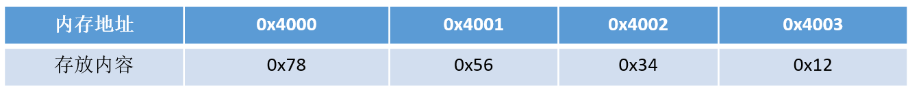
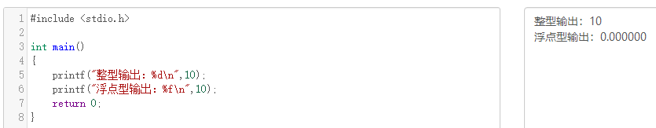
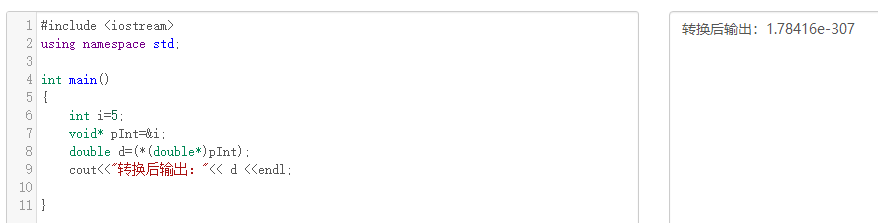
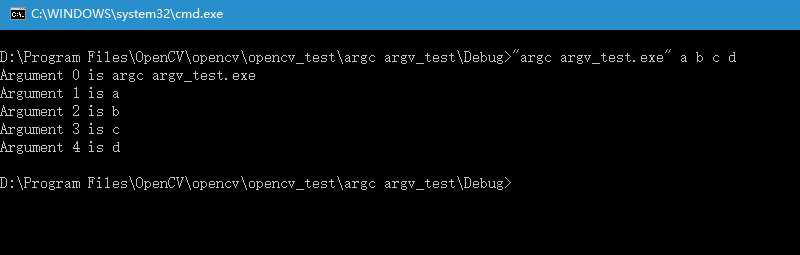
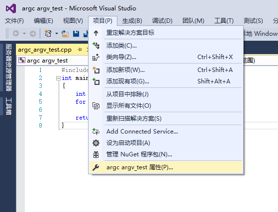
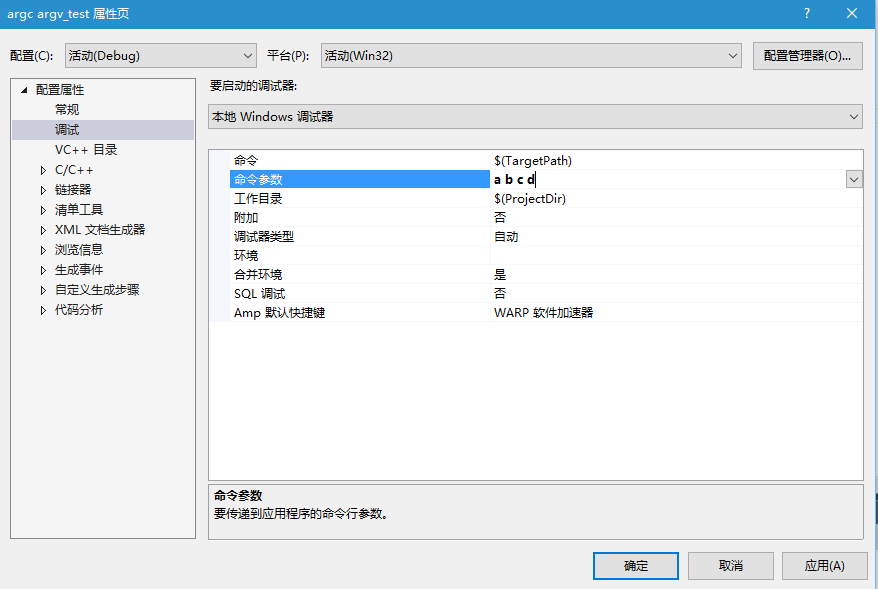
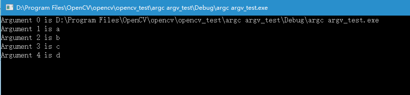

## 前置知识


#### （40） 调试程序的方法

* 通过设置断点进行调试
* 打印log进行调试
* 打印中间结果进行调试


#### （41） 遇到coredump要怎么调试

coredump是程序由于异常或者bug在运行时异常退出或者终止，在一定的条件下生成的一个叫做core的文件，这个core文件会记录程序在运行时的内存，寄存器状态，内存指针和函数堆栈信息等等。对这个文件进行分析可以定位到程序异常的时候对应的堆栈调用信息。

* 使用gdb命令对core文件进行调试

以下例子在Linux上编写一段代码并导致segment fault 并产生core文件

```
mkdir coredumpTest
vim coredumpTest.cpp
```

在编辑器内键入

```
#include<stdio.h>
int main(){
    int i;
    scanf("%d",i);//正确的应该是&i,这里使用i会导致segment fault
    printf("%d\n",i);
    return 0;
}
```

编译

```
g++ coredumpTest.cpp -g -o coredumpTest
```

运行

```
./coredumpTest
```

使用gdb调试coredump

```
gdb [可执行文件名] [core文件名]
```

####


#### 170、你知道Denug和release的区别是什么吗？

1)  调试版本，包含调试信息，所以容量比Release大很多，并且不进行任何优化（优化会使调试复杂化，因为源代码和生成的指令间关系会更复杂），便于程序员调试。Debug模式下生成两个文件，除了.exe或.dll文件外，还有一个.pdb文件，该文件记录了代码中断点等调试信息； 

2)  发布版本，不对源代码进行调试，编译时对应用程序的速度进行优化，使得程序在代码大小和运行速度上都是最优的。（调试信息可在单独的PDB文件中生成）。Release模式下生成一个文件.exe或.dll文件。

3)  实际上，Debug 和 Release 并没有本质的界限，他们只是一组编译选项的集合，编译器只是按照预定的选项行动。事实上，我们甚至可以修改这些选项，从而得到优化过的调试版本或是带跟踪语句的发布版本。

#### 183、动态编译与静态编译

1)  静态编译，编译器在编译可执行文件时，把需要用到的对应动态链接库中的部分提取出来，连接到可执行文件中去，使可执行文件在运行时不需要依赖于动态链接库；

2)  动态编译的可执行文件需要附带一个动态链接库，在执行时，需要调用其对应动态链接库的命令。所以其优点一方面是缩小了执行文件本身的体积，另一方面是加快了编译速度，节省了系统资源。缺点是哪怕是很简单的程序，只用到了链接库的一两条命令，也需要附带一个相对庞大的链接库；二是如果其他计算机上没有安装对应的运行库，则用动态编译的可执行文件就不能运行。


#### 1、在main执行之前和之后执行的代码可能是什么？

**main函数执行之前**，主要就是初始化系统相关资源：

+ 设置栈指针
+ 初始化静态`static`变量和`global`全局变量，即`.data`段的内容
+ 将未初始化部分的全局变量赋初值：数值型`short`，`int`，`long`等为`0`，`bool`为`FALSE`，指针为`NULL`等等，即`.bss`段的内容     
+ 全局对象初始化，在`main`之前调用构造函数，这是可能会执行前的一些代码
+ 将main函数的参数`argc`，`argv`等传递给`main`函数，然后才真正运行`main`函数
+ `__attribute__((constructor))`

**main函数执行之后**：  

+ 全局对象的析构函数会在main函数之后执行； 
+ 可以用 **`atexit`** 注册一个函数，它会在main 之后执行;
+ `__attribute__((destructor))`

>update1:https://github.com/forthespada/InterviewGuide/issues/2 ,由`stanleyguo0207`提出 - 2021.03.22


#### （49）一个函数或者可执行文件的生成过程或者编译过程是怎样的

预处理，编译，汇编，链接

* 预处理： 对预处理命令进行替换等预处理操作
* 编译：代码优化和生成汇编代码
* 汇编：将汇编代码转化为机器语言
* 链接：将目标文件彼此链接起来


#### 184、hello.c 程序的编译过程

以下是一个 hello.c 程序：


```
#include <stdio.h>int main(){    printf("hello, world\n");    return 0;}
```

在 Unix 系统上，由编译器把源文件转换为目标文件。


```
gcc -o hello hello.c
```

这个过程大致如下：


- 预处理阶段：处理以 # 开头的预处理命令；
- 编译阶段：翻译成汇编文件；
- 汇编阶段：将汇编文件翻译成可重定位目标文件；
- 链接阶段：将可重定位目标文件和 printf.o 等单独预编译好的目标文件进行合并，得到最终的可执行目标文件。

##### 静态链接

静态链接器以一组可重定位目标文件为输入，生成一个完全链接的可执行目标文件作为输出。链接器主要完成以下两个任务：

- 符号解析：每个符号对应于一个函数、一个全局变量或一个静态变量，符号解析的目的是将每个符号引用与一个符号定义关联起来。
- 重定位：链接器通过把每个符号定义与一个内存位置关联起来，然后修改所有对这些符号的引用，使得它们指向这个内存位置。


##### 目标文件

- 可执行目标文件：可以直接在内存中执行；
- 可重定位目标文件：可与其它可重定位目标文件在链接阶段合并，创建一个可执行目标文件；
- 共享目标文件：这是一种特殊的可重定位目标文件，可以在运行时被动态加载进内存并链接；

##### 动态链接

静态库有以下两个问题：

- 当静态库更新时那么整个程序都要重新进行链接；
- 对于 printf 这种标准函数库，如果每个程序都要有代码，这会极大浪费资源。

共享库是为了解决静态库的这两个问题而设计的，在 Linux 系统中通常用 .so 后缀来表示，Windows 系统上它们被称为 DLL。它具有以下特点：

- 在给定的文件系统中一个库只有一个文件，所有引用该库的可执行目标文件都共享这个文件，它不会被复制到引用它的可执行文件中；
- 在内存中，一个共享库的 .text 节（已编译程序的机器代码）的一个副本可以被不同的正在运行的进程共享。


**源代码－－>预处理－－>编译－－>优化－－>汇编－－>链接-->可执行文件**

1)   预处理

读取c源程序，对其中的伪指令（以#开头的指令）和特殊符号进行处理。包括宏定义替换、条件编译指令、头文件包含指令、特殊符号。 预编译程序所完成的基本上是对源程序的“替代”工作。经过此种替代，生成一个没有宏定义、没有条件编译指令、没有特殊符号的输出文件。.i预处理后的c文件，.ii预处理后的C++文件。

2)   编译阶段

编译程序所要作得工作就是通过词法分析和语法分析，在确认所有的指令都符合语法规则之后，将其翻译成等价的中间代码表示或汇编代码。.s文件

3)   汇编过程

汇编过程实际上指把汇编语言代码翻译成目标机器指令的过程。对于被翻译系统处理的每一个C语言源程序，都将最终经过这一处理而得到相应的目标文件。目标文件中所存放的也就是与源程序等效的目标的机器语言代码。.o目标文件

4)   链接阶段

链接程序的主要工作就是将有关的目标文件彼此相连接，也即将在一个文件中引用的符号同该符号在另外一个文件中的定义连接起来，使得所有的这些目标文件成为一个能够诶操作系统装入执行的统一整体。


#### 180、C++从代码到可执行程序经历了什么？

##### （1）预编译

主要处理源代码文件中的以“#”开头的预编译指令。处理规则见下：

1. 删除所有的#define，展开所有的宏定义。
2. 处理所有的条件预编译指令，如“#if”、“#endif”、“#ifdef”、“#elif”和“#else”。
3. 处理“#include”预编译指令，将文件内容替换到它的位置，这个过程是递归进行的，文件中包含其他 文件。
4. 删除所有的注释，“//”和“/**/”。
5. 保留所有的#pragma 编译器指令，编译器需要用到他们，如：#pragma once 是为了防止有文件被重 复引用。
6. 添加行号和文件标识，便于编译时编译器产生调试用的行号信息，和编译时产生编译错误或警告是 能够显示行号。

##### （2）编译

把预编译之后生成的xxx.i或xxx.ii文件，进行一系列词法分析、语法分析、语义分析及优化后，生成相应 的汇编代码文件。

1. 词法分析：利用类似于“有限状态机”的算法，将源代码程序输入到扫描机中，将其中的字符序列分 割成一系列的记号。
2. 语法分析：语法分析器对由扫描器产生的记号，进行语法分析，产生语法树。由语法分析器输出的 语法树是一种以表达式为节点的树。
3. 语义分析：语法分析器只是完成了对表达式语法层面的分析，语义分析器则对表达式是否有意义进 行判断，其分析的语义是静态语义——在编译期能分期的语义，相对应的动态语义是在运行期才能确定 的语义。
4. 优化：源代码级别的一个优化过程。
5. 目标代码生成：由代码生成器将中间代码转换成目标机器代码，生成一系列的代码序列——汇编语言 表示。
6. 目标代码优化：目标代码优化器对上述的目标机器代码进行优化：寻找合适的寻址方式、使用位移 来替代乘法运算、删除多余的指令等。

##### （3）汇编

将汇编代码转变成机器可以执行的指令(机器码文件)。 汇编器的汇编过程相对于编译器来说更简单，没 有复杂的语法，也没有语义，更不需要做指令优化，只是根据汇编指令和机器指令的对照表一一翻译过 来，汇编过程有汇编器as完成。经汇编之后，产生目标文件(与可执行文件格式几乎一样)xxx.o(Windows 下)、xxx.obj(Linux下)。

##### （4）链接

将不同的源文件产生的目标文件进行链接，从而形成一个可以执行的程序。链接分为静态链接和动态链 接：

##### 静态链接

函数和数据被编译进一个二进制文件。在使用静态库的情况下，在编译链接可执行文件时，链接器从库 中复制这些函数和数据并把它们和应用程序的其它模块组合起来创建最终的可执行文件。

空间浪费：因为每个可执行程序中对所有需要的目标文件都要有一份副本，所以如果多个程序对同一个 目标文件都有依赖，会出现同一个目标文件都在内存存在多个副本；

更新困难：每当库函数的代码修改了，这个时候就需要重新进行编译链接形成可执行程序。

运行速度快：但是静态链接的优点就是，在可执行程序中已经具备了所有执行程序所需要的任何东西， 在执行的时候运行速度快。

##### 动态链接

动态链接的基本思想是把程序按照模块拆分成各个相对独立部分，在程序运行时才将它们链接在一起形 成一个完整的程序，而不是像静态链接一样把所有程序模块都链接成一个单独的可执行文件。

共享库：就是即使需要每个程序都依赖同一个库，但是该库不会像静态链接那样在内存中存在多分，副 本，而是这多个程序在执行时共享同一份副本；

更新方便：更新时只需要替换原来的目标文件，而无需将所有的程序再重新链接一遍。当程序下一次运 行时，新版本的目标文件会被自动加载到内存并且链接起来，程序就完成了升级的目标。

性能损耗：因为把链接推迟到了程序运行时，所以每次执行程序都需要进行链接，所以性能会有一定损 失。

> 《操作系统（三）》：https://www.nowcoder.com/tutorial/93/675fd4af3ab34b2db0ae650855aa52d5


#### 123、将字符串“hello world”从开始到打印到屏幕上的全过程?

1.用户告诉操作系统执行HelloWorld程序（通过键盘输入等）

2．操作系统：找到helloworld程序的相关信息，检查其类型是否是可执行文件；并通过程序首部信息，确定代码和数据在可执行文件中的位置并计算出对应的磁盘块地址。

3．操作系统：创建一个新进程，将HelloWorld可执行文件映射到该进程结构，表示由该进程执行helloworld程序。

4．操作系统：为helloworld程序设置cpu上下文环境，并跳到程序开始处。

5．执行helloworld程序的第一条指令，发生缺页异常

6．操作系统：分配一页物理内存，并将代码从磁盘读入内存，然后继续执行helloworld程序

7．helloword程序执行puts函数（系统调用），在显示器上写一字符串

8．操作系统：找到要将字符串送往的显示设备，通常设备是由一个进程控制的，所以，操作系统将要写的字符串送给该进程

9．操作系统：控制设备的进程告诉设备的窗口系统，它要显示该字符串，窗口系统确定这是一个合法的操作，然后将字符串转换成像素，将像素写入设备的存储映像区

10．视频硬件将像素转换成显示器可接收和一组控制数据信号

11．显示器解释信号，激发液晶屏

12．OK，我们在屏幕上看到了HelloWorld


#### 43、如何用代码判断大小端存储

大端存储：字数据的高字节存储在低地址中

小端存储：字数据的低字节存储在低地址中

例如：32bit的数字0x12345678


**所以在Socket编程中，往往需要将操作系统所用的小端存储的IP地址转换为大端存储，这样才能进行网络传输**

小端模式中的存储方式为：



大端模式中的存储方式为：


了解了大小端存储的方式，如何在代码中进行判断呢？下面介绍两种判断方式：

**方式一：使用强制类型转换**-这种法子不错

```C++
#include <iostream>using namespace std;int main(){  
int a = 0x1234;    //由于int和char的长度不同，借助int型转换成char型，只会留下低地址的部分  
char c = (char)(a);   
if (c == 0x12)       
    cout << "big endian" << endl;  
else if(c == 0x34)     
    cout << "little endian" << endl;
}
```

方式二：巧用union联合体

```C++
#include <iostream>using namespace std;

//union联合体的重叠式存储，endian联合体占用内存的空间为每个成员字节长度的最大值
union endian{   
    int a;   
    char ch;
};

int main(){   
    endian value;   
    value.a = 0x1234;    //a和ch共用4字节的内存空间    
    if (value.ch == 0x12)      
        cout << "big endian"<<endl;   
    else if (value.ch == 0x34)   
        cout << "little endian"<<endl;
}
```

> 《写程序判断系统是大端序还是小端序》：https://www.cnblogs.com/zhoudayang/p/5985563.html


#### 21、C++与Java的区别

**语言特性**

-  Java语言给开发人员提供了更为简洁的语法；完全面向对象，由于JVM可以安装到任何的操作系统上，所以说它的可移植性强
-  Java语言中没有指针的概念，引入了真正的数组。不同于C++中利用指针实现的“伪数组”，Java引入了真正的数组，同时将容易造成麻烦的指针从语言中去掉，这将有利于防止在C++程序中常见的因为数组操作越界等指针操作而对系统数据进行非法读写带来的不安全问题

-  C++也可以在其他系统运行，但是需要不同的编码（这一点不如Java，只编写一次代码，到处运行），例如对一个数字，在windows下是大端存储，在unix中则为小端存储。Java程序一般都是生成字节码，在JVM里面运行得到结果
-  Java用接口(Interface)技术取代C++程序中的多继承性。接口与多继承有同样的功能，但是省却了多继承在实现和维护上的复杂性

**垃圾回收**

- C++用析构函数回收垃圾，写C和C++程序时一定要注意内存的申请和释放
- Java语言不使用指针，内存的分配和回收都是自动进行的，程序员无须考虑内存碎片的问题

**应用场景**

- Java在桌面程序上不如C++实用，C++可以直接编译成exe文件，指针是c++的优势，可以直接对内存的操作，但同时具有危险性 。（操作内存的确是一项非常危险的事情，一旦指针指向的位置发生错误，或者误删除了内存中某个地址单元存放的重要数据，后果是可想而知的）
- Java在Web 应用上具有C++ 无可比拟的优势，具有丰富多样的框架
- 对于底层程序的编程以及控制方面的编程，C++很灵活，因为有句柄的存在

> 《C++和java的区别和联系》：https://www.cnblogs.com/tanrong/p/8503202.html


#### 20、C和C++的区别

- C++中new和delete是对内存分配的运算符，取代了C中的malloc和free。
- 标准C++中的字符串类取代了标准C函数库头文件中的字符数组处理函数（C中没有字符串类型）。
- C++中用来做控制态输入输出的iostream类库替代了标准C中的stdio函数库。
- C++中的try/catch/throw异常处理机制取代了标准C中的setjmp()和longjmp()函数。
- 在C++中，允许有相同的函数名，不过它们的参数类型不能完全相同，这样这些函数就可以相互区别开来。而这在C语言中是不允许的。也就是C++可以重载，C语言不允许。
- C++语言中，允许变量定义语句在程序中的任何地方，只要在是使用它之前就可以；而C语言中，必须要在函数开头部分。而且C++允许重复定义变量，C语言也是做不到这一点的
- 在C++中，除了值和指针之外，新增了引用。引用型变量是其他变量的一个别名，我们可以认为他们只是名字不相同，其他都是相同的。
- C++相对与C增加了一些关键字，如：bool、using、dynamic_cast、namespace等等

> 《[C语言与C++有什么区别？](https://www.cnblogs.com/ITziyuan/p/9487760.html)》https://www.cnblogs.com/ITziyuan/p/9487760.html


#### （45） 用过C11吗，知道C11新特性吗？（有面试官建议熟悉C11）

* 自动类型推导auto：auto的自动类型推导用于从初始化表达式中推断出变量的数据类型。通过auto的自动类型推导，可以大大简化我们的编程工作
* nullptr
  ：nullptr是为了解决原来C\+\+中NULL的二义性问题而引进的一种新的类型，因为NULL实际上代表的是0，而nullptr是void*类型的

* lambda表达式：它类似Javascript中的闭包，它可以用于创建并定义匿名的函数对象，以简化编程工作。Lambda的语法如下：
  `[函数对象参数](操作符重载函数参数)mutable或exception声明->返回值类型{函数体}`
* thread类和mutex类
* 新的智能指针 unique_ptr和shared_ptr


* 更多详见：https://blog.csdn.net/caogenwangbaoqiang/article/details/79438279


#### （6） C和C\+\+的区别

包括但不限于：

* C是面向过程的语言，C\+\+是面向对象的语言，C\+\+有“封装，继承和多态”的特性。封装隐藏了实现细节，使得代码模块化。继承通过子类继承父类的方法和属性，实现了代码重用。多态则是“一个接口，多个实现”，通过子类重写父类的虚函数，实现了接口重用。
* C和C\+\+内存管理的方法不一样，C使用malloc/free，C\+\+除此之外还用new/delete
* C\+\+中还有函数重载和引用等概念，C中没有

#### 100、C++ 11有哪些新特性？

- nullptr替代 NULL
- 引入了 auto 和 decltype 这两个关键字实现了类型推导
- 基于范围的 for 循环for(auto& i : res){}
- 类和结构体的中初始化列表
- Lambda 表达式（匿名函数）
- std::forward_list（单向链表）
- 右值引用和move语义

* ...


#### （8） C++、Java的联系与区别，包括语言特性、垃圾回收、应用场景等（java的垃圾回收机制）

包括但不限于：

* C\+\+ 和Java都是面向对象的语言，C\+\+是编译成可执行文件直接运行的，JAVA是编译之后在JAVA虚拟机上运行的，因此JAVA有良好的跨平台特性，但是执行效率没有C\+\+ 高。
* C\+\+的内存管理由程序员手动管理，JAVA的内存管理是由Java虚拟机完成的，它的垃圾回收使用的是标记-回收算法
* C\+\+有指针，Java没有指针，只有引用
* JAVA和C\+\+都有构造函数，但是C\+\+有析构函数但是Java没有


#### （58）为什么C++没有实现垃圾回收？

* 首先，实现一个垃圾回收器会带来额外的空间和时间开销。你需要开辟一定的空间保存指针的引用计数和对他们进行标记mark。然后需要单独开辟一个线程在空闲的时候进行free操作。  
* 垃圾回收会使得C++不适合进行很多底层的操作。


#### （9）C++和python的区别

包括但不限于：

1. python是一种脚本语言，是解释执行的，而C\+\+是编译语言，是需要编译后在特定平台运行的。python可以很方便的跨平台，但是效率没有C\+\+高。
2. python使用缩进来区分不同的代码块，C\+\+使用花括号来区分
3. C\+\+中需要事先定义变量的类型，而python不需要，python的基本数据类型只有数字，布尔值，字符串，列表，元组等等
4. python的库函数比C\+\+的多，调用起来很方便


## 指针和引用


#### （0） 指针和引用的区别

* 指针是一个新的变量，指向另一个变量的地址，我们可以通过访问这个地址来修改另一个变量；而引用是一个别名，对引用的操作就是对变量的本身进行操作
* 指针可以有多级，引用只有一级
* 传参的时候，使用指针的话需要解引用才能对参数进行修改，而使用引用可以直接对参数进行修改
* 指针的大小一般是4个字节，引用的大小取决于被引用对象的大小
* 指针可以为空，引用不可以。


#### 58、从汇编层去解释一下引用

~~~cpp
9:      int x = 1;00401048  mov     dword ptr [ebp-4],110:     int &b = x;0040104F   lea     eax,[ebp-4]00401052  mov     dword ptr [ebp-8],eax
~~~


x的地址为ebp-4，b的地址为ebp-8，因为栈内的变量内存是从高往低进行分配的，所以b的地址比x的低。

lea eax,[ebp-4] 这条语句将x的地址ebp-4放入eax寄存器

mov dword ptr [ebp-8],eax 这条语句将eax的值放入b的地址

ebp-8中上面两条汇编的作用即：将x的地址存入变量b中，这不和将某个变量的地址存入指针变量是一样的吗？所以从汇编层次来看，的确引用是通过指针来实现的。


#### 3、指针和引用的区别

- 指针是一个变量，存储的是一个地址，引用跟原来的变量实质上是同一个东西，是原变量的别名
- 指针可以有多级，引用只有一级
- 指针可以为空，引用不能为NULL且在定义时必须初始化
- 指针在初始化后可以改变指向，而引用在初始化之后不可再改变
- sizeof指针得到的是本指针的大小，sizeof引用得到的是引用所指向变量的大小
- 当把指针作为参数进行传递时，也是将实参的一个拷贝传递给形参，两者指向的地址相同，但不是同一个变量，在函数中改变这个变量的指向不影响实参，而引用却可以。
- 引用本质是一个指针，同样会占4字节内存；指针是具体变量，需要占用存储空间（，具体情况还要具体分析）。
- 引用在声明时必须初始化为另一变量，一旦出现必须为typename refname &varname形式；指针声明和定义可以分开，可以先只声明指针变量而不初始化，等用到时再指向具体变量。
- 引用一旦初始化之后就不可以再改变（变量可以被引用为多次，但引用只能作为一个变量引用）；指针变量可以重新指向别的变量。
- 不存在指向空值的引用，必须有具体实体；但是存在指向空值的指针。

参考代码：

```C++
void test(int *p){　
    int a=1;　
    p=&a;　　
    cout<<p<<" "<<*p<<endl;
}

int main(void){  
    int *p=NULL;  
    test(p);   
    if(p==NULL)  
        cout<<"指针p为NULL"<<endl; 
    return 0;
}
//运行结果为：
//0x22ff44 1
//指针p为NULL

void testPTR(int* p) {
    int a = 12;	p = &a;
}

void testREFF(int& p) {
    int a = 12;
    p = a;
}

void main(){
    int a = 10;
    int* b = &a;
    testPTR(b);//改变指针指向，但是没改变指针的所指的内容
    cout << a << endl;// 10
    cout << *b << endl;// 10	
    a = 10;	testREFF(a);
    cout << a << endl;//12
}
```

 在编译器看来, int a = 10; int &amp;b = a; 等价于 int * const b = &amp;a; 而 b = 20; 等价于 *b = 20; 自动转换为指针和自动解引用. 


#### 103、指针加减计算要注意什么？

指针加减本质是对其所指地址的移动，移动的步长跟指针的类型是有关系的，因此在涉及到指针加减运算需要十分小心，加多或者减多都会导致指针指向一块未知的内存地址，如果再进行操作就会很危险。

举个例子：

```C++
#include <iostream>
using namespace std;

int main(){
    int *a, *b, c;
    a = (int*)0x500;
    b = (int*)0x520;	
    c = b - a;
    printf("%d\n", c); // 8	
    a += 0x020;	c = b - a;	
    printf("%d\n", c); // -24	
    return 0;
}
```

首先变量a和b都是以16进制的形式初始化，将它们转成10进制分别是1280（5\*16\^2=1280）和1312（5\*16\^2+2*16=1312)， 那么它们的差值为32，也就是说a和b所指向的地址之间间隔32个位，但是考虑到是int类型占4位，所以c的值为32/4=8

a自增16进制0x20之后，其实际地址变为1280 + 2\*16\*4 = 1408，（因为一个int占4位，所以要乘4），这样它们的差值就变成了1312 - 1280 = -96，所以c的值就变成了-96/4 = -24

遇到指针的计算，**需要明确的是指针每移动一位，它实际跨越的内存间隔是指针类型的长度，建议都转成10进制计算，计算结果除以类型长度取得结果**


#### 47、C++中NULL和nullptr区别

算是为了与C语言进行兼容而定义的一个问题吧

NULL来自C语言，一般由宏定义实现，而 nullptr 则是C++11的新增关键字。**在C语言中，NULL被定义为(void*)0,而在C++语言中，NULL则被定义为整数0**。编译器一般对其实际定义如下：

```C++
#ifdef __cplusplus
#define NULL 0
#else
#define NULL ((void *)0)
#endif
```


在C++中指针必须有明确的类型定义。但是将NULL定义为0带来的另一个问题是无法与整数的0区分。因为C++中允许有函数重载，所以可以试想如下函数定义情况：

```C++
#include <iostream>
using namespace std;
void fun(char* p) {
    cout << "char*" << endl;
}

void fun(int p) {
    cout << "int" << endl;
}

int main(){
    fun(NULL);
    return 0;
}

//输出结果：int
```

那么**在传入NULL参数时，会把NULL当做整数0来看，如果我们想调用参数是指针的函数，该怎么办呢?。nullptr在C++11被引入用于解决这一问题，nullptr可以明确区分整型和指针类型，能够根据环境自动转换成相应的指针类型，但不会被转换为任何整型，所以不会造成参数传递错误。**

nullptr的一种实现方式如下：

```C++
const class nullptr_t{
    public:  
    template<class T> 
        inline operator T*() const{
        return 0; 
                                  
    }    
    
    template<class C, class T> 
    inline operator T C::*() const { 
        return 0; 
    }
    
    private:   
    void operator&() const;
} nullptr = {};
```


以上通过模板类和运算符重载的方式来对不同类型的指针进行实例化从而解决了(void*)指针带来参数类型不明的问题，**另外由于nullptr是明确的指针类型，所以不会与整形变量相混淆。**但nullptr仍然存在一定问题，例如：

```C++
#include <iostream>using namespace std;void fun(char* p){	cout<< "char* p" <<endl;}void fun(int* p){	cout<< "int* p" <<endl;}void fun(int p){	cout<< "int p" <<endl;}int main(){    fun((char*)nullptr);//语句1	fun(nullptr);//语句2    fun(NULL);//语句3    return 0;}//运行结果：//语句1：char* p//语句2:报错，有多个匹配//3：int p
```

在这种情况下存在对不同指针类型的函数重载，此时如果传入nullptr指针则仍然存在无法区分应实际调用哪个函数，这种情况下必须显示的指明参数类型。

> 《NULL和nullptr区别》：https://blog.csdn.net/qq_39380590/article/details/82563571


#### nullptr和NULL详解

转自：https://blog.csdn.net/u012707739/article/details/77915483

##### C中的NULL

在C语言中我们将NULL用作空指针之用，NULL在C语言中的定义如下：

```
#define NULL    ((void *)0)
1
```

可以看到，C语言中NULL是一个void*指针，我们常用其来对指针变量进行初始化赋值或者作为返回类型为指针的函数的返回值（如函数执行失败时）等等。

##### C++中的NULL

在C++中，NULL的定义如下：

```
/* Define NULL pointer value */
#ifndef NULL
    #ifdef __cplusplus
        #define NULL    0
    #else  /* __cplusplus */
        #define NULL    ((void *)0)
    #endif  /* __cplusplus */
#endif  /* NULL */
12345678
```

可以看到，在C++中，NULL被定义为0，而不是(void*)0，为什么C++在NULL的定义上不继续兼容C延续(void*)0的定义呢？因为C++中不能将`void*`类型的指针隐式转换成其他指针类型，所以将NULL定义为(void*)0的话并不能起到空指针的作用，如以下代码：

```
int main() {
    void* a = (void*) 0;
    char* b = a;     //在C中可以，C++不行
    return 0;
}
12345
```

因为C++中不能将`void*`类型的指针隐式转换成其他指针类型，所以用`(void*)0`对其他类型指针赋初值是不行的。既然`(void*)0`不能起到空指针的作用，不如干脆将NULL定义为0，引入0来表示空指针，可以对各种类型的指针进行赋值。

##### C++中的nullptr

用过C++的童鞋都知道C++中有个nullptr的关键字可以用作空指针，既然已经有了定义为0的NULL，为何还要nullptr呢？这是因为定义为0的NULL很容易引起混淆，尤其是函数重载调用时，比如说：

```
void hello(char* a) {  //C++支持函数名重载，C不支持
    printf("char\n");
}
void hello(int a) {
    printf("int\n");
}

int main() {
    hello（NULL）;    //调用hello(int a)函数
    return 0;
}
1234567891011
```

如果在C++中还是用NULL来用作空指针的话，我们会以为hello(NULL)调用的是hello(char* a)，但实际上，因为NULL定义为0，所以调用的是hello(int a)。所以为了避免这种混淆，C++定义了nullptr关键字用作空指针。

##### nullptr的使用

nullptr关键字用于标识空指针，是std::nullptr_t类型的（constexpr）变量。它可以转换成任何指针类型和bool布尔类型（主要是为了兼容普通指针可以作为条件判断语句的写法），但是不能被转换为整数。

```
char *p1 = nullptr;     // 正确
int  *p2 = nullptr;     // 正确
bool b = nullptr;       // 正确. if(b)判断为false
int a = nullptr;        // 错误
1234
```

注意nullptr和NULL以及0在作为条件判断时值都为false，它们两两之间进行等于（==）判断时值为true。


#### 16、a和&a有什么区别？

```
假设数组int a[10];int (*p)[10] = &a;
```

- a是数组名，是数组首元素地址，+1表示地址值加上一个int类型的大小，如果a的值是0x00000001，加1操作后变为0x00000005。*(a + 1) = a[1]。
- &a是数组的指针，其类型为int (*)[10]（就是前面提到的数组指针），其加1时，系统会认为是数组首地址加上整个数组的偏移（10个int型变量），值为数组a尾元素后一个元素的地址。
- 若(int *)p ，此时输出 *p时，其值为a[0]的值，因为被转为int *类型，解引用时按照int类型大小来读取。


#### 15、常量指针和指针常量区别？

- 常量指针是一个指针，读成常量的指针，指向一个只读变量。如int const *p或const int *p。

- 指针常量是一个不能给改变指向的指针。指针是个常亮，不能中途改变指向，如int *const p。

  

#### 18、野指针和悬空指针

  都是是指向无效内存区域(这里的无效指的是"不安全不可控")的指针，访问行为将会导致未定义行为。

  + 野指针   
    野指针，指的是没有被初始化过的指针

    ```cpp
    int main(void) {    
        int* p;     // 未初始化 
        std::cout<< *p << std::endl; // 未初始化就被使用   
        return 0;
    }
    ```
    
    因此，为了防止出错，对于指针初始化时都是赋值为 `nullptr`，这样在使用时编译器就会直接报错，产生非法内存访问。
    
  + 悬空指针    
    悬空指针，指针最初指向的内存已经被释放了的一种指针。

    ```cpp
    int main(void) {  
        int * p = nullptr; 
        int* p2 = new int;  
        p = p2;  
        delete p2;
    }
    ```
    
    此时 p和p2就是悬空指针，指向的内存已经被释放。继续使用这两个指针，行为不可预料。需要设置为`p=p2=nullptr`。此时再使用，编译器会直接保错。
    
    避免野指针比较简单，但悬空指针比较麻烦。c++引入了智能指针，C++智能指针的本质就是避免悬空指针的产生。
    
    

- 产生原因及解决办法：


1. 野指针：指针变量未及时初始化 => 定义指针变量及时初始化，要么置空。

2. 悬空指针：指针free或delete之后没有及时置空 => 释放操作后立即置空。


#### 5、区别以下指针类型？

```c++
int *p[10];		//表示指针数组，强调数组概念，是一个数组变量，数组大小为10，数组内每个元素都是指向int类型的指针变量。

int (*p)[10];	//表示数组指针，强调是指针，只有一个变量，是指针类型，不过指向的是一个int类型的数组，这个数组大小是10。

int *p(int);	//是函数声明，函数名是p，参数是int类型的，返回值是int *类型的。

int (*p)(int);	//是函数指针，强调是指针，该指针指向的函数具有int类型参数，并且返回值是int类型的。
```


#### 186、说一下C++左值引用和右值引用

C++11正是通过引入右值引用来优化性能，具体来说是通过移动语义来避免无谓拷贝的问题，通过move语义来将临时生成的左值中的资源无代价的转移到另外一个对象中去，通过完美转发来解决不能按照参数实际类型来转发的问题（同时，完美转发获得的一个好处是可以实现移动语义）。 

1)  在C++11中所有的值必属于左值、右值两者之一，右值又可以细分为纯右值、将亡值。在C++11中可以取地址的、有名字的就是左值，反之，不能取地址的、没有名字的就是右值（将亡值或纯右值）。举个例子，int a = b+c, a 就是左值，其有变量名为a，通过&a可以获取该变量的地址；表达式b+c、函数int func()的返回值是右值，在其被赋值给某一变量前，我们不能通过变量名找到它，＆(b+c)这样的操作则不会通过编译。

2)  C++11对C++98中的右值进行了扩充。在C++11中右值又分为纯右值（prvalue，Pure Rvalue）和将亡值（xvalue，eXpiring Value）。其中纯右值的概念等同于我们在C++98标准中右值的概念，指的是临时变量和不跟对象关联的字面量值；将亡值则是C++11新增的跟右值引用相关的表达式，这样表达式通常是将要被移动的对象（移为他用），比如返回右值引用T&&的函数返回值、std::move的返回值，或者转换为T&&的类型转换函数的返回值。将亡值可以理解为通过“盗取”其他变量内存空间的方式获取到的值。在确保其他变量不再被使用、或即将被销毁时，通过“盗取”的方式可以避免内存空间的释放和分配，能够延长变量值的生命期。

3)  左值引用就是对一个左值进行引用的类型。右值引用就是对一个右值进行引用的类型，事实上，由于右值通常不具有名字，我们也只能通过引用的方式找到它的存在。右值引用和左值引用都是属于引用类型。无论是声明一个左值引用还是右值引用，都必须立即进行初始化。而其原因可以理解为是引用类型本身自己并不拥有所绑定对象的内存，只是该对象的一个别名。左值引用是具名变量值的别名，而右值引用则是不具名（匿名）变量的别名。左值引用通常也不能绑定到右值，但常量左值引用是个“万能”的引用类型。它可以接受非常量左值、常量左值、右值对其进行初始化。不过常量左值所引用的右值在它的“余生”中只能是只读的。相对地，非常量左值只能接受非常量左值对其进行初始化。

4)  右值值引用通常不能绑定到任何的左值，要想绑定一个左值到右值引用，通常需要std::move()将左值强制转换为右值。


**左值和右值**

左值：表示的是可以获取地址的表达式，它能出现在赋值语句的左边，对该表达式进行赋值。但是修饰符const的出现使得可以声明如下的标识符，它可以取得地址，但是没办法对其进行赋值

```C++
const int& a = 10;
```

右值：表示无法获取地址的对象，有常量值、函数返回值、lambda表达式等。无法获取地址，但不表示其不可改变，当定义了右值的右值引用时就可以更改右值。

**左值引用和右值引用**

左值引用：传统的C++中引用被称为左值引用

右值引用：C++11中增加了右值引用，右值引用关联到右值时，右值被存储到特定位置，右值引用指向该特定位置，也就是说，右值虽然无法获取地址，但是右值引用是可以获取地址的，该地址表示临时对象的存储位置

**这里主要说一下右值引用的特点：**

- 特点1：通过右值引用的声明，右值又“重获新生”，其生命周期与右值引用类型变量的生命周期一样长，只要该变量还活着，该右值临时量将会一直存活下去
- 特点2：右值引用独立于左值和右值。意思是右值引用类型的变量可能是左值也可能是右值
- 特点3：T&& t在发生自动类型推断的时候，它是左值还是右值取决于它的初始化。

举个例子：

```C++
#include <bits/stdc++.h>

using namespace std;

template<typename T>
void fun(T&& t){
    cout << t << endl;
}

int getInt(){
    return 5;
}

int main() {		
    int a = 10;
    int& b = a;  //b是左值引用	
    int& c = 10;  //错误，c是左值不能使用右值初始化	
    int&& d = 10;  //正确，右值引用用右值初始化	
    int&& e = a;  //错误，e是右值引用不能使用左值初始化	
    const int& f = a; //正确，左值常引用相当于是万能型，可以用左值或者右值初始化	
    const int& g = 10;//正确，左值常引用相当于是万能型，可以用左值或者右值初始化	
    const int&& h = 10; //正确，右值常引用	
    const int& aa = h;//正确	
    int& i = getInt();  //错误，i是左值引用不能使用临时变量（右值）初始化	
    int&& j = getInt();  //正确，函数返回值是右值	
    fun(10); //此时fun函数的参数t是右值	
    fun(a); //此时fun函数的参数t是左值	
    return 0;
}
```

> 《c++右值引用以及使用》：https://www.cnblogs.com/likaiming/p/9045642.html
>
> 《从4行代码看右值引用》：https://www.cnblogs.com/likaiming/p/9029908.html


## 变量和基本类型

#### 12、变量声明和定义区别？

- 声明仅仅是把变量的声明的位置及类型提供给编译器，并不分配内存空间；定义要在定义的地方为其分配存储空间。

- 相同变量可以在多处声明（外部变量extern），但只能在一处定义。

如果是指变量的声明和定义
 从编译原理上来说，声明是仅仅告诉编译器，有个某类型的变量会被使用，但是编译器并不会为它分配任何内存。而定义就是分配了内存。

如果是指函数的声明和定义
 声明：一般在头文件里，对编译器说：这里我有一个函数叫function() 让编译器知道这个函数的存在。
 定义：一般在源文件里，具体就是函数的实现过程 写明函数体。


#### （51）定义和声明的区别

* 声明是告诉编译器变量的类型和名字，不会为变量分配空间

* 定义就是对这个变量和函数进行内存分配和初始化。需要分配空间，同一个变量可以被声明多次，但是只能被定义一次


#### 29、初始化和赋值的区别

- 对于简单类型来说，初始化和赋值没什么区别
- 对于类和复杂数据类型来说，这两者的区别就大了，举例如下：

```C++
class A{
    public:  
    int num1;   
    int num2;
    public:  
    A(int a=0, int b=0):num1(a),num2(b){}; 
    A(const A& a){};   
    //重载 = 号操作符函数   
    A& operator=(const A& a){   
        num1 = a.num1 + 1;      
        num2 = a.num2 + 1;     
        return *this;  
    };
};

//初始化调用拷贝构造函数，赋值调用 = 号操作符函数
int main(){  
    A a(1,1); 
    A a1 = a; //拷贝初始化操作，调用拷贝构造函数  
    A b;  
    b = a;//赋值操作，对象a中，num1 = 1，num2 = 1；对象b中，num1 = 2，num2 = 2  
    return 0;
}
```


#### 30、extern"C"的用法

为了能够**正确的在C++代码中调用C语言**的代码：在程序中加上extern "C"后，相当于告诉编译器这部分代码是C语言写的，因此要按照C语言进行编译，而不是C++；

哪些情况下使用extern "C"：

（1）C++代码中调用C语言代码；

（2）在C++中的头文件中使用；

（3）在多个人协同开发时，可能有人擅长C语言，而有人擅长C++；

举个例子，C++中调用C代码：

```C++
#ifndef __MY_HANDLE_H__
#define __MY_HANDLE_H__
extern "C"{   
    typedef unsigned int result_t;  
    typedef void* my_handle_t;    
    my_handle_t create_handle(const char* name);  
    result_t operate_on_handle(my_handle_t handle);   
    void close_handle(my_handle_t handle);
}
```

- 参考的blog中有一篇google code上的文章，专门写extern "C"的，有兴趣的读者不妨去看看

> 《extern "C"的功能和用法研究》：https://blog.csdn.net/sss_369/article/details/84060561


综上，总结出使用方法**，在C语言的头文件中，对其外部函数只能指定为extern类型，C语言中不支持extern "C"声明，在.c文件中包含了extern "C"时会出现编译语法错误。**所以使用extern "C"全部都放在于cpp程序相关文件或其头文件中。

总结出如下形式：

（1）C++调用C函数：

```c++
//xx.h
extern int add(...)
//xx.cint 
add(){    }
//xx.cpp
extern "C" {  
    #include "xx.h"
}
```

（2）C调用C++函数

```c
//xx.h
extern "C"{   
    int add();
}//xx.cpp
int add(){  
}
//xx.c
extern int add();
```


#### 102、全局变量和局部变量有什么区别？

生命周期不同：全局变量随主程序创建和创建，随主程序销毁而销毁；局部变量在局部函数内部，甚至局部循环体等内部存在，退出就不存在；

使用方式不同：通过声明后全局变量在程序的各个部分都可以用到；局部变量分配在堆栈区，只能在局部使用。 

操作系统和编译器通过内存分配的位置可以区分两者，全局变量分配在全局数据段并且在程序开始运行的时候被加载。局部变量则分配在堆栈里面 。

> 《C++经典面试题》：https://www.cnblogs.com/yjd_hycf_space/p/7495640.html


**1、全局变量（外部变量）的说明之前再冠以static就构成了静态的全局变量。**

全局变量本身就是静态存储方式，静态全局变量当然也是静态存储方式。

这两者在存储方式上并无不同。这两者的区别在于非静态全局变量的作用域是整个源程序，当一个源程序由多个原文件组成时，非静态的全局变量在各个源文件中都是有效的。

而静态全局变量则限制了其作用域，即只在定义该变量的源文件内有效，在同一源程序的其它源文件中不能使用它。由于静态全局变量的作用域限于一个源文件内，只能为该源文件内的函数公用，因此可以避免在其他源文件中引起错误。

static全局变量与普通的全局变量的区别是static全局变量只初始化一次，防止在其他文件单元被引用。


**2.static函数与普通函数有什么区别？**
 static函数与普通的函数作用域不同。尽在本文件中。只在当前源文件中使用的函数应该说明为内部函数（static），内部函数应该在当前源文件中说明和定义。

对于可在当前源文件以外使用的函数应该在一个头文件中说明，要使用这些函数的源文件要包含这个头文件。
 static函数与普通函数最主要区别是static函数在内存中只有一份，普通静态函数在每个被调用中维持一份拷贝程序的局部变量存在于（堆栈）中，全局变量存在于（静态区）中，动态申请数据存在于（堆）


#### 11、宏定义和typedef区别？

- 宏主要用于定义常量及书写复杂的内容；typedef主要用于定义类型别名。

- 宏替换发生在编译阶段之前，属于文本插入替换；typedef是编译的一部分。

- 宏不检查类型；typedef会检查数据类型。

- 宏不是语句，不在在最后加分号；typedef是语句，要加分号标识结束。

- 注意对指针的操作，typedef char * p_char和#define p_char char *区别巨大。

总结一下typedef和#define的区别

**1.概念**

```c++
// \#define 它在编译预处理时进行简单的替换，不作正确性检查。它是预处理指令。

#define DO double
DO val =5;//相当于 double va =5;

#define FUN(X)  X+5
int va = FUN(3); //相当于 va = 3+5


// typedef 它在自己的作用域内给一个已经存在的类型一个别名。它是在是在编译时处理的。

typedef double D;//就是给double起一个别名D
D val;//相当于是double val

//用dypedef定义数组
typedef double arr[3];//arr就是一个长度为3的double类型数组
arr arr1;   //相当于 double arr1[3]

//用dypedef定义函数指针
typedef void (*fun)();//表示fun是一个指向 void类型的指针函数

void StrGet() {
    qDebug()<<"str";
}

fun f1=StrGet;
f1();
```


**2.区别**

　　**执行时间不一样**
　　　　#define 是在预处理阶段，也就是在编译之前进行替换工作
　　　　typedef 是在编译阶段，会进行类型检查

　　**作用域不同**
　　　　#define 无论在哪定义过，在其它的地都可以使用
　　　　typedef 只能在定义的作用域内使用

　　**对指针的操作不一样**

```c++
#define PINT int *
typedef int * pint;

    int a =3;
    int b =5;
    const pint p1=&a; //相当于 int * const p1;  p1 不可以更改但指向的内容能被修改
    *p1=1;
    p1=&b;  //error
    const PINT p2 =&a;//相当于 const int * p2;  p2 可以被修改但指向的内容不可以修改
    p2=&b;
    *p2=1;  //error
```


#### 120、define、const、typedef、inline的使用方法？他们之间有什么区别？

**一、const与#define的区别：**

1)  const定义的常量是变量带类型，而#define定义的只是个常数不带类型；

2)  define只在预处理阶段起作用，简单的文本替换，而const在编译、链接过程中起作用；

3)  define只是简单的字符串替换没有类型检查。而const是有数据类型的，是要进行判断的，可以避免一些低级错误；

4)  define预处理后，占用代码段空间，const占用数据段空间；

5)  const不能重定义，而define可以通过#undef取消某个符号的定义，进行重定义；

6)  define独特功能，比如可以用来防止文件重复引用。


**二、  #define和别名typedef的区别**

1)  执行时间不同，typedef在编译阶段有效，typedef有类型检查的功能；#define是宏定义，发生在预处理阶段，不进行类型检查；

2)  功能差异，typedef用来定义类型的别名，定义与平台无关的数据类型，与struct的结合使用等。#define不只是可以为类型取别名，还可以定义常量、变量、编译开关等。

3)  作用域不同，#define没有作用域的限制，只要是之前预定义过的宏，在以后的程序中都可以使用。而typedef有自己的作用域。


**三、  define与inline的区别**

1)  #define是关键字，inline是函数；

2)  宏定义在预处理阶段进行文本替换，inline函数在编译阶段进行替换；

3)  inline函数有类型检查，相比宏定义比较安全；


#### （52）typdef和define区别

#define是预处理命令，在预处理是执行简单的替换，不做正确性的检查

typedef是在编译时处理的，它是在自己的作用域内给已经存在的类型一个别名


#### （42） inline关键字说一下 和宏定义有什么区别

inline是内联的意思，可以定义比较小的函数。因为函数频繁调用会占用很多的栈空间，进行入栈出栈操作也耗费计算资源，所以可以用inline关键字修饰频繁调用的小函数。编译器会在编译阶段将代码体嵌入内联函数的调用语句块中。

1、内联函数在编译时展开，而宏在预编译时展开

2、在编译的时候，内联函数直接被嵌入到目标代码中去，而宏只是一个简单的文本替换。

3、内联函数可以进行诸如类型安全检查、语句是否正确等编译功能，宏不具有这样的功能。

4、宏不是函数，而inline是函数

5、宏在定义时要小心处理宏参数，一般用括号括起来，否则容易出现二义性。而内联函数不会出现二义性。

6、inline可以不展开，宏一定要展开。因为inline指示对编译器来说，只是一个建议，编译器可以选择忽略该建议，不对该函数进行展开。

7、宏定义在形式上类似于一个函数，但在使用它时，仅仅只是做预处理器符号表中的简单替换，因此它不能进行参数有效性的检测，也就不能享受C++编译器严格类型检查的好处，另外它的返回值也不能被强制转换为可转换的合适的类型，这样，它的使用就存在着一系列的隐患和局限性。


#### 41、auto、decltype和decltype(auto)的用法

**（1）auto**

C++11新标准引入了auto类型说明符，用它就能让编译器替我们去分析表达式所属的类型。和原来那些只对应某种特定的类型说明符(例如 int)不同，

**auto 让编译器通过初始值来进行类型推演。从而获得定义变量的类型，所以说 auto 定义的变量必须有初始值。**举个例子：

```c++
//普通；类型
int a = 1, b = 3;
auto c = a + b;// c为int型

//const类型
const int i = 5;
auto j = i; // 变量i是顶层const, 会被忽略, 所以j的类型是int
auto k = &i; // 变量i是一个常量, 对常量取地址是一种底层const, 所以b的类型是const int*const 
auto l = i; //如果希望推断出的类型是顶层const的, 那么就需要在auto前面加上cosnt

//引用和指针类型
int x = 2;
int& y = x;
auto z = y; //z是int型不是int& 型
auto& p1 = y; //p1是int&型
auto p2 = &x; //p2是指针类型int*
```


**（2）decltype**

有的时候我们还会遇到这种情况，**我们希望从表达式中推断出要定义变量的类型，但却不想用表达式的值去初始化变量。**还有可能是函数的返回类型为某表达式的值类型。在这些时候auto显得就无力了，所以C++11又引入了第二种类型说明符decltype，**它的作用是选择并返回操作数的数据类型。在此过程中，编译器只是分析表达式并得到它的类型，却不进行实际的计算表达式的值。**

```C++
int func() {
    return 0
};

//普通类型
decltype(func()) sum = 5; // sum的类型是函数func()的返回值的类型int, 但是这时不会实际调用函数
func()int a = 0;decltype(a) b = 4; // a的类型是int, 所以b的类型也是int

//不论是顶层const还是底层const, decltype都会保留  
const int c = 3;decltype(c) d = c; // d的类型和c是一样的, 都是顶层
const int e = 4;const int* f = &e; // f是底层
const decltype(f) g = f; // g也是底层const

//引用与指针类型
//1. 如果表达式是引用类型, 那么decltype的类型也是引用
const int i = 3, &j = i;decltype(j) k = 5; // k的类型是const int&

//2. 如果表达式是引用类型, 但是想要得到这个引用所指向的类型, 需要修改表达式:
int i = 3, &r = i;
decltype(r + 0) t = 5; // 此时是int类型

//3. 对指针的解引用操作返回的是引用类型
int i = 3, j = 6, *p = &i;
decltype(*p) c = j;// c是int&类型, c和j绑定在一起

//4. 如果一个表达式的类型不是引用, 但是我们需要推断出引用, 那么可以加上一对括号, 就变成了引用类型了
int i = 3;
decltype((i)) j = i; // 此时j的类型是int&类型, j和i绑定在了一起
```


**（3）decltype(auto)**

decltype(auto)是C++14新增的类型指示符，可以用来声明变量以及指示函数返回类型。在使用时，会将“=”号左边的表达式替换掉auto，再根据decltype的语法规则来确定类型。举个例子：

```C++
int e = 4;const int* f = &e; // f是底层constdecltype(auto) j = f;//j的类型是const int* 并且指向的是e
```

> 《auto和decltype的用法总结》：https://www.cnblogs.com/XiangfeiAi/p/4451904.html
>
> 《C++11新特性中auto 和 decltype 区别和联系》：https://www.jb51.net/article/103666.htm


#### 104、 怎样判断两个浮点数是否相等？

对两个浮点数判断大小和是否相等不能直接用==来判断，会出错！明明相等的两个数比较反而是不相等！对于两个浮点数比较只能通过相减并与预先设定的精度比较，记得要取绝对值！浮点数与0的比较也应该注意。与浮点数的表示方式有关。


## const

#### 52、const关键字?

1)  阻止一个变量被改变，可以使用const关键字。在定义该const变量时，通常需要对它进行初始化，因为以后就没有机会再去改变它了；  

2)  对指针来说，可以指定指针本身为const，也可以指定指针所指的数据为const，或二者同时指定为const；  

3)  在一个函数声明中，const可以修饰形参，表明它是一个输入参数，在函数内部不能改变其值；  

11) 对于函数值传递的情况，因为参数传递是通过复制实参创建一个临时变量传递进函数的，函数内只能改变临时变量，但无法改变实参。则这个时候无论加不加const对实参不会产生任何影响。但是在引用或指针传递函数调用中，因为传进去的是一个引用或指针，这样函数内部可以改变引用或指针所指向的变量，这时const 才是实实在在地保护了实参所指向的变量。因为在编译阶段编译器对调用函数的选择是根据实参进行的，所以，只有引用传递和指针传递可以用是否加const来重载。一个拥有顶层const的形参无法和另一个没有顶层const的形参区分开来。


4)  **对于类的成员函数，若指定其为const类型，则表明其是一个常函数，==不能修改类的成员变量，类的常对象只能访问类的常成员函数==；**  

5)  **对于类的成员函数，有时候必须指定其返回值为const类型，以使得其返回值不为“左值”。**

6)  const成员函数可以访问非const对象的非const数据成员、const数据成员，也可以访问const对象内的所有数据成员；

7)  非const成员函数可以访问非const对象的非const数据成员、const数据成员，但不可以访问const对象的任意数据成员；

8)  一个没有明确声明为const的成员函数被看作是将要修改对象中数据成员的函数，而且编译器不允许它为一个const对象所调用。**因此const对象只能调用const成员函数。**

9)  const类型变量可以通过类型转换符**const_cas**t将const类型转换为非const类型；

10) const类型变量必须定义的时候进行初始化，因此也导致如果类的成员变量有const类型的变量，那么该变量必须在类的初始化列表中进行初始化；


**const**

- 不考虑类的情况

  - const常量在定义时必须初始化，之后无法更改

  - const形参可以接收const和非const类型的实参，例如

    ```C++
    // i 可以是 int 型或者 const int 型void fun(const int& i){	//...}
    ```

- 考虑类的情况

  - const成员变量：不能在类定义外部初始化，只能通过构造函数初始化列表进行初始化，并且必须有构造函数；不同类对其const数据成员的值可以不同，所以不能在类中声明时初始化
  - const成员函数：const对象不可以调用非const成员函数；非const对象都可以调用；不可以改变非mutable（用该关键字声明的变量可以在const成员函数中被修改）数据的值


#### （12） 在C\+\+中const的用法（定义，用途）

* const修饰类的成员变量时，表示常量不能被修改
* const修饰类的成员函数，表示该函数不会修改类中的数据成员，不会调用其他非const的成员函数


#### 25、C++的顶层const和底层const

**概念区分**

- **顶层**const：指的是const修饰的变量**本身**是一个常量，无法修改，指的是指针，**就是 * 号的右边**
- **底层**const：指的是const修饰的变量**所指向的对象**是一个常量，指的是所指变量，**就是 * 号的左边**

**举个例子**

```C++
int a = 10;int* const b1 = &a;        //顶层const，b1本身是一个常量const int* b2 = &a;        //底层const，b2本身可变，所指的对象是常量const int b3 = 20; 		   //顶层const，b3是常量不可变const int* const b4 = &a;  //前一个const为底层，后一个为顶层，b4不可变const int& b5 = a;		   //用于声明引用变量，都是底层const
```

**区分作用**

- 执行对象拷贝时有限制，常量的底层const不能赋值给非常量的底层const
- 使用命名的强制类型转换函数const_cast时，只能改变运算对象的底层const

> 《C++ 顶层const与底层const总结》：https://www.jianshu.com/p/fbbcf11100f6
>
> 《C++的顶层const和底层const浅析》：https://blog.csdn.net/qq_37059483/article/details/78811231


```
const int a;int const a;const int *a;int *const a;
```

- int const a和const int a均表示定义常量类型a。

- const int *a，其中a为指向int型变量的指针，const在 * 左侧，表示a指向不可变常量。(看成const (*a)，对引用加const)

- int *const a，依旧是指针类型，表示a为指向整型数据的常指针。(看成const(a)，对指针const)


#### 23、define宏定义和const的区别

**编译阶段**

- define是在编译的**预处理**阶段起作用，而const是在编译、运行的时候起作用

**安全性**

- define只做替换，不做类型检查和计算，也不求解，容易产生错误，一般最好加上一个大括号包含住全部的内容，要不然很容易出错
- const常量有数据类型，编译器可以对其进行类型安全检查

**内存占用**

- define只是将宏名称进行替换，在内存中会产生多分相同的备份。const在程序运行中只有一份备份，且可以执行常量折叠，能将复杂的的表达式计算出结果放入常量表

- 宏替换发生在编译阶段之前，属于文本插入替换；const作用发生于编译过程中。

- 宏不检查类型；const会检查数据类型。

- 宏定义的数据没有分配内存空间，只是插入替换掉；const定义的变量只是值不能改变，但要分配内存空间。

#### （11） define 和const的联系与区别（编译阶段、安全性、内存占用等）

  联系：它们都是定义常量的一种方法。

  区别：

* define定义的常量没有类型，只是进行了简单的替换，可能会有多个拷贝，占用的内存空间大，const定义的常量是有类型的，存放在静态存储区，只有一个拷贝，占用的内存空间小。
* define定义的常量是在预处理阶段进行替换，而const在编译阶段确定它的值。
* define不会进行类型安全检查，而const会进行类型安全检查，安全性更高。
* const可以定义函数而define不可以。

* 


#### 53、指针和const的用法

1)  当const修饰指针时，由于const的位置不同，它的修饰对象会有所不同。

2)  int \*const p2中const修饰p2的值,所以理解为p2的值不可以改变，即p2只能指向固定的一个变量地址，但可以通过*p2读写这个变量的值。顶层指针表示指针本身是一个常量

3)  int const \*p1或者const int \*p1两种情况中const修饰\*p1，所以理解为\*p1的值不可以改变，即不可以给*p1赋值改变p1指向变量的值，但可以通过给p赋值不同的地址改变这个指针指向。

底层指针表示指针所指向的变量是一个常量。


## static

#### 50、static的用法和作用？

1.先来介绍它的第一条也是最重要的一条：隐藏。（static函数，static变量均可）

当同时编译多个文件时，所有未加static前缀的全局变量和函数都具有全局可见性。


2.static的第二个作用是保持变量内容的持久。（static变量中的记忆功能和全局生存期）存储在静态数据区的变量会在程序刚开始运行时就完成初始化，也是唯一的一次初始化。共有两种变量存储在静态存储区：全局变量和static变量，只不过和全局变量比起来，static可以控制变量的可见范围，说到底static还是用来隐藏的。


3.static的第三个作用是默认初始化为0（static变量）

其实全局变量也具备这一属性，因为全局变量也存储在静态数据区。在静态数据区，内存中所有的字节默认值都是0x00，某些时候这一特点可以减少程序员的工作量。


4.static的第四个作用：C++中的类成员声明static

1)  函数体内static变量的作用范围为该函数体，不同于auto变量，该变量的内存只被分配一次，因此其值在下次调用时仍维持上次的值； 

2)  在模块内的static全局变量可以被模块内所用函数访问，但不能被模块外其它函数访问；  

3)  在模块内的static函数只可被这一模块内的其它函数调用，这个函数的使用范围被限制在声明它的模块内；  

4)  在类中的static成员变量属于整个类所拥有，对类的所有对象只有一份拷贝；  

5)  在类中的static成员函数属于整个类所拥有，这个函数不接收this指针，因而只能访问类的static成员变量。

类内：

6)  static类对象必须要在类外进行初始化，static修饰的变量先于对象存在，所以static修饰的变量要在类外初始化；

7)  由于static修饰的类成员属于类，不属于对象，因此static类成员函数是没有this指针的，this指针是指向本对象的指针。正因为没有this指针，所以static类成员函数不能访问非static的类成员，只能访问 static修饰的类成员；

8)  static成员函数不能被virtual修饰，static成员不属于任何对象或实例，所以加上virtual没有任何实际意义；静态成员函数没有this指针，虚函数的实现是为每一个对象分配一个vptr指针，而vptr是通过this指针调用的，所以不能为virtual；虚函数的调用关系，this->vptr->ctable->virtual function


**static**

- 不考虑类的情况
  - 隐藏。所有不加static的全局变量和函数具有全局可见性，可以在其他文件中使用，加了之后只能在该文件所在的编译模块中使用
  - 默认初始化为0，包括未初始化的全局静态变量与局部静态变量，都存在全局未初始化区
  - 静态变量在函数内定义，始终存在，且只进行一次初始化，具有记忆性，其作用范围与局部变量相同，函数退出后仍然存在，但不能使用
- 考虑类的情况
  - static成员变量：只与类关联，不与类的对象关联。定义时要分配空间，不能在类声明中初始化，必须在类定义体外部初始化，初始化时不需要标示为static；可以被非static成员函数任意访问。
  - static成员函数：不具有this指针，无法访问类对象的非static成员变量和非static成员函数；**不能被声明为const、虚函数和volatile**；可以被非static成员函数任意访问


#### 51、静态变量什么时候初始化

1)  初始化只有一次，但是可以多次赋值，在主程序之前，编译器已经为其分配好了内存。

2)  静态局部变量和全局变量一样，数据都存放在全局区域，所以在主程序之前，编译器已经为其分配好了内存，但在C和C++中静态局部变量的初始化节点又有点不太一样。在C中，初始化发生在代码执行之前，编译阶段分配好内存之后，就会进行初始化，所以我们看到在C语言中无法使用变量对静态局部变量进行初始化，在程序运行结束，变量所处的全局内存会被全部回收。

3)  而在C++中，初始化时在执行相关代码时才会进行初始化，主要是由于C++引入对象后，要进行初始化必须执行相应构造函数和析构函数，在构造函数或析构函数中经常会需要进行某些程序中需要进行的特定操作，并非简单地分配内存。所以C++标准定为全局或静态对象是有首次用到时才会进行构造，并通过atexit()来管理。在程序结束，按照构造顺序反方向进行逐个析构。所以在C++中是可以使用变量对静态局部变量进行初始化的。


#### （13） C++中的static用法和意义

static的意思是静态的，可以用来修饰变量，函数和类成员。

* 变量：被static修饰的变量就是静态变量，它会在程序运行过程中一直存在，会被放在静态存储区。局部静态变量的作用域在函数体中，全局静态变量的作用域在这个文件里。

* 函数：被static修饰的函数就是静态函数，静态函数只能在本文件中使用，不能被其他文件调用，也不会和其他文件中的同名函数冲突。

* 类：而在类中，被static修饰的成员变量是类静态成员，这个静态成员会被类的多个对象共用。被static修饰的成员函数也属于静态成员，不是属于某个对象的，访问这个静态函数不需要引用对象名，而是通过引用类名来访问。

【note】静态成员函数要访问非静态成员时，要用过对象来引用。局部静态变量在函数调用结束后也不会被回收，会一直在程序内存中，直到该函数再次被调用，它的值还是保持上一次调用结束后的值。

注意和const的区别。const强调值不能被修改，而static强调唯一的拷贝，对所有类的对象都共用。


## 表达式

### 运算符优先级

| 优先级 | 运算符           | 名称或含义                | 使用形式                  | 结合方向 | 说明             |
| ------ | ---------------- | ------------------------- | ------------------------- | -------- | ---------------- |
| 1      | []               | 数组下标                  | 数组名[常量表达式]        | 左到右   |                  |
| ()     | 圆括号           | （表达式）/函数名(形参表) |                           |          |                  |
| .      | 成员选择（对象） | 对象.成员名               |                           |          |                  |
| ->     | 成员选择（指针） | 对象指针->成员名          |                           |          |                  |
| 2      | -                | 负号运算符                | -表达式                   | 右到左   | 单目运算符       |
| (类型) | 强制类型转换     | (数据类型)表达式          |                           |          |                  |
| ++     | 自增运算符       | ++变量名/变量名++         | 单目运算符                |          |                  |
| --     | 自减运算符       | --变量名/变量名--         | 单目运算符                |          |                  |
| *      | 取值运算符       | *指针变量                 | 单目运算符                |          |                  |
| &      | 取地址运算符     | &变量名                   | 单目运算符                |          |                  |
| !      | 逻辑非运算符     | !表达式                   | 单目运算符                |          |                  |
| ~      | 按位取反运算符   | ~表达式                   | 单目运算符                |          |                  |
| sizeof | 长度运算符       | sizeof(表达式)            |                           |          |                  |
| 3      | /                | 除                        | 表达式/表达式             | 左到右   | 双目运算符       |
| *      | 乘               | 表达式*表达式             | 双目运算符                |          |                  |
| %      | 余数（取模）     | 整型表达式/整型表达式     | 双目运算符                |          |                  |
| 4      | +                | 加                        | 表达式+表达式             | 左到右   | 双目运算符       |
| -      | 减               | 表达式-表达式             | 双目运算符                |          |                  |
| 5      | <<               | 左移                      | 变量<<表达式              | 左到右   | 双目运算符       |
| >>     | 右移             | 变量>>表达式              | 双目运算符                |          |                  |
| 6      | >                | 大于                      | 表达式>表达式             | 左到右   | 双目运算符       |
| >=     | 大于等于         | 表达式>=表达式            | 双目运算符                |          |                  |
| <      | 小于             | 表达式<表达式             | 双目运算符                |          |                  |
| <=     | 小于等于         | 表达式<=表达式            | 双目运算符                |          |                  |
| 7      | ==               | 等于                      | 表达式==表达式            | 左到右   | 双目运算符       |
| !=     | 不等于           | 表达式!= 表达式           | 双目运算符                |          |                  |
| 8      | &                | 按位与                    | 表达式&表达式             | 左到右   | 双目运算符       |
| 9      | ^                | 按位异或                  | 表达式^表达式             | 左到右   | 双目运算符       |
| 10     | \|               | 按位或                    | 表达式\|表达式            | 左到右   | 双目运算符       |
| 11     | &&               | 逻辑与                    | 表达式&&表达式            | 左到右   | 双目运算符       |
| 12     | \|\|             | 逻辑或                    | 表达式\|\|表达式          | 左到右   | 双目运算符       |
| 13     | ?:               | 条件运算符                | 表达式1? 表达式2: 表达式3 | 右到左   | 三目运算符       |
| 14     | =                | 赋值运算符                | 变量=表达式               | 右到左   |                  |
| /=     | 除后赋值         | 变量/=表达式              |                           |          |                  |
| *=     | 乘后赋值         | 变量*=表达式              |                           |          |                  |
| %=     | 取模后赋值       | 变量%=表达式              |                           |          |                  |
| +=     | 加后赋值         | 变量+=表达式              |                           |          |                  |
| -=     | 减后赋值         | 变量-=表达式              |                           |          |                  |
| <<=    | 左移后赋值       | 变量<<=表达式             |                           |          |                  |
| >>=    | 右移后赋值       | 变量>>=表达式             |                           |          |                  |
| &=     | 按位与后赋值     | 变量&=表达式              |                           |          |                  |
| ^=     | 按位异或后赋值   | 变量^=表达式              |                           |          |                  |
| \|=    | 按位或后赋值     | 变量\|=表达式             |                           |          |                  |
| 15     | ,                | 逗号运算符                | 表达式,表达式,…           | 左到右   | 从左向右顺序运算 |

说明：


同一优先级的运算符，运算次序由结合方向所决定。

口诀：


括号成员第一;     //括号运算符[]() 成员运算符.  ->

全体单目第二;     //所有的单目运算符比如++、 --、 +(正)、 -(负) 、指针运算*、&乘除余三,加减四;  //这个"余"是指取余运算即%

移位五，关系六;   //移位运算符：<< >> ，关系：> < >= <= 等

等于(与)不等排第七;   //即== 和!=

位与异或和位或;   //这几个都是位运算: 位与(&)异或(^)位或(|)   

"三分天下"八九十;  

逻辑或跟与;       //逻辑运算符:|| 和 &&

十二和十一;       //注意顺序:优先级(||)  底于 优先级(&&) 

条件高于赋值,     //三目运算符优先级排到13 位只比赋值运算符和","高

逗号运算级最低!   //逗号运算符优先级最低 


## 类型转换

##### 86、C++的四种强制转换reinterpret_cast/const_cast/static_cast /dynamic_cast

**reinterpret_cast**

reinterpret_cast<type-id> (expression)

type-id 必须是一个指针、引用、算术类型、函数指针或者成员指针。它可以用于类型之间进行强制转换。

**const_cast**

const_cast<type_id> (expression)

该运算符用来修改类型的const或volatile属性。除了const 或volatile修饰之外， type_id和expression的类型是一样的。用法如下：

- 常量指针被转化成非常量的指针，并且仍然指向原来的对象

- 常量引用被转换成非常量的引用，并且仍然指向原来的对象

- const_cast一般用于修改底指针。如const char *p形式

**static_cast**

static_cast < type-id > (expression)

该运算符把expression转换为type-id类型，但没有运行时类型检查来保证转换的安全性。它主要有如下几种用法：

- 用于类层次结构中基类（父类）和派生类（子类）之间指针或引用引用的转换

  - 进行上行转换（把派生类的指针或引用转换成基类表示）是安全的

  - 进行下行转换（把基类指针或引用转换成派生类表示）时，由于没有动态类型检查，所以是不安全的

- 用于基本数据类型之间的转换，如把int转换成char，把int转换成enum。这种转换的安全性也要开发人员来保证。

- 把空指针转换成目标类型的空指针

- 把任何类型的表达式转换成void类型

注意：static_cast不能转换掉expression的const、volatile、或者__unaligned属性。

**dynamic_cast**

有类型检查，基类向派生类转换比较安全，但是派生类向基类转换则不太安全

dynamic_cast <type-id> (expression)

该运算符把expression转换成type-id类型的对象。type-id 必须是类的指针、类的引用或者void*

如果 type-id 是类指针类型，那么expression也必须是一个指针，如果 type-id 是一个引用，那么 expression 也必须是一个引用

dynamic_cast运算符可以在执行期决定真正的类型，也就是说expression必须是多态类型。如果下行转换是安全的（也就说，如果基类指针或者引用确实指向一个派生类对象）这个运算符会传回适当转型过的指针。如果 如果下行转换不安全，这个运算符会传回空指针（也就是说，基类指针或者引用没有指向一个派生类对象）

dynamic_cast主要用于类层次间的上行转换和下行转换，还可以用于类之间的交叉转换

在类层次间进行上行转换时，dynamic_cast和static_cast的效果是一样的

在进行下行转换时，dynamic_cast具有类型检查的功能，比static_cast更安全

举个例子：

```C++
#include <bits/stdc++.h>using namespace std;class Base{public:	Base() :b(1) {}	virtual void fun() {};	int b;};class Son : public Base{public:	Son() :d(2) {}	int d;};int main(){	int n = 97;	//reinterpret_cast	int *p = &n;	//以下两者效果相同	char *c = reinterpret_cast<char*> (p); 	char *c2 =  (char*)(p);	cout << "reinterpret_cast输出："<< *c2 << endl;	//const_cast	const int *p2 = &n;	int *p3 = const_cast<int*>(p2);	*p3 = 100;	cout << "const_cast输出：" << *p3 << endl;		Base* b1 = new Son;	Base* b2 = new Base;	//static_cast	Son* s1 = static_cast<Son*>(b1); //同类型转换	Son* s2 = static_cast<Son*>(b2); //下行转换，不安全	cout << "static_cast输出："<< endl;	cout << s1->d << endl;	cout << s2->d << endl; //下行转换，原先父对象没有d成员，输出垃圾值	//dynamic_cast	Son* s3 = dynamic_cast<Son*>(b1); //同类型转换	Son* s4 = dynamic_cast<Son*>(b2); //下行转换，安全	cout << "dynamic_cast输出：" << endl;	cout << s3->d << endl;	if(s4 == nullptr)		cout << "s4指针为nullptr" << endl;	else		cout << s4->d << endl;			return 0;}//输出结果//reinterpret_cast输出：a//const_cast输出：100//static_cast输出：//2//-33686019//dynamic_cast输出：//2//s4指针为nullptr
```

从输出结果可以看出，在进行下行转换时，dynamic_cast安全的，如果下行转换不安全的话其会返回空指针，这样在进行操作的时候可以预先判断。而使用static_cast下行转换存在不安全的情况也可以转换成功，但是直接使用转换后的对象进行操作容易造成错误。


#### （47） C++的四种强制转换-----

四种强制类型转换操作符分别为：static_cast、dynamic_cast、const_cast、reinterpret_cast

* 1）static_cast ：
  用于各种隐式转换。具体的说，就是用户各种基本数据类型之间的转换，比如把int换成char，float换成int等。以及派生类（子类）的指针转换成基类（父类）指针的转换。

  >特性与要点：
  >
  >1. 它没有运行时类型检查，所以是有安全隐患的。
  >2. 在派生类指针转换到基类指针时，是没有任何问题的，在基类指针转换到派生类指针的时候，会有安全问题。
  >3. static_cast不能转换const，volatile等属性

* 2）dynamic_cast：
  用于动态类型转换。具体的说，就是在基类指针到派生类指针，或者派生类到基类指针的转换。
  dynamic_cast能够提供运行时类型检查，只用于含有虚函数的类。
  dynamic_cast如果不能转换返回NULL。

* 3）const_cast：
  用于去除const常量属性，使其可以修改 ，也就是说，原本定义为const的变量在定义后就不能进行修改的，但是使用const_cast操作之后，可以通过这个指针或变量进行修改; 另外还有volatile属性的转换。

* 4）reinterpret_cast
  几乎什么都可以转，用在任意的指针之间的转换，引用之间的转换，指针和足够大的int型之间的转换，整数到指针的转换等。但是不够安全。


#### 175、static_cast比C语言中的转换强在哪里？

1)  更加安全；

2)  更直接明显，能够一眼看出是什么类型转换为什么类型，容易找出程序中的错误；可清楚地辨别代码中每个显式的强制转；可读性更好，能体现程序员的意图


#### 134、隐式转换，如何消除隐式转换？

1、C++的基本类型中并非完全的对立，部分数据类型之间是可以进行隐式转换的。所谓隐式转换，是指不需要用户干预，编译器私下进行的类型转换行为。很多时候用户可能都不知道进行了哪些转换

2、C++面向对象的多态特性，就是通过父类的类型实现对子类的封装。通过隐式转换，你可以直接将一个子类的对象使用父类的类型进行返回。在比如，数值和布尔类型的转换，整数和浮点数的转换等。某些方面来说，隐式转换给C++程序开发者带来了不小的便捷。C++是一门强类型语言，类型的检查是非常严格的。

3、 基本数据类型 基本数据类型的转换以取值范围的作为转换基础（保证精度不丢失）。隐式转换发生在从小->大的转换中。比如从char转换为int。从int->long。自定义对象 子类对象可以隐式的转换为父类对象。

4、 C++中提供了explicit关键字，在构造函数声明的时候加上explicit关键字，能够禁止隐式转换。

5、如果构造函数只接受一个参数，则它实际上定义了转换为此类类型的隐式转换机制。可以通过将构造函数声明为explicit加以制止隐式类型转换，关键字explicit只对一个实参的构造函数有效，需要多个实参的构造函数不能用于执行隐式转换，所以无需将这些构造函数指定为explicit。


#### 32、C和C++的类型安全

 **什么是类型安全？**

类型安全很大程度上可以等价于内存安全，类型安全的代码不会试图访问自己没被授权的内存区域。“类型安全”常被用来形容编程语言，其根据在于该门编程语言是否提供保障类型安全的机制；有的时候也用“类型安全”形容某个程序，判别的标准在于该程序是否隐含类型错误。

类型安全的编程语言与类型安全的程序之间，没有必然联系。好的程序员可以使用类型不那么安全的语言写出类型相当安全的程序，相反的，差一点儿的程序员可能使用类型相当安全的语言写出类型不太安全的程序。绝对类型安全的编程语言暂时还没有。

**（1）C的类型安全**

C只在局部上下文中表现出类型安全，比如试图从一种结构体的指针转换成另一种结构体的指针时，编译器将会报告错误，除非使用显式类型转换。然而，C中相当多的操作是不安全的。以下是两个十分常见的例子：

- printf格式输出



上述代码中，使用%d控制整型数字的输出，没有问题，但是改成%f时，明显输出错误，再改成%s时，运行直接报segmentation fault错误

- malloc函数的返回值

malloc是C中进行内存分配的函数，它的返回类型是void\*即空类型指针，常常有这样的用法char\* pStr=(char\*)malloc(100\*sizeof(char))，这里明显做了显式的类型转换。

类型匹配尚且没有问题，但是一旦出现int\* pInt=(int*)malloc(100\*sizeof(char))就很可能带来一些问题，而这样的转换C并不会提示错误。


**（2）C++的类型安全**

如果C++使用得当，它将远比C更有类型安全性。相比于C语言，C++提供了一些新的机制保障类型安全：

- 操作符new返回的指针类型严格与对象匹配，而不是void\*

- C中很多以void\*为参数的函数可以改写为C++模板函数，而模板是支持类型检查的；

- 引入const关键字代替#define constants，它是有类型、有作用域的，而#define constants只是简单的文本替换

- 一些#define宏可被改写为inline函数，结合函数的重载，可在类型安全的前提下支持多种类型，当然改写为模板也能保证类型安全

- C++提供了**dynamic_cast**关键字，使得转换过程更加安全，因为dynamic_cast比static_cast涉及更多具体的类型检查。

  例1：使用void\*进行类型转换



​	例2：不同类型指针之间转换

```C++
#include<iostream>using namespace std; class Parent{};class Child1 : public Parent{public:	int i;	Child1(int e):i(e){}};class Child2 : public Parent{public:	double d;	Child2(double e):d(e){}};int main(){	Child1 c1(5);	Child2 c2(4.1);	Parent* pp;	Child1* pc1; 		pp=&c1; 	pc1=(Child1*)pp;  // 类型向下转换 强制转换，由于类型仍然为Child1*，不造成错误	cout<<pc1->i<<endl; //输出：5 	pp=&c2;	pc1=(Child1*)pp;  //强制转换，且类型发生变化，将造成错误	cout<<pc1->i<<endl;// 输出：1717986918	return 0;}
```

上面两个例子之所以引起类型不安全的问题，是因为程序员使用不得当。第一个例子用到了空类型指针void\*，第二个例子则是在两个类型指针之间进行强制转换。因此，想保证程序的类型安全性，应尽量避免使用空类型指针void\*，尽量不对两种类型指针做强制转换。


## 字符串

#### menset与fill

menset函数一般只对int型数组进行0、-1的赋值。原因：menset对数组是按字节赋值，对每个字节的赋值是相同的，故int的4个字节全部被赋相同的值，而0正好二进制编码全为0，-1的二进制编码全为1，不容易发生错误。不要忘了加头文件<string.h>；数组初始化为0的语法为：menset(数组名，0，sizeof(数组名));这里再提一下，赋值全为-1要在函数里填参数为-1。

fill是algorithm里的一个函数，因此使用时要添加头文件。可以把数组或容器中的某一段区间赋为某个相同的值。语法为：fill（数组名，数组名+区间长度，赋值内容）;


#### 174、strcpy函数和strncpy函数的区别？哪个函数更安全？

1)  函数原型

~~~cpp
char* strcpy(char* strDest, const char* strSrc);
char* strncpy(char* strDest, const char* strSrc, int pos)
~~~

2)  strcpy函数: 如果参数 dest 所指的内存空间不够大，可能会造成缓冲溢出(buffer Overflow)的错误情况，在编写程序时请特别留意，或者用strncpy()来取代。 
 strncpy函数：用来复制源字符串的前n个字符，src 和 dest 所指的内存区域不能重叠，且 dest 必须有足够的空间放置n个字符。 

3)  如果目标长>指定长>源长，则将源长全部拷贝到目标长，自动加上’\0’ 
 如果指定长<源长，则将源长中按指定长度拷贝到目标字符串，不包括’\0’ 
 如果指定长>目标长，运行时错误 ；


#### 14、strlen和sizeof区别？

- sizeof是运算符，并不是函数，结果在编译时得到而非运行中获得；strlen是字符处理的库函数。

- sizeof参数可以是任何数据的类型或者数据（sizeof参数不退化）；strlen的参数只能是字符指针且结尾是'\0'的字符串。

- 因为sizeof值在编译时确定，所以不能用来得到动态分配（运行时分配）存储空间的大小。

~~~cpp
  int main(int argc, char const *argv[]){            const char* str = "name";      sizeof(str); // 取的是指针str的长度，是8      strlen(str); // 取的是这个字符串的长度，不包含结尾的 \0。大小是4      return 0;  }
~~~

#### strcpy和memcpy

##### strcpy

strcpy(dest,src) 把src地址开始且含有 null 结束符的字符串复制到以 dest 开始的地址空间

```cpp
char* strcpy(const char* strDest,const char* strSrc){
	assert(strDest != NULL && strSrc != NULL);
	char *address = strDest;
	while((*strDest++ = *strSrc++) != '\0');
	return address;
}
123456
```

##### memcpy

```cpp
void* memcpy(void* dest,void* src,size_t n);
1
```

功能：从源src所指的内存的起始位置开始拷贝 n 个字节到目标dest所指的内存地址的起始位置。函数返回指向dest的指针；

##### strcpy与memcpy区别

都是标准C库函数，区别如下：

1. **复制的内容不同**
   strcpy只能复制字符串，而memcpy可以复制任何内容，例如字符数组、整型、结构体、类等，用途更广
2. **复制的方法不同**
   strcpy不需要指定长度，遇到被复制的字符串的结束符 ‘\0’ 时结束，所以容易溢出；mencpy则是根据第三个参数决定复制的长度
3. **用途不同**
   通常在字符串复制时用strcpy，需要复制其他类型数据时用 memcpy

#### 165、说一说strcpy、sprintf与memcpy这三个函数的不同之处

1)  操作对象不同

①   strcpy的两个操作对象均为字符串 

②   sprintf的操作源对象可以是多种数据类型，目的操作对象是字符串 

③   memcpy的两个对象就是两个任意可操作的内存地址，并不限于何种数据类型。

2)  执行效率不同

memcpy最高，strcpy次之，sprintf的效率最低。

3)  实现功能不同

①   strcpy主要实现字符串变量间的拷贝 

②   sprintf主要实现其他数据类型格式到字符串的转化 

③   memcpy主要是内存块间的拷贝。

#### 142、你知道strcpy和memcpy的区别是什么吗？

1、复制的内容不同。strcpy只能复制字符串，而memcpy可以复制任意内容，例如字符数组、整型、结构体、类等。 2、复制的方法不同。strcpy不需要指定长度，它遇到被复制字符的串结束符"\0"才结束，所以容易溢出。memcpy则是根据其第3个参数决定复制的长度。 3、用途不同。通常在复制字符串时用strcpy，而需要复制其他类型数据时则一般用memcpy


## 向量、数组

#### 17、数组名和指针（这里为指向数组首元素的指针）区别？

- 二者均可通过增减偏移量来访问数组中的元素。
- 数组名不是真正意义上的指针，可以理解为常指针，所以数组名没有自增、自减等操作。
- **当数组名当做形参传递给调用函数后，就失去了原有特性，退化成一般指针，多了自增、自减操作，但sizeof运算符不能再得到原数组的大小了。**

#### 167、你知道数组和指针的区别吗？

1)  数组在内存中是连续存放的，开辟一块连续的内存空间；数组所占存储空间：sizeof（数组名）；数组大小：sizeof(数组名)/sizeof(数组元素数据类型)；

2)  用运算符sizeof 可以计算出数组的容量（字节数）。sizeof(p),p 为指针得到的是一个指针变量的字节数，而不是p 所指的内存容量。

3)  编译器为了简化对数组的支持，实际上是利用指针实现了对数组的支持。具体来说，就是将表达式中的数组元素引用转换为指针加偏移量的引用。

4)  在向函数传递参数的时候，如果实参是一个数组，那用于接受的形参为对应的指针。也就是传递过去是数组的首地址而不是整个数组，能够提高效率；

5)  在使用下标的时候，两者的用法相同，都是原地址加上下标值，不过数组的原地址就是数组首元素的地址是固定的，指针的原地址就不是固定的。


## 语句

#### 133、说一下你理解的 ifdef   endif代表着什么？

1)  一般情况下，源程序中所有的行都参加编译。但是有时希望对其中一部分内容只在满足一定条件才进行编译，也就是对一部分内容指定编译的条件，这就是“条件编译”。有时，希望当满足某条件时对一组语句进行编译，而当条件不满足时则编译另一组语句。 

2)  条件编译命令最常见的形式为： 

~~~cpp
\#ifdef 标识符  程序段1  \#else  程序段2  \#endif
~~~


它的作用是：当标识符已经被定义过(一般是用#define命令定义)，则对程序段1进行编译，否则编译程序段2。 
 其中#else部分也可以没有，即： 

~~~cpp
 \#ifdef  程序段1  \#denif
~~~


3)  在一个大的软件工程里面，可能会有多个文件同时包含一个头文件，当这些文件编译链接成一个可执行文件上时，就会出现大量“重定义”错误。

在头文件中使用#define、#ifndef、#ifdef、#endif能避免头文件重定义。

#### 141、如何在不使用额外空间的情况下，交换两个数？你有几种方法

~~~cpp
1)  算术x = x + y; y = x - y;x = x - y; 2)  异或x = x^y;// 只能对int,char.. y = x^y; x = x^y; x ^= y ^= x;
~~~

#### 127、cout和printf有什么区别？

cout<<是一个函数，cout<<后可以跟不同的类型是因为cout<<已存在针对各种类型数据的重载，所以会自动识别数据的类型。输出过程会首先将输出字符放入缓冲区，然后输出到屏幕。

cout是有缓冲输出:

~~~cpp
 cout < < "abc " < <endl;
 或cout < < "abc\n ";cout < <flush; 这两个才是一样的.

~~~

 flush立即强迫缓冲输出。
 printf是无缓冲输出。有输出时立即输出

#### 121、你知道printf函数的实现原理是什么吗？

在C/C++中，对函数参数的扫描是从后向前的。

C/C++的函数参数是通过压入堆栈的方式来给函数传参数的（堆栈是一种先进后出的数据结构），最先压入的参数最后出来，在计算机的内存中，数据有2块，一块是堆，一块是栈（函数参数及局部变量在这里），而栈是从内存的高地址向低地址生长的，控制生长的就是堆栈指针了，最先压入的参数是在最上面，就是说在所有参数的最后面，最后压入的参数在最下面，结构上看起来是第一个，所以最后压入的参数总是能够被函数找到，因为它就在堆栈指针的上方。

printf的第一个被找到的参数就是那个字符指针，就是被双引号括起来的那一部分，函数通过判断字符串里控制参数的个数来判断参数个数及数据类型，通过这些就可算出数据需要的堆栈指针的偏移量了，下面给出printf("%d,%d",a,b);（其中a、b都是int型的）的汇编代码.


## 函数


#### （46） C++的调用惯例（简单一点C++函数调用的压栈过程）

函数的调用过程：

1）从栈空间分配存储空间

2）从实参的存储空间复制值到形参栈空间

3）进行运算

形参在函数未调用之前都是没有分配存储空间的，在函数调用结束之后，形参弹出栈空间，清除形参空间。

数组作为参数的函数调用方式是地址传递，形参和实参都指向相同的内存空间，调用完成后，形参指针被销毁，但是所指向的内存空间依然存在，不能也不会被销毁。

当函数有多个返回值的时候，不能用普通的 return 的方式实现，需要通过传回地址的形式进行，即地址/指针传递。


#### 119、 函数调用过程栈的变化，返回值和参数变量哪个先入栈？

 1、调用者函数把被调函数所需要的参数按照与被调函数的形参顺序相反的顺序压入栈中,即:**从右向左依次把被调函数所需要的参数压入栈;**

 2、调用者函数使用call指令调用被调函数,并把call指令的下一条指令的地址当成返回地址压入栈中(这个压栈操作隐含在call指令中);

 3、在被调函数中,被调函数会先保存调用者函数的栈底地址(push ebp),然后再保存调用者函数的栈顶地址,即:当前被调函数的栈底地址(mov ebp,esp);

 4、在被调函数中,从ebp的位置处开始存放被调函数中的局部变量和临时变量,并且这些变量的地址按照定义时的顺序依次减小,即:**这些变量的地址是按照栈的延伸方向排列的,先定义的变量先入栈,后定义的变量后入栈;**


#### 关于int main( int argc, char* argv[] ) 中arg和argv参数的解析及调试

在示例程序中经常可以看到argc和argv这两个参数 ，在调试代码过程中遇到main函数为int main( int argc, char* argv[] ) 这种类型时往往会报错，或者是运行起来了但命令窗口一闪而过，没有出来结果。网上关于这方面的资料也有点乱，在看浅墨大大一书发现其中有关于这一方面的讲解甚为详细，抑制不住要与大家分享的冲动，现结合网上内容并予以实验，整理如下：
    带形参的main函数，如 main( int argc, char* argv[], char **env ) ，是UNIX、Linux以及Mac OS操作系统中C/C++的main函数标准写法，并且是血统最纯正的main函数写法。
    在如今的Visual Studio编译器中，main()函数带有参数argc和argv或者不带，即无论是否在函数体中使用argc和argv，返回值为void或不为void，都是合法的。
    即至少有如下三种写法合法：

**1、返回值为整型带参的main函数**

```
int main( int argc, char** argv )
{ 
     //函数体内使用或不使用argc和argv都可
     ……
     return 0;
}
```

**2、返回值为整型不带参的main函数**

```
int main( int argc, char** argv )
{ 
     //函数体内使用了argc或argv
     ……
     return 0;
}
```

**3、返回值为void且不带参的main函数**

```
void main()
{ 
     ……
}
```

**一、argc、argv的具体含义**
    argc和argv参数在用命令行编译程序时有用。main( int argc, char* argv[], char **env ) 中
    第一个参数，int型的argc，为整型，用来统计程序运行时发送给main函数的命令行参数的个数，在VS中默认值为1。
    第二个参数，char*型的argv[]，为字符串数组，用来存放指向的字符串参数的指针数组，每一个元素指向一个参数。各成员含义如下：
    argv[0]指向程序运行的全路径名
    argv[1]指向在DOS命令行中执行程序名后的第一个字符串
    argv[2]指向执行程序名后的第二个字符串
    argv[3]指向执行程序名后的第三个字符串
    argv[argc]为NULL
    第三个参数，char**型的env，为字符串数组。env[]的每一个元素都包含ENVVAR=value形式的字符串，其中ENVVAR为环境变量，value为其对应的值。平时使用到的比较少。

**二、调试方法**
**方法一：**
    下面给出一个很典型的例子来进行演示说明：

```
#include <stdio.h>
using namespace std;

int main(int argc, char ** argv)
{
    int i;
    for (i = 0; i < argc; i++)
        printf("Argument %d is %s\n", i, argv[i]);
    return 0;
}12345678910
```

​    调试后，找到exe文件所在的位置D:\Program Files\OpenCV\opencv\opencv_test\argc argv_test\Debug里，具体位置因人而异。


​    参考http://blog.csdn.net/lyj_viviani/article/details/51817755这里的命令行使用方法，在exe文件夹中shift+右击，选择“在此处打开命令窗口”，按TAB键切换文件，选择exe文件，输入 a b c d回车（注意在a b c d前面要加个空格），得到如下结果：


**方法二**
    调试如下代码：

```
#include <stdio.h>
using namespace std;

int main(int argc, char ** argv)
{
    int i;
    for (i = 0; i < argc; i++)
        printf("Argument %d is %s\n", i, argv[i]);
    getchar();//等待读入任意字符而结束，在此用于保持窗口显示，按下回车键即可退出
    return 0;
}1234567891011
```

​    进入项目【项目】—>【属性】—>【调试】—>【命令参数】—>输入a b c d，如果有多个字符串参数，则用空格隔开。比如要读入两张图片，在命令参数里输入”1.jpg” “2.jpg”。







**方法三：**
    最简单的方法就是在不变动原始程序的基础上，将与argc或argv有关的代码注释或替换掉。比如将“Mat Image=imread(argv[1]);”替换成“Mat Image=imread(“1.jpg”);”。


#### attribute用法

- __attribute__可以设置函数属性(Function Attribute)、变量属性(Variable Attribute)和类型属性(Type Attribute)。

- __attribute__前后都有两个下划线，并且后面会紧跟一对原括弧，括弧里面是相应的__attribute__参数
  __attribute__语法格式为：attribute ( ( attribute-list ) )

- 如果函数被设定为**constructor属性**，**则该函数会在main（）函数执行之前被自动的执行**；若函数被设定为**destructor属性**，**则该函数会在main（）函数执行之后或者exit（）被调用后被自动的执行。**


#### C语言中return和exit的区别

exit用于结束进程，返回的状态码是给操作系统使用或父进程使用的。return是堆栈返回，返回的值是给主调函数用的。主线程结束前会默认调用exit结束进程。

exit函数运行时首先会执行由atexit()函数登记的函数，然后会做一些自身的清理工作，同时刷新所有输出流、关闭所有打开的流并且关闭通过标准I/O函数 tmpfile()创建的临时文件。exit是结束一个进程，它将删除进程使用的内存空间，同时把错误信息返回父进程,而return是返回函数值并退出函数。


#### 122、说一说你了解的关于lambda函数的全部知识

1) 利用lambda表达式可以编写内嵌的匿名函数，用以替换独立函数或者函数对象；

2) 每当你定义一个lambda表达式后，编译器会自动生成一个匿名类（这个类当然重载了()运算符），我们称为闭包类型（closure type）。那么在运行时，这个lambda表达式就会返回一个匿名的闭包实例，其实一个右值。所以，我们上面的lambda表达式的结果就是一个个闭包。闭包的一个强大之处是其可以通过传值或者引用的方式捕捉其封装作用域内的变量，前面的方括号就是用来定义捕捉模式以及变量，我们又将其称为lambda捕捉块。

3) lambda表达式的语法定义如下：

[capture] （parameters） mutable ->return-type {statement};

4) lambda必须使用尾置返回来指定返回类型，可以忽略参数列表和返回值，但必须永远包含捕获列表和函数体；


#### 171、main函数的返回值有什么值得考究之处吗？

程序运行过程入口点main函数，main（）函数返回值类型必须是int，这样返回值才能传递给程序激活者（如操作系统）表示程序正常退出。

main（int args, char **argv） 参数的传递。参数的处理，一般会调用getopt（）函数处理，但实践中，这仅仅是一部分，不会经常用到的技能点。


#### 113、函数指针？

1)  什么是函数指针?

函数指针指向的是特殊的数据类型，函数的类型是由其返回的数据类型和其参数列表共同决定的，而函数的名称则不是其类型的一部分。

一个具体函数的名字，如果后面不跟调用符号(即括号)，则该名字就是该函数的指针(注意：大部分情况下，可以这么认为，但这种说法并不很严格)。

2)  函数指针的声明方法

int (*pf)(const int&, const int&); (1)

上面的pf就是一个函数指针，指向所有返回类型为int，并带有两个const int&参数的函数。注意*pf两边的括号是必须的，否则上面的定义就变成了：

int *pf(const int&, const int&); (2)

而这声明了一个函数pf，其返回类型为int *， 带有两个const int&参数。

3)  为什么有函数指针

函数与数据项相似，函数也有地址。我们希望在同一个函数中通过使用相同的形参在不同的时间使用产生不同的效果。

4)  一个函数名就是一个指针，它指向函数的代码。一个函数地址是该函数的进入点，也就是调用函数的地址。函数的调用可以通过函数名，也可以通过指向函数的指针来调用。函数指针还允许将函数作为变元传递给其他函数；

5)  两种方法赋值：

指针名 = 函数名；  指针名 = &函数名


#### （1）在函数参数传递的时候，什么时候使用指针，什么时候使用引用？

* 需要返回函数内局部变量的内存的时候用指针。使用指针传参需要开辟内存，用完要记得释放指针，不然会内存泄漏。而返回局部变量的引用是没有意义的
* 对栈空间大小比较敏感（比如递归）的时候使用引用。使用引用传递不需要创建临时变量，开销要更小
* 类对象作为参数传递的时候使用引用，这是C++类对象传递的标准方式


#### 106、C++中的指针参数传递和引用参数传递有什么区别？底层原理你知道吗？

**1)** 指针参数传递本质上是值传递，它所传递的是一个地址值。

值传递过程中，被调函数的形式参数作为被调函数的局部变量处理，会在栈中开辟内存空间以存放由主调函数传递进来的实参值，从而形成了实参的一个副本（替身）。

值传递的特点是，被调函数对形式参数的任何操作都是作为局部变量进行的，不会影响主调函数的实参变量的值（形参指针变了，实参指针不会变）。

**2)** 引用参数传递过程中，被调函数的形式参数也作为局部变量在栈中开辟了内存空间，但是这时存放的是由主调函数放进来的实参变量的地址。

被调函数对形参（本体）的任何操作都被处理成间接寻址，即通过栈中存放的地址访问主调函数中的实参变量（根据别名找到主调函数中的本体）。

因此，被调函数对形参的任何操作都会影响主调函数中的实参变量。

**3)** 引用传递和指针传递是不同的，虽然他们都是在被调函数栈空间上的一个局部变量，但是任何对于引用参数的处理都会通过一个间接寻址的方式操作到主调函数中的相关变量。

而对于指针传递的参数，如果改变被调函数中的指针地址，它将应用不到主调函数的相关变量。如果想通过指针参数传递来改变主调函数中的相关变量（地址），那就得使用指向指针的指针或者指针引用。

**4)** 从编译的角度来讲，程序在编译时分别将指针和引用添加到符号表上，符号表中记录的是变量名及变量所对应地址。

指针变量在符号表上对应的地址值为指针变量的地址值，而引用在符号表上对应的地址值为引用对象的地址值（与实参名字不同，地址相同）。

符号表生成之后就不会再改，因此指针可以改变其指向的对象（指针变量中的值可以改），而引用对象则不能修改。


#### （54）引用作为函数参数以及返回值的好处

对比值传递，引用传参的好处：

1）在函数内部可以对此参数进行修改

2）提高函数调用和运行的效率（因为没有了传值和生成副本的时间和空间消耗）

如果函数的参数实质就是形参，不过这个形参的作用域只是在函数体内部，也就是说实参和形参是两个不同的东西，要想形参代替实参，肯定有一个值的传递。函数调用时，值的传递机制是通过“形参=实参”来对形参赋值达到传值目的，产生了一个实参的副本。即使函数内部有对参数的修改，也只是针对形参，也就是那个副本，实参不会有任何更改。函数一旦结束，形参生命也宣告终结，做出的修改一样没对任何变量产生影响。

用引用作为返回值最大的好处就是在内存中不产生被返回值的副本。

但是有以下的限制：

1）不能返回局部变量的引用。因为函数返回以后局部变量就会被销毁

2）不能返回函数内部new分配的内存的引用。虽然不存在局部变量的被动销毁问题，可对于这种情况（返回函数内部new分配内存的引用），又面临其它尴尬局面。例如，被函数返回的引用只是作为一 个临时变量出现，而没有被赋予一个实际的变量，那么这个引用所指向的空间（由new分配）就无法释放，造成memory leak

3）可以返回类成员的引用，但是最好是const。因为如果其他对象可以获得该属性的非常量的引用，那么对该属性的单纯赋值就会破坏业务规则的完整性。 


#### 105、方法调用的原理（栈，汇编）

1)  机器用栈来传递过程参数、存储返回信息、保存寄存器用于以后恢复，以及本地存储。而为单个过程分配的那部分栈称为帧栈；帧栈可以认为是程序栈的一段，它有两个端点，一个标识起始地址，一个标识着结束地址，两个指针结束地址指针esp，开始地址指针ebp;

2)  由一系列栈帧构成，这些栈帧对应一个过程，而且每一个栈指针+4的位置存储函数返回地址；每一个栈帧都建立在调用者的下方，当被调用者执行完毕时，这一段栈帧会被释放。由于栈帧是向地址递减的方向延伸，因此如果我们将栈指针减去一定的值，就相当于给栈帧分配了一定空间的内存。如果将栈指针加上一定的值，也就是向上移动，那么就相当于压缩了栈帧的长度，也就是说内存被释放了。

3)  过程实现

①   备份原来的帧指针，调整当前的栈帧指针到栈指针位置；

②   建立起来的栈帧就是为被调用者准备的，当被调用者使用栈帧时，需要给临时变量分配预留内存；

③   使用建立好的栈帧，比如读取和写入，一般使用mov，push以及pop指令等等。

④   恢复被调用者寄存器当中的值，这一过程其实是从栈帧中将备份的值再恢复到寄存器，不过此时这些值可能已经不在栈顶了

⑤   恢复被调用者寄存器当中的值，这一过程其实是从栈帧中将备份的值再恢复到寄存器，不过此时这些值可能已经不在栈顶了。

⑥   释放被调用者的栈帧，释放就意味着将栈指针加大，而具体的做法一般是直接将栈指针指向帧指针，因此会采用类似下面的汇编代码处理。

⑦   恢复调用者的栈帧，恢复其实就是调整栈帧两端，使得当前栈帧的区域又回到了原始的位置。

⑧   弹出返回地址，跳出当前过程，继续执行调用者的代码。

4)  过程调用和返回指令

①   call指令

②   leave指令

③   ret指令

#### 89、C++中将临时变量作为返回值时的处理过程

首先需要明白一件事情，临时变量，在函数调用过程中是被压到程序进程的栈中的，当函数退出时，临时变量出栈，即临时变量已经被销毁，临时变量占用的内存空间没有被清空，但是可以被分配给其他变量，所以有可能在函数退出时，该内存已经被修改了，对于临时变量来说已经是没有意义的值了

C语言里规定：16bit程序中，返回值保存在ax寄存器中，32bit程序中，返回值保持在eax寄存器中，如果是64bit返回值，edx寄存器保存高32bit，eax寄存器保存低32bit

由此可见，函数调用结束后，返回值被临时存储到寄存器中，并没有放到堆或栈中，也就是说与内存没有关系了。当退出函数的时候，临时变量可能被销毁，但是返回值却被放到寄存器中与临时变量的生命周期没有关系

如果我们需要返回值，一般使用赋值语句就可以了

> 《【C++】临时变量不能作为函数的返回值？》：https://www.wandouip.com/t5i204349/

（栈上的内存分配、拷贝过程）

#### 87、C++函数调用的压栈过程

从代码入手，解释这个过程：

```C++
#include <iostream>using namespace std;int f(int n) {	cout << n << endl;	return n;}void func(int param1, int param2){	int var1 = param1;	int var2 = param2;	printf("var1=%d,var2=%d", f(var1), f(var2));//如果将printf换为cout进行输出，输出结果则刚好相反}int main(int argc, char* argv[]){	func(1, 2);	return 0;}//输出结果//2//1//var1=1,var2=2
```

当函数从入口函数main函数开始执行时，编译器会将我们操作系统的运行状态，main函数的返回地址、main的参数、mian函数中的变量、进行依次压栈；

当main函数开始调用func()函数时，编译器此时会将main函数的运行状态进行压栈，再将func()函数的返回地址、func()函数的参数从右到左、func()定义变量依次压栈；

当func()调用f()的时候，编译器此时会将func()函数的运行状态进行压栈，再将的返回地址、f()函数的参数从右到左、f()定义变量依次压栈

从代码的输出结果可以看出，函数f(var1)、f(var2)依次入栈，而后先执行f(var2)，再执行f(var1)，最后打印整个字符串，将栈中的变量依次弹出，最后主函数返回。

> 《C/C++函数调用过程分析》：https://www.cnblogs.com/biyeymyhjob/archive/2012/07/20/2601204.html
>
> 《C/C++函数调用的压栈模型》：https://blog.csdn.net/m0_37717595/article/details/80368411

#### 54、形参与实参的区别？

1)  形参变量只有在被调用时才分配内存单元，在调用结束时， 即刻释放所分配的内存单元。因此，形参只有在函数内部有效。 函数调用结束返回主调函数后则不能再使用该形参变量。

2)  实参可以是常量、变量、表达式、函数等， 无论实参是何种类型的量，在进行函数调用时，它们都必须具有确定的值， 以便把这些值传送给形参。 因此应预先用赋值，输入等办法使实参获得确定值，会产生一个临时变量。

3)  实参和形参在数量上，类型上，顺序上应严格一致， 否则会发生“类型不匹配”的错误。

4)  函数调用中发生的数据传送是单向的。 即只能把实参的值传送给形参，而不能把形参的值反向地传送给实参。 因此在函数调用过程中，形参的值发生改变，而实参中的值不会变化。

5)  当形参和实参不是指针类型时，在该函数运行时，形参和实参是不同的变量，他们在内存中位于不同的位置，形参将实参的内容复制一份，在该函数运行结束的时候形参被释放，而实参内容不会改变。


#### 55、值传递、指针传递、引用传递的区别和效率

1)   值传递：有一个形参向函数所属的栈拷贝数据的过程，如果值传递的对象是类对象   或是大的结构体对象，将耗费一定的时间和空间。（传值）

2)  指针传递：同样有一个形参向函数所属的栈拷贝数据的过程，但拷贝的数据是一个固定为4字节的地址。（传值，传递的是地址值）

3)  引用传递：同样有上述的数据拷贝过程，但其是针对地址的，相当于为该数据所在的地址起了一个别名。（传地址）

4)  效率上讲，指针传递和引用传递比值传递效率高。一般主张使用引用传递，代码逻辑上更加紧凑、清晰。


#### 10、宏定义和函数有何区别？

- 宏在编译时完成替换，之后被替换的文本参与编译，相当于直接插入了代码，运行时不存在函数调用，执行起来更快；函数调用在运行时需要跳转到具体调用函数。

- 宏定义属于在结构中插入代码，没有返回值；函数调用具有返回值。

- 宏定义参数没有类型，不进行类型检查；函数参数具有类型，需要检查类型。

- 宏定义不要在最后加分号。


#### 150、你什么情况用指针当参数，什么时候用引用，为什么？

1)  使用引用参数的主要原因有两个：

程序员能修改调用函数中的数据对象

通过传递引用而不是整个数据–对象，可以提高程序的运行速度 

2)  一般的原则： 
 对于使用引用的值而不做修改的函数：

如果数据对象很小，如内置数据类型或者小型结构，则按照值传递；

如果数据对象是数组，则使用指针（唯一的选择），并且指针声明为指向const的指针；

如果数据对象是较大的结构，则使用const指针或者引用，已提高程序的效率。这样可以节省结构所需的时间和空间；

如果数据对象是类对象，则使用const引用（传递类对象参数的标准方式是按照引用传递）；

3)  对于修改函数中数据的函数：

如果数据是内置数据类型，则使用指针

如果数据对象是数组，则只能使用指针

如果数据对象是结构，则使用引用或者指针

如果数据是类对象，则使用引用


#### 166、将引用作为函数参数有哪些好处？

1)  传递引用给函数与传递指针的效果是一样的。

这时，被调函数的形参就成为原来主调函数中的实参变量或对象的一个别名来使用，所以在被调函数中对形参变量的操作就是对其相应的目标对象（在主调函数中）的操作。

2)  使用引用传递函数的参数，在内存中并没有产生实参的副本，它是直接对实参操作；

而使用一般变量传递函数的参数，当发生函数调用时，需要给形参分配存储单元，形参变量是实参变量的副本；

如果传递的是对象，还将调用拷贝构造函数。因此，当参数传递的数据较大时，用引用比用一般变量传递参数的效率和所占空间都好。

3)  使用指针作为函数的参数虽然也能达到与使用引用的效果，但是，在被调函数中同样要给形参分配存储单元，且需要重复使用"*指针变量名"的形式进行运算，这很容易产生错误且程序的阅读性较差；

另一方面，在主调函数的调用点处，必须用变量的地址作为实参。而引用更容易使用，更清晰。

#### 143、程序在执行int main(int argc, char *argv[])时的内存结构，你了解吗？

参数的含义是程序在命令行下运行的时候，需要输入argc 个参数，每个参数是以char 类型输入的，依次存在数组里面，数组是 argv[]，所有的参数在指针

char * 指向的内存中，数组的中元素的个数为 argc 个，第一个参数为程序的名称。


#### （22） C++中的重载和重写的区别：

* 重载（overload）是指函数名相同，参数列表不同的函数实现方法。它们的返回值可以不同，但返回值不可以作为区分不同重载函数的标志。
* 重写（overwide）是指函数名相同，参数列表相同，只有方法体不相同的实现方法。一般用于子类继承父类时对父类方法的重写。子类的同名方法屏蔽了父类方法的现象称为隐藏。

详见：https://blog.csdn.net/weixin_30379911/article/details/99497160


## 回调函数

#### 177、你知道回调函数吗？它的作用？

1)  当发生某种事件时，系统或其他函数将会自动调用你定义的一段函数；

2)  回调函数就相当于一个中断处理函数，由系统在符合你设定的条件时自动调用。为此，你需要做三件事：1，声明；2，定义；3，设置触发条件，就是在你的函数中把你的回调函数名称转化为地址作为一个参数，以便于系统调用；

3)  回调函数就是一个通过函数指针调用的函数。如果你把函数的指针（地址）作为参数传递给另一个函数，当这个指针被用为调用它所指向的函数时，我们就说这是回调函数；

4)  因为可以把调用者与被调用者分开。调用者不关心谁是被调用者，所有它需知道的，只是存在一个具有某种特定原型、某些限制条件（如返回值为int）的被调用函数。

#### 什么是回调（Callback）函数

​     回调函数（Callback Function）是怎样一种函数呢？

**函数是用来被调用的，我们调用函数的方法有两种：**

1. 直接调用：在函数A的函数体里通过书写函数B的函数名来调用之，使内存中对应函数B的代码得以执行。这里，A称为“主叫函数”（Caller），B称为“被叫函数”（Callee）。

2. 间接调用：在函数A的函数体里并不出现函数B的函数名，而是**使用指向函数B的函数指针p**来使内存中属于函数B的代码片断得以执行——听起来很酷，是吧。

---


​        比起直接调用来，间接调用的确麻烦，那为什么还要使用间接调用呢？原因很简单——直接调用把函数名都写进函数体了，经过编译器那么一编译，板上钉钉，A注定调用的是B了，这样的程序只能按照程序员事先设计好的流程执行下去，太呆板了。此时，间接调用的巨大灵活性就显现出来了。想一想，如果p是函数A的一个参数（参数是变量，是变量就可以变吗！），那么程序的最终用户完全可以通过操作来改变p的指向——这样，A在通过p调用函数的时候就有机会调用到不同的函数，这样程序的实用性和扩展性就强多了。

​     如果你能明白上面一段话，OK，那么你已经明白回调函数的75%了——因为被间接调用的函数就是回调函数本身，而间接调用是使用回调函数的“第二步”。

​       “第一步”又是什么呢？让我们仔细想想，A通过p来调用B（或者调用其它函数），p是一个指针——空指针是不能用的！所以，“第一步”就是声明函数指针变量p并且为它赋值——即将p绑定到一个将被间接调用的函数上。

- **这样，使用回调函数的完整流程就成了这样：**

  1. **声明函数指针p** 

  2. **向函数指针p赋值，使之指向函数B**
  3. **把p作为参数传给函数A** 
  4. **函数A通过指针p调用函数B** 
  5. **函数B的函数体得以执行。**

 

​     现在一个令人迷惑的问题摆在眼前了——Callback这个词里有一个back，上面这个过程哪里体现出“回”了呢？实际上是这样的：

​		函数指针p的来路我们不必去追究——它可能是一个全局变量（大部分情况下是这样），也可能是一个临时变量——对p赋值却是一件着实重要的事情，除了在声明它的时候对它初始化，我们只能在某个函数中去执行对p进行赋值的操作了，我们姑且管这个函数叫K。现在闭上眼睛跟我想，函数K和函数B处在同一个程序模块（比如一个类或者一个DLL）Module_1中，而函数A处在另一个程序模块Modules_2中，把p想象成一条短信。Module_1发短信p给Module_2，短信p的内容是“函数B的内存地址是0XFF1314521EE”，Module_2收到短信后使用这个地址，结果相当于给Module_2“回了个电话”。所以，一个“回”字，是站在包含了函数K和B的模块Module_1的角度上去看而得出的结果。

​		现在想想，台湾的IT同仁保留了Callback一词的英语词条直译，就叫“回呼函数”，真是高明。将Callback特化成计算机专业术语、叫做“回调”真不知道是谁的主意。


