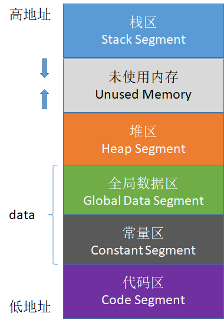
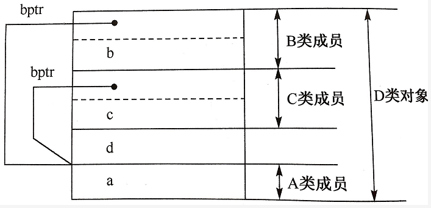
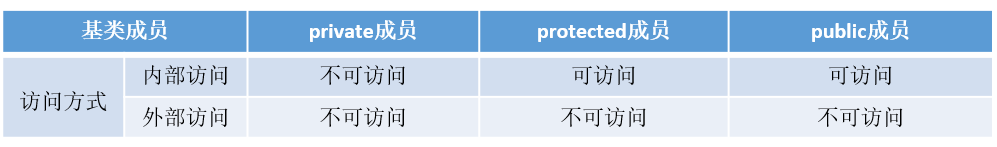

## struct与class


#### struct定义和声明

```c++
/* struct.c
*  本程序演示了struct的种种写法。注意，所有这些写法都能编译通过
*  author: smileonce
*  date  : 2005-01-14
*/


// 这种写法是最要命的，但是它却可以通过, 最后面那个foo是结构体的实例
struct foo
{
    int foo;
} foo;

// 有了typedef，意义明显与上面不同，注意的是struct后面那个标签可以不写，最后面那个bar是匿名结构体的别名
typedef struct 
{
    int bar;
} bar;

// 这种写法是最没人用的，因为它的定义是一次性的,struct1是一个匿名struct的实例
struct 
{
    int aaa;
} mystruct1;

//最常用的写法，清晰不言自明，my_struct_tag是结构体标签，my_struct_type是struct my_struct_tag的别名
typedef struct my_struct_tag
{
    int aaa;
} my_struct_type;

// 下面两种定义的写法都可以，当然使用typedef定义的写法更简洁些
my_struct_type mystruct2;             //通过typedef定义的结构别名来定义变量
struct my_struct_tag mystruct3;       //通过结构标签定义变量


int main(int argc, char *argv[])
{
 	return 0;
}


可以通过struct来实现。（个人感觉有点像python的字典）

定义的方式：

第一步：声明结构类型：

　　struct  类型名字{

　　变量类型1  变量名；

　　变量类型2 变量名；

　　　　。。。

　　变量类型3 变量名；

　　}**；**

第二步：

　　 2定义新的变量
　　struct date 变量名;

第三步：

　　变量赋初始值
　　struct date today = {07,12,2017};
　　struct date today = {.month=01,.year=2012};
　　// 两种赋值方法，没有指定的默认0，例如数组。

 

当然声明数据类型还有两种方式。

一种是：

　　 struct {

　　*}p1,p2;
　　 p1,p2 是这个无名类型的两个变量，这是你可能仅仅需要这两个变量就足够用了，不需要再去声明一种数据类型。*

*另一种是：*

　　 *struct point***{**

　　 **}p1,p2;
　　这种申明数据类型的方法，同时做了两件事，一是声明一个类型，二是创建两个变量。**
```


#### （10） Struct和class的区别

* 使用struct时，它的成员的访问权限默认是public的，而class的成员默认是private的
* struct的继承默认是public继承，而class的继承默认是private继承
* class可以用作模板，而struct不能


#### 22、C++中struct和class的区别

**相同点**

- 两者都拥有成员函数、公有和私有部分
- 任何可以使用class完成的工作，同样可以使用struct完成

**不同点**

- 两者中如果不对成员不指定公私有，struct默认是公有的，class则默认是私有的

- class默认是private继承，而struct模式是public继承

  


**引申**：C++和C的struct区别

- C语言中：struct是用户自定义数据类型（UDT）；C++中struct是抽象数据类型（ADT），支持成员函数的定义，（C++中的struct能继承，能实现多态）

- C中struct是没有权限的设置的，且struct中只能是一些变量的集合体，可以封装数据却不可以隐藏数据，而且成员**不可以是函数**
- C++中，struct增加了访问权限，且可以和类一样有成员函数，成员默认访问说明符为public（为了与C兼容）

- struct作为类的一种特例是用来自定义数据结构的。一个结构标记声明后，在C中必须在结构标记前加上struct，才能做结构类型名（除：typedef struct class{};）;C++中结构体标记（结构体名）可以直接作为结构体类型名使用，此外结构体struct在C++中被当作类的一种特例

> 《struct结构在C和C++中的区别》：https://blog.csdn.net/mm_hh/article/details/70456240


#### 118、 结构体变量比较是否相等

1)   重载了 “==” 操作符

~~~cpp
struct foo {  int a;  int b;  bool operator==(const foo& rhs) *//* *操作运算符重载*  {    return( a == rhs.a) && (b == rhs.b);  }};
~~~


2)   元素的话，一个个比；

3)   指针直接比较，如果保存的是同一个实例地址，则(p1==p2)为真；


## 内存


#### malloc和new的区别

在申请分配动态内存时，malloc和new一直都困扰着程序员，今天就作个简单的对比，找到它们的区别：

一、主要区别

1,malloc与free是C++/C语言的标准库函数，new/delete是C++的运算符。它们都可用于申请动态内存和释放内存。

2,对于非内部数据类型的对象而言，光用maloc/free无法满足动态对象的要求。对象在创建的同时要自动执行构造函数，对象在消亡之前要自动执行析构函数。由于malloc/free是库函数而不是运算符，不在编译器控制权限之内，不能够把执行构造函数和析构函数的任务强加于malloc/free。

3,因此C++语言需要一个能完成动态内存分配和初始化工作的运算符new，以一个能完成清理与释放内存工作的运算符delete。注意new/delete不是库函数。


4,C++程序经常要调用C函数，而C程序只能用malloc/free管理动态内存，new 是个操作符,和什么"+","-","="...有一样的地位. malloc是个分配内存的函数,供你调用的.

new是保留字,不需要头文件支持.malloc需要头文件库函数支持.new 建立的是一个对象,malloc分配的是一块内存.

简单的说: malloc,free是c的函数,而new,delete是c++的运算符 。此外,new是强制类型的,malloc不是,需要类型转换 ，当然还有很多不同： new 可以调用构造函数在声明的时候初始化，而 malloc只是分配空间,需要在其他地方初始化 ；delete不仅会释放空间,在释放前会调用析构函数 ，而且malloc需要指定分配空间大小, 而new是自动计算的 。

注意：free()释放的是指针指向的内存！注意！释放的是内存，不是指针！这点非常非常重要！指针是一个变量，只有程序结束时才被销毁。释放了内存空间后，原来指向这块空间的指针还是存在！只不过现在指针指向的内容的垃圾，是未定义的，所以说是垃圾。因此，前面我已经说过了，释放内存后把指针指向NULL，防止指针在后面不小心又被解引用了。

二、简要分析

1、malloc函数

1.1 malloc的全称是memory allocation，中文叫动态内存分配。
原型：extern void *malloc(unsigned int num_bytes); 
说明：分配长度为num_bytes字节的内存块。如果分配成功则返回指向被分配内存的指针，**分配失败返回空指针NULL**。当内存不再使用时，应使用free()函数将内存块释放。

1.2 void *malloc(int size); 
说明：malloc 向系统申请分配指定size个字节的内存空间，返回类型是 void* 类型。void* 表示未确定类型的指针。C,C++规定，void* 类型可以强制转换为任何其它类型的指针。 　　
备注：void* 表示未确定类型的指针，更明确的说是指申请内存空间时还不知道用户是用这段空间来存储什么类型的数据（比如是char还是int或者...）

1.3 free
void free(void *FirstByte)： 该函数是将之前用malloc分配的空间还给程序或者是操作系统，也就是释放了这块内存，让它重新得到自由。

1.4注意事项

1）申请了内存空间后，**必须检查是否分配成功**。
2）当不需要再使用申请的内存时，**记得释放；释放后应该把指向这块内存的指针指向NULL**，防止程序后面不小心使用了它。 
3）这两个函数应该是配对。如果申请后不释放就是内存泄露；如果无故释放那就是什么也没有做。**释放只能一次，如果释放两次及两次以上会出现错误**（释放空指针例外，释放空指针其实也等于啥也没做，所以释放空指针释放多少次都没有问题）。
4）虽然malloc()函数的类型是(void *),任何类型的指针都可以转换成(void *),但是最好还是在前面进行强制类型转换，因为这样可以躲过一些编译器的检查。

1.5 malloc()到底从哪里得到了内存空间？

答案是从堆里面获得空间。也就是说函数返回的指针是指向堆里面的一块内存。操作系统中有一个记录空闲内存地址的链表。当操作系统收到程序的申请时，就会遍历该链表，然后就寻找第一个空间大于所申请空间的堆结点，然后就将该结点从空闲结点链表中删除，并将该结点的空间分配给程序。

2、new运算符

2.1 C++中，用new和delete动态创建和释放数组或**单个对象**。

动态创建对象时，**只需指定其数据类型，而不必为该对象命名**，new表达式**返回指向该新创建对象的指针**，我们可以**通过指针来访问此对象**。
int *pi=new int;
这个new表达式在堆区中分配创建了一个整型对象，并返回此对象的地址，并用该地址初始化指针pi 。

2.2 动态创建对象的初始化

动态创建的对象可以用初始化变量的方式初始化。
int *pi=new int(100); //指针pi所指向的对象**初始化**为100
string *ps=new string(10,’9’);//*ps 为“9999999999”

**如果不提供显示初始化，**对于类类型，用该类的**默认构造函数初始化**；而**内置类型的对象则无初始化**。
也可以对动态创建的对象做值初始化：
int *pi=new int( );//初始化为0
int *pi=new int;//pi 指向一个没有初始化的int
string *ps=new string( );//初始化为空字符串 （对于提供了默认构造函数的类类型，没有必要对其对象进行值初始化）

2.3 撤销动态创建的对象

delete表达式释放指针指向的地址空间。
delete pi ;// 释放单个对象
delete [ ]pi;//释放数组
如果指针指向的不是new分配的内存地址，则使用delete是不合法的。

2.4 在delete之后，重设指针的值

delete p; //执行完该语句后，p变成了不确定的指针，在很多机器上，尽管p值没有明确定义，但仍然存放了它之前所指对象的地址，然后p所指向的内存已经被释放了，所以p不再有效。此时，该指针变成了悬垂指针（悬垂指针指向曾经存放对象的内存，但该对象已经不存在了）。悬垂指针往往导致程序错误，而且很难检测出来。
**一旦删除了指针所指的对象，立即将指针置为0**，这样就非常清楚的指明指针不再指向任何对象。（零值指针：int *ip=0;）

2.5 区分零值指针和NULL指针

零值指针，是值是0的指针，可以是任何一种指针类型，可以是通用变体类型void*也可以是char*，int*等等。
空指针，其实空指针只是一种编程概念，就如一个容器可能有空和非空两种基本状态，而在非空时可能里面存储了一个数值是0，因此空指针是人为认为的指针不提供任何地址讯息。

2.6 **new分配失败时，返回什么？**

1993年前，c++一直要求在内存分配失败时operator  new要**返回0**，现在则是要求operator  new**抛出std::bad_alloc异常**。很多c++程序是在编译器开始支持新规范前写的。c++标准委员会不想放弃那些已有的遵循返回0规范的代码，所以他们提供了另外形式的operator  new(以及operator  new[])以继续提供返回0功能。这些形式被称为“无抛出”，因为他们没用过一个throw，而是**在使用new的入口点采用了no throw对象**: 
class  widget  {  ...  };

widget  *pw1  =  new  widget;//  分配失败抛出std::bad_alloc 

if  (pw1  ==  0)  ... //  这个检查一定失败

widget  *pw2  =  new  (nothrow)  widget;  //  若分配失败返回0

if  (pw2  ==  0)  ... //  这个检查可能会成功

\3. malloc和new的区别

3.1 **new 返回指定类型的指针，并且可以自动计算所需要大小。**
比如： 　　
1) int *p; 　　
p = new int; //返回类型为int* 类型(整数型指针)，分配大小为 sizeof(int); 　　
或： 　　
int* parr; 　　
parr = new int [100]; //返回类型为 int* 类型(整数型指针)，分配大小为 sizeof(int) * 100; 　　
2) 而 **malloc 则必须要由我们计算字节数，并且在返回后强行转换为实际类型的指针。** 　
int* p; 　　
p = (int *) malloc (sizeof(int)*128);//分配128个（可根据实际需要替换该数值）整型存储单元，并将这128个连续的整型存储单元的首地址存储到指针变量p中 
double *pd=(double *) malloc (sizeof(double)*12);//分配12个double型存储单元，并将首地址存储到指针变量pd中

3.2 ***\*malloc 只管分配内存，并不能对所得的内存进行初始化\**，**所以**得到的一片新内存中，其值将是随机的**。
除了分配及最后释放的方法不一样以外，通过malloc或new得到指针，在其它操作上保持一致。

4.有了malloc/free为什么还要new/delete？

1) malloc与free是C++/C语言的标准库函数，new/delete是C++的运算符。它们都可用于申请动态内存和释放内存。
2) 对于**非内部数据类型的对象**而言，光用maloc/free无法满足动态对象的要求。**对象在创建的同时要自动执行构造函数，对象在消亡之前要自动执行析构函数。**由于malloc/free是库函数而不是运算符，不在编译器控制权限之内，不能够把执行构造函数和析构函数的任务强加于malloc/free。
因此C++语言***\*需要一个能完成动态内存分配和初始化工作的运算符new\****，以及**一个能完成清理与释放内存工作的运算符delete。**注意new/delete不是库函数。
我们不要企图用malloc/free来完成动态对象的内存管理，应该用new/delete。由于内部数据类型的“对象”没有构造与析构的过程，对它们而言malloc/free和new/delete是等价的。
3) 既然new/delete的功能完全覆盖了malloc/free，为什么C++不把malloc/free淘汰出局呢？这是因为C++程序经常要调用C函数，而C程序只能用malloc/free管理动态内存。
如果用free释放“new创建的动态对象”，那么该对象因无法执行析构函数而可能导致程序出错。如果用delete释放“malloc申请的动态内存”，结果也会导致程序出错，但是该程序的可读性很差。所以new/delete必须配对使用，malloc/free也一样。


#### 14、 内存泄漏的后果？如何监测？解决方法？

1)  内存泄漏

内存泄漏是指由于疏忽或错误造成了程序未能释放掉不再使用的内存的情况。内存泄漏并非指内存在物理上消失，而是应用程序分配某段内存后，由于设计错误，失去了对该段内存的控制；

2)  后果

只发生一次小的内存泄漏可能不被注意，但泄漏大量内存的程序将会出现各种症状：性能下降到内存逐渐用完，导致另一个程序失败；

3)  如何排除

使用工具软件BoundsChecker，BoundsChecker是一个运行时错误检测工具，它主要定位程序运行时期发生的各种错误；

调试运行DEBUG版程序，运用以下技术：CRT(C run-time libraries)、运行时函数调用堆栈、内存泄漏时提示的内存分配序号(集成开发环境OUTPUT窗口)，综合分析内存泄漏的原因，排除内存泄漏。

4)  解决方法

智能指针。

5)  检查、定位内存泄漏

检查方法：在main函数最后面一行，加上一句_CrtDumpMemoryLeaks()。调试程序，自然关闭程序让其退出，查看输出：

输出这样的格式{453}normal block at 0x02432CA8,868 bytes long

被{}包围的453就是我们需要的内存泄漏定位值，868 bytes long就是说这个地方有868比特内存没有释放。

定位代码位置

在main函数第一行加上_CrtSetBreakAlloc(453);意思就是在申请453这块内存的位置中断。然后调试程序，程序中断了，查看调用堆栈。加上头文件#include <crtdbg.h>


#### （38） 内存泄露的定义，如何检测与避免？

动态分配内存所开辟的空间，在使用完毕后未手动释放，导致一直占据该内存，即为内存泄漏。

造成内存泄漏的几种原因：

1）类的构造函数和析构函数中new和delete没有配套

2）在释放对象数组时没有使用delete\[\]，使用了delete

3）没有将基类的析构函数定义为虚函数，当基类指针指向子类对象时，如果基类的析构函数不是virtual，那么子类的析构函数将不会被调用，子类的资源没有正确释放，因此造成内存泄露

4）没有正确的清楚嵌套的对象指针

避免方法：

1. malloc/free要配套
2. 使用智能指针；
3. 将基类的析构函数设为虚函数；


#### 69、什么是内存泄露，如何检测与避免

**内存泄露**

一般我们常说的内存泄漏是指**堆内存的泄漏**。堆内存是指程序从堆中分配的，大小任意的(内存块的大小可以在程序运行期决定)内存块，使用完后必须显式释放的内存。应用程序般使用malloc,、realloc、 new等函数从堆中分配到块内存，使用完后，程序必须负责相应的调用free或delete释放该内存块，否则，这块内存就不能被再次使用，我们就说这块内存泄漏了

**避免内存泄露的几种方式**

- 计数法：使用new或者malloc时，让该数+1，delete或free时，该数-1，程序执行完打印这个计数，如果不为0则表示存在内存泄露
- 一定要将基类的析构函数声明为**虚函数**
- 对象数组的释放一定要用**delete []**
- 有new就有delete，有malloc就有free，保证它们一定成对出现

**检测工具**

- Linux下可以使用**Valgrind工具**
- Windows下可以使用**CRT库**


#### 48、简要说明C++的内存分区

C++中的内存分区，分别是堆、栈、自由存储区、全局/静态存储区、常量存储区和代码区。如下图所示



　　

**栈**：在执行函数时，函数内局部变量的存储单元都可以在栈上创建，函数执行结束时这些存储单元自动被释放。栈内存分配运算内置于处理器的指令集中，效率很高，但是分配的内存容量有限

**堆**：就是那些由 `new`分配的内存块，他们的释放编译器不去管，由我们的应用程序去控制，一般一个`new`就要对应一个 `delete`。如果程序员没有释放掉，那么在程序结束后，操作系统会自动回收

**自由存储区**：就是那些由`malloc`等分配的内存块，它和堆是十分相似的，不过它是用`free`来结束自己的生命的

**全局/静态存储区**：全局变量和静态变量被分配到同一块内存中，在以前的C语言中，全局变量和静态变量又分为初始化的和未初始化的，在C++里面没有这个区分了，它们共同占用同一块内存区，在该区定义的变量若没有初始化，则会被自动初始化，例如int型变量自动初始为0

**常量存储区**：这是一块比较特殊的存储区，这里面存放的是常量，不允许修改

**代码区**：存放函数体的二进制代码

> 《C/C++内存管理详解》：https://chenqx.github.io/2014/09/25/Cpp-Memory-Management/


BSS段

在采用[段式内存管理](http://blog.linuxpk.com/title=段式内存管理&action=edit)的架构中，BSS段（bss segment）通常是指用来存放[程序](http://wiki.csdn.net/index.php/程序)中未[初始化](http://blog.linuxpk.com/title=初始化&action=edit)的[全局变量](http://blog.linuxpk.com/title=全局变量&action=edit)的一块内存区域。BSS是英文Block Started by Symbol的简称。BSS段属于[静态内存分配](http://blog.linuxpk.com/title=静态内存分配&action=edit)。

数据段

在采用[段式内存管理](http://blog.linuxpk.com/title=段式内存管理&action=edit)的架构中，数据段（data segment）通常是指用来存放[程序](http://wiki.csdn.net/index.php/程序)中已[初始化](http://blog.linuxpk.com/title=初始化&action=edit)的[全局变量](http://blog.linuxpk.com/title=全局变量&action=edit)的一块内存区域。数据段属于[静态内存分配](http://blog.linuxpk.com/title=静态内存分配&action=edit)。

代码段

在采用[段式内存管理](http://blog.linuxpk.com/title=段式内存管理&action=edit)的架构中，代码段（text segment）通常是指用来存放[程序](http://wiki.csdn.net/index.php/程序)执行代码的一块内存区域。这部分区域的大小在程序运行前就已经确定，并且内存区域属于只读。在代码段中，也有可能包含一些只读的常数变量，例如[字符串](http://wiki.csdn.net/index.php/字符串)[常量](http://blog.linuxpk.com/title=常量&action=edit)等。

堆栈

堆栈又称堆栈（stack）在计算机科学中，是一种特殊的链表形式的数据结构，它的特殊之处在于只能允许在链表的一端（称为栈顶，英文为top）进行添加和删除操作。另外堆栈数据结构的实现也可以通过数组来完成。

严格来说堆是指Heap，程序运行时供程序员来支配的一段内存。而栈Stack,多指函数调用时候参数的相互传递存在的内存区域。

由于堆栈数据结构只允许在一端进行操作，因而按照先进后出（LIFO-Last In First Out）的原理工作。

堆栈数据结构支持两种基本操作：压栈（push）和弹栈（pop）：

\1.         压栈（入栈）：将对象或者数据压入栈中，更新栈顶指针，使其指向最后入栈的对象或数据。2.         弹栈（出栈）：返回栈顶指向的对象或数据，并从栈中删除该对象或数据，更新栈顶 


#### （23） C ++内存管理（热门问题）

https://blog.csdn.net/qq_43152052/article/details/98889139

在C\+\+中，内存分成5个区，他们分别是堆、栈、全局/静态存储区和常量存储区和代码区。

* 栈，在执行函数时，函数内局部变量的存储单元都可以在栈上创建，函数执行结束时这些存储单元自动被释放。栈内存分配运算内置于处理器的指令集中，效率很高，但是分配的内存容量有限。
* 堆，就是那些由new分配的内存块，他们的释放编译器不去管，由我们的应用程序去控制，一般一个new就要对应一个delete。如果程序员没有释放掉，那么在程序结束后，操作系统会自动回收。
* 全局/静态存储区，内存在程序编译的时候就已经分配好，这块内存在程序的整个运行期间都存在。它主要存放静态数据（局部static变量，全局static变量）、全局变量和常量。
* 常量存储区，这是一块比较特殊的存储区，他们里面存放的是常量字符串，不允许修改。
* 代码区，存放程序的二进制代码

关于这个有很多种说法，有的会增加一个自由存储区，存放malloc分配得到的内存，与堆相似。


#### （2） 堆和栈有什么区别

* 从定义上：堆是由new和malloc开辟的一块内存，由程序员手动管理，栈是编译器自动管理的内存，存放函数的参数和局部变量。
* 堆空间因为会有频繁的分配释放操作，会产生内存碎片
* 堆的生长空间向上，地址越来越大，栈的生长空间向下，地址越来越小


#### （3）堆快一点还是栈快一点？（字节提前批一面）

栈快一点。因为操作系统会在底层对栈提供支持，会分配专门的寄存器存放栈的地址，栈的入栈出栈操作也十分简单，并且有专门的指令执行，所以栈的效率比较高也比较快。而堆的操作是由C/C++函数库提供的，在分配堆内存的时候需要一定的算法寻找合适大小的内存。并且获取堆的内容需要两次访问，第一次访问指针，第二次根据指针保存的地址访问内存，因此堆比较慢。


#### 4、堆和栈的区别

- 申请方式不同。

  - 栈由系统自动分配。

- 堆是自己申请和释放的。

- 申请大小限制不同。

  - 栈顶和栈底是之前预设好的，栈是向栈底扩展，大小固定，可以通过ulimit -a查看，由ulimit -s修改。

  - 堆向高地址扩展，是不连续的内存区域，大小可以灵活调整。

- 申请效率不同。

  - 栈由系统分配，速度快，不会有碎片。

  - 堆由程序员分配，速度慢，且会有碎片。

    

   栈空间默认是4M, 堆区一般是 1G - 4G 

|                  | 堆                                                           | 栈                                                           |
| :--------------- | ------------------------------------------------------------ | ------------------------------------------------------------ |
| **管理方式**     | 堆中资源由程序员控制（容易产生memory leak）                  | 栈资源由编译器自动管理，无需手工控制                         |
| **内存管理机制** | 系统有一个记录空闲内存地址的链表，当系统收到程序申请时，遍历该链表，寻找第一个空间大于申请空间的堆结点，删    除空闲结点链表中的该结点，并将该结点空间分配给程序（大多数系统会在这块内存空间首地址记录本次分配的大小，这样delete才能正确释放本内存空间，另外系统会将多余的部分重新放入空闲链表中） | 只要栈的剩余空间大于所申请空间，系统为程序提供内存，否则报异常提示栈溢出。（这一块理解一下链表和队列的区别，不连续空间和连续空间的区别，应该就比较好理解这两种机制的区别了） |
| **空间大小**     | 堆是不连续的内存区域（因为系统是用链表来存储空闲内存地址，自然不是连续的），堆大小受限于计算机系统中有效的虚拟内存（32bit  系统理论上是4G），所以堆的空间比较灵活，比较大 | 栈是一块连续的内存区域，大小是操作系统预定好的，windows下栈大小是2M（也有是1M，在  编译时确定，VC中可设置） |
| **碎片问题**     | 对于堆，频繁的new/delete会造成大量碎片，使程序效率降低       | 对于栈，它是有点类似于数据结构上的一个先进后出的栈，进出一一对应，不会产生碎片。（看到这里我突然明白了为什么面试官在问我堆和栈的区别之前先问了我栈和队列的区别） |
| **生长方向**     | 堆向上，向高地址方向增长。                                   | 栈向下，向低地址方向增长。                                   |
| **分配方式**     | 堆都是动态分配（没有静态分配的堆）                           | 栈有静态分配和动态分配，静态分配由编译器完成（如局部变量分配），动态分配由alloca函数分配，但栈的动态分配的资源由编译器进行释放，无需程序员实现。 |
| **分配效率**     | 堆由C/C++函数库提供，机制很复杂。所以堆的效率比栈低很多。    | 栈是其系统提供的数据结构，计算机在底层对栈提供支持，分配专门  寄存器存放栈地址，栈操作有专门指令。 |

**形象的比喻**

栈就像我们去饭馆里吃饭，只管点菜（发出申请）、付钱、和吃（使用），吃饱了就走，不必理会切菜、洗菜等准备工作和洗碗、刷锅等扫尾工作，他的好处是快捷，但是自由度小。

堆就象是自己动手做喜欢吃的菜肴，比较麻烦，但是比较符合自己的口味，而且自由度大。

> 《C++中堆（heap）和栈(stack)的区别》：https://blog.csdn.net/qq_34175893/article/details/83502412


- 


#### 61、new和malloc的区别？

1、 new/delete是C++关键字，需要编译器支持。malloc/free是库函数，需要头文件支持；

2、 使用new操作符申请内存分配时无须指定内存块的大小，编译器会根据类型信息自行计算。而malloc则需要显式地指出所需内存的尺寸。

3、 new操作符内存分配成功时，返回的是对象类型的指针，类型严格与对象匹配，无须进行类型转换，故new是符合类型安全性的操作符。而malloc内存分配成功则是返回void * ，需要通过强制类型转换将void*指针转换成我们需要的类型。

4、 new内存分配失败时，会抛出bac_alloc异常。malloc分配内存失败时返回NULL。

5、 new会先调用operator new函数，申请足够的内存（通常底层使用malloc实现）。然后调用类型的构造函数，初始化成员变量，最后返回自定义类型指针。delete先调用析构函数，然后调用operator delete函数释放内存（通常底层使用free实现）。malloc/free是库函数，只能动态的申请和释放内存，无法强制要求其做自定义类型对象构造和析构工作。


#### （4） new和delete是如何实现的，new 与 malloc的异同处

在new一个对象的时候，首先会调用malloc为对象分配内存空间，然后调用对象的构造函数。delete会调用对象的析构函数，然后调用free回收内存。

new与malloc都会分配空间，但是new还会调用对象的构造函数进行初始化，malloc需要给定空间大小，而new只需要对象名


#### （5）既然有了malloc/free，C++中为什么还需要new/delete呢？

https://blog.csdn.net/leikun153/article/details/80612130

* malloc/free和new/delete都是用来申请内存和回收内存的。
* 在对非基本数据类型的对象使用的时候，对象创建的时候还需要执行构造函数，销毁的时候要执行析构函数。而malloc/free是库函数，是已经编译的代码，所以不能把构造函数和析构函数的功能强加给malloc/free。


#### 63、new和delete的实现原理， delete是如何知道释放内存的大小的额？

1、 new简单类型直接调用operator new分配内存；

而对于复杂结构，先调用operator new分配内存，然后在分配的内存上调用构造函数；

对于简单类型，new[]计算好大小后调用operator new；

对于复杂数据结构，new[]先调用operator new[]分配内存，然后在p的前四个字节写入数组大小n，然后调用n次构造函数，针对复杂类型，new[]会额外存储数组大小；

①   new表达式调用一个名为operator new(operator new[])函数，分配一块足够大的、原始的、未命名的内存空间；

②   编译器运行相应的构造函数以构造这些对象，并为其传入初始值；

③   对象被分配了空间并构造完成，返回一个指向该对象的指针。

2、 delete简单数据类型默认只是调用free函数；复杂数据类型先调用析构函数再调用operator delete；针对简单类型，delete和delete[]等同。假设指针p指向new[]分配的内存。因为要4字节存储数组大小，实际分配的内存地址为[p-4]，系统记录的也是这个地址。delete[]实际释放的就是p-4指向的内存。而delete会直接释放p指向的内存，这个内存根本没有被系统记录，所以会崩溃。

3、 需要在 new [] 一个对象数组时，需要保存数组的维度，C++ 的做法是在分配数组空间时多分配了 4 个字节的大小，专门保存数组的大小，在 delete [] 时就可以取出这个保存的数，就知道了需要调用析构函数多少次了。


#### 64、malloc申请的存储空间能用delete释放吗

不能，malloc /free主要为了兼容C，new和delete 完全可以取代malloc /free的。

malloc /free的操作对象都是必须明确大小的，而且不能用在动态类上。

new 和delete会自动进行类型检查和大小，malloc/free不能执行构造函数与析构函数，所以动态对象它是不行的。

当然从理论上说使用malloc申请的内存是可以通过delete释放的。不过一般不这样写的。而且也不能保证每个C++的运行时都能正常。


#### 62、delete p、delete [] p、allocator都有什么作用？

1、 动态数组管理new一个数组时，[]中必须是一个整数，但是不一定是常量整数，普通数组必须是一个常量整数；

2、 new动态数组返回的并不是数组类型，而是一个元素类型的指针；

3、 delete[]时，数组中的元素按逆序的顺序进行销毁；

4、 new在内存分配上面有一些局限性，new的机制是将内存分配和对象构造组合在一起，同样的，delete也是将对象析构和内存释放组合在一起的。allocator将这两部分分开进行，allocator申请一部分内存，不进行初始化对象，只有当需要的时候才进行初始化操作。


#### 9.1、delete和delete[]区别？(补充)

- delete只会调用一次析构函数。
- delete[]会调用数组中每个元素的析构函数。


#### 65、malloc与free的实现原理？

1、 在标准C库中，提供了malloc/free函数分配释放内存，这两个函数底层是由brk、mmap、，munmap这些系统调用实现的;

2、 brk是将数据段(.data)的最高地址指针_edata往高地址推,mmap是在进程的虚拟地址空间中（堆和栈中间，称为文件映射区域的地方）找一块空闲的虚拟内存。这两种方式分配的都是虚拟内存，没有分配物理内存。在第一次访问已分配的虚拟地址空间的时候，发生缺页中断，操作系统负责分配物理内存，然后建立虚拟内存和物理内存之间的映射关系；

3、 malloc小于128k的内存，使用brk分配内存，将_edata往高地址推；malloc大于128k的内存，使用mmap分配内存，在堆和栈之间找一块空闲内存分配；brk分配的内存需要等到高地址内存释放以后才能释放，而mmap分配的内存可以单独释放。当最高地址空间的空闲内存超过128K（可由M_TRIM_THRESHOLD选项调节）时，执行内存紧缩操作（trim）。在上一个步骤free的时候，发现最高地址空闲内存超过128K，于是内存紧缩。

4、 malloc是从堆里面申请内存，也就是说函数返回的指针是指向堆里面的一块内存。操作系统中有一个记录空闲内存地址的链表。当操作系统收到程序的申请时，就会遍历该链表，然后就寻找第一个空间大于所申请空间的堆结点，然后就将该结点从空闲结点链表中删除，并将该结点的空间分配给程序。


#### （53）被free回收的内存是立即返还给操作系统吗？为什么

https://blog.csdn.net/YMY_mine/article/details/81180168

不是的，被free回收的内存会首先被ptmalloc使用双链表保存起来，当用户下一次申请内存的时候，会尝试从这些内存中寻找合适的返回。这样就避免了频繁的系统调用，占用过多的系统资源。同时ptmalloc也会尝试对小块内存进行合并，避免过多的内存碎片。


#### 66、malloc、realloc、calloc的区别

1)   malloc函数

~~~cpp
void* malloc(unsigned int num_size);int *p = malloc(20*sizeof(int));申请20个int类型的空间；
~~~


2)   calloc函数

~~~cpp
void* calloc(size_t n,size_t size);int *p = calloc(20, sizeof(int));
~~~

省去了人为空间计算；malloc申请的空间的值是随机初始化的，calloc申请的空间的值是初始化为0的；

3)   realloc函数

~~~cpp
void realloc(void *p, size_t new_size);
~~~

给动态分配的空间分配额外的空间，用于扩充容量。


#### 57、什么是内存池，如何实现

>https://www.bilibili.com/video/BV1Kb411B7N8?p=25 C++内存管理：P23-26
>
>https://www.bilibili.com/video/BV1db411q7B8?p=12 C++STL P11

内存池（Memory Pool） 是一种**内存分配**方式。通常我们习惯直接使用new、malloc 等申请内存，这样做的缺点在于：由于所申请内存块的大小不定，当频繁使用时会造成大量的内存碎片并进而降低性能。内存池则是在真正使用内存之前，先申请分配一定数量的、大小相等(一般情况下)的内存块留作备用。当有新的内存需求时，就从内存池中分出一部分内存块， 若内存块不够再继续申请新的内存。这样做的一个显著优点是尽量避免了内存碎片，使得内存分配效率得到提升。

这里简单描述一下《STL源码剖析》中的内存池实现机制：

allocate包装malloc,deallocate包装free

一般是一次20*2个的申请，先用一半，留着一半，为什么也没个说法，侯捷在STL那边书里说好像是C++委员会成员认为20是个比较好的数字，既不大也不小

1. 首先客户端会调用malloc()配置一定数量的区块（固定大小的内存块，通常为8的倍数），假设40个32bytes的区块，其中20个区块（一半）给程序实际使用，1个区块交出，另外19个处于维护状态。剩余20个（一半）留给内存池，此时一共有（20*32byte）
2. 客户端之后有有内存需求，想申请（20\*64bytes）的空间，这时内存池只有（20*32bytes），就先将（10\*64bytes)个区块返回，1个区块交出，另外9个处于维护状态，此时内存池空空如也
3. 接下来如果客户端还有内存需求，就必须再调用malloc()配置空间，此时新申请的区块数量会增加一个随着配置次数越来越大的附加量，同样一半提供程序使用，另一半留给内存池。申请内存的时候用永远是先看内存池有无剩余，有的话就用上，然后挂在0-15号某一条链表上，要不然就重新申请。
4. 如果整个堆的空间都不够了，就会在原先已经分配区块中寻找能满足当前需求的区块数量，能满足就返回，不能满足就向客户端报bad_alloc异常

> 《STL源码解析》侯捷 P68

allocator就是用来分配内存的，最重要的两个函数是allocate和deallocate，就是用来申请内存和回收内存的，外部（一般指容器）调用的时候只需要知道这些就够了。内部实现，目前的所有编译器都是直接调用的::operator new()和::operator delete()，说白了就是和直接使用new运算符的效果是一样的，所以老师说它们都没做任何特殊处理。 


最开始GC2.9之前：

new和 operator new 的区别：new 是个运算符，编辑器会调用 operator new(0)

operator new()里面有调用malloc的操作，那同样的 operator delete()里面有调用的free的操作


GC2.9的alloc的一个比较好的分配器的实现规则

维护一条0-15号的一共16条链表，其中0表示8 bytes ，1表示 16 bytes,2表示 24bytes。。。。而15 表示 16* 8 = 128bytes，如果在申请时并不是8的倍数，那就找刚好能满足内存大小的那个位置。比如想申请 12，那就是找16了，想申请 20 ，那就找 24 了


但是现在GC4.9及其之后 也还有，变成_pool_alloc这个名字了，不再是默认的了，你需要自己去指定它可以自己指定，比如说vector\<string,__gnu_cxx::pool_alloc<string>> vec;这样来使用它，现在用的又回到以前那种对malloc和free的包装形式了


#### 46、C++中有几种类型的new

在C++中，new有三种典型的使用方法：plain new，nothrow new和placement new

（1）**plain new**

言下之意就是普通的new，就是我们常用的new，在C++中定义如下：

```C++
void* operator new(std::size_t) throw(std::bad_alloc);void operator delete(void *) throw();
```

因此**plain new**在空间分配失败的情况下，抛出异常**std::bad_alloc**而不是返回NULL，因此通过判断返回值是否为NULL是徒劳的，举个例子：

```C++
#include <iostream>#include <string>using namespace std;int main(){    try	{		        char *p = new char[10e11];	        delete p;	    }	    catch (const std::bad_alloc &ex)    {		        cout << ex.what() << endl;    }	    return 0;}//执行结果：bad allocation
```

（2）**nothrow new**

nothrow new在空间分配失败的情况下是不抛出异常，而是返回NULL，定义如下：

```C++
void * operator new(std::size_t,const std::nothrow_t&) throw();void operator delete(void*) throw();
```

举个例子：

```C++
#include <iostream>#include <string>using namespace std;int main(){	char *p = new(nothrow) char[10e11];	if (p == NULL) 	{		cout << "alloc failed" << endl;	}	delete p;	return 0;}//运行结果：alloc failed
```

（3）**placement new**

这种new允许在一块已经分配成功的内存上重新构造对象或对象数组。placement new不用担心内存分配失败，因为它根本不分配内存，它做的唯一一件事情就是调用对象的构造函数。定义如下：

```C++
void* operator new(size_t,void*);void operator delete(void*,void*);
```

使用placement new需要注意两点：

- palcement new的主要用途就是反复使用一块较大的动态分配的内存来构造不同类型的对象或者他们的数组

- placement new构造起来的对象数组，要显式的调用他们的析构函数来销毁（析构函数并不释放对象的内存），千万不要使用delete，这是因为placement new构造起来的对象或数组大小并不一定等于原来分配的内存大小，使用delete会造成内存泄漏或者之后释放内存时出现运行时错误。

举个例子：

```C++
#include <iostream>#include <string>using namespace std;class ADT{	int i;	int j;public:	ADT(){		i = 10;		j = 100;		cout << "ADT construct i=" << i << "j="<<j <<endl;	}	~ADT(){		cout << "ADT destruct" << endl;	}};int main(){	char *p = new(nothrow) char[sizeof ADT + 1];	if (p == NULL) {		cout << "alloc failed" << endl;	}	ADT *q = new(p) ADT;  //placement new:不必担心失败，只要p所指对象的的空间足够ADT创建即可	//delete q;//错误!不能在此处调用delete q;	q->ADT::~ADT();//显示调用析构函数	delete[] p;	return 0;}//输出结果：//ADT construct i=10j=100//ADT destruct
```

> 《【C++】几种类型的new介绍》：https://www.jianshu.com/p/9b57e769c3cb


#### 7、new / delete 与 malloc / free的异同

**相同点**

- 都可用于内存的动态申请和释放

**不同点**

- 前者是C++运算符，后者是C/C++语言标准库函数
- new自动计算要分配的空间大小，malloc需要手工计算
- new是类型安全的，malloc不是。例如：

```C++
int *p = new float[2]; //编译错误int *p = (int*)malloc(2 * sizeof(double));//编译无错误
```

*  new调用名为**operator new**的标准库函数分配足够空间并调用相关对象的构造函数，delete对指针所指对象运行适当的析构函数；然后通过调用名为**operator delete**的标准库函数释放该对象所用内存。后者均没有相关调用
*  后者需要库文件支持，前者不用
*  new是封装了malloc，直接free不会报错，但是这只是释放内存，而不会析构对象 


#### 8、new和delete是如何实现的？

- new的实现过程是：首先调用名为**operator new**的标准库函数，分配足够大的原始为类型化的内存，以保存指定类型的一个对象；接下来运行该类型的一个构造函数，用指定初始化构造对象；最后返回指向新分配并构造后的的对象的指针
- delete的实现过程：对指针指向的对象运行适当的析构函数；然后通过调用名为**operator delete**的标准库函数释放该对象所用内存


#### 9、malloc和new的区别？

- malloc和free是标准库函数，支持覆盖；new和delete是运算符，并且支持重载。

- malloc仅仅分配内存空间，free仅仅回收空间，不具备调用构造函数和析构函数功能，用malloc分配空间存储类的对象存在风险；new和delete除了分配回收功能外，还会调用构造函数和析构函数。

- malloc和free返回的是void类型指针（必须进行类型转换），new和delete返回的是具体类型指针。


#### 195、如何在共享内存上使用stl标准库？

1)  想像一下把STL容器，例如map, vector, list等等，放入共享内存中，IPC一旦有了这些强大的通用数据结构做辅助，无疑进程间通信的能力一下子强大了很多。

我们没必要再为共享内存设计其他额外的数据结构，另外，STL的高度可扩展性将为IPC所驱使。STL容器被良好的封装，默认情况下有它们自己的内存管理方案。

当一个元素被插入到一个STL列表(list)中时，列表容器自动为其分配内存，保存数据。考虑到要将STL容器放到共享内存中，而容器却自己在堆上分配内存。

一个最笨拙的办法是在堆上构造STL容器，然后把容器复制到共享内存，并且确保所有容器的内部分配的内存指向共享内存中的相应区域，这基本是个不可能完成的任务。

 

2)  假设进程A在共享内存中放入了数个容器，进程B如何找到这些容器呢？

一个方法就是进程A把容器放在共享内存中的确定地址上（fixed offsets），则进程B可以从该已知地址上获取容器。另外一个改进点的办法是，进程A先在共享内存某块确定地址上放置一个map容器，然后进程A再创建其他容器，然后给其取个名字和地址一并保存到这个map容器里。

进程B知道如何获取该保存了地址映射的map容器，然后同样再根据名字取得其他容器的地址。


## 构造函数


#### （29） 构造函数为什么一般不定义为虚函数

1）因为创建一个对象时需要确定对象的类型，而虚函数是在运行时确定其类型的。而在构造一个对象时，**由于对象还未创建成功，编译器无法知道对象的实际类型**，是类本身还是类的派生类等等

2）虚函数的调用需要虚函数表指针，而该指针存放在对象的内存空间中；若构造函数声明为虚函数，那么由于对象还未创建，还没有内存空间，更没有虚函数表地址用来调用虚函数即构造函数了


#### （30） 构造函数或者析构函数中调用虚函数会怎样

在构造函数中调用虚函数，由于当前对象还没有构造完成，此时调用的虚函数指向的是基类的函数实现方式。

在析构函数中调用虚函数，此时调用的是子类的函数实现方式。


#### 145、如果有一个空类，它会默认添加哪些函数？

~~~cpp
1)  Empty(); // 缺省构造函数//
2)  Empty( const Empty& ); // 拷贝构造函数//
3)  ~Empty(); // 析构函数//
4)  Empty& operator=( const Empty& ); // 赋值运算符//
~~~

#### 159、 什么时候合成构造函数？都说一说，你知道的都说一下

1)  如果一个类没有任何构造函数，但他含有一个成员对象，该成员对象含有默认构造函数，那么编译器就为该类合成一个默认构造函数，因为不合成一个默认构造函数那么该成员对象的构造函数不能调用；

2)  没有任何构造函数的类派生自一个带有默认构造函数的基类，那么需要为该派生类合成一个构造函数，只有这样基类的构造函数才能被调用；

3)  带有虚函数的类，虚函数的引入需要进入虚表，指向虚表的指针，该指针是在构造函数中初始化的，所以没有构造函数的话该指针无法被初始化；

4)  带有一个虚基类的类

 还有一点需要注意的是：

1)  并不是任何没有构造函数的类都会合成一个构造函数

2)  编译器合成出来的构造函数并不会显示设定类内的每一个成员变量


#### 163、一个类中的全部构造函数的扩展过程是什么？

1)  记录在成员初始化列表中的数据成员初始化操作会被放在构造函数的函数体内，并与成员的声明顺序为顺序；

2)  如果一个成员并没有出现在成员初始化列表中，但它有一个默认构造函数，那么默认构造函数必须被调用；

3)  如果class有虚表，那么它必须被设定初值；

4)  所有上一层的基类构造函数必须被调用；

5)  所有虚基类的构造函数必须被调用。


#### 162、构造函数的执行顺序是什么？

1)  在派生类构造函数中，所有的虚基类及上一层基类的构造函数调用；

2)  对象的vptr被初始化；

3)  如果有成员初始化列表，将在构造函数体内扩展开来，这必须在vptr被设定之后才做；

4)  执行程序员所提供的代码；


#### 34、构造函数能否声明为虚函数或者纯虚函数，析构函数呢？

析构函数：

- 析构函数可以为虚函数，并且一般情况下基类析构函数要定义为虚函数。
- 只有在基类析构函数定义为虚函数时，调用操作符delete销毁指向对象的基类指针时，才能准确调用派生类的析构函数（从该级向上按序调用虚函数），才能准确销毁数据。
- **析构函数可以是纯虚函数**，含有纯虚函数的类是抽象类，此时不能被实例化。但派生类中可以根据自身需求重新改写基类中的纯虚函数。

构造函数：

- 构造函数不能定义为虚函数。在构造函数中可以调用虚函数，不过此时调用的是正在构造的类中的虚函数，而不是子类的虚函数，因为此时子类尚未构造好。
- 虚函数对应一个vtable(虚函数表)，类中存储一个vptr指向这个vtable。如果构造函数是虚函数，就需要通过vtable调用，可是对象没有初始化就没有vptr，无法找到vtable，所以构造函数不能是虚函数。

>update1:https://github.com/forthespada/InterviewGuide/issues/2 ,由`stanleyguo0207`提出 - 2021.03.22
>
>

#### 37、C++有哪几种的构造函数

C++中的构造函数可以分为4类：

- 默认构造函数
- 初始化构造函数（有参数）
- 拷贝构造函数
- 移动构造函数（move和右值引用）
- 委托构造函数
- 转换构造函数

举个例子：

```C++
#include <iostream>using namespace std;class Student{public:    Student(){//默认构造函数，没有参数        this->age = 20;        this->num = 1000;    };      Student(int a, int n):age(a), num(n){}; //初始化构造函数，有参数和参数列表    Student(const Student& s){//拷贝构造函数，这里与编译器生成的一致        this->age = s.age;        this->num = s.num;    };     Student(int r){   //转换构造函数,形参是其他类型变量，且只有一个形参        this->age = r;		this->num = 1002;    };    ~Student(){}public:    int age;    int num;};int main(){    Student s1;    Student s2(18,1001);    int a = 10;    Student s3(a);    Student s4(s3);        printf("s1 age:%d, num:%d\n", s1.age, s1.num);    printf("s2 age:%d, num:%d\n", s2.age, s2.num);    printf("s3 age:%d, num:%d\n", s3.age, s3.num);    printf("s2 age:%d, num:%d\n", s4.age, s4.num);    return 0;}//运行结果//s1 age:20, num:1000//s2 age:18, num:1001//s3 age:10, num:1002//s2 age:10, num:1002
```

- 默认构造函数和初始化构造函数在定义类的对象，完成对象的初始化工作
- 复制构造函数用于复制本类的对象
- 转换构造函数用于将其他类型的变量，隐式转换为本类对象

> 《浅谈C++中的几种构造函数》：https://blog.csdn.net/zxc024000/article/details/51153743


#### （35） 介绍C++所有的构造函数

C\+\+中的构造函数主要有三种类型：默认构造函数、重载构造函数和拷贝构造函数

* 默认构造函数是当类没有实现自己的构造函数时，编译器默认提供的一个构造函数。
* 重载构造函数也称为一般构造函数，一个类可以有多个重载构造函数，但是需要参数类型或个数不相同。可以在重载构造函数中自定义类的初始化方式。
* 拷贝构造函数是在发生对象复制的时候调用的。 


#### 13、哪几种情况必须用到初始化成员列表？

- 初始化一个const成员。
- 初始化一个reference成员。
- 调用一个基类的构造函数，而该函数有一组参数。
- 调用一个数据成员对象的构造函数，而该函数有一组参数。


#### 109、什么情况会自动生成默认构造函数？

1) 带有默认构造函数的类成员对象，如果一个类没有任何构造函数，但它含有一个成员对象，而后者有默认构造函数，那么编译器就为该类合成出一个默认构造函数。

不过这个合成操作只有在构造函数真正被需要的时候才会发生；

如果一个类A含有多个成员类对象的话，那么类A的每一个构造函数必须调用每一个成员对象的默认构造函数而且必须按照类对象在类A中的声明顺序进行；

2) 带有默认构造函数的基类，如果一个没有任务构造函数的派生类派生自一个带有默认构造函数基类，那么该派生类会合成一个构造函数调用上一层基类的默认构造函数；

3) 带有一个虚函数的类

4) 带有一个虚基类的类

5) 合成的默认构造函数中，只有基类子对象和成员类对象会被初始化。所有其他的非静态数据成员都不会被初始化。


#### 92、构造函数、拷贝构造函数和赋值操作符的区别

**构造函数**

对象不存在，没用别的对象初始化，在创建一个新的对象时调用构造函数

**拷贝构造函数**

对象不存在，但是使用别的已经存在的对象来进行初始化

**赋值运算符**

对象存在，用别的对象给它赋值，这属于重载“=”号运算符的范畴，“=”号两侧的对象都是已存在的

举个例子：

```C++
#include <iostream>using namespace std;class A{public:	A()	{		cout << "我是构造函数" << endl;	}	A(const A& a)	{		cout << "我是拷贝构造函数" << endl;	}	A& operator = (A& a)	{		cout << "我是赋值操作符" << endl;		return *this;	}	~A() {};};int main(){	A a1; //调用构造函数	A a2 = a1; //调用拷贝构造函数	a2 = a1; //调用赋值操作符	return 0;}//输出结果//我是构造函数//我是拷贝构造函数//我是赋值操作符
```


#### 93、拷贝构造函数和赋值运算符重载的区别？

- 拷贝构造函数是函数，赋值运算符是运算符重载。

- 拷贝构造函数会生成新的类对象，赋值运算符不能。

- 拷贝构造函数是直接构造一个新的类对象，所以在初始化对象前不需要检查源对象和新建对象是否相同；赋值运算符需要上述操作并提供两套不同的复制策略，另外赋值运算符中如果原来的对象有内存分配则需要先把内存释放掉。

- 形参传递是调用拷贝构造函数（调用的被赋值对象的拷贝构造函数），但并不是所有出现"="的地方都是使用赋值运算符，如下：

      Student s;Student s1 = s;    // 调用拷贝构造函数Student s2;s2 = s;    // 赋值运算符操作

注：类中有指针变量时要重写析构函数、拷贝构造函数和赋值运算符


#### 68、成员列表初始化？

1)  必须使用成员初始化的四种情况

①    当初始化一个引用成员时；

②    当初始化一个常量成员时；

③    当调用一个基类的构造函数，而它拥有一组参数时；

④    当调用一个成员类的构造函数，而它拥有一组参数时；

2)  成员初始化列表做了什么

①    编译器会一一操作初始化列表，以适当的顺序在构造函数之内安插初始化操作，并且在任何显示用户代码之前；

②    list中的项目顺序是由类中的成员声明顺序决定的，不是由初始化列表的顺序决定的；


#### 161、成员初始化列表会在什么时候用到？它的调用过程是什么？

1)  当初始化一个引用成员变量时；

2)  初始化一个const成员变量时；

3)  当调用一个基类的构造函数，而构造函数拥有一组参数时；

4)  当调用一个成员类的构造函数，而他拥有一组参数；

5)  编译器会一一操作初始化列表，以适当顺序在构造函数之内安插初始化操作，并且在任何显示用户代码前。list中的项目顺序是由类中的成员声明顺序决定的，不是初始化列表中的排列顺序决定的。


#### 67、类成员初始化方式？构造函数的执行顺序 ？为什么用成员初始化列表会快一些？

1)  赋值初始化，通过在函数体内进行赋值初始化；列表初始化，在冒号后使用初始化列表进行初始化。

这两种方式的主要区别在于：

对于在函数体中初始化,是在所有的数据成员被分配内存空间后才进行的。

列表初始化是给数据成员分配内存空间时就进行初始化,就是说分配一个数据成员只要冒号后有此数据成员的赋值表达式(此表达式必须是括号赋值表达式),那么分配了内存空间后在进入函数体之前给数据成员赋值，就是说初始化这个数据成员此时函数体还未执行。 

2)  一个派生类构造函数的执行顺序如下：

①   虚拟基类的构造函数（多个虚拟基类则按照继承的顺序执行构造函数）。

②   基类的构造函数（多个普通基类也按照继承的顺序执行构造函数）。

③   类类型的成员对象的构造函数（按照初始化顺序）

④   派生类自己的构造函数。

3)  方法一是在构造函数当中做赋值的操作，而方法二是做纯粹的初始化操作。我们都知道，C++的赋值操作是会产生临时对象的。临时对象的出现会降低程序的效率。


#### 74、成员初始化列表的概念，为什么用它会快一些？

**成员初始化列表的概念**

在类的构造函数中，不在函数体内对成员变量赋值，而是在构造函数的花括号前面使用冒号和初始化列表赋值

**效率**

用初始化列表会快一些的原因是，对于类型，它少了一次调用构造函数的过程，而在函数体中赋值则会多一次调用。而对于内置数据类型则没有差别。举个例子：

```C++
#include <iostream>using namespace std;class A{public:    A()    {        cout << "默认构造函数A()" << endl;    }    A(int a)    {        value = a;        cout << "A(int "<<value<<")" << endl;    }    A(const A& a)    {        value = a.value;        cout << "拷贝构造函数A(A& a):  "<<value << endl;    }    int value;};class B{public:    B() : a(1)    {        b = A(2);    }    A a;    A b;};int main(){    B b;}//输出结果：//A(int 1)//默认构造函数A()//A(int 2)
```

从代码运行结果可以看出，在构造函数体内部初始化的对象b多了一次构造函数的调用过程，而对象a则没有。由于对象成员变量的初始化动作发生在进入构造函数之前，对于内置类型没什么影响，但**如果有些成员是类**，那么在进入构造函数之前，会先调用一次默认构造函数，进入构造函数后所做的事其实是一次赋值操作(对象已存在)，所以**如果是在构造函数体内进行赋值的话，等于是一次默认构造加一次赋值，而初始化列表只做一次赋值操作。**

> 《为什么用成员初始化列表会快一些？》：https://blog.csdn.net/JackZhang_123/article/details/82590368
>
> 

#### 80、构造函数析构函数可否抛出异常

1)   C++只会析构已经完成的对象，对象只有在其构造函数执行完毕才算是完全构造妥当。在构造函数中发生异常，控制权转出构造函数之外。

因此，在对象b的构造函数中发生异常，对象b的析构函数不会被调用。因此会造成内存泄漏。

2)  用auto_ptr对象来取代指针类成员，便对构造函数做了强化，免除了抛出异常时发生资源泄漏的危机，不再需要在析构函数中手动释放资源；

3)  如果控制权基于异常的因素离开析构函数，而此时正有另一个异常处于作用状态，C++会调用terminate函数让程序结束；

4)  如果异常从析构函数抛出，而且没有在当地进行捕捉，那个析构函数便是执行不全的。如果析构函数执行不全，就是没有完成他应该执行的每一件事情。


#### 83、构造函数或者析构函数中可以调用虚函数吗

简要结论：

-  从语法上讲，调用完全没有问题。
-  但是从效果上看，往往不能达到需要的目的。 

> 《Effective C++》的解释是： 
> 派生类对象构造期间进入基类的构造函数时，对象类型变成了基类类型，而不是派生类类型。 同样，进入基类析构函数时，对象也是基类类型。

举个例子：

```C++
#include<iostream>using namespace std;class Base{public:    Base()    {       Function();    }    virtual void Function()    {        cout << "Base::Fuction" << endl;    }	~Base()	{		Function();	}};class A : public Base{public:    A()    {      Function();    }    virtual void Function()    {        cout << "A::Function" << endl;    }	~A()	{		Function();	}};int main(){    Base* a = new Base;	delete a;	cout << "-------------------------" <<endl;	Base* b = new A;//语句1	delete b;}//输出结果//Base::Fuction//Base::Fuction//-------------------------//Base::Fuction//A::Function//Base::Fuction
```

语句1讲道理应该体现多态性，执行类A中的构造和析构函数，从实验结果来看，语句1并没有体现，执行流程是先构造基类，所以先调用基类的构造函数，构造完成再执行A自己的构造函数，析构时也是调用基类的析构函数，也就是说构造和析构中调用虚函数并不能达到目的，应该避免

> 《构造函数或者析构函数中调用虚函数会怎么样？》：https://dwz.cn/TaJTJONX


#### 81、构造函数一般不定义为虚函数的原因

（1）创建一个对象时需要确定对象的类型，而虚函数是在运行时动态确定其类型的。在构造一个对象时，由于对象还未创建成功，编译器无法知道对象的实际类型

（2）虚函数的调用需要虚函数表指针vptr，而该指针存放在对象的内存空间中，若构造函数声明为虚函数，那么由于对象还未创建，还没有内存空间，更没有虚函数表vtable地址用来调用虚构造函数了

（3）虚函数的作用在于通过父类的指针或者引用调用它的时候能够变成调用子类的那个成员函数。而构造函数是在创建对象时自动调用的，不可能通过父类或者引用去调用，因此就规定构造函数不能是虚函数

（4）析构函数一般都要声明为虚函数，这个应该是老生常谈了，这里不再赘述

> 《为什么C++不能有虚构造函数，却可以有虚析构函数》：https://dwz.cn/lnfW9H6m


#### 78、构造函数、析构函数的执行顺序？构造函数和拷贝构造的内部都干了啥？

**1)     构造函数顺序**

①   基类构造函数。如果有多个基类，则构造函数的调用顺序是某类在类派生表中出现的顺序，而不是它们在成员初始化表中的顺序。

②   成员类对象构造函数。如果有多个成员类对象则构造函数的调用顺序是对象在类中被声明的顺序，而不是它们出现在成员初始化表中的顺序。

③   派生类构造函数。

**2)     析构函数顺序**

①   调用派生类的析构函数；

②   调用成员类对象的析构函数；

③   调用基类的析构函数。


#### 75、(超重要)构造函数为什么不能为虚函数？析构函数为什么要虚函数？

**1、 从存储空间角度，**虚函数相应一个指向vtable虚函数表的指针，这大家都知道，但是这个指向vtable的指针事实上是存储在对象的内存空间的。

问题出来了，假设构造函数是虚的，就须要通过 vtable来调用，但是对象还没有实例化，也就是内存空间还没有，怎么找vtable呢？所以构造函数不能是虚函数。

**2、 从使用角度，**虚函数主要用于在信息不全的情况下，能使重载的函数得到相应的调用。

构造函数本身就是要初始化实例，那使用虚函数也没有实际意义呀。

所以构造函数没有必要是虚函数。虚函数的作用在于通过父类的指针或者引用来调用它的时候可以变成调用子类的那个成员函数。而构造函数是在创建对象时自己主动调用的，不可能通过父类的指针或者引用去调用，因此也就规定构造函数不能是虚函数。

**3、构造函数不须要是虚函数，也不同意是虚函数，**由于创建一个对象时我们总是要明白指定对象的类型，虽然我们可能通过实验室的基类的指针或引用去訪问它但析构却不一定，我们往往通过基类的指针来销毁对象。这时候假设析构函数不是虚函数，就不能正确识别对象类型从而不能正确调用析构函数。

**4、从实现上看，**vbtl在构造函数调用后才建立，因而构造函数不可能成为虚函数从实际含义上看，在调用构造函数时还不能确定对象的真实类型（由于子类会调父类的构造函数）；并且构造函数的作用是提供初始化，在对象生命期仅仅运行一次，不是对象的动态行为，也没有必要成为虚函数。

**5、当一个构造函数被调用时，它做的首要的事情之中的一个是初始化它的VPTR。**

因此，它仅仅能知道它是“当前”类的，而全然忽视这个对象后面是否还有继承者。当编译器为这个构造函数产生代码时，它是为这个类的构造函数产生代码——既不是为基类，也不是为它的派生类（由于类不知道谁继承它）。所以它使用的VPTR必须是对于这个类的VTABLE。

并且，仅仅要它是最后的构造函数调用，那么在这个对象的生命期内，VPTR将保持被初始化为指向这个VTABLE, 但假设接着另一个更晚派生的构造函数被调用，这个构造函数又将设置VPTR指向它的 VTABLE，等.直到最后的构造函数结束。

VPTR的状态是由被最后调用的构造函数确定的。这就是为什么构造函数调用是从基类到更加派生类顺序的还有一个理由。可是，当这一系列构造函数调用正发生时，每一个构造函数都已经设置VPTR指向它自己的VTABLE。假设函数调用使用虚机制，它将仅仅产生通过它自己的VTABLE的调用，而不是最后的VTABLE（全部构造函数被调用后才会有最后的VTABLE）。

因为构造函数本来就是为了明确初始化对象成员才产生的，然而virtual function主要是为了再不完全了解细节的情况下也能正确处理对象。另外，virtual函数是在不同类型的对象产生不同的动作，现在对象还没有产生，如何使用virtual函数来完成你想完成的动作。

直接的讲，C++中基类采用virtual虚析构函数是**为了防止内存泄漏。**

具体地说，如果派生类中申请了内存空间，并在其析构函数中对这些内存空间进行释放。假设基类中采用的是非虚析构函数，当删除基类指针指向的派生类对象时就不会触发动态绑定，因而只会调用基类的析构函数，而不会调用派生类的析构函数。那么在这种情况下，派生类中申请的空间就得不到释放从而产生内存泄漏。

所以，为了防止这种情况的发生，C++中基类的析构函数应采用virtual虚析构函数。


## 析构函数


#### （44） 成员初始化列表的概念，为什么用成员初始化列表会快一些（性能优势）？

成员初始化列表就是在类或者结构体的构造函数中，在参数列表后以冒号开头，逗号进行分隔的一系列初始化字段。如下：

```
class A{
int id;
string name;
FaceImage face;
A(int& inputID,string& inputName,FaceImage& inputFace):id(inputID),name(inputName),face(inputFace){} // 成员初始化列表
};
```

因为使用成员初始化列表进行初始化的话，会直接使用传入参数的拷贝构造函数进行初始化，省去了一次执行传入参数的默认构造函数的过程，否则会调用一次传入参数的默认构造函数。所以使用成员初始化列表效率会高一些。<br>
另外，有三种情况是必须使用成员初始化列表进行初始化的：

* 常量成员的初始化，因为常量成员只能初始化不能赋值
* 引用类型
* 没有默认构造函数的对象必须使用成员初始化列表的方式进行初始化

详见[C++ 初始化列表](https://www.cnblogs.com/graphics/archive/2010/07/04/1770900.html)


#### （28） 基类的析构函数一般写成虚函数的原因

首先析构函数可以为虚函数，当析构一个指向子类的父类指针时，编译器可以根据虚函数表寻找到子类的析构函数进行调用，从而正确释放子类对象的资源。

如果析构函数不被声明成虚函数，则编译器实施静态绑定，在删除指向子类的父类指针时，只会调用父类的析构函数而不调用子类析构函数，这样就会造成子类对象析构不完全造成内存泄漏。

#### 33、为什么析构函数一般写成虚函数

由于类的多态性，基类指针可以指向派生类的对象，如果删除该基类的指针，就会调用该指针指向的派生类析构函数，而派生类的析构函数又自动调用基类的析构函数，这样整个派生类的对象完全被释放。

如果析构函数不被声明成虚函数，则编译器实施静态绑定，在删除基类指针时，只会调用基类的析构函数而不调用派生类析构函数，这样就会造成派生类对象析构不完全，造成内存泄漏。

所以将析构函数声明为虚函数是十分必要的。在实现多态时，当用基类操作派生类，在析构时防止只析构基类而不析构派生类的状况发生，要将基类的析构函数声明为虚函数。


```C++
#include <iostream>using namespace std;class Parent{public:	Parent(){		cout << "Parent construct function"  << endl;	};	~Parent(){		cout << "Parent destructor function" <<endl;	}};class Son : public Parent{public:	Son(){		cout << "Son construct function"  << endl;	};	~Son(){		cout << "Son destructor function" <<endl;	}};int main(){	Parent* p = new Son();	delete p;	p = NULL;	return 0;}//运行结果：//Parent construct function//Son construct function//Parent destructor function
```

将基类的析构函数声明为虚函数：

```C++
#include <iostream>using namespace std;class Parent{public:	Parent(){		cout << "Parent construct function"  << endl;	};	virtual ~Parent(){		cout << "Parent destructor function" <<endl;	}};class Son : public Parent{public:	Son(){		cout << "Son construct function"  << endl;	};	~Son(){		cout << "Son destructor function" <<endl;	}};int main(){	Parent* p = new Son();	delete p;	p = NULL;	return 0;}//运行结果：//Parent construct function//Son construct function//Son destructor function//Parent destructor function
```

但存在一种特例，在`CRTP`模板中，不应该将析构函数声明为虚函数，理论上所有的父类函数都不应
该声明为虚函数，因为这种继承方式，不需要虚函数表。

> update1:https://github.com/forthespada/InterviewGuide/issues/2 ,由`stanleyguo0207`提出 - 2021.03.22


#### 79、虚析构函数的作用，父类的析构函数是否要设置为虚函数？

1)  C++中基类采用virtual虚析构函数是为了防止内存泄漏。

具体地说，如果派生类中申请了内存空间，并在其析构函数中对这些内存空间进行释放。

假设基类中采用的是非虚析构函数，当删除基类指针指向的派生类对象时就不会触发动态绑定，因而只会调用基类的析构函数，而不会调用派生类的析构函数。

那么在这种情况下，派生类中申请的空间就得不到释放从而产生内存泄漏。

所以，为了防止这种情况的发生，C++中基类的析构函数应采用virtual虚析构函数。

2)  纯虚析构函数一定得定义，因为每一个派生类析构函数会被编译器加以扩张，以静态调用的方式调用其每一个虚基类以及上一层基类的析构函数。

因此，缺乏任何一个基类析构函数的定义，就会导致链接失败，最好不要把虚析构函数定义为纯虚析构函数。


#### 82、类什么时候会析构？

1)  对象生命周期结束，被销毁时；

2)  delete指向对象的指针时，或delete指向对象的基类类型指针，而其基类虚构函数是虚函数时；

3)  对象i是对象o的成员，o的析构函数被调用时，对象i的析构函数也被调用。


#### 71、解释一下什么是trivial destructor

“trivial destructor”一般是指用户没有自定义析构函数，而由系统生成的，这种析构函数在《STL源码解析》中成为“无关痛痒”的析构函数。

反之，用户自定义了析构函数，则称之为“non-trivial destructor”，这种析构函数**如果申请了新的空间一定要显式的释放，否则会造成内存泄露**

对于trivial destructor，如果每次都进行调用，显然对效率是一种伤害，如何进行判断呢？《STL源码解析》中给出的说明是：

> 首先利用value_type()获取所指对象的型别，再利用\__type_traits<T>判断该型别的析构函数是否trivial，若是(\_\_true_type)，则什么也不做，若为(\_\_false_type)，则去调用destory()函数

也就是说，在实际的应用当中，STL库提供了相关的判断方法**__type_traits**，感兴趣的读者可以自行查阅使用方式。除了trivial destructor，还有trivial construct、trivial copy construct等，如果能够对是否trivial进行区分，可以采用内存处理函数memcpy()、malloc()等更加高效的完成相关操作，提升效率。

> 《C++中的 trivial destructor》：https://blog.csdn.net/wudishine/article/details/12307611


#### 77、构造函数和析构函数可以调用虚函数吗，为什么

1) 在C++中，提倡不在构造函数和析构函数中调用虚函数；

2) 构造函数和析构函数调用虚函数时都不使用动态联编，如果在构造函数或析构函数中调用虚函数，则运行的是为构造函数或析构函数自身类型定义的版本；

3) 因为父类对象会在子类之前进行构造，此时子类部分的数据成员还未初始化，因此调用子类的虚函数时不安全的，故而C++不会进行动态联编；

4) 析构函数是用来销毁一个对象的，在销毁一个对象时，先调用子类的析构函数，然后再调用基类的析构函数。所以在调用基类的析构函数时，派生类对象的数据成员已经销毁，这个时候再调用子类的虚函数没有任何意义。


#### 76、析构函数的作用，如何起作用？ 

1)  构造函数只是起初始化值的作用，但实例化一个对象的时候，可以通过实例去传递参数，从主函数传递到其他的函数里面，这样就使其他的函数里面有值了。

规则，只要你一实例化对象，系统自动回调用一个构造函数就是你不写，编译器也自动调用一次。 

2)  析构函数与构造函数的作用相反，用于撤销对象的一些特殊任务处理，可以是释放对象分配的内存空间；特点：析构函数与构造函数同名，但该函数前面加~。 

析构函数没有参数，也没有返回值，而且不能重载，在一个类中只能有一个析构函数。 当撤销对象时，编译器也会自动调用析构函数。

每一个类必须有一个析构函数，用户可以自定义析构函数，也可以是编译器自动生成默认的析构函数。一般析构函数定义为类的公有成员。

#### 85、构造函数的几种关键字

**default**

default关键字可以显式要求编译器生成合成构造函数，防止在调用时相关构造函数类型没有定义而报错

```C++
#include <iostream>using namespace std;class CString{public:    CString() = default; //语句1    //构造函数    CString(const char* pstr) : _str(pstr){}    void* operator new() = delete;//这样不允许使用new关键字    //析构函数    ~CString(){}public:     string _str;};int main(){   auto a = new CString(); //语句2   cout << "Hello World" <<endl;   return 0;}//运行结果//Hello World
```

如果没有加语句1，语句2会报错，表示找不到参数为空的构造函数，将其设置为default可以解决这个问题

**delete**

delete关键字可以删除构造函数、赋值运算符函数等，这样在使用的时候会得到友善的提示

```C++
#include <iostream>using namespace std;class CString{public:    void* operator new() = delete;//这样不允许使用new关键字    //析构函数    ~CString(){}};int main(){   auto a = new CString(); //语句1   cout << "Hello World" <<endl;   return 0;}
```

在执行语句1时，会提示new方法已经被删除，如果将new设置为私有方法，则会报惨不忍睹的错误，因此使用delete关键字可以更加人性化的删除一些默认方法

**0**

将虚函数定义为纯虚函数（纯虚函数无需定义，= 0只能出现在类内部虚函数的声明语句处；当然，也可以为纯虚函数提供定义，不过函数体必须定义在类的外部）

> 《C++构造函数的default和delete》：https://blog.csdn.net/u010591680/article/details/71101737


## 拷贝构造函数


#### （36） 什么情况下会调用拷贝构造函数（三种情况）

* 对象以值传递的方式传入函数参数 

  >如 ` void func(Dog dog){};`

* 对象以值传递的方式从函数返回

  >如 ` Dog func(){ Dog d; return d;}`

* 对象需要通过另外一个对象进行初始化

详见：[C++拷贝构造函数详解](https://blog.csdn.net/lwbeyond/article/details/6202256)


#### （33） 深拷贝和浅拷贝的区别（举例说明深拷贝的安全性）

浅拷贝就是将对象的指针进行简单的复制，原对象和副本指向的是相同的资源。

而深拷贝是新开辟一块空间，将原对象的资源复制到新的空间中，并返回该空间的地址。

深拷贝可以避免重复释放和写冲突。例如使用浅拷贝的对象进行释放后，对原对象的释放会导致内存泄漏或程序崩溃。

#### 38、浅拷贝和深拷贝的区别

**浅拷贝**

浅拷贝只是拷贝一个指针，并没有新开辟一个地址，拷贝的指针和原来的指针指向同一块地址，如果原来的指针所指向的资源释放了，那么再释放浅拷贝的指针的资源就会出现错误。

**深拷贝**

深拷贝不仅拷贝值，还开辟出一块新的空间用来存放新的值，即使原先的对象被析构掉，释放内存了也不会影响到深拷贝得到的值。在自己实现拷贝赋值的时候，如果有指针变量的话是需要自己实现深拷贝的。

```C++
#include <iostream>  #include <string.h>using namespace std; class Student{private:	int num;	char *name;public:	Student(){        name = new char(20);		cout << "Student" << endl;    };	~Student(){        cout << "~Student " << &name << endl;        delete name;        name = NULL;    };	Student(const Student &s){//拷贝构造函数        //浅拷贝，当对象的name和传入对象的name指向相同的地址        name = s.name;        //深拷贝        //name = new char(20);        //memcpy(name, s.name, strlen(s.name));        cout << "copy Student" << endl;    };}; int main(){	{// 花括号让s1和s2变成局部对象，方便测试		Student s1;		Student s2(s1);// 复制对象	}	system("pause");	return 0;}//浅拷贝执行结果：//Student//copy Student//~Student 0x7fffed0c3ec0//~Student 0x7fffed0c3ed0//*** Error in `/tmp/815453382/a.out': double free or corruption (fasttop): 0x0000000001c82c20 ***//深拷贝执行结果：//Student//copy Student//~Student 0x7fffebca9fb0//~Student 0x7fffebca9fc0
```

从执行结果可以看出，浅拷贝在对象的拷贝创建时存在风险，即被拷贝的对象析构释放资源之后，拷贝对象析构时会再次释放一个已经释放的资源，深拷贝的结果是两个对象之间没有任何关系，各自成员地址不同。

> 《C++面试题之浅拷贝和深拷贝的区别》：https://blog.csdn.net/caoshangpa/article/details/79226270


> 


#### 169、 如何禁止程序自动生成拷贝构造函数？ 

1)  为了阻止编译器默认生成拷贝构造函数和拷贝赋值函数，我们需要手动去重写这两个函数，某些情况下，为了避免调用拷贝构造函数和拷贝赋值函数，我们需要将他们设置成private，防止被调用。

2)  类的成员函数和friend函数还是可以调用private函数，如果这个private函数只声明不定义，则会产生一个连接错误；

3)  针对上述两种情况，我们可以定一个base类，在base类中将拷贝构造函数和拷贝赋值函数设置成private,那么派生类中编译器将不会自动生成这两个函数，且由于base类中该函数是私有的，因此，派生类将阻止编译器执行相关的操作。


#### 160、那什么时候需要合成拷贝构造函数呢？

有三种情况会以一个对象的内容作为另一个对象的初值：

1)  对一个对象做显示的初始化操作，X xx = x;

2)  当对象被当做参数交给某个函数时；

3)  当函数传回一个类对象时；

1)  如果一个类没有拷贝构造函数，但是含有一个类类型的成员变量，该类型含有拷贝构造函数，此时编译器会为该类合成一个拷贝构造函数；

2)  如果一个类没有拷贝构造函数，但是该类继承自含有拷贝构造函数的基类，此时编译器会为该类合成一个拷贝构造函数；

3)  如果一个类没有拷贝构造函数，但是该类声明或继承了虚函数，此时编译器会为该类合成一个拷贝构造函数；

4)  如果一个类没有拷贝构造函数，但是该类含有虚基类，此时编译器会为该类合成一个拷贝构造函数；


#### 148、为什么拷贝构造函数必须传引用不能传值？

1) 拷贝构造函数的作用就是用来复制对象的，在使用这个对象的实例来初始化这个对象的一个新的实例。
2) 参数传递过程到底发生了什么？
  将地址传递和值传递统一起来，归根结底还是传递的是"值"(地址也是值，只不过通过它可以找到另一个值)！
 i)值传递:
  对于内置数据类型的传递时，直接赋值拷贝给形参(注意形参是函数内局部变量)；
  对于类类型的传递时，需要首先调用该类的拷贝构造函数来初始化形参(局部对象)；

如void foo(class_type obj_local){}, 如果调用foo(obj); 首先class_type obj_local(obj) ,这样就定义了局部变量obj_local供函数内部使用

ii)引用传递:
   无论对内置类型还是类类型，传递引用或指针最终都是传递的地址值！而地址总是指针类型(属于简单类型), 显然参数传递时，按简单类型的赋值拷贝，而不会有拷贝构造函数的调用(对于类类型).
 上述1) 2)回答了为什么拷贝构造函数使用值传递会产生无限递归调用，内存溢出。


拷贝构造函数用来初始化一个非引用类类型对象，如果用传值的方式进行传参数，那么构造实参需要调用拷贝构造函数，而拷贝构造函数需要传递实参，所以会一直递归。


#### 28、拷贝初始化和直接初始化

- 当用于类类型对象时，初始化的拷贝形式和直接形式有所不同：直接初始化直接调用与实参匹配的构造函数，拷贝初始化总是调用拷贝构造函数。拷贝初始化首先使用指定构造函数创建一个临时对象，然后用拷贝构造函数将那个临时对象拷贝到正在创建的对象。举例如下

```C++
string str1("I am a string");//语句1 直接初始化string str2(str1);//语句2 直接初始化，str1是已经存在的对象，直接调用构造函数对str2进行初始化string str3 = "I am a string";//语句3 拷贝初始化，先为字符串”I am a string“创建临时对象，再把临时对象作为参数，使用拷贝构造函数构造str3string str4 = str1;//语句4 拷贝初始化，这里相当于隐式调用拷贝构造函数，而不是调用赋值运算符函数
```

- **为了提高效率，允许编译器跳过创建临时对象这一步，**直接调用构造函数构造要创建的对象，这样就完全等价于**直接初始化了**（语句1和语句3等价），但是需要辨别两种情况。
  - 当拷贝构造函数为private时：语句3和语句4在编译时会报错
  - 使用explicit修饰构造函数时：如果构造函数存在隐式转换，编译时会报错

> C++的直接初始化与复制初始化的区别：https://blog.csdn.net/qq936836/article/details/83450218

#### 38、浅拷贝和深拷贝的区别

**浅拷贝**

浅拷贝只是拷贝一个指针，并没有新开辟一个地址，拷贝的指针和原来的指针指向同一块地址，如果原来的指针所指向的资源释放了，那么再释放浅拷贝的指针的资源就会出现错误。

**深拷贝**

深拷贝不仅拷贝值，还开辟出一块新的空间用来存放新的值，即使原先的对象被析构掉，释放内存了也不会影响到深拷贝得到的值。在自己实现拷贝赋值的时候，如果有指针变量的话是需要自己实现深拷贝的。

```C++
#include <iostream>  #include <string.h>using namespace std; class Student{private:	int num;	char *name;public:	Student(){        name = new char(20);		cout << "Student" << endl;    };	~Student(){        cout << "~Student " << &name << endl;        delete name;        name = NULL;    };	Student(const Student &s){//拷贝构造函数        //浅拷贝，当对象的name和传入对象的name指向相同的地址        name = s.name;        //深拷贝        //name = new char(20);        //memcpy(name, s.name, strlen(s.name));        cout << "copy Student" << endl;    };}; int main(){	{// 花括号让s1和s2变成局部对象，方便测试		Student s1;		Student s2(s1);// 复制对象	}	system("pause");	return 0;}//浅拷贝执行结果：//Student//copy Student//~Student 0x7fffed0c3ec0//~Student 0x7fffed0c3ed0//*** Error in `/tmp/815453382/a.out': double free or corruption (fasttop): 0x0000000001c82c20 ***//深拷贝执行结果：//Student//copy Student//~Student 0x7fffebca9fb0//~Student 0x7fffebca9fc0
```

从执行结果可以看出，浅拷贝在对象的拷贝创建时存在风险，即被拷贝的对象析构释放资源之后，拷贝对象析构时会再次释放一个已经释放的资源，深拷贝的结果是两个对象之间没有任何关系，各自成员地址不同。

> 《C++面试题之浅拷贝和深拷贝的区别》：https://blog.csdn.net/caoshangpa/article/details/79226270


#### 59、深拷贝与浅拷贝是怎么回事？

1)  浅复制 ：只是拷贝了基本类型的数据，而引用类型数据，复制后也是会发生引用，我们把这种拷贝叫做“（浅复制）浅拷贝”，换句话说，浅复制仅仅是指向被复制的内存地址，如果原地址中对象被改变了，那么浅复制出来的对象也会相应改变。

深复制 ：在计算机中开辟了一块新的内存地址用于存放复制的对象。

​    

2)  在某些状况下，类内成员变量需要动态开辟堆内存，如果实行位拷贝，也就是把对象里的值完全复制给另一个对象，如A=B。这时，如果B中有一个成员变量指针已经申请了内存，那A中的那个成员变量也指向同一块内存。这就出现了问题：当B把内存释放了（如：析构），这时A内的指针就是野指针了，出现运行错误。

#### 45、什么情况下会调用拷贝构造函数

- 用类的一个实例化对象去初始化另一个对象的时候
- 函数的参数是类的对象时（非引用传递）
- 函数的返回值是函数体内局部对象的类的对象时 ,此时虽然发生（Named return Value优化）NRV优化，但是由于返回方式是值传递，所以会在返回值的地方调用拷贝构造函数


**另：第三种情况在Linux g++ 下则不会发生拷贝构造函数，不仅如此即使返回局部对象的引用，依然不会发生拷贝构造函数**

**总结就是：即使发生NRV优化的情况下，Linux+ g++的环境是不管值返回方式还是引用方式返回的方式都不会发生拷贝构造函数，而Windows + VS2019在值返回的情况下发生拷贝构造函数，引用返回方式则不发生拷贝构造函数**。


在c++编译器发生NRV优化，如果是引用返回的形式则不会调用拷贝构造函数，如果是值传递的方式依然会发生拷贝构造函数。

**在VS2019下进行下述实验：**

举个例子：

```C++
class A{public:	A() {};	A(const A& a)	{		cout << "copy constructor is called" << endl;	};	~A() {};};void useClassA(A a) {}A getClassA()//此时会发生拷贝构造函数的调用，虽然发生NRV优化，但是依然调用拷贝构造函数{	A a;	return a;}//A& getClassA2()//  VS2019下，此时编辑器会进行（Named return Value优化）NRV优化,不调用拷贝构造函数 ，如果是引用传递的方式返回当前函数体内生成的对象时，并不发生拷贝构造函数的调用//{//	A a;//	return a;//}int main(){	A a1, a2,a3,a4;	A a2 = a1;  //调用拷贝构造函数,对应情况1	useClassA(a1);//调用拷贝构造函数，对应情况2	a3 = getClassA();//发生NRV优化，但是值返回，依然会有拷贝构造函数的调用 情况3	a4 = getClassA2(a1);//发生NRV优化，且引用返回自身，不会调用    return 0;}
```

情况1比较好理解

情况2的实现过程是，调用函数时先根据传入的实参产生临时对象，再用拷贝构造去初始化这个临时对象，在函数中与形参对应，函数调用结束后析构临时对象

情况3在执行return时，理论的执行过程是：产生临时对象，调用拷贝构造函数把返回对象拷贝给临时对象，函数执行完先析构局部变量，再析构临时对象，  依然会调用拷贝构造函数

> 《C++拷贝构造函数详解》：https://www.cnblogs.com/alantu2018/p/8459250.html
>
> update1:https://github.com/forthespada/InterviewGuide/issues/2 提出，感谢！- 2021.03.22

#### 70、对象复用的了解，零拷贝的了解

**对象复用**

对象复用其本质是一种设计模式：Flyweight享元模式。

通过将对象存储到“对象池”中实现对象的重复利用，这样可以避免多次创建重复对象的开销，节约系统资源。

**零拷贝**

零拷贝就是一种避免 CPU 将数据从一块存储拷贝到另外一块存储的技术。

零拷贝技术可以减少数据拷贝和共享总线操作的次数。

在C++中，vector的一个成员函数**emplace_back()**很好地体现了零拷贝技术，它跟push_back()函数一样可以将一个元素插入容器尾部，区别在于：**使用push_back()函数需要调用拷贝构造函数和转移构造函数，而使用emplace_back()插入的元素原地构造，不需要触发拷贝构造和转移构造**，效率更高。举个例子：

```C++
#include <vector>#include <string>#include <iostream>using namespace std;struct Person{    string name;    int age;    //初始构造函数    Person(string p_name, int p_age): name(std::move(p_name)), age(p_age)    {         cout << "I have been constructed" <<endl;    }     //拷贝构造函数     Person(const Person& other): name(std::move(other.name)), age(other.age)    {         cout << "I have been copy constructed" <<endl;    }     //转移构造函数     Person(Person&& other): name(std::move(other.name)), age(other.age)    {         cout << "I have been moved"<<endl;    }};int main(){    vector<Person> e;    cout << "emplace_back:" <<endl;    e.emplace_back("Jane", 23); //不用构造类对象    vector<Person> p;    cout << "push_back:"<<endl;    p.push_back(Person("Mike",36));    return 0;}//输出结果：//emplace_back://I have been constructed//push_back://I have been constructed//I am being moved.
```


## 移动构造函数


#### （34） 对象复用的了解，零拷贝的了解

对象复用指得是设计模式，对象可以采用不同的设计模式达到复用的目的，最常见的就是继承和组合模式了。

零拷贝指的是在进行操作时，避免CPU从一处存储拷贝到另一处存储。在Linux中，我们可以减少数据在内核空间和用户空间的来回拷贝实现，比如通过调用mmap()来代替read调用。

>用程序调用mmap()，磁盘上的数据会通过DMA被拷贝的内核缓冲区，接着操作系统会把这段内核缓冲区与应用程序共享，这样就不需要把内核缓冲区的内容往用户空间拷贝。应用程序再调用write(),操作系统直接将内核缓冲区的内容拷贝到socket缓冲区中，这一切都发生在内核态，最后，socket缓冲区再把数据发到网卡去。


#### 88、说说移动构造函数

1)  我们用对象a初始化对象b，后对象a我们就不在使用了，但是对象a的空间还在呀（在析构之前），既然拷贝构造函数，实际上就是把a对象的内容复制一份到b中，那么为什么我们不能直接使用a的空间呢？这样就避免了新的空间的分配，大大降低了构造的成本。这就是移动构造函数设计的初衷；

2)  拷贝构造函数中，对于指针，我们一定要采用深层复制，而移动构造函数中，对于指针，我们采用浅层复制。浅层复制之所以危险，是因为两个指针共同指向一片内存空间，若第一个指针将其释放，另一个指针的指向就不合法了。

所以我们只要避免第一个指针释放空间就可以了。避免的方法就是将第一个指针（比如a->value）置为NULL，这样在调用析构函数的时候，由于有判断是否为NULL的语句，所以析构a的时候并不会回收a->value指向的空间；

3)  移动构造函数的参数和拷贝构造函数不同，拷贝构造函数的参数是一个左值引用，但是移动构造函数的初值是一个右值引用。意味着，移动构造函数的参数是一个右值或者将亡值的引用。也就是说，只用用一个右值，或者将亡值初始化另一个对象的时候，才会调用移动构造函数。而那个move语句，就是将一个左值变成一个将亡值。

#### 158、移动构造函数听说过吗？说说

1)  有时候我们会遇到这样一种情况，我们用对象a初始化对象b后对象a我们就不在使用了，但是对象a的空间还在呀（在析构之前），既然拷贝构造函数，实际上就是把a对象的内容复制一份到b中，那么为什么我们不能直接使用a的空间呢？这样就避免了新的空间的分配，大大降低了构造的成本。这就是移动构造函数设计的初衷；

2)  拷贝构造函数中，对于指针，我们一定要采用深层复制，而移动构造函数中，对于指针，我们采用浅层复制；

3)  C++引入了移动构造函数，专门处理这种，用a初始化b后，就将a析构的情况；

4)  与拷贝类似，移动也使用一个对象的值设置另一个对象的值。但是，又与拷贝不同的是，移动实现的是对象值真实的转移（源对象到目的对象）：源对象将丢失其内容，其内容将被目的对象占有。移动操作的发生的时候，是当移动值的对象是未命名的对象的时候。这里未命名的对象就是那些临时变量，甚至都不会有名称。典型的未命名对象就是函数的返回值或者类型转换的对象。使用临时对象的值初始化另一个对象值，不会要求对对象的复制：因为临时对象不会有其它使用，因而，它的值可以被移动到目的对象。做到这些，就要使用移动构造函数和移动赋值：当使用一个临时变量对象进行构造初始化的时候，调用移动构造函数。类似的，使用未命名的变量的值赋给一个对象时，调用移动赋值操作；

5)  

~~~cpp
Example6 (Example6&& x) : ptr(x.ptr)   {    x.ptr = nullptr;  }  // move assignment  Example6& operator= (Example6&& x)   {   delete ptr;    ptr = x.ptr;   x.ptr=nullptr;    return *this;}
~~~


## 成员函数


#### 39、内联函数和宏定义的区别

内联(inline)函数和普通函数相比可以加快程序运行的速度，因为不需要中断调用，在编译的时候内联函数可以直接嵌入到目标代码中。

**内联函数适用场景**

- 使用宏定义的地方都可以使用inline函数
- 作为类成员接口函数来读写类的私有成员或者保护成员，会提高效率

**为什么不能把所有的函数写成内联函数**

内联函数以代码复杂为代价，它以省去函数调用的开销来提高执行效率。所以一方面如果内联函数体内代码执行时间相比函数调用开销较大，则没有太大的意义；另一方面每一处内联函数的调用都要复制代码，消耗更多的内存空间，因此以下情况不宜使用内联函数：

- 函数体内的代码比较长，将导致内存消耗代价
- 函数体内有循环，函数执行时间要比函数调用开销大

**主要区别**

- 内联函数在编译时展开，宏在预编译时展开
- 内联函数直接嵌入到目标代码中，宏是简单的做文本替换
- 内联函数有类型检测、语法判断等功能，而宏没有
- 内联函数是函数，宏不是
- 宏定义时要注意书写（参数要括起来）否则容易出现歧义，内联函数不会产生歧义
- 内联函数代码是被放到符号表中，使用时像宏一样展开，没有调用的开销，效率很高；

> 《inline函数和宏定义区别 整理》：https://blog.csdn.net/wangliang888888/article/details/77990650


- 在使用时，宏只做简单字符串替换（编译前）。而内联函数可以进行参数类型检查（编译时），且具有返回值。

- 内联函数本身是函数，强调函数特性，具有重载等功能。

- 内联函数可以作为某个类的成员函数，这样可以使用类的保护成员和私有成员，进而提升效率。而当一个表达式涉及到类保护成员或私有成员时，宏就不能实现了。


#### 40、构造函数、析构函数、虚函数可否声明为内联函数

首先，将这些函数声明为内联函数，在语法上没有错误。因为inline同register一样，只是个建议，编译器并不一定真正的内联。

> register关键字：这个关键字请求编译器尽可能的将变量存在CPU内部寄存器中，而不是通过内存寻址访问，以提高效率 

举个例子：

```C++
#include <iostream>using namespace std;class A{public:    inline A() {		cout << "inline construct()" <<endl;	}    inline ~A() {		cout << "inline destruct()" <<endl;	}    inline virtual void  virtualFun() {		cout << "inline virtual function" <<endl;	}}; int main(){	A a;	a.virtualFun();    return 0;}//输出结果//inline construct()//inline virtual function//inline destruct()
```

**构造函数和析构函数声明为内联函数是没有意义的**

《Effective C++》中所阐述的是：**将构造函数和析构函数声明为inline是没有什么意义的，即编译器并不真正对声明为inline的构造和析构函数进行内联操作，因为编译器会在构造和析构函数中添加额外的操作（申请/释放内存，构造/析构对象等），致使构造函数/析构函数并不像看上去的那么精简**。其次，class中的函数默认是inline型的，编译器也只是有选择性的inline，将构造函数和析构函数声明为内联函数是没有什么意义的。

 **将虚函数声明为inline，要分情况讨论**

有的人认为虚函数被声明为inline，但是编译器并没有对其内联，他们给出的理由是inline是编译期决定的，而虚函数是运行期决定的，即在不知道将要调用哪个函数的情况下，如何将函数内联呢？

上述观点看似正确，其实不然，如果虚函数在编译器就能够决定将要调用哪个函数时，就能够内联，那么什么情况下编译器可以确定要调用哪个函数呢，答案是当用对象调用虚函数（此时不具有多态性）时，就内联展开

**综上，当是指向派生类的指针（多态性）调用声明为inline的虚函数时，不会内联展开；当是对象本身调用虚函数时，会内联展开，当然前提依然是函数并不复杂的情况下**

> 《构造函数、析构函数、虚函数可否内联，有何意义》：https://www.cnblogs.com/helloweworld/archive/2013/06/14/3136705.html


#### 176、成员函数里memset(this,0,sizeof(*this))会发生什么

1)  有时候类里面定义了很多int,char,struct等c语言里的那些类型的变量，我习惯在构造函数中将它们初始化为0，但是一句句的写太麻烦，所以直接就memset(this, 0, sizeof *this);将整个对象的内存全部置为0。对于这种情形可以很好的工作，但是下面几种情形是不可以这么使用的；

2)  类含有虚函数表：这么做会破坏虚函数表，后续对虚函数的调用都将出现异常；

3)  类中含有C++类型的对象：例如，类中定义了一个list的对象，由于在构造函数体的代码执行之前就对list对象完成了初始化，假设list在它的构造函数里分配了内存，那么我们这么一做就破坏了list对象的内存。


## 重载函数


#### 129、当程序中有函数重载时，函数的匹配原则和顺序是什么？

1)  名字查找

2)  确定候选函数

3)  寻找最佳匹配


#### 128、你知道重载运算符吗？

1、 我们只能重载已有的运算符，而无权发明新的运算符；对于一个重载的运算符，其优先级和结合律与内置类型一致才可以；不能改变运算符操作数个数；

2、  两种重载方式：成员运算符和非成员运算符，成员运算符比非成员运算符少一个参数；下标运算符、箭头运算符必须是成员运算符；

3、 引入运算符重载，是为了实现类的多态性；

4、 当重载的运算符是成员函数时，this绑定到左侧运算符对象。成员运算符函数的参数数量比运算符对象的数量少一个；至少含有一个类类型的参数；

5、 从参数的个数推断到底定义的是哪种运算符，当运算符既是一元运算符又是二元运算符（+，-，*，&）；

6、 下标运算符必须是成员函数，下标运算符通常以所访问元素的引用作为返回值，同时最好定义下标运算符的常量版本和非常量版本；

7、 箭头运算符必须是类的成员，解引用通常也是类的成员；重载的箭头运算符必须返回类的指针；

#### 35、C++中的重载、重写（覆盖）和隐藏的区别

（1）重载（overload）

重载是指在同一范围定义中的同名成员函数才存在重载关系。主要特点是函数名相同，参数类型和数目有所不同，不能出现参数个数和类型均相同，仅仅依靠返回值不同来区分的函数。重载和函数成员是否是虚函数无关。举个例子：

```C++
class A{    ...    virtual int fun();    void fun(int);    void fun(double, double);    static int fun(char);    ...}
```

（2）重写（覆盖）（override）

重写指的是在派生类中覆盖基类中的同名函数，**重写就是重写函数体**，**要求基类函数必须是虚函数**且：

- 与基类的虚函数有相同的参数个数
- 与基类的虚函数有相同的参数类型
- 与基类的虚函数有相同的返回值类型

举个例子：

```C++
//父类class A{public:    virtual int fun(int a){}}//子类class B : public A{public:    //重写,一般加override可以确保是重写父类的函数    virtual int fun(int a) override{}}
```

重载与重写的区别：

- 重写是父类和子类之间的垂直关系，重载是不同函数之间的水平关系
- 重写要求参数列表相同，重载则要求参数列表不同，返回值不要求
- 重写关系中，调用方法根据对象类型决定，重载根据调用时实参表与形参表的对应关系来选择函数体

（3）隐藏（hide）

隐藏指的是某些情况下，派生类中的函数屏蔽了基类中的同名函数，包括以下情况：

- 两个函数参数相同，但是基类函数不是虚函数。**和重写的区别在于基类函数是否是虚函数。**举个例子：

```C++
//父类class A{public:    void fun(int a){		cout << "A中的fun函数" << endl;	}};//子类class B : public A{public:    //隐藏父类的fun函数    void fun(int a){		cout << "B中的fun函数" << endl;	}};int main(){    B b;    b.fun(2); //调用的是B中的fun函数    b.A::fun(2); //调用A中fun函数    return 0;}
```

- **两个函数参数不同，无论基类函数是不是虚函数，都会被隐藏。和重载的区别在于两个函数不在同一个类中。举个例子：**

```C++
//父类class A{public:    virtual void fun(int a){		cout << "A中的fun函数" << endl;	}};//子类class B : public A{public:    //隐藏父类的fun函数   virtual void fun(char* a){	   cout << "A中的fun函数" << endl;   }};int main(){    B b;    b.fun(2); //报错，调用的是B中的fun函数，参数类型不对    b.A::fun(2); //调用A中fun函数    return 0;}
```


## 动态绑定与静态绑定

#### 153、你知道静态绑定和动态绑定吗？讲讲？

1)  对象的静态类型：对象在声明时采用的类型。是在编译期确定的。

2)  对象的动态类型：目前所指对象的类型。是在运行期决定的。对象的动态类型可以更改，但是静态类型无法更改。

3)  静态绑定：绑定的是对象的静态类型，某特性（比如函数依赖于对象的静态类型，发生在编译期。

4)  动态绑定：绑定的是对象的动态类型，某特性（比如函数依赖于对象的动态类型，发生在运行期。


#### （32） 静态绑定和动态绑定的介绍

[C++中的静态绑定和动态绑定](https://www.cnblogs.com/lizhenghn/p/3657717.html)

静态绑定也就是将该对象相关的属性或函数绑定为它的静态类型，也就是它在声明的类型，在编译的时候就确定。在调用的时候编译器会寻找它声明的类型进行访问。

动态绑定就是将该对象相关的属性或函数绑定为它的动态类型，具体的属性或函数在运行期确定，通常通过虚函数实现动态绑定。


#### 99、静态类型和动态类型，静态绑定和动态绑定的介绍

- 静态类型：对象在声明时采用的类型，在编译期既已确定；
- 动态类型：通常是指一个指针或引用目前所指对象的类型，是在运行期决定的；
- 静态绑定：绑定的是静态类型，所对应的函数或属性依赖于对象的静态类型，发生在编译期；
- 动态绑定：绑定的是动态类型，所对应的函数或属性依赖于对象的动态类型，发生在运行期；

从上面的定义也可以看出，非虚函数一般都是静态绑定，而虚函数都是动态绑定（如此才可实现多态性）。
举个例子：

```C++
#include <iostream>using namespace std;class A{public:	/*virtual*/ void func() { std::cout << "A::func()\n"; }};class B : public A{public:	void func() { std::cout << "B::func()\n"; }};class C : public A{public:	void func() { std::cout << "C::func()\n"; }};int main(){	C* pc = new C(); //pc的静态类型是它声明的类型C*，动态类型也是C*；	B* pb = new B(); //pb的静态类型和动态类型也都是B*；	A* pa = pc;      //pa的静态类型是它声明的类型A*，动态类型是pa所指向的对象pc的类型C*；	pa = pb;         //pa的动态类型可以更改，现在它的动态类型是B*，但其静态类型仍是声明时候的A*；	C *pnull = NULL; //pnull的静态类型是它声明的类型C*,没有动态类型，因为它指向了NULL；        pa->func();      //A::func() pa的静态类型永远都是A*，不管其指向的是哪个子类，都是直接调用A::func()；	pc->func();      //C::func() pc的动、静态类型都是C*，因此调用C::func()；	pnull->func();   //C::func() 不用奇怪为什么空指针也可以调用函数，因为这在编译期就确定了，和指针空不空没关系；	return 0;}
```

如果将A类中的virtual注释去掉，则运行结果是：

```C++
pa->func();      //B::func() 因为有了virtual虚函数特性，pa的动态类型指向B*，因此先在B中查找，找到后直接调用；pc->func();      //C::func() pc的动、静态类型都是C*，因此也是先在C中查找；pnull->func();   //空指针异常，因为是func是virtual函数，因此对func的调用只能等到运行期才能确定，然后才发现pnull是空指针；
```

在上面的例子中，

- 如果基类A中的func不是virtual函数，那么不论pa、pb、pc指向哪个子类对象，对func的调用都是在定义pa、pb、pc时的静态类型决定，早已在编译期确定了。

- 同样的空指针也能够直接调用no-virtual函数而不报错（这也说明一定要做空指针检查啊！），因此静态绑定不能实现多态；

- 如果func是虚函数，那所有的调用都要等到运行时根据其指向对象的类型才能确定，比起静态绑定自然是要有性能损失的，但是却能实现多态特性；

 **本文代码里都是针对指针的情况来分析的，但是对于引用的情况同样适用。**

至此总结一下静态绑定和动态绑定的区别：

- 静态绑定发生在编译期，动态绑定发生在运行期；

- 对象的动态类型可以更改，但是静态类型无法更改；

- 要想实现动态，必须使用动态绑定；

- 在继承体系中只有虚函数使用的是动态绑定，其他的全部是静态绑定；

 **建议：**

绝对不要重新定义继承而来的非虚(non-virtual)函数（《Effective C++ 第三版》条款36），因为这样导致函数调用由对象声明时的静态类型确定了，而和对象本身脱离了关系，没有多态，也这将给程序留下不可预知的隐患和莫名其妙的BUG；另外，在动态绑定也即在virtual函数中，要注意默认参数的使用。当缺省参数和virtual函数一起使用的时候一定要谨慎，不然出了问题怕是很难排查。
看下面的代码：

```C++
#include <iostream>using namespace std;class E{public:	virtual void func(int i = 0)	{		std::cout << "E::func()\t" << i << "\n";	}};class F : public E{public:	virtual void func(int i = 1)	{		std::cout << "F::func()\t" << i << "\n";	}};void test2(){	F* pf = new F();	E* pe = pf;	pf->func(); //F::func() 1  正常，就该如此；	pe->func(); //F::func() 0  哇哦，这是什么情况，调用了子类的函数，却使用了基类中参数的默认值！}int main(){	test2();	return 0;}
```

> 《C++中的静态绑定和动态绑定》：https://www.cnblogs.com/lizhenghn/p/3657717.html


#### 101、引用是否能实现动态绑定，为什么可以实现？

可以。

引用在创建的时候必须初始化，在访问虚函数时，编译器会根据其所绑定的对象类型决定要调用哪个函数。注意只能调用虚函数。

举个例子：

```C++
#include <iostream>using namespace std;class Base {public:	virtual void  fun()	{		cout << "base :: fun()" << endl;	}};class Son : public Base{public:	virtual void  fun()	{		cout << "son :: fun()" << endl;	}	void func()	{		cout << "son :: not virtual function" <<endl;	}};int main(){	Son s;	Base& b = s; // 基类类型引用绑定已经存在的Son对象，引用必须初始化	s.fun(); //son::fun()	b.fun(); //son :: fun()	return 0;}
```

**需要说明的是虚函数才具有动态绑定**，上面代码中，Son类中还有一个非虚函数func()，这在b对象中是无法调用的，如果使用基类指针来指向子类也是一样的。


## 成员

#### 132、 静态成员与普通成员的区别是什么？

1)  生命周期

静态成员变量从类被加载开始到类被卸载，一直存在；

普通成员变量只有在类创建对象后才开始存在，对象结束，它的生命期结束；

2)  共享方式

静态成员变量是全类共享；普通成员变量是每个对象单独享用的；

3)  定义位置

普通成员变量存储在栈或堆中，而静态成员变量存储在静态全局区；

4)  初始化位置

普通成员变量在类中初始化；静态成员变量在类外初始化；

5)  默认实参

可以使用静态成员变量作为默认实参，

#### 107、类如何实现只能静态分配和只能动态分配

1)  前者是把new、delete运算符重载为private属性。后者是把构造、析构函数设为protected属性，再用子类来动态创建

2)  建立类的对象有两种方式：

①   静态建立，静态建立一个类对象，就是由编译器为对象在栈空间中分配内存；

②   动态建立，A *p = new A();动态建立一个类对象，就是使用new运算符为对象在堆空间中分配内存。这个过程分为两步，第一步执行operator new()函数，在堆中搜索一块内存并进行分配；第二步调用类构造函数构造对象；

3)  只有使用new运算符，对象才会被建立在堆上，因此只要限制new运算符就可以实现类对象只能建立在栈上，可以将new运算符设为私有。


## 基类


#### 168、如何阻止一个类被实例化？有哪些方法？

1)  将类定义为抽象基类或者将构造函数声明为private；

2)  不允许类外部创建类对象，只能在类内部创建对象

#### 108、如果想将某个类用作基类，为什么该类必须定义而非声明？

派生类中包含并且可以使用它从基类继承而来的成员，为了使用这些成员，派生类必须知道他们是什么。

#### 110、抽象基类为什么不能创建对象？

抽象类是一种特殊的类，它是为了抽象和设计的目的为建立的，它处于继承层次结构的较上层。

（1）抽象类的定义：
   称带有纯虚函数的类为抽象类。

（2）抽象类的作用：
   抽象类的主要作用是将有关的操作作为结果接口组织在一个继承层次结构中，由它来为派生类提供一个公共的根，派生类将具体实现在其基类中作为接口的操作。所以派生类实际上刻画了一组子类的操作接口的通用语义，这些语义也传给子类，子类可以具体实现这些语义，也可以再将这些语义传给自己的子类。

（3）使用抽象类时注意：
   抽象类只能作为基类来使用，其纯虚函数的实现由派生类给出。如果派生类中没有重新定义纯虚函数，而只是继承基类的纯虚函数，则这个派生类仍然还是一个抽象类。如果派生类中给出了基类纯虚函数的实现，则该派生类就不再是抽象类了，它是一个可以建立对象的具体的类。

抽象类是不能定义对象的。一个纯虚函数不需要（但是可以）被定义。

一、纯虚函数定义
 纯虚函数是一种特殊的虚函数，它的一般格式如下：

~~~cpp
class <类名> 　{ 　virtual <类型><函数名>(<参数表>)=0; 　… 　}; 
~~~


 　　在许多情况下，在基类中不能对虚函数给出有意义的实现，而把它声明为纯虚函数，它的实现留给该基类的派生类去做。这就是纯虚函数的作用。
 　纯虚函数可以让类先具有一个操作名称，而没有操作内容，让派生类在继承时再去具体地给出定义。凡是含有纯虚函数的类叫做抽象类。这种类不能声明对象，只是作为基类为派生类服务。除非在派生类中完全实现基类中所有的的纯虚函数，否则，派生类也变成了抽象类，不能实例化对象。

 二、纯虚函数引入原因
  1、为了方便使用多态特性，我们常常需要在基类中定义虚拟函数。
  2、在很多情况下，基类本身生成对象是不合情理的。例如，动物作为一个基类可以派生出老虎、孔 雀等子类，但动物本身生成对象明显不合常理。
 　为了解决上述问题，引入了纯虚函数的概念，将函数定义为纯虚函数（方法：virtual ReturnType Function()= 0;）。若要使派生类为非抽象类，则编译器要求在派生类中，必须对纯虚函数予以重载以实现多态性。同时含有纯虚函数的类称为抽象类，它不能生成对象。这样就很好地解决了上述两个问题。
 例如，绘画程序中，shape作为一个基类可以派生出圆形、矩形、正方形、梯形等， 如果我要求面积总和的话，那么会可以使用一个 shape * 的数组，只要依次调用派生类的area()函数了。如果不用接口就没法定义成数组，因为既可以是circle ,也可以是square ,而且以后还可能加上rectangle，等等.

三、相似概念
 1、多态性

指相同对象收到不同消息或不同对象收到相同消息时产生不同的实现动作。C++支持两种多态性：编译时多态性，运行时多态性。
 　a.编译时多态性：通过重载函数实现
 　b.运行时多态性：通过虚函数实现。
 2、虚函数
 　虚函数是在基类中被声明为virtual，并在派生类中重新定义的成员函数，可实现成员函数的动态重载。
 3、抽象类
 　包含纯虚函数的类称为抽象类。由于抽象类包含了没有定义的纯虚函数，所以不能定义抽象类的对象。


## 继承

#### 72、介绍面向对象的三大特性，并且举例说明

三大特性：继承、封装和多态

**（1）继承**

**让某种类型对象获得另一个类型对象的属性和方法。**

它可以使用现有类的所有功能，并在无需重新编写原来的类的情况下对这些功能进行扩展

常见的继承有三种方式：

1. 实现继承：指使用基类的属性和方法而无需额外编码的能力
2. 接口继承：指仅使用属性和方法的名称、但是子类必须提供实现的能力
3. 可视继承：指子窗体（类）使用基窗体（类）的外观和实现代码的能力（C++里好像不怎么用）

例如，将人定义为一个抽象类，拥有姓名、性别、年龄等公共属性，吃饭、睡觉、走路等公共方法，在定义一个具体的人时，就可以继承这个抽象类，既保留了公共属性和方法，也可以在此基础上扩展跳舞、唱歌等特有方法

**（2）封装**

数据和代码捆绑在一起，避免外界干扰和不确定性访问。

封装，也就是**把客观事物封装成抽象的类**，并且类可以把自己的数据和方法只让可信的类或者对象操作，对不可信的进行信息隐藏，例如：将公共的数据或方法使用public修饰，而不希望被访问的数据或方法采用private修饰。

**（3）多态**  

同一事物表现出不同事物的能力，即向不同对象发送同一消息，不同的对象在接收时会产生不同的行为**（重载实现编译时多态，虚函数实现运行时多态）**。


多态性是允许你将父对象设置成为和一个或更多的他的子对象相等的技术，赋值之后，父对象就可以根据当前赋值给它的子对象的特性以不同的方式运作。**简单一句话：允许将子类类型的指针赋值给父类类型的指针**

实现多态有二种方式：覆盖（override），重载（overload）。覆盖：是指子类重新定义父类的虚函数的做法。重载：是指允许存在多个同名函数，而这些函数的参数表不同（或许参数个数不同，或许参数类型不同，或许两者都不同）。例如：基类是一个抽象对象——人，那教师、运动员也是人，而使用这个抽象对象既可以表示教师、也可以表示运动员。

> 《C++封装继承多态总结》：https://blog.csdn.net/IOT_SHUN/article/details/79674293


#### 154、如何设计一个类计算子类的个数？

1、为类设计一个static静态变量count作为计数器；

2、类定义结束后初始化count;

3、在构造函数中对count进行+1;

4、 设计拷贝构造函数，在进行拷贝构造函数中进行count +1，操作；

5、设计复制构造函数，在进行复制函数中对count+1操作；

6、在析构函数中对count进行-1；


#### 126、C++中类成员的访问权限和继承权限问题

1)  三种访问权限

①   public:用该关键字修饰的成员表示公有成员，该成员不仅可以在类内可以被  访问，在类外也是可以被访问的，是类对外提供的可访问接口；

②   private:用该关键字修饰的成员表示私有成员，该成员仅在类内可以被访问，在类体外是隐藏状态；

③   protected:用该关键字修饰的成员表示保护成员，保护成员在类体外同样是隐藏状态，但是对于该类的派生类来说，相当于公有成员，在派生类中可以被访问。

2)  三种继承方式

①   若继承方式是public，基类成员在派生类中的访问权限保持不变，也就是说，基类中的成员访问权限，在派生类中仍然保持原来的访问权限；

②  若继承方式是private，基类所有成员在派生类中的访问权限都会变为私有(private)权限；

③  若继承方式是protected，基类的共有成员和保护成员在派生类中的访问权限都会变为保护(protected)权限，私有成员在派生类中的访问权限仍然是私有(private)权限。


#### 136、多继承的优缺点，作为一个开发者怎么看待多继承

1) C++允许为一个派生类指定多个基类，这样的继承结构被称做多重继承。

2) 多重继承的优点很明显，就是对象可以调用多个基类中的接口；

3) 如果派生类所继承的多个基类有相同的基类，而派生类对象需要调用这个祖先类的接口方法，就会容易出现二义性

4) 加上全局符确定调用哪一份拷贝。比如pa.Author::eat()调用属于Author的拷贝。

5) 使用虚拟继承，使得多重继承类Programmer_Author只拥有Person类的一份拷贝。


#### 27、final和override关键字

**override**

当在父类中使用了虚函数时候，你可能需要在某个子类中对这个虚函数进行重写，以下方法都可以：

```C++
class A{    virtual void foo();}class B : public A{    void foo(); //OK    virtual void foo(); // OK    void foo() override; //OK}
```

如果不使用override，当你手一抖，将**foo()**写成了**f00()**会怎么样呢？结果是编译器并不会报错，因为它并不知道你的目的是重写虚函数，而是把它当成了新的函数。如果这个虚函数很重要的话，那就会对整个程序不利。所以，override的作用就出来了，它指定了子类的这个虚函数是重写的父类的，如果你名字不小心打错了的话，编译器是不会编译通过的：

```C++
class A{    virtual void foo();};class B : public A{    virtual void f00(); //OK，这个函数是B新增的，不是继承的    virtual void f0o() override; //Error, 加了override之后，这个函数一定是继承自A的，A找不到就报错};
```


**final**

当不希望某个类被继承，或不希望某个虚函数被重写，可以在类名和虚函数后添加final关键字，添加final关键字后被继承或重写，编译器会报错。例子如下：

```C++
class Base{    virtual void foo();}; class A : public Base{    void foo() final; // foo 被override并且是最后一个override，在其子类中不可以重写};class B final : A // 指明B是不可以被继承的{    void foo() override; // Error: 在A中已经被final了}; class C : B // Error: B is final{};
```

> 《C++:override和final》：https://www.cnblogs.com/whlook/p/6501918.html


#### 97、什么是虚拟继承

由于C++支持多继承，除了public、protected和private三种继承方式外，还支持虚拟（virtual）继承，举个例子：

```C++
#include <iostream>using namespace std;class A{}class B : virtual public A{};class C : virtual public A{};class D : public B, public C{};int main(){    cout << "sizeof(A)：" << sizeof A <<endl; // 1，空对象，只有一个占位    cout << "sizeof(B)：" << sizeof B <<endl; // 4，一个bptr指针，省去占位,不需要对齐    cout << "sizeof(C)：" << sizeof C <<endl; // 4，一个bptr指针，省去占位,不需要对齐    cout << "sizeof(D)：" << sizeof D <<endl; // 8，两个bptr，省去占位,不需要对齐}
```

上述代码所体现的关系是，B和C虚拟继承A，D又公有继承B和C，这种方式是一种**菱形继承或者钻石继承**，可以用如下图来表示




**虚拟继承的情况下，无论基类被继承多少次，只会存在一个实体。**虚拟继承基类的子类中，子类会增加某种形式的指针，或者指向虚基类子对象，或者指向一个相关的表格；表格中存放的不是虚基类子对象的地址，就是其偏移量，此类指针被称为bptr，如上图所示。如果既存在vptr又存在bptr，某些编译器会将其优化，合并为一个指针


> 


#### 112、知道C++中的组合吗？它与继承相比有什么优缺点吗？

一：继承

继承是Is a 的关系，比如说Student继承Person,则说明Student is a Person。继承的优点是子类可以重写父类的方法来方便地实现对父类的扩展。

继承的缺点有以下几点：

①：父类的内部细节对子类是可见的。

②：子类从父类继承的方法在编译时就确定下来了，所以无法在运行期间改变从父类继承的方法的行为。

③：如果对父类的方法做了修改的话（比如增加了一个参数），则子类的方法必须做出相应的修改。所以说子类与父类是一种高耦合，违背了面向对象思想。

二：组合

组合也就是设计类的时候把要组合的类的对象加入到该类中作为自己的成员变量。

组合的优点：

①：当前对象只能通过所包含的那个对象去调用其方法，所以所包含的对象的内部细节对当前对象时不可见的。

②：当前对象与包含的对象是一个低耦合关系，如果修改包含对象的类中代码不需要修改当前对象类的代码。

③：当前对象可以在运行时动态的绑定所包含的对象。可以通过set方法给所包含对象赋值。

组合的缺点：①：容易产生过多的对象。②：为了能组合多个对象，必须仔细对接口进行定义。


#### 111、 继承机制中对象之间如何转换？指针和引用之间如何转换？

1)     向上类型转换

将派生类指针或引用转换为基类的指针或引用被称为向上类型转换，向上类型转换会自动进行，而且向上类型转换是安全的。

2)     向下类型转换

将基类指针或引用转换为派生类指针或引用被称为向下类型转换，向下类型转换不会自动进行，因为一个基类对应几个派生类，所以向下类型转换时不知道对应哪个派生类，所以在向下类型转换时必须加动态类型识别技术。RTTI技术，用dynamic_cast进行向下类型转换。


#### 56、什么是类的继承？

1) 类与类之间的关系

has-A包含关系，用以描述一个类由多个部件类构成，实现has-A关系用类的成员属性表示，即一个类的成员属性是另一个已经定义好的类；

use-A，一个类使用另一个类，通过类之间的成员函数相互联系，定义友元或者通过传递参数的方式来实现；

is-A，继承关系，关系具有传递性；

2) 继承的相关概念

所谓的继承就是一个类继承了另一个类的属性和方法，这个新的类包含了上一个类的属性和方法，被称为子类或者派生类，被继承的类称为父类或者基类；

3) 继承的特点

子类拥有父类的所有属性和方法，子类可以拥有父类没有的属性和方法，子类对象可以当做父类对象使用；

4) 继承中的访问控制

public、protected、private

5) 继承中的构造和析构函数

6) 继承中的兼容性原则


#### 182、用C语言实现C++的继承

~~~cpp
#include <iostream>using namespace std;//C++中的继承与多态
struct A{  virtual void fun()  //C++中的多态:通过虚函数实现  
{    cout<<"A:fun()"<<endl;  
}  int a;};struct B:public A     //C++中的继承:B类公有继承A类
{  virtual void fun()  //C++中的多态:通过虚函数实现（子类的关键字virtual可加可不加）  
{   cout<<"B:fun()"<<endl;  
}  int b;};//C语言模拟C++的继承与多态
typedef void (*FUN)();   //定义一个函数指针来实现对成员函数的继承struct _A    //父类{  FUN _fun;  //由于C语言中结构体不能包含函数，故只能用函数指针在外面实现  int _a;};struct _B     //子类{  _A _a_;   //在子类中定义一个基类的对象即可实现对父类的继承  int _b;};void _fA()    //父类的同名函数{  printf("_A:_fun()\n");}void _fB()    //子类的同名函数{  printf("_B:_fun()\n");}void Test(){  //测试C++中的继承与多态  A a;  //定义一个父类对象a  B b;  //定义一个子类对象b   A* p1 = &a;  //定义一个父类指针指向父类的对象  p1->fun();  //调用父类的同名函数  p1 = &b;   //让父类指针指向子类的对象  p1->fun();  //调用子类的同名函数   //C语言模拟继承与多态的测试  _A _a;  //定义一个父类对象_a  _B _b;  //定义一个子类对象_b  _a._fun = _fA;    //父类的对象调用父类的同名函数  _b._a_._fun = _fB;  //子类的对象调用子类的同名函数  _A* p2 = &_a;  //定义一个父类指针指向父类的对象  p2->_fun();   //调用父类的同名函数  p2 = (_A*)&_b; //让父类指针指向子类的对象,由于类型不匹配所以要进行强转  p2->_fun();   //调用子类的同名函数}
~~~


#### 42、public，protected和private访问和继承权限/public/protected/private的区别？

- public的变量和函数在类的内部外部都可以访问。

- protected的变量和函数只能在类的内部和其派生类中访问。

- private修饰的元素只能在类内访问。

（一）访问权限

派生类可以继承基类中除了构造/析构、赋值运算符重载函数之外的成员，但是这些成员的访问属性在派生过程中也是可以调整的，三种派生方式的访问权限如下表所示：注意外部访问并不是真正的外部访问，而是在通过派生类的对象对基类成员的访问。


派生类对基类成员的访问形象有如下两种：

- 内部访问：由派生类中新增的成员函数对从基类继承来的成员的访问
- **外部访问**：在派生类外部，通过派生类的对象对从基类继承来的成员的访问

（二）继承权限

**public继承**

公有继承的特点是基类的公有成员和保护成员作为派生类的成员时，都保持原有的状态，而基类的私有成员任然是私有的，不能被这个派生类的子类所访问

**protected继承**

保护继承的特点是基类的所有公有成员和保护成员都成为派生类的保护成员，并且只能被它的派生类成员函数或友元函数访问，基类的私有成员仍然是私有的，访问规则如下表



**private继承**

私有继承的特点是基类的所有公有成员和保护成员都成为派生类的私有成员，并不被它的派生类的子类所访问，基类的成员只能由自己派生类访问，无法再往下继承，访问规则如下表


## 虚函数（多态）


#### （24） 介绍面向对象的三大特性，并且举例说明每一个。

面向对象的三大特性是：封装，继承和多态。

* 封装隐藏了类的实现细节和成员数据，实现了代码模块化，如类里面的private和public；
* 继承使得子类可以复用父类的成员和方法，实现了代码重用；
* 多态则是“一个接口，多个实现”，通过父类调用子类的成员，实现了接口重用，如父类的指针指向子类的对象。

#### （25） 多态的实现（和下个问题一起回答）

C++ 多态包括编译时多态和运行时多态，编译时多态体现在函数重载和模板上，运行时多态体现在虚函数上。

* 虚函数：在基类的函数前加上virtual关键字，在派生类中重写该函数，运行时将会根据对象的实际类型来调用相应的函数。如果对象类型是派生类，就调用派生类的函数；如果对象类型是基类，就调用基类的函数.


#### （26） C++虚函数相关（虚函数表，虚函数指针），虚函数的实现原理（热门，重要）

C++的虚函数是实现多态的机制。它是通过虚函数表实现的，虚函数表是每个类中存放虚函数地址的指针数组，类的实例在调用函数时会在虚函数表中寻找函数地址进行调用，如果子类覆盖了父类的函数，则子类的虚函数表会指向子类实现的函数地址，否则指向父类的函数地址。一个类的所有实例都共享同一张虚函数表。

详见：[C++虚函数表剖析](https://blog.csdn.net/lihao21/article/details/50688337)

* 如果多重继承和多继承的话，子类的虚函数表长什么样子？
  多重继承的情况下越是祖先的父类的虚函数更靠前，多继承的情况下越是靠近子类名称的类的虚函数在虚函数表中更靠前。详见：https://blog.csdn.net/qq_36359022/article/details/81870219


#### （31） 纯虚函数

纯虚函数是只有声明没有实现的虚函数，是对子类的约束，是接口继承

包含纯虚函数的类是抽象类，它不能被实例化，只有实现了这个纯虚函数的子类才能生成对象

使用场景：当这个类本身产生一个实例没有意义的情况下，把这个类的函数实现为纯虚函数，比如动物可以派生出老虎兔子，但是实例化一个动物对象就没有意义。并且可以规定派生的子类必须重写某些函数的情况下可以写成纯虚函数。


#### （27） 实现编译器处理虚函数表应该如何处理

编译器处理虚函数的方法是：
如果类中有虚函数，就将虚函数的地址记录在类的虚函数表中。派生类在继承基类的时候，如果有重写基类的虚函数，就将虚函数表中相应的函数指针设置为派生类的函数地址，否则指向基类的函数地址。
为每个类的实例添加一个虚表指针（vptr），虚表指针指向类的虚函数表。实例在调用虚函数的时候，通过这个虚函数表指针找到类中的虚函数表，找到相应的函数进行调用。
详见：[虚函数的作用及其底层实现机制](


#### 151、静态函数能定义为虚函数吗？常函数呢？说说你的理解

1、static成员不属于任何类对象或类实例，所以即使给此函数加上virutal也是没有任何意义的。

2、静态与非静态成员函数之间有一个主要的区别，那就是静态成员函数没有this指针。

虚函数依靠vptr和vtable来处理。vptr是一个指针，在类的构造函数中创建生成，并且只能用this指针来访问它，因为它是类的一个成员，并且vptr指向保存虚函数地址的vtable.对于静态成员函数，它没有this指针，所以无法访问vptr。

这就是为何static函数不能为virtual，虚函数的调用关系：this -> vptr -> vtable ->virtual function

 

#### 36、C++的多态如何实现

C++的多态性，**一言以蔽之**就是：

在基类的函数前加上**virtual**关键字，在派生类中重写该函数，运行时将会根据所指对象的实际类型来调用相应的函数，如果对象类型是派生类，就调用派生类的函数，如果对象类型是基类，就调用基类的函数。

举个例子：

```C++
#include <iostream>using namespace std;class Base{public:	virtual void fun(){		cout << " Base::func()" <<endl;	}};class Son1 : public Base{public:	virtual void fun() override{		cout << " Son1::func()" <<endl;	}};class Son2 : public Base{};int main(){	Base* base = new Son1;	base->fun();	base = new Son2;	base->fun();	delete base;	base = NULL;	return 0;}// 运行结果// Son1::func()// Base::func()
```

例子中，Base为基类，其中的函数为虚函数。子类1继承并重写了基类的函数，子类2继承基类但没有重写基类的函数，从结果分析子类体现了多态性，那么为什么会出现多态性，其底层的原理是什么？这里需要引出虚表和虚基表指针的概念。

虚表：虚函数表的缩写，类中含有virtual关键字修饰的方法时，编译器会自动生成虚表

虚表指针：在含有虚函数的类实例化对象时，对象地址的前四个字节存储的指向虚表的指针


**上图中展示了虚表和虚表指针在基类对象和派生类对象中的模型，下面阐述实现多态的过程：**

**（1）**编译器在发现基类中有虚函数时，会自动为每个含有虚函数的类生成一份虚表，该表是一个一维数组，虚表里保存了虚函数的入口地址

**（2）**编译器会在每个对象的前四个字节中保存一个虚表指针，即**vptr**，指向对象所属类的虚表。在构造时，根据对象的类型去初始化虚指针vptr，从而让vptr指向正确的虚表，从而在调用虚函数时，能找到正确的函数

**（3）**所谓的合适时机，在派生类定义对象时，程序运行会自动调用构造函数，在构造函数中创建虚表并对虚表初始化。在构造子类对象时，会先调用父类的构造函数，此时，编译器只“看到了”父类，并为父类对象初始化虚表指针，令它指向父类的虚表；当调用子类的构造函数时，为子类对象初始化虚表指针，令它指向子类的虚表

**（4）**当派生类对基类的虚函数没有重写时，派生类的虚表指针指向的是基类的虚表；当派生类对基类的虚函数重写时，派生类的虚表指针指向的是自身的虚表；当派生类中有自己的虚函数时，在自己的虚表中将此虚函数地址添加在后面

这样指向派生类的基类指针在运行时，就可以根据派生类对虚函数重写情况动态的进行调用，从而实现多态性。

> 《C++实现多态的原理》：https://blog.csdn.net/qq_37954088/article/details/79947898


>


> 


#### 164、哪些函数不能是虚函数？把你知道的都说一说

1)  构造函数，构造函数初始化对象，派生类必须知道基类函数干了什么，才能进行构造；当有虚函数时，每一个类有一个虚表，每一个对象有一个虚表指针，虚表指针在构造函数中初始化；

2)  内联函数，内联函数表示在编译阶段进行函数体的替换操作，而虚函数意味着在运行期间进行类型确定，所以内联函数不能是虚函数；

3)  静态函数，静态函数不属于对象属于类，静态成员函数没有this指针，因此静态函数设置为虚函数没有任何意义。

4)  友元函数，友元函数不属于类的成员函数，不能被继承。对于没有继承特性的函数没有虚函数的说法。

5)  普通函数，普通函数不属于类的成员函数，不具有继承特性，因此普通函数没有虚函数。


#### 156、虚函数的代价？

1)  带有虚函数的类，每一个类会产生一个虚函数表，用来存储指向虚成员函数的指针，增大类；

2)  带有虚函数的类的每一个对象，都会有有一个指向虚表的指针，会增加对象的空间大小；

3)  不能再是内敛的函数，因为内敛函数在编译阶段进行替代，而虚函数表示等待，在运行阶段才能确定到低是采用哪种函数，虚函数不能是内敛函数。


#### 135、 虚函数的内存结构，那菱形继承的虚函数内存结构呢

参考：https://blog.csdn.net/haoel/article/details/1948051/

 菱形继承的定义是：两个子类继承同一父类，而又有子类同时继承这两个子类。例如a,b两个类同时继承c，但是又有一个d类同时继承a,b类。


#### 6、基类的虚函数表存放在内存的什么区，虚表指针vptr的初始化时间

首先整理一下虚函数表的特征：

- 虚函数表是全局共享的元素，即全局仅有一个，在编译时就构造完成

- 虚函数表类似一个数组，类对象中存储vptr指针，指向虚函数表，即虚函数表不是函数，不是程序代码，不可能存储在代码段

- 虚函数表存储虚函数的地址,即虚函数表的元素是指向类成员函数的指针,而类中虚函数的个数在编译时期可以确定，即虚函数表的大小可以确定,即大小是在编译时期确定的，不必动态分配内存空间存储虚函数表，所以不在堆中

根据以上特征，虚函数表类似于类中静态成员变量.静态成员变量也是全局共享，大小确定，因此最有可能存在全局数据区，测试结果显示：

虚函数表vtable在Linux/Unix中存放在可执行文件的只读数据段中(rodata)，这与微软的编译器将虚函数表存放在常量段存在一些差别

由于虚表指针vptr跟虚函数密不可分，对于有虚函数或者继承于拥有虚函数的基类，对该类进行实例化时，在构造函数执行时会对虚表指针进行初始化，并且存在对象内存布局的最前面。

> 《虚函数表存放在哪里》：https://blog.csdn.net/u013270326/article/details/82830656

一般分为五个区域：栈区、堆区、函数区（存放函数体等二进制代码）、全局静态区、常量区

C++中**虚函数表位于只读数据段（.rodata），也就是C++内存模型中的常量区；而虚函数则位于代码段（.text），也就是C++内存模型中的代码区。** 


#### 179、什么是纯虚函数，与虚函数的区别

**虚函数和纯虚函数区别**？

- 虚函数是为了实现动态编联产生的，目的是通过基类类型的指针指向不同对象时，自动调用相应的、和基类同名的函数（使用同一种调用形式，既能调用派生类又能调用基类的同名函数）。虚函数需要在基类中加上virtual修饰符修饰，因为virtual会被隐式继承，所以子类中相同函数都是虚函数。当一个成员函数被声明为虚函数之后，其派生类中同名函数自动成为虚函数，在派生类中重新定义此函数时要求函数名、返回值类型、参数个数和类型全部与基类函数相同。

- 纯虚函数只是相当于一个接口名，但含有纯虚函数的类不能够实例化。


纯虚函数首先是虚函数，其次它没有函数体，取而代之的是用“=0”。

既然是虚函数，它的函数指针会被存在虚函数表中，由于纯虚函数并没有具体的函数体，因此它在虚函数表中的值就为0，而具有函数体的虚函数则是函数的具体地址。

一个类中如果有纯虚函数的话，称其为抽象类。抽象类不能用于实例化对象，否则会报错。抽象类一般用于定义一些公有的方法。子类继承抽象类也必须实现其中的纯虚函数才能实例化对象。

举个例子：

```C++
#include <iostream>
using namespace std;

class Base
{
public:
	virtual void fun1()
	{
		cout << "普通虚函数" << endl;
	}
	virtual void fun2() = 0;
	virtual ~Base() {}
};

class Son : public Base
{
public:
	virtual void fun2() 
	{
		cout << "子类实现的纯虚函数" << endl;
	}
};

int main()
{
	Base* b = new Son;
	b->fun1(); //普通虚函数
	b->fun2(); //子类实现的纯虚函数
	return 0;
}


```


## 内存分布


#### （14） 计算下面几个类的大小：

```C++
class A {};
int main(){
  cout<<sizeof(A)<<endl;// 输出 1;
  A a; 
  cout<<sizeof(a)<<endl;// 输出 1;
  return 0;
}

```

空类的大小是1， 在C\+\+中空类会占一个字节，这是为了让对象的实例能够相互区别。具体来说，空类同样可以被实例化，并且每个实例在内存中都有独一无二的地址，因此，编译器会给空类隐含加上一个字节，这样空类实例化之后就会拥有独一无二的内存地址。当该空白类作为基类时，该类的大小就优化为0了，子类的大小就是子类本身的大小。这就是所谓的空白基类最优化。

空类的实例大小就是类的大小，所以sizeof(a)=1字节,如果a是指针，则sizeof(a)就是指针的大小，即4字节。

```C++
class A { virtual Fun(){} };
int main(){
  cout<<sizeof(A)<<endl;// 输出 4(32位机器)/8(64位机器);
  A a; 
  cout<<sizeof(a)<<endl;// 输出 4(32位机器)/8(64位机器);
  return 0;
}
```

因为有虚函数的类对象中都有一个虚函数表指针 __vptr，其大小是4字节<br>

```C++
class A { static int a; };
int main(){
  cout<<sizeof(A)<<endl;// 输出 1;
  A a; 
  cout<<sizeof(a)<<endl;// 输出 1;
  return 0;
}
```

静态成员存放在静态存储区，不占用类的大小, 普通函数也不占用类大小

```C++
class A { int a; };
int main(){
  cout<<sizeof(A)<<endl;// 输出 4;
  A a; 
  cout<<sizeof(a)<<endl;// 输出 4;
  return 0;
}
```

```C++
class A { static int a; int b; };;
int main(){
  cout<<sizeof(A)<<endl;// 输出 4;
  A a; 
  cout<<sizeof(a)<<endl;// 输出 4;
  return 0;
}
```

静态成员a不占用类的大小，所以类的大小就是b变量的大小 即4个字节


#### 117、说一说你理解的内存对齐以及原因

1、 分配内存的顺序是按照声明的顺序。

2、 每个变量相对于起始位置的偏移量必须是该变量类型大小的整数倍，不是整数倍空出内存，直到偏移量是整数倍为止。

3、 最后整个结构体的大小必须是里面变量类型最大值的整数倍。

 

添加了#pragma pack(n)后规则就变成了下面这样：

1、 偏移量要是n和当前变量大小中较小值的整数倍

2、 整体大小要是n和最大变量大小中较小值的整数倍

3、 n值必须为1,2,4,8…，为其他值时就按照默认的分配规则


#### （37） 结构体内存对齐方式和为什么要进行内存对齐？

因为结构体的成员可以有不同的数据类型，所占的大小也不一样。同时，由于CPU读取数据是按块读取的，内存对齐可以使得CPU一次就可以将所需的数据读进来。

对齐规则：

* 第一个成员在与结构体变量偏移量为0的地址
* 其他成员变量要对齐到某个数字（对齐数）的整数倍的地址处。
* 对齐数=编译器默认的一个对齐数 与 该成员大小的较小值。
* linux 中默认为4
* vs 中的默认值为8
  结构体总大小为最大对齐数的整数倍（每个成员变量除了第一个成员都有一个对齐数）


#### 157、类对象的大小受哪些因素影响？

1)  类的非静态成员变量大小，静态成员不占据类的空间，成员函数也不占据类的空间大小；

2)  内存对齐另外分配的空间大小，类内的数据也是需要进行内存对齐操作的；

3)  虚函数的话，会在类对象插入vptr指针，加上指针大小；

4)  当该该类是某类的派生类，那么派生类继承的基类部分的数据成员也会存在在派生类中的空间中，也会对派生类进行扩展。


#### 149、你知道空类的大小是多少吗？

1)  C++空类的大小不为0，不同编译器设置不一样，vs设置为1；

2)  C++标准指出，不允许一个对象（当然包括类对象）的大小为0，不同的对象不能具有相同的地址；

3)  带有虚函数的C++类大小不为1，因为每一个对象会有一个vptr指向虚函数表，具体大小根据指针大小确定；

4)  C++中要求对于类的每个实例都必须有独一无二的地址,那么编译器自动为空类分配一个字节大小，这样便保证了每个实例均有独一无二的内存地址。


#### 2、结构体内存对齐问题？

- 结构体内成员按照声明顺序存储，第一个成员地址和整个结构体地址相同。
- 未特殊说明时，按结构体中size最大的成员对齐（若有double成员，按8字节对齐。）

c++11以后引入两个关键字 [alignas](https://zh.cppreference.com/w/cpp/language/alignas)与 [alignof](https://zh.cppreference.com/w/cpp/language/alignof)。其中`alignof`可以计算出类型的对齐方式，`alignas`可以指定结构体的对齐方式。

但是`alignas`在某些情况下是不能使用的，具体见下面的例子:

```
// alignas 生效的情况

struct Info {
  uint8_t a;
  uint16_t b;
  uint8_t c;
};

std::cout << sizeof(Info) << std::endl;   // 6  2 + 2 + 2
std::cout << alignof(Info) << std::endl;  // 2

struct alignas(4) Info2 {
  uint8_t a;
  uint16_t b;
  uint8_t c;
};

std::cout << sizeof(Info2) << std::endl;   // 8  4 + 4
std::cout << alignof(Info2) << std::endl;  // 4
```

`alignas`将内存对齐调整为4个字节。所以`sizeof(Info2)`的值变为了8。

```
// alignas 失效的情况struct Info {  uint8_t a;  uint32_t b;  uint8_t c;};std::cout << sizeof(Info) << std::endl;   // 12  4 + 4 + 4std::cout << alignof(Info) << std::endl;  // 4struct alignas(2) Info2 {  uint8_t a;  uint32_t b;  uint8_t c;};std::cout << sizeof(Info2) << std::endl;   // 12  4 + 4 + 4std::cout << alignof(Info2) << std::endl;  // 4
```

若`alignas`小于自然对齐的最小单位，则被忽略。

- 如果想使用单字节对齐的方式，使用`alignas`是无效的。应该使用`#pragma pack(push,1)`或者使用`__attribute__((packed))`。

  ```
  #if defined(__GNUC__) || defined(__GNUG__)  #define ONEBYTE_ALIGN __attribute__((packed))#elif defined(_MSC_VER)  #define ONEBYTE_ALIGN  #pragma pack(push,1)#endifstruct Info {  uint8_t a;  uint32_t b;  uint8_t c;} ONEBYTE_ALIGN;#if defined(__GNUC__) || defined(__GNUG__)  #undef ONEBYTE_ALIGN#elif defined(_MSC_VER)  #pragma pack(pop)  #undef ONEBYTE_ALIGN#endifstd::cout << sizeof(Info) << std::endl;   // 6 1 + 4 + 1std::cout << alignof(Info) << std::endl;  // 6
  ```

- 确定结构体中每个元素大小可以通过下面这种方法:

  ```
  #if defined(__GNUC__) || defined(__GNUG__)  #define ONEBYTE_ALIGN __attribute__((packed))#elif defined(_MSC_VER)  #define ONEBYTE_ALIGN  #pragma pack(push,1)#endif/*** * 0 1   3     6   8 9            15* +-+---+-----+---+-+-------------+* | |   |     |   | |             |* |a| b |  c  | d |e|     pad     |* | |   |     |   | |             |* +-+---+-----+---+-+-------------+**/struct Info {  uint16_t a : 1;  uint16_t b : 2;  uint16_t c : 3;  uint16_t d : 2;  uint16_t e : 1;  uint16_t pad : 7;} ONEBYTE_ALIGN;#if defined(__GNUC__) || defined(__GNUG__)  #undef ONEBYTE_ALIGN#elif defined(_MSC_VER)  #pragma pack(pop)  #undef ONEBYTE_ALIGN#endifstd::cout << sizeof(Info) << std::endl;   // 2std::cout << alignof(Info) << std::endl;  // 1
  ```

  这种处理方式是`alignas`处理不了的。

> update1:https://github.com/forthespada/InterviewGuide/issues/2 ,由`stanleyguo0207`提出 - 2021.03.22


#### 26、类的对象存储空间？

- 非静态成员的数据类型大小之和。

- 编译器加入的额外成员变量（如指向虚函数表的指针）。

- 为了边缘对齐优化加入的padding。

 空类(无非静态数据成员)的对象的size为1, 当作为基类时, size为0. 


#### 98、如何获得结构成员相对于结构开头的字节偏移量

使用<stddef.h>头文件中的，offsetof宏。

举个例子：

```C++
#include <iostream>
#include <stddef.h>

using namespace std;

struct  S{	
    int x;	
    char y;
    int z;	
    double a;
};

int main(){
    cout << offsetof(S, x) << endl; // 0
    cout << offsetof(S, y) << endl; // 4	
    cout << offsetof(S, z) << endl; // 8	
    cout << offsetof(S, a) << endl; // 12
    return 0;
}

在VS2019 + win下 并不是这样的      
    cout << offsetof(S, x) << endl; // 0	
	cout << offsetof(S, y) << endl; // 4
	cout << offsetof(S, z) << endl; // 8	
	cout << offsetof(S, a) << endl; // 16 这里是 16的位置，因为 double是8字节，需要找一个8的倍数对齐，当然了，如果加上  #pragma pack(4)指定 4字节对齐就可以了
#pragma pack(4)struct  S{
	int x;	
    char y;	
    int z;	
    double a;
};
void test02(){
    cout << offsetof(S, x) << endl; // 0	
    cout << offsetof(S, y) << endl; // 4	
    cout << offsetof(S, z) << endl; // 8	
    cout << offsetof(S, a) << endl; // 12  
｝
```

S结构体中各个数据成员的内存空间划分如下所示，需要注意内存对齐


#### 73、C++中类的数据成员和成员函数内存分布情况

C++类是由结构体发展得来的，所以他们的成员变量（C语言的结构体只有成员变量）的内存分配机制是一样的。下面我们以类来说明问题，如果类的问题通了，

结构体也也就没问题啦。 类分为成员变量和成员函数，我们先来讨论成员变量。 

一个类对象的地址就是类所包含的这一片内存空间的首地址，这个首地址也就对应具体某一个成员变量的地址。（在定义类对象的同时这些成员变量也就被定义

了），举个例子：

```C++
#include <iostream>

using namespace std;

class Person{
    public:   
    Person()    {  
        this->age = 23;  
    }    
    void printAge()    {    
        cout << this->age <<endl;  
    }  
    ~Person(){}
    public:  
    int age;
};

int main(){ 
    Person p;   
    cout << "对象地址："<< &p <<endl;  
    cout << "age地址："<< &(p.age) <<endl;  
    cout << "对象大小："<< sizeof(p) <<endl;  
    cout << "age大小："<< sizeof(p.age) <<endl;  
    return 0;
}

//输出结果
//对象地址：0x7fffec0f15a8
//age地址：0x7fffec0f15a8
//对象大小：4
//age大小：4
```

从代码运行结果来看，对象的大小和对象中数据成员的大小是一致的，也就是说，成员函数不占用对象的内存。这是因为所有的函数都是存放在代码区的，不管是全局函数，还是成员函数。要是成员函数占用类的对象空间，那么将是多么可怕的事情：定义一次类对象就有成员函数占用一段空间。 我们再来补充一下静态成员函数的存放问题：**静态成员函数与一般成员函数的唯一区别就是没有this指针**，因此不能访问非静态数据成员，就像我前面提到的，**所有函数都存放在代码区，静态函数也不例外。所有有人一看到 static 这个单词就主观的认为是存放在全局数据区，那是不对的。**

> 《C++类对象成员变量和函数内存分配的问题》：https://blog.csdn.net/z2664836046/article/details/78967313


## this指针


#### 90、关于this指针你知道什么？全说出来

- this指针是类的指针，指向对象的首地址。

- this指针只能在成员函数中使用，**在全局函数、静态成员函数中都不能用this**。

- this指针只有在成员函数中才有定义，且存储位置会因编译器不同有不同存储位置。

**this指针的用处**

一个对象的this指针并不是对象本身的一部分，不会影响sizeof(对象)的结果。this作用域是在类内部，当在类的**非静态成员函数**中访问类的**非静态成员**的时候（全局函数，静态函数中不能使用this指针），编译器会自动将对象本身的地址作为一个隐含参数传递给函数。也就是说，**即使你没有写上this指针，编译器在编译的时候也是加上this的，它作为非静态成员函数的隐含形参，对各成员的访问均通过this进行**

**this指针的使用**

一种情况就是，在类的非静态成员函数中返回类对象本身的时候，直接使用 return *this；

另外一种情况是当形参数与成员变量名相同时用于区分，如this->n = n （不能写成n = n）

**类的this指针有以下特点**

(1）**this**只能在成员函数中使用，全局函数、静态函数都不能使用this。实际上，**成员函数默认第一个参数**为**T * const this**

如：

```C++
class A{public:	int func(int p){}};
```

其中，**func**的原型在编译器看来应该是：

  **int func(A \* const this,int p);**

（2）由此可见，**this**在成员函数的开始前构造，在成员函数的结束后清除。这个生命周期同任何一个函数的参数是一样的，没有任何区别。当调用一个类的成员函数时，编译器将类的指针作为函数的this参数传递进去。如：

```C++
A a;
a.func(10);//此处，编译器将会编译成：A::func(&a,10);
```

看起来和静态函数没差别，对吗？不过，区别还是有的。编译器通常会对this指针做一些优化，因此，this指针的传递效率比较高，例如VC通常是通过ecx（计数寄存器）传递this参数的。


#### 152、this指针调用成员变量时，堆栈会发生什么变化？

当在类的非静态成员函数访问类的非静态成员时，编译器会自动将对象的地址传给作为隐含参数传递给函数，这个隐含参数就是this指针。

即使你并没有写this指针，编译器在链接时也会加上this的，对各成员的访问都是通过this的。

例如你建立了类的多个对象时，在调用类的成员函数时，你并不知道具体是哪个对象在调用，此时你可以通过查看this指针来查看具体是哪个对象在调用。This指针首先入栈，然后成员函数的参数从右向左进行入栈，最后函数返回地址入栈。


#### 140、在成员函数中调用delete this会出现什么问题？对象还可以使用吗？

1、在类对象的内存空间中，只有数据成员和虚函数表指针，并不包含代码内容，类的成员函数单独放在代码段中。在调用成员函数时，隐含传递一个this指针，让成员函数知道当前是哪个对象在调用它。当调用delete this时，类对象的内存空间被释放。在delete this之后进行的其他任何函数调用，只要不涉及到this指针的内容，都能够正常运行。一旦涉及到this指针，如操作数据成员，调用虚函数等，就会出现不可预期的问题。

2、为什么是不可预期的问题？

delete this之后不是释放了类对象的内存空间了么，那么这段内存应该已经还给系统，不再属于这个进程。照这个逻辑来看，应该发生指针错误，无访问权限之类的令系统崩溃的问题才对啊？这个问题牵涉到操作系统的内存管理策略。delete this释放了类对象的内存空间，但是内存空间却并不是马上被回收到系统中，可能是缓冲或者其他什么原因，导致这段内存空间暂时并没有被系统收回。此时这段内存是可以访问的，你可以加上100，加上200，但是其中的值却是不确定的。当你获取数据成员，可能得到的是一串很长的未初始化的随机数；访问虚函数表，指针无效的可能性非常高，造成系统崩溃。

3、 如果在类的析构函数中调用delete this，会发生什么？

会导致堆栈溢出。原因很简单，**delete的本质是“为将被释放的内存调用一个或多个析构函数，然后，释放内存”。**显然，delete this会去调用本对象的析构函数，而析构函数中又调用delete this，形成无限递归，造成堆栈溢出，系统崩溃。


#### 91、几个this指针的易混问题

##### A. this指针是什么时候创建的？

this在成员函数的开始执行前构造，在成员的执行结束后清除。

但是如果class或者struct里面没有方法的话，它们是没有构造函数的，只能当做C的struct使用。采用TYPE xx的方式定义的话，在栈里分配内存，这时候this指针的值就是这块内存的地址。采用new的方式创建对象的话，在堆里分配内存，new操作符通过eax（累加寄存器）返回分配的地址，然后设置给指针变量。之后去调用构造函数（如果有构造函数的话），这时将这个内存块的地址传给ecx，之后构造函数里面怎么处理请看上面的回答

##### B. this指针存放在何处？堆、栈、全局变量，还是其他？

this指针会因编译器不同而有不同的放置位置。可能是栈，也可能是寄存器，甚至全局变量。在汇编级别里面，一个值只会以3种形式出现：立即数、寄存器值和内存变量值。不是存放在寄存器就是存放在内存中，它们并不是和高级语言变量对应的。

##### C. this指针是如何传递类中的函数的？绑定？还是在函数参数的首参数就是this指针？那么，this指针又是如何找到“类实例后函数的”？

大多数编译器通过ecx（寄数寄存器）寄存器传递this指针。事实上，这也是一个潜规则。一般来说，不同编译器都会遵从一致的传参规则，否则不同编译器产生的obj就无法匹配了。

在call之前，编译器会把对应的对象地址放到eax中。this是通过函数参数的首参来传递的。this指针在调用之前生成，至于“类实例后函数”，没有这个说法。类在实例化时，只分配类中的变量空间，并没有为函数分配空间。自从类的函数定义完成后，它就在那儿，不会跑的

##### D. this指针是如何访问类中的变量的？

如果不是类，而是结构体的话，那么，如何通过结构指针来访问结构中的变量呢？如果你明白这一点的话，就很容易理解这个问题了。

在C++中，类和结构是只有一个区别的：类的成员默认是private，而结构是public。

this是类的指针，如果换成结构体，那this就是结构的指针了。

##### E.我们只有获得一个对象后，才能通过对象使用this指针。如果我们知道一个对象this指针的位置，可以直接使用吗？

**this指针只有在成员函数中才有定义。**因此，你获得一个对象后，也不能通过对象使用this指针。所以，我们无法知道一个对象的this指针的位置（只有在成员函数里才有this指针的位置）。当然，在成员函数里，你是可以知道this指针的位置的（可以通过&this获得），也可以直接使用它。

##### F.每个类编译后，是否创建一个类中函数表保存函数指针，以便用来调用函数？

普通的类函数（不论是成员函数，还是静态函数）都不会创建一个函数表来保存函数指针。只有虚函数才会被放到函数表中。但是，即使是虚函数，如果编译期就能明确知道调用的是哪个函数，编译器就不会通过函数表中的指针来间接调用，而是会直接调用该函数。正是由于this指针的存在，用来指向不同的对象，从而确保不同对象之间调用相同的函数可以互不干扰

> 《C++中this指针的用法详解》http://blog.chinaunix.net/uid-21411227-id-1826942.html


## 友元


#### （55）友元函数和友元类

https://www.cnblogs.com/zhuguanhao/p/6286145.html

友元提供了**不同类的成员函数之间**、**类的成员函数和一般函数之间**进行数据共享的机制。通过友元，一个不同函数或者另一个类中的成员函数可以访问类中的私有成员和保护成员。友元的正确使用能提高程序的运行效率，但同时也破坏了类的封装性和数据的隐藏性，导致程序可维护性变差。

1）友元函数

**友元函数是定义在类外的普通函数**，不属于任何类，可以访问其他类的私有成员。但是需要在类的定义中声明所有可以访问它的友元函数。

```c++
#include <iostream>

using namespace std;

class A
{
public:
    friend void set_show(int x, A &a);      //该函数是友元函数的声明
private:
    int data;
};

void set_show(int x, A &a)  //友元函数定义，为了访问类A中的成员
{
    a.data = x;
    cout << a.data << endl;
}

int main(void)
{
    class A a;

    set_show(1, a);

    return 0;
}
```

**一个函数可以是多个类的友元函数，但是每个类中都要声明这个函数。**

2）友元类

友元类的所有成员函数都是另一个类的友元函数，都可以访问另一个类中的隐藏信息（包括私有成员和保护成员）。        
但是另一个类里面也要相应的进行声明

 ```c++
 #include <iostream>

using namespace std;

class A
{
public:
    friend class C;                         //这是友元类的声明
private:
    int data;
};

class C             //友元类定义，为了访问类A中的成员
{
public:
    void set_show(int x, A &a) { a.data = x; cout<<a.data<<endl;}
};

int main(void)
{
    class A a;
    class C c;

    c.set_show(1, a);

    return 0;
}
 ```


##### **使用友元类时注意：** 

**(1) 友元关系不能被继承。** 

**(2) 友元关系是单向的，不具有交换性。若类B是类A的友元，类A不一定是类B的友元，要看在类中是否有相应的声明。** 

**(3) 友元关系不具有传递性。若类B是类A的友元，类C是B的友元，类C不一定是类A的友元，同样要看类中是否有相应的申明**


#### 181、为什么友元函数必须在类内部声明？

因为编译器必须能够读取这个结构的声明以理解这个数据类型的大小、行为等方面的所有规则。

有一条规则在任何关系中都很重要，那就是谁可以访问我的私有部分。


## 模板


#### （43） 模板的用法与适用场景 实现原理

用template \<typename T\>关键字进行声明，接下来就可以进行模板函数和模板类的编写了

编译器会对函数模板进行两次编译：在声明的地方对模板代码本身进行编译，这次编译只会进行一个语法检查，并不会生成具体的代码。在运行时对代码进行参数替换后再进行编译，生成具体的函数代码。


#### 60、C++模板是什么，你知道底层怎么实现的？

1)  编译器并不是把函数模板处理成能够处理任意类的函数；编译器从函数模板通过具体类型产生不同的函数；编译器会对函数模板进行两次编译：在声明的地方对模板代码本身进行编译，在调用的地方对参数替换后的代码进行编译。

2)  这是因为函数模板要被实例化后才能成为真正的函数，在使用函数模板的源文件中包含函数模板的头文件，如果该头文件中只有声明，没有定义，那编译器无法实例化该模板，最终导致链接错误。


#### 172、模板会写吗？写一个比较大小的模板函数

~~~cpp
#include<iostream> 

using namespace std; 
template<typename type1,typename type2>//函数模板 

type1 Max(type1 a,type2 b) 

 { 

   return a > b ? a : b; 

} 

void main() 

 { 

  cout<<"Max = "<<Max(5.5,'a')<<endl; 

} 

~~~


#### 155、怎么快速定位错误出现的地方

1、如果是简单的错误，可以直接双击错误列表里的错误项或者生成输出的错误信息中带行号的地方就可以让编辑窗口定位到错误的位置上。

2、对于复杂的模板错误，最好使用生成输出窗口。

多数情况下出发错误的位置是最靠后的引用位置。如果这样确定不了错误，就需要先把自己写的代码里的引用位置找出来，然后逐个分析了。


#### 139、模板和实现可不可以不写在一个文件里面？为什么？

因为在编译时模板并不能生成真正的二进制代码，而是在编译调用模板类或函数的CPP文件时才会去找对应的模板声明和实现，在这种情况下编译器是不知道实现模板类或函数的CPP文件的存在，所以它只能找到模板类或函数的声明而找不到实现，而只好创建一个符号寄希望于链接程序找地址。

但模板类或函数的实现并不能被编译成二进制代码，结果链接程序找不到地址只好报错了。
 《C++编程思想》第15章(第300页)说明了原因：模板定义很特殊。由template<…>处理的任何东西都意味着编译器在当时不为它分配存储空间，

它一直处于等待状态直到被一个模板实例告知。在编译器和连接器的某一处，有一机制能去掉指定模板的多重定义。所以为了容易使用，几乎总是在头文件中放置全部的模板声明和定义。


#### 125、为什么模板类一般都是放在一个h文件中

1)  模板定义很特殊。由template<…>处理的任何东西都意味着编译器在当时不为它分配存储空间，它一直处于等待状态直到被一个模板实例告知。在编译器和连接器的某一处，有一机制能去掉指定模板的多重定义。

所以为了容易使用，几乎总是在头文件中放置全部的模板声明和定义。

2)  在分离式编译的环境下，编译器编译某一个.cpp文件时并不知道另一个.cpp文件的存在，也不会去查找（当遇到未决符号时它会寄希望于连接器）。这种模式在没有模板的情况下运行良好，但遇到模板时就傻眼了，因为模板仅在需要的时候才会实例化出来。

所以，当编译器只看到模板的声明时，它不能实例化该模板，只能创建一个具有外部连接的符号并期待连接器能够将符号的地址决议出来。

然而当实现该模板的.cpp文件中没有用到模板的实例时，编译器懒得去实例化，所以，整个工程的.obj中就找不到一行模板实例的二进制代码，于是连接器也黔驴技穷了。


#### 124、模板类和模板函数的区别是什么？

函数模板的实例化是由编译程序在处理函数调用时自动完成的，而类模板的实例化必须由程序员在程序中显式地指定。即函数模板允许隐式调用和显式调用而类模板只能显示调用。在使用时类模板必须加<T>，而函数模板不必


#### 31、模板函数和模板类的特例化

**引入原因**

编写单一的模板，它能适应多种类型的需求，使每种类型都具有相同的功能，但对于某种特定类型，如果要实现其特有的功能，单一模板就无法做到，这时就需要模板特例化

**定义**

对单一模板提供的一个特殊实例，它将一个或多个模板参数绑定到特定的类型或值上

**（1）模板函数特例化**

必须为原函数模板的每个模板参数都提供实参，且使用关键字template后跟一个空尖括号对<>，表明将原模板的所有模板参数提供实参，举例如下：

```C++
template<typename T> //模板函数int compare(const T &v1,const T &v2){    if(v1 > v2) return -1;    if(v2 > v1) return 1;    return 0;}//模板特例化,满足针对字符串特定的比较，要提供所有实参，这里只有一个Ttemplate<> int compare(const char* const &v1,const char* const &v2){    return strcmp(p1,p2);}
```

**本质**

特例化的本质是实例化一个模板，而非重载它。特例化不影响参数匹配。参数匹配都以最佳匹配为原则。例如，此处如果是compare(3,5)，则调用普通的模板，若为compare(“hi”,”haha”)则调用**特例化版本**（因为这个cosnt char*相对于T，更匹配实参类型），注意二者函数体的语句不一样了，实现不同功能。

**注意**

模板及其特例化版本应该声明在同一个头文件中，且所有同名模板的声明应该放在前面，后面放特例化版本。

**（2）类模板特例化**

原理类似函数模板，**不过在类中，我们可以对模板进行特例化，也可以对类进行部分特例化。**对类进行特例化时，仍然用template<>表示是一个特例化版本，例如：

```C++
template<>class hash<sales_data>{	size_t operator()(sales_data& s);	//里面所有T都换成特例化类型版本sales_data	//按照最佳匹配原则，若T != sales_data，就用普通类模板，否则，就使用含有特定功能的特例化版本。};
```

**类模板的部分特例化**

不必为所有模板参数提供实参，可以**指定一部分而非所有模板参数**，一个类模板的部分特例化本身仍是一个模板，使用它时还必须为其特例化版本中未指定的模板参数提供实参(特例化时类名一定要和原来的模板相同，只是参数类型不同，按最佳匹配原则，哪个最匹配，就用相应的模板)

**特例化类中的部分成员**

**可以特例化类中的部分成员函数而不是整个类**，举个例子：

```C++
template<typename T>class Foo{    void Bar();    void Barst(T a)();};template<>void Foo<int>::Bar(){    //进行int类型的特例化处理    cout << "我是int型特例化" << endl;}Foo<string> fs;Foo<int> fi;//使用特例化fs.Bar();//使用的是普通模板，即Foo<string>::Bar()fi.Bar();//特例化版本，执行Foo<int>::Bar()//Foo<string>::Bar()和Foo<int>::Bar()功能不同
```

> 《类和函数模板特例化》：https://blog.csdn.net/wang664626482/article/details/52372789


