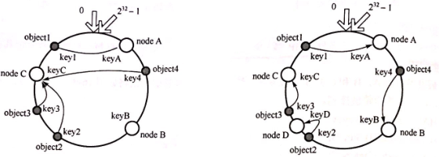
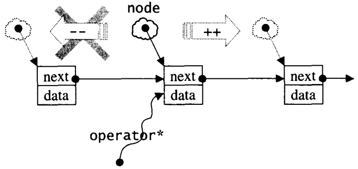
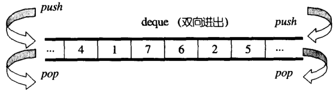

## 标准库


#### 146、C++中标准库是什么？

1)  C++ 标准库可以分为两部分：

标准函数库： 这个库是由通用的、独立的、不属于任何类的函数组成的。函数库继承自 C 语言。

面向对象类库： 这个库是类及其相关函数的集合。

2)   输入/输出 I/O、字符串和字符处理、数学、时间、日期和本地化、动态分配、其他、宽字符函数

3)   标准的 C++ I/O 类、String 类、数值类、STL 容器类、STL 算法、STL 函数对象、STL 迭代器、STL 分配器、本地化库、异常处理类、杂项支持库


#### （15） C++的STL介绍（这个系列也很重要，建议侯捷老师的这方面的书籍与视频），其中包括内存管理allocator，函数，实现机理，多线程实现等

C++ STL从广义来讲包括了三类：算法，容器和迭代器。

* 算法包括排序，复制等常用算法，以及不同容器特定的算法。
* 容器就是数据的存放形式，包括序列式容器和关联式容器，序列式容器就是list，vector等，关联式容器就是set，map等。
* 迭代器就是在不暴露容器内部结构的情况下对容器的遍历。


#### 203、常见容器性质总结？

1.vector    底层数据结构为数组 ，支持快速随机访问

2.list       底层数据结构为双向链表，支持快速增删

3.deque    底层数据结构为一个中央控制器和多个缓冲区，详细见STL源码剖析P146，支持首尾（中间不能）快速增删，也支持随机访问

​		deque是一个双端队列(double-ended queue)，也是在堆中保存内容的.它的保存形式如下:

​				[堆1] --> [堆2] -->[堆3] --> ...

​		每个堆保存好几个元素,然后堆和堆之间有指针指向,看起来像是list和vector的结合品.

4.stack    底层一般用list或deque实现，封闭头部即可，不用vector的原因应该是容量大小有限制，扩容耗时

5.queue   底层一般用list或deque实现，封闭头部即可，不用vector的原因应该是容量大小有限制，扩容耗时（stack和queue其实是适配器,而不叫容器，因为是对容器的再封装）

6.priority_queue   的底层数据结构一般为vector为底层容器，堆heap为处理规则来管理底层容器实现

7.set          底层数据结构为红黑树，有序，不重复

8.multiset      底层数据结构为红黑树，有序，可重复 

9.map         底层数据结构为红黑树，有序，不重复

10.multimap  底层数据结构为红黑树，有序，可重复

11.unordered_set   底层数据结构为hash表，无序，不重复

12.unordered_multiset 底层数据结构为hash表，无序，可重复 

13.unordered_map   底层数据结构为hash表，无序，不重复

14.unordered_multimap 底层数据结构为hash表，无序，可重复 


## 迭代器


#### [STL中，迭代器的分类](https://www.cnblogs.com/VIPler/p/4272514.html)

**五类迭代器如下：**

**1、输入迭代器：只读，一次传递**
  为输入迭代器预定义实现只有istream_iterator和istreambuf_iterator，用于从一个输入流istream中读取。一个输入迭代器仅能对它所选择的每个元素进行一次解析，它们只能向前移动。一个专门的构造函数定义了超越末尾的值。总是，输入迭代器可以对读操作的结果进行解析（对每个值仅解析一次），然后向前移动。

  **2、输出迭代器：只写，一次传递**
  这是对输入迭代器的补充，不过是写操作而不是读操作。为输出迭代器的预定义实现只有ostream_iterator和ostreambuf_iterator，用于向一个输出流ostream写数据，还有一个一般较少使用的raw_storage_iterator。他们只能对每个写出的值进行一次解析，并且只能向前移动。对于输出迭代器来说，没有使用超越末尾的值来结束的概念。总之，输出迭代器可以对写操作的值进行解析（对每一个值仅解析一次），然后向前移动。

  **3、前向迭代器：多次读/写**
  前向迭代器包含了输入和输出迭代器两者的功能，加上还可以多次解析一个迭代器指定的位置，因此可以对一个值进行多次读/写。顾名思义，前向迭代器只能向前移动。没有为前向迭代器预定义迭代器。

 **4、双向迭代器：operator--**
  双向迭代器具有前向迭代器的全部功能。另外它还可以利用自减操作符operator--向后一次移动一个位置。由list容器中返回的迭代器都是双向的。

  **5、随机访问迭代器：类似于一个指针**
  随机访问迭代器具有双向迭代器的所有功能，再加上一个指针所有的功能（一个指针就是一个随机访问迭代器），除了没有一种“空（null）”迭代器和空指针对应。基本上可以这样说，一个随机访问迭代器就像一个指针那样可以进行任何操作，包括使用操作符operator[]进行索引，加某个数值到一个指针就可以向前或者向后移动若干个位置，或者使用比较运算符在迭代器之间进行比较。


| 迭代器类别     | 说明                                                         |
| -------------- | ------------------------------------------------------------ |
| 输入迭代器     | 从容器中读取元素。输入迭代器只能一次读入一个元素向前移动，输入迭代器只支持一遍算法，同一个输入迭代器不能两遍遍历一个序列 |
| 输出迭代器     | 向容器中写入元素。输出迭代器只能一次一个元素向前移动。输出迭代器只支持一遍算法，统一输出迭代器不能两次遍历一个序列 |
| 正向迭代器     | 组合输入迭代器和输出迭代器的功能，并保留在容器中的位置       |
| 双向迭代器     | 组合正向迭代器和逆向迭代器的功能，支持多遍算法               |
| 随机访问迭代器 | 组合双向迭代器的功能与直接访问容器中任何元素的功能，即可向前向后跳过任意个元素 |

 

**迭代器的操作：**

每种迭代器均可进行包括表中前一种迭代器可进行的操作。迭代器的操作本质上是通过重载运算符来实现的，迭代器支持何种操作和能够执行什么运算是由迭代器所重载的运算符来决定的。

| 迭代器类型     | 操作类型                                                     | 说明                                                         |
| -------------- | ------------------------------------------------------------ | ------------------------------------------------------------ |
| 所有迭代器     | p++<br />++p                                                 | 后置自增迭代器前置自增迭代器s's                              |
| 输入迭代器     | *pp=p1<br />p==p1<br />p!=p1                                 | 复引用迭代器，作为右值将一个迭代器赋给另一个迭代器比较迭代器的相等性比较迭代器的不等性 |
| 输出迭代器     | *pp=p1                                                       | 复引用迭代器，作为左值将一个迭代器赋给另一个迭代器           |
| 正向迭代器     | 提供输入输出迭代器的所有功能                                 |                                                              |
| 双向迭代器     | --p<br />p--                                                 | 前置自减迭代器后置自减迭代器                                 |
| 随机访问迭代器 | p+=i<br />p-=i<br />p+i<br />p-i<br />p[i]<br />p<p1<br />p<=p1<br />p>p1<br />p>=p1 | 将迭代器递增i位将迭代器递减i位在p位加i位后的迭代器在p位减i位后的迭代器返回p位元素偏离i位的元素引用如果迭代器p的位置在p1前，返回true，否则返回falsep的位置在p1的前面或同一位置时返回true，否则返回false如果迭代器p的位置在p1后，返回true，否则返回falsep的位置在p1的后面或同一位置时返回true，否则返回false |

 

**只有顺序容器和关联容器支持迭代器遍历，各容器支持的迭代器的类别如下：**

| 容器           | 支持的迭代器类别 |
| -------------- | ---------------- |
| vector         | 随机访问         |
| deque          | 随机访问         |
| list           | 双向             |
| set            | 双向             |
| multiset       | 双向             |
| map            | 双向             |
| multimap       | 双向             |
| stack          | 不支持           |
| queue          | 不支持           |
| priority_queue | 不支持           |

分类: [STL](https://www.cnblogs.com/VIPler/category/657545.html)


#### 137、迭代器：++it、it++哪个好，为什么

1)  前置返回一个引用，后置返回一个对象

2)  前置不会产生临时对象，后置必须产生临时对象，临时对象会导致效率降低

~~~cpp
// ++i实现代码为：
int& operator++(){  
    *this += 1;
    return *this;
} 

//i++实现代码为：
int operator++(int){
    int temp = *this;                     
    ++*this;                          
    return temp;                 
} 
~~~


 

#### 19、迭代器失效的情况

以vector为例：

**插入元素：**

1、尾后插入：size < capacity时，首迭代器不失效尾迭代失效（未重新分配空间），size == capacity时，所有迭代器均失效（需要重新分配空间）。

2、中间插入：中间插入：size < capacity时，首迭代器不失效但插入元素之后所有迭代器失效，size == capacity时，所有迭代器均失效。

**删除元素：**

尾后删除：只有尾迭代失效。

中间删除：删除位置之后所有迭代失效。

 deque 和 vector 的情况类似, 

而list双向链表每一个节点内存不连续, 删除节点仅当前迭代器失效,erase返回下一个有效迭代器; 

map/set等关联容器底层是红黑树删除节点不会影响其他节点的迭代器, 使用递增方法获取下一个迭代器 mmp.erase(iter++); 

unordered_(hash) 迭代器意义不大, rehash之后, 迭代器应该也是全部失效. 


#### 192、容器内部删除一个元素

1)  顺序容器

erase迭代器不仅使所指向被删除的迭代器失效，而且使被删元素之后的所有迭代器失效(list除外)，所以不能使用erase(it++)的方式，但是erase的返回值是下一个有效迭代器；

It = c.erase(it);

2)  关联容器

erase迭代器只是被删除元素的迭代器失效，但是返回值是void，所以要采用erase(it++)的方式删除迭代器；

c.erase(it++)


#### 193、STL迭代器如何实现

1、 迭代器是一种抽象的设计理念，通过迭代器可以在不了解容器内部原理的情况下遍历容器，除此之外，STL中迭代器一个最重要的作用就是作为容器与STL算法的粘合剂。

2、 迭代器的作用就是提供一个遍历容器内部所有元素的接口，因此迭代器内部必须保存一个与容器相关联的指针，然后重载各种运算操作来遍历，其中最重要的是*运算符与->运算符，以及++、--等可能需要重载的运算符重载。这和C++中的智能指针很像，智能指针也是将一个指针封装，然后通过引用计数或是其他方法完成自动释放内存的功能。

3、最常用的迭代器的相应型别有五种：value type、difference type、pointer、reference、iterator catagoly;


## 智能指针


#### （39） C++的智能指针有哪些

C++中的智能指针有auto_ptr,shared_ptr,weak_ptr和unique_ptr。智能指针其实是将指针进行了封装，可以像普通指针一样进行使用，同时可以自行进行释放，避免忘记释放指针指向的内存地址造成内存泄漏。

* auto_ptr是较早版本的智能指针，在进行指针拷贝和赋值的时候，新指针直接接管旧指针的资源并且将旧指针指向空，但是这种方式在需要访问旧指针的时候，就会出现问题。
* unique_ptr是auto_ptr的一个改良版，不能赋值也不能拷贝，保证一个对象同一时间只有一个智能指针。
* shared_ptr可以使得一个对象可以有多个智能指针，当这个对象所有的智能指针被销毁时就会自动进行回收。（内部使用计数机制进行维护）
* weak_ptr是为了协助shared_ptr而出现的。它不能访问对象，只能观测shared_ptr的引用计数，防止出现死锁。


#### 84、智能指针的原理、常用的智能指针及实现

**原理**

智能指针是一个类，用来存储指向动态分配对象的指针，负责自动释放动态分配的对象，防止堆内存泄漏。动态分配的资源，交给一个类对象去管理，当类对象声明周期结束时，自动调用析构函数释放资源

**常用的智能指针**

**(1) shared_ptr** 

实现原理：采用引用计数器的方法，允许多个智能指针指向同一个对象，每当多一个指针指向该对象时，指向该对象的所有智能指针内部的引用计数加1，每当减少一个智能指针指向对象时，引用计数会减1，当计数为0的时候会自动的释放动态分配的资源。 

- 智能指针将一个计数器与类指向的对象相关联，引用计数器跟踪共有多少个类对象共享同一指针
- 每次创建类的新对象时，初始化指针并将引用计数置为1
- 当对象作为另一对象的副本而创建时，拷贝构造函数拷贝指针并增加与之相应的引用计数
- 对一个对象进行赋值时，赋值操作符减少左操作数所指对象的引用计数（如果引用计数为减至0，则删除对象），并增加右操作数所指对象的引用计数
- 调用析构函数时，构造函数减少引用计数（如果引用计数减至0，则删除基础对象）

**(2) unique_ptr** 

unique_ptr采用的是独享所有权语义，一个非空的unique_ptr总是拥有它所指向的资源。转移一个unique_ptr将会把所有权全部从源指针转移给目标指针，源指针被置空；所以unique_ptr不支持普通的拷贝和赋值操作，不能用在STL标准容器中；局部变量的返回值除外（因为编译器知道要返回的对象将要被销毁）；如果你拷贝一个unique_ptr，那么拷贝结束后，这两个unique_ptr都会指向相同的资源，造成在结束时对同一内存指针多次释放而导致程序崩溃。

**(3) weak_ptr** 

weak_ptr：弱引用。 引用计数有一个问题就是互相引用形成环（环形引用），这样两个指针指向的内存都无法释放。需要使用weak_ptr打破环形引用。weak_ptr是一个弱引用，它是为了配合shared_ptr而引入的一种智能指针，它指向一个由shared_ptr管理的对象而不影响所指对象的生命周期，也就是说，它只引用，不计数。如果一块内存被shared_ptr和weak_ptr同时引用，当所有shared_ptr析构了之后，不管还有没有weak_ptr引用该内存，内存也会被释放。所以weak_ptr不保证它指向的内存一定是有效的，在使用之前使用函数lock()检查weak_ptr是否为空指针。

**(4) auto_ptr** 

 主要是为了解决“有异常抛出时发生内存泄漏”的问题 。因为发生异常而无法正常释放内存。

auto_ptr有拷贝语义，拷贝后源对象变得无效，这可能引发很严重的问题；而unique_ptr则无拷贝语义，但提供了移动语义，这样的错误不再可能发生，因为很明显必须使用std::move()进行转移。

auto_ptr不支持拷贝和赋值操作，不能用在STL标准容器中。STL容器中的元素经常要支持拷贝、赋值操作，在这过程中auto_ptr会传递所有权，所以不能在STL中使用。


**智能指针shared_ptr代码实现：**

```C++
template<typename T>
class SharedPtr{
    public:	
    SharedPtr(T* ptr = NULL):_ptr(ptr), _pcount(new int(1))	{}
    SharedPtr(const SharedPtr& s):_ptr(s._ptr), _pcount(s._pcount){
        *(_pcount)++;	
    }	
    SharedPtr<T>& operator=(const SharedPtr& s){		
        if (this != &s)		
        {			
            if (--(*(this->_pcount)) == 0)			
            {				
                delete this->_ptr;				
                delete this->_pcount;			
            }			
            _ptr = s._ptr;			
            _pcount = s._pcount;			
            *(_pcount)++;		
        }		
        return *this;	
    }	
    T& operator*()	
    {		
        return *(this->_ptr);
    }	
    T* operator->()	{	
        return this->_ptr;	
    }	
    ~SharedPtr()	
    {		
        --(*(this->_pcount));	
        if (this->_pcount == 0)	
        {		
            delete _ptr;		
            _ptr = NULL;		
            delete _pcount;		
            _pcount = NULL;		
        }	
    }
    
    private:	
    T* _ptr;	
    int* _pcount;//指向引用计数的指针};
}
```

> 《智能指针的原理及实现》：https://blog.csdn.net/lizhentao0707/article/details/81156384


#### 94、智能指针的作用；

1)  C++11中引入了智能指针的概念，方便管理堆内存。使用普通指针，容易造成堆内存泄露（忘记释放），二次释放，程序发生异常时内存泄露等问题等，使用智能指针能更好的管理堆内存。

2)  智能指针在C++11版本之后提供，包含在头文件<memory>中，shared_ptr、unique_ptr、weak_ptr。shared_ptr多个指针指向相同的对象。shared_ptr使用引用计数，每一个shared_ptr的拷贝都指向相同的内存。每使用他一次，内部的引用计数加1，每析构一次，内部的引用计数减1，减为0时，自动删除所指向的堆内存。shared_ptr内部的引用计数是线程安全的，但是对象的读取需要加锁。

3)  初始化。智能指针是个模板类，可以指定类型，传入指针通过构造函数初始化。也可以使用make_shared函数初始化。不能将指针直接赋值给一个智能指针，一个是类，一个是指针。例如std::shared_ptr<int> p4 = new int(1);的写法是错误的

拷贝和赋值。拷贝使得对象的引用计数增加1，赋值使得原对象引用计数减1，当计数为0时，自动释放内存。后来指向的对象引用计数加1，指向后来的对象

4)  unique_ptr“唯一”拥有其所指对象，同一时刻只能有一个unique_ptr指向给定对象（通过禁止拷贝语义、只有移动语义来实现）。相比与原始指针unique_ptr用于其RAII的特性，使得在出现异常的情况下，动态资源能得到释放。unique_ptr指针本身的生命周期：从unique_ptr指针创建时开始，直到离开作用域。离开作用域时，若其指向对象，则将其所指对象销毁(默认使用delete操作符，用户可指定其他操作)。unique_ptr指针与其所指对象的关系：在智能指针生命周期内，可以改变智能指针所指对象，如创建智能指针时通过构造函数指定、通过reset方法重新指定、通过release方法释放所有权、通过移动语义转移所有权。

5)  智能指针类将一个计数器与类指向的对象相关联，引用计数跟踪该类有多少个对象共享同一指针。每次创建类的新对象时，初始化指针并将引用计数置为1；当对象作为另一对象的副本而创建时，拷贝构造函数拷贝指针并增加与之相应的引用计数；对一个对象进行赋值时，赋值操作符减少左操作数所指对象的引用计数（如果引用计数为减至0，则删除对象），并增加右操作数所指对象的引用计数；调用析构函数时，构造函数减少引用计数（如果引用计数减至0，则删除基础对象）。

6)  weak_ptr 是一种不控制对象生命周期的智能指针, 它指向一个 shared_ptr 管理的对象. 进行该对象的内存管理的是那个强引用的 shared_ptr. weak_ptr只是提供了对管理对象的一个访问手段。weak_ptr 设计的目的是为配合 shared_ptr 而引入的一种智能指针来协助 shared_ptr 工作, 它只可以从一个 shared_ptr 或另一个 weak_ptr 对象构造, 它的构造和析构不会引起引用记数的增加或减少. 


#### 95、说说你了解的auto_ptr作用

1)  auto_ptr的出现，主要是为了解决“有异常抛出时发生内存泄漏”的问题；抛出异常，将导致指针p所指向的空间得不到释放而导致内存泄漏；

2)  auto_ptr构造时取得某个对象的控制权，在析构时释放该对象。我们实际上是创建一个auto_ptr<Type>类型的局部对象，该局部对象析构时，会将自身所拥有的指针空间释放，所以不会有内存泄漏；

3)  auto_ptr的构造函数是explicit，阻止了一般指针隐式转换为 auto_ptr的构造，所以不能直接将一般类型的指针赋值给auto_ptr类型的对象，必须用auto_ptr的构造函数创建对象；

4)  由于auto_ptr对象析构时会删除它所拥有的指针，所以使用时避免多个auto_ptr对象管理同一个指针；

5)  Auto_ptr内部实现，析构函数中删除对象用的是delete而不是delete[]，所以auto_ptr不能管理数组；

6)  auto_ptr支持所拥有的指针类型之间的隐式类型转换。

7)  可以通过*和->运算符对auto_ptr所有用的指针进行提领操作；

8)  T* get(),获得auto_ptr所拥有的指针；T* release()，释放auto_ptr的所有权，并将所有用的指针返回。


#### 173、智能指针出现循环引用怎么解决？

弱指针用于专门解决shared_ptr循环引用的问题，weak_ptr不会修改引用计数，即其存在与否并不影响对象的引用计数器。循环引用就是：两个对象互相使用一个shared_ptr成员变量指向对方。弱引用并不对对象的内存进行管理，在功能上类似于普通指针，然而一个比较大的区别是，弱引用能检测到所管理的对象是否已经被释放，从而避免访问非法内存。

#### 96、智能指针的循环引用

循环引用是指使用多个智能指针share_ptr时，出现了指针之间相互指向，从而形成环的情况，有点类似于死锁的情况，这种情况下，智能指针往往不能正常调用对象的析构函数，从而造成内存泄漏。举个例子：

```C++
#include <iostream>
using namespace std;

template <typename T>class Node{
    public:	
    Node(const T& value):_pPre(NULL), _pNext(NULL), _value(value){
        cout << "Node()" << endl;
    }	
                                                           
	~Node()	{		
        cout << "~Node()" << endl;
        cout << "this:" << this << endl;
    }	
                                                           
	shared_ptr<Node<T>> _pPre;
	shared_ptr<Node<T>> _pNext;	                                              
	T _value;
};

                                                           
void Funtest(){	
    shared_ptr<Node<int>> sp1(new Node<int>(1));	
    shared_ptr<Node<int>> sp2(new Node<int>(2));	
    cout << "sp1.use_count:" << sp1.use_count() << endl;
    cout << "sp2.use_count:" << sp2.use_count() << endl;	
    sp1->_pNext = sp2; //sp1的引用+1	
    sp2->_pPre = sp1; //sp2的引用+1	
    cout << "sp1.use_count:" << sp1.use_count() << endl;	
    cout << "sp2.use_count:" << sp2.use_count() << endl;
}

int main(){
    Funtest();	
    system("pause");
    return 0;
}
                                                           
//输出结果
//Node()
//Node()
//sp1.use_count:1
//sp2.use_count:1
//sp1.use_count:2
//sp2.use_count:2
```

从上面shared_ptr的实现中我们知道了只有当引用计数减减之后等于0，析构时才会释放对象，而上述情况造成了一个僵局，那就是析构对象时先析构sp2,可是由于sp2的空间sp1还在使用中，所以sp2.use_count减减之后为1，不释放，sp1也是相同的道理，由于sp1的空间sp2还在使用中，所以sp1.use_count减减之后为1，也不释放。sp1等着sp2先释放，sp2等着sp1先释放,二者互不相让，导致最终都没能释放，内存泄漏。

在实际编程过程中，应该尽量避免出现智能指针之前相互指向的情况，如果不可避免，可以使用使用弱指针——weak_ptr，它不增加引用计数，只要出了作用域就会自动析构。

> 《C++ 智能指针（及循环引用问题）》：https://blog.csdn.net/m0_37968340/article/details/76737395


#### 115、使用智能指针管理内存资源，RAII是怎么回事？

1)  RAII全称是“Resource Acquisition is Initialization”，直译过来是“资源获取即初始化”，也就是说在构造函数中申请分配资源，在析构函数中释放资源。

因为C++的语言机制保证了，当一个对象创建的时候，自动调用构造函数，当对象超出作用域的时候会自动调用析构函数。所以，在RAII的指导下，我们应该使用类来管理资源，将资源和对象的生命周期绑定。

2)  智能指针（std::shared_ptr和std::unique_ptr）即RAII最具代表的实现，使用智能指针，可以实现自动的内存管理，再也不需要担心忘记delete造成的内存泄漏。

毫不夸张的来讲，有了智能指针，代码中几乎不需要再出现delete了。


#### 116、手写实现智能指针类

1)  智能指针是一个数据类型，一般用模板实现，模拟指针行为的同时还提供自动垃圾回收机制。它会自动记录SmartPointer<T*>对象的引用计数，一旦T类型对象的引用计数为0，就释放该对象。

除了指针对象外，我们还需要一个引用计数的指针设定对象的值，并将引用计数计为1，需要一个构造函数。新增对象还需要一个构造函数，析构函数负责引用计数减少和释放内存。

通过覆写赋值运算符，才能将一个旧的智能指针赋值给另一个指针，同时旧的引用计数减1，新的引用计数加1

2)  一个构造函数、拷贝构造函数、复制构造函数、析构函数、移走函数；


## vector


#### 206、STL中vector的实现

vector是一种序列式容器，其数据安排以及操作方式与array非常类似，两者的唯一差别就是对于空间运用的灵活性，众所周知，array占用的是静态空间，一旦配置了就不可以改变大小，如果遇到空间不足的情况还要自行创建更大的空间，并手动将数据拷贝到新的空间中，再把原来的空间释放。vector则使用灵活的动态空间配置，维护一块**连续的线性空间**，在空间不足时，可以自动扩展空间容纳新元素，做到按需供给。其在扩充空间的过程中仍然需要经历：**重新配置空间，移动数据，释放原空间**等操作。这里需要说明一下动态扩容的规则：以原大小的两倍配置另外一块较大的空间（或者旧长度+新增元素的个数），源码：

```C++
const size_type len  = old_size + max(old_size, n);
```

 Vector扩容倍数与平台有关，在Win +  VS 下是 1.5倍，在 Linux + GCC 下是 2 倍 

测试代码：

```C++
#include <iostream>
#include <vector>
using namespace std;

int main(){    //在Linux + GCC下	
    vector<int> res(2,0);	
    cout << res.capacity() <<endl; //2	
    res.push_back(1);	
    cout << res.capacity() <<endl;//4	
    res.push_back(2);	
    res.push_back(3);    
    cout << res.capacity() <<endl;//8	
    return 0;            //在 win 10 + VS2019下    
    vector<int> res(2,0);	
    cout << res.capacity() <<endl; //2	
    res.push_back(1);	
    cout << res.capacity() <<endl;//3	
    res.push_back(2);	
    res.push_back(3);    
    cout << res.capacity() <<endl;//6      
}
```

运行上述代码，一开始配置了一块长度为2的空间，接下来插入一个数据，长度变为原来的两倍，为4，此时已占用的长度为3，再继续两个数据，此时长度变为8，可以清晰的看到空间的变化过程

需要注意的是，频繁对vector调用push_back()对性能是有影响的，这是因为每插入一个元素，如果空间够用的话还能直接插入，若空间不够用，则需要重新配置空间，移动数据，释放原空间等操作，对程序性能会造成一定的影响

> 《STL源码剖析》 侯捷 P115-128


#### （19） STL中vector的实现

STL中的vector是封装了动态数组的顺序容器。不过与动态数组不同的是，vector可以根据需要自动扩大容器的大小。具体策略是每次容量不够用时重新申请一块大小为原来容量两倍的内存，将原容器的元素拷贝至新容器，并释放原空间，返回新空间的指针。

在原来空间不够存储新值时，每次调用push_back方法都会重新分配新的空间以满足新数据的添加操作。如果在程序中频繁进行这种操作，还是比较消耗性能的。

#### （20） vector使用的注意点及其原因，频繁对vector调用push_back\(\)对性能的影响和原因。

如果需要频繁插入，最好先指定vector的大小，因为vector在容器大小不够用的时候会重新申请一块大小为原容器两倍的空间，并将原容器的元素拷贝到新容器中，并释放原空间，这个过程是十分耗时和耗内存的。频繁调用push_back()会使得程序花费很多时间在vector扩容上，会变得很慢。这种情况可以考虑使用list。

#### （21）C++中vector和list的区别

vector和数组类似，拥有一段连续的内存空间。vector申请的是一段连续的内存，当插入新的元素内存不够时，通常以2倍重新申请更大的一块内存，将原来的元素拷贝过去，释放旧空间。因为内存空间是连续的，所以在进行插入和删除操作时，会造成内存块的拷贝，时间复杂度为o(n)。

list是由双向链表实现的，因此内存空间是不连续的。只能通过指针访问数据，所以list的随机存取非常没有效率，时间复杂度为o(n); 但由于链表的特点，能高效地进行插入和删除。

vector拥有一段连续的内存空间，能很好的支持随机存取，因此vector::iterator支持“+”，“+=”，“<”等操作符。

list的内存空间可以是不连续，它不支持随机访问，因此list::iterator则不支持“+”、“+=”、“<”等

vector::iterator和list::iterator都重载了“\+\+”运算符。

总之，如果需要高效的随机存取，而不在乎插入和删除的效率，使用vector;

如果需要大量的插入和删除，而不关心随机存取，则应使用list。


#### 204、vector的增加删除都是怎么做的？为什么是1.5或者是2倍？

1)  新增元素：vector通过一个连续的数组存放元素，如果集合已满，在新增数据的时候，就要分配一块更大的内存，将原来的数据复制过来，释放之前的内存，在插入新增的元素；

2)  对vector的任何操作，一旦引起空间重新配置，指向原vector的所有迭代器就都失效了 ；

3)  初始时刻vector的capacity为0，塞入第一个元素后capacity增加为1；

4)  不同的编译器实现的扩容方式不一样，VS2015中以1.5倍扩容，GCC以2倍扩容。

 

对比可以发现采用采用成倍方式扩容，可以保证常数的时间复杂度，而增加指定大小的容量只能达到O(n)的时间复杂度，因此，使用成倍的方式扩容。

1)  考虑可能产生的堆空间浪费，成倍增长倍数不能太大，使用较为广泛的扩容方式有两种，以2二倍的方式扩容，或者以1.5倍的方式扩容。

2)  以2倍的方式扩容，导致下一次申请的内存必然大于之前分配内存的总和，导致之前分配的内存不能再被使用，所以最好倍增长因子设置为(1,2)之间： 

3)  向量容器vector的成员函数pop_back()可以删除最后一个元素.

4)  而函数erase()可以删除由一个iterator指出的元素，也可以删除一个指定范围的元素。

5)  还可以采用通用算法remove()来删除vector容器中的元素.

6)  不同的是：采用remove一般情况下不会改变容器的大小，而pop_back()与erase()等成员函数会改变容器的大小。


#### 191、STL 中vector删除其中的元素，迭代器如何变化？为什么是两倍扩容？释放空间？

size()函数返回的是已用空间大小，capacity()返回的是总空间大小，capacity()-size()则是剩余的可用空间大小。当size()和capacity()相等，说明vector目前的空间已被用完，如果再添加新元素，则会引起vector空间的动态增长。

由于动态增长会引起重新分配内存空间、拷贝原空间、释放原空间，这些过程会降低程序效率。因此，可以使用reserve(n)预先分配一块较大的指定大小的内存空间，这样当指定大小的内存空间未使用完时，是不会重新分配内存空间的，这样便提升了效率。只有当n>capacity()时，调用reserve(n)才会改变vector容量。

 resize()成员函数只改变元素的数目，不改变vector的容量。

1、空的vector对象，size()和capacity()都为0

2、当空间大小不足时，新分配的空间大小为原空间大小的2倍。

3、使用reserve()预先分配一块内存后，在空间未满的情况下，不会引起重新分配，从而提升了效率。

4、当reserve()分配的空间比原空间小时，是不会引起重新分配的。

5、resize()函数只改变容器的元素数目，未改变容器大小。

6、用reserve(size_type)只是扩大capacity值，这些内存空间可能还是“野”的，如果此时使用“[ ]”来访问，则可能会越界。而resize(size_type new_size)会真正使容器具有new_size个对象。

 

 不同的编译器，vector有不同的扩容大小。在vs下是1.5倍，在GCC下是2倍；

空间和时间的权衡。简单来说， 空间分配的多，平摊时间复杂度低，但浪费空间也多。

使用k=2增长因子的问题在于，每次扩展的新尺寸必然刚好大于之前分配的总和，也就是说，之前分配的内存空间不可能被使用。这样对内存不友好。最好把增长因子设为(1,2)

 对比可以发现采用采用成倍方式扩容，可以保证常数的时间复杂度，而增加指定大小的容量只能达到O(n)的时间复杂度，因此，使用成倍的方式扩容。

 

**如何释放空间**

由于vector的内存占用空间只增不减，比如你首先分配了10,000个字节，然后erase掉后面9,999个，留下一个有效元素，但是内存占用仍为10,000个。所有内存空间是在vector析构时候才能被系统回收。empty()用来检测容器是否为空的，clear()可以清空所有元素。但是即使clear()，vector所占用的内存空间依然如故，无法保证内存的回收。

如果需要空间动态缩小，可以考虑使用deque。如果vector，可以用swap()来帮助你释放内存。

~~~cpp
vector(Vec).swap(Vec); //将Vec的内存空洞清除； 
vector().swap(Vec);// 清空Vec的内存；
~~~


#### （58）vector会迭代器失效吗？什么情况下会迭代器失效？

https://www.cnblogs.com/qingjiaowoxiaoxioashou/p/5874572.html

* 会
* 当vector在插入的时候，如果原来的空间不够，会将申请新的内存并将原来的元素移动到新的内存，此时指向原内存地址的迭代器就失效了，first和end迭代器都失效
* 当vector在插入的时候，end迭代器肯定会失效
* 当vector在删除的时候，被删除元素以及它后面的所有元素迭代器都失效。


#### 190、 vector与list的区别与应用？怎么找某vector或者list的倒数第二个元素

1)  vector数据结构
 vector和数组类似，拥有一段连续的内存空间，并且起始地址不变。因此能高效的进行随机存取，时间复杂度为o(1);但因为内存空间是连续的，所以在进行插入和删除操作时，会造成内存块的拷贝，时间复杂度为o(n)。另外，当数组中内存空间不够时，会重新申请一块内存空间并进行内存拷贝。连续存储结构：vector是可以实现动态增长的对象数组，支持对数组高效率的访问和在数组尾端的删除和插入操作，在中间和头部删除和插入相对不易，需要挪动大量的数据。它与数组最大的区别就是vector不需程序员自己去考虑容量问题，库里面本身已经实现了容量的动态增长，而数组需要程序员手动写入扩容函数进形扩容。

2)  list数据结构
 list是由双向链表实现的，因此内存空间是不连续的。只能通过指针访问数据，所以list的随机存取非常没有效率，时间复杂度为o(n);但由于链表的特点，能高效地进行插入和删除。非连续存储结构：list是一个双链表结构，支持对链表的双向遍历。每个节点包括三个信息：元素本身，指向前一个元素的节点（prev）和指向下一个元素的节点（next）。因此list可以高效率的对数据元素任意位置进行访问和插入删除等操作。由于涉及对额外指针的维护，所以开销比较大。

区别：

vector的随机访问效率高，但在插入和删除时（不包括尾部）需要挪动数据，不易操作。list的访问要遍历整个链表，它的随机访问效率低。但对数据的插入和删除操作等都比较方便，改变指针的指向即可。list是单向的，vector是双向的。vector中的迭代器在使用后就失效了，而list的迭代器在使用之后还可以继续使用。 

3) vector倒数第二个数

```
int mySize = vec.size();

vec.at(mySize -2);
```

list不提供随机访问，所以不能用下标直接访问到某个位置的元素，要访问list里的元素只能遍历，不过你要是只需要访问list的最后N个元素的话，可以用反向迭代器来遍历：

```
int mySize = list.rbegin();

vec.at(mySize + 2);
```


#### 198、vector越界访问下标，map越界访问下标？vector删除元素时会不会释放空间？

1)  通过下标访问vector中的元素时不会做边界检查，即便下标越界。

也就是说，下标与first迭代器相加的结果超过了finish迭代器的位置，程序也不会报错，而是返回这个地址中存储的值。

如果想在访问vector中的元素时首先进行边界检查，可以使用vector中的at函数。通过使用at函数不但可以通过下标访问vector中的元素，而且在at函数内部会对下标进行边界检查。

2)  map的下标运算符[]的作用是：将key作为下标去执行查找，并返回相应的值；如果不存在这个key，就将一个具有该key和value的某人值插入这个map。

3)  erase()函数，只能删除内容，不能改变容量大小; 

erase成员函数，它删除了itVect迭代器指向的元素，并且返回要被删除的itVect之后的迭代器，迭代器相当于一个智能指针;clear()函数，只能清空内容，不能改变容量大小;如果要想在删除内容的同时释放内存，那么你可以选择deque容器。


## string


#### （48）string的底层实现

string继承自basic_string,其实是对char\*进行了封装，封装的string包含了char\*数组，容量，长度等等属性。

string可以进行动态扩展，在每次扩展的时候另外申请一块原空间大小两倍的空间（2^n），然后将原字符串拷贝过去，并加上新增的内容。


#### 147、你知道const char* 与string之间的关系是什么吗？

1)  string 是c++标准库里面其中一个，封装了对字符串的操作，实际操作过程我们可以用const char*给string类初始化

2)  三者的转化关系如下所示： 

~~~cpp
//string转const char* 
	string s = “abc”; 
	const char* c_s = s.c_str();

//const char* 转string，直接赋值即可 
    const char* c_s = “abc”;  
	string s(c_s); 

//string 转char*  
    string s = “abc”; 
	char* c;  
	const int len = s.length();  
	c = new char[len+1];  
	strcpy(c,s.c_str()); 

// char* 转string  
    char* c = “abc”;  
	string s(c); 

//const char* 转char*  
    const char* cpc = “abc”;  
	char* pc = new char[strlen(cpc)+1];  
	strcpy(pc,cpc);

//char* 转const char*，直接赋值即可  
    char* pc = “abc”;  
	const char* cpc = pc;
~~~


## map/set


#### （50）set，map和vector的插入复杂度

set,map的插入复杂度就是红黑树的插入复杂度，是log(N)。

unordered_set,unordered_map的插入复杂度是常数，最坏是O(N).

vector的插入复杂度是O(N),最坏的情况下（从头插入）就要对所有其他元素进行移动，或者扩容重新拷贝

#### 215、set和map的区别，multimap和multiset的区别

set只提供一种数据类型的接口，但是会将这一个元素分配到key和value上，而且它的compare_function用的是 identity()函数，这个函数是输入什么输出什么，这样就实现了set机制，set的key和value其实是一样的了。其实他保存的是两份元素，而不是只保存一份元素

map则提供两种数据类型的接口，分别放在key和value的位置上，他的比较function采用的是红黑树的comparefunction（），保存的确实是两份元素。

他们两个的insert都是采用红黑树的insert_unique() 独一无二的插入 。

multimap和map的唯一区别就是：multimap调用的是红黑树的insert_equal(),可以重复插入而map调用的则是独一无二的插入insert_unique()，multiset和set也一样，底层实现都是一样的，只是在插入的时候调用的方法不一样。


**红黑树概念**

面试时候现场写红黑树代码的概率几乎为0，但是红黑树一些基本概念还是需要掌握的。

1、它是二叉排序树（继承二叉排序树特显）：

- 若左子树不空，则左子树上所有结点的值均小于或等于它的根结点的值。 

- 若右子树不空，则右子树上所有结点的值均大于或等于它的根结点的值。 


- 左、右子树也分别为二叉排序树。 

2、它满足如下几点要求： 

- 树中所有节点非红即黑。 

- 根节点必为黑节点。 


-  红节点的子节点必为黑（黑节点子节点可为黑）。 


- 从根到NULL的任何路径上黑结点数相同。 

3、查找时间一定可以控制在O(logn)。 


#### 214、STL中map的实现

map的特性是所有元素会根据键值进行自动排序。map中所有的元素都是pair，拥有键值(key)和实值(value)两个部分，并且不允许元素有相同的key

一旦map的key确定了，那么是无法修改的，但是可以修改这个key对应的value，因此map的迭代器既不是constant iterator，也不是mutable iterator

标准STL map的底层机制是RB-tree（红黑树），另一种以hash table为底层机制实现的称为hash_map。map的架构如下图所示


map的在构造时缺省采用递增排序key，也使用alloc配置器配置空间大小，需要注意的是在插入元素时，调用的是红黑树中的insert_unique()方法，而非insert_euqal()（multimap使用）

举个例子：

```C++
#include <map>
#include <iostream>
#include <string>
using namespace std;

int main(){	
    map<string, int> maps; 
    
    //插入若干元素	
    maps["jack"] = 1;	
    maps["jane"] = 2;
    maps["july"] = 3;	
    
    //以pair形式插入	
    pair<string, int> p("david", 4);
    maps.insert(p);	
    
    //迭代输出元素	
    map<string, int>::iterator iter = maps.begin();
    for (; iter != maps.end(); ++iter)	{
        cout << iter->first << " ";	
        cout << iter->second << "--"; //david 4--jack 1--jane 2--july 3--	
    }	
    cout << endl;	
    
    //使用subscipt操作取实值	
    int num = maps["july"];	cout << num << endl; // 3	
    
    //查找某key	
    iter = maps.find("jane");	
    if(iter != maps.end())	
        cout << iter->second << endl; // 2   
    
    //修改实值
    iter->second = 100;	
    int num2 = maps["jane"]; // 100	
    cout << num2 << endl;	
    return 0;
}
```

需要注意的是subscript（下标）操作既可以作为左值运用（修改内容）也可以作为右值运用（获取实值）。例如：

```C++
maps["abc"] = 1; //左值运用
int num = masp["abd"]; //右值运用
```

无论如何，subscript操作符都会先根据键值找出实值，源码如下：

```C++
...T& operator[](const key_type& k){	return (*((insert(value_type(k, T()))).first)).second;}...
```

代码运行过程是：首先根据键值和实值做出一个元素，这个元素的实值未知，因此产生一个与实值型别相同的临时对象替代：

```C++
value_type(k, T());
```

再将这个对象插入到map中，并返回一个pair：

```C++
pair<iterator,bool> insert(value_type(k, T()));
```

pair第一个元素是迭代器，指向当前插入的新元素，如果插入成功返回true，此时对应左值运用，根据键值插入实值。插入失败（重复插入）返回false，此时返回的是已经存在的元素，则可以取到它的实值

```C++
(insert(value_type(k, T()))).first; //迭代器*((insert(value_type(k, T()))).first); //解引用(*((insert(value_type(k, T()))).first)).second; //取出实值
```

由于这个实值是以引用方式传递，因此作为左值或者右值都可以

> 《STL源码剖析》 侯捷 


#### 213、STL中set的实现？

STL中的容器可分为序列式容器（sequence）和关联式容器（associative），set属于关联式容器。

set的特性是，所有元素都会根据元素的值自动被排序（默认升序），set元素的键值就是实值，实值就是键值，set不允许有两个相同的键值

set不允许迭代器修改元素的值，其迭代器是一种constance iterators

标准的STL set以RB-tree（红黑树）作为底层机制，几乎所有的set操作行为都是转调用RB-tree的操作行为，这里补充一下红黑树的特性：

- 每个节点不是红色就是黑色
- 根结点为黑色
- 如果节点为红色，其子节点必为黑
- 任一节点至（NULL）树尾端的任何路径，所含的黑节点数量必相同

关于红黑树的具体操作过程，比较复杂读者可以翻阅《算法导论》详细了解。

举个例子：

```C++
#include <set>#include <iostream>using namespace std;int main(){	int i;	int ia[5] = { 1,2,3,4,5 };	set<int> s(ia, ia + 5);	cout << s.size() << endl; // 5	cout << s.count(3) << endl; // 1	cout << s.count(10) << endl; // 0	s.insert(3); //再插入一个3	cout << s.size() << endl; // 5	cout << s.count(3) << endl; // 1	s.erase(1);	cout << s.size() << endl; // 4	set<int>::iterator b = s.begin();	set<int>::iterator e = s.end();	for (; b != e; ++b)		cout << *b << " "; // 2 3 4 5	cout << endl;	b = find(s.begin(), s.end(), 5);	if (b != s.end())		cout << "5 found" << endl; // 5 found	b = s.find(2);	if (b != s.end())		cout << "2 found" << endl; // 2 found	b = s.find(1);	if (b == s.end())		cout << "1 not found" << endl; // 1 not found	return 0;}
```

关联式容器尽量使用其自身提供的find()函数查找指定的元素，效率更高，因为STL提供的find()函数是一种顺序搜索算法。

> 《STL源码剖析》 侯捷 
>
> 

#### 196、map插入方式有几种？

~~~cpp
//用insert函数插入pair数据，
    mapStudent.insert(pair<int, string>(1, "student_one"));

//用insert函数插入value_type数据
    mapStudent.insert(map<int, string>::value_type (1, "student_one"));

//在insert函数中使用make_pair()函数
    mapStudent.insert(make_pair(1, "student_one")); 

//用数组方式插入数据
    mapStudent[1] = "student_one"; 
~~~


#### 194、map、set是怎么实现的，红黑树是怎么能够同时实现这两种容器？ 为什么使用红黑树？

1)  他们的底层都是以红黑树的结构实现，因此插入删除等操作都在O(logn时间内完成，因此可以完成高效的插入删除；

2)  在这里我们定义了一个模版参数，如果它是key那么它就是set，如果它是map，那么它就是map；底层是红黑树，实现map的红黑树的节点数据类型是key+value，而实现set的节点数据类型是value

3)  因为map和set要求是自动排序的，红黑树能够实现这一功能，而且时间复杂度比较低。


#### 199、map中[]与find的区别？

1) map的下标运算符[]的作用是：将关键码作为下标去执行查找，并返回对应的值；如果不存在这个关键码，就将一个具有该关键码和值类型的默认值的项插入这个map。

2) map的find函数：用关键码执行查找，找到了返回该位置的迭代器；如果不存在这个关键码，就返回尾迭代器。


 


## unordered_map(hash_map)


#### （18） STL中unordered_map和map的区别

* unordered_map是使用哈希实现的，占用内存比较多，查询速度比较快，是常数时间复杂度。它内部是无序的，需要实现==操作符。
* map底层是采用红黑树实现的，插入删除查询时间复杂度都是O(log(n))，它的内部是有序的，因此需要实现比较操作符(<)。


#### 216、STL中unordered_map和map的区别和应用场景

map支持键值的自动排序，底层机制是红黑树，红黑树的查询和维护时间复杂度均为$O(logn)$，但是空间占用比较大，因为每个节点要保持父节点、孩子节点及颜色的信息

unordered_map是C++ 11新添加的容器，底层机制是哈希表，通过hash函数计算元素位置，其查询时间复杂度为O(1)，维护时间与bucket桶所维护的list长度有关，但是建立hash表耗时较大

从两者的底层机制和特点可以看出：map适用于有序数据的应用场景，unordered_map适用于高效查询的应用场景


#### 197、STL中unordered_map(hash_map)和map的区别，hash_map如何解决冲突以及扩容

1)  unordered_map和map类似，都是存储的key-value的值，可以通过key快速索引到value。不同的是unordered_map不会根据key的大小进行排序，

2)  存储时是根据key的hash值判断元素是否相同，即unordered_map内部元素是无序的，而map中的元素是按照二叉搜索树存储，进行中序遍历会得到有序遍历。

3)  所以使用时map的key需要定义operator<。而unordered_map需要定义hash_value函数并且重载operator==。但是很多系统内置的数据类型都自带这些，

4)  那么如果是自定义类型，那么就需要自己重载operator<或者hash_value()了。

5)  如果需要内部元素自动排序，使用map，不需要排序使用unordered_map

6)  unordered_map的底层实现是hash_table;

7)  hash_map底层使用的是hash_table，而hash_table使用的开链法进行冲突避免，所有hash_map采用开链法进行冲突解决。

8)  **什么时候扩容：**当向容器添加元素的时候，会判断当前容器的元素个数，如果大于等于阈值---即当前数组的长度乘以加载因子的值的时候，就要自动扩容啦。

9)  **扩容(resize)**就是重新计算容量，向HashMap对象里不停的添加元素，而HashMap对象内部的数组无法装载更多的元素时，对象就需要扩大数组的长度，以便能装入更多的元素。

#### 217、hashtable中解决冲突有哪些方法？

**记住前三个：**

线性探测

使用hash函数计算出的位置如果已经有元素占用了，则向后依次寻找，找到表尾则回到表头，直到找到一个空位

**开链**

每个表格维护一个list，如果hash函数计算出的格子相同，则按顺序存在这个list中

**再散列**

发生冲突时使用另一种hash函数再计算一个地址，直到不冲突

**二次探测**

使用hash函数计算出的位置如果已经有元素占用了，按照$1^2$、$2^2$、$3^2$...的步长依次寻找，如果步长是随机数序列，则称之为伪随机探测

**公共溢出区**

一旦hash函数计算的结果相同，就放入公共溢出区

#### （17）解决哈希冲突的方式？

1. 线性探查。该元素的哈希值对应的桶不能存放元素时，循序往后一一查找，直到找到一个空桶为止，在查找时也一样，当哈希值对应位置上的元素与所要寻找的元素不同时，就往后一一查找，直到找到吻合的元素，或者空桶。
2. 二次探查。该元素的哈希值对应的桶不能存放元素时，就往后寻找1^2,2^2,3^2,4^2.....i^2个位置。
3. 双散列函数法。当第一个散列函数发生冲突的时候，使用第二个散列函数进行哈希，作为步长。
4. 开链法。在每一个桶中维护一个链表，由元素哈希值寻找到这个桶，然后将元素插入到对应的链表中，STL的hashtable就是采用这种实现方式。
5. 建立公共溢出区。当发生冲突时，将所有冲突的数据放在公共溢出区。


#### 202、STL中hash_map扩容发生什么？ 

1)   hash table表格内的元素称为桶（bucket),而由桶所链接的元素称为节点（node),其中存入桶元素的容器为stl本身很重要的一种序列式容器——vector容器。之所以选择vector为存放桶元素的基础容器，主要是因为vector容器本身具有动态扩容能力，无需人工干预。

2)   向前操作：首先尝试从目前所指的节点出发，前进一个位置（节点），由于节点被安置于list内，所以利用节点的next指针即可轻易完成前进操作，如果目前正巧是list的尾端，就跳至下一个bucket身上，那正是指向下一个list的头部节点。


#### 178、什么是一致性哈希？

**一致性哈希**

一致性哈希是一种哈希算法，就是**在移除或者增加一个结点时，能够尽可能小的改变已存在key的映射关系**

尽可能少的改变已有的映射关系，一般是沿着顺时针进行操作，回答之前可以先想想，真实情况如何处理

一致性哈希将整个哈希值空间组**织成一个虚拟的圆环**，假设哈希函数的值空间为0~2^32-1，整个哈希空间环如下左图所示


一致性hash的基本思想就是使用相同的hash算法将数据和结点都映射到图中的环形哈希空间中，上右图显示了4个数据object1-object4在环上的分布图

**结点和数据映射**

假如有一批服务器，可以根据IP或者主机名作为关键字进行哈希，根据结果映射到哈希环中，3台服务器分别是nodeA-nodeC

现在有一批的数据object1-object4需要存在服务器上，则可以使用相同的哈希算法对数据进行哈希，其结果必然也在环上，可以沿着顺时针方向寻找，找到一个结点（服务器）则将数据存在这个结点上，这样数据和结点就产生了一对一的关联，如下图所示：


**移除结点**

如果一台服务器出现问题，如上图中的nodeB，则受影响的是其逆时针方向至下一个结点之间的数据，只需将这些数据映射到它顺时针方向的第一个结点上即可，下左图



**添加结点**

如果新增一台服务器nodeD，受影响的是其逆时针方向至下一个结点之间的数据，将这些数据映射到nodeD上即可，见上右图

**虚拟结点**

假设仅有2台服务器：nodeA和nodeC，nodeA映射了1条数据，nodeC映射了3条，这样数据分布是不平衡的。引入虚拟结点，假设结点复制个数为2，则nodeA变成：nodeA1和nodeA2，nodeC变成：nodeC1和nodeC2，映射情况变成如下：


这样数据分布就均衡多了，平衡性有了很大的提高

> 《程序员求职宝典》王道论坛


#### 187、STL中hashtable的实现？

STL中的hashtable使用的是**开链法**解决hash冲突问题，如下图所示。


hashtable中的bucket所维护的list既不是list也不是slist，而是其自己定义的由hashtable_node数据结构组成的linked-list，而bucket聚合体本身使用vector进行存储。hashtable的迭代器只提供前进操作，不提供后退操作

在hashtable设计bucket的数量上，其内置了28个质数[53, 97, 193,...,429496729]，在创建hashtable时，会根据存入的元素个数选择大于等于元素个数的质数作为hashtable的容量（vector的长度），其中每个bucket所维护的linked-list长度也等于hashtable的容量。如果插入hashtable的元素个数超过了bucket的容量，就要进行重建table操作，即找出下一个质数，创建新的buckets vector，重新计算元素在新hashtable的位置。

> 《STL源码解析》侯捷
>
> 

#### （16） STL源码中的hash表的实现

STL中的hash表就unordered_map。使用的是哈希进行实现（注意与map的区别）。它记录的键是元素的哈希值，通过对比元素的哈希值来确定元素的值。

unordered_map的底层实现是hashtable，采用开链法（也就是用桶）来解决哈希冲突，当桶的大小超过8时，就自动转为红黑树进行组织。


## list

#### 200、 STL中list与queue之间的区别

1) list不再能够像vector一样以普通指针作为迭代器，因为其节点不保证在存储空间中连续存在；

2) list插入操作和结合才做都不会造成原有的list迭代器失效;

3) list不仅是一个双向链表，而且还是一个环状双向链表，所以它只需要一个指针；

4) list不像vector那样有可能在空间不足时做重新配置、数据移动的操作，所以插入前的所有迭代器在插入操作之后都仍然有效；

5) deque是一种双向开口的连续线性空间，所谓双向开口，意思是可以在头尾两端分别做元素的插入和删除操作；可以在头尾两端分别做元素的插入和删除操作；

6) deque和vector最大的差异，一在于deque允许常数时间内对起头端进行元素的插入或移除操作，二在于deque没有所谓容量概念，因为它是动态地以分段连续空间组合而成，随时可以增加一段新的空间并链接起来，deque没有所谓的空间保留功能。


 


#### 205、说一下STL每种容器对应的迭代器

| 容器                                   | 迭代器         |
| -------------------------------------- | -------------- |
| vector、deque                          | 随机访问迭代器 |
| stack、queue、priority_queue           | 无             |
| list、(multi)set/map                   | 双向迭代器     |
| unordered_(multi)set/map、forward_list | 前向迭代器     |


> 


#### 207、STL中slist的实现

list是双向链表，而slist（single linked list）是单向链表，它们的主要区别在于：前者的迭代器是双向的Bidirectional iterator，后者的迭代器属于单向的Forward iterator。虽然slist的很多功能不如list灵活，但是其所耗用的空间更小，操作更快。

根据STL的习惯，插入操作会将新元素插入到指定位置之前，而非之后，然而slist是不能回头的，只能往后走，因此在slist的其他位置插入或者移除元素是十分不明智的，但是在slist开头却是可取的，slist特别提供了insert_after()和erase_after供灵活应用。考虑到效率问题，slist只提供push_front()操作，元素插入到slist后，存储的次序和输入的次序是相反的

slist的单向迭代器如下图所示：



slist默认采用alloc空间配置器配置节点的空间，其数据结构主要代码如下

```C++
template <class T, class Allco = alloc>class slist{	...private:    ...    static list_node* create_node(const value_type& x){}//配置空间、构造元素    static void destroy_node(list_node* node){}//析构函数、释放空间private:    list_node_base head; //头部public:    iterator begin(){}    iterator end(){}    size_type size(){}    bool empty(){}    void swap(slist& L){}//交换两个slist，只需要换head即可    reference front(){} //取头部元素    void push_front(const value& x){}//头部插入元素    void pop_front(){}//从头部取走元素    ...}
```

举个例子：

```C++
#include <forward_list>#include <algorithm>#include <iostream>using namespace std;int main(){	forward_list<int> fl;	fl.push_front(1);	fl.push_front(3);	fl.push_front(2);	fl.push_front(6);	fl.push_front(5);	forward_list<int>::iterator ite1 = fl.begin();	forward_list<int>::iterator ite2 = fl.end();	for(;ite1 != ite2; ++ite1)	{		cout << *ite1 <<" "; // 5 6 2 3 1	}	cout << endl;	ite1 = find(fl.begin(), fl.end(), 2); //寻找2的位置	if (ite1 != ite2)		fl.insert_after(ite1, 99);	for (auto it : fl)	{		cout << it << " ";  //5 6 2 99 3 1	}	cout << endl;	ite1 = find(fl.begin(), fl.end(), 6); //寻找6的位置	if (ite1 != ite2)		fl.erase_after(ite1);	for (auto it : fl)	{		cout << it << " ";  //5 6 99 3 1	}	cout << endl;		return 0;}
```

需要注意的是C++标准委员会没有采用slist的名称，forward_list在C++ 11中出现，它与slist的区别是没有size()方法。

> 《STL源码剖析》 侯捷


#### 208、STL中list的实现

相比于vector的连续线型空间，list显得复杂许多，但是它的好处在于插入或删除都只作用于一个元素空间，因此list对空间的运用是十分精准的，对任何位置元素的插入和删除都是常数时间。list不能保证节点在存储空间中连续存储，也拥有迭代器，迭代器的“++”、“--”操作对于的是指针的操作，list提供的迭代器类型是双向迭代器：Bidirectional iterators。

list节点的结构见如下源码：

```C++
template <class T>struct __list_node{    typedef void* void_pointer;    void_pointer prev;    void_pointer next;    T data;}
```

从源码可看出list显然是一个双向链表。list与vector的另一个区别是，在插入和接合操作之后，都不会造成原迭代器失效，而vector可能因为空间重新配置导致迭代器失效。

此外list也是一个环形链表，因此只要一个指针便能完整表现整个链表。list中node节点指针始终指向尾端的一个空白节点，因此是一种“前闭后开”的区间结构

list的空间管理默认采用alloc作为空间配置器，为了方便的以节点大小为配置单位，还定义一个list_node_allocator函数可一次性配置多个节点空间

由于list的双向特性，其支持在头部（front)和尾部（back)两个方向进行push和pop操作，当然还支持erase，splice，sort，merge，reverse，sort等操作，这里不再详细阐述。

> 《STL源码剖析》 侯捷 P128-142


#### 209、STL中的deque的实现

vector是单向开口（尾部）的连续线性空间，deque则是一种双向开口的连续线性空间，虽然vector也可以在头尾进行元素操作，但是其头部操作的效率十分低下（主要是涉及到整体的移动）



deque和vector的最大差异一个是deque运行在常数时间内对头端进行元素操作，二是deque没有容量的概念，它是动态地以分段连续空间组合而成，可以随时增加一段新的空间并链接起来

deque虽然也提供随机访问的迭代器，但是其迭代器并不是普通的指针，其复杂程度比vector高很多，因此除非必要，否则一般使用vector而非deque。如果需要对deque排序，可以先将deque中的元素复制到vector中，利用sort对vector排序，再将结果复制回deque

deque由一段一段的定量连续空间组成，一旦需要增加新的空间，只要配置一段定量连续空间拼接在头部或尾部即可，因此deque的最大任务是如何维护这个整体的连续性

deque的数据结构如下：

```C++
class deque{    ...protected:    typedef pointer* map_pointer;//指向map指针的指针    map_pointer map;//指向map    size_type map_size;//map的大小public:    ...    iterator begin();    itertator end();    ...}
```


deque内部有一个指针指向map，map是一小块连续空间，其中的每个元素称为一个节点，node，每个node都是一个指针，指向另一段较大的连续空间，称为缓冲区，这里就是deque中实际存放数据的区域，默认大小512bytes。整体结构如上图所示。

deque的迭代器数据结构如下：

```C++
struct __deque_iterator{    ...    T* cur;//迭代器所指缓冲区当前的元素    T* first;//迭代器所指缓冲区第一个元素    T* last;//迭代器所指缓冲区最后一个元素    map_pointer node;//指向map中的node    ...}
```

从deque的迭代器数据结构可以看出，为了保持与容器联结，迭代器主要包含上述4个元素


deque迭代器的“++”、“--”操作是远比vector迭代器繁琐，其主要工作在于缓冲区边界，如何从当前缓冲区跳到另一个缓冲区，当然deque内部在插入元素时，如果map中node数量全部使用完，且node指向的缓冲区也没有多余的空间，这时会配置新的map（2倍于当前+2的数量）来容纳更多的node，也就是可以指向更多的缓冲区。在deque删除元素时，也提供了元素的析构和空闲缓冲区空间的释放等机制。

> 《STL源码剖析》 侯捷 P143-164


#### 210、STL中stack和queue的实现

**stack**

stack（栈）是一种先进后出（First In Last Out）的数据结构，只有一个入口和出口，那就是栈顶，除了获取栈顶元素外，没有其他方法可以获取到内部的其他元素，其结构图如下：


stack这种单向开口的数据结构很容易由**双向开口的deque和list**形成，只需要根据stack的性质对应移除某些接口即可实现，stack的源码如下：

```C++
template <class T, class Sequence = deque<T> >class stack{	...protected:    Sequence c;public:    bool empty(){return c.empty();}    size_type size() const{return c.size();}    reference top() const {return c.back();}    const_reference top() const{return c.back();}    void push(const value_type& x){c.push_back(x);}    void pop(){c.pop_back();}};
```

从stack的数据结构可以看出，其所有操作都是围绕Sequence完成，而Sequence默认是deque数据结构。stack这种“修改某种接口，形成另一种风貌”的行为，成为adapter(配接器)。常将其归类为container adapter而非container

stack除了默认使用deque作为其底层容器之外，也可以使用双向开口的list，只需要在初始化stack时，将list作为第二个参数即可。由于stack只能操作顶端的元素，因此其内部元素无法被访问，也不提供迭代器。

**queue**

queue（队列）是一种先进先出（First In First Out）的数据结构，只有一个入口和一个出口，分别位于最底端和最顶端，出口元素外，没有其他方法可以获取到内部的其他元素，其结构图如下：


类似的，queue这种“先进先出”的数据结构很容易由双向开口的deque和list形成，只需要根据queue的性质对应移除某些接口即可实现，queue的源码如下：

```C++
template <class T, class Sequence = deque<T> >class queue{	...protected:    Sequence c;public:    bool empty(){return c.empty();}    size_type size() const{return c.size();}    reference front() const {return c.front();}    const_reference front() const{return c.front();}    void push(const value_type& x){c.push_back(x);}    void pop(){c.pop_front();}};
```

从queue的数据结构可以看出，其所有操作都也都是是围绕Sequence完成，Sequence默认也是deque数据结构。queue也是一类container adapter。

同样，queue也可以使用list作为底层容器，不具有遍历功能，没有迭代器。

> 《STL源码剖析》 侯捷 


## priority_queue

#### 211、STL中的heap的实现

heap（堆）并不是STL的容器组件，是priority queue（优先队列）的底层实现机制，因为binary max heap（大根堆）总是最大值位于堆的根部，优先级最高。

binary heap本质是一种complete binary tree（完全二叉树），整棵binary tree除了最底层的叶节点之外，都是填满的，但是叶节点从左到右不会出现空隙，如下图所示就是一颗完全二叉树


完全二叉树内没有任何节点漏洞，是非常紧凑的，这样的一个好处是可以使用array来存储所有的节点，因为当其中某个节点位于$i$处，其左节点必定位于$2i$处，右节点位于$2i+1$处，父节点位于$i/2$（向下取整）处。这种以array表示tree的方式称为隐式表述法。

因此我们可以使用一个array和一组heap算法来实现max heap（每个节点的值大于等于其子节点的值）和min heap（每个节点的值小于等于其子节点的值）。由于array不能动态的改变空间大小，用vector代替array是一个不错的选择。

那heap算法有哪些？常见有的插入、弹出、排序和构造算法，下面一一进行描述。

**push_heap插入算法**

由于完全二叉树的性质，新插入的元素一定是位于树的最底层作为叶子节点，并填补由左至右的第一个空格。事实上，在刚执行插入操作时，新元素位于底层vector的end()处，之后是一个称为percolate up（上溯）的过程，举个例子如下图：


新元素50在插入堆中后，先放在vector的end()存着，之后执行上溯过程，调整其根结点的位置，以便满足max heap的性质，如果了解大根堆的话，这个原理跟大根堆的调整过程是一样的。

**pop_heap算法**

heap的pop操作实际弹出的是根节点吗，但在heap内部执行pop_heap时，只是将其移动到vector的最后位置，然后再为这个被挤走的元素找到一个合适的安放位置，使整颗树满足完全二叉树的条件。这个被挤掉的元素首先会与根结点的两个子节点比较，并与较大的子节点更换位置，如此一直往下，直到这个被挤掉的元素大于左右两个子节点，或者下放到叶节点为止，这个过程称为percolate down（下溯）。举个例子：


根节点68被pop之后，移到了vector的最底部，将24挤出，24被迫从根节点开始与其子节点进行比较，直到找到合适的位置安身，需要注意的是pop之后元素并没有被移走，如果要将其移走，可以使用pop_back()。

**sort算法**

一言以蔽之，因为pop_heap可以将当前heap中的最大值置于底层容器vector的末尾，heap范围减1，那么不断的执行pop_heap直到树为空，即可得到一个递增序列。

**make_heap算法**

将一段数据转化为heap，一个一个数据插入，调用上面说的两种percolate算法即可。

代码实测：

```C++
#include <iostream>#include <algorithm>#include <vector>using namespace std;int main(){	vector<int> v = { 0,1,2,3,4,5,6 };	make_heap(v.begin(), v.end()); //以vector为底层容器	for (auto i : v)	{		cout << i << " "; // 6 4 5 3 1 0 2	}	cout << endl;	v.push_back(7);	push_heap(v.begin(), v.end());	for (auto i : v)	{		cout << i << " "; // 7 6 5 4 1 0 2 3	}	cout << endl;	pop_heap(v.begin(), v.end());	cout << v.back() << endl; // 7 	v.pop_back();	for (auto i : v)	{		cout << i << " "; // 6 4 5 3 1 0 2	}	cout << endl;	sort_heap(v.begin(), v.end());	for (auto i : v)	{		cout << i << " "; // 0 1 2 3 4 5 6	}	return 0;}
```

> 《STL源码剖析》 侯捷 


#### 212、STL中的priority_queue的实现

priority_queue，优先队列，是一个拥有权值观念的queue，它跟queue一样是顶部入口，底部出口，在插入元素时，元素并非按照插入次序排列，它会自动根据权值（通常是元素的实值）排列，权值最高，排在最前面，如下图所示。


默认情况下，priority_queue使用一个max-heap完成，底层容器使用的是一般为vector为底层容器，堆heap为处理规则来管理底层容器实现 。priority_queue的这种实现机制导致其不被归为容器，而是一种容器配接器。关键的源码如下：

```C++
template <class T, class Squence = vector<T>, class Compare = less<typename Sequence::value_tyoe> >class priority_queue{	...protected:    Sequence c; // 底层容器    Compare comp; // 元素大小比较标准public:    bool empty() const {return c.empty();}    size_type size() const {return c.size();}    const_reference top() const {return c.front()}    void push(const value_type& x)    {        c.push_heap(x);        push_heap(c.begin(), c.end(),comp);    }    void pop()    {        pop_heap(c.begin(), c.end(),comp);        c.pop_back();    }};
```

priority_queue的所有元素，进出都有一定的规则，只有queue顶端的元素（权值最高者），才有机会被外界取用，它没有遍历功能，也不提供迭代器

举个例子：

```C++
#include <queue>#include <iostream>using namespace std;int main(){	int ia[9] = {0,4,1,2,3,6,5,8,7 };	priority_queue<int> pq(ia, ia + 9);	cout << pq.size() <<endl;  // 9	for(int i = 0; i < pq.size(); i++)	{		cout << pq.top() << " "; // 8 8 8 8 8 8 8 8 8	}	cout << endl;	while (!pq.empty())	{		cout << pq.top() << ' ';// 8 7 6 5 4 3 2 1 0		pq.pop();	}	return 0;}
```

> 《STL源码剖析》 侯捷 


#### 用priority_queue创建最小堆

标准库里的priority_queue默认创建的是最大堆，要创建最小堆的话，需要下面的形式。

```
1 priority_queue<int,vector<int>,greater<int>> minheap;//最小堆
2 priority_queue<int,vector<int>,less<int>> maxheap;//最大堆
```

默认的就是最大堆，可以直接像下面那样写

```
priority_queue<int> maxheap;//最大堆
```

例子：


```
 1 #include <iostream>
 2 #include <queue>
 3 using namespace std;
 4 int main()
 5 {
 6     priority_queue<int,vector<int>,greater<int>> pqueue;
 7     int a[] = { 2,14,53,1,45 };
 8     for (int i = 0; i < 5; i++)
 9     {
10         pqueue.push(a[i]);
11     }
12     for (int i = 0; i < 5; i++)
13     {
14         cout << pqueue.top() << endl;
15         pqueue.pop();
16     }
17     return 0;
18 }
```


 

 

对于自己构建的类型，还需要对运算符进行重载。需要最小堆的时候，需要对大于号重载；需要最大堆的时候，需要对小于号重载。

比如需要最小堆


```
struct Node {
     double value;
     int idx;
     Node (double v, int i): value(v), idx(i) {}
     friend bool operator > (const struct Node &n1, const struct Node &n2) {             
     return n1.value > n2.value;
     } 
};
```


```
//新建一个最小堆 
 priority_queue<Node, vector<Node>, greater<Node>> minheap;
```


## traits技巧


#### 188、简单说一下STL中的traits技法

traits技法利用“内嵌型别“的编程技巧与**编译器的template参数推导功能**，增强C++未能提供的关于型别认证方面的能力。常用的有iterator_traits和type_traits。

**iterator_traits**

被称为**特性萃取机**，能够方面的让外界获取以下5中型别：

- value_type：迭代器所指对象的型别
- difference_type：两个迭代器之间的距离
- pointer：迭代器所指向的型别
- reference：迭代器所引用的型别
- iterator_category：三两句说不清楚，建议看书

**type_traits**

关注的是型别的**特性**，例如这个型别是否具备non-trivial defalt ctor（默认构造函数）、non-trivial copy ctor（拷贝构造函数）、non-trivial assignment operator（赋值运算符） 和non-trivial dtor（析构函数），如果答案是否定的，可以采取直接操作内存的方式提高效率，一般来说，type_traits支持以下5中类型的判断：

```c++
__type_traits<T>::has_trivial_default_constructor__type_traits<T>::has_trivial_copy_constructor__type_traits<T>::has_trivial_assignment_operator__type_traits<T>::has_trivial_destructor__type_traits<T>::is_POD_type
```

由于编译器只针对class object形式的参数进行参数推到，因此上式的返回结果不应该是个bool值，实际上使用的是一种空的结构体：

```C++
struct __true_type{};struct __false_type{};
```

这两个结构体没有任何成员，不会带来其他的负担，又能满足需求，可谓一举两得

当然，如果我们自行定义了一个Shape类型，也可以针对这个Shape设计type_traits的特化版本

```C++
template<> struct __type_traits<Shape>{	typedef __true_type has_trivial_default_constructor;	typedef __false_type has_trivial_copy_constructor;	typedef __false_type has_trivial_assignment_operator;	typedef __false_type has_trivial_destructor;	typedef __false_type is_POD_type;};
```

> 《STL源码解析》侯捷 P103-P110


## 配置器

#### 189、STL的两级空间配置器

1、首先明白为什么需要二级空间配置器？

我们知道动态开辟内存时，要在堆上申请，但若是我们需要

频繁的在堆开辟释放内存，则就会**在堆上造成很多外部碎片**，浪费了内存空间；

每次都要进行调用**malloc、free**函数等操作，使空间就会增加一些附加信息，降低了空间利用率；

随着外部碎片增多，内存分配器在找不到合适内存情况下需要合并空闲块，浪费了时间，大大降低了效率。

于是就设置了二级空间配置器，**当开辟内存<=128bytes时，即视为开辟小块内存，则调用二级空间配置器。**


关于STL中一级空间配置器和二级空间配置器的选择上，一般默认**选择的为二级空间配置器**。 如果大于128字节再转去一级配置器器。

##### 一级配置器

 **一级空间配置器**中重要的函数就是allocate、deallocate、reallocate 。 一级空间配置器是以malloc()，free()，realloc()等C函数执行实际的内存配置 。大致过程是：

1、直接allocate分配内存，其实就是malloc来分配内存，成功则直接返回，失败就调用处理函数

2、如果用户自定义了内存分配失败的处理函数就调用，没有的话就返回异常

3、如果自定义了处理函数就进行处理，完事再继续分配试试


##### 二级配置器


1、维护16条链表，分别是0-15号链表，最小8字节，以8字节逐渐递增，最大128字节，你传入一个字节参数，表示你需要多大的内存，会自动帮你校对到第几号链表（如需要13bytes空间，我们会给它分配16bytes大小），在找到第你个链表后查看链表是否为空，如果不为空直接从对应的free_list中拔出，将已经拨出的指针向后移动一位。

2、对应的free_list为空，先看其内存池是不是空时，如果内存池不为空：
（1）先检验它剩余空间是否够20个节点大小（即所需内存大小(提升后) * 20），若足够则直接从内存池中拿出20个节点大小空间，将其中一个分配给用户使用，另外19个当作自由链表中的区块挂在相应的free_list下，这样下次再有相同大小的内存需求时，可直接拨出。
（2）如果不够20个节点大小，则看它是否能满足1个节点大小，如果够的话则直接拿出一个分配给用户，然后从剩余的空间中分配尽可能多的节点挂在相应的free_list中。
（3）如果连一个节点内存都不能满足的话，则将内存池中剩余的空间挂在相应的free_list中（找到相应的free_list），然后再给内存池申请内存，转到3。
3、内存池为空，申请内存
此时二级空间配置器会使用malloc()从heap上申请内存，（一次所申请的内存大小为2 * 所需节点内存大小（提升后）* 20 + 一段额外空间），申请40块，一半拿来用，一半放内存池中。
4、malloc没有成功
在第三种情况下，如果malloc()失败了，说明heap上没有足够空间分配给我们了，这时，二级空间配置器会从比所需节点空间大的free_list中一一搜索，从比它所需节点空间大的free_list中拔除一个节点来使用。如果这也没找到，说明比其大的free_list中都没有自由区块了，那就要调用一级适配器了。


释放时调用deallocate()函数，若释放的n>128，则调用一级空间配置器，否则就直接将内存块挂上自由链表的合适位置。

STL二级空间配置器虽然解决了外部碎片与提高了效率，但它同时增加了一些缺点：

1.因为自由链表的管理问题，它会把我们需求的内存块自动提升为8的倍数，这时若你需要1个字节，它会给你8个字节，即浪费了7个字节，所以它又引入了内部碎片的问题，若相似情况出现很多次，就会造成很多内部碎片；

2.二级空间配置器是在堆上申请大块的狭义内存池，然后用自由链表管理，供现在使用，在程序执行过程中，它将申请的内存一块一块都挂在自由链表上，即不会还给操作系统，并且它的实现中所有成员全是静态的，所以它申请的所有内存只有在进程结束才会释放内存，还给操作系统，由此带来的问题有：1.即我不断的开辟小块内存，最后整个堆上的空间都被挂在自由链表上，若我想开辟大块内存就会失败；2.若自由链表上挂很多内存块没有被使用，当前进程又占着内存不释放，这时别的进程在堆上申请不到空间，也不可以使用当前进程的空闲内存，由此就会引发多种问题。


##### 一级分配器

GC4.9之后就没有第一级了，只有第二级

##### 二级分配器

——default_alloc_template 剖析

有个自动调整的函数：你传入一个字节参数，表示你需要多大的内存，会自动帮你校对到第几号链表（0-15号链表，最小8字节 最大128字节）


allocate函数：如果要分配的内存大于128字节，就转用第一级分配器，否则也就是小于128字节。那么首先判断落在第几号链表，定位到了，先判断链表是不是空，如果是空就需要充值，（调节到8的倍数，默认一次申请20个区块，当然了也要判断20个是不是能够申请到，如果只申请到一个那就直接返回好了，不止一个的话，把第2到第n个挨个挂到当前链表上，第一个返回回去给容器用,n是不大于20的，当然了如果不在1-20之间，那就是内存碎片了，那就先把碎片挂到某一条链表上，然后再重新malloc了，malloc  2*20个块）去内存池去拿或者重新分配。不为空的话

#### 201、STL中的allocator,deallocator

1) 第一级配置器直接使用malloc()、free()和relloc()，第二级配置器视情况采用不同的策略：当配置区块超过128bytes时，视之为足够大，便调用第一级配置器；当配置器区块小于128bytes时，为了降低额外负担，使用复杂的内存池整理方式，而不再用一级配置器；

2) 第二级配置器主动将任何小额区块的内存需求量上调至8的倍数，并维护16个free-list，各自管理大小为8~128bytes的小额区块；

3) 空间配置函数allocate()，首先判断区块大小，大于128就直接调用第一级配置器，小于128时就检查对应的free-list。如果free-list之内有可用区块，就直接拿来用，如果没有可用区块，就将区块大小调整至8的倍数，然后调用refill()，为free-list重新分配空间；

4) 空间释放函数deallocate()，该函数首先判断区块大小，大于128bytes时，直接调用一级配置器，小于128bytes就找到对应的free-list然后释放内存。


