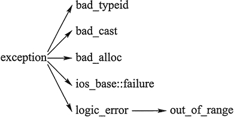

#### 138、C++如何处理多个异常的？

1)  C++中的异常情况： 
 语法错误（编译错误）：比如变量未定义、括号不匹配、关键字拼写错误等等编译器在编译时能发现的错误，这类错误可以及时被编译器发现，而且可以及时知道出错的位置及原因，方便改正。 
 运行时错误：比如数组下标越界、系统内存不足等等。这类错误不易被程序员发现，它能通过编译且能进入运行，但运行时会出错，导致程序崩溃。为了有效处理程序运行时错误，C++中引入异常处理机制来解决此问题。

2)  C++异常处理机制： 
 异常处理基本思想：执行一个函数的过程中发现异常，可以不用在本函数内立即进行处理， 而是抛出该异常，让函数的调用者直接或间接处理这个问题。 
 C++异常处理机制由3个模块组成：try(检查)、throw(抛出)、catch(捕获) 
 抛出异常的语句格式为：throw 表达式；如果try块中程序段发现了异常则抛出异常。 

 ~~~cpp
try  {  可能抛出异常的语句；（检查）  }  catch（类型名[形参名]）//捕获特定类型的异常  {  //处理1；  }  catch（类型名[形参名]）//捕获特定类型的异常  {  //处理2；  }  catch（…）//捕获所有类型的异常  {  } 
 ~~~

#### 144、volatile关键字的作用？

volatile 关键字是一种类型修饰符，用它声明的类型变量表示可以被某些编译器未知的因素更改，比如：操作系统、硬件或者其它线程等。遇到这个关键字声明的变量，编译器对访问该变量的代码就不再进行优化，从而可以提供对特殊地址的稳定访问。声明时语法：int volatile vInt; 当要求使用 volatile 声明的变量的值的时候，系统总是重新从它所在的内存读取数据，即使它前面的指令刚刚从该处读取过数据。而且读取的数据立刻被保存。

volatile用在如下的几个地方： 
 1) 中断服务程序中修改的供其它程序检测的变量需要加volatile； 
 2) 多任务环境下各任务间共享的标志应该加volatile； 
 3) 存储器映射的硬件寄存器通常也要加volatile说明，因为每次对它的读写都可能由不同


##### （56） 说一下volatile关键字的作用

volatile的意思是“脆弱的”，表明它修饰的变量的值十分容易被改变，所以编译器就不会对这个变量进行优化（CPU的优化是让该变量存放到CPU寄存器而不是内存），进而提供稳定的访问。每次读取volatile的变量时，系统总是会从内存中读取这个变量，并且将它的值立刻保存。


#### 44、volatile、mutable和explicit关键字的用法

(1)**volatile**

volatile 关键字是一种类型修饰符，**用它声明的类型变量表示可以被某些编译器未知的因素更改**，比如：操作系统、硬件或者其它线程等。遇到这个关键字声明的变量，编译器对访问该变量的代码就不再进行优化，从而可以提供对特殊地址的稳定访问。

 当要求使用 volatile 声明的变量的值的时候，**系统总是重新从它所在的内存读取数据**，即使它前面的指令刚刚从该处读取过数据。


**volatile定义变量的值是易变的，每次用到这个变量的值的时候都要去重新读取这个变量的值，而不是读寄存器内的备份。多线程中被几个任务共享的变量需要定义为volatile类型。**


**volatile 指针**

volatile 指针和 const 修饰词类似，const 有常量指针和指针常量的说法，volatile 也有相应的概念

修饰由指针指向的对象、数据是 const 或 volatile 的：

```C++
const char* cpch;volatile char* vpch;
```

指针自身的值——一个代表地址的整数变量，是 const 或 volatile 的：

```C++
char* const pchc;char* volatile pchv;
```

 注意：

- 可以把一个非volatile int赋给volatile int，但是不能把非volatile对象赋给一个volatile对象。
- 除了基本类型外，对用户定义类型也可以用volatile类型进行修饰。
- C++中一个有volatile标识符的类只能访问它接口的子集，一个由类的实现者控制的子集。用户只能用const_cast来获得对类型接口的完全访问。此外，volatile向const一样会从类传递到它的成员。

**多线程下的volatile**   

有些变量是用volatile关键字声明的。当两个线程都要用到某一个变量且该变量的值会被改变时，应该用volatile声明，**该关键字的作用是防止优化编译器把变量从内存装入CPU寄存器中。**如果变量被装入寄存器，那么两个线程有可能一个使用内存中的变量，一个使用寄存器中的变量，这会造成程序的错误执行。volatile的意思是让编译器每次操作该变量时一定要从内存中真正取出，而不是使用已经存在寄存器中的值。

（2）**mutable**

mutable的中文意思是“可变的，易变的”，跟constant（既C++中的const）是反义词。在C++中，mutable也是为了突破const的限制而设置的。被mutable修饰的变量，将永远处于可变的状态，即使在一个const函数中。我们知道，如果类的成员函数不会改变对象的状态，那么这个成员函数一般会声明成const的。但是，有些时候，我们需要**在const函数里面修改一些跟类状态无关的数据成员，那么这个函数就应该被mutable来修饰，并且放在函数后后面关键字位置**。

（3）**explicit**

explicit关键字用来修饰类的构造函数，被修饰的构造函数的类，不能发生相应的隐式类型转换，只能以**显示的方式进行类型转换**，注意以下几点：

- explicit 关键字只能用于类内部的构造函数声明上

- explicit 关键字作用于单个参数的构造函数

- 被explicit修饰的构造函数的类，不能发生相应的隐式类型转换

#### 49、C++的异常处理的方法

在程序执行过程中，由于程序员的疏忽或是系统资源紧张等因素都有可能导致异常，任何程序都无法保证绝对的稳定，常见的异常有：

- 数组下标越界
- 除法计算时除数为0
- 动态分配空间时空间不足
- ...

如果不及时对这些异常进行处理，程序多数情况下都会崩溃。

**（1）try、throw和catch关键字**

C++中的异常处理机制主要使用**try**、**throw**和**catch**三个关键字，其在程序中的用法如下：

```C++
#include <iostream>using namespace std;int main(){    double m = 1, n = 0;    try {        cout << "before dividing." << endl;        if (n == 0)            throw - 1;  //抛出int型异常        else if (m == 0)            throw - 1.0;  //拋出 double 型异常        else            cout << m / n << endl;        cout << "after dividing." << endl;    }    catch (double d) {        cout << "catch (double)" << d << endl;    }    catch (...) {        cout << "catch (...)" << endl;    }    cout << "finished" << endl;    return 0;}//运行结果//before dividing.//catch (...)//finished
```

代码中，对两个数进行除法计算，其中除数为0。可以看到以上三个关键字，程序的执行流程是先执行try包裹的语句块，如果执行过程中没有异常发生，则不会进入任何catch包裹的语句块，如果发生异常，则使用throw进行异常抛出，再由catch进行捕获，throw可以抛出各种数据类型的信息，代码中使用的是数字，也可以自定义异常class。**catch根据throw抛出的数据类型进行精确捕获（不会出现类型转换），如果匹配不到就直接报错，可以使用catch(...)的方式捕获任何异常（不推荐）。**当然，如果catch了异常，当前函数如果不进行处理，或者已经处理了想通知上一层的调用者，可以在catch里面再throw异常。

**（2）函数的异常声明列表**

有时候，程序员在定义函数的时候知道函数可能发生的异常，可以在函数声明和定义时，指出所能抛出异常的列表，写法如下：

```C++
int fun() throw(int,double,A,B,C){...};
```

这种写法表名函数可能会抛出int,double型或者A、B、C三种类型的异常，如果throw中为空，表明不会抛出任何异常，如果没有throw则可能抛出任何异常

**（3）C++标准异常类  exception**

C++ 标准库中有一些类代表异常，这些类都是从 exception 类派生而来的，如下图所示



- bad_typeid：使用typeid运算符，如果其操作数是一个多态类的指针，而该指针的值为 NULL，则会拋出此异常，例如：

```C++
#include <iostream>#include <typeinfo>using namespace std;class A{public:  virtual ~A();}; using namespace std;int main() {	A* a = NULL;	try {  		cout << typeid(*a).name() << endl; // Error condition  	}	catch (bad_typeid){  		cout << "Object is NULL" << endl;  	}    return 0;}//运行结果：bject is NULL
```

- bad_cast：在用 dynamic_cast 进行从多态基类对象（或引用）到派生类的引用的强制类型转换时，如果转换是不安全的，则会拋出此异常
- bad_alloc：在用 new 运算符进行动态内存分配时，如果没有足够的内存，则会引发此异常
- out_of_range:用 vector 或 string的at 成员函数根据下标访问元素时，如果下标越界，则会拋出此异常

> 《C++异常处理（try catch throw）完全攻略》：http://c.biancheng.net/view/422.html


#### volitile 和 restict 关键字

volatile 可能我们用的都比较多也比较常见吧，主要就是告诉编译器，每次在使用volatile指定的变量时总是重新去获取他的值，更简单的理解我是这样的，

为了计算某个内容地址所存的内容会把他放入CPU寄存器，为了优化，下一次就直接从寄存器里取值了
volatile就是为了告诉编译器，不管什么情况你都要去内存里重新获取他的内容！

c99中新增加了一个类型定义，就是restrict。 看了下网上的相关贴子，但还是问题解决的不够。下面是相关一个文章，我将在后面再加相关说明：
那么restrict的意义是什么呢？

概括的说，关键字restrict只用于限定指针；该关键字用于告知编译器，所有修改该指针所指向内容的操作全部都是基于(base on)该指针的，即不存在其它进行修改操作的途径；这样的后果是帮助编译器进行更好的代码优化，生成更有效率的汇编代码。

举个简单的例子

```c
int foo (int* x, int* y){
    *x = 0;
    *y = 1;
    return *x;
}
```

很显然函数foo()的返回值是0，除非参数x和y的值相同。可以想象，99％的情况下该函数都会返回0而不是1。然而编译起必须保证生成100%正确的代码，因此，编译器不能将原有代码替换成下面的更优版本

```c
int f (int* x, int* y){
    *x = 0;
    *y = 1;
    return 0;
}
```

啊哈，现在我们有了restrict这个关键字，就可以利用它来帮助编译器安全的进行代码优化了

```c
int f (int *restrict x, int *restrict y){
    *x = 0;
    *y = 1;
    return *x;
}
```

此时，由于指针 x 是修改 *x的唯一途径，编译起可以确认 “*y=1; ”这行代码不会修改 *x的内容，因此可以安全的优化为

```c
int f (int *restrict x, int *restrict y){
    *x = 0;
    *y = 1;
    return 0;
}
```

最后注意一点，restrict是C99中定义的关键字，C++目前并未引入；在GCC可通过使用参数" -std=c99"
来开启对C99的支持


下面是我从C语言核心技术一书上摘的：
void *memcpy( void * restrict dest ,const void * restrict src,sizi_t n) 这是一个很有用的内存复制函数，由于两个参数都加了restrict限定，所以两块区域不能重叠，即 dest指针所指的区域，不能让别的指针来修改，即src的指针不能修改. 相对应的别一个函数 memmove(void *dest,const void * src,size_t)则可以重叠。


