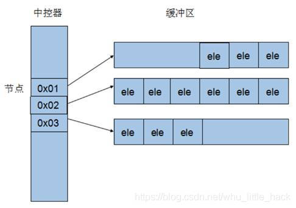

## vector

### 1. 头文件

```
Cop#include<vector>
```

### 2. vector的声明及初始化

**（1）不带参数的构造函数初始化**

```c++
Copy// 初始化一个size为0的vector
vector<int> vec;
```

**（2）带参数的构造函数初始化**
仅指定vector大小，此时每个元素值为默认值0

```
Copyvector<int> vec(10);    //初始化了10个默认值为0的元素
```

指定vector大小和元素初始值

```
Copyvector<int> vec(10，1); //初始化了10个值为1的元素
// 或是
vettor<int> vec = {1, 2, 3}; //初始化了1，2，3这3个元素
```

**（3）通过同类型的vector初始化**

```
Copyvector<int> temp(5,1);
// 通过temp容器初始化一个元素相同的vec向量
vector<int> vec(temp);
```

通常来说，前三种便足够我们平时使用了。

**（4）通过数组地址初始化**

```
Copyint a[5] = {1,2,3,4,5};
// 以数组a的元素初始化vector，注意地址是从0到5（左闭右开区间）
vector<int> vec(a, a+5);
```

**（5）通过insert函数初始化**
使用同类型的vector以及insert函数初始化

```
Copy// insert初始化方式将同类型的迭代器对应的始末区间（左闭右开区间）内的值插入到vector中
vector<int> temp(6,6);
vecot<int> vec;
// 将temp[0]~a[2]插入到vec中，vec.size()由0变为3
vec.insert(vec.begin(), temp.begin(), temp.begin() + 3);
```

使用数组以及insert函数初始化

```
Copyint a[6] = {6,6,6,6,6,6};
vector<int> vec;
// 将a的所有元素插入到vec中
vec.insert(vec.begin(), a, a+7);
```

通过insert函数添加m个值为n的元素

```
Copy// 在vec开始位置处插入6个1
vec.insert(vec.begin(), 6, 1);
```

**（6）通过copy函数赋值**

```
Copyvector<int> vec(5,1);
int a[5] = {2,2,2,2,2};
vector<int> target(10);

// 将vec中元素全部拷贝到target开始的位置中,注意拷贝的区间为vec.begin() ~ vec.end()的左闭右开的区间
copy(vec.begin(), vec.end(), target.begin());

// 拷贝区间也可以是由数组地址构成的区间
copy(a, a+5, vec.begin() + 5);
```

### 3. vector基本操作

#### 1）容量相关

- 容器目前大小：`vec.size()`
- 容器目前容量：`vec.capacity()`
- 容器最大允许容量：`vec.max_size();`
- 判断容器是否为空：`vec.empty()`
- 请求容器capacity减少至size大小：`vec.shrink_to_fit()`
- 更改容器容量：`vec.reverse(size_type n)`
- 更改容器大小
  - 目标size小于当前size则截取前目标size个元素；大于则以元素填充存储空间至目标size
  - `vec.resize(size_type n)`仅指定size修改后大小n，需元素填充则以默认值0填充
  - `vec.resize(size_type n, value_type val)`指定目标size大小n以及填充元素的值val

#### 2）修改元素

- 末尾添加元素：`vec.push_back(value_type val)`

- 末尾删除元素：`vec.pop_back()`

- 对容器赋值：

  - `vec.assign(const_iterator first, const_iterator last)`将同类型容器目标区间[first, last)内的元素赋给调用者
  - `vec.assign(size_type n, const T& x = T())`将n个x赋给调用者

- 在指定位置插入元素：

  - `vec.insert(const_iterator position, value_type& val)`在指定位置position插入元素val
  - `vec.insert(const_iterator position, size_type n, value_type& val)`在指定位置position插入n个元素val
  - `vec.insert(const_iterator position, InputIterator first, InputIterator last)`在指定位置插入同类型容器目标区间内的元素

- 在指定位置删除元素

  - `vec.erase(const_iterator position)`删除指定位置的素
  - `vec.erase(const_iterator first, const_iterator last)`删除指定区间内的元素

- 与另一个容器交换元素：`vec.swap(vector& x)`

- 清空容器元素：

  ```
  vec.clear()
  ```

  - 调用这个方法后，vec的size置为0但capacity不一定会重新分配

#### 3）使用迭代器

- 声明迭代器(类似指针)：

  ```
  vector<size_type>::Iterator i
  ```

  - 访问迭代器指向的元素：`*i`

- 可写迭代器

  - 指向容器开头：`vec.begin()`
  - 指向容器结尾(指向最后一个元素再往后的一个内存)：`vec.end()`

- 只读迭代器(不能通过该指针来修改元素)

  - 指向容器开头：`vec.cbegin()`
  - 指向容器结尾：`vec.cend()`

#### 4）访问元素[

- 访问指定位置元素。通过下面两个方法的比较可以看到，我们平时应优先使用

  ```
  vec.at(i)
  ```

  :

  - `vec[i]`下标访问。不会下标检查是否越界，越界时返回一串无规律整形。
  - `vec.at(i)`通过at函数访问。如果越界会抛出*out of range*的异常

- 访问第一个元素：`vec.front()`

- 访问最后一个元素：`vec.back()`

- 返回一个元素组成的数组的指针：`int* p = vec.data()`

### 4. 常用操作

#### 1）遍历元素[

```

vector<int>::iterator it;
for (it = vec.begin(); it != vec.end(); it++) {
    cout << *it << endl;
}    
//或者
for (size_t i = 0; i < vec.size(); i++) {
    cout << vec.at(i) << endl;
}

```

#### 2）元素翻转

```

#include <algorithm>
reverse(vec.begin(), vec.end());

```

#### 3）元素排序

```

#include <algorithm>
sort(vec.begin(), vec.end()); //采用的是从小到大的排序
//如果想从大到小排序，可以采用上面反转函数，也可以采用下面方法:
bool Comp(const int& a, const int& b) {
    return a > b;
}
sort(vec.begin(), vec.end(), Comp);

```

------

文章最后，我个人认为头文件``中的`reverse()`函数写得特别优雅，在此贴出源码

```
Copytemplate <class BidirectionalIterator>
void reverse (BidirectionalIterator first, BidirectionalIterator last)
{
  while ((first != last) && (first != --last)) {
    std::iter_swap (first,last);
    ++first;
  }
}
```


## array

### 头文件：

```
# include < array >
```

是 C++ 为了解决 C 风格数组的问题而提供的静态数组容器, 大小设置之后固定不变(和C风格静态数组一样), 通常比 C 风格的数组更轻、更有效、更可靠, 个人用的不多, 更多的还是用 C 风格数组或者 vector 动态数组容器, 点击前往: [vector 用法详解](https://blog.csdn.net/wzh1378008099/article/details/105731489)
**与C风格数组的区别**
只是比C风格数组多了几个容器的成员函数, 其他用法大致相同

### 构造函数

```c
array <int, 9> a, a1;
//定义具有 9 个 int 型元素的数组

array <char, 9> ach;
//定义具有 9 个 char 型元素的数组

array <string, 9> astr;
//定义具有 9 个 string 型元素数组

array <array<int, 9>, 9 > aa;
//定义二维 int 类型的数组, 注意 '>' 之间的空格

array <int, 9> a2{ 1,2,3,4 };
//定义新容器 a2, 将 {1,2,3,4} 作为初值

array <int, 9> a3 = { 1,2,3,4 };
//同上

array <int, 9> a4(a);
//定义新容器 a4, 拷贝 a 所有的元素

array <int, 9> a5 = a;
//同上
1234567891011121314151617181920212223
```

### 访问 / 赋值

#### 迭代器

包括: begin、end、rbegin、end、cbegin、cend、crbegin、crend

**使用方法**

```c
auto it=a.begin(); //相当于指针，用 *it 访问
1
```

a.begin(); 返回迭代器, 指向第一元素
a.end(); 返回迭代器, 指向最末元素的下一个位置
a.cbegin(); 返回迭代器, 指向第一元素, 类型为const
a.rbegin(); 返回反向迭代器, 指向反向迭代的第一元素
a.rend(); 返回反向迭代器, 指向反向迭代的最末元素的下一个位置
a.crbegin(); 返回反向迭代器, 指向反向迭代的第一元素, 类型为const

例: 使用正向遍历 a 数组

```c
array <int, 10> a = { 1,2,3,4,5,6 };
for (auto it = a.begin(); it != a.end(); it++) {
	//注意这里是不等于end, 而不是小于end
	cout << *it << ' ';
}
输出结果为: 
1 2 3 4 5 6 0 0 0 0
1234567
```

例: 反向遍历 a 数组

```c
array <int> a{ 1,2,3,4,5,6 };
for(auto it=a.rbegin();it!=a.rend();it++){
	//注意这里还是it++, 而不是it--
	cout << *it <<' ';
}
输出结果为: 
0 0 0 0 6 5 4 3 2 1
1234567
```

**begin和rbegin的区别**
a.begin() 返回迭代器，指向 a 第一个元素
a.rbegin() 返回逆序迭代器，指向 a 最后一个元素
**begin和cbegin的区别**
可以通过a.begin()修改 a 的值 (具体可不可以需要看 a )
不能通过a.cbegin()修改 a 的值

#### 下标/at

支持下标 [] 和 at 函数随机访问容器内元素
a[id]; 返回下标为 id 的元素, 不检查是否越界
a.at(id); 返回下标为 id 的元素, 如果越界抛出异常

#### 批量赋值

```c
a.assign(3);
//将容器的每个元素都赋值成 3
//例:a={5,6,7}
//运行之后 a={3,3,3}

a.fill(4);
//将容器的每个元素都赋值成 4
//例:a={5,6,7}
//运行之后 a={4,4,4}
123456789
```

#### swap(交换函数)

```c
a.swap(a1);
//交换两个容器的内容
//例:a={1,2,3,4}, a1={5,6,7}
//运行之后, a={5,6,7}, a1={1,2,3,4}
1234
```

### 常用函数

```c
a.front();
//返回第一元素
//例:a={1,2,3,4}
//a.front()就等于 1

a.back();
//返回最末元素
//例:a={1,2,3,4}
//a.back()就等于 4

a.empty();
//容器为空返回true, 否则返回 false
为空的前提是, a.size()=0; 但我们平常一般不会定义一个 0 空间的数组
因此这个函数用的不多.
1234567891011121314
```

### 长度/空间/容量相关函数

```c
a.size();
//返回容器内目前的元素个数, array定义之后不变
//例: a={1,2,3}
//返回 3
//例: array <int,10> a
//返回 10

a.max_size();
//返回元素个数 size 的最大值
//返回的值和a.size()相同.
注: 由于array 是静态数组, 因此这里的 size 和 max_size 相同
```


## list

### 头文件

```c++
#include<list> 

assign() 给list赋值 
back() 返回最后一个元素 
begin() 返回指向第一个元素的迭代器 
clear() 删除所有元素 
empty() 如果list是空的则返回true 
end() 返回末尾的迭代器 
erase() 删除一个元素 
front() 返回第一个元素 
get_allocator() 返回list的配置器 
insert() 插入一个元素到list中 
max_size() 返回list能容纳的最大元素数量 
merge() 合并两个list 
pop_back() 删除最后一个元素 
pop_front() 删除第一个元素 
push_back() 在list的末尾添加一个元素 
push_front() 在list的头部添加一个元素 
rbegin() 返回指向第一个元素的逆向迭代器 
remove() 从list删除元素 
remove_if() 按指定条件删除元素 
rend() 指向list末尾的逆向迭代器 
resize() 改变list的大小 
reverse() 把list的元素倒转 
size() 返回list中的元素个数 
sort() 给list排序 
splice() 合并两个list 
swap() 交换两个list 
unique() 删除list中重复的元素


```


声明一个int型的list：list<int> a；

### **1、list的构造函数**


```cpp
list<int>a{1,2,3}


list<int>a(n)    //声明一个n个元素的列表，每个元素都是0


list<int>a(n, m)  //声明一个n个元素的列表，每个元素都是m


list<int>a(first, last)  //声明一个列表，其元素的初始值来源于由区间所指定的序列中的元素，first和last是迭代器
```


### **2、begin()和end()**


通过调用list容器的成员函数begin()得到一个指向容器起始位置的iterator，可以调用list容器的end()函数来得到list末端下一位置

 

### **3、push_back()和push_front()**

使用list的成员函数push_back和push_front插入一个元素到list中。其中push_back()是从list的末端插入，而push_front()是从list的头部插入。

 

### **4、empty()**

判断list是否为空

 

### **5、resize()**

调用resize(n)将list的长度改为只容纳n个元素，超出的元素将被删除。如果n比list原来的长度长，那么默认超出的部分元素置为0。也可以用resize(n, m)的方式将超出的部分赋值为m。

例子：


```cpp
list<int>b{1, 2, 3, 4};


b.resize(2);


list中输出元素：1,2


list<int>b{1, 2, 3, 4};


b.resize(6);


list中输出元素：1,2,3,4,0,0


list<int>b{1, 2, 3, 4};


b.resize(6,9);


list中输出元素：1,2,3,4,9,9
```


### **6、clear()**

清空list中的所有元素

 

### **7、front()和back()**

通过front()可以获得list容器中的头部元素，通过back()可以获得list容器的最后一个元素。注意：当list元素为空时，这时候调用front()和back()不会报错。因此在编写程序时，最好先调用empty()函数判断list是否为空，再调用front()和back()函数。

 

### **8、pop_back()和pop_front()**

使用pop_back()可以删掉尾部第一个元素，pop_front()可以删掉头部第一个元素。注意：list必须不为空，如果当list为空的时候调用pop_back()和pop_front()会使程序崩掉。

 

### **9、assign()**

有两种使用情况：

（1）a.assign(n, val):将a中的所有元素替换成n个val元素

例如：


```cpp
list<int>b{1,2,3,4,5};


b.assign(5,10);
```

b中的元素变为10, 10, 10, 10, 10


（2）a.assign(b.begin(), b.end())


```cpp
list<int>a{6,7,8,9};


list<int>b{1,2,3,4,5};


b.assign(a.begin(),a.end());
```


b中的元素变为6,7,8,9

 

### **10、swap()**

交换两个链表。a.swap(b)和swap(a, b)，都可以完成a链表和b链表的交换。

例子：


```cpp
list<int>a{6,7,8,9};


list<int>b{1,2,3,4,5};


swap(a, b);  //或a.swap(b)
```


a中元素变为1,2,3,4,5

b中元素变为6,7,8,9

 

### **11、reverse()**

可以实现list的逆置

例子：


```cpp
list<int>b{1,2,3,4,5};


reverse(b.begin(),b.end());
```


b中元素变为5，4，3，2，1

 

### **12、merge()**

a.merge(b) 调用结束后b变为空，a中元素包含原来a和b的元素。

例子：


```cpp
list<int>a{6,7,8,9};


list<int>b{2, 1, 3, 6, 5};


a.merge(b,greater<int>());
```


a中元素变为：6,7,8,9,2,1,3,6,5

 


```cpp
list<int>a{6,7,8,9};


list<int>b{2, 1, 3, 6, 5};


a.merge(b);
```


a中元素变为：2,1,3,6,5,6,7,8,9

 

### **13、insert()**

在指定位置插入一个或多个元素


```cpp
a.insert(a.begin(),100);  //在a的开始位置（即头部）插入100


a.insert(a.begin(),2, 100);   //在a的开始位置插入2个100


a.insert(a.begin(),b.begin(), b.end());//在a的开始位置插入b从开始到结束的所有位置的元素
```


### **14、erase()**


删除一个元素或一个区域的元素


```cpp
a.erase(a.begin());  //将a的第一个元素删除


a.erase(a.begin(),a.end());  //将a的从begin()到end()之间的元素删除。
```


### **15、remove()函数**

从list中删除元素


```cpp
list<int>a{6,7,8,9,7,10};


a.remove(7);
```


删除了a中所有值为7的元素，此时a中元素为6,8,9,10

 

### **16、remove_if()函数**

括号中可以传入

（1）回调函数

回调函数的原型为boolisRemove(T &obj1);

函数名任意，如果obj1需要被移除则返回1，否则返回0

使用方法：list.remove_if(isRemove)

这种方法最简单，但是无法向回调函数中传递参数，每一个条件就要有一个回调函数，因此不推荐使用

（2）创建用于比较的类，传入类名及初始化参数

用于比较的类必须重载bool operator()(T &obj1)方法，如果obj1需要被移除则返回1，否则返回0.

用于比较的类还应当包含必要的构造函数，用于传递参数。

使用方法：list.remove_if(classname(args))

例1：


```cpp
bool is_odd(constint& value){


    return (value==4);


}


 


int main(){


    list<int> a{6,7,4,9,7,10};


    a.remove_if(is_odd);


 


    list<int>::iterator it = a.begin();


    while(it != a.end()){


        cout<<*it<< " ";


        it++;


    }


 


 


    return 0;


}
```


输出：

6 7 9 7 10

 

例2：


```cpp
class single_digit{


public:


    bool operator()(const int& value){


        return (value<10);


    }


};


 


int main(){


    list<int> a{6,7,4,9,7,10};


   a.remove_if(single_digit());


 


    list<int>::iterator it = a.begin();


    while(it != a.end()){


        cout<<*it<<" ";


        it++;


    }


 


 


    return 0;


}
```


输出：

10


## forward_list

### **一、基本原理**

​    **list是双向链表，forward_list是单向链表，**在链表的任何位置添加或删除元素都很快，但是作为代价，这两个容器都**不支持随机访问**，为了访问容器中的某一个元素，我们只能遍历整个容器。

​    forward_list是C++新标准增加的类型，其设计目标是达到与最好的手写单向链表数据结构相当的性能，因此**forward_list没有size操作**，因为保存或计算其大小会比手写链表多出额外的开销。对于其他容器而言（比如list），size保证是一个常量时间的操作。

​    

​    

​    

### **二、用法**

​    以下都以容器list、forward_list中的元素为int为例，若要保存其他类型的元素，将int换成其他类型即可。使用list、forward_list应该包含以下头文件：

```cpp
// 包含头文件
#include <list>
#include <forward_list>
// 使用命名空间std
using namespace std;
12345
```

​    

#### **初始化**

| list<类型名>   链表名;        | 双向链表                                            |
| ----------------------------- | --------------------------------------------------- |
| **list<int>  li1;**           | 创建一个名为li1的**双向链表**，li1中的元素类型为int |
| **list<int>  li1(100,7);**    | li1中的元素为100个7                                 |
| **list<int>  li1{1,2,3,……};** | 元素为1,2,3,……的li1                                 |
| **list<int>  li2(li1);**      | 链表li2中包含和链表li1一样的元素                    |
| **list<int>  li2=li1;**       | 链表li2中包含和链表li1一样的元素                    |

| forward_list<类型名>   链表名;       | 单向链表                                          |
| ------------------------------------ | ------------------------------------------------- |
| **forward_list<int>  f1;**           | 创建一个名为f1的**单向链表**，f1中的元素类型为int |
| **forward_list<int>  f1(100,7);**    | f1中的元素为100个7                                |
| **forward_list<int>  f1{1,2,3,……};** | 元素为1,2,3,……的f1                                |
| **forward_list<int>  f2(f1);**       | 链表f2中包含和链表f1一样的元素                    |
| **forward_list<int>  f2=f1;**        | 链表f2中包含和链表f1一样的元素                    |

​    

#### **访问元素、获取迭代器**

| list                            |                                                 |
| ------------------------------- | ----------------------------------------------- |
| **li1.front();**                | 访问li1的**链首元素**                           |
| **li1.back();**                 | 访问li1的**链尾元素**                           |
| ***iter**                       | 访问迭代器**iter指向的元素**                    |
| **li1.begin();**                | 获取指向li1**链首元素**的**迭代器**             |
| **li1.end();**                  | 获取指向li1**链尾元素的后一个位置**的**迭代器** |
| **li1.rbegin();**               | 获取指向li1**首元素的前一个位置**的**迭代器**   |
| **li1.rend();**                 | 获取指向li1**尾元素**的**迭代器**               |
| **li1.cbegin(); li1.cend();**   | 含义同上，但获取到的是**const_iterator**        |
| **li1.crbegin(); li1.crend();** | 含义同上，但获取到的是**const_iterator**        |

| forward_list                | 不支持反向迭代器                               |
| --------------------------- | ---------------------------------------------- |
| **f1.front();**             | 访问f1的**链首元素**                           |
| ***iter**                   | 访问迭代器**iter指向的元素**                   |
| **f1.begin();**             | 获取指向f1**链首元素**的**迭代器**             |
| **f1.end();**               | 获取指向f1**链尾元素的后一个位置**的**迭代器** |
| **f1.cbegin(); f1.cend();** | 含义同上，但获取到的是**const_iterator**       |

​    

#### **遍历容器**

其中forward_list不支持反向遍历

1、普通for语句，使用迭代器

```cpp
// list
for (list<int>::iterator iter = li1.begin(); iter != li1.end(); ++iter) {
	cout << *iter << " ";		// 输出当前元素并以空格隔开
}

// forward_list
for (forward_list<int>::iterator iter = f1.begin(); iter != f1.end(); ++iter) {
	cout << *iter << " ";		// 输出当前元素并以空格隔开
}
123456789
```

2、范围for语句

```cpp
// list
for (auto it : li1) {
	cout << it << " ";		// 输出当前元素并以空格隔开
}

// forward_list
for (auto it : f1) {
	cout << it << " ";		// 输出当前元素并以空格隔开
}

// 如果要修改容器内元素，请使用引用，比如
for (auto &it : f1) {
	cout << it << endl;		// 现在对it进行操作就可以修改容器内对应元素
}
1234567891011121314
```

​    

#### **添加元素**

| list                          |                                                              |
| ----------------------------- | ------------------------------------------------------------ |
| **li1.push_front(a);**        | 在li1的**链首**添加一个元素a                                 |
| **li1.emplace_front(a);**     | 在li1的**链首**添加一个元素a                                 |
| **li1.push_back(a);**         | 在li1的**链尾**添加一个元素a                                 |
| **li1.emplace_back(a);**      | 在li1的**链尾**添加一个元素a                                 |
| **li1.insert(iter,a);**       | 迭代器**iter指向的元素之前**添加一个元素a                    |
| **li1.insert(iter,n,a);**     | 迭代器**iter指向的元素之前**添加 n 个元素a                   |
| **li1.insert(iter,{a,b,c});** | 迭代器**iter指向的元素之前**添加大括号内的所有元素，这里添加的元素是a、b、c |

| forward_list                       |                                                              |
| ---------------------------------- | ------------------------------------------------------------ |
| **f1.push_front(a);**              | 在f1的**链首**添加一个元素a                                  |
| **f1.emplace_front(a);**           | 在f1的**链首**添加一个元素a                                  |
| **f1.emplace_after(iter,a);**      | 在迭代器**iter指向的元素之后**添加一个元素a                  |
| **f1.insert_after(iter,a);**       | 在迭代器**iter指向的元素之后**添加一个元素a                  |
| **f1.insert_after(iter,n,a);**     | 在迭代器**iter指向的元素之后**添加 n 个元素a                 |
| **f1.insert_after(iter,{a,b,c});** | 迭代器**iter指向的元素之后**添加大括号内的所有元素，这里添加的元素是a、b、c |

​    

#### **删除元素**

| list                        |                                                         |
| --------------------------- | ------------------------------------------------------- |
| **li1.pop_front();**        | 在li1的**链首**删除一个元素                             |
| **li1.pop_back();**         | 在li1的**链尾**删除一个元素                             |
| **li1.erase(iter);**        | 删除迭代器**iter指向的元素**                            |
| **li1.erase(iter1,iter2);** | 删除迭代器**iter1和ter2指向的范围中元素**，范围左闭右开 |
| **li1.clear();**            | 删除li1中的**所有**元素                                 |

| forward_list                     |                                                         |
| -------------------------------- | ------------------------------------------------------- |
| **f1.pop_front();**              | 在f1的**链首**删除一个元素                              |
| **f1.erase_after(iter);**        | 删除迭代器**iter指向的元素**                            |
| **f1.erase_after(iter1,iter2);** | 删除迭代器**iter1和ter2指向的范围中元素**，范围左开右开 |
| **f1.clear();**                  | 删除f1中的**所有**元素                                  |

​    

#### **替换元素**

| list                         |                                                              |
| ---------------------------- | ------------------------------------------------------------ |
| **li1=li2;**                 | 将li1中的元素替换为li2                                       |
| **li1.swap(li2);**           | 交换li1和li2的元素，swap通常比从li2向li1拷贝元素要快得多     |
| **swap(li1,li2);**           | 交换li1和li2的元素，swap通常比从li2向li1拷贝元素要快得多     |
| **li1={1,2,3,……};**          | 将li1中的元素替换为初始化列表中的元素1,2,3,……                |
| **li1.assign(iter1,iter2);** | 将li1中的元素替换为迭代器iter1和iter2所指范围中的元素。迭代器iter1、iter2不能指向li1中的元素 |
| **li1.assign({1,2,3,……});**  | 将li1中的元素替换为初始化列表中的元素1,2,3,……                |
| **li1.assign(7, 1);**        | 将li1中的元素替换为7个1（仅为举例，换成别的也行）            |

| forward_list                | 以下几个函数的用法全部同list                                 |
| --------------------------- | ------------------------------------------------------------ |
| **f1=f2;**                  | 将f1中的元素替换为f2                                         |
| **f1.swap(f2);**            | 交换f1和f2的元素，swap通常比从f2向f1拷贝元素要快得多         |
| **swap(f1,f2);**            | 交换f1和f2的元素，swap通常比从f2向f1拷贝元素要快得多         |
| **f1={1,2,3,……};**          | 将f1中的元素替换为初始化列表中的元素1,2,3,……                 |
| **f1.assign(iter1,iter2);** | 将f1中的元素替换为迭代器iter1和iter2所指范围中的元素。迭代器iter1、iter2不能指向f1中的元素 |
| **f1.assign({1,2,3,……});**  | 将f1中的元素替换为初始化列表中的元素1,2,3,……                 |
| **f1.assign(7, 1);**        | 将f1中的元素替换为7个1（仅为举例，换成别的也行）             |

​    

#### **大小**

| list                |                                                              |
| ------------------- | ------------------------------------------------------------ |
| **li1.szie();**     | 获得li1的大小                                                |
| **li1.empty();**    | 若li1为空返回值为true，否则返回值为false                     |
| **li1.maxsize()**   | 可保存的最大元素的数目                                       |
| **li1.resize(n)**   | 调整li1的大小为n个元素，若n<li1.size()，多余的元素会被丢弃。 |
| **li1.resize(n,t)** | 调整li1的大小为n个元素，任何添加的新元素值会被初始化为t      |

| forward_list       |                                                           |
| ------------------ | --------------------------------------------------------- |
| **f1.empty();**    | 若f1为空返回值为true，否则返回值为false                   |
| **f1.maxsize()**   | 可保存的最大元素的数目                                    |
| **f1.resize(n)**   | 调整f1的大小为n个元素，若n<f1的大小，多余的元素会被丢弃。 |
| **f1.resize(n,t)** | 调整f1的大小为n个元素，任何添加的新元素值会被初始化为t    |

​    

**查找、替换、排序、去重、求和**

​    请使用C++标准库里的泛型算法（find、replace、sort、unique、accumulate……），标准库提供了100多个算法，这些算法适用于大多数容器，这里不详解这些算法。

​    

​    

​    

### **三、时间复杂度**

| 操作           | 最坏时间复杂度 |
| -------------- | -------------- |
| 查找           | O(n)           |
| 添加或删除元素 | O(1)           |

​    

​    

​    

### **四、注意事项**

向容器中添加或删除元素都有可能会使容器的迭代器失效。

**向容器添加元素后：**

- **（1） vector和string**：若存储空间重新分配，则迭代器全部失效。若存储空间没有重新分配，则指向插入位置之前的元素的迭代器仍有效，之后的元素的迭代器将会失效。
- **（2） deque**:插入元素到除了首尾位置之外的任何位置，都会使迭代器、指针、引用失效。插入元素到首尾，迭代器会失效，指向原来元素的指针和引用仍有效。
- **（3） list和forward_list**：迭代器、指针、引用仍然有效。

**在容器中删除一个元素后：**

- **（1） vector和string**：指向被删除元素之前的迭代器、引用、指针仍有效。当我们删除元素时，尾后迭代器总是会失效。
- **（2） deque**:在首尾位置之外的任何位置删除元素，迭代器、指针、引用都会失效。如果删除的是尾元素，那么尾后迭代器失效，其他迭代器、引用、指针仍有效。如果删除的是首元素，迭代器、指针、引用仍有效。
- **（3） list和forward_list**：指向除删除元素外的其他元素的迭代器、指针、引用仍然有效。


## string

### 一. 构造：

------

```
string str：生成空字符串

string s(str)：生成字符串为str的复制品

string s(str, strbegin,strlen)：将字符串str中从下标strbegin开始、长度为strlen的部分作为字符串初值

string s(cstr, char_len)：以C_string类型cstr的前char_len个字符串作为字符串s的初值

string s(num ,c)：生成num个c字符的字符串

string s(str, stridx)：将字符串str中从下标stridx开始到字符串结束的位置作为字符串初值

eg:


    string str1;               //生成空字符串
    string str2("123456789");  //生成"1234456789"的复制品
    string str3("12345", 0, 3);//结果为"123"
    string str4("012345", 5);  //结果为"01234"
    string str5(5, '1');       //结果为"11111"
    string str6(str2, 2);      //结果为"3456789"
12345678910111213141516171819202122
#include <iostream>
#include <string>
using namespace std;

void test1()
{
    string str1;               //生成空字符串
    string str2("123456789");  //生成"1234456789"的复制品
    string str3("12345", 0, 3);//结果为"123"
    string str4("0123456", 5);  //结果为"01234"
    string str5(5, '1');       //结果为"11111"
    string str6(str2, 2);      //结果为"3456789"

    cout<<"str2:"<<str2<<endl;
    cout<<"str3:"<<str3<<endl;
    cout<<"str4:"<<str4<<endl;
    cout<<"str5:"<<str5<<endl;
    cout<<"str6:"<<str6<<endl;
}

int main()
{
    test1();
    return 0;
}12345678910111213141516171819202122232425
```


### 二. 大小和容量：：

```
1. size()和length()：返回string对象的字符个数，他们执行效果相同。

2. max_size()：返回string对象最多包含的字符数，超出会抛出length_error异常

3. capacity()：重新分配内存之前，string对象能包含的最大字符数

12345678
void test2()
{
    string s("1234567");
    cout << "size=" << s.size() << endl;
    cout << "length=" << s.length() << endl;
    cout << "max_size=" << s.max_size() << endl;
    cout << "capacity=" << s.capacity() << endl;

}123456789
```


### 三. 字符串比较：：

```
1. C ++字符串支持常见的比较操作符（>,>=,<,<=,==,!=），甚至支持string与C-string的比较(如 str<”hello”)。  
在使用>,>=,<,<=这些操作符的时候是根据“当前字符特性”将字符按字典顺序进行逐一得 比较。字典排序靠前的字符小，  
比较的顺序是从前向后比较，遇到不相等的字符就按这个位置上的两个字符的比较结果确定两个字符串的大小(前面减后面)
同时，string (“aaaa”) <string(aaaaa)。    

2. 另一个功能强大的比较函数是成员函数compare()。他支持多参数处理，支持用索引值和长度定位子串来进行比较。 
  他返回一个整数来表示比较结果，返回值意义如下：0：相等 1：大于 -1：小于 (A的ASCII码是65，a的ASCII码是97)1234567
void test3()
{
    // (A的ASCII码是65，a的ASCII码是97)
    // 前面减去后面的ASCII码，>0返回1，<0返回-1，相同返回0
    string A("aBcd");
    string B("Abcd");
    string C("123456");
    string D("123dfg");

    // "aBcd" 和 "Abcd"比较------ a > A
    cout << "A.compare(B)：" << A.compare(B)<< endl;                          // 结果：1

    // "cd" 和 "Abcd"比较------- c > A
    cout << "A.compare(2, 3, B):" <<A.compare(2, 3, B)<< endl;                // 结果：1

    // "cd" 和 "cd"比较 
    cout << "A.compare(2, 3, B, 2, 3):" << A.compare(2, 3, B, 2, 3) << endl;  // 结果：0


    // 由结果看出来：0表示下标，3表示长度
    // "123" 和 "123"比较 
    cout << "C.compare(0, 3, D, 0, 3)" <<C.compare(0, 3, D, 0, 3) << endl;    // 结果：0

}123456789101112131415161718192021222324
```


### 四. 的插入：push_back() 和 insert()

------

```
void  test4()
{
    string s1;

    // 尾插一个字符
    s1.push_back('a');
    s1.push_back('b');
    s1.push_back('c');
    cout<<"s1:"<<s1<<endl; // s1:abc

    // insert(pos,char):在制定的位置pos前插入字符char
    s1.insert(s1.begin(),'1');
    cout<<"s1:"<<s1<<endl; // s1:1abc
}1234567891011121314
```


### 五、拼接字符串：append() & + 操作符

------

```
void test5()
{
    // 方法一：append()
    string s1("abc");
    s1.append("def");
    cout<<"s1:"<<s1<<endl; // s1:abcdef

    // 方法二：+ 操作符
    string s2 = "abc";
    /*s2 += "def";*/
    string s3 = "def";
    s2 += s3.c_str();
    cout<<"s2:"<<s2<<endl; // s2:abcdef
}1234567891011121314
```


### 六、 的遍历：借助迭代器 或者 下标法

------

```
void test6()
{
    string s1("abcdef"); // 调用一次构造函数

    // 方法一： 下标法

    for( int i = 0; i < s1.size() ; i++ )
    {
        cout<<s1[i];
    }
    cout<<endl;

    // 方法二：正向迭代器

    string::iterator iter = s1.begin();
    for( ; iter < s1.end() ; iter++)
    {
        cout<<*iter;
    }
    cout<<endl;

    // 方法三：反向迭代器
    string::reverse_iterator riter = s1.rbegin();
    for( ; riter < s1.rend() ; riter++)
    {
        cout<<*riter;
    }
    cout<<endl;
}1234567891011121314151617181920212223242526272829
```


### 七、 删除：erase()

```
1. iterator erase(iterator p);//删除字符串中p所指的字符

2. iterator erase(iterator first, iterator last);//删除字符串中迭代器

区间[first,last)上所有字符

3. string& erase(size_t pos = 0, size_t len = npos);//删除字符串中从索引

位置pos开始的len个字符

4. void clear();//删除字符串中所有字符1234567891011
void test6()
{
    string s1 = "123456789";


    // s1.erase(s1.begin()+1);              // 结果：13456789
    // s1.erase(s1.begin()+1,s1.end()-2);   // 结果：189
    s1.erase(1,6);                       // 结果：189
    string::iterator iter = s1.begin();
    while( iter != s1.end() )
    {
        cout<<*iter;
        *iter++;
    }
    cout<<endl;

}1234567891011121314151617
```

### 八、 字符替换：

------

```
1. string& replace(size_t pos, size_t n, const char *s);//将当前字符串

从pos索引开始的n个字符，替换成字符串s

2. string& replace(size_t pos, size_t n, size_t n1, char c); //将当前字符串从pos索引开始的n个字符，替换成n1个字符c

3. string& replace(iterator i1, iterator i2, const char* s);//将当前字符串[i1,i2)区间中的字符串替换为字符串s1234567
void test7()
{
    string s1("hello,world!");

    cout<<s1.size()<<endl;                     // 结果：12
    s1.replace(s1.size()-1,1,1,'.');           // 结果：hello,world.

    // 这里的6表示下标  5表示长度
    s1.replace(6,5,"girl");                    // 结果：hello,girl.
    // s1.begin(),s1.begin()+5 是左闭右开区间
    s1.replace(s1.begin(),s1.begin()+5,"boy"); // 结果：boy,girl.
    cout<<s1<<endl;
}12345678910111213
```

### 九、 大小写转换：tolower()和toupper()函数 或者 STL中的transform算法

------

#### 方法一：使用C语言之前的方法，使用函数，进行转换

```
#include <iostream>
#include <string>
using namespace std;

int main()
{
    string s = "ABCDEFG";

    for( int i = 0; i < s.size(); i++ )
    {
        s[i] = tolower(s[i]);
    }

    cout<<s<<endl;
    return 0;
}12345678910111213141516
```

#### 方法二：通过STL的transform算法配合的toupper和tolower来实现该功能

```
#include <iostream>
#include <algorithm>
#include <string>

using namespace std;

int main()
{
    string s = "ABCDEFG";
    string result;

    transform(s.begin(),s.end(),s.begin(),::tolower);
    cout<<s<<endl;
    return 0;
}123456789101112131415
```

相关的我的另外一篇博客：
C++对string进行大小写转换
https://blog.csdn.net/qq_37941471/article/details/81988702

### 十、 string的查找：find

------

```
1. size_t find (constchar* s, size_t pos = 0) const;

  //在当前字符串的pos索引位置开始，查找子串s，返回找到的位置索引，

    -1表示查找不到子串

2. size_t find (charc, size_t pos = 0) const;

  //在当前字符串的pos索引位置开始，查找字符c，返回找到的位置索引，

    -1表示查找不到字符

3. size_t rfind (constchar* s, size_t pos = npos) const;

  //在当前字符串的pos索引位置开始，反向查找子串s，返回找到的位置索引，

    -1表示查找不到子串

4. size_t rfind (charc, size_t pos = npos) const;

  //在当前字符串的pos索引位置开始，反向查找字符c，返回找到的位置索引，-1表示查找不到字符

5. size_tfind_first_of (const char* s, size_t pos = 0) const;

  //在当前字符串的pos索引位置开始，查找子串s的字符，返回找到的位置索引，-1表示查找不到字符

6. size_tfind_first_not_of (const char* s, size_t pos = 0) const;

  //在当前字符串的pos索引位置开始，查找第一个不位于子串s的字符，返回找到的位置索引，-1表示查找不到字符

7. size_t find_last_of(const char* s, size_t pos = npos) const;

  //在当前字符串的pos索引位置开始，查找最后一个位于子串s的字符，返回找到的位置索引，-1表示查找不到字符

8. size_tfind_last_not_of (const char* s, size_t pos = npos) const;

 //在当前字符串的pos索引位置开始，查找最后一个不位于子串s的字符，返回找到的位置索引，-1表示查找不到子串12345678910111213141516171819202122232425262728293031323334353637
void test8()
{
    string s("dog bird chicken bird cat");

    //字符串查找-----找到后返回首字母在字符串中的下标

    // 1. 查找一个字符串
    cout << s.find("chicken") << endl;        // 结果是：9

    // 2. 从下标为6开始找字符'i'，返回找到的第一个i的下标
    cout << s.find('i',6) << endl;            // 结果是：11

    // 3. 从字符串的末尾开始查找字符串，返回的还是首字母在字符串中的下标
    cout << s.rfind("chicken") << endl;       // 结果是：9

    // 4. 从字符串的末尾开始查找字符
    cout << s.rfind('i') << endl;             // 结果是：18-------因为是从末尾开始查找，所以返回第一次找到的字符

    // 5. 在该字符串中查找第一个属于字符串s的字符
    cout << s.find_first_of("13br98") << endl;  // 结果是：4---b

    // 6. 在该字符串中查找第一个不属于字符串s的字符------先匹配dog，然后bird匹配不到，所以打印4
    cout << s.find_first_not_of("hello dog 2006") << endl; // 结果是：4
    cout << s.find_first_not_of("dog bird 2006") << endl;  // 结果是：9

    // 7. 在该字符串最后中查找第一个属于字符串s的字符
    cout << s.find_last_of("13r98") << endl;               // 结果是：19

    // 8. 在该字符串最后中查找第一个不属于字符串s的字符------先匹配t--a---c，然后空格匹配不到，所以打印21
    cout << s.find_last_not_of("teac") << endl;            // 结果是：21

}1234567891011121314151617181920212223242526272829303132
```

### 十一、 string的排序：sort(s.begin(),s.end())

------

```
#include <iostream>
#include <algorithm>
#include <string>
using namespace std;

void test9()
{
    string s = "cdefba";
    sort(s.begin(),s.end());
    cout<<"s:"<<s<<endl;     // 结果：abcdef
}1234567891011
```

### 十二、 分割/截取字符串：strtok() & substr()

------

#### strtok():分割字符串

```
void test10()
{
    char str[] = "I,am,a,student; hello world!";

    const char *split = ",; !";
    char *p2 = strtok(str,split);
    while( p2 != NULL )
    {
        cout<<p2<<endl;
        p2 = strtok(NULL,split);
    }
}123456789101112
```


```
void test11()
{
    string s1("0123456789");
    string s2 = s1.substr(2,5); // 结果：23456-----参数5表示：截取的字符串的长度
    cout<<s2<<endl;
}
```


## deque

### deque容器的基本内涵

deque是一个双端数组，可以对头端进行插入删除操作。

**deque与vector区别：**

> 1. vector对于头部的插入删除效率低，数据量越大，效率越低
> 2. deque相对而言，对头部的插入删除速度回比vector快
> 3. vector访问元素时的速度会比deque快,这和两者内部实现有关

**deque的内部实现**

deque内部有个**中控器**，维护每段缓冲区中的内容，缓冲区中存放真实数据

中控器维护的是每个缓冲区的地址，使得使用deque时像一片连续的内存空间


每次头插的时候，会在中控器的第一个节点的缓冲区之前，插入新的数据；每次尾插的时候，会在中控器的最后一个节点缓冲区之后，插入新的数据。如果该节点的缓冲区满了，就直接新建一个节点插入。

这种实现方法虽然在插入删除的操作上快了，但是在访问元素的速度上慢了（因为要先读中控器，根据里面的地址去找缓冲区）

### deque的定义（构造函数）

- `deque<T>` T; //默认构造形式
- `deque(beg, end);` //构造函数将[beg, end)区间中的元素拷贝给本身。
- `deque(n, elem);` //构造函数将n个elem拷贝给本身。
- `deque(const deque &deq);` //拷贝构造函数

### deque的赋值

- `deque& operator=(const deque &deq);` //重载等号操作符
- `assign(beg, end);` //将[beg, end)区间中的数据拷贝赋值给本身。
- `assign(n, elem);` //将n个elem拷贝赋值给本身。

### deque的大小

deque与vector不同的是，deque没有容量属性，其余相同

- `deque.empty();` //判断容器是否为空
- `deque.size();` //返回容器中元素的个数
- `deque.resize(num);` //重新指定容器的长度为num,若容器变长，则以默认值填充新位置。如果容器变短，则末尾超出容器长度的元素被删除。
- `deque.resize(num, elem);` //重新指定容器的长度为num,若容器变长，则以elem值填充新位置。如果容器变短，则末尾超出容器长度的元素被删除。

### deque的插入删除

两端插入操作：

- `push_back(elem);` //在容器尾部添加一个数据
- `push_front(elem);` //在容器头部插入一个数据
- `pop_back();` //删除容器最后一个数据
- `pop_front();` //删除容器第一个数据

指定位置操作：

- `insert(pos,elem);` //在pos位置插入一个elem元素的拷贝，返回新数据的位置。
- `insert(pos,n,elem);` //在pos位置插入n个elem数据，无返回值。
- `insert(pos,beg,end);` //在pos位置插入[beg,end)区间的数据，无返回值。
- `clear();` //清空容器的所有数据
- `erase(beg,end);` //删除[beg,end)区间的数据，返回下一个数据的位置。
- `erase(pos);` //删除pos位置的数据，返回下一个数据的位置。

### deque的数据存取

- `at(int idx);` //返回索引idx所指的数据
- `operator[];` //返回索引idx所指的数据
- `front();` //返回容器中第一个数据元素
- `back();` //返回容器中最后一个数据元素


## stack


stack模板类（在头文件stack中声明）是一个适配器类，它给底层类（默认情况下为vector）提供了典型的栈接口。
stack模板的限制比vector多。它不仅**不允许随机访问栈元素**，甚至**不允许遍历栈**。它把使用限制在定义栈的基本操作上，即可以将压入推到栈顶、从栈顶弹出元素、查看栈顶的值、检查元素数目和测试栈是否为空。

### 1. 头文件包含

```cpp
#include <stack>
1
```

### 2. 构造函数

```cpp
1. //默认构造函数
   stack<int> first;//创建一个空的stack

2. //复制构造函数，使用已有的stack创建新的stack
   stack<int, list<int> >   s1;
   stack<int, list<int> >   s2(s1);//利用 s1 ，创建一个以双向链表为底层容器的空堆栈对象 s2 

   //使用已创建的deque创建stack
   deque<int> mydeque (3,100);          // 包含3个元素deque
   stack<int> second (mydeque);         // 使用deque初始化stack

   //创建vector为底层的stack，和使用已有stack初始化新的stacck
   std::stack<int,std::vector<int> > third;  // 使用vector创建的空stack
   std::stack<int,std::vector<int> > fourth (myvector);
1234567891011121314
```

### 3. 操作

语法：

```cpp
  ==
  <=
  >=
  <
  >
  !=
123456
```

所有的这些操作可以被用于堆栈. 相等指堆栈有相同的元素并有着相同的顺序。

### 4. 方法函数总览

```cpp
1. empty()	堆栈为空则返回真

2. pop()	移除栈顶元素

3. push()	在栈顶增加元素

4. size()	返回栈中元素数目

5. top()	返回栈顶元素
123456789
```

### 5. 方法函数原型和简单解释

**empty**
语法:
`bool empty();`
如当前堆栈为空，empty() 函数 返回 true 否则返回false.

**pop**
语法:
`void pop();`
pop() 函数移除堆栈中最顶层元素。

**push**
语法:
`void push( const TYPE &val );`
push() 函数将 val 值压栈，使其成为栈顶的第一个元素。如:

```cpp
    stack<int> s;
    for( int i=0; i < 10; i++ )
      s.push(i);

1234
```

**size**
语法:
`size_type size();`
size() 函数返当前堆栈中的元素数目。如:

```cpp
    stack<int> s;
    for( int i=0; i < 10; i++ )
      s.push(i);
    cout << "This stack has a size of " << s.size() << endl;

12345
```

**top**
语法:
`TYPE &top();`
top() 函数返回对栈顶元素的引用. 举例,如下代码显现和清空一个堆栈。

```cpp
    while( !s.empty() ) {
      cout << s.top() << " ";
      s.pop();
    }
```


## queue

**概念：** Queue容器是一种先进先出（FIFO-first in first out）的数据结构。它有两个出口


queue是一种容器转换器模板，调用#include< queue>即可使用队列类。

### 一、queue初始化

queue<Type, Container> (<数据类型，容器类型>）
初始化时必须要有数据类型，容器可省略，省略时则默认为deque 类型

#### 初始化示例

1：

```cpp
queue<int>q1;
queue<double>q2;  
queue＜char＞q3；
//默认为用deque容器实现的queue；
1234
```

2：

```cpp
queue＜char, list＜char＞＞q1；
//用list容器实现的queue 

queue＜int, deque＜int＞＞q2；
 //用deque容器实现的queue 
12345
```

#### 注意：不能用vector容器初始化queue

因为queue转换器要求容器支持front（）、back（）、push_back（）及 pop_front（），说明queue的数据从容器后端入栈而从前端出栈。所以可以使用deque和list对queue初始化，而vector因其缺少pop_front（），不能用于queue。

### 二、queue常用函数

#### 1.常用函数

1. push() 在队尾插入一个元素
2. pop() 删除队列第一个元素
3. size() 返回队列中元素个数
4. empty() 如果队列空则返回true
5. front() 返回队列中的第一个元素
6. back() 返回队列中最后一个元素

#### 2.函数运用示例

1：**push（）在队尾插入一个元素**

```cpp
 queue <string> q;
    q.push("first");
    q.push("second");
    cout<<q.front()<<endl;
1234
```

输出 first

2：**pop() 将队列中最靠前位置的元素删除，没有返回值**

```cpp
queue <string> q;
	q.push("first");
	q.push("second");
	q.pop();
	cout<<q.front()<<endl;
12345
```

输出 second 因为 first 已经被pop（）函数删掉了

3：**size() 返回队列中元素个数**

```cpp
  queue <string> q;
	   q.push("first");
	   q.push("second");
	   cout<<q.size()<<endl;
1234
```

输出2，因为队列中有两个元素

4：**empty() 如果队列空则返回true**

```cpp
queue <string> q;
    cout<<q.empty()<<endl;
    q.push("first");
    q.push("second");
    cout<<q.empty()<<endl;
12345
```

分别输出1和0
最开始队列为空，返回值为1（ture）；
插入两个元素后，队列不为空，返回值为0（false）；

5：front() 返回队列中的第一个元素

```cpp
queue <string> q;
    q.push("first");
    q.push("second");
    cout<<q.front()<<endl;
    q.pop();
    cout<<q.front()<<endl;
123456
```

第一行输出first；
第二行输出second，因为pop（）已经将first删除了

6：**back() 返回队列中最后一个元素**

```cpp
queue <string> q;
q.push("first");
q.push("second");
cout<<q.back()<<endl;
1234
```

输出最后一个元素second


## priority_queue

**对于这个模板类priority_queue，它是STL所提供的一个非常有效的容器。**

**作为队列的一个延伸，优先队列包含在头文件 < queue > 中。**

简述
优先队列时一种比较重要的数据结构，它是有二项队列编写而成的，可以以O(log n) 的效率查找一个队列中的最大值或者最小值，其中是**最大值还是最小值是根据创建的优先队列的性质来决定的。**


#### 模板参数

优先队列有三个参数，其声明形式为：

```cpp
priority_queue< type, container, function >
1
```

**这三个参数，后面两个可以省略，第一个不可以。**
**其中：**

**type：数据类型；**
**container：实现优先队列的底层容器；**
**function：元素之间的比较方式**；
对于container，要求必须是数组形式实现的容器，例如vector、deque，而不能使list。
在STL中，默认情况下（不加后面两个参数）是以vector为容器，以 operator< 为比较方式，所以在只使用第一个参数时，优先队列默认是一个最大堆，每次输出的堆顶元素是此时堆中的最大元素。

#### 成员函数

**假设type类型为int，则：**

```cpp
bool empty() const
//返回值为true，说明队列为空；

int size() const
//返回优先队列中元素的数量；

void pop()
//删除队列顶部的元素，也即根节点

int top()
//返回队列中的顶部元素，但不删除该元素；

void push(int arg)
//将元素arg插入到队列之中；
  
stk.emplace(arg)    //将arg放置在stk中，作用相当于push
  
swap(a,b)      //交换a和b的内容，a和b必须有相同类型，包括底层容器类型也比必须相同

a.swap(b)
1234567891011121314151617181920
```

#### 大顶堆与小顶堆

```cpp
//大顶堆
//构造一个空的优先队列（此优先队列默认为大顶堆）
priority_queue<int> big_heap;   

//另一种构建大顶堆的方法
priority_queue<int,vector<int>,less<int> > big_heap2;   
123456
//小顶堆
//构造一个空的优先队列,此优先队列是一个小顶堆
priority_queue<int,vector<int>,greater<int> > small_heap;   
123
```

**需要注意的是，如果使用less< int>和greater< int>，需要头文件：#include < functional>****


## [C++ bitset 用法](https://www.cnblogs.com/magisk/p/8809922.html)

 

C++的 bitset 在 bitset 头文件中，它是一种类似数组的结构，它的每一个元素只能是０或１，每个元素仅用１bit空间。

下面是具体用法

### 构造函数

bitset常用构造函数有四种，如下

```
    bitset<4> bitset1;　　//无参构造，长度为４，默认每一位为０

    bitset<8> bitset2(12);　　//长度为８，二进制保存，前面用０补充

    string s = "100101";
    bitset<10> bitset3(s);　　//长度为10，前面用０补充
    
    char s2[] = "10101";
    bitset<13> bitset4(s2);　　//长度为13，前面用０补充

    cout << bitset1 << endl;　　//0000
    cout << bitset2 << endl;　　//00001100
    cout << bitset3 << endl;　　//0000100101
    cout << bitset4 << endl;　　//0000000010101
```

注意：

用字符串构造时，字符串只能包含 '0' 或 '1' ，否则会抛出异常。

构造时，需在<>中表明bitset 的大小(即size)。

在进行有参构造时，若参数的二进制表示比bitset的size小，则在前面用０补充(如上面的栗子)；若比bitsize大，参数为整数时取后面部分，参数为字符串时取前面部分(如下面栗子)：

```
    bitset<2> bitset1(12);　　//12的二进制为1100（长度为４），但bitset1的size=2，只取后面部分，即00

    string s = "100101";　　
    bitset<4> bitset2(s);　　//s的size=6，而bitset的size=4，只取前面部分，即1001

    char s2[] = "11101";
    bitset<4> bitset3(s2);　　//与bitset2同理，只取前面部分，即1110

    cout << bitset1 << endl;　　//00
    cout << bitset2 << endl;　　//1001
    cout << bitset3 << endl;　　//1110
```


 

### 可用的操作符

bitset对于二进制有位操作符，具体如下

```
    bitset<4> foo (string("1001"));
    bitset<4> bar (string("0011"));

    cout << (foo^=bar) << endl;       // 1010 (foo对bar按位异或后赋值给foo)
    cout << (foo&=bar) << endl;       // 0010 (按位与后赋值给foo)
    cout << (foo|=bar) << endl;       // 0011 (按位或后赋值给foo)

    cout << (foo<<=2) << endl;        // 1100 (左移２位，低位补０，有自身赋值)
    cout << (foo>>=1) << endl;        // 0110 (右移１位，高位补０，有自身赋值)

    cout << (~bar) << endl;           // 1100 (按位取反)
    cout << (bar<<1) << endl;         // 0110 (左移，不赋值)
    cout << (bar>>1) << endl;         // 0001 (右移，不赋值)

    cout << (foo==bar) << endl;       // false (0110==0011为false)
    cout << (foo!=bar) << endl;       // true  (0110!=0011为true)

    cout << (foo&bar) << endl;        // 0010 (按位与，不赋值)
    cout << (foo|bar) << endl;        // 0111 (按位或，不赋值)
    cout << (foo^bar) << endl;        // 0101 (按位异或，不赋值)
```

此外，可以通过 [ ] 访问元素(类似数组)，注意最低位下标为０，如下：

```
    bitset<4> foo ("1011");
    
    cout << foo[0] << endl;　　//1
    cout << foo[1] << endl;　　//1
    cout << foo[2] << endl;　　//0
```

当然，通过这种方式对某一位元素赋值也是可以的，栗子就不放了。

 

### 可用函数

bitset还支持一些有意思的函数，比如：

```
    bitset<8> foo ("10011011");

    cout << foo.count() << endl;　　//5　　（count函数用来求bitset中1的位数，foo中共有５个１
    cout << foo.size() << endl;　　 //8　　（size函数用来求bitset的大小，一共有８位

    cout << foo.test(0) << endl;　　//true　　（test函数用来查下标处的元素是０还是１，并返回false或true，此处foo[0]为１，返回true
    cout << foo.test(2) << endl;　　//false　　（同理，foo[2]为０，返回false

    cout << foo.any() << endl;　　//true　　（any函数检查bitset中是否有１
    cout << foo.none() << endl;　　//false　　（none函数检查bitset中是否没有１
    cout << foo.all() << endl;　　//false　　（all函数检查bitset中是全部为１
    
```


补充说明一下：test函数会对下标越界作出检查，而通过 [ ] 访问元素却不会经过下标检查，所以，在两种方式通用的情况下，选择test函数更安全一些

另外，含有一些函数：


```
    bitset<8> foo ("10011011");

    cout << foo.flip(2) << endl;　　//10011111　　（flip函数传参数时，用于将参数位取反，本行代码将foo下标２处"反转"，即０变１，１变０
    cout << foo.flip() << endl;　　 //01100000　　（flip函数不指定参数时，将bitset每一位全部取反

    cout << foo.set() << endl;　　　　//11111111　　（set函数不指定参数时，将bitset的每一位全部置为１
    cout << foo.set(3,0) << endl;　　//11110111　　（set函数指定两位参数时，将第一参数位的元素置为第二参数的值，本行对foo的操作相当于foo[3]=0
    cout << foo.set(3) << endl;　　  //11111111　　（set函数只有一个参数时，将参数下标处置为１

    cout << foo.reset(4) << endl;　　//11101111　　（reset函数传一个参数时将参数下标处置为０
    cout << foo.reset() << endl;　　 //00000000　　（reset函数不传参数时将bitset的每一位全部置为０
```


同样，它们也都会检查下标是否越界，如果越界就会抛出异常

最后，还有一些类型转换的函数，如下：

```
    bitset<8> foo ("10011011");

    string s = foo.to_string();　　//将bitset转换成string类型
    unsigned long a = foo.to_ulong();　　//将bitset转换成unsigned long类型
    unsigned long long b = foo.to_ullong();　　//将bitset转换成unsigned long long类型

    cout << s << endl;　　//10011011
    cout << a << endl;　　//155
    cout << b << endl;　　//155
```


