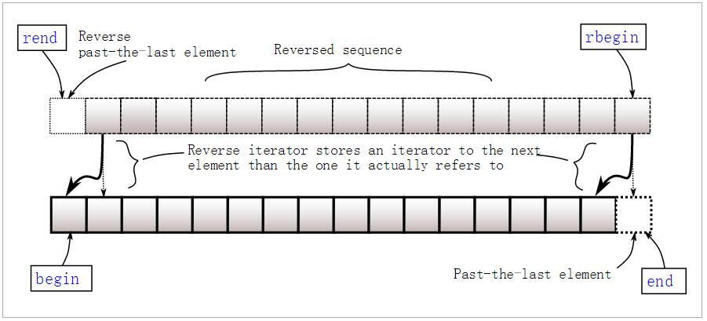

## map/multimap

```c++
 C++ maps是一种关联式容器，包含“关键字/值”对

     begin()         返回指向map头部的迭代器

     clear(）        删除所有元素

     count()         返回指定元素出现的次数, (帮助评论区理解： 因为key值不会重复，所以只能是1 or 0)

     empty()         如果map为空则返回true

     end()           返回指向map末尾的迭代器

     equal_range()   返回特殊条目的迭代器对

     erase()         删除一个元素

     find()          查找一个元素

     get_allocator() 返回map的配置器

     insert()        插入元素

     key_comp()      返回比较元素key的函数

     lower_bound()   返回键值>=给定元素的第一个位置

     max_size()      返回可以容纳的最大元素个数

     rbegin()        返回一个指向map尾部的逆向迭代器

     rend()          返回一个指向map头部的逆向迭代器

     size()          返回map中元素的个数

     swap()           交换两个map

     upper_bound()    返回键值>给定元素的第一个位置

     value_comp()     返回比较元素value的函数
```

### **一. 声明**

```c++
//头文件
#include<map>

map<int, string> ID_Name;

// 使用{}赋值是从c++11开始的，因此编译器版本过低时会报错，如visual studio 2012
map<int, string> ID_Name = {
                { 2015, "Jim" },
                { 2016, "Tom" },
                { 2017, "Bob" } 
};
```

**——————————————————————————————————————————————**


### **二. 插入操作**

#### 2.1 使用[ ]进行单个插入

```c++
map<int, string> ID_Name;

// 如果已经存在键值2015，则会作赋值修改操作，如果没有则插入
ID_Name[2015] = "Tom";
```

#### 2.1 使用insert进行单个和多个插入

insert共有4个重载函数：

```c++
// 插入单个键值对，并返回插入位置和成功标志，插入位置已经存在值时，插入失败
pair<iterator,bool> insert (const value_type& val);

//在指定位置插入，在不同位置插入效率是不一样的，因为涉及到重排
iterator insert (const_iterator position, const value_type& val);

// 插入多个
void insert (InputIterator first, InputIterator last);

//c++11开始支持，使用列表插入多个   
void insert (initializer_list<value_type> il);1234567891011
```

下面是具体使用示例：

```c++
#include <iostream>
#include <map>

int main()
{
    std::map<char, int> mymap;

    // 插入单个值
    mymap.insert(std::pair<char, int>('a', 100));
    mymap.insert(std::pair<char, int>('z', 200));

    //返回插入位置以及是否插入成功
    std::pair<std::map<char, int>::iterator, bool> ret;
    ret = mymap.insert(std::pair<char, int>('z', 500));
    if (ret.second == false) {
        std::cout << "element 'z' already existed";
        std::cout << " with a value of " << ret.first->second << '\n';
    }

    //指定位置插入
    std::map<char, int>::iterator it = mymap.begin();
    mymap.insert(it, std::pair<char, int>('b', 300));  //效率更高
    mymap.insert(it, std::pair<char, int>('c', 400));  //效率非最高

    //范围多值插入
    std::map<char, int> anothermap;
    anothermap.insert(mymap.begin(), mymap.find('c'));

    // 列表形式插入
    anothermap.insert({ { 'd', 100 }, {'e', 200} });

    return 0;
}123456789101112131415161718192021222324252627282930313233
```

**——————————————————————————————————————————————**

### **三. 取值**

Map中元素取值主要有at和[ ]两种操作，at会作下标检查，而[]不会。

```c++
map<int, string> ID_Name;

//ID_Name中没有关键字2016，使用[]取值会导致插入
//因此，下面语句不会报错，但打印结果为空
cout<<ID_Name[2016].c_str()<<endl;

//使用at会进行关键字检查，因此下面语句会报错
ID_Name.at(2016) = "Bob";12345678
```

**——————————————————————————————————————————————**

### **四. 容量查询**

```c++
// 查询map是否为空
bool empty();

// 查询map中键值对的数量
size_t size();

// 查询map所能包含的最大键值对数量，和系统和应用库有关。
// 此外，这并不意味着用户一定可以存这么多，很可能还没达到就已经开辟内存失败了
size_t max_size();

// 查询关键字为key的元素的个数，在map里结果非0即1
size_t count( const Key& key ) const; //123456789101112
```

**——————————————————————————————————————————————**

### **五. 迭代器**

共有八个获取迭代器的函数：** begin, end, rbegin,rend** 以及对应的 ** cbegin, cend, crbegin,crend**。

二者的区别在于，后者一定返回 const_iterator，而前者则根据map的类型返回iterator 或者 const_iterator。const情况下，不允许对值进行修改。如下面代码所示：

```c++
map<int,int>::iterator it;
map<int,int> mmap;
const map<int,int> const_mmap;

it = mmap.begin(); //iterator
mmap.cbegin(); //const_iterator

const_mmap.begin(); //const_iterator
const_mmap.cbegin(); //const_iterator123456789
```

返回的迭代器可以进行加减操作，此外，如果map为空，则 begin = end。



**——————————————————————————————————————————————**

### **六. 删除交换**

#### 6.1 删除

```c++
// 删除迭代器指向位置的键值对，并返回一个指向下一元素的迭代器
iterator erase( iterator pos )

// 删除一定范围内的元素，并返回一个指向下一元素的迭代器
iterator erase( const_iterator first, const_iterator last );

// 根据Key来进行删除， 返回删除的元素数量，在map里结果非0即1
size_t erase( const key_type& key );

// 清空map，清空后的size为0
void clear();123456789101112
```

#### 6.2 交换

```c++
// 就是两个map的内容互换
void swap( map& other );12
```

**——————————————————————————————————————————————**

### **七. 顺序比较**

```c++
// 比较两个关键字在map中位置的先后
key_compare key_comp() const;12
```

示例：

```c++
map<char,int> mymap;
map<char,int>::key_compare mycomp = mymap.key_comp();

mymap['a']=100;
mymap['b']=200;
mycomp('a', 'b');  // a排在b前面，因此返回结果为true123456
```

**——————————————————————————————————————————————**

### **八. 查找**

```c++
// 关键字查询，找到则返回指向该关键字的迭代器，否则返回指向end的迭代器
// 根据map的类型，返回的迭代器为 iterator 或者 const_iterator
iterator find (const key_type& k);
const_iterator find (const key_type& k) const;1234
```

举例：

```c++
std::map<char,int> mymap;
std::map<char,int>::iterator it;

mymap['a']=50;
mymap['b']=100;
mymap['c']=150;
mymap['d']=200;

it = mymap.find('b');
if (it != mymap.end())
    mymap.erase (it); // b被成功删除1234567891011
```

**——————————————————————————————————————————————**

### **九. 操作符**

operator: == != < <= > >=
**注意** 对于==运算符, 只有键值对以及顺序完全相等才算成立。


## set/multiset

multiset：多重集合，其实就是 set 集合的扩展版。

唯一的不同是 set 集合中一个值只能出现一次，

而多重集合中一个值可以出现多次。

 

粗略看了看MSDN，在STL中，multiset和set的成员函数声明也是基本一样的，一些需要注意的地方是：

1. s**et::insert(key)的返回值是一个pair<iterator, bool>，其中pair中的bool成员表明了key被插入之前，set中是否已存在相同的key；也就是说，如果set中已经存在相同key的元素，那么插入操作是会失败的，新的元素不会被插进去；而multiset::insert的返回值只是一个iterator，插入操作总是会成功的。**
2. **multiset::count(key)的返回值可能大于1。（因为插入了多个关键值）**
3. **multiset::size()的返回值是多重集合的势（cardinality），即multiset中元素的个数，而不是值的个数。比如，{1, 1, 2}的size是3，而不是2。**
4. **multiset::erase(key)会将对应的key全部删掉，所以对{1, 1, 2}调用erase(1)之后，它就变成了{2}。**
5. **只要key存在于集合中，set::equal_range(key)的返回值pair<iterator1, iterator2>总是会有++iterator1 == iterator2。但是对multiset来说就不一定了。**                                 

 

- **什么时候需要用multiset？**

**当然是需要用set，但是又允许重复key存在的时候了。**

- **什么时候用set？**

**需要随时往容器中插入元素，随时对元素进行快速查找，又需要按某种顺序对元素进行遍历的时候.**


### **头文件**

```cpp
#include <set>		

```

### set的定义

set内的元素自动递增排序，且自动祛除了重复元素

```cpp
set<typename> name;

```

### set的访问

set只能通过迭代器(iterator)来访问

```cpp
set<typename>::iterator it;
1
#include <iostream>
#include <set>		 
using namespace std;
int main()
{
	set<int> st;
	st.insert(3);
	st.insert(2);
	st.insert(1);
	st.insert(3);
	for(set<int>::iterator it = st.begin(); it != st.end(); it++)
		cout << *it << " ";
} 

```

### set常用函数

```cpp
st.insert(x)		将x插入set容器st中
例：st.insert(3)

st.find(x)			寻找set中值为x的迭代器
例：set<int>::iterator it = st.find(2);

st.erase(x)			x为迭代器时，删除元素的迭代器，可与find连用：st.erase(st.find(x))找到x后删除
st.erase(x)			x为值时，删除元素x
st.erase(first,last)删除一个区间内的所有元素，左闭右开区间
st.size()			st内元素的个数
st.clear()			清空所有元素	
```


## unordered_map/unordered_multimap

### **1. 头文件**

```cpp
#include <unordered_map>
```

### **2. unordered_map声明及初始化**

```c++
// constructing unordered_maps
#include <iostream>
#include <string>
#include <unordered_map>
using namespace std;

typedef unordered_map<string,string> stringmap;

stringmap merge (stringmap a,stringmap b) {
  stringmap temp(a); temp.insert(b.begin(),b.end()); return temp;
}

int main ()
{
  stringmap first;                              					// 空
  stringmap second ( {{"apple","red"},{"lemon","yellow"}} );        // 用数组初始
  stringmap third ( {{"orange","orange"},{"strawberry","red"}} );   // 用数组初始
  stringmap fourth (second);                    					// 复制初始化
  stringmap fifth (merge(third,fourth));        					// 移动初始化
  stringmap sixth (fifth.begin(),fifth.end());  					// 范围初始化

  cout << "sixth contains:";
  for (auto& x: sixth) cout << " " << x.first << ":" << x.second;
  cout << endl;

  return 0;

```


### **3. unordered_map基本操作**

#### （1）迭代器

```
begin() 　　返回指向容器起始位置的迭代器（iterator）

end() 　　 返回指向容器末尾位置的迭代器

cbegin()　 返回指向容器起始位置的常迭代器（const_iterator）

cend() 　　 返回指向容器末尾位置的常迭代器
```

#### （2）容量

```
size() 　　 返回有效元素个数

max_size() 返回 unordered_map() 支持的最大元素个数

empty() 判断是否为空
```

#### （3）元素的访问

```
c[key] 　　 访问元素

c.at(key) 　　 　　　　访问元素
```

#### （4）元素的修改

```
insert() 　　插入元素

erase()　　 删除元素

swap() 　　 交换内容

clear()　　 清空内容

emplace() 　构造及插入一个元素

emplace_hint() 按提示构造及插入一个元素
```

#### （5）操作

```
find() 　　　　　　通过给定主键查找元素,没找到：返回unordered_map::end()//这个很重要， leetcode上面一些题需要用这个特性

count() 　　　　　返回匹配给定主键的元素的个数

equal_range() 　　返回值匹配给定搜索值的元素组成的范围
```

#### （6）Buckets

```
bucket_count() 　　　返回槽（Bucket）数

max_bucket_count() 返回最大槽数

bucket_size() 　　　 返回槽大小

bucket() 　　　　　　返回元素所在槽的序号

load_factor()　　　　 返回载入因子，即一个元素槽（Bucket）的最大元素数

max_load_factor() 　 返回或设置最大载入因子

rehash()　　　　　　 设置槽数

reserve() 　　　　　 请求改变容器容量
```


## unordered_set/unordered_multiset


unordered_set它的实现基于hashtable,它的结构图仍然可以用下图表示,这时的空白格不在是单个value,而是set中的key与value的数据包

有unordered_set就一定有unordered_multiset.跟set和multiset一样,一个key可以重复一个不可以


unordered_set是一种无序集合,既然跟底层实现基于hashtable那么它一定拥有快速的查找和删除，添加的优点.基于hashtable当然就失去了基于rb_tree的自动排序功能

unordered_set无序,所以在迭代器的使用上,set的效率会高于unordered_set


```c++
template<class _Value,
class _Hash = hash<_Value>,
class _Pred = std::equal_to<_Value>,
class _Alloc = std::allocator<_Value> >
class unordered_set
: public __unordered_set<_Value, _Hash, _Pred, _Alloc>
{
typedef __unordered_set<_Value, _Hash, _Pred, _Alloc> _Base;

...

}　　

参数1 _Value key和value的数据包

参数2 _Hash hashfunc获取hashcode的函数

参数3 _Pred 判断key是否相等

参数4 分配器
```


### 一 、定义

```
    //定义
    unordered_set<int> c1;
    
    //operator=
    unordered_set<int> c2;
    c2 = c1;
```

 

### 二、 容量操作

```
//判断是否为空
    c1.empty();
    
    //获取元素个数 size()
    c1.size();
    
    //获取最大存储量 max_size()
    c1.max_size();
```


### 三 、迭代器操作

```
    //返回头迭代器 begin()
    unordered_set<int>::iterator ite_begin = c1.begin();
    
    //返回尾迭代器 end()
    unordered_set<int>::iterator ite_end = c1.end();
    
    //返回const头迭代器 cbegin()
    unordered_set<int>::const_iterator const_ite_begin = c1.cbegin();
    
    //返回const尾迭代器 cend()
    unordered_set<int>::const_iterator const_ite_end = c1.cend();
    
    //槽迭代器
    unordered_set<int>::local_iterator local_iter_begin = c1.begin(1);
    unordered_set<int>::local_iterator local_iter_end = c1.end(1);
```


### 四、基本操作

```
    //查找函数 find() 通过给定主键查找元素
    unordered_set<int>::iterator find_iter = c1.find(1);
    
    //value出现的次数 count() 返回匹配给定主键的元素的个数
    c1.count(1);
    
    //返回元素在哪个区域equal_range() 返回值匹配给定搜索值的元素组成的范围
    pair<unordered_set<int>::iterator, unordered_set<int>::iterator> pair_equal_range = c1.equal_range(1);
    
    //插入函数 emplace()
    c1.emplace(1);
    
    //插入函数 emplace_hint() 使用迭代器
    c1.emplace_hint(ite_begin, 1);
    
    //插入函数 insert()
    c1.insert(1);
    
    //删除 erase()
    c1.erase(1);//1.迭代器 value 区域
    
    //清空 clear()
    c1.clear();
    
    //交换 swap()
    c1.swap(c2);
```


### 五 、篮子操作


```
    //篮子操作 篮子个数 bucket_count() 返回槽（Bucket）数
    c1.bucket_count();
    
    //篮子最大数量 max_bucket_count() 返回最大槽数
    c1.max_bucket_count();
    
    //篮子个数 bucket_size() 返回槽大小
    c1.bucket_size(3);
    
    //返回篮子 bucket() 返回元素所在槽的序号
    c1.bucket(1);
    
    //    load_factor    返回载入因子，即一个元素槽（Bucket）的最大元素数
    c1.load_factor();
    
    //    max_load_factor    返回或设置最大载入因子
    c1.max_load_factor();
```


### 六、 内存操作

```
    //    rehash    设置槽数
    c1.rehash(1);
    
    //    reserve    请求改变容器容量
    c1.reserve(1000);
```


### 七 、hash func

```
    //hash_function() 返回与hash_func相同功能的函数指针
    auto hash_func_test = c1.hash_function();
    
    //key_eq() 返回比较key值得函数指针
    auto key_eq_test = c1.key_eq();
```


### 八 、测试代码


```c++
#include <iostream>
#include <unordered_set>
using namespace std;

namespace wzj001{
    void coutUnorderedSet(std::unordered_set<int>& m, string funcName) {
        std::unordered_set<int>::iterator it;
        std::cout << funcName << ": ";
        for ( it = m.begin(); it != m.end(); it++ )
            std::cout << *it << " ";
        std::cout << std::endl;
    }
    
    void initUnorderSet(unordered_set<int>& tmp)
    {
        for(int i = 0; i < 10; i++)
            tmp.insert(i);
    }
    
    string turnBoolToString(bool tmp)
    {
        return tmp ? "true" : "false";
    }
    
    void basicOperationUnorderedSet()
    {
        //定义
        std::unordered_set<int> c;
        // 普通插入,返回pair<迭代器,插入是否成功>
        pair<unordered_set<int>::iterator, bool> c_insert = c.insert(1);
        cout << "指向key的迭代器: " << *c_insert.first  << "   插入是否成功 "<< turnBoolToString(c_insert.second)<<endl;
        pair<unordered_set<int>::iterator, bool> c_insert2 = c.insert(2);
        cout << "指向key的迭代器: " << *c_insert2.first << "   插入是否成功 "<< turnBoolToString(c_insert2.second)<<endl;
        pair<unordered_set<int>::iterator, bool> c_insert3 = c.insert(1);
        cout << "指向key的迭代器: " << *c_insert3.first << "   插入是否成功 "<< turnBoolToString(c_insert3.second)<<endl;
        
        //按指定区域插入
        std::unordered_set<int> c_insert_region;
        c_insert_region.insert(c.begin(), c.end());
        coutUnorderedSet(c_insert_region, "按指定区域插入");
        
        //构造插入
        std::unordered_set<int> c_emplace;
        c_emplace.emplace(1);
        c_emplace.emplace(2);
        c_emplace.emplace(3);
        coutUnorderedSet(c_emplace, "构造插入");
        
        //迭代器插入
        std::unordered_set<int> c_emplace_hint;
        c_emplace_hint.emplace_hint(c_emplace_hint.begin(), 1);
        c_emplace_hint.emplace_hint(c_emplace_hint.begin(), 2);
        c_emplace_hint.emplace_hint(c_emplace_hint.begin(), 3);
        coutUnorderedSet(c_emplace_hint, "迭代器插入");
        
        //删除
        std::unordered_set<int> c_erase;
        initUnorderSet(c_erase);
        coutUnorderedSet(c_erase, "初始化c_erase");
        //指定位置删除
        c_erase.erase(c_erase.begin());
        coutUnorderedSet(c_erase, "指定位置删除");
        
        //指定key删除
        c_erase.erase(8);
        coutUnorderedSet(c_erase, "指定key删除");
        
        //指定区域删除
        c_erase.erase(c_erase.begin(), c_erase.end());
        coutUnorderedSet(c_erase, "指定区域删除");
        
        //交换
        c.swap(c_emplace);
        coutUnorderedSet(c, "交换");
        
    }
    
    void unorderSetElementLookup()
    {
        //查找
        std::unordered_set<int> c_find;
        initUnorderSet(c_find);
        std::unordered_set<int>::iterator find_iter = c_find.find(10);
        if(find_iter != c_find.end())
        {
            cout<< "找到元素 : "<< *find_iter << endl;
        }
        else
            cout<< "没找到 !"<< endl;
        
        cout << "value出现次数 :" <<c_find.count(1)<< endl; //set key不可重复
        
        pair<std::unordered_set<int>::iterator, std::unordered_set<int>::iterator> tmp = c_find.equal_range(5);
        
        if(tmp.first != c_find.end()&& tmp.second != c_find.end())
        {
            cout << "该值所在区间为[" << *tmp.first << "," << *tmp.second << "]" << endl;
        }
    }
    
    void unorderSetBuckets()
    {
        //篮子操作
        std::unordered_set<int> c_buckets;
        initUnorderSet(c_buckets);
        cout << "篮子个数: "    << c_buckets.bucket_count()<< endl;
        cout << "篮子大小: " << c_buckets.bucket_size(1) << endl;
        cout << "最大篮子个数: " << c_buckets.max_bucket_count() << endl;
        cout << "该值所在篮子序号: " << c_buckets.bucket(3) << endl;
    }
    
    void unorderSetHashPolicy()
    {
        std::unordered_set<int> c_;
        cout << "负载: "<< c_.load_factor()<< endl;
        initUnorderSet(c_);
        cout << "负载: "<< c_.load_factor()<< endl;//使用的篮子数/篮子总数  默认的篮子数为11
        cout << "最大负载: "<< c_.max_load_factor() << endl;
        c_.reserve(100);//预设篮子数 ,但是还没有设定
        c_.rehash(3);//设定篮子数
    }
    
    void unorderSetObservers()
    {
        std::unordered_set<int> c_;
        initUnorderSet(c_);
        std::unordered_set<int>::hasher xxx = c_.hash_function();
        std::unordered_set<int>::key_equal zzz = c_.key_eq();
        cout << "hash_func: " << xxx(11111) << endl;
        cout << "key_eq: " << turnBoolToString(zzz(11111,11111)) << endl;
    }
}

int main()
{
    wzj001::basicOperationUnorderedSet();
    wzj001::unorderSetElementLookup();
    wzj001::unorderSetBuckets();
    wzj001::unorderSetHashPolicy();
    wzj001::unorderSetObservers();
}
```


