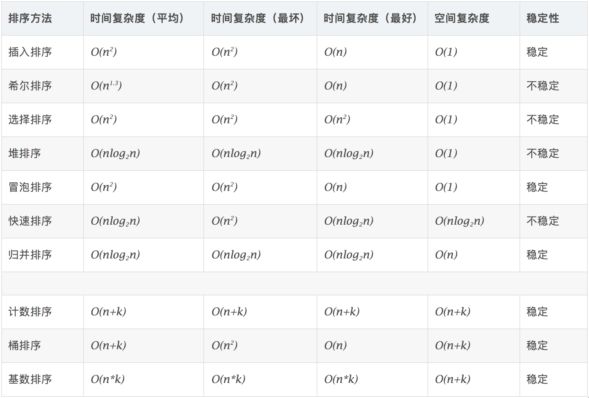

# 排序算法


## 分类：


  

  


## 一、交换排序类

### 1.快速排序——基于分治思想

#### 思路：

1. 确认分界点，q[l]、q[r]、q[(l+r)/2]、随机
2. 划分区间
3. 递归处理左右两段

​       快速排序的基本思想：通过一趟排序将待排记录分隔成独立的两部分，其中一部分记录的关键字均比另一部分的关键字小，则可分别对这两部分记录继续进行排序，以达到整个序列有序。

#### 动图演示


#### 模板

```c++
void quick_sort(int q[], int l, int r)
{
    if (l >= r) return;

    int i = l - 1, j = r + 1, x = q[l + r >> 1];	//建议使用q[l+r>>1]做分界点，
    while (i < j)									//防止边界问题。
    {
        do i ++ ; while (q[i] < x);
        do j -- ; while (q[j] > x);
        if (i < j) swap(q[i], q[j]);
    }
    quick_sort(q, l, j), quick_sort(q, j + 1, r);
}
```

#### 例题：ACWing 785

给定你一个长度为 n 的整数数列。

请你使用快速排序对这个数列按照从小到大进行排序。

并将排好序的数列按顺序输出。

##### 输入格式

输入共两行，第一行包含整数 n。

第二行包含 n 个整数（所有整数均在 1∼10^9^ 范围内），表示整个数列。

##### 输出格式

输出共一行，包含 n 个整数，表示排好序的数列。

##### 数据范围

1≤n≤100000

##### 输入样例：

```
5
3 1 2 4 5
```

##### 输出样例：

```
1 2 3 4 5
```

##### 题解：

```c++
#include<iostream>
#include<algorithm>

using namespace std;

const int N = 1e5 + 10 ;
int nums[N];

void qiuckSort(int nums[] , int l , int r){
    if(l>=r)	return;
    
    int i = l-1 , j = r+1 ;
    int x = nums[(l+r)/2];
    while(i<j){
        do	i++ ;	while(nums[i]<x) ;
        do	j-- ;	while(nums[j]>x) ;
        if(i<j)	swap(nums[i],nums[j]);
    }
    qiuckSort(nums,l,j),qiuckSort(nums,j+1,r);
}

int main(){
    int n;
    cin>>n;
    for(int i=0 ; i<n ; i++){
        cin>>nums[i];
    }
    
    qiuckSort(nums,0,n-1);
    
    for(int i=0 ; i<n ; i++){
        cout<<nums[i]<<' ';
    }
    
    return 0;
}
```


#### 例题：ACWing 786 第K个数

给定一个长度为 n 的整数数列，以及一个整数 k，请用快速选择算法求出数列从小到大排序后的第 k 个数。

##### 输入格式

第一行包含两个整数 nn 和 kk。

第二行包含 n 个整数（所有整数均在 1∼10^9^ 范围内），表示整数数列。

##### 输出格式

输出一个整数，表示数列的第 k 小数。

##### 数据范围

1≤n≤100000
1≤k≤n

##### 输入样例：

```
5 3
2 4 1 5 3
```

##### 输出样例：

```
3
```

##### 题解：

```c++
#include<iostream>
#include<algorithm>

using namespace std;

const int N = 1e5 + 10 ;
int nums[N];

void qiuckSort(int nums[] , int l , int r){
    if(l>=r)	return;
    
    int i = l-1 , j = r+1 ;
    int x = nums[(l+r)/2];
    while(i<j){
        do	i++ ;	while(nums[i]<x) ;
        do	j-- ;	while(nums[j]>x) ;
        if(i<j)	swap(nums[i],nums[j]);
    }
    qiuckSort(nums,l,j),qiuckSort(nums,j+1,r);
}

int main(){
    int n;
    int k;
    cin>>n,cin>>k;
    for(int i=0 ; i<n ; i++){
        cin>>nums[i];
    }
    
    qiuckSort(nums,0,n-1);
    
    cout<<nums[k-1];
    
    return 0;
}
```


### 2.冒泡排序

冒泡排序是一种简单的排序算法。它重复地走访过要排序的数列，一次比较两个元素，如果它们的顺序错误就把它们交换过来。走访数列的工作是重复地进行直到没有再需要交换，也就是说该数列已经排序完成。这个算法的名字由来是因为越小的元素会经由交换慢慢“浮”到数列的顶端。 

#### 算法描述

- 比较相邻的元素。如果第一个比第二个大，就交换它们两个；
- 对每一对相邻元素作同样的工作，从开始第一对到结尾的最后一对，这样在最后的元素应该会是最大的数；
- 针对所有的元素重复以上的步骤，除了最后一个；
- 重复步骤1~3，直到排序完成。

#### 动图演示


#### 模板

```c++
/*
（无序区，有序区）。从无序区通过交换找出最大元素放到有序区前端。
选择排序思路：
1. 比较相邻的元素。如果第一个比第二个大，就交换他们两个。
2. 对每一对相邻元素作同样的工作，从开始第一对到结尾的最后一对。这步做完后，最后的元素会是最大的数。
3. 针对所有的元素重复以上的步骤，除了最后一个。
4. 持续每次对越来越少的元素重复上面的步骤，直到没有任何一对数字需要比较。
*/

// 冒泡排序
void BubbleSort(vector<int>& v) {
	int len = v.size();
	for (int i = 0; i < len - 1; ++i)
		for (int j = 0; j < len - 1 - i; ++j)
			if (v[j] > v[j + 1]) 
				swap(v[j], v[j + 1]);
}

// 模板实现冒泡排序
template<typename T> //整數或浮點數皆可使用,若要使用物件(class)時必須設定大於(>)的運算子功能
void bubble_sort(T arr[], int len) {
	for (int i = 0; i < len - 1; i++)
		for (int j = 0; j < len - 1 - i; j++)
			if (arr[j] > arr[j + 1])
				swap(arr[j], arr[j + 1]);
}

// 冒泡排序（改进版）
void BubbleSort_orderly(vector<int>& v) {
	int len = v.size();
	bool orderly = false;
	for (int i = 0; i < len - 1 && !orderly; ++i) {
		orderly = true;
		for (int j = 0; j < len - 1 - i; ++j) {
			if (v[j] > v[j + 1]) {  // 从小到大
				orderly = false;	// 发生交换则仍非有序
				swap(v[j], v[j + 1]);
			}
		}
	}
}
```


## 二、归并排序——基于分治思想

#### **思路：**

1. **确认分界点，mid=(l+r)/2**,把长度为n的输入序列分成两个长度为n/2的子序列；
2. 对这两个子序列分别采用归并排序；(**递归排序)**
3. 归并——将两个有序序列**合并**成一个

####  动图演示


#### **模板：**

```c++
void merge_sort(int q[], int l, int r)
{
    if (l >= r) return;

    int mid = l + r >> 1;
    merge_sort(q, l, mid);
    merge_sort(q, mid + 1, r);

    int k = 0, i = l, j = mid + 1;
    while (i <= mid && j <= r)
        if (q[i] <= q[j]) tmp[k ++ ] = q[i ++ ];
        else tmp[k ++ ] = q[j ++ ];

    while (i <= mid) tmp[k ++ ] = q[i ++ ];
    while (j <= r) tmp[k ++ ] = q[j ++ ];

    for (i = l, j = 0; i <= r; i ++, j ++ ) q[i] = tmp[j];
}
```


#### 例题：ACWing 787 归并排序

给定你一个长度为 n 的整数数列。

请你使用归并排序对这个数列按照从小到大进行排序。

并将排好序的数列按顺序输出。

##### 输入格式

输入共两行，第一行包含整数 n。

第二行包含 n 个整数（所有整数均在 1∼10^9^范围内），表示整个数列。

##### 输出格式

输出共一行，包含 n 个整数，表示排好序的数列。

##### 数据范围

1≤n≤100000

##### 输入样例：

```
5
3 1 2 4 5
```

##### 输出样例：

```
1 2 3 4 5
```

##### 题解：

```c++
#include<iostream>
#include<algorithm>

using namespace std;

const int N = 1e5+10;
int nums[N],temp[N];

void mergeSort(int nums[] , int l , int r){
    if(l>=r)	return;
    int mid = (l+r)/2;
    mergeSort(nums,l,mid);
    mergeSort(nums,mid+1,r);
    
    int i = l , j = mid+1;
    int k = 0;
    while(i<=mid && j<=r){
        if(nums[i] < nums[j])	temp[k++] = nums[i++];
        else	temp[k++] = nums[j++];
    }
    while(i<=mid)	temp[k++] = nums[i++];
    while(j<=r)		temp[k++] = nums[j++];
    
    for(int i=l , j=0 ; i<=r ; i++ , j++){
        nums[i] = temp[j];
    }
    return;
}

int main(){
    int n;
    cin>>n;
    for(int i=0 ; i<n ; i++){
        cin>>nums[i];
    }
    
    mergeSort(nums,0,n-1);
    
    for(int i=0 ; i<n ; i++){
        cout<<nums[i]<<' ';
    }
    
    return 0;
}
```


#### 例题：AcWing 788 逆序对的数量

给定一个长度为 n 的整数数列，请你计算数列中的逆序对的数量。

逆序对的定义如下：对于数列的第 i 个和第 j 个元素，如果满足 i<j且 a[i]>a[j]，则其为一个逆序对；否则不是。

##### 输入格式

第一行包含整数 nn，表示数列的长度。

第二行包含 nn 个整数，表示整个数列。

##### 输出格式

输出一个整数，表示逆序对的个数。

##### 数据范围

1≤n≤100000

##### 输入样例：

```
6
2 3 4 5 6 1
```

##### 输出样例：

```
5
```

##### 题解：

```c++
#include<iostream>
#include<algorithm>

using namespace std;

const int N = 1e5+10;
int nums[N],temp[N];

int mergeSort(int nums[] , int l , int r){
    if(l>=r)	return 0;
    long long ret = 0;
    int mid = (l+r)/2;
    ret += mergeSort(nums,l,mid);
    ret += mergeSort(nums,mid+1,r);
    
    int i = l , j = mid+1;
    int k = 0;
    while(i<=mid && j<=r){
        if(nums[i] <= nums[j]){
            temp[k++] = nums[i++];
        }else{
            temp[k++] = nums[j++];
            ret += mid - i + 1; 
        }
    }
    
    while(i<=mid){
        temp[k++] = nums[i++];
        
    }
    while(j<=r)	temp[k++] = nums[j++];
    
    for(int i = l , j = 0 ; i<=r ; i++ , j++){
        nums[i] = temp[j];
    }
    return ret;
}

int main(){
    int n;
    cin>>n;
    for(int i=0 ; i<n ; i++){
        cin>>nums[i];
    }
    
    int ret = mergeSort(nums,0,n-1);
    
   
    
    cout<<ret<<endl;
    
    return 0;
    
}
```


## 三、选择排序类

### 1.堆排序

​		堆排序（Heapsort）是指利用堆这种数据结构所设计的一种排序算法。堆积是一个近似完全二叉树的结构，并同时满足堆积的性质：即子结点的键值或索引总是小于（或者大于）它的父节点。

####  算法描述

- 将初始待排序关键字序列(R1,R2….Rn)构建成大顶堆，此堆为初始的无序区；
- 将堆顶元素R[1]与最后一个元素R[n]交换，此时得到新的无序区(R1,R2,……Rn-1)和新的有序区(Rn),且满足R[1,2…n-1]<=R[n]；
- 由于交换后新的堆顶R[1]可能违反堆的性质，因此需要对当前无序区(R1,R2,……Rn-1)调整为新堆，然后再次将R[1]与无序区最后一个元素交换，得到新的无序区(R1,R2….Rn-2)和新的有序区(Rn-1,Rn)。不断重复此过程直到有序区的元素个数为n-1，则整个排序过程完成。

####  动图演示


#### 操作有两种：

1. down(x)：向下调整，与三个数中的最小值交换位置
2. up(x)：向上调整，若小于父节点，交换位置

- x节点与子节点关系：左子节点——2x

  ​									右子节点——2x+1


#### **模板：**

```c++
// h[N]存储堆中的值, h[1]是堆顶，x的左儿子是2x, 右儿子是2x + 1
// ph[k]存储第k个插入的点在堆中的位置
// hp[k]存储堆中下标是k的点是第几个插入的
int h[N], ph[N], hp[N], size;

// 交换两个点，及其映射关系
void heap_swap(int a, int b)
{
    swap(ph[hp[a]],ph[hp[b]]);
    swap(hp[a], hp[b]);
    swap(h[a], h[b]);
}

void down(int u)
{
    int t = u;
    if (u * 2 <= size && h[u * 2] < h[t]) t = u * 2;
    if (u * 2 + 1 <= size && h[u * 2 + 1] < h[t]) t = u * 2 + 1;
    if (u != t)
    {
        heap_swap(u, t);
        down(t);
    }
}

void up(int u)
{
    while (u / 2 && h[u] < h[u / 2])
    {
        heap_swap(u, u / 2);
        u >>= 1;
    }
}

// O(n)建堆
for (int i = n / 2; i; i -- ) down(i);
```

#### 例题： ACWing 838 堆排序 

输入一个长度为 n 的整数数列，从小到大输出前 m 小的数。

##### 输入格式

第一行包含整数 n 和 m。

第二行包含 n 个整数，表示整数数列。

##### 输出格式

共一行，包含 m 个整数，表示整数数列中前 m 小的数。

##### 数据范围

1≤m≤n≤10^5^
1≤数列中元素≤10^9^

##### 输入样例：

```
5 3
4 5 1 3 2
```

##### 输出样例：

```
1 2 3
```

##### 题解：

```c++
#include<iostream>
#include<algorithm>

using namespace std;

const int N = 1e5+10;
int h[N],cnt;

void down(int u){
    int min = u;
    if(2*u<=cnt && h[2*u]<h[min])	min = 2*u;
    if(2*u+1<=cnt && h[2*u+1]<h[min])	min = 2*u+1;
    if(u != min){
        swap(h[u] , h[min]);
        down(min);
    }
}

int main(){
    int n,m;
    cin>>n>>m;
    for(int i=1 ; i<=n ; i++){
        cin>>h[i];
    }
    cnt = n;
    for(int i=n/2 ; i ; i--)	down(i);
    
    for(int i=0 ; i<m ; i++){
        cout<<h[1]<<' ';
        h[1]=h[cnt--];
        down(1);
    }
    return 0;
}
```


#### 例题：AcWing 839 模拟堆

维护一个集合，初始时集合为空，支持如下几种操作：

1. `I x`，插入一个数x；
2. `PM`，输出当前集合中的最小值；
3. `DM`，删除当前集合中的最小值（数据保证此时的最小值唯一）；
4. `D k`，删除第 k 个插入的数；
5. `C k x`，修改第 k 个插入的数，将其变为 x；

现在要进行 N 次操作，对于所有第 2 个操作，输出当前集合的最小值。

##### 输入格式

第一行包含整数 N。

接下来 N 行，每行包含一个操作指令，操作指令为 `I x`，`PM`，`DM`，`D k` 或 `C k x` 中的一种。

##### 输出格式

对于每个输出指令 `PM`，输出一个结果，表示当前集合中的最小值。

每个结果占一行。

##### 数据范围

1≤N≤10^5^
−10^9^≤x≤10^9^
数据保证合法。

##### 输入样例：

```
8
I -10
PM
I -10
D 1
C 2 8
I 6
PM
DM
```

##### 输出样例：

```
-10
6
```

##### 题解：

```c++
#include<iostream>
#include<algorithm>
#include<string.h>

using namespace std;

const int N = 1e5+10;
int h[N],hp[N],ph[N],cnt;

void heap_swap(int a,int b){
    swap(ph[hp[a]],ph[hp[b]]);
    swap(hp[a],hp[b]);
    swap(h[a],h[b]);
}

void down(int u){
    int min = u;
    if(2*u<=cnt && h[2*u]<h[min])	min = 2*u;
    if(2*u+1<=cnt && h[2*u+1]<h[min])	min = 2*u+1;
    if(u != min){
        heap_swap(min,u);
        down(min);
    }
}

void up(int u){
    while(u/2 && h[u]<h[u/2]){
        heap_swap(u,u/2)
        u /= 2;
    }
}

int main(){
    int n, m = 0;
    cin>>n;
    cnt = 0 ;
    while(n--){
        char op[5];
        int k,x;
        scanf("%s",op);
        if(!strcmp(op,"I")){
            cnt++;
            m++;
            scanf("%d", &x);
            ph[m] = cnt , hp[cnt] = m;
            h[cnt] = x;
            up(cnt);
        }else if(!strcmp(op,"PM")){
            printf("%d\n",h[1]);
        }else if(!strcmp(op,"DM")){
            heap_swap(1,cnt);
            cnt--;
            down(1);
        }else if(!strcmp(op,"D")){
        
            scanf("%d", &k);
            k = ph[k];
            heap_swap(k,cnt);
            cnt--;
            down(k);
            up(k);
        }else{
         
            scanf("%d%d", &k, &x);
            k = ph[k];
            h[k] = x;
            down(k);
            up(k);
        }
    }
    
    return 0;
}
```


```
#include <iostream>
#include <algorithm>
#include <string.h>

using namespace std;

const int N = 100010;

int h[N], ph[N], hp[N], cnt;

void heap_swap(int a, int b)
{
    swap(ph[hp[a]],ph[hp[b]]);
    swap(hp[a], hp[b]);
    swap(h[a], h[b]);
}

void down(int u)
{
    int t = u;
    if (u * 2 <= cnt && h[u * 2] < h[t]) t = u * 2;
    if (u * 2 + 1 <= cnt && h[u * 2 + 1] < h[t]) t = u * 2 + 1;
    if (u != t)
    {
        heap_swap(u, t);
        down(t);
    }
}

void up(int u)
{
    while (u / 2 && h[u] < h[u / 2])
    {
        heap_swap(u, u / 2);
        u >>= 1;
    }
}

int main()
{
    int n, m = 0;
    scanf("%d", &n);
    while (n -- )
    {
        char op[5];
        int k, x;
        scanf("%s", op);
        if (!strcmp(op, "I"))
        {
            scanf("%d", &x);
            cnt ++ ;
            m ++ ;
            ph[m] = cnt, hp[cnt] = m;
            h[cnt] = x;
            up(cnt);
        }
        else if (!strcmp(op, "PM")) printf("%d\n", h[1]);
        else if (!strcmp(op, "DM"))
        {
            heap_swap(1, cnt);
            cnt -- ;
            down(1);
        }
        else if (!strcmp(op, "D"))
        {
            scanf("%d", &k);
            k = ph[k];
            heap_swap(k, cnt);
            cnt -- ;
            up(k);
            down(k);
        }
        else
        {
            scanf("%d%d", &k, &x);
            k = ph[k];
            h[k] = x;
            up(k);
            down(k);
        }
    }

    return 0;
}
```


### 2.简单选择排序

选择排序(Selection-sort)是一种简单直观的排序算法。它的工作原理：首先在未排序序列中找到最小（大）元素，存放到排序序列的起始位置，然后，再从剩余未排序元素中继续寻找最小（大）元素，然后放到已排序序列的末尾。以此类推，直到所有元素均排序完毕。 

####  算法描述

n个记录的直接选择排序可经过n-1趟直接选择排序得到有序结果。具体算法描述如下：

- 初始状态：无序区为R[1..n]，有序区为空；
- 第i趟排序(i=1,2,3…n-1)开始时，当前有序区和无序区分别为R[1..i-1]和R(i..n）。该趟排序从当前无序区中-选出关键字最小的记录 R[k]，将它与无序区的第1个记录R交换，使R[1..i]和R[i+1..n)分别变为记录个数增加1个的新有序区和记录个数减少1个的新无序区；
- n-1趟结束，数组有序化了。

####  动图演示

　　

#### 模板

```c++
/*
（有序区，无序区）。在无序区里找一个最小的元素跟在有序区的后面。对数组：比较得多，换得少。
选择排序思路：
1. 在未排序序列中找到最小（大）元素，存放到排序序列的起始位置
2. 从剩余未排序元素中继续寻找最小（大）元素，然后放到已排序序列的末尾
3. 以此类推，直到所有元素均排序完毕
*/

// 选择排序
void SelectionSort(vector<int>& v) {
	int min, len = v.size();
	for (int i = 0; i < len - 1; ++i) {
		min = i;
		for (int j = i + 1; j < len; ++j) {
			if (v[j] < v[min]) {    // 标记最小的
				min = j;
			}
		}
		if (i != min)  // 交换到前面
			swap(v[i], v[min]);
	}
}

// 模板实现
template<typename T> 
void Selection_Sort(std::vector<T>& arr) {
	int len = arr.size();
	for (int i = 0; i < len - 1; i++) {
		int min = i;
		for (int j = i + 1; j < len; j++)
			if (arr[j] < arr[min])
				min = j;
		if(i != min)
			std::swap(arr[i], arr[min]);
	}
}
```


## 四、插入排序类

### 1.希尔排序

1959年Shell发明，第一个突破O(n2)的排序算法，是简单插入排序的改进版。它与插入排序的不同之处在于，它会优先比较距离较远的元素。希尔排序又叫缩小增量排序。

####  算法描述

先将整个待排序的记录序列分割成为若干子序列分别进行直接插入排序，具体算法描述：

- 选择一个增量序列t1，t2，…，tk，其中ti>tj，tk=1；
- 按增量序列个数k，对序列进行k 趟排序；
- 每趟排序，根据对应的增量ti，将待排序列分割成若干长度为m 的子序列，分别对各子表进行直接插入排序。仅增量因子为1 时，整个序列作为一个表来处理，表长度即为整个序列的长度。

####  动图演示


```c++
	// 希尔排序：每一轮按照事先决定的间隔进行插入排序，间隔会依次缩小，最后一次一定要是1。
template<typename T>
void shell_sort(T array[], int length) {
    int h = 1;
    while (h < length / 3) {
        h = 3 * h + 1;
    }
    while (h >= 1) {
        for (int i = h; i < length; i++) {
            for (int j = i; j >= h && array[j] < array[j - h]; j -= h) {
                std::swap(array[j], array[j - h]);
            }
        }
        h = h / 3;
    }
}
```


### 2.直接插入排序

​		插入排序（Insertion-Sort）的算法描述是一种简单直观的排序算法。它的工作原理是通过构建有序序列，对于未排序数据，在已排序序列中从后向前扫描，找到相应位置并插入。

####  算法描述

一般来说，插入排序都采用in-place在数组上实现。具体算法描述如下：

- 从第一个元素开始，该元素可以认为已经被排序；
- 取出下一个元素，在已经排序的元素序列中从后向前扫描；
- 如果该元素（已排序）大于新元素，将该元素移到下一位置；
- 重复步骤3，直到找到已排序的元素小于或者等于新元素的位置；
- 将新元素插入到该位置后；
- 重复步骤2~5。

####  动图演示


```c++
/*
（有序区，无序区）。把无序区的第一个元素插入到有序区的合适的位置。对数组：比较得少，换得多。
插入排序思路：
1. 从第一个元素开始，该元素可以认为已经被排序
2. 取出下一个元素，在已经排序的元素序列中从后向前扫描
3. 如果该元素（已排序）大于新元素，将该元素移到下一位置
4. 重复步骤3，直到找到已排序的元素小于或者等于新元素的位置
5. 将新元素插入到该位置后
6. 重复步骤2~5
*/

// 插入排序
void InsertSort(vector<int>& v)
{
    int len = v.size();
	for (int i = 1; i < len; ++i) {
		int temp = v[i];
        for(int j = i - 1; j >= 0; --j)
        {
            if(v[j] > temp)
            {
                v[j + 1] = v[j];
                v[j] = temp;
            }
            else
                break;
        }
	}
}
```


## 五、线性时间比较类排序

### 1.计数排序

计数排序不是基于比较的排序算法，其核心在于将输入的数据值转化为键存储在额外开辟的数组空间中。 作为一种线性时间复杂度的排序，计数排序要求输入的数据必须是有确定范围的整数。

####  算法描述

- 找出待排序的数组中最大和最小的元素；
- 统计数组中每个值为i的元素出现的次数，存入数组C的第i项；
- 对所有的计数累加（从C中的第一个元素开始，每一项和前一项相加）；
- 反向填充目标数组：将每个元素i放在新数组的第C(i)项，每放一个元素就将C(i)减去1。

####  动图演示


####  算法分析

计数排序是一个稳定的排序算法。当输入的元素是 n 个 0到 k 之间的整数时，时间复杂度是O(n+k)，空间复杂度也是O(n+k)，其排序速度快于任何比较排序算法。当k不是很大并且序列比较集中时，计数排序是一个很有效的排序算法。

```c++
/*****************
计数排序：统计小于等于该元素值的元素的个数i，于是该元素就放在目标数组的索引i位（i≥0）。
计数排序基于一个假设，待排序数列的所有数均为整数，且出现在（0，k）的区间之内。
如果 k（待排数组的最大值） 过大则会引起较大的空间复杂度，一般是用来排序 0 到 100 之间的数字的最好的算法，但是它不适合按字母顺序排序人名。
计数排序不是比较排序，排序的速度快于任何比较排序算法。
时间复杂度为 O（n+k），空间复杂度为 O（n+k）
算法的步骤如下：
1. 找出待排序的数组中最大和最小的元素
2. 统计数组中每个值为 i 的元素出现的次数，存入数组 C 的第 i 项
3. 对所有的计数累加（从 C 中的第一个元素开始，每一项和前一项相加）
4. 反向填充目标数组：将每个元素 i 放在新数组的第 C[i] 项，每放一个元素就将 C[i] 减去 1
*****************/


#include <iostream>
#include <vector>
#include <algorithm>

using namespace std;

// 计数排序
void CountSort(vector<int>& vecRaw, vector<int>& vecObj)
{
	// 确保待排序容器非空
	if (vecRaw.size() == 0)
		return;

	// 使用 vecRaw 的最大值 + 1 作为计数容器 countVec 的大小
	int vecCountLength = (*max_element(begin(vecRaw), end(vecRaw))) + 1;
	vector<int> vecCount(vecCountLength, 0);

	// 统计每个键值出现的次数
	for (int i = 0; i < vecRaw.size(); i++)
		vecCount[vecRaw[i]]++;
	
	// 后面的键值出现的位置为前面所有键值出现的次数之和
	for (int i = 1; i < vecCountLength; i++)
		vecCount[i] += vecCount[i - 1];

	// 将键值放到目标位置
	for (int i = vecRaw.size(); i > 0; i--)	// 此处逆序是为了保持相同键值的稳定性
		vecObj[--vecCount[vecRaw[i - 1]]] = vecRaw[i - 1];
}

int main()
{
	vector<int> vecRaw = { 0,5,7,9,6,3,4,5,2,8,6,9,2,1 };
	vector<int> vecObj(vecRaw.size(), 0);

	CountSort(vecRaw, vecObj);

	for (int i = 0; i < vecObj.size(); ++i)
		cout << vecObj[i] << "  ";
	cout << endl;

	return 0;
}
```


### 2.桶排序

桶排序是计数排序的升级版。它利用了函数的映射关系，高效与否的关键就在于这个映射函数的确定。桶排序 (Bucket sort)的工作的原理：假设输入数据服从均匀分布，将数据分到有限数量的桶里，每个桶再分别排序（有可能再使用别的排序算法或是以递归方式继续使用桶排序进行排）。

####  算法描述

- 设置一个定量的数组当作空桶；
- 遍历输入数据，并且把数据一个一个放到对应的桶里去；
- 对每个不是空的桶进行排序；
- 从不是空的桶里把排好序的数据拼接起来。 

####  图片演示


```c++
#include<iterator>
#include<iostream>
#include<vector>
using std::vector;

/*****************
桶排序：将值为i的元素放入i号桶，最后依次把桶里的元素倒出来。
桶排序序思路：
1. 设置一个定量的数组当作空桶子。
2. 寻访序列，并且把项目一个一个放到对应的桶子去。
3. 对每个不是空的桶子进行排序。
4. 从不是空的桶子里把项目再放回原来的序列中。
假设数据分布在[0，100)之间，每个桶内部用链表表示，在数据入桶的同时插入排序，然后把各个桶中的数据合并。
*****************/


const int BUCKET_NUM = 10;

struct ListNode{
	explicit ListNode(int i=0):mData(i),mNext(NULL){}
	ListNode* mNext;
	int mData;
};

ListNode* insert(ListNode* head,int val){
	ListNode dummyNode;
	ListNode *newNode = new ListNode(val);
	ListNode *pre,*curr;
	dummyNode.mNext = head;
	pre = &dummyNode;
	curr = head;
	while(NULL!=curr && curr->mData<=val){
		pre = curr;
		curr = curr->mNext;
	}
	newNode->mNext = curr;
	pre->mNext = newNode;
	return dummyNode.mNext;
}


ListNode* Merge(ListNode *head1,ListNode *head2){
	ListNode dummyNode;
	ListNode *dummy = &dummyNode;
	while(NULL!=head1 && NULL!=head2){
		if(head1->mData <= head2->mData){
			dummy->mNext = head1;
			head1 = head1->mNext;
		}else{
			dummy->mNext = head2;
			head2 = head2->mNext;
		}
		dummy = dummy->mNext;
	}
	if(NULL!=head1) dummy->mNext = head1;
	if(NULL!=head2) dummy->mNext = head2;
	
	return dummyNode.mNext;
}

void BucketSort(int n,int arr[]){
	vector<ListNode*> buckets(BUCKET_NUM,(ListNode*)(0));
	for(int i=0;i<n;++i){
		int index = arr[i]/BUCKET_NUM;
		ListNode *head = buckets.at(index);
		buckets.at(index) = insert(head,arr[i]);
	}
	ListNode *head = buckets.at(0);
	for(int i=1;i<BUCKET_NUM;++i){
		head = Merge(head,buckets.at(i));
	}
	for(int i=0;i<n;++i){
		arr[i] = head->mData;
		head = head->mNext;
	}
}
```


### 3.基数排序

基数排序是按照低位先排序，然后收集；再按照高位排序，然后再收集；依次类推，直到最高位。有时候有些属性是有优先级顺序的，先按低优先级排序，再按高优先级排序。最后的次序就是高优先级高的在前，高优先级相同的低优先级高的在前。

####  算法描述

- 取得数组中的最大数，并取得位数；
- arr为原始数组，从最低位开始取每个位组成radix数组；
- 对radix进行计数排序（利用计数排序适用于小范围数的特点）；

####  动图演示


```c++
// 基数排序：一种多关键字的排序算法，可用桶排序实现。

int maxbit(int data[], int n) //辅助函数，求数据的最大位数
{
    int maxData = data[0];		///< 最大数
    /// 先求出最大数，再求其位数，这样有原先依次每个数判断其位数，稍微优化点。
    for (int i = 1; i < n; ++i)
    {
        if (maxData < data[i])
            maxData = data[i];
    }
    int d = 1;
    int p = 10;
    while (maxData >= p)
    {
        //p *= 10; // Maybe overflow
        maxData /= 10;
        ++d;
    }
    return d;
/*    int d = 1; //保存最大的位数
    int p = 10;
    for(int i = 0; i < n; ++i)
    {
        while(data[i] >= p)
        {
            p *= 10;
            ++d;
        }
    }
    return d;*/
}
void radixsort(int data[], int n) //基数排序
{
    int d = maxbit(data, n);
    int *tmp = new int[n];
    int *count = new int[10]; //计数器
    int i, j, k;
    int radix = 1;
    for(i = 1; i <= d; i++) //进行d次排序
    {
        for(j = 0; j < 10; j++)
            count[j] = 0; //每次分配前清空计数器
        for(j = 0; j < n; j++)
        {
            k = (data[j] / radix) % 10; //统计每个桶中的记录数
            count[k]++;
        }
        for(j = 1; j < 10; j++)
            count[j] = count[j - 1] + count[j]; //将tmp中的位置依次分配给每个桶
        for(j = n - 1; j >= 0; j--) //将所有桶中记录依次收集到tmp中
        {
            k = (data[j] / radix) % 10;
            tmp[count[k] - 1] = data[j];
            count[k]--;
        }
        for(j = 0; j < n; j++) //将临时数组的内容复制到data中
            data[j] = tmp[j];
        radix = radix * 10;
    }
    delete []tmp;
    delete []count;
}
```

