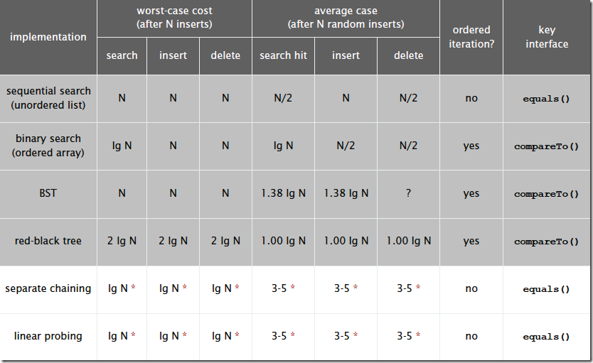
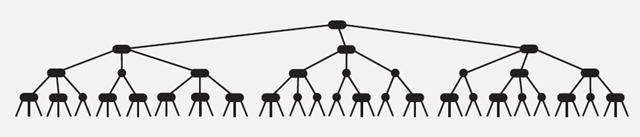
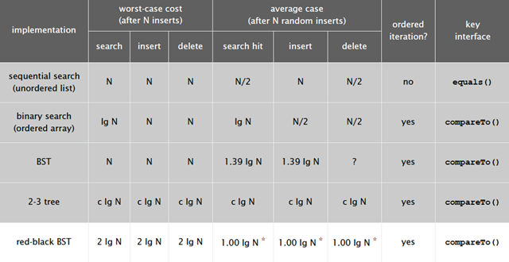
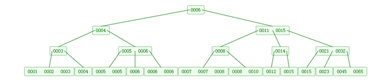

## 查找算法




| 查找算法                                                     | 平均时间复杂度   | 空间复杂度 | 查找条件   |
| ------------------------------------------------------------ | ---------------- | ---------- | ---------- |
| [顺序查找](https://github.com/newYangrs/interview/blob/master/Algorithm/SequentialSearch.h) | O(n)             | O(1)       | 无序或有序 |
| [二分查找（折半查找）](https://github.com/newYangrs/interview/blob/master/Algorithm/BinarySearch.h) | O(log2n)         | O(1)       | 有序       |
| [插值查找](https://github.com/newYangrs/interview/blob/master/Algorithm/InsertionSearch.h) | O(log2(log2n))   | O(1)       | 有序       |
| [斐波那契查找](https://github.com/newYangrs/interview/blob/master/Algorithm/FibonacciSearch.cpp) | O(log2n)         | O(1)       | 有序       |
| [哈希查找](https://github.com/newYangrs/interview/blob/master/DataStructure/HashTable.cpp) | O(1)             | O(n)       | 无序或有序 |
| [二叉查找树（二叉搜索树查找）](https://github.com/newYangrs/interview/blob/master/Algorithm/BSTSearch.h) | O(log2n)         |            |            |
| [红黑树](https://github.com/newYangrs/interview/blob/master/DataStructure/RedBlackTree.cpp) | O(log2n)         |            |            |
| 2-3树                                                        | O(log2n - log3n) |            |            |
| B树/B+树                                                     | O(log2n)         |            |            |

​		

​		查找是在大量的信息中寻找一个特定的信息元素，在计算机应用中，查找是常用的基本运算，例如编译程序中符号表的查找。本文简单概括性的介绍了常见的七种查找[算法](http://lib.csdn.net/base/datastructure)，说是七种，其实二分查找、插值查找以及斐波那契查找都可以归为一类——插值查找。插值查找和斐波那契查找是在二分查找的基础上的优化查找算法。树表查找和哈希查找会在后续的博文中进行详细介绍。

　　**查找定义：**根据给定的某个值，在查找表中确定一个其关键字等于给定值的数据元素（或记录）。

　　 **查找算法分类：**

　　1）静态查找和动态查找；

　　　　注：静态或者动态都是针对查找表而言的。动态表指查找表中有删除和插入操作的表。

　　2）无序查找和有序查找。

　　　　无序查找：被查找数列有序无序均可；

　　　　有序查找：被查找数列必须为有序数列。

　　 **平均查找长度（Average Search Length，ASL）：**需和指定key进行比较的关键字的个数的期望值，称为查找算法在查找成功时的平均查找长度。

　　对于含有n个数据元素的查找表，查找成功的平均查找长度为：ASL = P i*C i的和。
　　P i：查找表中第i个数据元素的概率。
　　C i：找到第i个数据元素时已经比较过的次数。


### 顺序查找

- **顺序查找适合于存储结构为顺序存储或链接存储的线性表**。

#### 基本思想：

​		顺序查找也称为线形查找，属于无序查找算法。从数据结构线形表的一端开始，顺序扫描，依次将扫描到的结点关键字与给定值k相比较，若相等则表示查找成功；若扫描结束仍没有找到关键字等于k的结点，表示查找失败。

#### 复杂度分析：　

​		查找成功时的平均查找长度为：（假设每个数据元素的概率相等） ASL = 1/n(1+2+3+…+n) = (n+1)/2 ;
　　当查找不成功时，需要n+1次比较，时间复杂度为O(n);

　　所以， **顺序查找的时间复杂度为O(n)。**

#### C++实现源码：

```c++
// 顺序查找
int SequentialSearch(vector<int>& v, int k) {
	for (int i = 0; i < v.size(); ++i)
		if (v[i] == k)
			return i;
	return -1;
}

//顺序查找
int SequenceSearch(int a[], int value, int n)
{
    int i;
    for(i=0; i<n; i++)
        if(a[i]==value)
            return i;
    return -1;
}


/* The following is a Sentinel Search Algorithm which only performs 
    just one test in each loop iteration thereby reducing time complexity */

int BetterSequentialSearch(vector<int>& v, int k) {
    int last = v[v.size()-1];
    v[v.size()-1] = k;
    int i = 0;
	while (v[i]!= k)
        	i++;
    v[v.size()-1] = last;
    if(i < v.size()-1 || v[v.size()-1] == k)
        return i;
    return -1;
}
```


###  分块查找

　　**分块查找又称==索引顺序查找*==*，**它是顺序查找的一种改进方法**。

#### 算法思想：

​		将n个数据元素"按块有序"划分为m块（m ≤ n）。每一块中的结点不必有序，但块与块之间必须"按块有序"；即**第1块中任一元素的关键字都必须小于第2块中任一元素的关键字**；而第2块中任一元素又都必须小于第3块中的任一元素，……


#### 算法流程：

　　step1 先选取各块中的最大关键字构成一个索引表；
　　step2 查找分两个部分：先对索引表进行二分查找或顺序查找，以确定待查记录在哪一块中；然后，在已确定的块中用顺序法进行查找。

#### 代码模板：

```c++
#include <bits/stdc++.h>

using namespace std;

struct index{
	int key;
	int start;

} newIndex[3];

int search(int key, int* a){
	int i = 0;
    int startValue = newIndex[i].start;
    
	while (i<3 && key>newIndex[i].key)	i++;
    
	if (i >= 3)	return -1;
    
	while (startValue <= startValue + 5 && a[startValue] != key)
        startValue++;
    
	if (startValue > startValue + 5)	return -1;
    
	return startValue;
}

int cmp(const void* a, const void* b){
	return (*(struct index*)a).key > (*(struct index*)b).key ? 1 : -1;
}

int main(void){
	int a[] = { 33,42,44,38,24,48, 22,12,13,8,9,20, 60,58,74,49,86,53 }
    int j = -1, key;
	for (int i = 0; i < 3; i++){
		newIndex[i].start = j + 1;
		j += 6;
		for (int k = newIndex[i].start; k <= j; k++)
            if (newIndex[i].key < a[k])
                newIndex[i].key = a[k];
	}
	qsort(newIndex, 3, sizeof(newIndex[0]), cmp);
	cin >> key;
	cout << search(key, a);;
}


#include<stdio.h>

//索引表
typedef struct
{
	int key;	//最大关键字
	int start;	//块开始下标
	int end;	//块结束下标
}Node;
typedef struct
{
	Node idx[10];//表项
	int len;	//表长
}IdxTable;

//分块查找
IdxTable table;	//索引表
int BlockingSearch(int key,int a[])
{
	//折半查找
	int  low, high, mid;
	low = 1;
	high = table.len;
	while (low <= high){
		mid = (low + high) / 2;			//找到中间位置
		if (key<=table.idx[mid].key){
			//顺序查找
			if (key <= table.idx[mid - 1].key){
				high = mid - 1;
			}else{
				for (int i = table.idx[mid].start; i <= table.idx[mid].end; i++){
					if (key == a[i]){
						return (i + 1);	//从1开始算起
					}
				}
				return 0;
			}
		}else{
			low = mid + 1;				//如果小于查找的记录则重新定位mid指针
		}
	}
	
	return 0;
}


int main()
{
	int i;
	int a[] = {22,12,13,8,9,20,33,42,44,38,24,48,60,58,74,49,86,53 };
	//索引表
	table.idx[1].key = 22; table.idx[1].start = 0; table.idx[1].end = 5;
	table.idx[2].key = 48; table.idx[2].start = 6; table.idx[2].end = 11;
	table.idx[3].key = 86; table.idx[3].start = 12; table.idx[3].end = 17;
	table.len = 3;
	
	//查找结果
	int key;
	printf("请输入要查找的记录：");
	scanf("%d", &key);
	i = BlockingSearch(key, a);
	printf("查找记录在表中的位置是（从1开始，0为未找到）：%d\n", i);
}
```


### 二分查找

**二分的本质：**找到一个性质，根据check(mid)找到分界点


#### 1.整数二分

**说明：元素必须是有序的，如果是无序的则要先进行排序操作。**

##### **基本思想：**

​		也称为是折半查找，属于有序查找算法。用给定值k先与中间结点的关键字比较，中间结点把线形表分成两个子表，若相等则查找成功；若不相等，再根据k与该中间结点关键字的比较结果确定下一步查找哪个子表，这样递归进行，直到查找到或查找结束发现表中没有这样的结点。

##### **复杂度分析：**

​		最坏情况下，关键词比较次数为log2(n+1)，且**期望时间复杂度为O(log2n)**；

　　注：**折半查找的前提条件是需要有序表顺序存储，对于静态查找表，一次排序后不再变化，折半查找能得到不错的效率。但对于需要频繁执行插入或删除操作的数据集来说，维护有序的排序会带来不小的工作量，那就不建议使用。——《大话[数据结构](http://lib.csdn.net/base/datastructure)》**


##### 模板：

```c++
bool check(int x) {/* ... */} // 检查x是否满足某种性质
//q[mid]>=x
// 区间[l, r]被划分成[l, mid]和[mid + 1, r]时使用：
int bsearch_1(int l, int r)
{
    while (l < r)
    {
        int mid = l + r >> 1;
        if (check(mid)) r = mid;    // check()判断mid是否满足性质
        else l = mid + 1;
    }
    return l;
}
//q[mid]<=x
// 区间[l, r]被划分成[l, mid - 1]和[mid, r]时使用：
int bsearch_2(int l, int r)
{
    while (l < r)
    {
        int mid = l + r + 1 >> 1;	//若不向上取整，当l=r-1时，会陷入[l,r]区间的死循环
        if (check(mid)) l = mid;
        else r = mid - 1;
    }
    return l;
}

//向上取整  r=mid-1
//向下取整  l=mid+1
```


##### 例题：AcWing 789. 数的范围

给定一个按照升序排列的长度为 n 的整数数组，以及 q 个查询。

对于每个查询，返回一个元素 k 的起始位置和终止位置（位置从 0 开始计数）。

如果数组中不存在该元素，则返回 ` -1-1`。

###### 输入格式

第一行包含整数 n 和 q，表示数组长度和询问个数。

第二行包含 n 个整数（均在 1∼10000 范围内），表示完整数组。

接下来 q 行，每行包含一个整数 k，表示一个询问元素。

###### 输出格式

共 q 行，每行包含两个整数，表示所求元素的起始位置和终止位置。

如果数组中不存在该元素，则返回 `-1 -1`。

###### 数据范围

1≤n≤100000
1≤q≤10000
1≤k≤10000

###### 输入样例：

```
6 3
1 2 2 3 3 4
3
4
5
```

###### 输出样例：

```
3 4
5 5
-1 -1
```

###### 题解：

```c++
#include<iostream>
#include<algorithm>

using namespace std;

const int N = 1e5+10;
int nums[N];

int findr(int array[] , int l , int r , int x){
    while(l<r){
        int mid = (l+r+1)/2;
        if(array[mid]<=x)	l=mid;
        else	r=mid-1;
    }
    return l;
}

int findl(int array[] , int l , int r , int x){
    while(l<r){
        int mid = (l+r)/2;
        if(array[mid]>=x)	r=mid;
        else	l=mid+1;
    }
    return l;
}

int main(){
	int n,q;
    cin>>n>>q;
    for(int i=0 ; i<n ; i++){
        cin>>nums[i];
    }
    
    while(q--){
        int k;
        cin>>k;
        
        int left = findl(nums , 0 , n-1 , k);
        if(nums[left] != k){
            cout<<"-1 -1"<<endl;
        }else{
        int right = findr(nums , 0 , n-1 , k);
        
        cout<<left<<' '<<right<<endl;
        }
    }
    
    return 0;
}
```


##### 例题：[剑指 Offer 11. 旋转数组的最小数字](https://leetcode-cn.com/problems/xuan-zhuan-shu-zu-de-zui-xiao-shu-zi-lcof/)

把一个数组最开始的若干个元素搬到数组的末尾，我们称之为数组的旋转。输入一个递增排序的数组的一个旋转，输出旋转数组的最小元素。例如，数组 `[3,4,5,1,2]` 为 `[1,2,3,4,5]` 的一个旋转，该数组的最小值为1。 

###### **示例 1：**

```
输入：[3,4,5,1,2]
输出：1
```

###### **示例 2：**

```
输入：[2,2,2,0,1]
输出：0
```

###### 题解：

```c++
class Solution {
public:
    int minArray(vector<int>& numbers) {
        int low = 0;
        
        int hight = numbers.size()-1;
        
        while(low<hight){
            
            int mid =low + (hight-low)/2;
            
            if(numbers[mid] > numbers[hight]){
                
                low = mid+1;
            }else if(numbers[mid] < numbers[hight]){
                
                hight = mid;
            }else{
                
                hight -= 1;
            }
                
        }
        
        return numbers[hight];
    }
};
```


##### 例题：[剑指 Offer 53 - I. 在排序数组中查找数字 I](https://leetcode-cn.com/problems/zai-pai-xu-shu-zu-zhong-cha-zhao-shu-zi-lcof/)

统计一个数字在排序数组中出现的次数。

###### **示例 1:**

```
输入: nums = [5,7,7,8,8,10], target = 8
输出: 2
```

###### **示例 2:**

```
输入: nums = [5,7,7,8,8,10], target = 6
输出: 0
```

 

###### **限制：**

```
0 <= 数组长度 <= 50000
```

###### 题解：

```c++
class Solution {
public:
    int search(vector<int>& nums, int target) {
        int l = 0 , r = nums.size()-1;
        
        if(l>r) return 0 ;
        
        while(l<r){
            int mid = (l+r+1)/2;
            
            if(nums[mid]<=target){
                l = mid;

            }else{
                r = mid-1;

            }

        }
        if(nums[l] != target) return 0;
        
        int numhigh = l;
        
        l = 0 , r = nums.size()-1;
        
        while(l<r){
            
            int mid = (l+r)/2;
            
            if(nums[mid]>=target){
                r = mid;
                
            }else{
                l = mid+1;

            }
        }
        

        int numlow = l;
        
        int ans = numhigh - numlow + 1;
        
        return ans;


    }
};
```


##### 例题：[剑指 Offer 53 - II. 0～n-1中缺失的数字](https://leetcode-cn.com/problems/que-shi-de-shu-zi-lcof/)

一个长度为n-1的递增排序数组中的所有数字都是唯一的，并且每个数字都在范围0～n-1之内。在范围0～n-1内的n个数字中有且只有一个数字不在该数组中，请找出这个数字。

 

###### **示例 1:**

```
输入: [0,1,3]
输出: 2
```

###### **示例 2:**

```
输入: [0,1,2,3,4,5,6,7,9]
输出: 8
```

 

###### **限制：**

```
1 <= 数组长度 <= 10000
```

###### 题解：

```c++
class Solution {
public:
    int missingNumber(vector<int>& nums) {
        int left = 0, right = nums.size() - 1;

        while (left < right) {
            int mid = (left + right) >> 1; // 位运算提速

            if (nums[mid] == mid) {
                // 说明 [left, mid] 区间没有缺失任何数
                left = mid + 1;
            }
            else {
                // 说明缺失的数在 [left, mid] 区间内
                right = mid;
            }
        }

        if (left == nums.size() - 1 && nums[left] == left) {
            // 缺失的数不在 [nums[0], nums[nums.size() - 1]] 范围内
            ++ left;
        }

        return left;
    }
};


class Solution {
public:
    int missingNumber(vector<int>& nums) {
        
        int l = 0 , r = nums.size()-1;
        
        while(l<=r){
            int mid = (l+r)/2;
            
            if(nums[mid] == mid){
                
                l = mid+1;
                
            }else{
                
                if(mid==0 || nums[mid-1]==(mid-1)){
                    
                    return mid;
                }else{
                    
                    r = mid-1;
                }
            }
            
            if(l == nums.size()){
                
                return l;
            }

        }
        return -1;

    }
};
```


#### 2.浮点数二分

- **与整数二分不同点：**不需要取边界，只需要达到精度即可

- **模板：**

  ```c++
  bool check(double x) {/* ... */} // 检查x是否满足某种性质
  
  double bsearch_3(double l, double r)
  {
      const double eps = 1e-6;   // eps 表示精度，取决于题目对精度的要求
      while (r - l > eps)
      {
          double mid = (l + r) / 2;
          if (check(mid)) r = mid;
          else l = mid;
      }
      return l;
  }
  ```

##### 例题：AcWing 790. 数的三次方根

给定一个浮点数 n，求它的三次方根。

###### 输入格式

共一行，包含一个浮点数 nn。

###### 输出格式

共一行，包含一个浮点数，表示问题的解。

注意，结果保留 66 位小数。

###### 数据范围

−10000≤n≤10000

###### 输入样例：

```
1000.00
```

###### 输出样例：

```
10.000000
```

###### 题解：

```c++
#include<iostream>
#include<algorithm>

using namespace std;

int main(){
    double n;
    cin>>n;
    
    double l=-100 , r=100;
    while(r-l > 1e-8){
        double mid = (l+r)/2;
        if(mid*mid*mid <= n)	l=mid;
        else	r=mid;
    }
    
    printf("%.6lf\n",l);
    
    return 0;
}
```


### 插值查找

#### 思路：

插值查找是在折半查找的基础上进行优化，将mid的值


修改为

![low+\frac{(.Image/gif.gif)*(key-R[low])}{R[high]-R[low]}](https://private.codecogs.com/gif.latex?low&plus;%5Cfrac%7B%28high-low%29*%28key-R%5Blow%5D%29%7D%7BR%5Bhigh%5D-R%5Blow%5D%7D)

  将查找关键字于查找表中的最大最小关键字对比后进行查找。

　　注： **对于表长较大，而关键字分布又比较均匀的查找表来说，插值查找算法的平均性能比折半查找要好的多。反之，数组中如果分布非常不均匀，那么插值查找未必是很合适的选择。**

　　**复杂度分析：查找成功或者失败的时间复杂度均为O(log2(log2n))。**

#### 模板：

```c++
#include <stdio.h>
#define MAXSIZE 100
 
typedef int KeyType;
typedef char InfoType[10];
typedef struct{
	KeyType Key;
	InfoType data;
}NodeType;
typedef NodeType SeqList[MAXSIZE];
 
int Search(SeqList R, int n, KeyType k){
	int low, high, mid;
	low = 1;
	high = n;
	while (low <= high){
		mid = low + (high - low)*(k - R[low].Key) / (R[high].Key - R[low].Key);//插值算法核心
		if (k < R[mid].Key)
			high = mid - 1;
		else if (k > R[mid].Key)
			low = mid + 1;
		else
			return mid;
	}
	return 0;
}
 
int main()
{
	SeqList R;
	int n = 10, i;
	KeyType k;
	printf("输入序列内容(十个不同的数字):");
	for (i = 0; i<10; i++){
		scanf_s("%d", &R[i].Key);
	}
	printf("序列为:");
	for (i = 0; i<n; i++){
		printf("%d,", R[i].Key);
	}
	printf("\n请输入需要查找的关键字为:");
	scanf_s("%d", &k);
	printf("需要搜索的关键字为%d", k);
	if ((i = Search(R, n, k)) != -1){
		printf("\n%d在序列的第%d个位置\n", k, i+1);
	}
}

```


　　


### 裴波那契查找

#### **基本思想：**


　　斐波那契查找与折半查找很相似，他是根据斐波那契序列的特点对有序表进行分割的。他要求开始表中记录的个数为某个斐波那契数小1，及n=F(k)-1;

​		 **mid=low+F(k-1)-1**

　　**1）相等，mid位置的元素即为所求**

　　**2）>，low=mid+1,k -= 2;**

　　说明：low=mid+1说明待查找的元素在[mid+1,high]范围内，k-=2 说明范围[mid+1,high]内的元素个数为n-(F(k-1))= Fk-1-F(k-1)=Fk-F(k-1)-1=F(k-2)-1个，所以可以递归的应用斐波那契查找。

　　**3）<，high=mid-1,k -= 1。**

　　说明：low=mid+1说明待查找的元素在[low,mid-1]范围内，k-=1 说明范围[low,mid-1]内的元素个数为F(k-1)-1个，所以可以递归 的应用斐波那契查找。

　　 **复杂度分析：最坏情况下，时间复杂度为O(log2n)，且其期望复杂度也为O(log2n)。**

#### 模板：

```cpp
// 斐波那契查找.cpp 
#include "stdafx.h"
#include <memory>;
#include  <iostream>;
using namespace std;

const int max_size=20;//斐波那契数组的长度

/*构造一个斐波那契数组*/ 
void Fibonacci(int * F){
    F[0]=0;
    F[1]=1;
    for(int i=2;i<max_size;++i)
        F[i]=F[i-1]+F[i-2];
}

/*定义斐波那契查找法*/  
//a为要查找的数组,n为要查找的数组长度,key为要查找的关键字
int FibonacciSearch(int *a, int n, int key){
  int low=0;
  int high=n-1;
  
  int F[max_size];
  Fibonacci(F);//构造一个斐波那契数组F 

  int k=0;
  while(n>F[k]-1)//计算n位于斐波那契数列的位置
      ++k;

  int  * temp;//将数组a扩展到F[k]-1的长度
  temp=new int [F[k]-1];
  memcpy(temp,a,n*sizeof(int));

  for(int i=n;i<F[k]-1;++i)
     temp[i]=a[n-1];
  
  while(low<=high){
    int mid=low+F[k-1]-1;
    if(key<temp[mid]){
      high=mid-1;
      k-=1;
    }else if(key>temp[mid]){
     low=mid+1;
     k-=2;
    }else{
       if(mid<n)
           return mid; //若相等则说明mid即为查找到的位置
       else
           return n-1; //若mid>=n则说明是扩展的数值,返回n-1
    }
  }  
  delete [] temp;
  return -1;
}

int main()
{
    int a[] = {0,16,24,35,47,59,62,73,88,99};
    int key=100;
    int index=FibonacciSearch(a,sizeof(a)/sizeof(int),key);
    cout<<key<<" is located at:"<<index;
    return 0;
}

```


### 哈希查找


- **hash存储结构有两种：**1.开放寻址法；2.拉链法

- **总的来说，"直接定址"与"解决冲突"是哈希表的两大特点。**

##### 算法思想：

哈希的思路很简单，如果所有的键都是整数，那么就可以使用一个简单的无序数组来实现：将键作为索引，值即为其对应的值，这样就可以快速访问任意键的值。这是对于简单的键的情况，我们将其扩展到可以处理更加复杂的类型的键。

##### 　　**算法流程：**

　　1）用给定的哈希函数构造哈希表；

　　2）根据选择的冲突处理方法解决地址冲突；

　　　　常见的解决冲突的方法：拉链法和线性探测法。

　　3）在哈希表的基础上执行哈希查找。

#### 1.开放寻址法

- **结构：**用2~3倍的数组空间存储hash表

- **操作有三种：**

  1. 添加：依次找坑位
  2. 查找：依次找坑位
  3. 删除：查找到x，用特殊标记存不存在


##### 模板：

```c++
开放寻址法
    int h[N];

    // 如果x在哈希表中，返回x的下标；如果x不在哈希表中，返回x应该插入的位置
    int find(int x)
    {
        int t = (x % N + N) % N;
        while (h[t] != null && h[t] != x)
        {
            t ++ ;
            if (t == N) t = 0;
        }
        return t;
    }
```


##### 例题：AcWing 840. 模拟散列表

维护一个集合，支持如下几种操作：

1. `I x`，插入一个数 xx；
2. `Q x`，询问数 xx 是否在集合中出现过；

现在要进行 N 次操作，对于每个询问操作输出对应的结果。

###### 输入格式

第一行包含整数 N，表示操作数量。

接下来 N 行，每行包含一个操作指令，操作指令为 `I x`，`Q x` 中的一种。

###### 输出格式

对于每个询问指令 `Q x`，输出一个询问结果，如果 x 在集合中出现过，则输出 `Yes`，否则输出 `No`。

每个结果占一行。

###### 数据范围

1≤N≤10^5^
−10^9^≤x≤10^9^

###### 输入样例：

```
5
I 1
I 2
I 3
Q 2
Q 5
```

###### 输出样例：

```
Yes
No
```

###### 题解：

```c++
#include<iostream>
#include<cstring>

using namespace std;

const int N = 2e5+3 , null = 0x3f3f3f3f;
int h[N];

int find(int x){
	int k = (x%N+N)%N;
    while(h[k] != null && h[k]!=x){
        k++;
        if(k == N)	k = 0;
    }
    
    return k;
}

int main(){
    memset(h,0x3f,sizeof h);
    
    int n;
    scanf("%d",&n);
    while(n--){
        char op[2];
    	int x;
    	scanf("%s%d",op,&x);
        
        int k = find(x);
      
        if(*op == 'I')	h[k] = x;
        else{
            if(h[k] != null)	puts("Yes");
            else	puts("No");
        }
    }
    
    return 0;
    
}

```


##### 例题：AcWing 841. 字符串哈希  

给定一个长度为 n 的字符串，再给定 m 个询问，每个询问包含四个整数 l1,r1,l2,r2，请你判断 [l1,r1]和 [l2,r2] 这两个区间所包含的字符串子串是否完全相同。

字符串中只包含大小写英文字母和数字。

###### 输入格式

第一行包含整数 n 和 m，表示字符串长度和询问次数。

第二行包含一个长度为 n 的字符串，字符串中只包含大小写英文字母和数字。

接下来 m 行，每行包含四个整数 l1,r1,l2,r2表示一次询问所涉及的两个区间。

注意，字符串的位置从 1 开始编号。

###### 输出格式

对于每个询问输出一个结果，如果两个字符串子串完全相同则输出 `Yes`，否则输出 `No`。

每个结果占一行。

###### 数据范围

1≤n,m≤10^5^

###### 输入样例：

```
8 3
aabbaabb
1 3 5 7
1 3 6 8
1 2 1 2
```

###### 输出样例：

```
Yes
No
Yes
```

###### 题解：

```c++

```


##### 例题：[剑指 Offer 50. 第一个只出现一次的字符](https://leetcode-cn.com/problems/di-yi-ge-zhi-chu-xian-yi-ci-de-zi-fu-lcof/)

在字符串 s 中找出第一个只出现一次的字符。如果没有，返回一个单空格。 s 只包含小写字母。

###### **示例:**

```
s = "abaccdeff"
返回 "b"

s = "" 
返回 " "
```

###### **限制：**

```
0 <= s 的长度 <= 50000
```

###### 题解：

```c++
class Solution {
public:
    char firstUniqChar(string s) {
        if(s.empty())    return ' ';
        
        int hashtable[256];
        memset(hashtable,0,sizeof hashtable);
        
        for(int i=0 ; i<s.size() ; i++){
            hashtable[s[i]]++;

        }
        
        for(int i=0 ; i<s.size() ; i++){
            if(hashtable[s[i]] == 1)   return s[i];

        }

        return ' ';

        
    }
};
```


##### 例题：[剑指 Offer 03. 数组中重复的数字](https://leetcode-cn.com/problems/shu-zu-zhong-zhong-fu-de-shu-zi-lcof/)

 在一个长度为 n 的数组 nums 里的所有数字都在 0～n-1 的范围内。数组中某些数字是重复的，但不知道有几个数字重复了，也不知道每个数字重复了几次。请找出数组中任意一个重复的数字。

###### **示例 1：**

```
输入：
[2, 3, 1, 0, 2, 5, 3]
输出：2 或 3 
```

###### **限制：**

```
2 <= n <= 100000
```

###### 题解：

```c++
class Solution {
public:
    int findRepeatNumber(vector<int>& nums) {
        int i = 0;
        
        while(i < nums.size()){           
            if(nums[i] == i){
                i++;              
                continue;
            }      
            
            if(nums[i] == nums[nums[i]]){
                return nums[i];
            }
            
            swap(nums[i],nums[nums[i]]);
            
        }
        
        return -1;
    }
};


class Solution {
public:
    int findRepeatNumber(vector<int>& nums) {
        unordered_map<int,bool>unmap;
        
        for(auto num:nums){
            if(unmap[num])
                return num;
            unmap[num] = true;
        
        }
        return -1;

    }
};


class Solution {
public:class Solution {
public:
    int findRepeatNumber(vector<int>& nums) {
        multiset<int>mset;
            
        for(int i=0 ; i<nums.size() ; i++){
            mset.insert(nums[i]);
        }
        
        for(int i=0 ; i<nums.size() ; i++){
            if(mset.count(nums[i]) >= 2){
                return nums[i];
            }
        }
        return 0;
    }
};
    
    
       

```


#### 2.拉链法


- **结构：**将数据散列到相应数组位置
- x mod Q   Q需要是质数，且离2的整数次幂远
- 有冲突时，用链连接冲突的数据

##### 模板：

```c++
拉链法
    int h[N], e[N], ne[N], idx;

    // 向哈希表中插入一个数
    void insert(int x)
    {
        int k = (x % N + N) % N;
        e[idx] = x;
        ne[idx] = h[k];
        h[k] = idx ++ ;
    }

    // 在哈希表中查询某个数是否存在
    bool find(int x)
    {
        int k = (x % N + N) % N;
        for (int i = h[k]; i != -1; i = ne[i])
            if (e[i] == x)
                return true;

        return false;
    }
```


##### 例题：AcWing 840. 模拟散列表

维护一个集合，支持如下几种操作：

1. `I x`，插入一个数 xx；
2. `Q x`，询问数 xx 是否在集合中出现过；

现在要进行 N 次操作，对于每个询问操作输出对应的结果。

###### 输入格式

第一行包含整数 N，表示操作数量。

接下来 N 行，每行包含一个操作指令，操作指令为 `I x`，`Q x` 中的一种。

###### 输出格式

对于每个询问指令 `Q x`，输出一个询问结果，如果 xx 在集合中出现过，则输出 `Yes`，否则输出 `No`。

每个结果占一行。

###### 数据范围

1≤N≤10^5^
−10^9^≤x≤10^9^

###### 输入样例：

```
5
I 1
I 2
I 3
Q 2
Q 5
```

###### 输出样例：

```
Yes
No
```

###### 题解：

```c++
#include<iostream>
#include<cstring>

using namespace std;

const int N = 1e5+3;
int h[N],e[N],ne[N],idx;

void Insert(int x){
    int k = (x % N + N ) % N;
    e[idx] = x;
    ne[idx] = h[k];
    h[k] = idx++;
}

bool find(int x){
    int k = (x%N + N)%N;
    for(int i=h[k] ; i!=-1 ; i=ne[i]){
        if(e[i] == x)	return true;
    }
    
    return false;
}

int main(){
    memset(h,-1,sizeof h);
    int n;
    scanf("%d",&n);
    
    while(n--){
        char op[2];
        int x;
        scanf("%s%d",op,&x);
        
        if(*op == 'I')	Insert(x);
        else{
            if(find(x))	puts("Yes");
            else	puts("No");
        }
        
    }
    return 0;
}
```


### 离散化——特殊的哈希（保序）

#### 原理：

- 将序列映射到坐标，以节约空间

#### **思路：**

1. 消除原序列中的重复元素，**去重**
2. 算出x离散化后的值是多少，用**二分**

#### 模板：

```c++
vector<int> alls; // 存储所有待离散化的值
sort(alls.begin(), alls.end()); // 将所有值排序
alls.erase(unique(alls.begin(), alls.end()), alls.end());   // 去掉重复元素

// 二分求出x对应的离散化的值
int find(int x) // 找到第一个大于等于x的位置
{
    int l = 0, r = alls.size() - 1;
    while (l < r)
    {
        int mid = l + r >> 1;
        if (alls[mid] >= x) r = mid;
        else l = mid + 1;
    }
    return r + 1; // 映射到1, 2, ...n
}
```

#### 例题：AcWing 802. 区间和

假定有一个无限长的数轴，数轴上每个坐标上的数都是 0。

现在，我们首先进行 n 次操作，每次操作将某一位置 x 上的数加 c。

接下来，进行 m 次询问，每个询问包含两个整数 l 和 r，你需要求出在区间 [l,r]之间的所有数的和。

##### 输入格式

第一行包含两个整数 n 和 m。

接下来 n 行，每行包含两个整数 x 和 c。

再接下来 m 行，每行包含两个整数 l 和 r。

##### 输出格式

共 m 行，每行输出一个询问中所求的区间内数字和。

##### 数据范围

−109≤x≤10^9^
1≤n,m≤10^5^
−109≤l≤r≤10^9^
−10000≤c≤10000

##### 输入样例：

```
3 3
1 2
3 6
7 5
1 3
4 6
7 8
```

##### 输出样例：

```
8
0
5
```

##### 题解：

```c++
#include<iostream>
#include<vector>
#include<algorithm>

using namespace std;

typedef pair<int , int>PII;
const int N = 3e5+10;
int a[N],s[N];
vector<int>alls;
vector<PII>add,query;

int find(int x){
    int l = 0 , r = alls.size()-1;
    while(l<r){
        int mid = (l+r)/2;
        if(alls[mid]>=x)	r = mid;
        else	l = mid+1;
    }
    return r+1;
}

int main(){
    int n,m;
    cin>>n>>m;
    while(n--){
        int x,c;
        cin>>x>>c;
        add.push_back({x,c});
        alls.push_back(x);
    }
    
    while(m--){
        int l,r;
        cin>>l>>r;
        query.push_back({l,r});
        alls.push_back(l);
        alls.push_back(r);
    }
    
    sort(alls.begin(),alls.end());
    alls.erase(unique(alls.begin(),alls.end()),alls.end());
    
    for(auto item:add){
        int i = find(item.first);
        a[i] += item.second;
    }
    
    s[0]=0;
    for(int i=1 ; i<=alls.size() ; i++)	s[i]=s[i-1]+a[i];
    
    
    for(auto item:query){
        int l = find(item.first);
        int r = find(item.second);
        cout<<s[r]-s[l-1]<<endl;
    }
    
    return 0;
}
```


### 树表查找

#### 　　二叉树查找算法。

```c++
/*
二叉搜索树的查找算法:
在二叉搜索树b中查找x的过程为：
1. 若b是空树，则搜索失败，否则：
2. 若x等于b的根节点的数据域之值，则查找成功；否则：
3. 若x小于b的根节点的数据域之值，则搜索左子树；否则：
4. 查找右子树。 
*/

// 在根指针T所指二叉查找树中递归地查找其关键字等于key的数据元素，若查找成功，
// 则指针p指向該数据元素节点，并返回TRUE，否则指针指向查找路径上访问的最终
// 一个节点并返回FALSE，指针f指向T的双亲，其初始调用值为NULL
Status SearchBST(BiTree T, KeyType key, BiTree f, BiTree &p){

  if(!T) { //查找不成功
    p=f;
    return false;
  }
  else if (key == T->data.key) { //查找成功
    p=T;
    return true;
  }
  else if (key < T->data.key) //在左子树中继续查找
    return SearchBST(T->lchild, key, T, p);
  else //在右子树中继续查找
    return SearchBST(T->rchild, key, T, p);
}
```


　　**基本思想：**二叉查找树是先对待查找的数据进行生成树，确保树的左分支的值小于右分支的值，然后在就行和每个节点的父节点比较大小，查找最适合的范围。 这个算法的查找效率很高，但是如果使用这种查找方法要首先创建树。 

　　**二叉查找树**（BinarySearch Tree，也叫二叉搜索树，或称二叉排序树Binary Sort Tree）或者是一棵空树，或者是具有下列性质的二叉树：

　　1）若任意节点的左子树不空，则左子树上所有结点的值均小于它的根结点的值；

　　2）若任意节点的右子树不空，则右子树上所有结点的值均大于它的根结点的值；

　　3）任意节点的左、右子树也分别为二叉查找树。

　　**二叉查找树性质**：**对二叉查找树进行中序遍历，即可得到有序的数列。**

　　不同形态的二叉查找树如下图所示：


 　有关二叉查找树的查找、插入、删除等操作的详细讲解，请移步[浅谈算法和数据结构: 七 二叉查找树](http://www.cnblogs.com/yangecnu/p/Introduce-Binary-Search-Tree.html)。

　　**复杂度分析：它和二分查找一样，插入和查找的时间复杂度均为O(logn)，但是在最坏的情况下仍然会有O(n)的时间复杂度。原因在于插入和删除元素的时候，树没有保持平衡（比如，我们查找上图（b）中的“93”，我们需要进行n次查找操作）。我们追求的是在最坏的情况下仍然有较好的时间复杂度，这就是平衡查找树设计的初衷。**

　　下图为二叉树查找和顺序查找以及二分查找性能的对比图：

****

 

　　基于二叉查找树进行优化，进而可以得到其他的树表查找算法，如平衡树、红黑树等高效算法。

#### 　　 2-3查找树（2-3 Tree）

　　**2-3查找树定义**：和二叉树不一样，2-3树运行每个节点保存1个或者两个的值。对于普通的2节点(2-node)，他保存1个key和左右两个自己点。对应3节点(3-node)，保存两个Key，2-3查找树的定义如下：

　　1）要么为空，要么：

　　2）对于2节点，该节点保存一个key及对应value，以及两个指向左右节点的节点，左节点也是一个2-3节点，所有的值都比key要小，右节点也是一个2-3节点，所有的值比key要大。

　　3）对于3节点，该节点保存两个key及对应value，以及三个指向左中右的节点。左节点也是一个2-3节点，所有的值均比两个key中的最小的key还要小；中间节点也是一个2-3节点，中间节点的key值在两个跟节点key值之间；右节点也是一个2-3节点，节点的所有key值比两个key中的最大的key还要大。

[](http://images.cnitblog.com/blog/94031/201403/252248421868855.png)

　　**2-3查找树的性质：**

　　**1）如果中序遍历2-3查找树，就可以得到排好序的序列；**

　　**2）在一个完全平衡的2-3查找树中，根节点到每一个为空节点的距离都相同。（这也是平衡树中“平衡”一词的概念，根节点到叶节点的最长距离对应于查找算法的最坏情况，而平衡树中根节点到叶节点的距离都一样，最坏情况也具有对数复杂度。）**

　　性质2）如下图所示：



 

　　**复杂度分析：**

　　2-3树的查找效率与树的高度是息息相关的。

- 在最坏的情况下，也就是所有的节点都是2-node节点，查找效率为lgN
- 在最好的情况下，所有的节点都是3-node节点，查找效率为log3N约等于0.631lgN

　　距离来说，对于1百万个节点的2-3树，树的高度为12-20之间，对于10亿个节点的2-3树，树的高度为18-30之间。

　　对于插入来说，只需要常数次操作即可完成，因为他只需要修改与该节点关联的节点即可，不需要检查其他节点，所以效率和查找类似。下面是2-3查找树的效率：

[](http://images.cnitblog.com/blog/94031/201403/252249087649035.png)

 

#### 　　红黑树（Red-Black Tree）

　　2-3查找树能保证在插入元素之后能保持树的平衡状态，最坏情况下即所有的子节点都是2-node，树的高度为lgn，从而保证了最坏情况下的时间复杂度。但是2-3树实现起来比较复杂，于是就有了一种简单实现2-3树的数据结构，即红黑树（Red-Black Tree）。

　　**基本思想：**红黑树的思想就是对2-3查找树进行编码，尤其是对2-3查找树中的3-nodes节点添加额外的信息。红黑树中将节点之间的链接分为两种不同类型，红色链接，他用来链接两个2-nodes节点来表示一个3-nodes节点。黑色链接用来链接普通的2-3节点。特别的，使用红色链接的两个2-nodes来表示一个3-nodes节点，并且向左倾斜，即一个2-node是另一个2-node的左子节点。这种做法的好处是查找的时候不用做任何修改，和普通的二叉查找树相同。


　　**红黑树的定义：**

　　红黑树是一种具有红色和黑色链接的平衡查找树，同时满足：

- 红色节点向左倾斜
- 一个节点不可能有两个红色链接
- 整个树完全黑色平衡，即从根节点到所以叶子结点的路径上，黑色链接的个数都相同。

　　下图可以看到红黑树其实是2-3树的另外一种表现形式：如果我们将红色的连线水平绘制，那么他链接的两个2-node节点就是2-3树中的一个3-node节点了。

[](http://images.cnitblog.com/blog/94031/201403/270024386864059.png)

　　**红黑树的性质**：**整个树完全黑色平衡，即从根节点到所以叶子结点的路径上，黑色链接的个数都相同（2-3树的第2）性质，从根节点到叶子节点的距离都相等）。**

　　**复杂度分析：最坏的情况就是，红黑树中除了最左侧路径全部是由3-node节点组成，即红黑相间的路径长度是全黑路径长度的2倍。**

　　下图是一个典型的红黑树，从中可以看到最长的路径(红黑相间的路径)是最短路径的2倍：

[](http://images.cnitblog.com/blog/94031/201403/270027354528654.png)

**红黑树的平均高度大约为**==logn==。

　　下图是红黑树在各种情况下的时间复杂度，可以看出红黑树是2-3查找树的一种实现，它能保证最坏情况下仍然具有对数的时间复杂度。



　　红黑树这种数据结构应用十分广泛，在多种编程语言中被用作符号表的实现，如：

- Java中的java.util.TreeMap,java.util.TreeSet；
- C++ STL中的：map,multimap,multiset；
- .NET中的：SortedDictionary,SortedSet 等。

#### 　　 B树和B+树（B Tree/B+ Tree）

　　平衡查找树中的2-3树以及其实现红黑树。2-3树种，一个节点最多有2个key，而红黑树则使用染色的方式来标识这两个key。

　　维基百科对B树的定义为“在计算机科学中，B树（B-tree）是一种树状数据结构，它能够存储数据、对其进行排序并允许以O(log n)的时间复杂度运行进行查找、顺序读取、插入和删除的数据结构。B树，概括来说是一个节点可以拥有多于2个子节点的二叉查找树。与自平衡二叉查找树不同，B树为系统最优化**大块数据的读和写操作**。B-tree算法减少定位记录时所经历的中间过程，从而加快存取速度。普遍运用在**[数据库](http://lib.csdn.net/base/mysql)**和**文件系统**。

　　**B树定义：**

　　**B树**可以看作是对2-3查找树的一种扩展，即他允许每个节点有M-1个子节点。

- 根节点至少有两个子节点
- 每个节点有M-1个key，并且以升序排列
- 位于M-1和M key的子节点的值位于M-1 和M key对应的Value之间
- 其它节点至少有M/2个子节点

　　下图是一个M=4 阶的B树:



　　可以看到B树是2-3树的一种扩展，他允许一个节点有多于2个的元素。B树的插入及平衡化操作和2-3树很相似，这里就不介绍了。下面是往B树中依次插入

**6 10 4 14 5 11 15 3 2 12 1 7 8 8 6 3 6 21 5 15 15 6 32 23 45 65 7 8 6 5 4**

的演示动画：


　　**B+树定义：**

　　**B+**树是对B树的一种变形树，它与B树的差异在于：

- 有k个子结点的结点必然有k个关键码；
- 非叶结点仅具有索引作用，跟记录有关的信息均存放在叶结点中。
- 树的所有叶结点构成一个有序链表，可以按照关键码排序的次序遍历全部记录。

　　如下图，是一个B+树:


 

　　下图是B+树的插入动画：

 

　　**B和B+树的区别在于，B+树的非叶子结点只包含导航信息，不包含实际的值，所有的叶子结点和相连的节点使用链表相连，便于区间查找和遍历。**

　　B+ 树的优点在于：

- 由于B+树在内部节点上不好含数据信息，因此在内存页中能够存放更多的key。 数据存放的更加紧密，具有更好的空间局部性。因此访问叶子几点上关联的数据也具有更好的缓存命中率。
- B+树的叶子结点都是相链的，因此对整棵树的便利只需要一次线性遍历叶子结点即可。而且由于数据顺序排列并且相连，所以便于区间查找和搜索。而B树则需要进行每一层的递归遍历。相邻的元素可能在内存中不相邻，所以缓存命中性没有B+树好。

　　**但是B树也有优点，其优点在于，由于B树的每一个节点都包含key和value，因此经常访问的元素可能离根节点更近，因此访问也更迅速。**

　　下面是B 树和B+树的区别图：


　　B/B+树常用于文件系统和数据库系统中，它通过对每个节点存储个数的扩展，使得对连续的数据能够进行较快的定位和访问，能够有效减少查找时间，提高存储的空间局部性从而减少IO操作。它广泛用于文件系统及数据库中，如：

- Windows：HPFS文件系统；
- Mac：HFS，HFS+文件系统；
- Linux：ResiserFS，XFS，Ext3FS，JFS文件系统；
- 数据库：ORACLE，MYSQL，SQLSERVER等中。

　　有关B/B+树在数据库索引中的应用，请看张洋的[MySQL索引背后的数据结构及算法原理](http://blog.codinglabs.org/articles/theory-of-mysql-index.html)这篇文章，这篇文章对[MySQL](http://lib.csdn.net/base/mysql)中的如何使用B+树进行索引有比较详细的介绍，推荐阅读。

　　**树表查找总结：**

　　二叉查找树平均查找性能不错，为O(logn)，但是最坏情况会退化为O(n)。在二叉查找树的基础上进行优化，我们可以使用平衡查找树。平衡查找树中的2-3查找树，这种数据结构在插入之后能够进行自平衡操作，从而保证了树的高度在一定的范围内进而能够保证最坏情况下的时间复杂度。但是2-3查找树实现起来比较困难，红黑树是2-3树的一种简单高效的实现，他巧妙地使用颜色标记来替代2-3树中比较难处理的3-node节点问题。红黑树是一种比较高效的平衡查找树，应用非常广泛，很多编程语言的内部实现都或多或少的采用了红黑树。

　　除此之外，2-3查找树的另一个扩展——B/B+平衡树，在文件系统和数据库系统中有着广泛的应用。


