版权

# 数据结构-常用树总结

## 0x01 摘要

本文会简单说下常用的树形结构如AVL树、红黑树、B树、B+树的一些知识点，从时间复杂度、使用场景等作对比。

要看各种树的真实效果，可使用[动态使用各种数据结构看效果](https://www.cs.usfca.edu/~galles/visualization/Algorithms.html)网页

## 0x02 对比

| 名称    | 简介                                                         | 旋转规则                     | 插入                      | 删除                      | 查找                      | 使用场景                                            |
| ------- | ------------------------------------------------------------ | ---------------------------- | ------------------------- | ------------------------- | ------------------------- | --------------------------------------------------- |
| AVL树   | 高度平衡二叉查找树，左右子树高度差不超过1                    | 不满足高度平衡就旋转直到平衡 | O(logN)                   | O(logN)，但最坏旋转logN次 | O(logN)                   | 查找多，数据变动少                                  |
| 红黑树  | 根黑叶黑，红带两黑。非叶到叶黑树相等，且路径相差不会超过1倍，非高度平衡 | 旋转次数较AVL少              | 较AVL差一些（非高度平衡） | 较AVL好，最多旋转两次     | 较AVL差一些（非高度平衡） | 数据变动多。Java TreeSet ConcurrentHashMap          |
| B树     | 多路查找树，分支多、树矮，磁盘IO少。n个子树节点包含n+1个关键字 | -                            | O(logN),可能分裂          | O(logN)                   | O(logN)                   | B树相较B+树可把HotData放在Non-leaf以快速查找        |
| B+树    | 多路查找树，分支多、树矮，磁盘IO少。n个子树节点包含n个索引关键字，数据存叶节点 | -                            | O(logN),可能分裂          | O(logN)                   | O(logN)                   | 快速遍历数据(二分查找)。文件系统、索引              |
| 2-3-4树 | 节点最多有4个子节点和3个数据项;叶节点同层;节点key值有序      | -                            | -                         | -                         | -                         | 内存查找                                            |
| Trie树  | 字典树，不同字符串的相同前缀共享保存一份                     | -                            | O(len(word)               | -                         | O(len(word))              | 前缀匹配，统计和排序大量的字符串                    |
| LSM树   | 延迟、批量更新（滚动合并）；写内存效率高；读效率略低         | -                            | 远高于B树                 | 墓碑机制                  | 稍差                      | LSM树适用于长期具有高频次数据更新而查询较少的场景。 |

## 0x03 二叉搜索树(BST)

Binary Search Tree
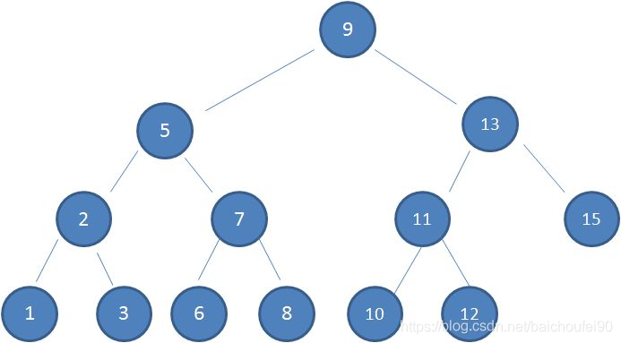

### 3.1 简介

利用左右子树的规则，来减少查找时递归深度

### 3.1 规则

1. 左子树上所有结点的值均小于或等于它的根结点的值
2. 右子树上所有结点的值均大于或等于它的根结点的值
3. 左、右子树也分别为BST

### 3.3 思想

二分查找

### 3.4 时间复杂度

O(logN)，链表时最差O(N)，如下图
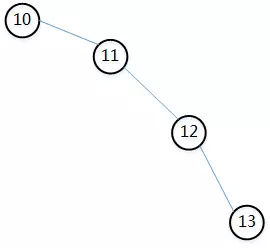

## 0x04 AVL树

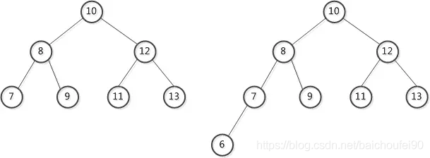

### 4.1 简介

还是一颗BST，但是高度有平衡要求，所以叫平衡二叉搜索树

### 4.2 规则

- 左右子树的高度差不能超过1
- 每个子树也是一颗AVL

### 4.3 思想

要求平衡，减少查找时递归的深度

### 4.4 时间复杂度

**注意，以下`C`为常数**

- 查找
  O(logN)
- 插入
  O(logN)查找+O©旋转
- 删除
  O(logN)查找+非O©旋转。最坏情况下需要从被删节点到根节点这条路径上所有节点的平衡性，此时旋转O(logN)

### 4.5 树调整规则

当树结构改动导致不再平衡时，需要旋转`最小失衡子树`。我们先看两个概念：

1. 平衡因子：左子树的高度减去右子树的高度。AVL树的平衡因子的取值只可能为[0, 1, -1]
2. 最小失衡子树：在新插入的节点向上查找，以第一个平衡因子的绝对值超过1的节点为根的子树称为最小失衡子树。也就是说，一棵失衡的树，是有可能有多棵子树同时失衡的。而这个时候，我们只要调整最小的不平衡子树，就能够将不平衡的树调整为平衡的树。

下面讲一个例子：
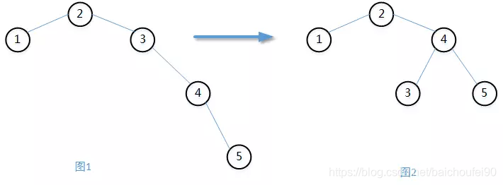
上面图1的[1, 2, 3, 4]本来是一颗AVL，但由于加入了节点5，造成不平衡。此时节点4的平衡因子为-1，节点3为-2。也就是说节点3就是我们要找的最小失衡子树，需要对其做左旋调整。最后结果如上图2，是一棵新的AVL树。

### 4.6 旋转

#### 4.6.1 左旋转

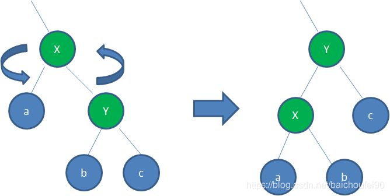
左旋转即将父节点X下移成为右孩子Y的左孩子，Y成为新的父节点，之前Y的左孩子b成为X的右孩子。旋转之后仍然符合BST规则。

#### 4.6.2 右旋转

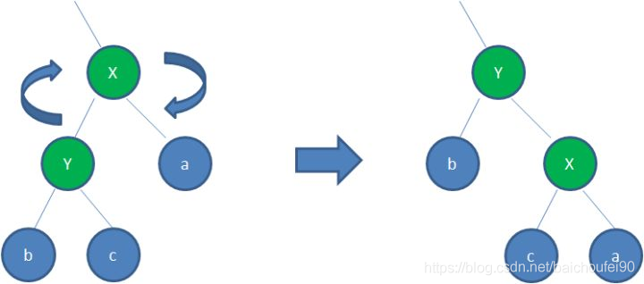
右旋转即将父节点X下移成为左孩子Y的右孩子，Y成为新的父节点，之前Y的右孩子b成为X的左孩子。旋转之后仍然符合BST规则。

## 0x05 红黑树

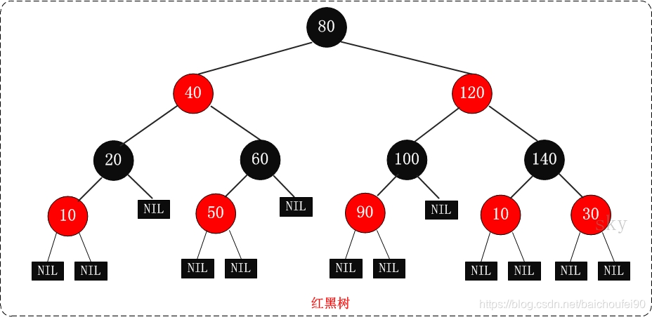

### 5.1 简介

不再是AVL那样的绝对高度平衡树，而是有一套自己的自平衡逻辑。

### 5.2 规则

- 节点是红、黑两色之一
- 根节点一定是黑色
- 叶子节点（是指为空(NIL或NULL)的叶子节点）一定是黑色
- 如果一个节点是红色，那么它的两个子节点都一定是黑色
- 从任一节点到其每个后代叶节点的所有简单路径都包含相同数目的黑色节点
- 由上面的一点结论可以推导出红黑树从根到叶子的最长路径不会超过最短路径长度的两倍

### 5.3 思想

还是一颗BST，但是高度有平衡要求，所以叫平衡二叉搜索树

### 5.4 时间复杂度

**注意，以下`C`, `D`为常数**

- 查找
  O(logN)
- 插入
  O(logN)查找+O©旋转+O(D)染色
- 删除
  O(logN)查找+O©旋转+O(D)染色
  删除时最多旋转3次
  这一点是红黑树比AVL树在数据增删较多的场景下更优秀的重要原因。

### 5.5 调整规则

请参考[教你初步了解红黑树](https://blog.csdn.net/v_JULY_v/article/details/6105630)

#### 5.5.1 插入

红黑树的插入规则如下：

- 在红黑树中插入节点时，节点的初始颜色必须是红色。因为规则5规定每个节点到叶节点必须包含相同数目黑色节点，如果插入的节点是黑色，那就肯定会打破规则5必须调整了。所以设为红色可以在插入过程中尽量避免对树的结构进行调整。
- 初始插入按照二叉查找树的性质插入，即找到合适大小的节点，在其左边或右边插入子节点。
- 如果插入节点的父节点为红，则规则4(红点孩子都为黑)违背，需要以插入的节点为中心进行旋转或重涂色。在这步操作后可能仍不满足规则，则需要将当前节点变换回溯到其父节点或祖父节点，以父节点或祖父节点为中心继续旋转或涂色，如此向根节点方向循环操作直到满足红黑树的性质。

恢复红黑树规则具体策略：

- 违反规则的节点上移
- 旋转或涂色，有五种情况：
  1. 空树中插入根节点
     此时违反了根节点为黑规则，涂色为红即可
  2. 插入节点的父节点是黑色
     无需调整
  3. 当前节点的父节点是红色，且叔叔节点（祖父节点的另一个子节点）也是红色
     此时违反了红节点孩子必为黑规则。
     父节点和叔叔节点调整为黑色，祖父节点调整为红色。如果还是不符合红黑树规则，就以祖父节点为焦点进行新的调整。
  4. 当前节点的父节点是红色，叔叔节点是黑色，当前节点是右子节点
     此时违反了红节点孩子必为黑规则。
     将父节点作为焦点，进行左旋转。如果还是不符合红黑树规则，就以该新焦点即原父节点做为焦点进行新的调整。
  5. 当前节点的父节点是红色，叔叔节点是黑色，当前节点是左子节点
     此时违反了红节点孩子必为黑规则。
     将当前节点的父节点改变为黑色，祖父节点改变为红色，然后再以祖父节点作为新焦点，做右旋操作。如果还是不满足规则，就以新焦点按上述策略继续调整，直到满足为止。

### 5.6 应用

插入删除数据较多场景。

Java中TreeSet HashMap等用了红黑树。

## 0x06 B树

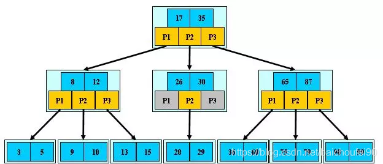

### 6.1 简介

B树是一棵多路平衡搜索树，他的特点是矮而宽。

适合海量数据无法放入内存的情况。试想如果海量数据放在硬盘上，采用上述的AVL树或红黑树，因为他们是二叉树，所以会导致树的深度特别深，造成IO次数过多。我们都知道磁盘IO速度是很慢的动作，所以这种情况适合用B树。

每次IO都能获得大量的数据，B树的数据结构很适合内外存数据交互。

### 6.2 规则

一个 m 阶的B树满足以下条件：

- 非叶根结点至少拥有2个子节点
- 每个非叶节点最多拥有m个子节点
- 每个节点最多拥有m-1个key
- 每一个非叶非根节点至少有 ⌈m/2⌉ 个子节点
- 有 k 个子节点的非叶子节点拥有 k − 1 个key
- 所有的叶结点都在同一层
- 每个指针要么为null，要么指向另外一个节点。
- 如果某个指针在节点node最左边且不为null，则其指向节点的所有key小于`v(key1)`，其中`v(key1)`为node的第一个key的值。
- 如果某个指针在节点node最右边且不为null，则其指向节点的所有key大于`v(keym)`，其中`v(keym)`为node的最后一个key的值。
- 如果某个指针在节点node的左右相邻key分别是`keyi`和`keyi+1`且不为null，则其指向节点的所有key小于`v(keyi+1)`且大于`v(keyi)`。

m=4的的B树：
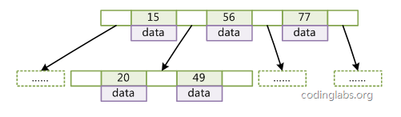

### 6.3 思想

特别宽，深度浅，减少磁盘IO次数

一般用在磁盘索引组织，无法一次性加载整棵树，而是每次加载一个B树节点到内存，依次向下查找。

### 6.4 时间复杂度

#### 6.4.1 查找

查找时间复杂度为O(logN)，底为树的度或阶

首先从根节点进行二分查找，如果找到则返回对应节点的data，否则对相应区间的指针指向的节点递归进行查找，直到找到节点或找到null指针。B-Tree上查找算法的伪代码如下：

```java
BTree_Search(node, key) {
	if(node == null) return null;
	foreach(node.key)
	{
		if(node.key[i] == key) return node.data[i];
		if(node.key[i] > key) return BTree_Search(point[i]->node,key);
	}
	return BTree_Search(point[i+1]->node);
}

data = BTree_Search(root, my_key);
1234567891011
```

#### 6.4.2插入

O(logN)，可能分裂

#### 6.4.3 删除

O(logN)，可能合并

## 0x07 B+树

下面是一棵3阶B+树
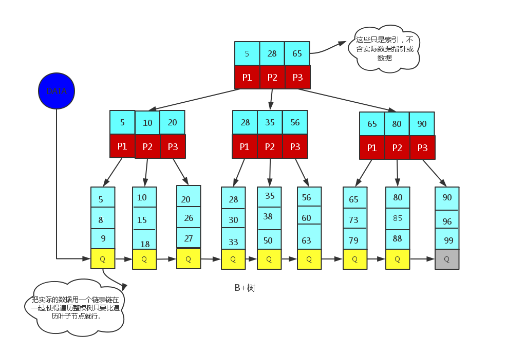

### 7.1 简介

B+树是变数变体，但不同的地方是B+树将真正的数据存放到了叶节点，非叶节点只存放其叶子节点的最小值作为索引关键字和指向孩子节点的指针。这样的好处是，降低树的高度，可用更少的节点能容纳更多的数据。

而且叶节点之间还有指针顺序连接，可形成双向链表，便于快速遍历、范围查询。这一点很重要，而B树在范围查询时必须要做中序遍历，十分低效。

B+ 树的特点:

- 所有关键字都有序地放置在叶子结点的链表中(稠密索引)
- 非叶子结点相当于是叶子结点的索引(稀疏索引)，叶子结点相当于是存储(关键字)数据的数据层;
- 每个关键字的查询路径相同，所以查询相率很稳定
- 比B树还宽，深度更浅，进一步减少磁盘IO次数。
- 叶节点之间有指针相连，形成有序链表，范围查询效率高

### 7.2 规则

一个m阶树为例：

- 根节点子树[2，m]
- 非根节点最少包含 ⌈m/2⌉个元素，最多包含m个元素
- 所有叶子结点都在同一层，且按关键字从小到大连接
- m个关键字的节点同时有m个指针指向子树
- 所有非叶子节点的关键字可以看成是索引部分，这些索引等于其子树（根结点）中的最大（或最小）关键字。例如一个非叶子节点包含信息: (n，A0,K0, A1,K1,……,Kn,An)，其中Ki为关键字，Ai为指向子树根结点的指针，n表示关键字个数。即Ai所指子树中的关键字均小于或等于Ki，而Ai+1所指的关键字均大于Ki（i=1，2，……，n）。
  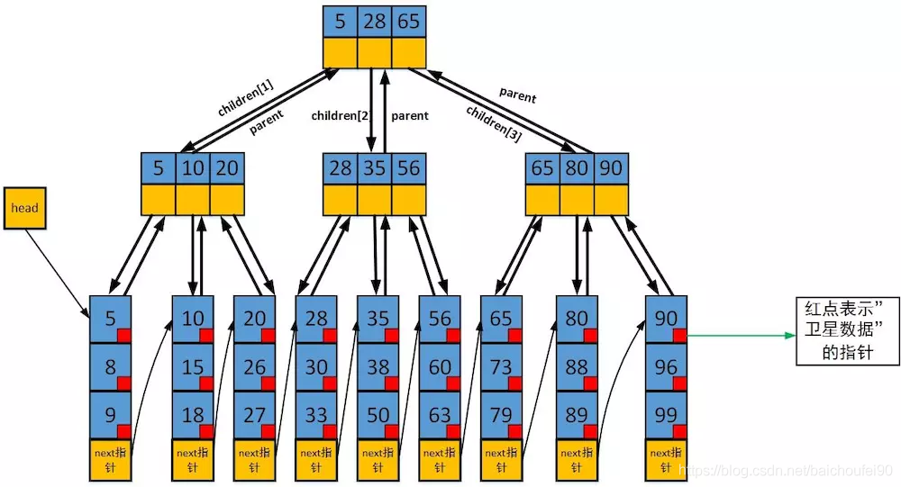

### 7.3 思想

- 比B树还宽，深度更浅，进一步减少磁盘IO次数。
- 可把更多的关键字放在同一个内部节点，存放在同一盘块中。每次能读入更多的关键字到内存，IO次数随之降低。
- 局部性原理，一个叶节点就是一个磁盘页，每次读入一页就是多个相连的记录
- 叶子节点双向链表，范围遍历查询更快速

### 7.4 时间复杂度

拥有稳定的时间复杂度，每次都必须从根节点到叶子节点。

- 查找
  稳定，跟树高相关
- 插入
- 删除

### 7.5 基本操作

#### 7.5.1 查找

查找类似于二叉查找树，起始于根节点，自顶向下遍历树，选择其分离值在要查找值的任意一边的子指针。在节点内部典型的使用是二分查找来确定这个位置。

#### 7.5.2 插入

1. 先查找到需要插入的叶子节点
2. 如果该叶子节点小于规定个数，直接插入
3. 否则对该叶节点进行分裂操作。这个过程与B树不同，B树的叶节点分裂是将该节点的中间关键字上移至其父亲节点，剩下两部分关键字分别组成新的左右孩子叶节点；而B+树分裂叶节点的过程是在上移中间关键字后，还在左叶节点保存这个关键字（因为B+树的叶节点关键字包含所有内部节点关键字）。
4. 然后将上升到的节点作为焦点，按步骤2-4循环操作直到满足B+树要求。
   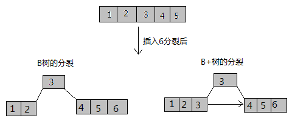

下面来一个3阶B+树插入实例，注意该树存的是子节点中最大的值作为关键字：

1. 3阶B+树
   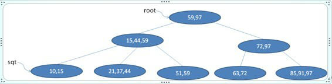
2. 插入20
   此时会从根节点自顶向下查找，直到`21,37,44`那个叶节点，插入
   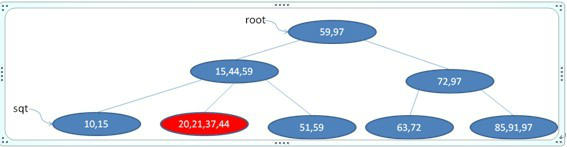
3. 叶子节点分裂，并上移中间关键字，原节点保留该上移的关键字
   因为此时叶节点变为`20,21,37,44`，超出3阶B+树限制，所以该节点分裂。这里就形成了`20,21`, `37,44`两个新的左右叶子节点，并将21上移到父节点：
   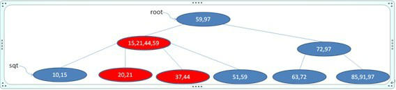
4. 此时父节点变为`15,21,44,59`，作为新的焦点考虑。他也不满足3阶B+树要求，所以我们分裂他，并将中间数21上移，得到以下结果：
   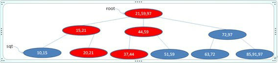
5. 此时，已经到了根节点，最新值是`21,59,97`，满足3阶B+树要求，插入数据完毕。

#### 7.5.3 删除

删除操作相对于插入过程更复杂，考虑的情况更多，可以参考[图解B树和B+树的插入和删除操作](https://blog.csdn.net/yanshuanche3765/article/details/79945254)

### 7.6 B树和B+树的区别

以一个m阶树为例:

- 关键字的数量不同：
  B+树中非根节点有m个关键字，其子结点也有m个，其关键字只是起到了一个索引的作用(不存数据，只有索引)；而B树虽然也有m个子树，但是其只拥有m-1个关键字（还存了数据）。
- 存储的位置不同：
  B+树中的数据都存储在叶子结点上，也就是其所有叶子结点的数据组合起来就是完整的数据；而B树的数据存储在所有节点。
- 非根节点的构造不同：
  B+树的非根节点仅仅存储着关键字信息和孩子的指针（这里的指针指的是磁盘块的偏移量），也就是说内部结点仅仅包含着索引信息。所以在相同盘快大小情况下，B+树的内部结点能存更多的关键字，一次性读入内存的关键字也越多，IO次数随之降低；而B树非根节点存有数据。
  举个例子，假设磁盘中的一个盘块容纳16bytes，而一个关键字2bytes，一个关键字具体信息指针2bytes。一棵9阶B-tree(一个结点最多8个关键字)的内部结点需要2个盘快。而B+ 树内部结点只需要1个盘快。当需要把内部结点读入内存中的时候，B 树就比B+ 树多一次盘块查找时间(在磁盘中就是磁盘片旋转的时间)。
- 查询不同（B+树查询效率更稳定）：
  B树在在某个节点找到具体的数据以后就结束查找；而B+树则需要通过索引找到叶子结点中的数据才结束，也就是说B+树的搜索过程必须经历从根结点到叶子结点，更稳定。
- 遍历方式不同
  B树遍历必须不停地访问每个树节点；B+树因为叶节点有指针相连接，所以直接从左到右遍历查询即可，对于范围查询效率很高。

### 7.7 B+树的问题

- 数据插入时随机IO
  新数据写入后，叶子节点超出阈值会发生分裂上移等情况，导致逻辑视图上连续的叶节点在物理磁盘上往往不连续甚至是分离很远

### 7.8 应用

数据库中的索引一般是存于磁盘，数据量大的情况可能无法一次装入内存。B+树的设计可以允许数据节点分批加载，同时树的高度较低，减少IO次数，提高查找效率。

Mysql 索引就是用的B+树。
InnoDB引擎中将数据和主键一起存放到B+树的叶节点，二级索引也是用了B+树叶节点存放二级索引列和主键。MyIsam引擎是将主键和指向该条record的指针存放到B+树的叶节点中。

## 0x08 B*树

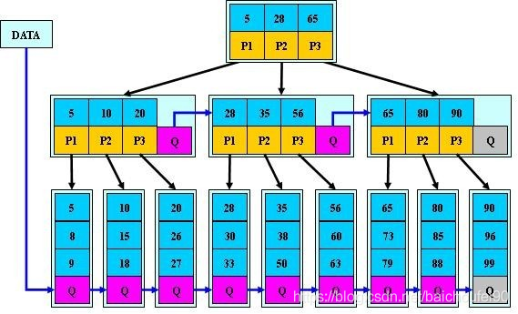

### 8.1 简介

B*树是B+树的变体，非叶非根节点之间加入了指向兄弟节点的指针。

### 8.2 规则

- B*树定义了非叶子结点关键字个数至少为(2/3)*M，即块的最低使用率为2/3（而不是B+树的1/2），提升了节点空间利用率。
- B*树的分裂也和B+树不同，如果临接的兄弟节点未满，就把一部分数据移动到兄弟节点；如果兄弟节点已满，则从当前节点和兄弟节点各拿出1/3的数据创建一个新的节点。这样的好处是减少了分裂移动和创建新节点的次数。

## 0x9 2-3-4树

### 9.1 简介

2-3-4树是一个多叉树，它的每个节点最多有四个子节点和三个数据项。2-3-4树和红黑树一样，也是平衡树，它的效率比红黑树稍差，但是编程容易。

非叶节点的子节点总是比它含有的数据项多1。如下图所示：
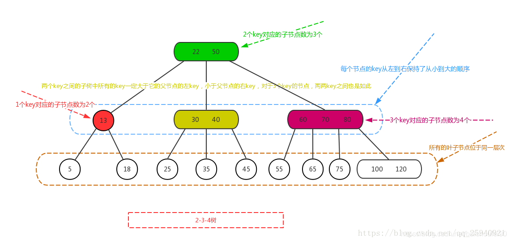

### 9.2 规则

1. 任一非叶节点数据项个数只能是[1,2,3]，对应的子节点数为[2,3,4]；
2. 所有叶子节点都在同一层，也就是说所有叶子节点到根节点的长度一致；
3. 每个节点的key从左到右保持了从小到大的顺序，两个key之间的子树中所有的key一定大于它的父节点的左key，小于父节点的右key，对于3个key的节点，两两key之间也是如此。

### 9.3 思想

2-3-4树是2-3树的扩展，他又是一棵3阶B树。

### 9.4 时间复杂度

- 查找
  O(log(N/3))

### 9.5 插入规则

1. 当前节点key<3，直接插入
2. key=3，则将改节点分裂为1个父节点+2个子节点，将该父节点向上层节点插入
3. 重复这个步骤直到满足2-3-4树规则

## 0x10 Trie树

**注意：本章摘自**[Trie树](https://github.com/julycoding/The-Art-Of-Programming-By-July/blob/master/ebook/zh/06.09.md)
一组单词，`inn, int, at, age, adv, ant` 得到的`Trie`树如下：
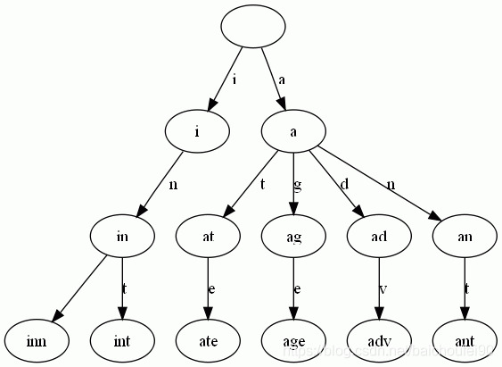

### 10.1 简介

Trie树，即字典树，又称单词查找树或键树，是一种树形结构。典型应用是用于统计和排序大量的字符串（但不仅限于字符串），所以经常被搜索引擎系统用于文本词频统计。它的优点是最大限度地减少无谓的字符串比较，查询效率比较高。

### 10.2 规则

- 根节点不包含字符，除根节点外每一个节点都只包含一个字符。
- 从根节点到某一节点，路径上经过的字符连接起来，为该节点对应的字符串。
- 每个节点的所有子节点包含的字符都不相同（注意是子节点不同，而跨代节点可以相同）。

### 10.3 思想

Trie的核心思想是空间换时间，利用字符串的公共前缀来降低查询时间的开销以达到提高效率的目的。

### 10.4 查询

从最开头的Trie树图片中可以看到：

- 每条边对应一个字母。
- 每个节点对应一项前缀。叶节点对应最长前缀，即单词本身。
- 单词inn与单词int有共同的前缀“in”, 因此他们共享左边的一条分支，root->i->in。同理，ate, age, adv, 和ant共享前缀"a"，所以他们共享从根节点到节点"a"的边。

查询过程非常简单。比如要查找`int`，顺着路径`i` -> `in` -> `int`就找到了。

### 10.5 创建

搭建Trie的基本算法也很简单，无非是逐一把每个单词的所有字母逐一插入Trie。插入前先看前缀是否存在。如果存在，就共享，否则创建对应的节点和边。比如要插入单词`add`，就有下面几步：

1. 考察前缀`a`，发现边`a`已经存在。于是顺着边`a`走到节点`a`。
2. 考察剩下的字符串`dd`的第一个`d`，发现从节点`a`出发，已经有边`d`存在。于是顺着边`d`走到节点`ad`
3. 考察最后一个字符`d`，这下从节点`ad`出发没有边`d`了，于是创建节点`ad`的子节点`add`，并把边`ad`->`add`标记为`d`。
   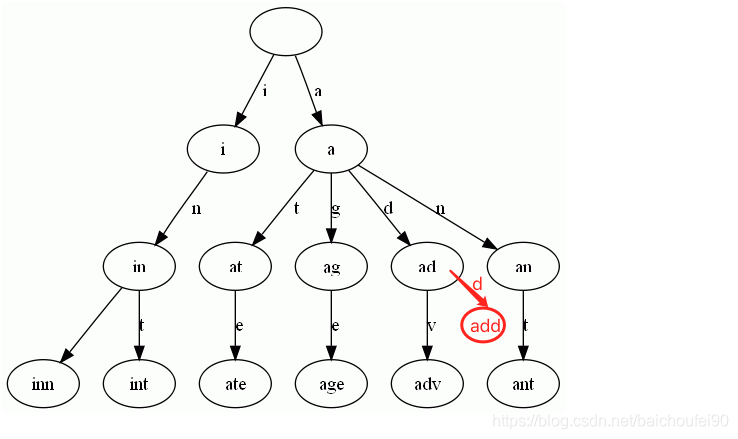

### 10.6 时间复杂度

数据规模为n时，二叉搜索树增删查的平均时间复杂度O(log n)，最坏情况下为线性表，此时时间复杂度为O(n)。
而通常情况下，Trie树的高度n要远大于搜索字符串的长度m，故查找的时间复杂度为O(m)，最坏情况下的时间复杂度才为O(n)。

### 10.7 应用

#### 10.7.1 TopK

- 一个文本文件，大约有一万行，每行一个词，要求统计出其中最频繁出现的前10个词，请给出思想，给出时间复杂度分析

提示：

1. 建立trie树，记录每个词出现的次数，时间复杂度是`O(n*le)`（`le`表示单词的平均长度），
2. 建立并维护一个小顶堆，存放出现最频繁的前10个词。时间复杂度是`O(n*lg10)`
3. 所以总的时间复杂度，是`O(n*le)` + `O(n*lg10)`中较大的那一个。

#### 10.7.2 寻找热门查询

- 搜索引擎会通过日志文件把用户每次检索使用的所有检索串都记录下来，每个查询串的长度为1-255字节。假设目前有一千万个记录，这些查询串的重复率较高，虽然总数是1千万，但是如果去除重复和，不超过3百万个。一个查询串的重复度越高，说明查询它的用户越多，也就越热门。请你统计最热门的10个查询串，要求使用的内存不能超过1G。
- 提示：利用trie树，关键字域存该查询串出现的次数，没有出现为0。最后用10个元素的小根推来对字符串出现频率进行排序。

## 0x11 LSM树

详细内容可以参考[论文阅读-The Log-Structured Merge-Tree (LSM-Tree)](https://blog.csdn.net/baichoufei90/article/details/84841289)

### 11.1 简介

`LSM树`全称为`Log-Structured MergeTree`，即日志结构合并树。

#### 11.1.1 B树存在的问题

- 查找
  从原理来说，b+树在查询过程中应该是不会慢的，但如果数据插入杂乱无序时（比如插入顺序是5 -> 10000 -> 3 -> 800，类似这样跨度很大的数据），就需要先找到这个数据应该被插入的位置然后再插入数据。这个查找过程如果非常离散，且随着新数据的插入，叶子节点会逐渐分裂成多个节点，逻辑上连续的叶子节点在物理上往往已经不再不连续，甚至分离的很远。就意味着每次查找的时候，所在的叶子节点都不在内存中。这时候就必须使用磁盘寻道时间来进行查找了，相当于是随机IO了。
- 写入
  且B+树的更新基本与插入是相同的，也会有这样的情况。且还会有写数据时的磁盘IO。

**综上B树最大的性能问题就是随机IO。**

为了更好的说明LSM树的原理，下面举个比较极端的例子：

- 顺序写，读慢
  现在假设有1000个节点的随机key，对于写磁盘来说当然全部顺序写入磁盘最快，但因为key在磁盘中完全无序，造成每次读取都要全扫描，效率太差；

- B+树，写慢
  为了让读性能尽量高，所以就是用B+树使得数据在磁盘中有序。但此时因为key为随机的，所以写数据时因为会产生大量的随机IO，磁盘寻道速度效率低下。

- LSM树思想
  LSM树本质上就是在读写之间取得平衡，和B+树相比，它牺牲了部分读性能，用来大幅提高写性能。

  LSM树的原理是把一颗大树拆分成N棵小树， 它首先在内存中构建一棵内部有序的小树，将数据写入到内存中（内存没有寻道速度的问题，随机写的性能得到大幅提升）。随着小树越来越大，内存的小树会flush到磁盘上。读数据时，由于不知道数据在哪棵小树上，因此必须遍历所有的小树，但在每颗小树内部数据仍然是有序的。

#### 11.1.2 可用的解决方案

解决上述随机IO造成的大量磁盘寻道时间的方案：

- 可以采用SSD
  传统的机械硬盘(HDD)运行主要是靠机械驱动头，包括马达、盘片、磁头摇臂等必需的机械部件，它必须在快速旋转的磁盘上移动至访问位置，至少95%的时间都消耗在机械部件的动作上。SSD却不同机械构造，无需移动的部件，主要由主控与闪存芯片组成的SSD可以以更快速度和准确性访问驱动器到任何位置。传统机械硬盘必须得依靠主轴主机、磁头和磁头臂来找到位置，而SSD用集成的电路代替了物理旋转磁盘，访问数据的时间及延迟远远超过了机械硬盘。SSD有如此的“神速”，完全得益于内部的组成部件：主控–闪存–固件算法。
- LSM树
  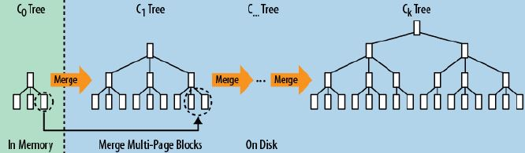
  LSM树主要思想是通过牺牲磁盘读性能换取写的顺序性。LSM-tree通过磁盘的顺序写，来达到最优的写性能，因为这会大大降低磁盘的寻道次数，一次磁盘IO可以写入多个索引块。

### 11.2 思想

`Log-Structured`思想最早由 Rosenblum和Ousterhout[4]于1992年在研究日志结构的文件系统时提出。他们将整个磁盘就看做是一个日志，在日志中存放永久性数据及其索引，每次都添加到日志的末尾；通过将很多小文件的存取转换为连续的大批量传输，使得对于文件系统的大多数存取都是顺序性的，从而提高磁盘和带宽利用率，故障恢复速度快。 O’Neil等人受到这种思想的启发，借鉴了Log不断追加（而不是修改）的特点，结合`B树`的数据结构，提出了一种延迟更新，批量写入硬盘的数据结构LSM树及其算法。LSM树努力地在读和写两方面寻找一个平衡点，以最小化系统的存取性能的开销，特别适用于会产生大量插入操作的应用环境。

**LSM树主要思想是通过牺牲磁盘读性能换取写的顺序性和性能提升，将多次数据修改操作先放在内存中形成有序树，再定时统一合并刷入磁盘**
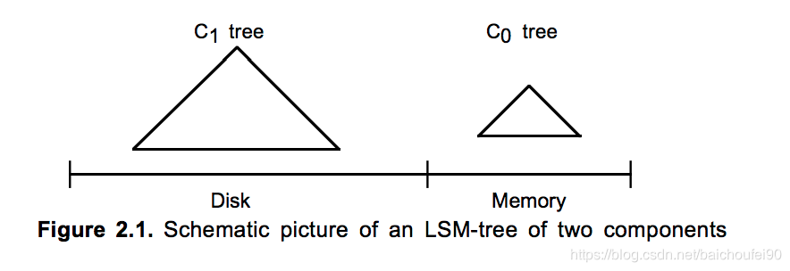
LSM树的主要设计是划分不同等级的树。以两级树为例，那么一份索引数据就由两棵树组成，一棵C0树在内存，另一棵C1树在磁盘。

- 内存中的C0树可以不一定是B-树，也可以是AVL、2-3树等，因为在内存中不需要为了减少磁盘IO而强制压缩树高度。
- 而存在于磁盘的树是一棵类B树。

写入流程如下：

1. 首先向顺序日志文件中写一条用于恢复这次插入行为的日志记录
2. 该行数据的索引被插入到常驻内存的 C0 树中
3. 会适时地将这些C0树上的数据迁移到磁盘上的C1树中
4. 每个索引的搜索过程都是先C0后C1

具体来说，数据先写入内存中的树C0，当大小达到阈值后会开启滚动合并过程：

1. 首先读取包含C1树的叶节点的多页块，这会使得C1中的一系列条目驻留到缓存中
2. 每次合并都会去读取已经被缓存的C1树的一个磁盘页大小的叶节点
3. 然后将第二步中读取到的C1树叶节点上的条目与C0树的叶节点条目进行合并，由此减少C0树的大小
4. 合并完成后，会为C1树创建一个已合并的新叶节点（在缓存中，填满后被刷入磁盘）

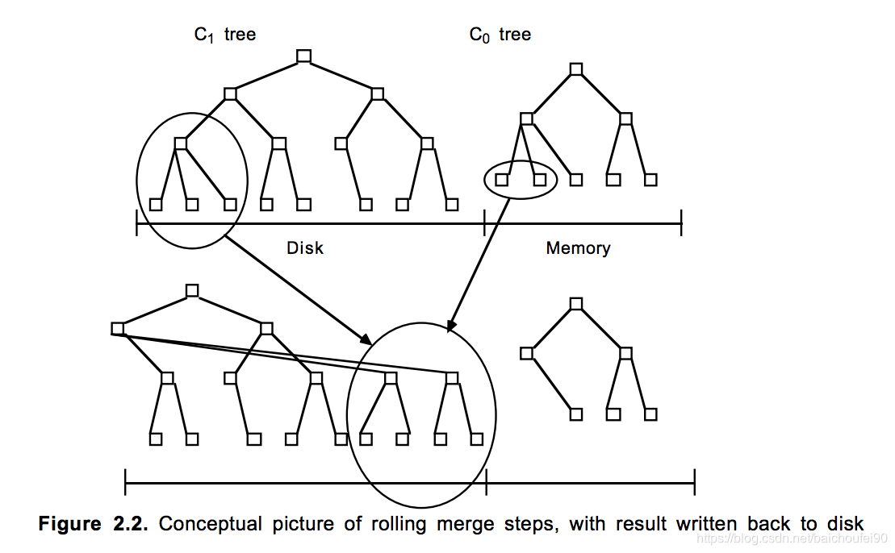

比如一共有N个数据，按每m个数据就需要排序依次，这样最终能得到N/m个有序结构。查询时就挨个在这些有序结构中做二分查找，直到找到结果或搜索完毕。

这样搜索效率是O(N/m*logm)，相较B树下降较多。所以还用了一些方法来优化：

1. Bloom filter 布隆过滤器
   就是个带概率的`bitmap`，可以快速查出某一个小的有序结构里有没有指定的key，可以不再使用二分查找。效率得到了提升，但付出的是空间代价。**注意，`Bloom filter`可以肯定某个key不存在，但不能肯定该key存在。**
2. 小树合并为大树
   就是`compact`的过程，有个进程不断地将小树合并到大树上，这样大部分的老数据查询也可以直接使用logm的方式找到，不需要再进行O(N/m*logm)的查询了。

### 11.3 性能

- B树，因为它最常用的目录节点是可缓存在内存里的，所以实际上是一种混合数据结构：它结合了低成本磁盘和高成本内存，前者用来存放大多数的数据，后者为最热门的数据提供访问。
- 而LSM树将此层次结构扩展到多个层级，并在执行多页磁盘数据读取时结合了merge IO的优点。

下图展示了对于通过B树以及LSM树(仅包含内存中的C0和和磁盘上的C1树)的两种数据访问模式的数据热度，纵轴是`访问开销/MB`；横轴是`插入速率/MB`：
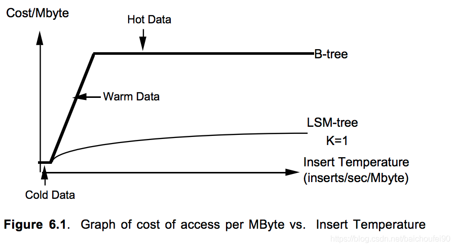

从上图可以得到以下结论：

- 最低的访问速率时，`Cold Data`的磁盘访问开销并太高
- 到`Warm Data`阶段，B树结构的数据访问成本开销急剧上升，此时磁盘臂会成为磁盘访问的主要限制因素；而LSM树结构的数据访问成本上升很缓慢
- 到了`Hot Data`阶段，B树结构的数据都应该缓存到内存中了，此时称之为沸点。使用内存缓存对B树来说效果显著，随着访问速率进入`Hot Data`区域而开销图形却变平缓，甚至更频繁的访问也不会导致更高的成本上升；而我们可以看出LSM树的作用是降低访问成本，对于任何实际访问速率的诸如插入和删除之类的可合并操作，特别是针对`Cold Data`。

此外，很多需要缓存B树的情况，如上图中的`Hot Data`阶段，其实可以用大部分驻留在磁盘的LSM树来代替。在这些场景中，由于LSM树的批处理效应，数据在逻辑访问速率方面是`Hot`的，但在磁盘物理访问的速率方面仅是`Warm`的。 对于具有大量可合并操作（写入、删除）的应用程序而言，这是一个非常重要的优势。

### 11.4 LSM-tree读写放大

本节内容转自[LSM-tree 基本原理及应用](https://cloud.tencent.com/developer/news/340271)

#### 11.4.1 读写放大的定义

读写放大（read and write amplification）是 LSM-tree 的主要问题，定义：读写放大 = 磁盘上实际读写的数据量 / 用户需要的数据量。注意是和磁盘交互的数据量才算，这份数据在内存里计算了多少次是不关心的。比如用户本来要写 1KB 数据，结果你在内存里计算了1个小时，最后往磁盘写了 10KB 的数据，写放大就是 10，读也类似。

#### 11.4.2 写放大

我们以 RocksDB 的 Level Style Compaction 机制为例，这种合并机制每次拿上一层的所有文件和下一层合并，下一层大小是上一层的 r 倍。这样单次合并的写放大就是 r 倍，这里是 r 倍还是 r+1 倍跟具体实现有关，我们举个例子。

假如现在有三层，文件大小分别是：9，90，900，r=10。又写了个 1，这时候就会不断合并，1+9=10，10+90=100，100+900=1000。总共写了 10+100+1000。按理来说写放大应该为 1110/1，但是各种论文里不是这么说的，论文里说的是等号右边的比上加号左边的和，也就是10/1 + 100/10 + 1000/100 = 30 = r * level。个人感觉写放大是一个过程，用一个数字衡量不太准确，而且这也只是最坏情况。

#### 11.4.2 读放大

为了查询一个 1KB 的数据。最坏需要读 L0 层的 8 个文件，再读 L1 到 L6 的每一个文件，一共 14 个文件。而每一个文件内部需要读 16KB 的索引，4KB的布隆过滤器，4KB的数据块（看不懂不重要，只要知道从一个SSTable里查一个key，需要读这么多东西就可以了）。一共 24*14/1=336倍。key-value 越小读放大越大。

### 11.5 LSM树总结

LSM树特点如下：

- 延迟、批量更新
- 写入放在内存，写效率提升好几个数量级，不会有B树磁盘随机IO情况
- 读效率略低，因为需要遍历多个树，但有优化。且最近的访问一般是查最近的数据，往往位于内存中的C0树。而大范围查找时可通过树的目录节点、多页块等技术降低查询开销
- 滚动合并内存中的小树和磁盘上的大树，提升查询效率
- 磁盘中的C1树的节点为单个磁盘页大小，根目录下的每个层级上的单页节点序列会被打包，然后一起放入连续的多页磁盘块中（囊括了根节点以下的节点），利于磁盘顺序访问
- 内存中C0树有序，可采用AVL树、2-3树等；磁盘中的树C1-Ck也有序，为了减少IO采用类B树。
- 数据写入
  先以顺序追加的形式写入WAL(HLog)。然后将对数据的写入、修改增量保存在内存中的小树中(MemStore)，这些小树往往是AVL、2-3树这样的排序树或是SkipList跳表，所以小树结构是有序的。大小达到阈值后再和磁盘上的大树（这些磁盘中的树基于减少IO次数的考虑，需要压得很低，所以一般是类B树）合并，并将合并结果先写入缓存，当页写满后再flush到磁盘，注意此时数据依然有序。这样绝对没有磁盘随机IO的问题，大大提升写入性能。
- 数据读取
  但在数据读取时可能还需要合并内存修改数据和磁盘历史数据，并遍历查找多棵树，所以读性能降低。所以可在磁盘树中使用BloomFilter进行优化。
- 数据删除
  删除的时候会现在LSM树的内存中的C0树查找，若果没有就建立一个类似墓碑的条目到C0树，以后的查找就会因为找到这个key value对应的墓碑标记而忽略此条目。真正的删除是当合并的时候，墓碑和对应的旧数据相遇是反生湮灭。

### 11.5 应用

LSM树适用于长期具有高频次数据更新而查询较少的场景。

#### 11.5.1 HBase

- 写入

1. 先写入WAL的HBase实现 -> HLog，方式是顺序磁盘追加
2. 然后写入对应列簇的Store中的MemStore
3. MemStore大小达到阈值后会被刷入磁盘成为StoreFile。注意此文件内部是根据RowKey, Version, Column排序，但多个StoreFile之间在合并前是无序的。
4. HBase会定时把这些小的StoreFile合并为大StoreFile(B+树)，减少读取开销（类似于LSM中的树合并）

- 读取
  先搜索内存小树即MemStore，不存在就到StoreFile中寻找

- 读取优化

  1. 布隆过滤器。可快速得到是否数据不在该集合，但不能100%肯定数据在这个集合，即所谓假阳性。
  2. 合并。合并后，就不用再遍历繁多的小树了，直接找大树。

- 删除
  添加<key, del>标记，在Major Compact中被删除的数据和此墓碑标记才会被真正删除。

- 合并

  HBase Compact过程，就是RegionServer定期将多个小StoreFile合并为大StoreFile，也就是LSM小树合并为大树。这个操作的目的是增加读的性能，否则搜索时要读取多个文件。HBase中合并有两种：

  1. Minor Compact
     仅合并少量的小HFile
  2. Major Compact
     合并一个Region上的所有HFile，此时会删除那些无效的数据（更新时，老的数据就无效了，最新的那个<key, value>就被保留；被删除的数据，将墓碑<key,del>和旧的<key,value>都删掉）。很多小树会合并为一棵大树，大大提升度性能

#### 11.5.2 InfluxDB

InfluxDB是一个时序数据库，使用了LSM树理念。对于时序数据而言，LSM tree的读写效率很高。但是热备份以及数据批量清理的效率不高。

InfluxDB内更新数据也用了LSM树延时批量处理方法，删除数据也有LSM树墓碑概念。

#### 11.5.3 LevelDB

**注：本小节大量内容转自**
[LSM Tree 学习笔记](http://blog.fatedier.com/2016/06/15/learn-lsm-tree/)
作者：fatedier

##### 11.5.3.1 存储模型

- WAL
  在设计数据库的时候经常被使用，当插入一条数据时，数据先顺序写入 WAL 文件中，之后插入到内存中的 MemTable 中。这样就保证了数据的持久化，不会丢失数据，并且都是顺序写，速度很快。当程序挂掉重启时，可以从 WAL 文件中重新恢复内存中的 MemTable。
- MemTable
  MemTable 对应的就是 WAL 文件，是该文件内容在内存中的存储结构，通常用 SkipList跳表 来实现。MemTable 提供了 k-v 数据的写入、删除以及读取的操作接口。其内部将 k-v 对按照 key 值**有序存储**，这样方便之后快速序列化到 SSTable 文件中，仍然保持数据的有序性。
- Immutable Memtable
  顾名思义，Immutable Memtable 就是在内存中只读的 MemTable，由于内存是有限的，通常我们会设置一个阀值，当 MemTable 占用的内存达到阀值后就自动转换为 Immutable Memtable，Immutable Memtable 和 MemTable 的区别就是它是只读的，**系统此时会生成新的 MemTable 供写操作继续写入**。之所以要使用 Immutable Memtable，就是为了避免将 MemTable 中的内容序列化到磁盘中时会阻塞写操作。
- SSTable
  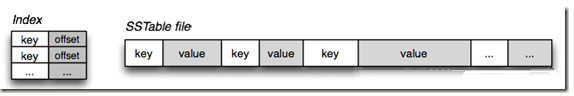
  **SSTable 就是 MemTable 中的数据在磁盘上的有序存储，其内部数据是根据 key 从小到大排列的**。通常为了加快查找的速度，需要在 SSTable 中加入index数据索引，可以快读定位到指定的 k-v 数据。
  SSTable 通常采用的分级的结构，例如 LevelDB 中就是如此。MemTable 中的数据达到指定阀值后会在 Level 0 层创建一个新的 SSTable。当某个 Level 下的文件数超过一定值后，就会将这个 Level 下的一个 SSTable 文件和更高一级的 SSTable 文件合并，由于 SSTable 中的 k-v 数据都是有序的，相当于是一个多路归并排序，所以合并操作相当快速，最终生成一个新的 SSTable 文件，将旧的文件删除，这样就完成了一次合并过程。
  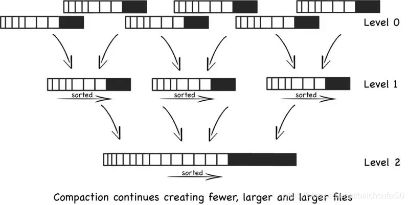

##### 11.5.3.2 写入

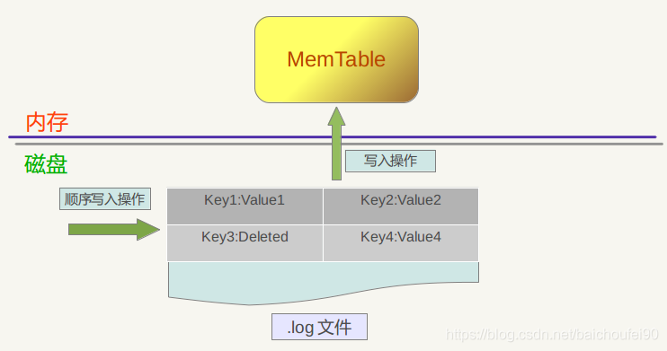
对应于使用LSM的LevelDB来说，对于一个写操作流程如下：

1. 先写入WAL文件，这个过程是追加的方式顺序写磁盘
2. key-value数据写入到MemTable（往往是SkipList实现）中
3. 当MemTable达到一定的限制后，这部分转成immutable MemTable（不可写，只读）
4. 当Immutable MemTable达到一定限制，将flush到磁盘中，即SSTable
5. SSTable再定期进行compaction操作

##### 11.5.3.3 更新

更新操作其实并不真正存在，和写入一个 k-v 数据没有什么不同，只是在读取的时候，会从 Level0 层的 SSTable 文件开始查找数据，数据在低层的 SSTable 文件中必然比高层的文件中要新，所以总能读取到最新的那条数据。也就是说此时在整个 LSM 的多个树中可能会同时存在多个 key 值相同的数据，只有在之后合并 SSTable 文件的时候，才会将旧的值删除。

##### 11.5.3.4 删除

删除一条记录的操作比较特殊，并不立即将数据从文件中删除，而是记录下对这个 key 的删除操作标记，同插入操作相同，插入操作插入的是 k-v 值，而删除操作插入的是 k-del 标记（墓碑），只有当合并 SSTable 文件时才会真正的删除。

##### 11.5.3.5 合并

当数据不断从 Immutable Memtable 序列化到磁盘上的 SSTable 文件中时，SSTable 文件的数量就不断增加，而且其中可能有很多更新和删除操作并不立即对文件进行操作，而只是存储一个操作记录，这就造成了整个 LSM Tree 中可能有大量相同 key 值的数据，占据了磁盘空间。

为了节省磁盘空间占用，控制 SSTable 文件数量，需要将多个 SSTable 文件进行合并，生成一个新的 SSTable 文件。比如说有 5 个 10 行的 SSTable 文件要合并成 1 个 50 行的 SSTable 文件，但是其中可能有 key 值重复的数据，我们只需要保留其中最新的一条即可，这个时候新生成的 SSTable 可能只有 40 行记录。

通常在使用过程中我们采用分级合并的方法，其特点如下：
**每一层都包含大量 SSTable 文件，key 值范围不重复**，这样查询操作只需要查询这一层的一个文件即可。(第一层比较特殊，key 值可能落在多个文件中，并不适用于此特性）
当一层的文件达到指定数量后，其中的一个文件会被合并进入上一层的文件中。

##### 11.5.3.6 读取

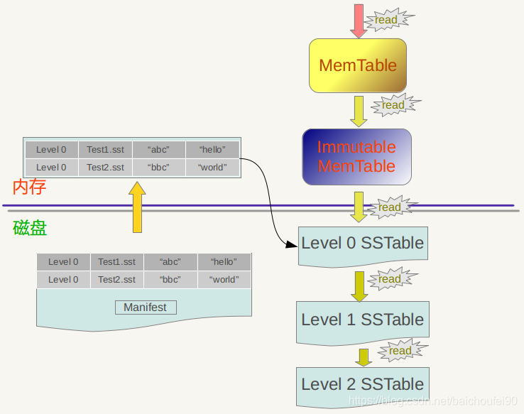
LSM Tree 的读取效率并不高，当需要读取指定 key 的数据时，先在内存中的 MemTable 和 Immutable MemTable 中查找，如果没有找到，则继续从 Level 0 层开始，找不到就从更高层的 SSTable 文件中查找，如果查找失败，说明整个 LSM Tree 中都不存在这个 key 的数据。如果中间在任何一个地方找到这个 key 的数据，那么按照这个路径找到的数据都是最新的。

在每一层的 SSTable 文件的 key 值范围是不重复的，所以只需要查找其中一个 SSTable 文件即可确定指定 key 的数据是否存在于这一层中。**Level 0 层比较特殊，因为数据是 Immutable MemTable 直接写入此层的，所以 Level 0 层的 SSTable 文件的 key 值范围可能存在重复，查找数据时有可能需要查找多个文件。**

##### 11.5.3.7 优化读取

因为这样的读取效率非常差，通常会进行一些优化，例如 LevelDB 中的 Mainfest 文件，这个文件记录了 SSTable 文件的一些关键信息，例如 Level 层数，文件名，最小 key 值，最大 key 值等，这个文件通常不会太大，可以放入内存中，可以帮助快速定位到要查询的 SSTable 文件，避免频繁读取。

另外一个经常使用的方法是布隆解析器(Bloom filter)，布隆解析器是一个使用内存判断文件是否包含一个关键字的有效方法。

##### 11.5.3.8 小结

由于时间序列数据库的特性，运用 LSM Tree 的算法非常合适。持续写入数据量大，数据和时间相关，编码到 key 值中很容易使 key 值有序。读取操作相对来说较少，而且通常不是读取单个 key 的值，而是一段时间范围内的数据，这样就把 LSM Tree 读取性能差的劣势缩小了，反而由于数据在 SSTable 中是按照 key 值顺序排列，读取大块连续的数据时效率也很高。

#### 11.5.4 Cassandra

LSM Tree的树节点可以分为两种：

- 保存在内存中的称之为MemTable,
- 保存在磁盘上的称之为SSTable.


- 写操作写入内存中MemTable，效率很高
- 每层SSTable文件到达一定条件后，进行合并操作，然后上移到更高层。合并操作在实现上一般是策略驱动、可插件化的。比如Cassandra的合并策略可以选择`SizeTieredCompactionStrategy`或`LeveledCompactionStrategy`。
- SSTable合并

1. SSTable合并策略为归并排序
2. 按key合并
3. 合并到高层可能对应到多个文件，写放大
4. Cassandra提供了策略进行合并文件的选择，还提供了合并时I/O的限制，以期减少合并操作对上层业务的影响

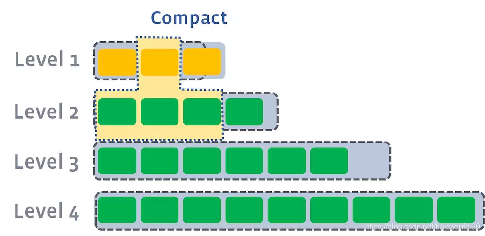

- 读
  读的时候和前面提到的HBase思想类似

1. 也是先读内存中的MemTable
2. 如果第一步没找到，就去覆盖该key range的所有SStable遍历查找
3. 第二部效率低，但能加入布隆过滤器，可以非精确地判断key是不是在某个结SSTable中，存在一定假阳性。

#### 11.5.5 Kudu

本小节内容转自以下地址：
链接：http://www.imooc.com/article/256564
作者：慕虎7371278
来源：慕课网

Kudu支持OLAP和OLTP。为了更好的支持OLAP，Kudu对LSM做了一些优化。

Kudu中的LSM-MemTable实现叫MemRowSet，SSTable的实现叫DisRowSet(列式存储)。对于列式存储，读取一个记录需要分别读每个字段，因此kudu精心设计了RowSet中的索引(针对并发访问等改进过的B树)，加速这个过程。

除了列式存储，Kudu还保证一个key只可能出现在一个RowSet中，并分别记录了RowSet的最大值和最小值，有利于范围查找。

这也意味着，对于数据更新，不能再像之前一样直接插入MemTable即可。需要找到对应的RowSet去更新，为了保持写吞吐，kudu并不直接更新RowSet，而是又新建一个DeltaStore，专门记录数据的更新。所以，后台除了RowSet的Compaction线程，还要对DeltaStore进行merge和apply。从权衡的角度考虑，Kudu其实是牺牲了一点写效率和单记录查询效率，换取了批量查询效率。

#### 11.5.4 其他

[RocksDB](http://www.importnew.com/28083.html)

## 0x12 一些好文

[漫画：什么是红黑树？](https://zhuanlan.zhihu.com/p/31805309)

[【数据结构和算法05】 红-黑树（看完包懂~）](https://blog.csdn.net/eson_15/article/details/51144079)

[日志结构的合并树 The Log-Structured Merge-Tree](https://www.cnblogs.com/siegfang/archive/2013/01/12/lsm-tree.html)

[Log Structured Merge Trees(LSM) 原理](http://www.open-open.com/lib/view/open1424916275249.html#articleHeader6)

[详解SSTable结构和LSMTree索引](http://www.cnblogs.com/fxjwind/archive/2012/08/14/2638371.html])

[LSM Tree 学习笔记](http://blog.fatedier.com/2016/06/15/learn-lsm-tree/)

[LSM树的不同实现介绍](https://baijiahao.baidu.com/s?id=1589387471738877114&wfr=spider&for=pc)

[LSM树原理、应用与优化-浅谈大数据原理(二)](https://blog.csdn.net/baichoufei90/article/details/LSM树原理、应用与优化-浅谈大数据原理(二))

## 0xFF 参考文档

[AVL树，红黑树，B树，B+树，Trie树都分别应用在哪些现实场景中？](https://www.zhihu.com/question/30527705)

[漫画：什么是红黑树？](https://zhuanlan.zhihu.com/p/31805309)

[B树、B+树、红黑树、AVL树比较](https://www.cnblogs.com/chengdabelief/p/7384691.html)

[B树和B+树的总结](http://www.cnblogs.com/George1994/p/7008732.html)

[ConcurrentHashMap与红黑树实现分析Java8](https://www.jianshu.com/p/b7dda385f83d)

[2-3树与2-3-4树](https://blog.csdn.net/qq_25940921/article/details/82183601)

[【数据结构和算法06】2-3-4树](https://blog.csdn.net/eson_15/article/details/51140009)

[B+树的实现](https://blog.csdn.net/xinghongduo/article/details/7059459)

[浅谈AVL树,红黑树,B树,B+树原理及应用](https://blog.csdn.net/whoamiyang/article/details/51926985)

[SSD固态硬盘的结构和基本工作原理概述](https://blog.csdn.net/lyon_yong/article/details/79178794)

[举例讲解B+树与LSM树的区别与联系](https://www.2cto.com/database/201805/749826.html)

[The Log-Structured Merge-Tree (LSM-Tree) 论文](http://citeseerx.ist.psu.edu/viewdoc/download?doi=10.1.1.44.2782&rep=rep1&type=pdf)

[LSM-tree 一种高效的索引数据结构](http://bofang.iteye.com/blog/1676698)

[日志结构的合并树 The Log-Structured Merge-Tree](https://www.cnblogs.com/siegfang/archive/2013/01/12/lsm-tree.html)

[InfluxDB引擎浅析](https://segmentfault.com/a/1190000005977485)

[知乎-关于LSM树](https://www.zhihu.com/question/19887265/answer/365078623)

[LSM Tree/MemTable/SSTable基本原理](https://www.jianshu.com/p/7c62e5f3b24b)

[B树、B+树、LSM树以及其典型应用场景](https://blog.csdn.net/u010853261/article/details/78217823)

[LSM树的不同实现介绍](https://baijiahao.baidu.com/s?id=1589387471738877114&wfr=spider&for=pc)

[LSM树原理、应用与优化-浅谈大数据原理(二)](http://www.imooc.com/article/256564)

[Trie树（字典树，前缀树，键树）分析详解](https://blog.csdn.net/hyman_yx/article/details/54410619)