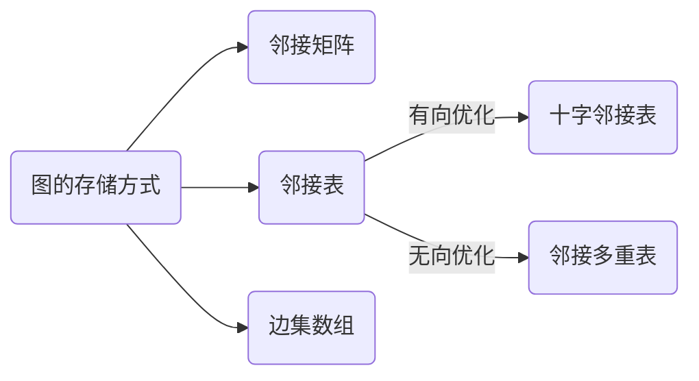

## 图的存储与操作



#### 树与图的存储

树是一种特殊的图，与图的存储方式相同。
对于无向图中的边ab，存储两条有向边a->b, b->a。
因此我们可以只考虑有向图的存储。

(1) 邻接矩阵：g[a][b] 存储边a->b

(2) 邻接表：

```c++
// 对于每个点k，开一个单链表，存储k所有可以走到的点。h[k]存储这个单链表的头结点
//e[idx]代表边，e[k]存储一个点，ne[]存储e[]的下标dix
int h[N], e[N], ne[N], idx;

// 添加一条边a->b
void add(int a, int b)
{
    e[idx] = b, ne[idx] = h[a], h[a] = idx ++ ;
}

// 初始化
idx = 0;
memset(h, -1, sizeof h);
```

#### 树与图的遍历

- 时间复杂度 O(n+m), n表示点数，m 表示边数

##### (1) 深度优先遍历 —— 模板题 [AcWing 846. 树的重心](https://www.acwing.com/problem/content/848/)

```
int dfs(int u)
{
    st[u] = true; // st[u] 表示点u已经被遍历过

    for (int i = h[u]; i != -1; i = ne[i])
    {
        int j = e[i];
        if (!st[j]) dfs(j);
    }
}
```

- 例题：846. 树的重心 

给定一颗树，树中包含n个结点（编号1~n）和n-1条无向边。

请你找到树的重心，并输出将重心删除后，剩余各个连通块中点数的最大值。

重心定义：重心是指树中的一个结点，如果将这个点删除后，剩余各个连通块中点数的最大值最小，那么这个节点被称为树的重心。

-  输入格式

第一行包含整数n，表示树的结点数。

接下来n-1行，每行包含两个整数a和b，表示点a和点b之间存在一条边。

- 输出格式

输出一个整数m，表示将重心删除后，剩余各个连通块中点数的最大值。

- 数据范围

1≤n≤10^5^

- 输入样例

```
9
1 2
1 7
1 4
2 8
2 5
4 3
3 9
4 6
```

- 输出样例：

```
4
```

- 题解

```c++
#include<iostream>
#include<cstring>
using namespace std;

const int N = 1e5+10;
const int M = N*2;

int h[N],e[M],ne[M],idx;
int n;
bool st[N];

int ans=N;

void add(int a,int b){
    e[idx]=b;
    ne[idx]=h[a];
    h[a]=idx++;
    
}

int dfs(int u){
    st[u]=true;
    int sum=1;
    int res=0;
    for(int i=h[u];i!=-1;i=ne[i]){
        int j=e[i];
        if(!st[j]){
            int s=dfs(j);
            res =max(res,s);
            sum +=s;
        }
    }
    res =max(res,n-sum);
    ans =min(ans,res);
    
    return sum;
    
    
}


int main(int argc,char* argv[]){
    memset(h,-1,sizeof h);
    cin>>n;
    for(int i=0 ; i<n-1 ;i++){
        int a,b;
        cin>>a>>b;
        add(a,b),add(b,a);
    }
    
    dfs(1);
    
    cout<<ans<<endl;
    
    return 0;
    
}
```


```c++
#include <iostream>
#include <algorithm>
#include <cstring>

using namespace std;

const int N = 1e5 + 10; //数据范围是10的5次方
const int M = 2 * N; //以有向图的格式存储无向图，所以每个节点至多对应2n-2条边

int h[N]; //邻接表存储树，有n个节点，所以需要n个队列头节点
int e[M]; //存储元素
int ne[M]; //存储列表的next值
int idx; //单链表指针
int n; //题目所给的输入，n个节点
int ans = N; //表示重心的所有的子树中，最大的子树的结点数目

bool st[N]; //记录节点是否被访问过，访问过则标记为true

//a所对应的单链表中插入b  a作为根 
void add(int a, int b) {
    e[idx] = b, ne[idx] = h[a], h[a] = idx++;
}

// dfs 框架
/*
void dfs(int u){
    st[u]=true; // 标记一下，记录为已经被搜索过了，下面进行搜索过程
    for(int i=h[u];i!=-1;i=ne[i]){
        int j=e[i];
        if(!st[j]) {
            dfs(j);
        }
    }
}
*/

//返回以u为根的子树中节点的个数，包括u节点
int dfs(int u) {
    int res = 0; //存储 删掉某个节点之后，最大的连通子图节点数
    st[u] = true; //标记访问过u节点
    int sum = 1; //存储 以u为根的树 的节点数, 包括u，如图中的4号节点

    //访问u的每个子节点
    for (int i = h[u]; i != -1; i = ne[i]) {
        int j = e[i];
        //因为每个节点的编号都是不一样的，所以 用编号为下标 来标记是否被访问过
        if (!st[j]) {
            int s = dfs(j);  // u节点的单棵子树节点数 如图中的size值
            res = max(res, s); // 记录最大联通子图的节点数
            sum += s; //以j为根的树 的节点数
        }
    }

    //n-sum 如图中的n-size值，不包括根节点4；
    res = max(res, n - sum); // 选择u节点为重心，最大的 连通子图节点数
    ans = min(res, ans); //遍历过的假设重心中，最小的最大联通子图的 节点数
    return sum;
}

int main() {
    memset(h, -1, sizeof h); //初始化h数组 -1表示尾节点
    cin >> n; //表示树的结点数

    // 题目接下来会输入，n-1行数据，
    // 树中是不存在环的，对于有n个节点的树，必定是n-1条边
    for (int i = 0; i < n - 1; i++) {
        int a, b;
        cin >> a >> b;
        add(a, b), add(b, a); //无向图
    }

    dfs(1); //可以任意选定一个节点开始 u<=n

    cout << ans << endl;

    return 0;
}
```


##### (2) 宽度优先遍历 —— 模板题 [AcWing 847. 图中点的层次](https://www.acwing.com/problem/content/849/)

```
queue<int> q;
st[1] = true; // 表示1号点已经被遍历过
q.push(1);

while (q.size())
{
    int t = q.front();
    q.pop();

    for (int i = h[t]; i != -1; i = ne[i])
    {
        int j = e[i];
        if (!st[j])
        {
            st[j] = true; // 表示点j已经被遍历过
            q.push(j);
        }
    }
}
```

- 例题： \847. 图中点的层次 

给定一个n个点m条边的有向图，图中可能存在重边和自环。

所有边的长度都是1，点的编号为1~n。

请你求出1号点到n号点的最短距离，如果从1号点无法走到n号点，输出-1。

- 输入格式

第一行包含两个整数n和m。

接下来m行，每行包含两个整数a和b，表示存在一条从a走到b的长度为1的边。

输出格式

输出一个整数，表示1号点到n号点的最短距离。

- 数据范围

1≤n,m≤1051≤n,m≤105

 输入样例：

```
4 5
1 2
2 3
3 4
1 3
1 4
```

-  输出样例：

```
1
```

- 题解：

  ```c++
  #include<iostream>
  #include<cstring>
  #include<queue>
  using namespace std;
  
  const int N=1e5+10;
  int h[N],e[N],ne[N],idx;
  int d[N];
  
  void add(int a,int b){
      e[idx]=b,ne[idx]=h[a],h[a]=idx++;
  }
  
  int main(){
   	memset(h,-1,sizeof h);
      int n,m;
      cin>>n>>m;
      for(int i=0;i<m;i++){
          int a,b;
          cin>>a>>b;
          add(a,b),add(b,a);
      }
      
      queue<int> q;
      memset(d,-1,sizeof d);
      d[1]=0;
      q.push(1);
      
      while(q.size()){
          int t=q.front();
          q.pop();
          for(int i=h[t];i!=-1;i=ne[i]){
              int j=e[i];
              if(d[j]==-1){
                  d[j]=d[t]+1;
                  q.push(j);
                  cout<<j<<" "<<d[j]<<endl;
              }
          }
      }
      
      cout<<d[n]<<endl;
      
      return 0;
      
      
      
  }
  
  ```

- 数组模拟队列解法：

  ```c++
  #include<iostream>
  #include<cstring>
  using namespace std;
  
  const int N = 1e5+10;
  int h[N],e[N],ne[N],idx;
  int d[N];
  int q[N];
  int n,m;
  
  void add(int a,int b){
      e[idx]=b,ne[idx]=h[a],h[a]=idx++;
  }
  
  int bfs(){
      memset(d,-1,sizeof d);
      d[1]=0;
      
      int hh=0,tt=-1;
      
      q[++tt]=1;
      
      while(hh<=tt){
          int t=q[hh++];
          for(int i=h[t];i!=-1;i=ne[i]){
              int j=e[i];
              if(d[j]==-1){
                  d[j]=d[t]+1;
                  q[++tt]=j;
              }
          }
          
      }
      
      return d[n];
      
  }
  
  int main(){
      memset(h,-1,sizeof h);
      cin>>n>>m;
      
      for(int i=0;i<m;i++){
          int a,b;
          cin>>a>>b;
          add(a,b);
      }
      
      cout<<bfs()<<endl;
      
      return 0;
      
  }
  ```

- 数组模拟队列+scanf解法

  ```c++
  #include<iostream>
  #include<cstring>
  #include<stdio.h>
  using namespace std;
  
  const int N = 1e5+10;
  int h[N],e[N],ne[N],idx;
  int d[N];
  int q[N];
  int n,m;
  
  void add(int a,int b){
      e[idx]=b,ne[idx]=h[a],h[a]=idx++;
  }
  
  int bfs(){
      memset(d,-1,sizeof d);
      d[1]=0;
      
      int hh=0,tt=-1;
      
      q[++tt]=1;
      
      while(hh<=tt){
          int t=q[hh++];
          for(int i=h[t];i!=-1;i=ne[i]){
              int j=e[i];
              if(d[j]==-1){
                  d[j]=d[t]+1;
                  q[++tt]=j;
              }
          }
          
      }
      
      return d[n];
      
  }
  
  int main(){
      memset(h,-1,sizeof h);
      scanf("%d%d",&n,&m);
      
      for(int i=0;i<m;i++){
          int a,b;
          scanf("%d%d",&a,&b);
          add(a,b);
      }
      
      cout<<bfs()<<endl;
      
      return 0;
      
  }
  ```

  


