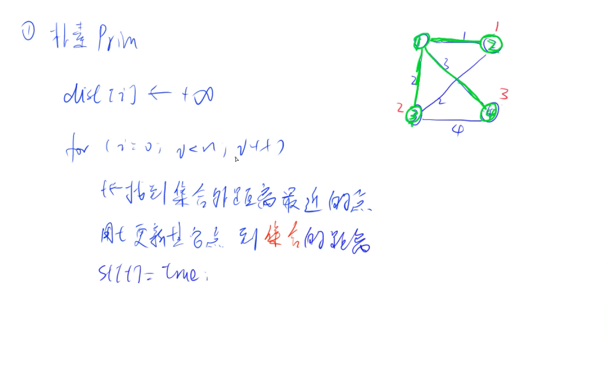

## 图的存储与操作


#### 树与图的存储

树是一种特殊的图，与图的存储方式相同。
对于无向图中的边ab，存储两条有向边a->b, b->a。
因此我们可以只考虑有向图的存储。

(1) 邻接矩阵：g[a][b] 存储边a->b

(2) 邻接表：

```c++
// 对于每个点k，开一个单链表，存储k所有可以走到的点。h[k]存储这个单链表的头结点
//e[idx]代表边，e[k]存储一个点，ne[]存储e[]的下标dix
int h[N], e[N], ne[N], idx;

// 添加一条边a->b
void add(int a, int b)
{
    e[idx] = b, ne[idx] = h[a], h[a] = idx ++ ;
}

// 初始化
idx = 0;
memset(h, -1, sizeof h);
```

#### 树与图的遍历

- 时间复杂度 O(n+m), n表示点数，m 表示边数

##### (1) 深度优先遍历 —— 模板题 [AcWing 846. 树的重心](https://www.acwing.com/problem/content/848/)

```
int dfs(int u)
{
    st[u] = true; // st[u] 表示点u已经被遍历过

    for (int i = h[u]; i != -1; i = ne[i])
    {
        int j = e[i];
        if (!st[j]) dfs(j);
    }
}
```

- 例题：846. 树的重心 

给定一颗树，树中包含n个结点（编号1~n）和n-1条无向边。

请你找到树的重心，并输出将重心删除后，剩余各个连通块中点数的最大值。

重心定义：重心是指树中的一个结点，如果将这个点删除后，剩余各个连通块中点数的最大值最小，那么这个节点被称为树的重心。

-  输入格式

第一行包含整数n，表示树的结点数。

接下来n-1行，每行包含两个整数a和b，表示点a和点b之间存在一条边。

- 输出格式

输出一个整数m，表示将重心删除后，剩余各个连通块中点数的最大值。

- 数据范围

1≤n≤10^5^

- 输入样例

```
9
1 2
1 7
1 4
2 8
2 5
4 3
3 9
4 6
```

- 输出样例：

```
4
```

- 题解

```c++
#include<iostream>
#include<cstring>
using namespace std;

const int N = 1e5+10;
const int M = N*2;

int h[N],e[M],ne[M],idx;
int n;
bool st[N];

int ans=N;

void add(int a,int b){
    e[idx]=b;
    ne[idx]=h[a];
    h[a]=idx++;
    
}

int dfs(int u){
    st[u]=true;
    int sum=1;
    int res=0;
    for(int i=h[u];i!=-1;i=ne[i]){
        int j=e[i];
        if(!st[j]){
            int s=dfs(j);
            res =max(res,s);
            sum +=s;
        }
    }
    res =max(res,n-sum);
    ans =min(ans,res);
    
    return sum;
    
    
}


int main(int argc,char* argv[]){
    memset(h,-1,sizeof h);
    cin>>n;
    for(int i=0 ; i<n-1 ;i++){
        int a,b;
        cin>>a>>b;
        add(a,b),add(b,a);
    }
    
    dfs(1);
    
    cout<<ans<<endl;
    
    return 0;
    
}
```


```c++
#include <iostream>
#include <algorithm>
#include <cstring>

using namespace std;

const int N = 1e5 + 10; //数据范围是10的5次方
const int M = 2 * N; //以有向图的格式存储无向图，所以每个节点至多对应2n-2条边

int h[N]; //邻接表存储树，有n个节点，所以需要n个队列头节点
int e[M]; //存储元素
int ne[M]; //存储列表的next值
int idx; //单链表指针
int n; //题目所给的输入，n个节点
int ans = N; //表示重心的所有的子树中，最大的子树的结点数目

bool st[N]; //记录节点是否被访问过，访问过则标记为true

//a所对应的单链表中插入b  a作为根 
void add(int a, int b) {
    e[idx] = b, ne[idx] = h[a], h[a] = idx++;
}

// dfs 框架
/*
void dfs(int u){
    st[u]=true; // 标记一下，记录为已经被搜索过了，下面进行搜索过程
    for(int i=h[u];i!=-1;i=ne[i]){
        int j=e[i];
        if(!st[j]) {
            dfs(j);
        }
    }
}
*/

//返回以u为根的子树中节点的个数，包括u节点
int dfs(int u) {
    int res = 0; //存储 删掉某个节点之后，最大的连通子图节点数
    st[u] = true; //标记访问过u节点
    int sum = 1; //存储 以u为根的树 的节点数, 包括u，如图中的4号节点

    //访问u的每个子节点
    for (int i = h[u]; i != -1; i = ne[i]) {
        int j = e[i];
        //因为每个节点的编号都是不一样的，所以 用编号为下标 来标记是否被访问过
        if (!st[j]) {
            int s = dfs(j);  // u节点的单棵子树节点数 如图中的size值
            res = max(res, s); // 记录最大联通子图的节点数
            sum += s; //以j为根的树 的节点数
        }
    }

    //n-sum 如图中的n-size值，不包括根节点4；
    res = max(res, n - sum); // 选择u节点为重心，最大的 连通子图节点数
    ans = min(res, ans); //遍历过的假设重心中，最小的最大联通子图的 节点数
    return sum;
}

int main() {
    memset(h, -1, sizeof h); //初始化h数组 -1表示尾节点
    cin >> n; //表示树的结点数

    // 题目接下来会输入，n-1行数据，
    // 树中是不存在环的，对于有n个节点的树，必定是n-1条边
    for (int i = 0; i < n - 1; i++) {
        int a, b;
        cin >> a >> b;
        add(a, b), add(b, a); //无向图
    }

    dfs(1); //可以任意选定一个节点开始 u<=n

    cout << ans << endl;

    return 0;
}
```


##### (2) 宽度优先遍历 —— 模板题 [AcWing 847. 图中点的层次](https://www.acwing.com/problem/content/849/)

```
queue<int> q;
st[1] = true; // 表示1号点已经被遍历过
q.push(1);

while (q.size())
{
    int t = q.front();
    q.pop();

    for (int i = h[t]; i != -1; i = ne[i])
    {
        int j = e[i];
        if (!st[j])
        {
            st[j] = true; // 表示点j已经被遍历过
            q.push(j);
        }
    }
}
```

- 例题： \847. 图中点的层次 

给定一个n个点m条边的有向图，图中可能存在重边和自环。

所有边的长度都是1，点的编号为1~n。

请你求出1号点到n号点的最短距离，如果从1号点无法走到n号点，输出-1。

- 输入格式

第一行包含两个整数n和m。

接下来m行，每行包含两个整数a和b，表示存在一条从a走到b的长度为1的边。

输出格式

输出一个整数，表示1号点到n号点的最短距离。

- 数据范围

1≤n,m≤1051≤n,m≤105

 输入样例：

```
4 5
1 2
2 3
3 4
1 3
1 4
```

-  输出样例：

```
1
```

- 题解：

  ```c++
  #include<iostream>
  #include<cstring>
  #include<queue>
  using namespace std;
  
  const int N=1e5+10;
  int h[N],e[N],ne[N],idx;
  int d[N];
  
  void add(int a,int b){
      e[idx]=b,ne[idx]=h[a],h[a]=idx++;
  }
  
  int main(){
   	memset(h,-1,sizeof h);
      int n,m;
      cin>>n>>m;
      for(int i=0;i<m;i++){
          int a,b;
          cin>>a>>b;
          add(a,b),add(b,a);
      }
      
      queue<int> q;
      memset(d,-1,sizeof d);
      d[1]=0;
      q.push(1);
      
      while(q.size()){
          int t=q.front();
          q.pop();
          for(int i=h[t];i!=-1;i=ne[i]){
              int j=e[i];
              if(d[j]==-1){
                  d[j]=d[t]+1;
                  q.push(j);
                  cout<<j<<" "<<d[j]<<endl;
              }
          }
      }
      
      cout<<d[n]<<endl;
      
      return 0;
      
      
      
  }
  
  ```

- 数组模拟队列解法：

  ```c++
  #include<iostream>
  #include<cstring>
  using namespace std;
  
  const int N = 1e5+10;
  int h[N],e[N],ne[N],idx;
  int d[N];
  int q[N];
  int n,m;
  
  void add(int a,int b){
      e[idx]=b,ne[idx]=h[a],h[a]=idx++;
  }
  
  int bfs(){
      memset(d,-1,sizeof d);
      d[1]=0;
      
      int hh=0,tt=-1;
      
      q[++tt]=1;
      
      while(hh<=tt){
          int t=q[hh++];
          for(int i=h[t];i!=-1;i=ne[i]){
              int j=e[i];
              if(d[j]==-1){
                  d[j]=d[t]+1;
                  q[++tt]=j;
              }
          }
          
      }
      
      return d[n];
      
  }
  
  int main(){
      memset(h,-1,sizeof h);
      cin>>n>>m;
      
      for(int i=0;i<m;i++){
          int a,b;
          cin>>a>>b;
          add(a,b);
      }
      
      cout<<bfs()<<endl;
      
      return 0;
      
  }
  ```

- 数组模拟队列+scanf解法

  ```c++
  #include<iostream>
  #include<cstring>
  #include<stdio.h>
  using namespace std;
  
  const int N = 1e5+10;
  int h[N],e[N],ne[N],idx;
  int d[N];
  int q[N];
  int n,m;
  
  void add(int a,int b){
      e[idx]=b,ne[idx]=h[a],h[a]=idx++;
  }
  
  int bfs(){
      memset(d,-1,sizeof d);
      d[1]=0;
      
      int hh=0,tt=-1;
      
      q[++tt]=1;
      
      while(hh<=tt){
          int t=q[hh++];
          for(int i=h[t];i!=-1;i=ne[i]){
              int j=e[i];
              if(d[j]==-1){
                  d[j]=d[t]+1;
                  q[++tt]=j;
              }
          }
          
      }
      
      return d[n];
      
  }
  
  int main(){
      memset(h,-1,sizeof h);
      scanf("%d%d",&n,&m);
      
      for(int i=0;i<m;i++){
          int a,b;
          scanf("%d%d",&a,&b);
          add(a,b);
      }
      
      cout<<bfs()<<endl;
      
      return 0;
      
  }
  ```

  


## 最短路算法

#### **分类：**


#### 1.朴素dijstra算法


- **模板：**

- 朴素dijkstra算法 —— 模板题 

- **时间复杂是 O(n2+m)O(n2+m), nn 表示点数，mm 表示边数**

```c++
int g[N][N];  // 存储每条边
int dist[N];  // 存储1号点到每个点的最短距离
bool st[N];   // 存储每个点的最短路是否已经确定

// 求1号点到n号点的最短路，如果不存在则返回-1
int dijkstra()
{
    memset(dist, 0x3f, sizeof dist);
    dist[1] = 0;

    for (int i = 0; i < n - 1; i ++ )
    {
        int t = -1;     // 在还未确定最短路的点中，寻找距离最小的点
        for (int j = 1; j <= n; j ++ )
            if (!st[j] && (t == -1 || dist[t] > dist[j]))
                t = j;

        // 用t更新其他点的距离
        for (int j = 1; j <= n; j ++ )
            dist[j] = min(dist[j], dist[t] + g[t][j]);

        st[t] = true;
    }

    if (dist[n] == 0x3f3f3f3f) return -1;
    return dist[n];
}
```

- **例题：**[AcWing 849. Dijkstra求最短路 I](https://www.acwing.com/problem/content/851/)

- 给定一个n个点m条边的有向图，图中可能存在重边和自环，所有边权均为正值。

  请你求出1号点到n号点的最短距离，如果无法从1号点走到n号点，则输出-1。

  **输入格式**

  第一行包含整数n和m。

  接下来m行每行包含三个整数x，y，z，表示存在一条从点x到点y的有向边，边长为z。

   **输出格式**

  输出一个整数，表示1号点到n号点的最短距离。

  如果路径不存在，则输出-1。

   **数据范围**

  1≤n≤500
  1≤m≤10^5^
  图中涉及边长均不超过10000。

   **输入样例：**

  ```
  3 3
  1 2 2
  2 3 1
  1 3 4
  ```

   **输出样例：**

  ```
  3
  ```

- **题解：**

  ```c++
  #include<iostream>
  #include<stdio.h>
  #include<cstring>
  using namespace std;
  
  const int N = 505;
  int g[N][N];
  int dist[N];
  bool st[N];
  int n,m;
  
  int dijkstra(){
      memset(dist,0x3f,sizeof dist);
      dist[1]=0;
      
      for(int i=0;i<n;i++){
          int t =-1;
          for(int j=1;j<=n;j++){
              if(!st[j]&&(t==-1 ||dist[t]>dist[j])){
                  t=j;
              }
          }
          
          for(int j=1;j<=n;j++){
              dist[j]=min(dist[j],dist[t]+g[t][j]);
              
          }
          st[t]=true;
      }
      if(dist[n]==0x3f3f3f3f){return -1;}
      else{return dist[n];}
      
  }
  
  int main(){
      memset(g,0x3f,sizeof g);
      scanf("%d%d",&n,&m);
      for(int i=0;i<m;i++){
          int x,y,z;
          scanf("%d%d%d",&x,&y,&z);
          g[x][y]=min(g[x][y],z);
          
      }
      
      cout<<dijkstra()<<endl;
      return 0;
      
  }
  ```

  


#### 2. 堆优化版dijkstra


-  时间复杂度 O(mlogn)O(mlogn), nn 表示点数，mm 表示边数

```c++
typedef pair<int, int> PII;

int n;      // 点的数量
int h[N], w[N], e[N], ne[N], idx;       // 邻接表存储所有边
int dist[N];        // 存储所有点到1号点的距离
bool st[N];     // 存储每个点的最短距离是否已确定

// 求1号点到n号点的最短距离，如果不存在，则返回-1
int dijkstra()
{
    memset(dist, 0x3f, sizeof dist);
    dist[1] = 0;
    priority_queue<PII, vector<PII>, greater<PII>> heap;
    heap.push({0, 1});      // first存储距离，second存储节点编号

    while (heap.size())
    {
        auto t = heap.top();
        heap.pop();

        int ver = t.second, distance = t.first;

        if (st[ver]) continue;
        st[ver] = true;

        for (int i = h[ver]; i != -1; i = ne[i])
        {
            int j = e[i];
            if (dist[j] > distance + w[i])
            {
                dist[j] = distance + w[i];
                heap.push({dist[j], j});
            }
        }
    }

    if (dist[n] == 0x3f3f3f3f) return -1;
    return dist[n];
}
```

- 模板题 [AcWing 850. Dijkstra求最短路 II](https://www.acwing.com/problem/content/852/)

给定一个n个点m条边的有向图，图中可能存在重边和自环，所有边权均为非负值。

请你求出1号点到n号点的最短距离，如果无法从1号点走到n号点，则输出-1。

-  输入格式

第一行包含整数n和m。

接下来m行每行包含三个整数x，y，z，表示存在一条从点x到点y的有向边，边长为z。

-  输出格式

输出一个整数，表示1号点到n号点的最短距离。

如果路径不存在，则输出-1。

-  数据范围

1≤n,m≤1.5×10^5^
图中涉及边长均不小于0，且不超过10000。

-  输入样例：

```
3 3
1 2 2
2 3 1
1 3 4
```

-  输出样例：

```
3
```

- 题解：

  ```c++
  #include<iostream>
  #include<cstring>
  #include<stdio.h>
  #include<queue>
  using namespace std;
  
  const int N = 1.5e5+10;
  int n,m;
  int h[N],e[N],w[N],ne[N],idx;
  bool st[N];
  int dist[N];
  typedef pair<int ,int> PII;
  
  void add(int x,int y,int z){
      e[idx]=y;
      w[idx]=z;
      ne[idx]=h[x];
      h[x]=idx++;
      
  }
  
  int dijkstra(){
      memset(dist,0x3f,sizeof dist);
      dist[1]=0;
      priority_queue<PII,vector<PII>,greater<PII>> heap;
      heap.push({dist[1],1});
      
      while(heap.size()){
          auto t = heap.top();
          heap.pop();
          int ver = t.second, distance = t.first;
          if(st[ver]) { continue; }
          st[ver]=true;
          
          for(int i = h[ver];i!=-1;i=ne[i]){
              int j=e[i];
              if(dist[j]>distance+w[i]){
                  dist[j]=distance+w[i];
                  heap.push({dist[j],j});
              }
              
          }
          
      }
      
      
      if(dist[n]==0x3f3f3f3f) return -1;
      else return dist[n];
      
      
  }
  
  int main(int argc,char* argv[]){
  	memset(h,-1,sizeof h);
      memset(w,0x3f,sizeof w);
      cin>>n>>m;
      
      for(int i=0;i<m;i++){
  		int x,y,z;
          scanf("%d%d%d",&x,&y,&z);
          add(x,y,z);
      }
      
      cout<<dijkstra()<<endl;
      
      return 0;
      
  }
  
  ```

  

#### 3.bellman-ford算法（有边数限制的最短路）

- 随便存边
- 适用于有边数限制的最短路问题


-  Bellman-Ford算法

-  时间复杂度 O(nm)O(nm), nn 表示点数，mm 表示边数

-  注意在模板题中需要对下面的模板稍作修改，加上备份数组，详情见模板题。

```c++
int n, m;       // n表示点数，m表示边数int dist[N];        // dist[x]存储1到x的最短路距离struct Edge     // 边，a表示出点，b表示入点，w表示边的权重{    int a, b, w;}edges[M];// 求1到n的最短路距离，如果无法从1走到n，则返回-1。int bellman_ford(){    memset(dist, 0x3f, sizeof dist);    dist[1] = 0;    // 如果第n次迭代仍然会松弛三角不等式，就说明存在一条长度是n+1的最短路径，由抽屉原理，路径中至少存在两个相同的点，说明图中存在负权回路。    for (int i = 0; i < n; i ++ )    {        for (int j = 0; j < m; j ++ )        {            int a = edges[j].a, b = edges[j].b, w = edges[j].w;            if (dist[b] > dist[a] + w)                dist[b] = dist[a] + w;        }    }    if (dist[n] > 0x3f3f3f3f / 2) return -1;    return dist[n];}
```

- 模板题 [AcWing 853. 有边数限制的最短路](https://www.acwing.com/problem/content/855/)

给定一个n个点m条边的有向图，图中可能存在重边和自环， **边权可能为负数**。

请你求出从1号点到n号点的最多经过k条边的最短距离，如果无法从1号点走到n号点，输出impossible。

注意：图中可能 **存在负权回路** 。

-  输入格式

第一行包含三个整数n，m，k。

接下来m行，每行包含三个整数x，y，z，表示存在一条从点x到点y的有向边，边长为z。

-  输出格式

输出一个整数，表示从1号点到n号点的最多经过k条边的最短距离。

如果不存在满足条件的路径，则输出“impossible”。

-  数据范围

1≤n,k≤500
1≤m≤10000
任意边长的绝对值不超过10000。

-  输入样例：

```
3 3 11 2 12 3 11 3 3
```

-  输出样例：

```
3
```

- 题解：

```c++
#include<iostream>#include<cstring>#include<stdio.h>using namespace std;const int N=510;const int M=10010;int n,m,k;int dist[N],backup[N];struct edges{    int a,b,w;}edges[M];int bellman_ford(){    memset(dist,0x3f,sizeof dist);    dist[1]=0;    for(int i=0;i<k;i++){        memcpy(backup,dist,sizeof dist);        for(int j=0;j<m;j++){            int a=edges[j].a,b=edges[j].b,w=edges[j].w;            if(dist[b]>backup[a]+w){                dist[b]=backup[a]+w;            }        }    }        if(dist[n]>0x3f3f3f3f/2) return -1;    else return dist[n];    }int main(int argc,char* argv[]){    cin>>n>>m>>k;    for(int i=0;i<m;i++){        int a,b,w;        cin>>a>>b>>w;        edges[i]={a,b,w};            }           int t=bellman_ford();        if(t==-1) puts("impossible");    else cout<<t<<endl;        return 0;    }
```


####  4.spfa 算法（队列优化的Bellman-Ford算法） 


- 时间复杂度 平均情况下 O(m)O(m)，最坏情况下 O(nm)O(nm), nn 表示点数，mm 表示边数

```c++
int n;      // 总点数int h[N], w[N], e[N], ne[N], idx;       // 邻接表存储所有边int dist[N];        // 存储每个点到1号点的最短距离bool st[N];     // 存储每个点是否在队列中// 求1号点到n号点的最短路距离，如果从1号点无法走到n号点则返回-1int spfa(){    memset(dist, 0x3f, sizeof dist);    dist[1] = 0;    queue<int> q;    q.push(1);    st[1] = true;    while (q.size())    {        auto t = q.front();        q.pop();        st[t] = false;        for (int i = h[t]; i != -1; i = ne[i])        {            int j = e[i];            if (dist[j] > dist[t] + w[i])            {                dist[j] = dist[t] + w[i];                if (!st[j])     // 如果队列中已存在j，则不需要将j重复插入                {                    q.push(j);                    st[j] = true;                }            }        }    }    if (dist[n] == 0x3f3f3f3f) return -1;    return dist[n];}
```

- 模板题 [AcWing 851. spfa求最短路](https://www.acwing.com/problem/content/853/)

给定一个n个点m条边的有向图，图中可能存在重边和自环， **边权可能为负数**。

请你求出1号点到n号点的最短距离，如果无法从1号点走到n号点，则输出impossible。

数据保证不存在负权回路。

- 输入格式

第一行包含整数n和m。

接下来m行每行包含三个整数x，y，z，表示存在一条从点x到点y的有向边，边长为z。

- 输出格式

输出一个整数，表示1号点到n号点的最短距离。

如果路径不存在，则输出”impossible”。

- 数据范围

1≤n,m≤10^5^
图中涉及边长绝对值均不超过10000。

- 输入样例：

```
3 31 2 52 3 -31 3 4
```

- 输出样例：

```
2
```

- 题解：

  ```c++
  #include<iostream>#include<cstring>#include<queue>using namespace std;int n,m;const int N=1e5+10;int h[N],w[N],e[N],ne[N],idx;bool st[N];int dist[N];void add(int x,int y,int z){    e[idx]=y,w[idx]=z,ne[idx]=h[x],h[x]=idx++;}int spfa(){	memset(dist,0x3f,sizeof dist);    dist[1]=0;        queue<int>q;    q.push(1);    st[1]=true;        while(q.size()){        int t = q.front();        q.pop();        st[t]=false;                for(int i=h[t];i!=-1;i=ne[i]){            int j=e[i];            if(dist[j]>dist[t]+w[i]){                dist[j]=dist[t]+w[i];                if(!st[j]){                    q.push(j);                    st[j]=true;                }            }                    }             }      if(dist[n]==0x3f3f3f3f) return -1;        else return dist[n];}int main(int argc,char* argv[]){    memset(h,-1,sizeof h);        cin>>n>>m;    for(int i=0;i<m;i++){        int x,y,z;        cin>>x>>y>>z;        add(x,y,z);    }        int t = spfa();        if(t==-1){puts("impossible");}    else {cout<<t<<endl;}        return 0;}
  ```

  


#### 5.spfa判断图中是否存在负环


- 时间复杂度是 O(nm)O(nm), nn 表示点数，mm 表示边数

```c++
int n;      // 总点数int h[N], w[N], e[N], ne[N], idx;       // 邻接表存储所有边int dist[N], cnt[N];        // dist[x]存储1号点到x的最短距离，cnt[x]存储1到x的最短路中经过的点								//数							//假设dist[N]代表点N到虚拟源点的距离，且全部点到源点距离为0bool st[N];     // 存储每个点是否在队列中// 如果存在负环，则返回true，否则返回false。bool spfa(){    // 不需要初始化dist数组    // 原理：如果某条最短路径上有n个点（除了自己），那么加上自己之后一共有n+1个点，由抽屉原理一定有两个点相同，所以存在环。    queue<int> q;    for (int i = 1; i <= n; i ++ )    {        q.push(i);        st[i] = true;    }    while (q.size())    {        auto t = q.front();        q.pop();        st[t] = false;        for (int i = h[t]; i != -1; i = ne[i])        {            int j = e[i];            if (dist[j] > dist[t] + w[i])            {                dist[j] = dist[t] + w[i];                cnt[j] = cnt[t] + 1;                if (cnt[j] >= n) return true;       // 如果从1号点到x的最短路中包含至少n个点（不包括自己），则说明存在环                if (!st[j])                {                    q.push(j);                    st[j] = true;                }            }        }    }    return false;}
```

- 模板题 [AcWing 852. spfa判断负环](https://www.acwing.com/problem/content/854/)

  给定一个n个点m条边的有向图，图中可能存在重边和自环， **边权可能为负数**。

  请你判断图中是否存在负权回路。

  - 输入格式

  第一行包含整数n和m。

  接下来m行每行包含三个整数x，y，z，表示存在一条从点x到点y的有向边，边长为z。

  - 输出格式

  如果图中**存在**负权回路，则输出“Yes”，否则输出“No”。

  - 数据范围

  1≤n≤2000
  1≤m≤10000
  图中涉及边长绝对值均不超过10000。

  - 输入样例：

  ```
  3 31 2 -12 3 43 1 -4
  ```

  - 输出样例：

  ```
  Yes
  ```

- 题解：

  ```c++
  #include<iostream>#include<stdio.h>#include<cstring>#include<queue>using namespace std;const int N = 2010;int h[N],w[N],e[N],ne[N],idx;bool st[N];int n,m;int dist[N],cnt[N];void add(int a,int b,int c){    e[idx]=b,w[idx]=c,ne[idx]=h[a],h[a]=idx++;}bool spfa(){    memset(si)	queue<int>q;    for(int i = 1;i<=n;i++){    	q.push(i);        st[i]=true;    }        while(q.size()){        int t = q.front();        q.pop();        st[t]=false;                for(int i = h[t] ; i!=-1 ;i=ne[i]){            int j=e[i];            if(dist[j]>dist[t]+w[i]){                dist[j]=dist[t]+w[i];            	cnt[j]=cnt[t]+1;                if(cnt[j]>=n) return true;                if(!st[j]){                    q.push(j);                    st[j]=true;                }            }           }    }    return false;}int main(){	memset(h,-1,sizeof h );    cin>>n>>m;    for(int i=0;i<m;i++){        int a,b,c;        scanf("%d%d%d",&a,&b,&c);        add(a,b,c);            }            if (spfa()) puts("Yes");    else puts("No");        return 0;}
  ```

  ```c++
  #include<iostream>#include<stdio.h>#include<cstring>#include<queue>using namespace std;const int N = 2010;int h[N],w[N],e[N],ne[N],idx;bool st[N];int n,m;int dist[N],cnt[N];queue<int>q;void add(int a,int b,int c){    e[idx]=b,w[idx]=c,ne[idx]=h[a],h[a]=idx++;}bool spfa(){    memset(dist, 0x3f, sizeof dist);    for (int i = 1; i <= n; i++) {        q.push(i);        st[i] = true;    }    st[1] = true;    while (q.size()) {        int t = q.front();        q.pop();        st[t] = false;        for (int i = h[t]; i != -1; i = ne[i]) {            int j = e[i];            if (dist[j] > dist[t] + w[i]) {                dist[j] = dist[t] + w[i];                cnt[j] = cnt[t] + 1;                // 如果超过了n-1                 // 根据抽屉原理，说明经过某个节点两次，则说明有环                if (cnt[j] >= n) return true;                if (!st[j]) {                    st[j] = true;                    q.push(j);                }            }        }    }    return false;}int main(){	memset(h,-1,sizeof h );    cin>>n>>m;    for(int i=0;i<m;i++){        int a,b,c;        scanf("%d%d%d",&a,&b,&c);        add(a,b,c);            }            if (spfa()) puts("Yes");    else puts("No");        return 0;}
  ```

  


#### 7.floyd算法


- 时间复杂度是 O(n3)O(n3), nn 表示点数

```
初始化：    for (int i = 1; i <= n; i ++ )        for (int j = 1; j <= n; j ++ )            if (i == j) d[i][j] = 0;            else d[i][j] = INF;// 算法结束后，d[a][b]表示a到b的最短距离void floyd(){    for (int k = 1; k <= n; k ++ )        for (int i = 1; i <= n; i ++ )            for (int j = 1; j <= n; j ++ )                d[i][j] = min(d[i][j], d[i][k] + d[k][j]);}
```

- 模板题 [AcWing 854. Floyd求最短路](https://www.acwing.com/problem/content/856/)

给定一个n个点m条边的有向图，图中可能存在重边和自环，边权可能为负数。

再给定k个询问，每个询问包含两个整数x和y，表示查询从点x到点y的最短距离，如果路径不存在，则输出“impossible”。

数据保证图中不存在负权回路。

- 输入格式

第一行包含三个整数n，m，k

接下来m行，每行包含三个整数x，y，z，表示存在一条从点x到点y的有向边，边长为z。

接下来k行，每行包含两个整数x，y，表示询问点x到点y的最短距离。

- 输出格式

共k行，每行输出一个整数，表示询问的结果，若询问两点间不存在路径，则输出“impossible”。

- 数据范围

1≤n≤200
1≤k≤n^2^
1≤m≤20000
图中涉及边长绝对值均不超过10000。

- 输入样例：

```
3 3 21 2 12 3 21 3 12 11 3
```

- 输出样例：

```
impossible1
```

- 题解

  ```c++
  #include<iostream>#include<cstring>#include<stdio.h>#define INF 1e9using namespace std;const int N = 210;int dist[N][N];int n,m,k;void floyd(){	for(int l=1;l<=n;l++){		for(int i=1;i<=n;i++){            for(int j=1;j<=n;j++){                dist[i][j]=min(dist[i][j],dist[i][l]+dist[l][j]);            }        }    }}int main(int argc,char * argv[]){    cin>>n>>m>>k;    for(int i=1;i<=n;i++){        for(int j=1;j<=n;j++){            if(i==j) dist[i][j]=0;            else dist[i][j]=INF;        }    }        for(int i=0;i<m;i++){        int x,y,z;        scanf("%d%d%d",&x,&y,&z);        dist[x][y]=min(dist[x][y],z);            }        floyd();        while(k--){        int x,y;        scanf("%d%d",&x,&y);        if(dist[x][y]>INF/2) cout<<"impossible"<<endl;        else cout<<dist[x][y]<<endl;            }}
  ```

  


## 最小生成树算法

### 分类：


### 一、Prim

- #### 朴素版prim




- 朴素版prim算法

- 时间复杂度是 O(n2+m)O(n2+m), nn 表示点数，mm 表示边数

```c++
int n;      // n表示点数
int g[N][N];        // 邻接矩阵，存储所有边
int dist[N];        // 存储其他点到当前最小生成树的距离
bool st[N];     // 存储每个点是否已经在生成树中


// 如果图不连通，则返回INF(值是0x3f3f3f3f), 否则返回最小生成树的树边权重之和
int prim()
{
    memset(dist, 0x3f, sizeof dist);

    int res = 0;
    for (int i = 0; i < n; i ++ )
    {
        int t = -1;
        for (int j = 1; j <= n; j ++ )
            if (!st[j] && (t == -1 || dist[t] > dist[j]))
                t = j;

        if (i && dist[t] == INF) return INF;

        if (i) res += dist[t];
        st[t] = true;

        for (int j = 1; j <= n; j ++ ) dist[j] = min(dist[j], g[t][j]);
    }

    return res;
}
```

- **例题：模板题 [AcWing 858. Prim算法求最小生成树](https://www.acwing.com/problem/content/860/)**

  **给定一个n个点m条边的无向图，图中可能存在重边和自环，边权可能为负数。**

  **求最小生成树的树边权重之和，如果最小生成树不存在则输出impossible。**

  **给定一张边带权的无向图G=(V, E)，其中V表示图中点的集合，E表示图中边的集合，n=|V|，m=|E|。**

  **由V中的全部n个顶点和E中n-1条边构成的无向连通子图被称为G的一棵生成树，其中边的权值之和最小的生成树被称为无向图G的最小生成树。**

  - 输入格式

  第一行包含两个整数n和m。

  接下来m行，每行包含三个整数u，v，w，表示点u和点v之间存在一条权值为w的边。

  - 输出格式

  共一行，若存在最小生成树，则输出一个整数，表示最小生成树的树边权重之和，如果最小生成树不存在则输出impossible。

  - 数据范围

  1≤n≤500
  1≤m≤10^5^
  图中涉及边的边权的绝对值均不超过10000。

  - 输入样例：

  ```
  4 5
  1 2 1
  1 3 2
  1 4 3
  2 3 2
  3 4 4
  ```

  - 输出样例：

  ```
  6
  ```

- 题解：

  ```c++
  #include<iostream>
  #include<stdio.h>
  #include<cstring>
  #include<algorithm>
  
  
  using namespace std;
  
  const int INF=0x3f3f3f3f;
  const int N = 510;
  int g[N][N];	//稠密图
  int dist[N];	//距离集合的最小距离
  bool st[N];		//标记是否在集合中
  int n,m;
  
  int prim(){
      memset(dist,0x3f,sizeof dist);//初始化所有点到集合的距离
      
      int res = 0;
      
      for(int i=0;i<n;i++){
          int t=-1;
          for(int j=1;j<=n;j++){
              if(!st[j]&&(t==-1 || dist[t]>dist[j])){
                  t=j;
              }
          }
          
          if(i&&dist[t]==INF)	return INF;
          
          if(i!=0)	res += dist[t];
          st[t]=true;
          
          for(int j=1;j<=n;j++){
              dist[j]=min(dist[j],g[t][j]);
          }
          
      }
      
      return res;
  }
  
  
  int main(){
      memset(g,0x3f,sizeof g);
      
      cin>>n>>m;
      //边初始化
      for(int i=0;i<m;i++){
          int a,b,c;
          cin>>a>>b>>c;
          g[a][b]=g[b][a]=min(g[a][b],c);
          
      }
      
      int res = prim();
      
      if(res==INF) puts("impossible");
      else printf("%d\n",res);
      
      return 0;
      
  }
  
  ```

  


- 堆优化版Prim  ——参考dijkstra算法的堆优化


### 二、kruskal算法


- Kruskal算法 

- 时间复杂度是 O(mlogm)O(mlogm), nn 表示点数，mm 表示边数

```c++
int n, m;       // n是点数，m是边数
int p[N];       // 并查集的父节点数组

struct Edge     // 存储边
{
    int a, b, w;

    bool operator< (const Edge &W)const
    {
        return w < W.w;
    }
}edges[M];

int find(int x)     // 并查集核心操作
{
    if (p[x] != x) p[x] = find(p[x]);
    return p[x];
}

int kruskal()
{
    sort(edges, edges + m);

    for (int i = 1; i <= n; i ++ ) p[i] = i;    // 初始化并查集

    int res = 0, cnt = 0;
    for (int i = 0; i < m; i ++ )
    {
        int a = edges[i].a, b = edges[i].b, w = edges[i].w;

        a = find(a), b = find(b);
        if (a != b)     // 如果两个连通块不连通，则将这两个连通块合并
        {
            p[a] = b;
            res += w;
            cnt ++ ;
        }
    }

    if (cnt < n - 1) return INF;
    return res;
}
```

- 模板题 [AcWing 859. Kruskal算法求最小生成树](https://www.acwing.com/problem/content/861/)

  给定一个n个点m条边的无向图，图中可能存在重边和自环，边权可能为负数。

  求最小生成树的树边权重之和，如果最小生成树不存在则输出impossible。

  给定一张边带权的无向图G=(V, E)，其中V表示图中点的集合，E表示图中边的集合，n=|V|，m=|E|。

  由V中的全部n个顶点和E中n-1条边构成的无向连通子图被称为G的一棵生成树，其中边的权值之和最小的生成树被称为无向图G的最小生成树。

  - **输入格式**

  第一行包含两个整数n和m。

  接下来m行，每行包含三个整数u，v，w，表示点u和点v之间存在一条权值为w的边。

  - **输出格式**

  共一行，若存在最小生成树，则输出一个整数，表示最小生成树的树边权重之和，如果最小生成树不存在则输出impossible。

  - **数据范围**

  1≤n≤10^5^
  1≤m≤2∗10^5^
  图中涉及边的边权的绝对值均不超过1000。

  - **输入样例：**

  ```
  4 5
  1 2 1
  1 3 2
  1 4 3
  2 3 2
  3 4 4
  ```

  - **输出样例：**

  ```
  6
  ```

- **题解：**

  ```c++
  #include<iostream>
  #include<cstring>
  #include<stdio.h>
  #include<algorithm>
  
  using namespace std;
  
  const int N=1e5+10,M=N*2;
  int n,m;
  int p[N];
  
  int find(int x){
      if(p[x]!=x)	p[x]=find(p[x]);
      return p[x];
      
  }
  
  struct edge{
      int a,b,w;
      bool operator<(const edge&W)const{
          return w<W.w;
      }
      
  }edges[M];
  
  
  int main(int argc,char*argv[]){
      
      cin>>n>>m;
      
      for(int i=1;i<=n;i++){
          p[i]=i;
      }
      
      
      for(int i=0;i<m;i++){
          int a,b,w;
          scanf("%d%d%d",&a,&b,&w);
          edges[i]={a,b,w};
      }
      
      sort(edges,edges+m);
      
      int res = 0,cnt=0;
      for(int i=0;i<n;i++){
          int a=edges[i].a,b=edges[i].b,w=edges[i].w;
          
          a=find(a),b=find(b);
          if(a!=b){
              
              p[a]=b;
              res+=w;
              cnt++;
          }
      }
      
      if(cnt==n-1){
             cout<<res<<endl;
        
      }else{
        puts("impossible");
     
      }
      return 0;
  }
  
  ```


## 二分图

### 分类：


### 一、染色法


- 染色法判别二分图

- 时间复杂度是 O(n+m)O(n+m), nn 表示点数，mm 表示边数

```c++
int n;      // n表示点数
int h[N], e[M], ne[M], idx;     // 邻接表存储图
int color[N];       // 表示每个点的颜色，-1表示未染色，0表示白色，1表示黑色

// 参数：u表示当前节点，c表示当前点的颜色
bool dfs(int u, int c)
{
    color[u] = c;
    for (int i = h[u]; i != -1; i = ne[i])
    {
        int j = e[i];
        if (color[j] == -1)
        {
            if (!dfs(j, !c)) return false;
        }
        else if (color[j] == c) return false;
    }

    return true;
}

bool check()
{
    memset(color, -1, sizeof color);
    bool flag = true;
    for (int i = 1; i <= n; i ++ )
        if (color[i] == -1)
            if (!dfs(i, 0))
            {
                flag = false;
                break;
            }
    return flag;
}
```

- 模板题 [AcWing 860. 染色法判定二分图](https://www.acwing.com/problem/content/862/)

  给定一个n个点m条边的无向图，图中可能存在重边和自环。

  请你判断这个图是否是二分图。

  - 输入格式

  第一行包含两个整数n和m。

  接下来m行，每行包含两个整数u和v，表示点u和点v之间存在一条边。

  - 输出格式

  如果给定图是二分图，则输出“Yes”，否则输出“No”。

  - 数据范围

  1≤n,m≤10^5^

  - 输入样例：

  ```
  4 4
  1 3
  1 4
  2 3
  2 4
  ```

  - 输出样例：

  ```
  Yes
  ```

- 题解：

  ```c++
  #include<iostream>
  #include<algorithm>
  #include<cstring>
  
  using namespace std;
  
  const int N=1e5+10,M=2e5+10;
  int h[N],e[M],ne[M],idx;
  int colors[N];
  
  void add(int a,int b){
      e[idx]=b,ne[idx]=h[a],h[a]=idx++;
  }
  
  bool dfs(int u,int c){
      colors[u]=c;
      for(int i=h[u];i!=-1;i=ne[i]){
          int j=e[i];
          if(!colors[j]){
              if(!dfs(j,3-c)){
                  return false;
              }
          }else if(colors[j]==c){
              return false;
          }
      }
      return true;
  }
  
  int main(){
      int n,m;
      scanf("%d%d",&n,&m);
      
      memset(h,-1,sizeof h);
      while(m--){
          int a,b;
          scanf("%d%d",&a,&b);
          add(a,b),add(b,a);
      }
      
      bool flag=true;
      for(int i=1;i<=n;i++){
          if(!colors[i]){
              if(!dfs(i,1)){
                  flag=false;
                  break;
              }
          }
      }
      
      if(!flag) puts("No");
      else puts("Yes");
      
      return 0;
  }
  ```

  


### 二、匈牙利法


- 时间复杂度是 O(nm)O(nm), nn 表示点数，mm 表示边数

```c++
int n1, n2;     // n1表示第一个集合中的点数，n2表示第二个集合中的点数
int h[N], e[M], ne[M], idx;     // 邻接表存储所有边，匈牙利算法中只会用到从第一个集合指向第二个集合的边，所以这里只用存一个方向的边
int match[N];       // 存储第二个集合中的每个点当前匹配的第一个集合中的点是哪个
bool st[N];     // 表示第二个集合中的每个点是否已经被遍历过

bool find(int x)
{
    for (int i = h[x]; i != -1; i = ne[i])
    {
        int j = e[i];
        if (!st[j])
        {
            st[j] = true;
            if (match[j] == 0 || find(match[j]))
            {
                match[j] = x;
                return true;
            }
        }
    }

    return false;
}

// 求最大匹配数，依次枚举第一个集合中的每个点能否匹配第二个集合中的点
int res = 0;
for (int i = 1; i <= n1; i ++ )
{
    memset(st, false, sizeof st);
    if (find(i)) res ++ ;
}
```

-  模板题 [AcWing 861. 二分图的最大匹配](https://www.acwing.com/problem/content/863/)

给定一个二分图，其中左半部包含n~1~个点（编号1\~n~1~），右半部包含n2n2个点（编号1\~n~2~），二分图共包含m条边。

数据保证任意一条边的两个端点都不可能在同一部分中。

请你求出二分图的最大匹配数。

> 二分图的匹配：给定一个二分图G，在G的一个子图M中，M的边集{E}中的任意两条边都不依附于同一个顶点，则称M是一个匹配。
>
> 二分图的最大匹配：所有匹配中包含边数最多的一组匹配被称为二分图的最大匹配，其边数即为最大匹配数。

- 输入格式

第一行包含三个整数 n~1~、 n~2~ 和 m。

接下来m行，每行包含两个整数u和v，表示左半部点集中的点u和右半部点集中的点v之间存在一条边。

- 输出格式

输出一个整数，表示二分图的最大匹配数。

- 数据范围

1≤n1,n2≤500
1≤u≤n~1~
1≤v≤n~2~
1≤m≤10^5^

- 输入样例：

```
2 2 4
1 1
1 2
2 1
2 2
```

- 输出样例：

```
2
```

```c++
#include<iostream>
#include<cstring>
#include<algorithm>

using namespace std;

const int N=500,M=1e5+10;
int h[N],e[M],ne[M],idx;
int match[N];
bool st[N];

void add(int a,int b){
    e[idx]=b,ne[idx]=h[a],h[a]=idx++;
}

bool find(int x){
    for(int i=h[x];i!=-1;i=ne[i]){
        int j=e[i];
        if(!st[j]){
            st[j]=true;
            if(match[j]==0 || find(match[j])){
                match[j]=x;
                return true;
            }
        }
    }
    return false;
    
}

int main(){
    int n1,n2,m;
    scanf("%d%d%d",&n1,&n2,&m);
    
    memset(h,-1,sizeof h);
    while(m--){
        int a,b;
        scanf("%d%d",&a,&b);
        add(a,b);
    }
    
    int res=0;
    
    for(int i=1;i<=n1;i++){
        memset(st,false,sizeof st);
        if(find(i)){
            res++;
        }
    }
    
    printf("%d\n",res);
    
    return 0;
    
    
    
}

```


## 拓扑排序

-  **若一个由图中所有点构成的序列A满足：对于图中的每条边(x, y)，x在A中都出现在y之前，则称A是该图的一个拓扑序列。** 

-  **适用于有向无环图，关键点在入度**


- **模板：**拓扑排序 —— 模板题 [AcWing 848. 有向图的拓扑序列](https://www.acwing.com/problem/content/850/)

- 时间复杂度 O(n+m)O(n+m), nn 表示点数，mm 表示边数

```
bool topsort()
{
    int hh = 0, tt = -1;

    // d[i] 存储点i的入度
    for (int i = 1; i <= n; i ++ )
        if (!d[i])
            q[ ++ tt] = i;

    while (hh <= tt)
    {
        int t = q[hh ++ ];

        for (int i = h[t]; i != -1; i = ne[i])
        {
            int j = e[i];
            if (-- d[j] == 0)
                q[ ++ tt] = j;
        }
    }

    // 如果所有点都入队了，说明存在拓扑序列；否则不存在拓扑序列。
    return tt == n - 1;
}
```

- **例题：848有向图的拓扑序列**

给定一个n个点m条边的有向图，点的编号是1到n，图中可能存在重边和自环。

请输出任意一个该有向图的拓扑序列，如果拓扑序列不存在，则输出-1。

若一个由图中**所有点构成的序列A**满足：对于图中的每条边(x, y)，x在A中都出现在y之前，则称A是该图的一个拓扑序列。

- 输入格式

第一行包含两个整数n和m

接下来m行，每行包含两个整数x和y，表示存在一条从点x到点y的有向边(x, y)。

- 输出格式

共一行，如果存在拓扑序列，则输出任意一个合法的拓扑序列即可。

否则输出-1。

- 数据范围

1≤n,m≤10^5^

-  输入样例：

```
3 3
1 2
2 3
1 3
```

-  输出样例：

```
1 2 3
```

- **题解：**

  ```c++
  #include<iostream>
  #include<cstring>
  #include<stdio.h>
  using namespace std;
  
  const int N = 1e5+10;
  int h[N],e[N],ne[N],idx;
  int q[N];
  int d[N];
  int n,m;
  
  void add(int a,int b){
      e[idx]=b,ne[idx]=h[a],h[a]=idx++;
  }
  
  int topsort(){
      hh=0,tt=-1;
      for(int i=1;i<=n;i++){
          if(!d[i]){
              q[++tt]=i;
          }
      }
      
      while(hh<=tt){
          int t =q[hh++];
          for(int i =h[t];i!=-1;i=ne[i]){
              int j=e[i];
              if(--d[j]==0){
                  q[++tt]=j;
              }
          }
          
      }
      
      return tt==n-1;
      
  }
  
  int main(int argc,char* argv[]){
      memset(h,-1,sizeof h);
      sanf("%d%d",&n,&m);
      for(int i=0;i<m;i++){
          int a,b;
          scanf("%d%d",&a,&b);
          add(a,b);
          d[b]++;
      }
      
      if(topsort()){
          for(int i=0;i<n;i++){
              printf("%d ",q[i]);
          }else{
              printf("-1");
          }
      }
      
      return 0;
  }
  ```


## BFS和DFS


## 回溯

