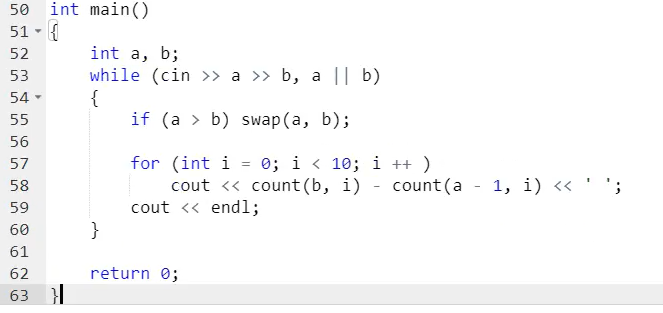
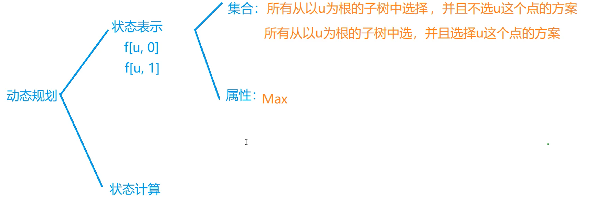

## 背包问题——动态规划


### 0-1背包问题


#### 例题：

有 N件物品和一个容量是 V 的背包。每件物品只能使用一次。

第 ii 件物品的体积是 v~i~，价值是 w~i~。

求解将哪些物品装入背包，可使这些物品的总体积不超过背包容量，且总价值最大。
输出最大价值。

#### 输入格式

第一行两个整数，N，V，用空格隔开，分别表示物品数量和背包容积。

接下来有 NN 行，每行两个整数 v~i~,w~i~用空格隔开，分别表示第 ii 件物品的体积和价值。

#### 输出格式

输出一个整数，表示最大价值。

#### 数据范围

0<N,V≤1000
0<vi,wi≤1000

#### 输入样例

```
4 5
1 2
2 4
3 4
4 5
```

#### 输出样例：

```
8
```

#### 解法一：

```c++
#include<iostream>
#include<algorithm>
using namespace std;

const int N = 1005;
int v[N],w[N];
int F[N][N];

int main(){
    int n,m;
    cin>>n>>m;
    for(int i=1;i<=n;i++){
        cin>>v[i]>>w[i];
    }
    
    for(int i=1;i<=n;i++){
        for(int j=0;j<=m;j++){
            if(j<v[i]){
                F[i][j]=F[i-1][j];
            }else{
                F[i][j]=max(F[i-1][j],F[i-1][j-v[i]]+w[i]);
            }
        }
    }
    
    cout<<F[n][m]<<endl;
    
    return 0;
    
}
```

#### 解法二：

```c++
#include<iostream>
#include<algorithm>
using namespace std;

const int N = 1005;
int v[N],w[N];
int f[N];

int main(){
    int n,m;
    cin>>n>>m;
    for(int i=1;i<=n;i++){
        cin>>v[i]>>w[i];
    }
    for(int i=1;i<=n;i++){
        for(int j=m;j>=v[i];j--){
            f[j]=max(f[j],f[j-v[i]]+w[i]);
        }
    }
    
    cout<<f[m]<<endl;
    
    return 0;
}
```


### 完全背包问题


- 朴素方程


- 优化方程

  

#### 例题

有 NN 种物品和一个容量是 V 的背包，每种物品都有无限件可用。

第 ii 种物品的体积是 v~i~，价值是 w~i~。

求解将哪些物品装入背包，可使这些物品的总体积不超过背包容量，且总价值最大。
输出最大价值。

#### 输入格式

第一行两个整数，N，V用空格隔开，分别表示物品种数和背包容积。

接下来有 NN 行，每行两个整数 vi,wivi,wi，用空格隔开，分别表示第 ii 种物品的体积和价值。

#### 输出格式

输出一个整数，表示最大价值。

#### 数据范围

0<N,V≤1000
0<v~i~,w~i~≤1000

#### 输入样例

```
4 5
1 2
2 4
3 4
4 5
```

#### 输出样例：

```
10
```

#### 朴素解法（三维）：

```c++
#include<iostream>
#include<stdio.h>
using namespace std;

const int N = 1010;
int v[N],w[N];
int f[N][N];

int main(){
    int n,m;
    cin>>n>>m;
    for(int i=1;i<=n;i++){
        cin>>v[i]>>w[i];
    }
    
    for(int i=1;i<=n;i++){
        for(int j=0;j<=m;j++){
            for(int k=0;j>=k*v[i];k++){
                f[i][j]=max(f[i][j],f[i-1][j-k*v[i]]+k*w[i]);
            }
        }
    }
    
    cout<<f[n][m]<<endl;
    
    return 0;
    
}
```

#### 优化写法（二维）：

```c++
#include<iostream>
#include<stdio.h>
using namespace std;

const int N = 1010;
int v[N],w[N];
int f[N][N];

int main(){
    int n,m;
    cin>>n>>m;
    for(int i=1;i<=n;i++){
        cin>>v[i]>>w[i];
    }
    
    for(int i=1;i<=n;i++){
        for(int j=0;j<=m;j++){
            f[i][j]=f[i-1][j];
            if(j>=v[i]){
                f[i][j]=max(f[i][j],f[i][j-v[i]]+w[i]);
            }
        }
    }
    
    cout<<f[n][m]<<endl;
    
    return 0;
    
}
```

#### 最终优化（一维）：

```c++
#include<iostream>
#include<stdio.h>
using namespace std;

const int N = 1010;
int v[N],w[N];
int f[N];

int main(){
    int n,m;
    cin>>n>>m;
    for(int i=1;i<=n;i++){
        cin>>v[i]>>w[i];
    }
    
    for(int i=1;i<=n;i++){
        for(int j=v[i];j<=m;j++){
            
                f[j]=max(f[j],f[j-v[i]]+w[i]);
            
        }
    }
    
    cout<<f[m]<<endl;
    
    return 0;
    
}
```


### 多重背包

#### 朴素版：


- **例题一**

有 N 种物品和一个容量是 V 的背包。

第 ii 种物品最多有 s~i~件，每件体积是 v~i~，价值是 w~i~。

求解将哪些物品装入背包，可使物品体积总和不超过背包容量，且价值总和最大。
输出最大价值。

#### 输入格式

第一行两个整数，N，V用空格隔开，分别表示物品种数和背包容积。

接下来有 N 行，每行三个整数 v~i~,w~i~,s~i~用空格隔开，分别表示第 i种物品的体积、价值和数量。

#### 输出格式

输出一个整数，表示最大价值。

#### 数据范围

0<N,V≤100
0<v~i~,w~i~,s~i~≤100

#### 输入样例

```
4 5
1 2 3
2 4 1
3 4 3
4 5 2
```

#### 输出样例：

```
10
```

#### 题解：

```c++
#include<iostream>
#include<algorithm>

using namespace std;

const int N = 105 ;
int v[N],w[N],s[N];
int f[N][N];

int main(){
    int n,m;
    cin>>n>>m;
    for(int i=1;i<=n;i++){
		cin>>v[i]>>w[i]>>s[i];
    }
    
    for(int i=1;i<=n;i++){
        for(int j=0;j<=m;j++){
            for(int k=0;k<=s[i]&&j>=k*v[i];k++){
                f[i][j]=max(f[i][j],f[i-1][j-v[i]*k]+k*w[i]);
            }
        }
    }
    
    cout<<f[n][m]<<endl;
    
    return 0;
    
}
```


#### 优化版：


#### 例题二：

有 N 种物品和一个容量是 V 的背包。

第 i 种物品最多有 s~i~ 件，每件体积是 v~i~，价值是 w~i~。

求解将哪些物品装入背包，可使物品体积总和不超过背包容量，且价值总和最大。
输出最大价值。

#### 输入格式

第一行两个整数，N，V用空格隔开，分别表示物品种数和背包容积。

接下来有 N 行，每行三个整数 v~i~,w~i~,s~i~用空格隔开，分别表示第 i 种物品的体积、价值和数量。

#### 输出格式

输出一个整数，表示最大价值。

#### 数据范围

0<N≤1000
0<V≤2000
0<v~i~,w~i~,s~i~≤2000

##### 提示：

本题考查多重背包的二进制优化方法。

#### 输入样例

```
4 5
1 2 3
2 4 1
3 4 3
4 5 2
```

#### 输出样例：

```
10
```

#### 题解：

```c++
#include<iostream>
#include<algorithm>

using namespace std;

const int N = 25000 ;
int v[N],w[N];
int cnt = 0;
int f[N];

int main(){
    int n,m;
    cin>>n>>m;
    for(int i = 1;i<=n;i++){
        int a,b,c;
        cin>>a>>b>>c;
    
        int k = 1 ;
        int s = c;
        while(k<=s){
            cnt++;
            v[cnt]=a*k;
            w[cnt]=b*k;
            s -= k;
            k *= 2;
        }
        if(s>0){
            cnt++;
            v[cnt]=a*s;
            w[cnt]=b*s;
        }
    }
    
     n = cnt ;
    for(int i=1;i<=n;i++){
        for(int j=m;j>=v[i];j--){
            f[j]=max(f[j],f[j-v[i]]+w[i]);
        }
    }
    
    cout<<f[m]<<endl;
    
    return 0;
    
}
```


### 分组背包问题


#### 例题：

有 N 组物品和一个容量是 V 的背包。

每组物品有若干个，同一组内的物品最多只能选一个。
每件物品的体积是 v~ij~，价值是 w~ij~，其中 i 是组号，j 是组内编号。

求解将哪些物品装入背包，可使物品总体积不超过背包容量，且总价值最大。

输出最大价值。

#### 输入格式

第一行有两个整数 N，V用空格隔开，分别表示物品组数和背包容量。

接下来有 N 组数据：

- 每组数据第一行有一个整数 S~i~，表示第 i个物品组的物品数量；
- 每组数据接下来有 S~i~行，每行有两个整数 v~ij~,w~ij~，用空格隔开，分别表示第 i 个物品组的第 j 个物品的体积和价值；

#### 输出格式

输出一个整数，表示最大价值。

#### 数据范围

0<N,V≤100
0<S~i~≤100
0<v~ij~,w~ij~≤100

#### 输入样例

```
3 5
2
1 2
2 4
1
3 4
1
4 5
```

#### 输出样例：

```
8
```

#### 题解：

```c++
#include<iostream>
#include<algorithm>

using namespace std;

const int N = 105;
int v[N][N],w[N][N];
int f[N][N];
int s[N];

int main(){
    int n,m;
    cin>>n>>m;
    for(int i=1;i<=n;i++){
     
        cin>>s[i];
        int d=s[i];
        for(int j=1;j<=d;j++){
            cin>>v[i][j]>>w[i][j];
        }
    }
    
    for(int i=1;i<=n;i++){
        for(int j=0;j<=m;j++){
            f[i][j]=f[i-1][j];
            for(int k =1;k<=s[i];k++){
                if(j>=v[i][k]){
                	f[i][j]=max(f[i][j],f[i-1][j-v[i][k]]+w[i][k]);
                }
            }
        }
    }
    
    cout<<f[n][m]<<endl;
    
    return 0;
}
```

#### 优化题解：

```c++
#include<iostream>
#include<algorithm>

using namespace std;

const int N = 105;
int v[N][N],w[N][N];
int f[N];
int s[N];

int main(){
    int n,m;
    cin>>n>>m;
    for(int i=1;i<=n;i++){
     
        cin>>s[i];
        int d=s[i];
        for(int j=1;j<=d;j++){
            cin>>v[i][j]>>w[i][j];
        }
    }
    
    for(int i=1;i<=n;i++){
        for(int j=m;j>=0;j--){
          
            for(int k =1;k<=s[i];k++){
                if(j>=v[i][k]){
                	f[j]=max(f[j],f[j-v[i][k]]+w[i][k]);
                }
            }
        }
    }
    
    cout<<f[m]<<endl;
    
    return 0;
}
```


## 线性dp

### 数字三角形


#### 数字三角形问题

给定一个如下图所示的数字三角形，从顶部出发，在每一结点可以选择移动至其左下方的结点或移动至其右下方的结点，一直走到底层，要求找出一条路径，使路径上的数字的和最大。

```
        7
      3   8
    8   1   0
  2   7   4   4
4   5   2   6   5
```

#### 输入格式

第一行包含整数n，表示数字三角形的层数。

接下来n行，每行包含若干整数，其中第 i 行表示数字三角形第 i 层包含的整数。

#### 输出格式

输出一个整数，表示最大的路径数字和。

#### 数据范围

1≤n≤500
−10000≤三角形中的整数≤10000

#### 输入样例：

```
5
7
3 8
8 1 0 
2 7 4 4
4 5 2 6 5
```

#### 输出样例：

```
30
```

#### 题解：


```c++
#include<iostream>
#include<algorithm>

using namespace std;

const int N = 505 ;
const int INF = 1e9 ;
int a[N][N];
int f[N][N];

int main(){
    int n;
    cin>>n;
    for(int i=1;i<=n;i++){
        for(int j=1;j<=i;j++){
            cin>>a[i][j];
        }
    }
    
    for(int i=0;i<=n;i++){
        for(int j=0;j<=i+1;j++){
            f[i][j]=-INF;
        }
    }
    f[1][1]=a[1][1];
    for(int i=2;i<=n;i++){
        for(int j=1;j<=i;j++){
            f[i][j]=max(f[i-1][j-1]+a[i][j],f[i-1][j]+a[i][j]);
        }
    }
    int res = -INF;
    for(int i=1;i<=n;i++){
        res=max(res,f[n][i]);
    }
    cout<<res<<endl;
    return 0;
}
```


### 最长上升子序列


#### 问题：

给定一个长度为N的数列，求数值严格单调递增的子序列的长度最长是多少。

#### 输入格式

第一行包含整数N。

第二行包含N个整数，表示完整序列。

#### 输出格式

输出一个整数，表示最大长度。

#### 数据范围

1≤N≤1000
−109≤数列中的数≤109

#### 输入样例：

```
7
3 1 2 1 8 5 6
```

#### 输出样例：

```
4
```

#### 题解：

```c++
#include<iostream>
#include<algorithm>

using namespace std;

const int N = 10010 ;
int a[N];
int f[N];

int main(){
    int n;
    cin>>n;
    for(int i=1;i<=n;i++){
        cin>>a[i];
    }
    
    for(int i=1;i<=n;i++){
        f[i]=1;
        for(int j=1;j<i;j++){
            if(a[j]<a[i]){
            	f[i]=max(f[i],f[j]+1);
            }
        }
    }
    
    int res = 0 ;
    for(int i=1;i<=n;i++){
        res=max(res,f[i]);
    }
    
    cout<<res<<endl;
    
    return 0;
    
}
```


### 最长公共子序列


#### 题目：

给定两个长度分别为N和M的字符串A和B，求既是A的子序列又是B的子序列的字符串长度最长是多少。

#### 输入格式

第一行包含两个整数N和M。

第二行包含一个长度为N的字符串，表示字符串A。

第三行包含一个长度为M的字符串，表示字符串B。

字符串均由小写字母构成。

#### 输出格式

输出一个整数，表示最大长度。

#### 数据范围

1≤N,M≤1000

#### 输入样例：

```
4 5
acbd
abedc
```

#### 输出样例：

```
3
```

#### 题解：

```c++
#include<iostream>#include<algorithm>using namespace std;const int N = 1010;char a[N],b[N];int f[N][N];int main(){    int n,m;    cin>>n>>m;    for(int i=1;i<=n;i++){        cin>>a[i];    }    for(int i=1;i<=m;i++){        cin>>b[i];    }        for(int i=1;i<=n;i++){        for(int j=1;j<=m;j++){            f[i][j]=max(f[i-1][j],f[i][j-1]);            if(a[i]==b[j]){                f[i][j]=max(f[i][j],f[i-1][j-1]+1);            }        }                }        cout<<f[n][m]<<endl;        return 0;    }
```


## 区间DP

 


### 石子合并

设有 NN 堆石子排成一排，其编号为 1，2，3，…，N

每堆石子有一定的质量，可以用一个整数来描述，现在要将这 NN 堆石子合并成为一堆。

每次只能合并相邻的两堆，合并的代价为这两堆石子的质量之和，合并后与这两堆石子相邻的石子将和新堆相邻，合并时由于选择的顺序不同，合并的总代价也不相同。

例如有 44 堆石子分别为 `1 3 5 2`， 我们可以先合并 1、2 堆，代价为 4，得到 `4 5 2`， 又合并 1，2堆，代价为 9，得到 `9 2` ，再合并得到 11，总代价为 4+9+11=24；

如果第二步是先合并 2，3堆，则代价为 7，得到 `4 7`，最后一次合并代价为 11，总代价为 4+7+11=22

问题是：找出一种合理的方法，使总的代价最小，输出最小代价。

#### 输入格式

第一行一个数 N 表示石子的堆数 N。

第二行 N个数，表示每堆石子的质量(均不超过 1000)。

#### 输出格式

输出一个整数，表示最小代价。

#### 数据范围

1≤N≤300

#### 输入样例：

```
4
1 3 5 2
```

#### 输出样例：

```
22
```

#### 题解：

```c++
#include<iostream>
#include<algorithm>

using namespace std;

const int N = 305;
int a[N],s[N];
int f[N][N];

int main(){
    int n;
    cin>>n;
    for(int i=1;i<=n;i++){
        cin>>a[i];
        s[i] = s[i-1]+a[i];
    }
    
    for(int len = 1;len<n;len++){
        for(int i=1;i+len<=n;i++){
            int j=i+len;
            f[i][j]=1e9;
            for(int k=i;k<j;k++){
                f[i][j]=min(f[i][j],f[i][k]+f[k+1][j]+s[j]-s[i-1]);
            }
        }
    }
    
    cout<<f[1][n]<<endl;
    
    return 0;
    
}
```


## 数位统计DP





#### 计数问题

给定两个整数 a 和 b，求 a 和 b 之间的所有数字中 0∼9 的出现次数。

例如，a=1024，b=1032a=1024，b=1032，则 aa 和 bb 之间共有 99 个数如下：

```
1024 1025 1026 1027 1028 1029 1030 1031 1032
```

其中 `0` 出现 10 次，`1` 出现 10次，`2` 出现 7 次，`3` 出现 3 次等等…

##### 输入格式

输入包含多组测试数据。

每组测试数据占一行，包含两个整数 a和 b。

当读入一行为 `0 0` 时，表示输入终止，且该行不作处理。

##### 输出格式

每组数据输出一个结果，每个结果占一行。

每个结果包含十个用空格隔开的数字，第一个数字表示 `0` 出现的次数，第二个数字表示 `1` 出现的次数，以此类推。

##### 数据范围

0<a,b<100000000

##### 输入样例：

```
1 10
44 497
346 542
1199 1748
1496 1403
1004 503
1714 190
1317 854
1976 494
1001 1960
0 0
```

##### 输出样例：

```
1 2 1 1 1 1 1 1 1 1
85 185 185 185 190 96 96 96 95 93
40 40 40 93 136 82 40 40 40 40
115 666 215 215 214 205 205 154 105 106
16 113 19 20 114 20 20 19 19 16
107 105 100 101 101 197 200 200 200 200
413 1133 503 503 503 502 502 417 402 412
196 512 186 104 87 93 97 97 142 196
398 1375 398 398 405 499 499 495 488 471
294 1256 296 296 296 296 287 286 286 247
```

##### 题解

```c++
#include<iostream>
#include<algorithm>
#include<vector>

using namespace std;

int get(vector<int> num,int l,int r){
    int res=0;
    for(int i = l; i>=r ; i--){
        res = res*10 + num[i];
    }
    return res;
}

int power10(int i){
    int res=1;
    while(i--) res *= 10;
    return res;
}

int count(int n,int x){
    if(!n) return 0;
    
    vector<int> num;
    while(n){
        num.push_back(n%10);
        n /=10 ;
    }
    int m = num.size();
    
    int res = 0;
    for(int i = m-1-!x ; i>=0 ;i--){
        if(i<m-1){
            res += get(num,m-1,i+1)*power10(i);
            if(!x) res -=power10(i);
        }
        if(num[i]==x) res +=get(num,i-1,0)+1;
        else if(num[i]>x) res += power10(i);
    }
}


int main(){
    int a,b;
    while(cin>>a>>b,a||b){
        if(a>b) swap(a,b);
        for(int i=0;i<10;i++){
            cout<<count(b,i)-count(a-1,i)<<" ";
        }
        cout<<endl;
    }
    return 0;
}
```


## 状态压缩DP


#### 例题

求把 N×MN×M 的棋盘分割成若干个 1×2 的的长方形，有多少种方案。

例如当 N=2，M=4 时，共有 55 种方案。当 N=2，M=3时，共有 3 种方案。

如下图所示：


##### 输入格式

输入包含多组测试用例。

每组测试用例占一行，包含两个整数 N 和 M。

当输入用例 N=0，M=0 时，表示输入终止，且该用例无需处理。

##### 输出格式

每个测试用例输出一个结果，每个结果占一行。

##### 数据范围

1≤N,M≤11

##### 输入样例：

```
1 2
1 3
1 4
2 2
2 3
2 4
2 11
4 11
0 0
```

##### 输出样例：

```
1
0
1
2
3
5
144
51205
```

##### 题解

```c++
#include<iostream>
#include<cstring>
#include<algorithm>

using namespace std;

const int N = 12 , J = 1<<N ;
long long f[N][J];
bool st[J];

int main(){
    int n,m;
    while(cin>>n>>m,n || m){
        for(int i=0;i<1<<n;i++){
            st[i]=true;
            int cnt = 0;
            for(int j=0;j<n;j++){
                if(i>>j&1) {
                    if(cnt&1){
                        st[i]=false;
                        break;
                    }
                    cnt = 0;
                }else{
                    cnt++;
                }
                
            }
            if(cnt&1)	st[i]=false;
        }
        
        memset(f,0,sizeof f);
        f[0][0]=1;
        for(int i=1;i<=m;i++){
            for(int j=0;j<1<<n;j++){
                for(int k=0;k<1<<n;k++){
                    if((j&k)==0&&(st[j|k])){
                        f[i][j] += f[i-1][k]; 
                    }
                }
            }
        }
        
        cout<<f[m][0]<<endl;
    }
    
}
```


####  最短Hamilton路径


给定一张 n 个点的带权无向图，点从 0∼n−1标号，求起点 0到终点 n−1 的最短 Hamilton 路径。

Hamilton 路径的定义是从 00 到 n−1n−1 不重不漏地经过每个点恰好一次。

##### 输入格式

第一行输入整数 nn。

接下来 nn 行每行 nn 个整数，其中第 ii 行第 jj 个整数表示点 ii 到 jj 的距离（记为 a[i,j]a[i,j]）。

对于任意的 x,y,z，数据保证 a[x,x]=0，a[x,y]=a[y,x]并且 a[x,y]+a[y,z]≥a[x,z]]。

##### 输出格式

输出一个整数，表示最短 Hamilton 路径的长度。

##### 数据范围

1≤n≤20
0≤a[i,j]≤107

##### 输入样例：

```
5
0 2 4 5 1
2 0 6 5 3
4 6 0 8 3
5 5 8 0 5
1 3 3 5 0
```

##### 输出样例：

```
18
```

##### 题解

```c++
#include<iostream>
#include<cstring>
#include<algorithm>

using namespace std;

const int N=21,S=1<<N;
int f[S][N];
int g[N][N];

int main(){
    int n;
    cin>>n;
    for(int i=0;i<n;i++){
        for(int j=0;j<n;j++){
            cin>>g[i][j];
        }
    }
    
    memset(f,0x3f,sizeof f);
    f[1][0]=0;
    for(int i=0;i<1<<n;i++){
        for(int j=0;j<n;j++){
            if(i>>j&1){
                for(int k=0;k<n;k++){
                    if((i-(1<<j))>>k&1){
                        f[i][j]=min(f[i][j],f[i-(1<<j)][k]+g[k][j]);
                    }
                }
            }
        }
    }
    
    cout<<f[(1<<n)-1][n-1];
    
    return 0;
}
```


## 树型DP




#### 没有上司的舞会

Ural 大学有 N 名职员，编号为 1∼N。

他们的关系就像一棵以校长为根的树，父节点就是子节点的直接上司。

每个职员有一个快乐指数，用整数 HiHi 给出，其中 1≤i≤N

现在要召开一场周年庆宴会，不过，没有职员愿意和直接上司一起参会。

在满足这个条件的前提下，主办方希望邀请一部分职员参会，使得所有参会职员的快乐指数总和最大，求这个最大值。

##### 输入格式

第一行一个整数 N。

接下来 N 行，第 i 行表示 i 号职员的快乐指数 Hi。

接下来 N−1 行，每行输入一对整数 L,K，表示 K 是 L 的直接上司。

##### 输出格式

输出最大的快乐指数。

##### 数据范围

1≤N≤6000
−128≤Hi≤127

##### 输入样例：

```
7
1
1
1
1
1
1
1
1 3
2 3
6 4
7 4
4 5
3 5
```

##### 输出样例：

```
5
```

##### 题解

```c++
#include<iostream>
#include<cstring>
#include<algorithm>

using namespace std;

const int N = 6010;
int h[N],e[N],ne[N],idx;
bool father[N];
int f[N][2];
int Hi[N];

void add(int a,int b){
    e[idx]=b,ne[idx]=h[a],h[a]=idx++;
}

void dfs(int u){
    f[u][1]=Hi[u];
    for(int i = h[u] ; i!=-1 ; i=ne[i]){
        int j = e[i];
        dfs(j);
        
        f[u][0] += max(f[j][1],f[j][0]);
        f[u][1] += f[j][0];
    }
}


int main(){
    memset(h,-1,sizeof h);
    int n;
    cin>>n;
    for(int i=1 ; i<=n ; i++){
        cin>>Hi[i];
    }
    for(int i=0 ; i<n-1 ;i++){
        int a,b;
        cin>>a>>b;
        father[a]=true;
        add(b,a);
    }
    
    int root = 1 ;
    while(father[root]==true) root++;
    
    dfs(root);
    
    cout<<max(f[root][0],f[root][1])<<endl;
    
    return 0;
    
}
```


## 记忆化搜索


#### 滑雪

给定一个 R 行 C 列的矩阵，表示一个矩形网格滑雪场。

矩阵中第 ii 行第 jj 列的点表示滑雪场的第 ii 行第 jj 列区域的高度。

一个人从滑雪场中的某个区域内出发，每次可以向上下左右任意一个方向滑动一个单位距离。

当然，一个人能够滑动到某相邻区域的前提是该区域的高度低于自己目前所在区域的高度。

下面给出一个矩阵作为例子：

```
 1  2  3  4 5

16 17 18 19 6

15 24 25 20 7

14 23 22 21 8

13 12 11 10 9
```

在给定矩阵中，一条可行的滑行轨迹为 24−17−2−12

在给定矩阵中，最长的滑行轨迹为 25−24−23−…−3−2−12，沿途共经过 25 个区域。

现在给定你一个二维矩阵表示滑雪场各区域的高度，请你找出在该滑雪场中能够完成的最长滑雪轨迹，并输出其长度(可经过最大区域数)。

##### 输入格式

第一行包含两个整数 RR 和 CC。

接下来 RR 行，每行包含 CC 个整数，表示完整的二维矩阵。

##### 输出格式

输出一个整数，表示可完成的最长滑雪长度。

##### 数据范围

1≤R,C≤300
0≤矩阵中整数≤10000

##### 输入样例：

```
5 5
1 2 3 4 5
16 17 18 19 6
15 24 25 20 7
14 23 22 21 8
13 12 11 10 9
```

##### 输出样例：

```
25
```


##### 题解：

```c++
#include<cstring>
#include<iostream>
#include<algorithm>

using namespace std;

const int N = 305 ;
int g[N][N];
int f[N][N];
int n,m;

int vx[4] = {0,0,-1,1};
int vy[4] = {1,-1,0,0};

int dfs(int x,int y){
    if(f[x][y] != 0) return f[x][y];
    
    for(int i=0 ; i<4 ;i++){
        int newx = x + vx[i];
        int newy = y + vy[i];
        if(newx>=1 && newx<=n && newy>=1 && newy<=m && g[x][y]>g[newx][newy]){
            f[x][y] = max(f[x][y],dfs(newx,newy)+1);
        }
    }
    return f[x][y];
}

int main(){
   
    
    cin>>n>>m;
    for(int i = 1; i<=n ;i++){
        for(int j = 1 ; j<=m ; j++){
            cin>>g[i][j];
            
        }
    }
    
    int maxlen = -1 ;
    for(int i=1 ; i<=n ; i++){
        for(int j=1 ; j<=n ; j++){
            int len = dfs(i,j);
            
            maxlen = max(maxlen,len);
        }
    }
    
    cout<<maxlen<<endl;
    
    return 0;
}
```


