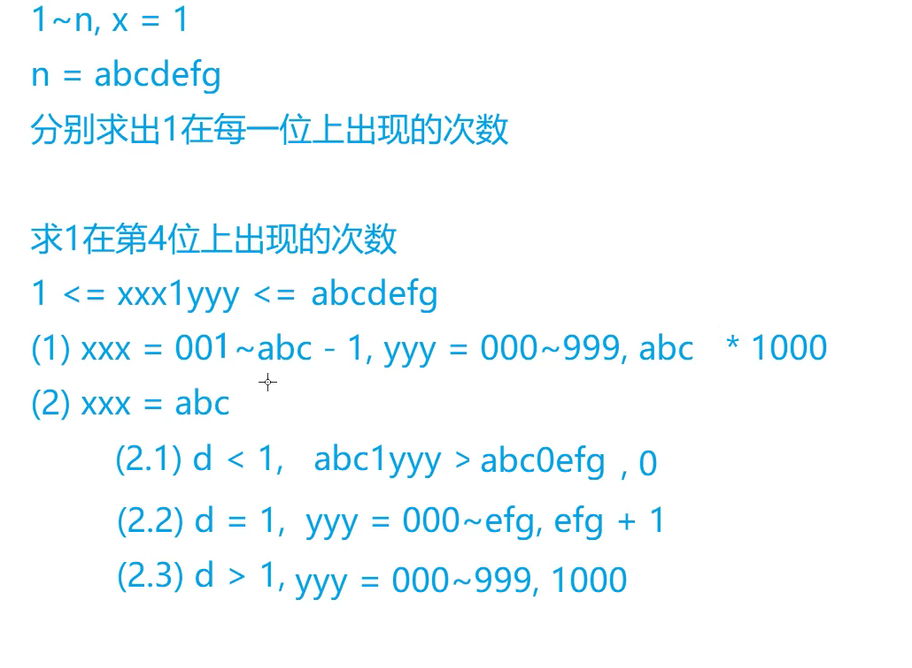
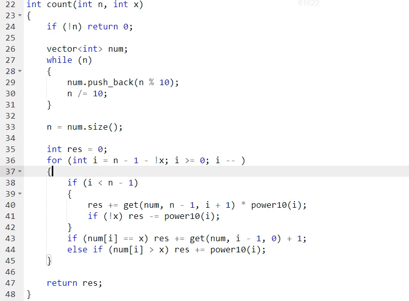

## 数位统计DP








#### 计数问题

给定两个整数 a 和 b，求 a 和 b 之间的所有数字中 0∼9 的出现次数。

例如，a=1024，b=1032a=1024，b=1032，则 aa 和 bb 之间共有 99 个数如下：

```
1024 1025 1026 1027 1028 1029 1030 1031 1032
```

其中 `0` 出现 10 次，`1` 出现 10次，`2` 出现 7 次，`3` 出现 3 次等等…

#### 输入格式

输入包含多组测试数据。

每组测试数据占一行，包含两个整数 a和 b。

当读入一行为 `0 0` 时，表示输入终止，且该行不作处理。

#### 输出格式

每组数据输出一个结果，每个结果占一行。

每个结果包含十个用空格隔开的数字，第一个数字表示 `0` 出现的次数，第二个数字表示 `1` 出现的次数，以此类推。

#### 数据范围

0<a,b<100000000

#### 输入样例：

```
1 10
44 497
346 542
1199 1748
1496 1403
1004 503
1714 190
1317 854
1976 494
1001 1960
0 0
```

#### 输出样例：

```
1 2 1 1 1 1 1 1 1 1
85 185 185 185 190 96 96 96 95 93
40 40 40 93 136 82 40 40 40 40
115 666 215 215 214 205 205 154 105 106
16 113 19 20 114 20 20 19 19 16
107 105 100 101 101 197 200 200 200 200
413 1133 503 503 503 502 502 417 402 412
196 512 186 104 87 93 97 97 142 196
398 1375 398 398 405 499 499 495 488 471
294 1256 296 296 296 296 287 286 286 247
```

#### 题解

```c++
#include<iostream>
#include<algorithm>
#include<vector>

using namespace std;

int get(vector<int> num,int l,int r){
    int res=0;
    for(int i = l; i>=r ; i--){
        res = res*10 + num[i];
    }
    return res;
}

int power10(int i){
    int res=1;
    while(i--) res *= 10;
    return res;
}

int count(int n,int x){
    if(!n) return 0;
    
    vector<int> num;
    while(n){
        num.push_back(n%10);
        n /=10 ;
    }
    int m = num.size();
    
    int res = 0;
    for(int i = m-1-!x ; i>=0 ;i--){
        if(i<m-1){
            res += get(num,m-1,i+1)*power10(i);
            if(!x) res -=power10(i);
        }
        if(num[i]==x) res +=get(num,i-1,0)+1;
        else if(num[i]>x) res += power10(i);
    }
}


int main(){
    int a,b;
    while(cin>>a>>b,a||b){
        if(a>b) swap(a,b);
        for(int i=0;i<10;i++){
            cout<<count(b,i)-count(a-1,i)<<" ";
        }
        cout<<endl;
    }
    return 0;
}
```


