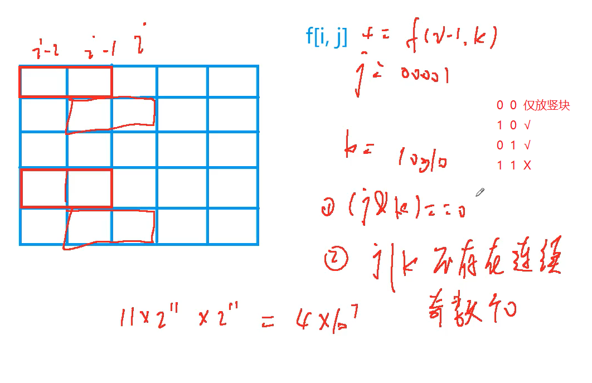

### 状态压缩DP




#### 例题

求把 N×MN×M 的棋盘分割成若干个 1×2 的的长方形，有多少种方案。

例如当 N=2，M=4 时，共有 55 种方案。当 N=2，M=3时，共有 3 种方案。

如下图所示：


#### 输入格式

输入包含多组测试用例。

每组测试用例占一行，包含两个整数 N 和 M。

当输入用例 N=0，M=0 时，表示输入终止，且该用例无需处理。

#### 输出格式

每个测试用例输出一个结果，每个结果占一行。

#### 数据范围

1≤N,M≤11

#### 输入样例：

```
1 2
1 3
1 4
2 2
2 3
2 4
2 11
4 11
0 0
```

#### 输出样例：

```
1
0
1
2
3
5
144
51205
```

#### 题解

```c++
#include<iostream>
#include<cstring>
#include<algorithm>

using namespace std;

const int N = 12 , J = 1<<N ;
long long f[N][J];
bool st[J];

int main(){
    int n,m;
    while(cin>>n>>m,n || m){
        for(int i=0;i<1<<n;i++){
            st[i]=true;
            int cnt = 0;
            for(int j=0;j<n;j++){
                if(i>>j&1) {
                    if(cnt&1){
                        st[i]=false;
                        break;
                    }
                    cnt = 0;
                }else{
                    cnt++;
                }
                
            }
            if(cnt&1)	st[i]=false;
        }
        
        memset(f,0,sizeof f);
        f[0][0]=1;
        for(int i=1;i<=m;i++){
            for(int j=0;j<1<<n;j++){
                for(int k=0;k<1<<n;k++){
                    if((j&k)==0&&(st[j|k])){
                        f[i][j] += f[i-1][k]; 
                    }
                }
            }
        }
        
        cout<<f[m][0]<<endl;
    }
    
}
```


####  最短Hamilton路径


给定一张 n 个点的带权无向图，点从 0∼n−1标号，求起点 0到终点 n−1 的最短 Hamilton 路径。

Hamilton 路径的定义是从 00 到 n−1n−1 不重不漏地经过每个点恰好一次。

#### 输入格式

第一行输入整数 nn。

接下来 nn 行每行 nn 个整数，其中第 ii 行第 jj 个整数表示点 ii 到 jj 的距离（记为 a[i,j]a[i,j]）。

对于任意的 x,y,z，数据保证 a[x,x]=0，a[x,y]=a[y,x]并且 a[x,y]+a[y,z]≥a[x,z]]。

#### 输出格式

输出一个整数，表示最短 Hamilton 路径的长度。

#### 数据范围

1≤n≤20
0≤a[i,j]≤107

#### 输入样例：

```
5
0 2 4 5 1
2 0 6 5 3
4 6 0 8 3
5 5 8 0 5
1 3 3 5 0
```

#### 输出样例：

```
18
```

#### 题解

```c++
#include<iostream>
#include<cstring>
#include<algorithm>

using namespace std;

const int N=21,S=1<<N;
int f[S][N];
int g[N][N];

int main(){
    int n;
    cin>>n;
    for(int i=0;i<n;i++){
        for(int j=0;j<n;j++){
            cin>>g[i][j];
        }
    }
    
    memset(f,0x3f,sizeof f);
    f[1][0]=0;
    for(int i=0;i<1<<n;i++){
        for(int j=0;j<n;j++){
            if(i>>j&1){
                for(int k=0;k<n;k++){
                    if((i-(1<<j))>>k&1){
                        f[i][j]=min(f[i][j],f[i-(1<<j)][k]+g[k][j]);
                    }
                }
            }
        }
    }
    
    cout<<f[(1<<n)-1][n-1];
    
    return 0;
}
```


