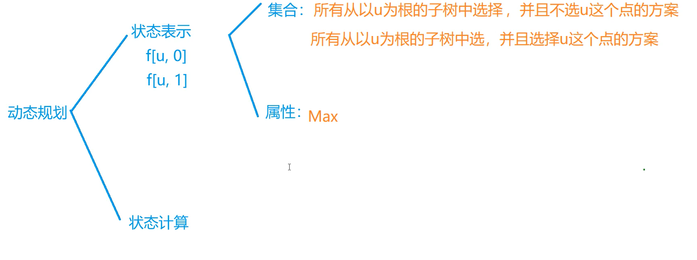
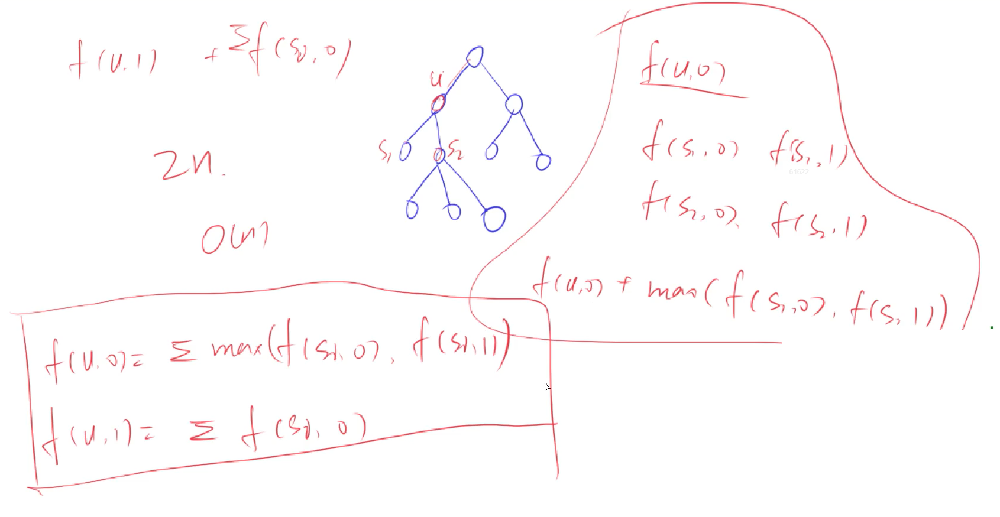

## 树型DP





#### 没有上司的舞会

Ural 大学有 N 名职员，编号为 1∼N。

他们的关系就像一棵以校长为根的树，父节点就是子节点的直接上司。

每个职员有一个快乐指数，用整数 HiHi 给出，其中 1≤i≤N

现在要召开一场周年庆宴会，不过，没有职员愿意和直接上司一起参会。

在满足这个条件的前提下，主办方希望邀请一部分职员参会，使得所有参会职员的快乐指数总和最大，求这个最大值。

#### 输入格式

第一行一个整数 N。

接下来 N 行，第 i 行表示 i 号职员的快乐指数 Hi。

接下来 N−1 行，每行输入一对整数 L,K，表示 K 是 L 的直接上司。

#### 输出格式

输出最大的快乐指数。

#### 数据范围

1≤N≤6000
−128≤Hi≤127

#### 输入样例：

```
7
1
1
1
1
1
1
1
1 3
2 3
6 4
7 4
4 5
3 5
```

#### 输出样例：

```
5
```

#### 题解

```c++
#include<iostream>
#include<cstring>
#include<algorithm>

using namespace std;

const int N = 6010;
int h[N],e[N],ne[N],idx;
bool father[N];
int f[N][2];
int Hi[N];

void add(int a,int b){
    e[idx]=b,ne[idx]=h[a],h[a]=idx++;
}

void dfs(int u){
    f[u][1]=Hi[u];
    for(int i = h[u] ; i!=-1 ; i=ne[i]){
        int j = e[i];
        dfs(j);
        
        f[u][0] += max(f[j][1],f[j][0]);
        f[u][1] += f[j][0];
    }
}


int main(){
    memset(h,-1,sizeof h);
    int n;
    cin>>n;
    for(int i=1 ; i<=n ; i++){
        cin>>Hi[i];
    }
    for(int i=0 ; i<n-1 ;i++){
        int a,b;
        cin>>a>>b;
        father[a]=true;
        add(b,a);
    }
    
    int root = 1 ;
    while(father[root]==true) root++;
    
    dfs(root);
    
    cout<<max(f[root][0],f[root][1])<<endl;
    
    return 0;
    
}
```

