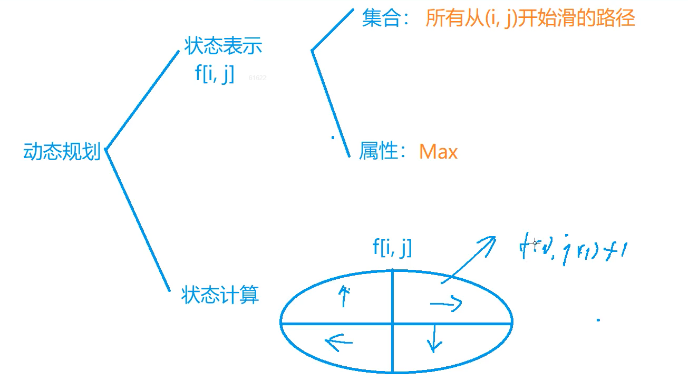

### 记忆化搜索



#### 滑雪

给定一个 R 行 C 列的矩阵，表示一个矩形网格滑雪场。

矩阵中第 ii 行第 jj 列的点表示滑雪场的第 ii 行第 jj 列区域的高度。

一个人从滑雪场中的某个区域内出发，每次可以向上下左右任意一个方向滑动一个单位距离。

当然，一个人能够滑动到某相邻区域的前提是该区域的高度低于自己目前所在区域的高度。

下面给出一个矩阵作为例子：

```
 1  2  3  4 5

16 17 18 19 6

15 24 25 20 7

14 23 22 21 8

13 12 11 10 9
```

在给定矩阵中，一条可行的滑行轨迹为 24−17−2−12

在给定矩阵中，最长的滑行轨迹为 25−24−23−…−3−2−12，沿途共经过 25 个区域。

现在给定你一个二维矩阵表示滑雪场各区域的高度，请你找出在该滑雪场中能够完成的最长滑雪轨迹，并输出其长度(可经过最大区域数)。

#### 输入格式

第一行包含两个整数 RR 和 CC。

接下来 RR 行，每行包含 CC 个整数，表示完整的二维矩阵。

#### 输出格式

输出一个整数，表示可完成的最长滑雪长度。

#### 数据范围

1≤R,C≤300
0≤矩阵中整数≤10000

#### 输入样例：

```
5 5
1 2 3 4 5
16 17 18 19 6
15 24 25 20 7
14 23 22 21 8
13 12 11 10 9
```

#### 输出样例：

```
25
```


#### 题解：

```c++
#include<cstring>
#include<iostream>
#include<algorithm>

using namespace std;

const int N = 305 ;
int g[N][N];
int f[N][N];
int n,m;

int vx[4] = {0,0,-1,1};
int vy[4] = {1,-1,0,0};

int dfs(int x,int y){
    if(f[x][y] != 0) return f[x][y];
    
    for(int i=0 ; i<4 ;i++){
        int newx = x + vx[i];
        int newy = y + vy[i];
        if(newx>=1 && newx<=n && newy>=1 && newy<=m && g[x][y]>g[newx][newy]){
            f[x][y] = max(f[x][y],dfs(newx,newy)+1);
        }
    }
    return f[x][y];
}

int main(){
   
    
    cin>>n>>m;
    for(int i = 1; i<=n ;i++){
        for(int j = 1 ; j<=m ; j++){
            cin>>g[i][j];
            
        }
    }
    
    int maxlen = -1 ;
    for(int i=1 ; i<=n ; i++){
        for(int j=1 ; j<=n ; j++){
            int len = dfs(i,j);
            
            maxlen = max(maxlen,len);
        }
    }
    
    cout<<maxlen<<endl;
    
    return 0;
}
```


