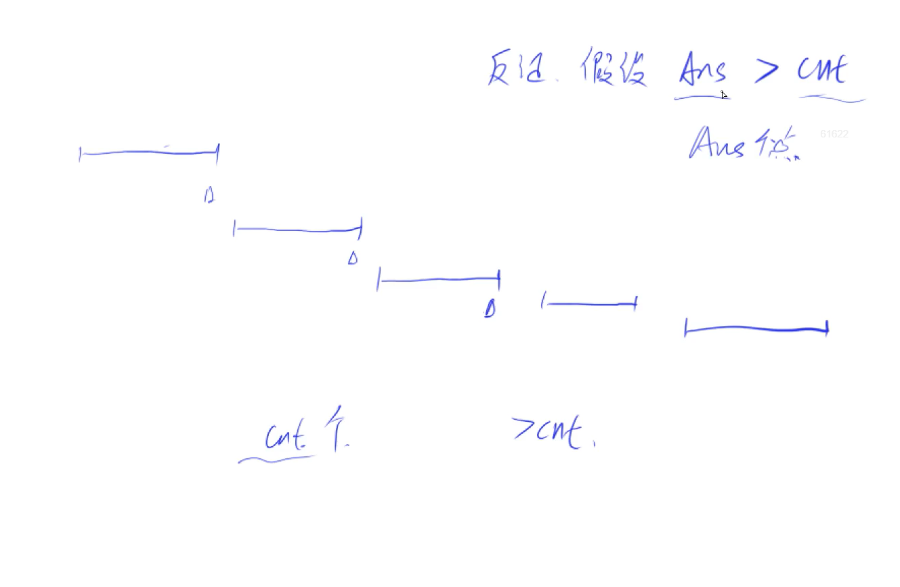
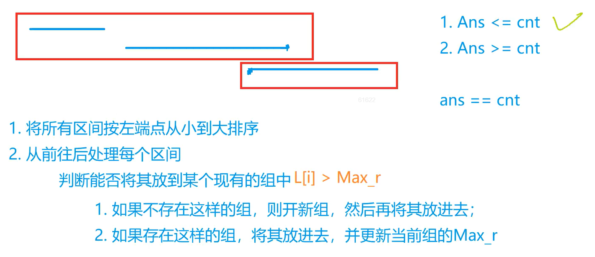
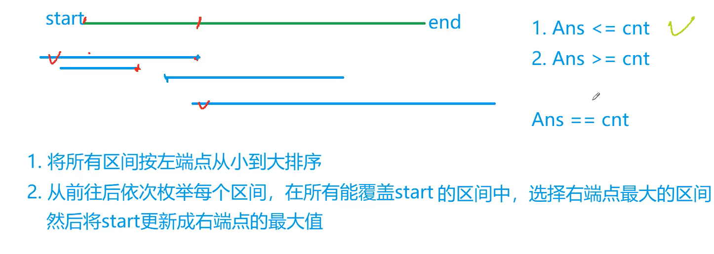
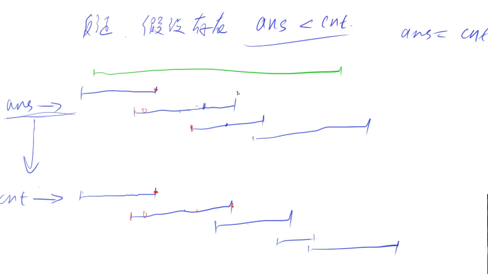
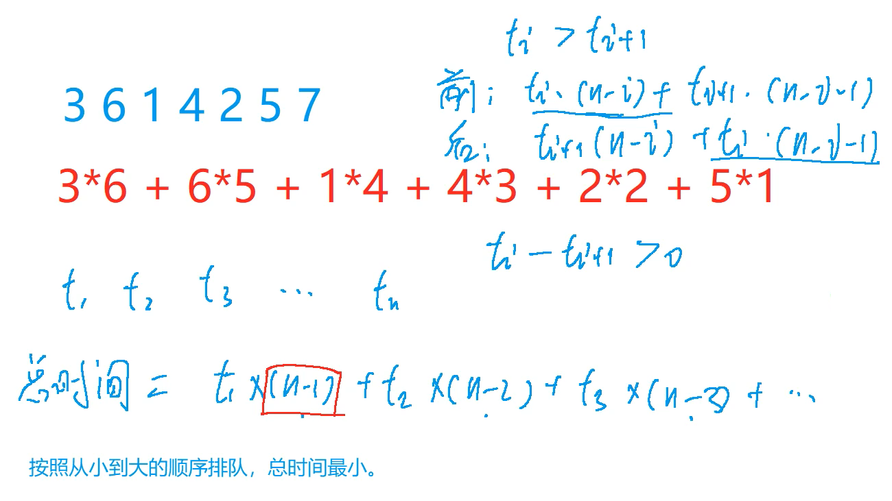

## 区间问题

### 1.区间合并

给定 N 个闭区间 [ai,bi]，请你在数轴上选择尽量少的点，使得每个区间内至少包含一个选出的点。

输出选择的点的最小数量。

位于区间端点上的点也算作区间内。

#### 输入格式

第一行包含整数 N，表示区间数。

接下来 N 行，每行包含两个整数 ai,bi，表示一个区间的两个端点。

#### 输出格式

输出一个整数，表示所需的点的最小数量。

#### 数据范围

1≤N≤10~5~
−109≤ai≤bi≤109

#### 输入样例：

```
3
-1 1
2 4
3 5
```

#### 输出样例：

```
2
```





```c++
#include<iostream>
#include<cstring>
#include<algorithm>

using namespace std;

const int N = 1e5+10;
struct Range{
    int a,b;
    bool operator<(Range&R)const{
        return b<R.b;
    }
}range[N];

int main(){
    int n;
    cin>>n;
    for(int i=0 ; i<n ; i++){
        int a,b;
        cin>>a>>b;
        range[i]={a,b};
    }
    
    sort(range,range+n);
    
    int ans = 0;
    int max_r = -1e9;
    for(int i=0 ; i<n ; i++){
        if(range[i].a > max_r){
            max_r = range[i].b;
            ans++;
        }
    }
    
    cout<<ans<<endl;
    
    return 0;
}


```


### 2.最大不想交区间数量

给定 N 个闭区间 [ai,bi]，请你在数轴上选择若干区间，使得选中的区间之间互不相交（包括端点）。

输出可选取区间的最大数量。

#### 输入格式

第一行包含整数 N，表示区间数。

接下来 N 行，每行包含两个整数 ai,bi，表示一个区间的两个端点。

#### 输出格式

输出一个整数，表示可选取区间的最大数量。

#### 数据范围

1≤N≤10~5~
−109≤ai≤bi≤109

#### 输入样例：

```
3
-1 1
2 4
3 5
```

#### 输出样例：

```
2
```

#### 题解

```c++
#include<iostream>
#include<algorithm>
#include<cstring>

using namespace std;

const int N = 1e5+10;

struct Range{
    int a,b;
    bool operator<(Range&R)const{
        return b<R.b;
    }
}range[N];

int main(){
    int n;
    cin>>n;
    for(int i=0 ; i<n ; i++){
        int a,b;
        cin>>a>>b;
        range[i]={a,b};
    }
    
    sort(range,range+n);
    
    int ans = 0;
    int max_r = -1e9;
    for(int i=0 ; i<n ; i++){
        if(max_r<range[i].a){
            max_r = range[i].b;
            ans++;
        }
    }
    
    cout<<ans<<endl;
    
    return 0;
    
}

```


### 3.区间分组

给定 N 个闭区间 [ai,bi]，请你将这些区间分成若干组，使得每组内部的区间两两之间（包括端点）没有交集，并使得组数尽可能小。

输出最小组数。

#### 输入格式

第一行包含整数 N，表示区间数。

接下来 N 行，每行包含两个整数 ai,bi，表示一个区间的两个端点。

#### 输出格式

输出一个整数，表示最小组数。

#### 数据范围

1≤N≤10^5^
−109≤ai≤bi≤109

#### 输入样例：

```
3
-1 1
2 4
3 5
```

#### 输出样例：

```
2
```




```c++
#include<iostream>
#include<algorithm>
#include<queue>
#include<cstring>

using namespace std;

const int N = 1e5+10;
struct Range{
    int a,b;
    bool operator<(Range&R)const{
        return a<R.a;
    }
}range[N];

int main(){
    int n;
    cin>>n;
    for(int i=0 ; i<n ; i++){
        int a,b;
        cin>>a>>b;
        range[i] = {a,b};
    }
    sort(range,range+n);
    
    priority_queue<int , vector<int> , greater<int>>heap;
    for(int i=0 ; i<n ; i++){
        if(heap.empty()||heap.top()>=range[i].a){
            heap.push(range[i].b);
        }else{
            heap.pop();
            heap.push(range[i].b);
        }
    }
    
    cout<<heap.size()<<endl;
    
    return 0;
    
}
```


#### 4.区间覆盖

给定 N 个闭区间 [ai,bi]以及一个线段区间 [s,t]，请你选择尽量少的区间，将指定线段区间完全覆盖。

输出最少区间数，如果无法完全覆盖则输出 −1。

#### 输入格式

第一行包含两个整数 s 和 t，表示给定线段区间的两个端点。

第二行包含整数 N，表示给定区间数。

接下来 N 行，每行包含两个整数 ai,bi，表示一个区间的两个端点。

#### 输出格式

输出一个整数，表示所需最少区间数。

如果无解，则输出 −1。

#### 数据范围

1≤N≤10^5^
−10^9^≤ai≤bi≤10^9^
−10^9^≤s≤t≤10^9^

#### 输入样例：

```
1 5
3
-1 3
2 4
3 5
```

#### 输出样例：

```
2
```






#### 题解：

```c++
#include<iostream>
#include<algorithm>

using namespace std;

const int N = 1e5+10;
struct Range{
    int a,b;
    bool operator<(Range&R){
        return a<R.a;
    }
}range[N];


int main(){
    int s,t;
    cin>>s>>t;
    int n;
    cin>>n;
    for(int i=0 ; i<n ; i++){
        int a,b;
        cin>>a>>b;
        range[i] = {a,b};
    }
    
    sort(range,range+n);
    
    int res = 0 ;
    bool success = false;
    for(int i=0 ; i<n ; i++){

        int j = i ;
        int max_r = -2e9;
        while(j<n && range[j].a<=s){
            max_r = max(max_r , range[j].b);
            j++;
        }
        
        if(max_r<s){
            res = -1;
            break;
        }
        
        res++;
        if(max_r>=t){
            success = true;
            break;
        }
        
        s = max_r;
        i = j-1;
        
    }
    
    if(!success)	res = -1;
    
    cout<<res<<endl;
    
    return 0;
    
}
```


## huffman树

### 合并果子

在一个果园里，达达已经将所有的果子打了下来，而且按果子的不同种类分成了不同的堆。

达达决定把所有的果子合成一堆。

每一次合并，达达可以把两堆果子合并到一起，消耗的体力等于两堆果子的重量之和。

可以看出，所有的果子经过 n−1 次合并之后，就只剩下一堆了。

达达在合并果子时总共消耗的体力等于每次合并所耗体力之和。

因为还要花大力气把这些果子搬回家，所以达达在合并果子时要尽可能地节省体力。

假定每个果子重量都为 1，并且已知果子的种类数和每种果子的数目，你的任务是设计出合并的次序方案，使达达耗费的体力最少，并输出这个最小的体力耗费值。

例如有 3 种果子，数目依次为 1，2，9。

可以先将 1、2 堆合并，新堆数目为 3，耗费体力为 3。

接着，将新堆与原先的第三堆合并，又得到新的堆，数目为 12，耗费体力为 12。

所以达达总共耗费体力=3+12=15=3+12=15。

可以证明 15 为最小的体力耗费值。

#### 输入格式

输入包括两行，第一行是一个整数 n，表示果子的种类数。

第二行包含 n 个整数，用空格分隔，第 i 个整数 ai 是第 i 种果子的数目。

#### 输出格式

输出包括一行，这一行只包含一个整数，也就是最小的体力耗费值。

输入数据保证这个值小于 231。

#### 数据范围

1≤n≤10000
1≤ai≤20000

#### 输入样例：

```
3 
1 2 9 
```


```c++
#include<iostream>
#include<algorithm>
#include<queue>
#include<vector>

using namespace std;

int main(){
    int n;
    cin>>n;
    priority_queue<int , vector<int> , greater<int>>heap;
    
    for(int i=0 ; i<n ; i++){
        int a;
        cin>>a;
        heap.push(a);
    }
    
    int ans = 0;
    while(heap.size()>1){
        int a = heap.top();
        heap.pop();
        int b = heap.top();
        heap.pop();
        ans += a+b;
        heap.push(a+b);
    }
    
    cout<<ans<<endl;
    
    return 0;
}
```


## 排序不等式

### 排队打水

有 n 个人排队到 1 个水龙头处打水，第 ii 个人装满水桶所需的时间是 ti，请问如何安排他们的打水顺序才能使所有人的等待时间之和最小？

#### 输入格式

第一行包含整数 n。

第二行包含 n 个整数，其中第 i 个整数表示第 i 个人装满水桶所花费的时间 ti。

#### 输出格式

输出一个整数，表示最小的等待时间之和。

#### 数据范围

1≤n≤10^5^
1≤ti≤10^4^

#### 输入样例：

```
7
3 6 1 4 2 5 7
```

#### 输出样例：

```
56
```



```c++
#include<iostream>
#include<algorithm>

using namespace std;

const int N = 1e5+10;
int a[N];

int main(){
    int n;
    cin>>n;
    for(int i = 0 ; i<n ; i++){
        cin>>a[i];
    }
    
    sort(a,a+n);
    
    long long ans = 0 ;
    for(int i=0 ; i<n ; i++){
        ans += a[i]*(n-i-1);
    }
    
    cout<<ans<<endl;
    
    return 0;
}
```


## 绝对值不等式

### 货仓选址

在一条数轴上有 N 家商店，它们的坐标分别为 A1∼AN

现在需要在数轴上建立一家货仓，每天清晨，从货仓到每家商店都要运送一车商品。

为了提高效率，求把货仓建在何处，可以使得货仓到每家商店的距离之和最小。

#### 输入格式

第一行输入整数 N。

第二行 N 个整数 A1∼AN

#### 输出格式

输出一个整数，表示距离之和的最小值。

#### 数据范围

1≤N≤100000
0≤Ai≤40000

#### 输入样例：

```
4
6 2 9 1
```

#### 输出样例：

```
12
```


```c++
#include<iostream>
#include<algorithm>

using namespace std;

const int N = 1e5+10;
int a[N];

int main(){
    int n;
    cin>>n;
    for(int i=0 ; i<n ; i++){
        cin>>a[i];
    }
    
    sort(a,a+n);
    
    int middle = (n-1)/2;
    long long ans = 0;
    for(int i=0 ; i<n ; i++){
        ans += abs(a[i]-a[middle]);
    }
    
    cout<<ans<<endl;
    
    return 0;
    
}
```


## 推公式


### 耍杂技的牛

农民约翰的 N 头奶牛（编号为 1..N）计划逃跑并加入马戏团，为此它们决定练习表演杂技。

奶牛们不是非常有创意，只提出了一个杂技表演：

叠罗汉，表演时，奶牛们站在彼此的身上，形成一个高高的垂直堆叠。

奶牛们正在试图找到自己在这个堆叠中应该所处的位置顺序。

这 N 头奶牛中的每一头都有着自己的重量Wi 以及自己的强壮程度 Si。

一头牛支撑不住的可能性取决于它头上所有牛的总重量（不包括它自己）减去它的身体强壮程度的值，现在称该数值为风险值，风险值越大，这只牛撑不住的可能性越高。

您的任务是确定奶牛的排序，使得所有奶牛的风险值中的最大值尽可能的小。

#### 输入格式

第一行输入整数 N，表示奶牛数量。

接下来 N 行，每行输入两个整数，表示牛的重量和强壮程度，第 i 行表示第 i 头牛的重量 Wi 以及它的强壮程度 Si。

#### 输出格式

输出一个整数，表示最大风险值的最小可能值。

#### 数据范围

1≤N≤50000
1≤Wi≤10,000
1≤Si≤1,000,000,000

#### 输入样例：

```
3
10 3
2 5
3 3
```

#### 输出样例：

```
2
```


```C++
#include<iostream>
#include<algorithm>

using namespace std;

typedef pair<int , int> PII;
typedef long long LL;

const int N = 5e4 + 10;
PII a[N];

int main(){
    int n;
    cin>>n;
    for(int i=0 ; i<n ; i++){
        int x,y;
        cin>>x>>y;
        a[i].first = x+y;
        a[i].second = y;
    }
    
    sort(a,a+n);
    
    LL res = -1e9;
    LL sum = 0;
    for(int i=0 ; i<n ; i++){
        sum -= a[i].second;
        res = max(res,sum);
        sum += a[i].first;
    }
    
    cout<<res<<endl;
    
    return 0;
    
}
```


