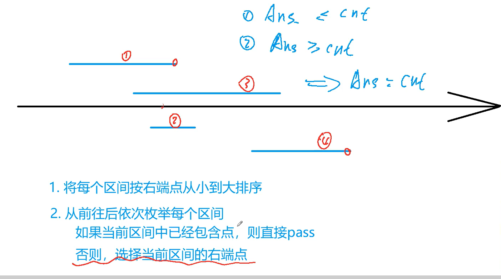
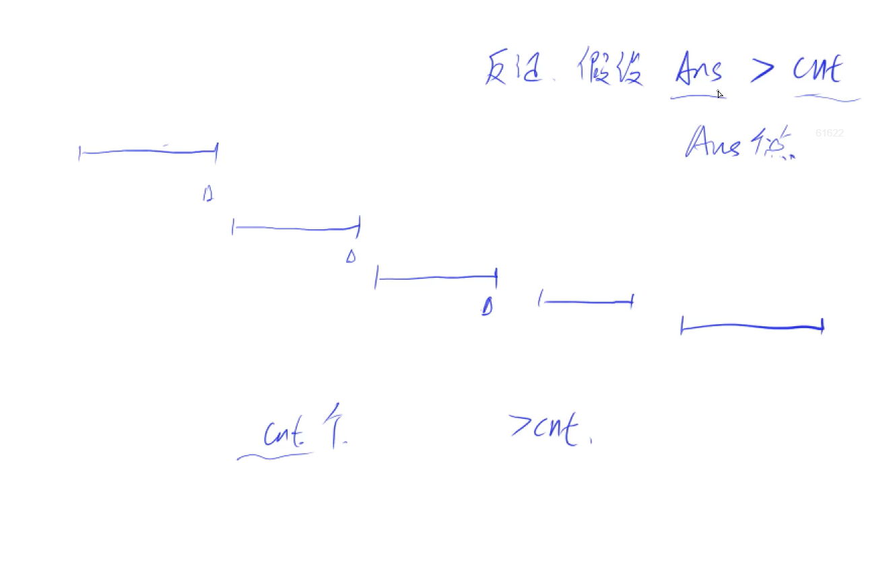
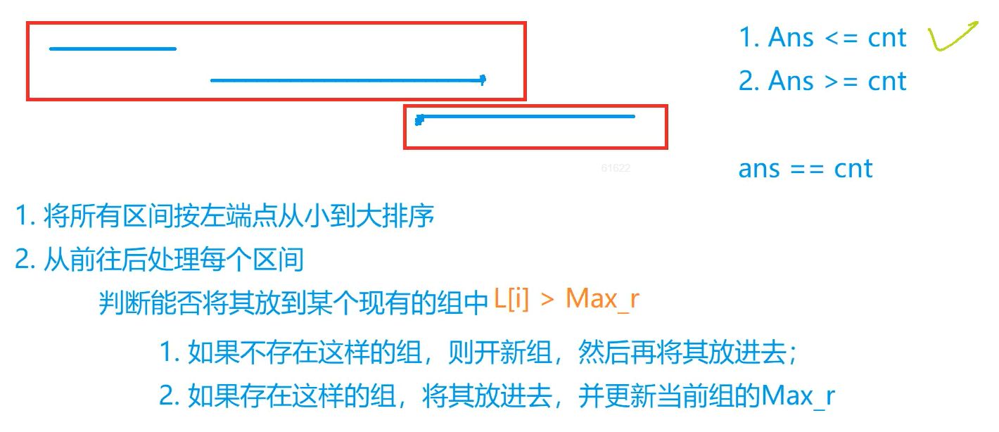
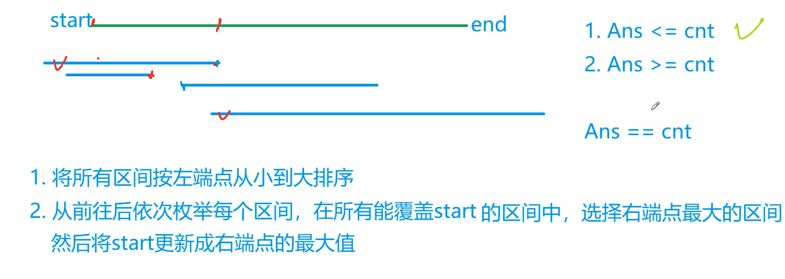
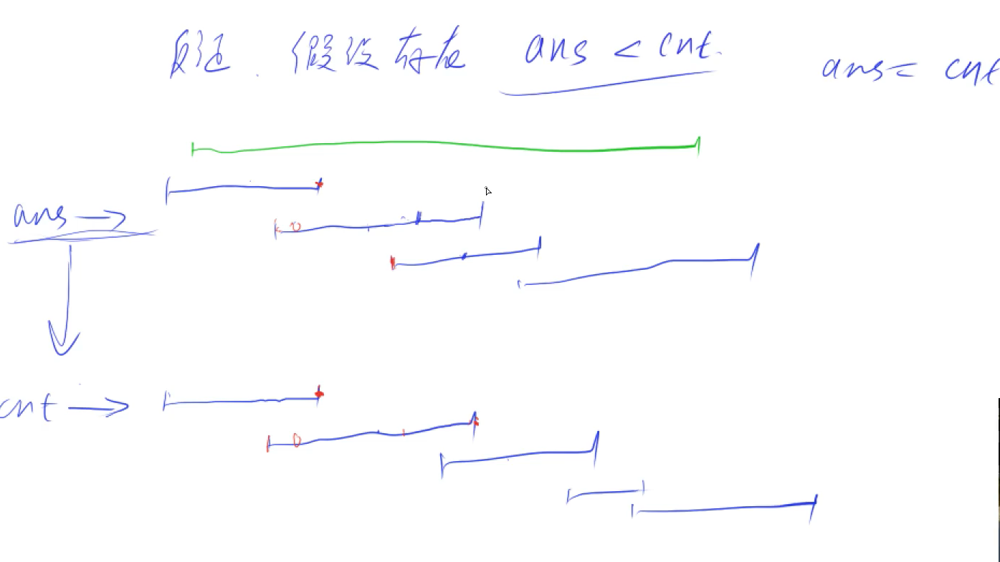

## 区间问题

### 1.区间合并

给定 N 个闭区间 [ai,bi]，请你在数轴上选择尽量少的点，使得每个区间内至少包含一个选出的点。

输出选择的点的最小数量。

位于区间端点上的点也算作区间内。

#### 输入格式

第一行包含整数 N，表示区间数。

接下来 N 行，每行包含两个整数 ai,bi，表示一个区间的两个端点。

#### 输出格式

输出一个整数，表示所需的点的最小数量。

#### 数据范围

1≤N≤10~5~
−109≤ai≤bi≤109

#### 输入样例：

```
3
-1 1
2 4
3 5
```

#### 输出样例：

```
2
```






```c++
#include<iostream>
#include<cstring>
#include<algorithm>

using namespace std;

const int N = 1e5+10;
struct Range{
    int a,b;
    bool operator<(Range&R)const{
        return b<R.b;
    }
}range[N];

int main(){
    int n;
    cin>>n;
    for(int i=0 ; i<n ; i++){
        int a,b;
        cin>>a>>b;
        range[i]={a,b};
    }
    
    sort(range,range+n);
    
    int ans = 0;
    int max_r = -1e9;
    for(int i=0 ; i<n ; i++){
        if(range[i].a > max_r){
            max_r = range[i].b;
            ans++;
        }
    }
    
    cout<<ans<<endl;
    
    return 0;
}


```


### 2.最大不想交区间数量

给定 N 个闭区间 [ai,bi]，请你在数轴上选择若干区间，使得选中的区间之间互不相交（包括端点）。

输出可选取区间的最大数量。

#### 输入格式

第一行包含整数 N，表示区间数。

接下来 N 行，每行包含两个整数 ai,bi，表示一个区间的两个端点。

#### 输出格式

输出一个整数，表示可选取区间的最大数量。

#### 数据范围

1≤N≤10~5~
−109≤ai≤bi≤109

#### 输入样例：

```
3
-1 1
2 4
3 5
```

#### 输出样例：

```
2
```

#### 题解

```c++
#include<iostream>
#include<algorithm>
#include<cstring>

using namespace std;

const int N = 1e5+10;

struct Range{
    int a,b;
    bool operator<(Range&R)const{
        return b<R.b;
    }
}range[N];

int main(){
    int n;
    cin>>n;
    for(int i=0 ; i<n ; i++){
        int a,b;
        cin>>a>>b;
        range[i]={a,b};
    }
    
    sort(range,range+n);
    
    int ans = 0;
    int max_r = -1e9;
    for(int i=0 ; i<n ; i++){
        if(max_r<range[i].a){
            max_r = range[i].b;
            ans++;
        }
    }
    
    cout<<ans<<endl;
    
    return 0;
    
}

```


### 3.区间分组

给定 N 个闭区间 [ai,bi]，请你将这些区间分成若干组，使得每组内部的区间两两之间（包括端点）没有交集，并使得组数尽可能小。

输出最小组数。

#### 输入格式

第一行包含整数 N，表示区间数。

接下来 N 行，每行包含两个整数 ai,bi，表示一个区间的两个端点。

#### 输出格式

输出一个整数，表示最小组数。

#### 数据范围

1≤N≤10^5^
−109≤ai≤bi≤109

#### 输入样例：

```
3
-1 1
2 4
3 5
```

#### 输出样例：

```
2
```




```c++
#include<iostream>
#include<algorithm>
#include<queue>
#include<cstring>

using namespace std;

const int N = 1e5+10;
struct Range{
    int a,b;
    bool operator<(Range&R)const{
        return a<R.a;
    }
}range[N];

int main(){
    int n;
    cin>>n;
    for(int i=0 ; i<n ; i++){
        int a,b;
        cin>>a>>b;
        range[i] = {a,b};
    }
    sort(range,range+n);
    
    priority_queue<int , vector<int> , greater<int>>heap;
    for(int i=0 ; i<n ; i++){
        if(heap.empty()||heap.top()>=range[i].a){
            heap.push(range[i].b);
        }else{
            heap.pop();
            heap.push(range[i].b);
        }
    }
    
    cout<<heap.size()<<endl;
    
    return 0;
    
}
```


#### 4.区间覆盖

给定 NN 个闭区间 [ai,bi][ai,bi] 以及一个线段区间 [s,t][s,t]，请你选择尽量少的区间，将指定线段区间完全覆盖。

输出最少区间数，如果无法完全覆盖则输出 −1−1。

#### 输入格式

第一行包含两个整数 ss 和 tt，表示给定线段区间的两个端点。

第二行包含整数 NN，表示给定区间数。

接下来 NN 行，每行包含两个整数 ai,biai,bi，表示一个区间的两个端点。

#### 输出格式

输出一个整数，表示所需最少区间数。

如果无解，则输出 −1−1。

#### 数据范围

1≤N≤1051≤N≤105,
−109≤ai≤bi≤109−109≤ai≤bi≤109,
−109≤s≤t≤109−109≤s≤t≤109

#### 输入样例：

```
1 5
3
-1 3
2 4
3 5
```

#### 输出样例：

```
2
```




