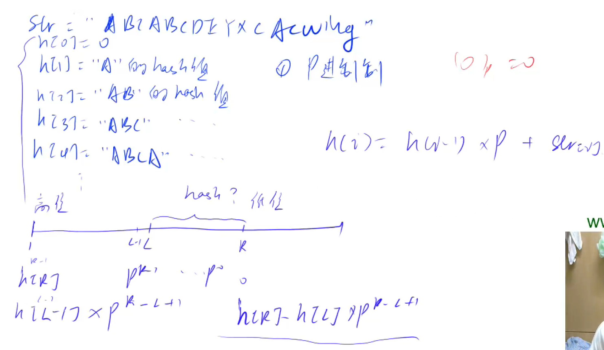

## 字符串前缀哈希法



#### 注意点：

1. 字母不能映射成0
2. 假设不存在冲突
   - p（进制）=131 或 p=1331 冲突最少
   - Q  （被模数）=2^64^

#### 模板：

```c++
核心思想：将字符串看成P进制数，P的经验值是131或13331，取这两个值的冲突概率低
小技巧：取模的数用2^64，这样直接用unsigned long long存储，溢出的结果就是取模的结果

typedef unsigned long long ULL;
ULL h[N], p[N]; // h[k]存储字符串前k个字母的哈希值, p[k]存储 P^k mod 2^64

// 初始化
p[0] = 1;
for (int i = 1; i <= n; i ++ )
{
    h[i] = h[i - 1] * P + str[i];
    p[i] = p[i - 1] * P;
}

// 计算子串 str[l ~ r] 的哈希值
ULL get(int l, int r)
{
    return h[r] - h[l - 1] * p[r - l + 1];
}
```

#### 例题：AcWing 841. 字符串哈希

给定一个长度为 n 的字符串，再给定 m 个询问，每个询问包含四个整数 l1,r1,l2,r2，请你判断 [l1,r1] 和 [l2,r2] 这两个区间所包含的字符串子串是否完全相同。

字符串中只包含大小写英文字母和数字。

##### 输入格式

第一行包含整数 n 和 m，表示字符串长度和询问次数。

第二行包含一个长度为 n 的字符串，字符串中只包含大小写英文字母和数字。

接下来 m 行，每行包含四个整数 l1,r1,l2,r2，表示一次询问所涉及的两个区间。

注意，字符串的位置从 1 开始编号。

##### 输出格式

对于每个询问输出一个结果，如果两个字符串子串完全相同则输出 `Yes`，否则输出 `No`。

每个结果占一行。

##### 数据范围

1≤n,m≤10^5^

##### 输入样例：

```
8 3
aabbaabb
1 3 5 7
1 3 6 8
1 2 1 2
```

##### 输出样例：

```
Yes
No
Yes
```

#### 题解：

```c++
#include<iostream>
#include<algorithm>

using namespace std;

typedef unsigned long long ULL;

const int N = 1e5+10 , P = 131;
ULL h[N] , p[N];
char str[N];

ULL get(int l , int r){
    return h[r]-h[l-1]*p[r-l+1];
}

int main(){
    int n,m;
    scanf("%d%d%s",&n,&m,str+1);
    
    p[0] = 1;
    for(int i=1 ; i<=n ; i++){
        p[i] = p[i-1]*P;
        h[i] = h[i-1]*P + str[i];
    }
    
    while(m--){
        int l1,r1,l2,r2;
        scanf("%d%d%d%d",&l1,&r1,&l2,&r2);
        
        if(get(l1,r1) == get(l2,r2))	puts("Yes");
        else	puts("No");
    }
    return 0;
}
```


## KMP

- **作用：**匹配最长字符串

#### **模板：**

```c++
// s[]是长文本，p[]是模式串，n是s的长度，m是p的长度
求模式串的Next数组：
for (int i = 2, j = 0; i <= m; i ++ )
{
    while (j && p[i] != p[j + 1]) j = ne[j];
    if (p[i] == p[j + 1]) j ++ ;
    ne[i] = j;
}

// 匹配
for (int i = 1, j = 0; i <= n; i ++ )
{
    while (j && s[i] != p[j + 1]) j = ne[j];
    if (s[i] == p[j + 1]) j ++ ;
    if (j == m)
    {
        j = ne[j];
        // 匹配成功后的逻辑
    }
}
```

#### 例题：AcWing 831. KMP字符串

给定一个模式串 S，以及一个模板串 P，所有字符串中只包含大小写英文字母以及阿拉伯数字。

模板串 P 在模式串 S 中多次作为子串出现。

求出模板串 P 在模式串 S 中所有出现的位置的起始下标。

##### 输入格式

第一行输入整数 N，表示字符串 P 的长度。

第二行输入字符串 P。

第三行输入整数 M，表示字符串 S 的长度。

第四行输入字符串 S。

##### 输出格式

共一行，输出所有出现位置的起始下标（下标从 0 开始计数），整数之间用空格隔开。

##### 数据范围

1≤N≤10^5^
1≤M≤10^6^

##### 输入样例：

```
3
aba
5
ababa
```

##### 输出样例：

```
0 2
```

##### 题解：

```c++
#include<iostream>

using namespace std;

const int M = 1e5+10 , N = 1e6+10;
char p[M],s[N];
int ne[M];

int main(){
	int m,n;
    cin>>m>>(p+1)>>n>>(s+1);
    
    //ne数组初始化
    for(int i=2 , j=0 ; i<=m ; i++){
        while(j && p[i]!=p[j+1])	j = ne[j];
        if(p[i] == p[j+1])	j++;
        ne[i] = j;
    }
    
    //KMP匹配
    for(int i=1 , j=0 ; i<=n ; i++){
        while(j && s[i]!=p[j+1])	j = ne[j];
        if(s[i] == p[j+1])	j++;
        if(j == m){
            printf("%d ",i-m);
            j = ne[j];
        }
    }
    
    return 0;
}
```


## tire树

- **用来快速存储字符串集合的数据结构**


#### **模板：**

```c++
int son[N][26], cnt[N], idx;
// 0号点既是根节点，又是空节点
// son[][]存储树中每个节点的子节点
// cnt[]存储以每个节点结尾的单词数量

// 插入一个字符串
void insert(char *str)
{
    int p = 0;
    for (int i = 0; str[i]; i ++ )
    {
        int u = str[i] - 'a';
        if (!son[p][u]) son[p][u] = ++ idx;
        p = son[p][u];
    }
    cnt[p] ++ ;
}

// 查询字符串出现的次数
int query(char *str)
{
    int p = 0;
    for (int i = 0; str[i]; i ++ )
    {
        int u = str[i] - 'a';
        if (!son[p][u]) return 0;
        p = son[p][u];
    }
    return cnt[p];
}
```

#### 题解：AcWing 835. Trie字符串统计

维护一个字符串集合，支持两种操作：

1. `I x` 向集合中插入一个字符串 x；
2. `Q x` 询问一个字符串在集合中出现了多少次。

共有 N 个操作，输入的字符串总长度不超过 10^5^，字符串仅包含小写英文字母。

##### 输入格式

第一行包含整数 N，表示操作数。

接下来 N 行，每行包含一个操作指令，指令为 `I x` 或 `Q x` 中的一种。

##### 输出格式

对于每个询问指令 `Q x`，都要输出一个整数作为结果，表示 xx 在集合中出现的次数。

每个结果占一行。

##### 数据范围

1≤N≤2∗10^4^

##### 输入样例：

```
5
I abc
Q abc
Q ab
I ab
Q ab
```

##### 输出样例：

```
1
0
1
```

##### 题解：

```c++
#include<iostream>

using namespace std;

const int N = 1e5+10;
char son[N][26],cnt[N],idx;
char str[N];

void insert(char* s){
	int p = 0;
    for(int i=0 ; s[i] ; i++){
        int u = s[i]-'a';
        if(!son[p][u])	son[p][u] = ++idx;
        p = son[p][u];
    }
    cnt[p]++;
}

int query(char* s){
    int p = 0;
    for(int i=0 ; s[i] ; i++){
        int u = s[i]-'a';
        if(!son[p][u])	return 0;
        p = son[p][u];
    }
    return cnt[p];
}

int main(){
	int n;
    cin>>n;
    
    while(n--){
        char op[2];
        cin>>op>>str;
       
        // scanf("%s%s",op,str);
        if(*op == 'I')	insert(str);
        else	printf("%d\n",query(str));
    }
    
    return 0;
}


```


#### 例题：AcWing 143. 最大异或对

在给定的 N 个整数 A1，A2……AN 中选出两个进行 xor（异或）运算，得到的结果最大是多少？

##### 输入格式

第一行输入一个整数 N。

第二行输入 N 个整数 A~1~～A~N~。

##### 输出格式

输出一个整数表示答案。

##### 数据范围

1≤N≤10^5^

0≤Ai<2^31^

```
3
1 2 3
```

##### 输出样例：

```
3
```

##### 题解：

```c++
#include<iostream>

using namespace std;

const int N = 1e5+10 , M = 3100010 ;
int a[N] , son[M][2] , idx;


void insert(int x){
    int p = 0 ;
    for(int i=30 ; i>=0 ; i--){
        int s = x>>i&1;
        if(!son[p][s])
            son[p][s] = ++idx;
         p = son[p][s];
    }
}

int search(int x){
    int p = 0 , res = 0;
    for(int i=30 ; i>=0 ; i--){
        int s = x>>i&1;
        if(son[p][!s]){
            res += 1<<i;
            p = son[p][!s];
        }else{
            p = son[p][s];
        }
    }
    return res;
}

int main(){
    int n;
    cin>>n;
    for(int i = 0 ; i<n ; i++){
        cin>>a[i];
        insert(a[i]);
    }
    
    int res = 0;
    for(int i=0 ; i<n ; i++){
        res = max(res , search(a[i]));
    }
    
    cout<<res<<endl;
    
    return 0;
}

```

