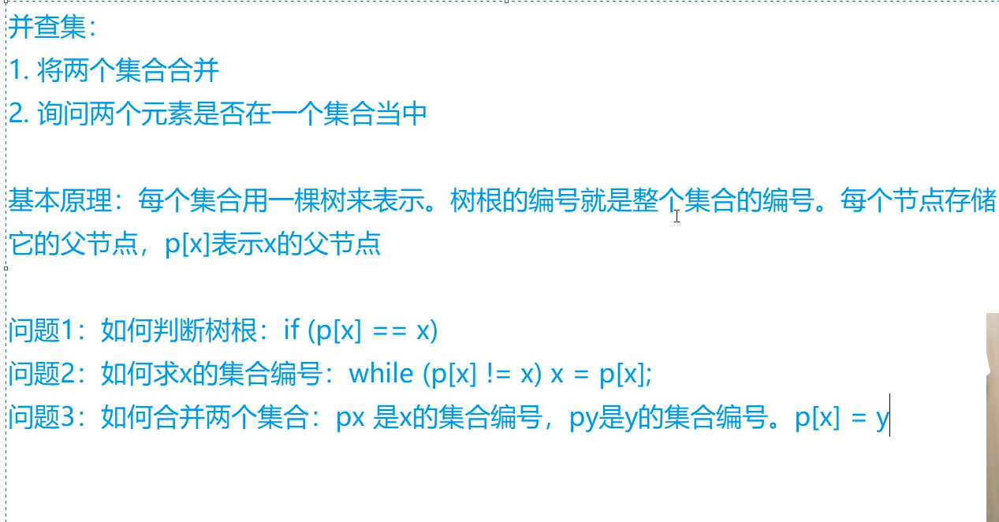
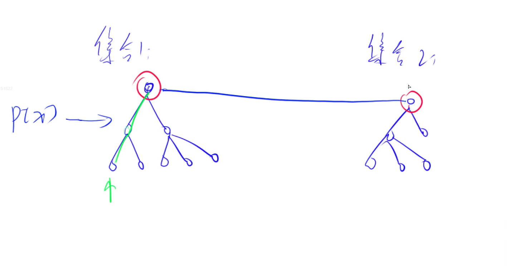
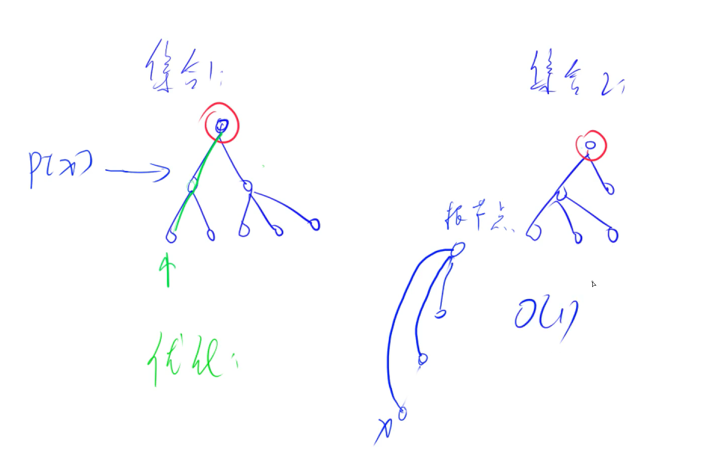

## 前缀和与差分

​					**——前缀和与差分互为逆运算**


### 一、一维前缀和

- **思路：**

  1. 存在序列  a~1~、a~2~、、、a~n~

     使得          s~i~=a~1~+a~2~+、、、+a~i~

     则               s~i~便是a~i~前缀和

  2. 作用，可在O(1)时间内求出a序列[l,r]区间的值，s~r~-s~l-1~

- **模板：**

  ```c++
  S[i] = a[1] + a[2] + ... a[i]
  a[l] + ... + a[r] = S[r] - S[l - 1]
  ```

  

### 二、二维前缀和

- **思路：**

  1. 将一维数组换成二维数组
  2. 二维前缀和数组存储a的前缀和
  3. 作用，可以求矩阵中的小矩阵和

- **模板：**

  ```c++
  S[i, j] = 第i行j列格子左上部分所有元素的和
  以(x1, y1)为左上角，(x2, y2)为右下角的子矩阵的和为：
  S[x2, y2] - S[x1 - 1, y2] - S[x2, y1 - 1] + S[x1 - 1, y1 - 1]
  ```

  


### 三、一维差分

- **思路：**

  1. 如果存在序列 a~1~、a~2~、、、a~n~

     构造				b~1~、b~2~、、、b~n~

     使得				a~i~=b+b~2~+、、、+b~i~

     则b~1~、b~2~、、、b~n~为a~1~、a~2~、、、a~n~的差分序列

     同时有			b~1~=a~1~

     ​						b~2~=a~2~-a~1~

     ​						、、、

     ​						b~n~=a~n~-a~n-1~

  2. 作用：如果想在a序列区间[l,r]中加上c，可b~l~+c，同时b~r+1~

- **模板：**

  ```c++
  给区间[l, r]中的每个数加上c：B[l] += c, B[r + 1] -= c
  ```

  


### 四、二维差分

- **思路：**

  1. 将一维数组换成二维数组即可

- **模板：**

  ```c++
  给以(x1, y1)为左上角，(x2, y2)为右下角的子矩阵中的所有元素加上c：
  S[x1, y1] += c, S[x2 + 1, y1] -= c, S[x1, y2 + 1] -= c, S[x2 + 1, y2 + 1] += c
  ```

  


## 并查集








- **模板：**

  ```c++
  (1)朴素并查集：
  
      int p[N]; //存储每个点的祖宗节点
  
      // 返回x的祖宗节点
      int find(int x)
      {
          if (p[x] != x) p[x] = find(p[x]);
          return p[x];
      }
  
      // 初始化，假定节点编号是1~n
      for (int i = 1; i <= n; i ++ ) p[i] = i;
  
      // 合并a和b所在的两个集合：
      p[find(a)] = find(b);
  
  
  (2)维护size的并查集：
  
      int p[N], size[N];
      //p[]存储每个点的祖宗节点, size[]只有祖宗节点的有意义，表示祖宗节点所在集合中的点的数量
  
      // 返回x的祖宗节点
      int find(int x)
      {
          if (p[x] != x) p[x] = find(p[x]);
          return p[x];
      }
  
      // 初始化，假定节点编号是1~n
      for (int i = 1; i <= n; i ++ )
      {
          p[i] = i;
          size[i] = 1;
      }
  
      // 合并a和b所在的两个集合：
      size[find(b)] += size[find(a)];
      p[find(a)] = find(b);
  
  
  (3)维护到祖宗节点距离的并查集：
  
      int p[N], d[N];
      //p[]存储每个点的祖宗节点, d[x]存储x到p[x]的距离
  
      // 返回x的祖宗节点
      int find(int x)
      {
          if (p[x] != x)
          {
              int u = find(p[x]);
              d[x] += d[p[x]];
              p[x] = u;
          }
          return p[x];
      }
  
      // 初始化，假定节点编号是1~n
      for (int i = 1; i <= n; i ++ )
      {
          p[i] = i;
          d[i] = 0;
      }
  
      // 合并a和b所在的两个集合：
      p[find(a)] = find(b);
      d[find(a)] = distance; // 根据具体问题，初始化find(a)的偏移量
  ```

  


## 双指针算法

- **类别有两种：**

  1. 两个指针分别指向两个序列（归并排序）
  2. 两个指针指向一个序列（快速排序）

- **核心作用：**将暴力解法时间复杂度由O(n^2^)降低到O(n)，双指针算法应用于单调性序列

- **解题思路：** 

  1. 先暴力解出来
  2. 找到其中的规律，优化成O(n)

- **模板：**

  ```c++
  for (int i = 0, j = 0; i < n; i ++ )
  {
      while (j < i && check(i, j)) j ++ ;
  
      // 具体问题的逻辑
  }
  常见问题分类：
      (1) 对于一个序列，用两个指针维护一段区间
      (2) 对于两个序列，维护某种次序，比如归并排序中合并两个有序序列的操作
  ```

  


## 区间合并

- **区间关系：**

  1. 包含
  2. 相交
  3. 无交集

- **解题思路：**

  1. 按区间左端点排序
  2. 维护一个区间，扫描剩余区间
  3. 若剩余区间包含于维护区间，则跳过
  4. 若剩余区间相交于维护区间，则更新维护区间右边界
  5. 若无交集，则取出合并区间，维护下一个区间

- **模板：**

  ```c++
  // 将所有存在交集的区间合并
  void merge(vector<PII> &segs)
  {
      vector<PII> res;
  
      sort(segs.begin(), segs.end());
  
      int st = -2e9, ed = -2e9;
      for (auto seg : segs)
          if (ed < seg.first)
          {
              if (st != -2e9) res.push_back({st, ed});
              st = seg.first, ed = seg.second;
          }
          else ed = max(ed, seg.second);
  
      if (st != -2e9) res.push_back({st, ed});
  
      segs = res;
  }
  ```

  


## 位运算

- **第一种应用，查看n的二进制表中第k位是几**

  1. 先把k位移到最后一位   x=n>>k
  2. 看个位是几    x&1
  3. 综合得        n>>k&1

- **lowbit(x)**

  1. 作用：返回x的最后一位1，如x=101000，lowbit(x)=1000

  2. 原理：lowbit(x) = x&-x = x&(~x+1)

     例如    x    101000

     ​		   ~x   010111

     ​       ~x+1   011111

      x&(~x+1)   001000

  3. 应用：统计1的个数

     1）每次减去最后一个1

     2）统计减的次数，即可知道有几个1

- **模板：**

  ```c++
  求n的第k位数字: n >> k & 1
  返回n的最后一位1：lowbit(n) = n & -n
  
  ```

  


## 高精度

### 一、高精度加法

- **思想：**

  1. 数据从低位到高位存储到数组中
  2. 进行加法模拟
  3. A+B  ，log(A)<=10^6^ ,log(B)<=10^6^

- **模板：**

  ```c++
  // C = A + B, A >= 0, B >= 0
  vector<int> add(vector<int> &A, vector<int> &B)
  {
      if (A.size() < B.size()) return add(B, A);
  
      vector<int> C;
      int t = 0;
      for (int i = 0; i < A.size(); i ++ )
      {
          t += A[i];
          if (i < B.size()) t += B[i];
          C.push_back(t % 10);
          t /= 10;
      }
  
      if (t) C.push_back(t);
      return C;
  }
  ```

  


### 二、高精度减法

- **思路：**

  1. 先判断A和B的大小，用大的减小的
  2. 进行减法运算

- **模板：**

  ```c++
  // C = A - B, 满足A >= B, A >= 0, B >= 0
  vector<int> sub(vector<int> &A, vector<int> &B)
  {
      vector<int> C;
      for (int i = 0, t = 0; i < A.size(); i ++ )
      {
          t = A[i] - t;
          if (i < B.size()) t -= B[i];
          C.push_back((t + 10) % 10);
          if (t < 0) t = 1;
          else t = 0;
      }
  
      while (C.size() > 1 && C.back() == 0) C.pop_back();
      return C;
  }
  ```

  


### 三、高精度乘法

- **思路：**

  1. Axb ,log(A)<=10^6^ ,a<=10^9^
  2. 进行乘法运算
  3. 清除高位的0

- **模板：**

  ```c++
  // C = A * b, A >= 0, b > 0
  vector<int> mul(vector<int> &A, int b)
  {
      vector<int> C;
  
      int t = 0;
      for (int i = 0; i < A.size() || t; i ++ )
      {
          if (i < A.size()) t += A[i] * b;
          C.push_back(t % 10);
          t /= 10;
      }
  
      while (C.size() > 1 && C.back() == 0) C.pop_back();
  
      return C;
  }
  ```

  


### 四、高精度除法

- **思路：**

  1. A/b ,A的每一位单独除以b，结果添加到C数组中，用余数乘10加上下一位数，继续除以b
  2. 清除高位的0

- **模板：**

  ```c++
  // A / b = C ... r, A >= 0, b > 0
  vector<int> div(vector<int> &A, int b, int &r)
  {
      vector<int> C;
      r = 0;
      for (int i = A.size() - 1; i >= 0; i -- )
      {
          r = r * 10 + A[i];
          C.push_back(r / b);
          r %= b;
      }
      reverse(C.begin(), C.end());
      while (C.size() > 1 && C.back() == 0) C.pop_back();
      return C;
  }
  ```


