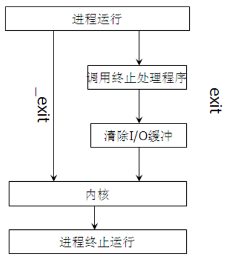
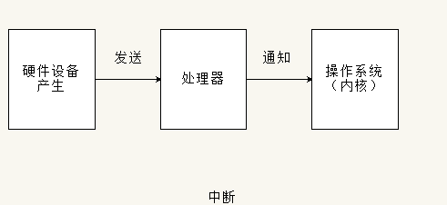
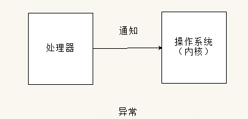

#### 1、进程、线程和协程的区别和联系

|          | 进程                                                         | 线程                                               | 协程                                                         |
| -------- | ------------------------------------------------------------ | -------------------------------------------------- | ------------------------------------------------------------ |
| 定义     | 资源分配和拥有的基本单位                                     | 程序执行的基本单位                                 | 用户态的轻量级线程，线程内部调度的基本单位                   |
| 切换情况 | 进程CPU环境(栈、寄存器、页表和文件句柄等)的保存以及新调度的进程CPU环境的设置 | 保存和设置程序计数器、少量寄存器和栈的内容         | 先将寄存器上下文和栈保存，等切换回来的时候再进行恢复         |
| 切换者   | 操作系统                                                     | 操作系统                                           | 用户                                                         |
| 切换过程 | 用户态->内核态->用户态                                       | 用户态->内核态->用户态                             | 用户态(没有陷入内核)                                         |
| 调用栈   | 内核栈                                                       | 内核栈                                             | 用户栈                                                       |
| 拥有资源 | CPU资源、内存资源、文件资源和句柄等                          | 程序计数器、寄存器、栈和状态字                     | 拥有自己的寄存器上下文和栈                                   |
| 并发性   | 不同进程之间切换实现并发，各自占有CPU实现并行                | 一个进程内部的多个线程并发执行                     | 同一时间只能执行一个协程，而其他协程处于休眠状态，适合对任务进行分时处理 |
| 系统开销 | 切换虚拟地址空间，切换内核栈和硬件上下文，CPU高速缓存失效、页表切换，开销很大 | 切换时只需保存和设置少量寄存器内容，因此开销很小   | 直接操作栈则基本没有内核切换的开销，可以不加锁的访问全局变量，所以上下文的切换非常快 |
| 通信方面 | 进程间通信需要借助操作系统                                   | 线程间可以直接读写进程数据段(如全局变量)来进行通信 | 共享内存、消息队列                                           |


1、进程是资源调度的基本单位，运行一个可执行程序会创建一个或多个进程，进程就是运行起来的可执行程序

2、线程是程序执行的基本单位，是轻量级的进程。每个进程中都有唯一的主线程，且只能有一个，主线程和进程是相互依存的关系，主线程结束进程也会结束。多提一句：协程是用户态的轻量级线程，线程内部调度的基本单位


#### 2、线程与进程的比较

1、线程启动速度快，轻量级   

2、线程的系统开销小   

3、线程使用有一定难度，需要处理数据一致性问题

4、同一线程共享的有堆、全局变量、静态变量、指针，引用、文件等，而独自占有栈


#### 3、一个进程可以创建多少线程，和什么有关？

理论上，一个进程可用虚拟空间是2G，默认情况下，线程的栈的大小是1MB，所以理论上最多只能创建2048个线程。如果要创建多于2048的话，必须修改编译器的设置。

因此，一个进程可以创建的线程数由可用虚拟空间和线程的栈的大小共同决定，只要虚拟空间足够，那么新线程的建立就会成功。如果需要创建超过2K以上的线程，减小你线程栈的大小就可以实现了，虽然在一般情况下，你不需要那么多的线程。过多的线程将会导致大量的时间浪费在线程切换上，给程序运行效率带来负面影响。

> 《一个进程到底能创建多少线程》：https://www.cnblogs.com/Leo_wl/p/5969621.html

#### 4、外中断和异常有什么区别？

外中断是指由 CPU 执行指令以外的事件引起，如 I/O 完成中断，表示设备输入/输出处理已经完成，处理器能够发送下一个输入/输出请求。此外还有时钟中断、控制台中断等。

而异常时由 CPU 执行指令的内部事件引起，如非法操作码、地址越界、算术溢出等。


#### 5、进程线程模型你知道多少？

对于进程和线程的理解和把握可以说基本奠定了对系统的认知和把控能力。其核心意义绝不仅仅是“线程是调度的基本单位，进程是资源分配的基本单位”这么简单。

##### 多线程

我们这里讨论的是用户态的多线程模型，同一个进程内部有多个线程，所有的线程共享同一个进程的内存空间，进程中定义的全局变量会被所有的线程共享，比如有全局变量int i = 10，这一进程中所有并发运行的线程都可以读取和修改这个i的值，而多个线程被CPU调度的顺序又是不可控的，所以对临界资源的访问尤其需要注意安全。

我们必须知道，**做一次简单的i = i + 1在计算机中并不是原子操作，涉及内存取数，计算和写入内存几个环节，**而线程的切换有可能发生在上述任何一个环节中间，所以不同的操作顺序很有可能带来意想不到的结果。

但是，虽然线程在安全性方面会引入许多新挑战，但是线程带来的好处也是有目共睹的。首先，原先顺序执行的程序（暂时不考虑多进程）可以被拆分成几个独立的逻辑流，这些逻辑流可以独立完成一些任务（最好这些任务是不相关的）。

比如 QQ 可以一个线程处理聊天一个线程处理上传文件，两个线程互不干涉，在用户看来是同步在执行两个任务，试想如果线性完成这个任务的话，在数据传输完成之前用户聊天被一直阻塞会是多么尴尬的情况。

对于线程，我认为弄清以下两点非常重要：

- 线程之间有无先后访问顺序（线程依赖关系）

- 多个线程共享访问同一变量（同步互斥问题）

另外，我们通常只会去说同一进程的多个线程共享进程的资源，但是每个线程特有的部分却很少提及，除了标识线程的tid，每个线程还有自己独立的栈空间，线程彼此之间是无法访问其他线程栈上内容的。

而作为处理机调度的最小单位，线程调度只需要保存线程栈、寄存器数据和PC即可，相比进程切换开销要小很多。

线程相关接口不少，主要需要了解各个参数意义和返回值意义。

1. 线程创建和结束

   - 背景知识：

     在一个文件内的多个函数通常都是按照main函数中出现的顺序来执行，但是在分时系统下，我们可以让每个函数都作为一个逻辑流并发执行，最简单的方式就是采用多线程策略。在main函数中调用多线程接口创建线程，每个线程对应特定的函数（操作），这样就可以不按照main函数中各个函数出现的顺序来执行，避免了忙等的情况。线程基本操作的接口如下。

   - 相关接口：

     - 创建线程：int pthread_create(pthread_t *pthread, const pthread_attr_t *attr, void *(*start_routine)(void *), void *agr);

       创建一个新线程，pthread和start_routine不可或缺，分别用于标识线程和执行体入口，其他可以填NULL。

       - pthread：用来返回线程的tid，*pthread值即为tid，类型pthread_t == unsigned long int。

       - attr：指向线程属性结构体的指针，用于改变所创线程的属性，填NULL使用默认值。

       - start_routine：线程执行函数的首地址，传入函数指针。

       - arg：通过地址传递来传递函数参数，这里是无符号类型指针，可以传任意类型变量的地址，在被传入函数中先强制类型转换成所需类型即可。

     - 获得线程ID：pthread_t pthread_self();

       调用时，会打印线程ID。

     - 等待线程结束：int pthread_join(pthread_t tid, void** retval);

       主线程调用，等待子线程退出并回收其资源，类似于进程中wait/waitpid回收僵尸进程，调用pthread_join的线程会被阻塞。

       - tid：创建线程时通过指针得到tid值。

       - retval：指向返回值的指针。

     - 结束线程：pthread_exit(void *retval);

       子线程执行，用来结束当前线程并通过retval传递返回值，该返回值可通过pthread_join获得。

       - retval：同上。

     - 分离线程：int pthread_detach(pthread_t tid);

       主线程、子线程均可调用。主线程中pthread_detach(tid)，子线程中pthread_detach(pthread_self())，调用后和主线程分离，子线程结束时自己立即回收资源。

       - tid：同上。

2. 线程属性值修改

   - 背景知识：

     线程属性对象类型为pthread_attr_t，结构体定义如下：

     ```C
     typedef struct{
         int etachstate;    // 线程分离的状态
         int schedpolicy;    // 线程调度策略
         struct sched_param schedparam;    // 线程的调度参数
         int inheritsched;    // 线程的继承性
         int scope;    // 线程的作用域
         // 以下为线程栈的设置
         size_t guardsize;    // 线程栈末尾警戒缓冲大小
         int stackaddr_set;    // 线程的栈设置
         void *    stackaddr;    // 线程栈的位置
         size_t stacksize;    // 线程栈大小
     }pthread_arrt_t;
     
     ```

   - 相关接口：

     对上述结构体中各参数大多有：pthread_attr_get()和pthread_attr_set()系统调用函数来设置和获取。这里不一一罗列。

##### 多进程

每一个进程是资源分配的基本单位。

进程结构由以下几个部分组成：代码段、堆栈段、数据段。代码段是静态的二进制代码，多个程序可以共享。

实际上在父进程创建子进程之后，父、子进程除了pid外，几乎所有的部分几乎一样。

父、子进程共享全部数据，但并不是说他们就是对同一块数据进行操作，子进程在读写数据时会通过写时复制机制将公共的数据重新拷贝一份，之后在拷贝出的数据上进行操作。

如果子进程想要运行自己的代码段，还可以通过调用execv()函数重新加载新的代码段，之后就和父进程独立开了。

我们在shell中执行程序就是通过shell进程先fork()一个子进程再通过execv()重新加载新的代码段的过程。

1. 进程创建与结束

   - 背景知识：

     进程有两种创建方式，一种是操作系统创建的一种是父进程创建的。从计算机启动到终端执行程序的过程为：0号进程 -> 1号内核进程 -> 1号用户进程(init进程) -> getty进程 -> shell进程 -> 命令行执行进程。所以我们在命令行中通过 ./program执行可执行文件时，所有创建的进程都是shell进程的子进程，这也就是为什么shell一关闭，在shell中执行的进程都自动被关闭的原因。从shell进程到创建其他子进程需要通过以下接口。

   - 相关接口：

     - 创建进程：pid_t fork(void);

       返回值：出错返回-1；父进程中返回pid > 0；子进程中pid == 0

     - 结束进程：void exit(int status);

       - status是退出状态，保存在全局变量中S?，通常0表示正常退出。

     - 获得PID：pid_t getpid(void);

       返回调用者pid。

     - 获得父进程PID：pid_t getppid(void);

       返回父进程pid。

   - 其他补充：

     - 正常退出方式：exit()、_exit()、return（在main中）。

       exit()和_exit()区别：exit()是对\__exit()的封装，都会终止进程并做相关收尾工作，最主要的区别是\_exit()函数关闭全部描述符和清理函数后不会刷新流，但是exit()会在调用_exit()函数前刷新数据流。

       return和exit()区别：exit()是函数，但有参数，执行完之后控制权交给系统。return若是在调用函数中，执行完之后控制权交给调用进程，若是在main函数中，控制权交给系统。

     - 异常退出方式：abort()、终止信号。

2. Linux进程控制

- 进程地址空间（地址空间）

  虚拟存储器为每个进程提供了独占系统地址空间的假象。

  尽管每个进程地址空间内容不尽相同，但是他们的都有相似的结构。X86 Linux进程的地址空间底部是保留给用户程序的，包括文本、数据、堆、栈等，其中文本区和数据区是通过存储器映射方式将磁盘中可执行文件的相应段映射至虚拟存储器地址空间中。

  有一些"敏感"的地址需要注意下，对于32位进程来说，代码段从0x08048000开始。从0xC0000000开始到0xFFFFFFFF是内核地址空间，通常情况下代码运行在用户态（使用0x00000000 ~ 0xC00000000的用户地址空间），当发生系统调用、进程切换等操作时CPU控制寄存器设置模式位，进入内和模式，在该状态（超级用户模式）下进程可以访问全部存储器位置和执行全部指令。

  也就说32位进程的地址空间都是4G，但用户态下只能访问低3G的地址空间，若要访问3G ~ 4G的地址空间则只有进入内核态才行。

- 进程控制块（处理机）

  进程的调度实际就是内核选择相应的进程控制块，被选择的进程控制块中包含了一个进程基本的信息。

- 上下文切换

  内核管理所有进程控制块，而进程控制块记录了进程全部状态信息。每一次进程调度就是一次上下文切换，所谓的上下文本质上就是当前运行状态，主要包括通用寄存器、浮点寄存器、状态寄存器、程序计数器、用户栈和内核数据结构（页表、进程表、文件表）等。

  进程执行时刻，内核可以决定抢占当前进程并开始新的进程，这个过程由内核调度器完成，当调度器选择了某个进程时称为该进程被调度，该过程通过上下文切换来改变当前状态。

  一次完整的上下文切换通常是进程原先运行于用户态，之后因系统调用或时间片到切换到内核态执行内核指令，完成上下文切换后回到用户态，此时已经切换到进程B。


#### 6、进程调度算法你了解多少？

1、 **先来先服务 first-come first-serverd（FCFS）**  

非抢占式的调度算法，按照请求的顺序进行调度。

有利于长作业，但不利于短作业，因为短作业必须一直等待前面的长作业执行完毕才能执行，而长作业又需要执行很长时间，造成了短作业等待时间过长。

2、 **短作业优先 shortest job first（SJF）**  

非抢占式的调度算法，按估计运行时间最短的顺序进行调度。

长作业有可能会饿死，处于一直等待短作业执行完毕的状态。因为如果一直有短作业到来，那么长作业永远得不到调度。

3、**最短剩余时间优先 shortest remaining time next（SRTN）**  

最短作业优先的抢占式版本，按剩余运行时间的顺序进行调度。 当一个新的作业到达时，其整个运行时间与当前进程的剩余时间作比较。

如果新的进程需要的时间更少，则挂起当前进程，运行新的进程。否则新的进程等待。

4、**时间片轮转**  

将所有就绪进程按 FCFS 的原则排成一个队列，每次调度时，把 CPU 时间分配给队首进程，该进程可以执行一个时间片。

当时间片用完时，由计时器发出时钟中断，调度程序便停止该进程的执行，并将它送往就绪队列的末尾，同时继续把 CPU 时间分配给队首的进程。

时间片轮转算法的效率和时间片的大小有很大关系：

- 因为进程切换都要保存进程的信息并且载入新进程的信息，如果时间片太小，会导致进程切换得太频繁，在进程切换上就会花过多时间。
- 而如果时间片过长，那么实时性就不能得到保证。


5、**优先级调度**  

为每个进程分配一个优先级，按优先级进行调度。

为了防止低优先级的进程永远等不到调度，可以随着时间的推移增加等待进程的优先级。

6、**多级反馈队列**  

一个进程需要执行 100 个时间片，如果采用时间片轮转调度算法，那么需要交换 100 次。

多级队列是为这种需要连续执行多个时间片的进程考虑，它设置了多个队列，每个队列时间片大小都不同，例如 1,2,4,8,..。进程在第一个队列没执行完，就会被移到下一个队列。

这种方式下，之前的进程只需要交换 7 次。每个队列优先权也不同，最上面的优先权最高。因此只有上一个队列没有进程在排队，才能调度当前队列上的进程。

可以将这种调度算法看成是时间片轮转调度算法和优先级调度算法的结合。


#### 7、Linux下进程间通信方式？

- 管道：

  - 无名管道（内存文件）：管道是一种半双工的通信方式，数据只能单向流动，而且只能在具有亲缘关系的进程之间使用。进程的亲缘关系通常是指父子进程关系。

  - 有名管道（FIFO文件，借助文件系统）：有名管道也是半双工的通信方式，但是允许在没有亲缘关系的进程之间使用，管道是先进先出的通信方式。

- 共享内存：共享内存就是映射一段能被其他进程所访问的内存，这段共享内存由一个进程创建，但多个进程都可以访问。共享内存是最快的IPC方式，它是针对其他进程间通信方式运行效率低而专门设计的。它往往与信号量，配合使用来实现进程间的同步和通信。

- 消息队列：消息队列是有消息的链表，存放在内核中并由消息队列标识符标识。消息队列克服了信号传递信息少、管道只能承载无格式字节流以及缓冲区大小受限等缺点。

- 套接字：适用于不同机器间进程通信，在本地也可作为两个进程通信的方式。

- 信号：用于通知接收进程某个事件已经发生，比如按下ctrl + C就是信号。

- 信号量：信号量是一个计数器，可以用来控制多个进程对共享资源的访问。它常作为一种锁机制，实现进程、线程的对临界区的同步及互斥访问。


#### 8、Linux下同步机制？

- POSIX信号量：可用于进程同步，也可用于线程同步。

- POSIX互斥锁 + 条件变量：只能用于线程同步。

1. 线程和进程的区别？

   - 调度：线程是调度的基本单位（PC，状态码，通用寄存器，线程栈及栈指针）；进程是拥有资源的基本单位（打开文件，堆，静态区，代码段等）。

   - 并发性：一个进程内多个线程可以并发（最好和CPU核数相等）；多个进程可以并发。

   - 拥有资源：线程不拥有系统资源，但一个进程的多个线程可以共享隶属进程的资源；进程是拥有资源的独立单位。

   - 系统开销：线程创建销毁只需要处理PC值，状态码，通用寄存器值，线程栈及栈指针即可；进程创建和销毁需要重新分配及销毁task_struct结构。

#### 12、虚拟技术你了解吗？

虚拟技术把一个物理实体转换为多个逻辑实体。

主要有两种虚拟技术：时（时间）分复用技术和空（空间）分复用技术。

多进程与多线程：多个进程能在同一个处理器上并发执行使用了时分复用技术，让每个进程轮流占用处理器，每次只执行一小个时间片并快速切换。

虚拟内存使用了空分复用技术，它将物理内存抽象为地址空间，每个进程都有各自的地址空间。地址空间的页被映射到物理内存，地址空间的页并不需要全部在物理内存中，当使用到一个没有在物理内存的页时，执行页面置换算法，将该页置换到内存中。


#### 13、进程状态的切换你知道多少？


- 就绪状态（ready）：等待被调度
- 运行状态（running）
- 阻塞状态（waiting）：等待资源

应该注意以下内容：

- 只有就绪态和运行态可以相互转换，其它的都是单向转换。就绪状态的进程通过调度算法从而获得 CPU 时间，转为运行状态；而运行状态的进程，在分配给它的 CPU 时间片用完之后就会转为就绪状态，等待下一次调度。
- 阻塞状态是缺少需要的资源从而由运行状态转换而来，但是该资源不包括 CPU 时间，缺少 CPU 时间会从运行态转换为就绪态。


####  14、一个程序从开始运行到结束的完整过程，你能说出来多少？

四个过程：

**（1）预编译**
主要处理源代码文件中的以“#”开头的预编译指令。处理规则见下
1、删除所有的#define，展开所有的宏定义。
2、处理所有的条件预编译指令，如“#if”、“#endif”、“#ifdef”、“#elif”和“#else”。
3、处理“#include”预编译指令，将文件内容替换到它的位置，这个过程是递归进行的，文件中包含其他
文件。
4、删除所有的注释，“//”和“/**/”。
5、保留所有的#pragma 编译器指令，编译器需要用到他们，如：#pragma once 是为了防止有文件被重
复引用。
6、添加行号和文件标识，便于编译时编译器产生调试用的行号信息，和编译时产生编译错误或警告是
能够显示行号。

**（2）编译**
把预编译之后生成的xxx.i或xxx.ii文件，进行一系列词法分析、语法分析、语义分析及优化后，生成相应
的汇编代码文件。
1、词法分析：利用类似于“有限状态机”的算法，将源代码程序输入到扫描机中，将其中的字符序列分
割成一系列的记号。
2、语法分析：语法分析器对由扫描器产生的记号，进行语法分析，产生语法树。由语法分析器输出的
语法树是一种以表达式为节点的树。
3、语义分析：语法分析器只是完成了对表达式语法层面的分析，语义分析器则对表达式是否有意义进
行判断，其分析的语义是静态语义——在编译期能分期的语义，相对应的动态语义是在运行期才能确定
的语义。
4、优化：源代码级别的一个优化过程。
5、目标代码生成：由代码生成器将中间代码转换成目标机器代码，生成一系列的代码序列——汇编语言
表示。
6、目标代码优化：目标代码优化器对上述的目标机器代码进行优化：寻找合适的寻址方式、使用位移
来替代乘法运算、删除多余的指令等。
**（3）汇编**
将汇编代码转变成机器可以执行的指令(机器码文件)。 汇编器的汇编过程相对于编译器来说更简单，没
有复杂的语法，也没有语义，更不需要做指令优化，只是根据汇编指令和机器指令的对照表一一翻译过
来，汇编过程有汇编器as完成。经汇编之后，产生目标文件(与可执行文件格式几乎一样)xxx.o(Linux
下)、xxx.obj(Windows下)。
**（4）链接**
将不同的源文件产生的目标文件进行链接，从而形成一个可以执行的程序。链接分为静态链接和动态链
接：
1、静态链接：
函数和数据被编译进一个二进制文件。在使用静态库的情况下，在编译链接可执行文件时，链接器从库
中复制这些函数和数据并把它们和应用程序的其它模块组合起来创建最终的可执行文件。
空间浪费：因为每个可执行程序中对所有需要的目标文件都要有一份副本，所以如果多个程序对同一个
目标文件都有依赖，会出现同一个目标文件都在内存存在多个副本；
更新困难：每当库函数的代码修改了，这个时候就需要重新进行编译链接形成可执行程序。
运行速度快：但是静态链接的优点就是，在可执行程序中已经具备了所有执行程序所需要的任何东西，
在执行的时候运行速度快。
2、动态链接：
动态链接的基本思想是把程序按照模块拆分成各个相对独立部分，在程序运行时才将它们链接在一起形
成一个完整的程序，而不是像静态链接一样把所有程序模块都链接成一个单独的可执行文件。
共享库：就是即使需要每个程序都依赖同一个库，但是该库不会像静态链接那样在内存中存在多份副
本，而是这多个程序在执行时共享同一份副本；
更新方便：更新时只需要替换原来的目标文件，而无需将所有的程序再重新链接一遍。当程序下一次运
行时，新版本的目标文件会被自动加载到内存并且链接起来，程序就完成了升级的目标。
性能损耗：因为把链接推迟到了程序运行时，所以每次执行程序都需要进行链接，所以性能会有一定损
失。

> 《操作系统（三）》：https://www.nowcoder.com/tutorial/93/675fd4af3ab34b2db0ae650855aa52d5

#### 16、进程同步的四种方法？

##### 1. 临界区

对临界资源进行访问的那段代码称为临界区。

为了互斥访问临界资源，每个进程在进入临界区之前，需要先进行检查。

```html
// entry section
// critical section;
// exit section

```

##### 2. 同步与互斥

- 同步：多个进程因为合作产生的直接制约关系，使得进程有一定的先后执行关系。
- 互斥：多个进程在同一时刻只有一个进程能进入临界区。

##### 3. 信号量

信号量（Semaphore）是一个整型变量，可以对其执行 down 和 up 操作，也就是常见的 P 和 V 操作。

-   **down**   : 如果信号量大于 0 ，执行 -1 操作；如果信号量等于 0，进程睡眠，等待信号量大于 0；
-   **up**  ：对信号量执行 +1 操作，唤醒睡眠的进程让其完成 down 操作。

down 和 up 操作需要被设计成原语，不可分割，通常的做法是在执行这些操作的时候屏蔽中断。

如果信号量的取值只能为 0 或者 1，那么就成为了   **互斥量（Mutex）**  ，0 表示临界区已经加锁，1 表示临界区解锁。

```c
typedef int semaphore;
semaphore mutex = 1;
void P1() {
    down(&mutex);
    // 临界区
    up(&mutex);
}

void P2() {
    down(&mutex);
    // 临界区
    up(&mutex);
}

```

<font size=3>   **使用信号量实现生产者-消费者问题**   </font> </br>

问题描述：使用一个缓冲区来保存物品，只有缓冲区没有满，生产者才可以放入物品；只有缓冲区不为空，消费者才可以拿走物品。

因为缓冲区属于临界资源，因此需要使用一个互斥量 mutex 来控制对缓冲区的互斥访问。

为了同步生产者和消费者的行为，需要记录缓冲区中物品的数量。数量可以使用信号量来进行统计，这里需要使用两个信号量：empty 记录空缓冲区的数量，full 记录满缓冲区的数量。

其中，empty 信号量是在生产者进程中使用，当 empty 不为 0 时，生产者才可以放入物品；full 信号量是在消费者进程中使用，当 full 信号量不为 0 时，消费者才可以取走物品。

**注意**，不能先对缓冲区进行加锁，再测试信号量。也就是说，不能先执行 down(mutex) 再执行 down(empty)。如果这么做了，那么可能会出现这种情况：生产者对缓冲区加锁后，执行 down(empty) 操作，发现 empty = 0，此时生产者睡眠。

消费者不能进入临界区，因为生产者对缓冲区加锁了，消费者就无法执行 up(empty) 操作，empty 永远都为 0，导致生产者永远等待下，不会释放锁，消费者因此也会永远等待下去。

```c
#define N 100
typedef int semaphore;
semaphore mutex = 1;
semaphore empty = N;
semaphore full = 0;

void producer() {
    while(TRUE) {
        int item = produce_item();
        down(&empty);
        down(&mutex);
        insert_item(item);
        up(&mutex);
        up(&full);
    }
}

void consumer() {
    while(TRUE) {
        down(&full);
        down(&mutex);
        int item = remove_item();
        consume_item(item);
        up(&mutex);
        up(&empty);
    }
}

```

##### 4. 管程

使用信号量机制实现的生产者消费者问题需要客户端代码做很多控制，而管程把控制的代码独立出来，不仅不容易出错，也使得客户端代码调用更容易。

c 语言不支持管程，下面的示例代码使用了类 Pascal 语言来描述管程。示例代码的管程提供了 insert() 和 remove() 方法，客户端代码通过调用这两个方法来解决生产者-消费者问题。

```pascal
monitor ProducerConsumer
    integer i;
    condition c;

    procedure insert();
    begin
        // ...
    end;

    procedure remove();
    begin
        // ...
    end;
end monitor;

```

管程有一个重要特性：在一个时刻只能有一个进程使用管程。进程在无法继续执行的时候不能一直占用管程，否则其它进程永远不能使用管程。

管程引入了   **条件变量**   以及相关的操作：**wait()** 和 **signal()** 来实现同步操作。对条件变量执行 wait() 操作会导致调用进程阻塞，把管程让出来给另一个进程持有。signal() 操作用于唤醒被阻塞的进程。

<font size=3>  **使用管程实现生产者-消费者问题**  </font><br>

```pascal
// 管程
monitor ProducerConsumer
    condition full, empty;
    integer count := 0;
    condition c;

    procedure insert(item: integer);
    begin
        if count = N then wait(full);
        insert_item(item);
        count := count + 1;
        if count = 1 then signal(empty);
    end;

    function remove: integer;
    begin
        if count = 0 then wait(empty);
        remove = remove_item;
        count := count - 1;
        if count = N -1 then signal(full);
    end;
end monitor;

// 生产者客户端
procedure producer
begin
    while true do
    begin
        item = produce_item;
        ProducerConsumer.insert(item);
    end
end;

// 消费者客户端
procedure consumer
begin
    while true do
    begin
        item = ProducerConsumer.remove;
        consume_item(item);
    end
end;
```

#### 19、程间通信有哪几种方式？把你知道的都说出来

Linux几乎支持全部UNIX进程间通信方法，包括管道（有名管道和无名管道）、消息队列、共享内存、信号量和套接字。其中前四个属于同一台机器下进程间的通信，套接字则是用于网络通信。

##### 管道

- 无名管道

  - 无名管道特点：

    - 无名管道是一种特殊的文件，这种文件只存在于内存中。

    - 无名管道只能用于父子进程或兄弟进程之间，必须用于具有亲缘关系的进程间的通信。

    - 无名管道只能由一端向另一端发送数据，是半双工方式，如果双方需要同时收发数据需要两个管道。

  - 相关接口：

    - int pipe(int fd[2]);

      - fd[2]：管道两端用fd[0]和fd[1]来描述，读的一端用fd[0]表示，写的一端用fd[1]表示。通信双方的进程中写数据的一方需要把fd[0]先close掉，读的一方需要先把fd[1]给close掉。

- 有名管道：

  - 有名管道特点：

    - 有名管道是FIFO文件，存在于文件系统中，可以通过文件路径名来指出。

    - 有名管道可以在不具有亲缘关系的进程间进行通信。

  - 相关接口：

    - int mkfifo(const char *pathname, mode_t mode);

      - pathname：即将创建的FIFO文件路径，如果文件存在需要先删除。

      - mode：和open()中的参数相同。

##### 消息队列

相比于 FIFO，消息队列具有以下优点：

- 消息队列可以独立于读写进程存在，从而避免了 FIFO 中同步管道的打开和关闭时可能产生的困难；
- 避免了 FIFO 的同步阻塞问题，不需要进程自己提供同步方法；
- 读进程可以根据消息类型有选择地接收消息，而不像 FIFO 那样只能默认地接收。

##### 共享内存

进程可以将同一段共享内存连接到它们自己的地址空间，所有进程都可以访问共享内存中的地址，如果某个进程向共享内存内写入数据，所做的改动将立即影响到可以访问该共享内存的其他所有进程。

- 相关接口

  - 创建共享内存：int shmget(key_t key, int size, int flag);

    成功时返回一个和key相关的共享内存标识符，失败范湖范围-1。

    - key：为共享内存段命名，多个共享同一片内存的进程使用同一个key。

    - size：共享内存容量。

    - flag：权限标志位，和open的mode参数一样。

  - 连接到共享内存地址空间：void *shmat(int shmid, void *addr, int flag);

    返回值即共享内存实际地址。

    - shmid：shmget()返回的标识。

    - addr：决定以什么方式连接地址。

    - flag：访问模式。

  - 从共享内存分离：int shmdt(const void *shmaddr);

    调用成功返回0，失败返回-1。

    - shmaddr：是shmat()返回的地址指针。

- 其他补充

  共享内存的方式像极了多线程中线程对全局变量的访问，大家都对等地有权去修改这块内存的值，这就导致在多进程并发下，最终结果是不可预期的。所以对这块临界区的访问需要通过信号量来进行进程同步。

  但共享内存的优势也很明显，首先可以通过共享内存进行通信的进程不需要像无名管道一样需要通信的进程间有亲缘关系。其次内存共享的速度也比较快，不存在读取文件、消息传递等过程，只需要到相应映射到的内存地址直接读写数据即可。

##### 信号量

在提到共享内存方式时也提到，进程共享内存和多线程共享全局变量非常相似。所以在使用内存共享的方式是也需要通过信号量来完成进程间同步。多线程同步的信号量是POSIX信号量，而在进程里使用SYSTEM  V信号量。

- 相关接口

  - 创建信号量：int semget(key_t key, int nsems, int semflag);

    创建成功返回信号量标识符，失败返回-1。

    - key：进程pid。

    - nsems：创建信号量的个数。

    - semflag：指定信号量读写权限。

  - 改变信号量值：int semop(int semid, struct sembuf *sops, unsigned nsops);

    我们所需要做的主要工作就是串讲sembuf变量并设置其值，然后调用semop，把设置好的sembuf变量传递进去。

    struct sembuf结构体定义如下：

    ```C++
    struct sembuf{
        short sem_num;
        short sem_op;
        short sem_flg;
    };
    ```

    成功返回信号量标识符，失败返回-1。

    - semid：信号量集标识符，由semget()函数返回。

    - sops：指向struct sembuf结构的指针，先设置好sembuf值再通过指针传递。

    - nsops：进行操作信号量的个数，即sops结构变量的个数，需大于或等于1。最常见设置此值等于1，只完成对一个信号量的操作。

  - 直接控制信号量信息：int semctl(int semid, int semnum, int cmd, union semun arg);

    - semid：信号量集标识符。

    - semnum：信号量集数组上的下标，表示某一个信号量。

    - arg：union semun类型。

##### 辅助命令

ipcs命令用于报告共享内存、信号量和消息队列信息。

- ipcs -a：列出共享内存、信号量和消息队列信息。

- ipcs -l：列出系统限额。

- ipcs -u：列出当前使用情况。

##### 套接字

与其它通信机制不同的是，它可用于不同机器间的进程通信。

#### 23、操作系统经典问题之读者-写者问题

允许多个进程同时对数据进行读操作，但是不允许读和写以及写和写操作同时发生。

一个整型变量 count 记录在对数据进行读操作的进程数量，一个互斥量 count_mutex 用于对 count 加锁，一个互斥量 data_mutex 用于对读写的数据加锁。

```c
typedef int semaphore;
semaphore count_mutex = 1;
semaphore data_mutex = 1;
int count = 0;

void reader() {
    while(TRUE) {
        down(&count_mutex);
        count++;
        if(count == 1) down(&data_mutex); // 第一个读者需要对数据进行加锁，防止写进程访问
        up(&count_mutex);
        read();
        down(&count_mutex);
        count--;
        if(count == 0) up(&data_mutex);//最后一个读者要对数据进行解锁，防止写进程无法访问
        up(&count_mutex);
    }
}

void writer() {
    while(TRUE) {
        down(&data_mutex);
        write();
        up(&data_mutex);
    }
}

```


#### 24、介绍一下几种典型的锁

##### 读写锁

- 多个读者可以同时进行读
- 写者必须互斥（只允许一个写者写，也不能读者写者同时进行）
- 写者优先于读者（一旦有写者，则后续读者必须等待，唤醒时优先考虑写者）

##### 互斥锁

一次只能一个线程拥有互斥锁，其他线程只有等待

互斥锁是在抢锁失败的情况下主动放弃CPU进入睡眠状态直到锁的状态改变时再唤醒，而操作系统负责线程调度，为了实现锁的状态发生改变时唤醒阻塞的线程或者进程，需要把锁交给操作系统管理，所以互斥锁在加锁操作时涉及上下文的切换。互斥锁实际的效率还是可以让人接受的，加锁的时间大概100ns左右，而实际上互斥锁的一种可能的实现是先自旋一段时间，当自旋的时间超过阀值之后再将线程投入睡眠中，因此在并发运算中使用互斥锁（每次占用锁的时间很短）的效果可能不亚于使用自旋锁

##### 条件变量

互斥锁一个明显的缺点是他只有两种状态：锁定和非锁定。而条件变量通过允许线程阻塞和等待另一个线程发送信号的方法弥补了互斥锁的不足，他常和互斥锁一起使用，以免出现竞态条件。当条件不满足时，线程往往解开相应的互斥锁并阻塞线程然后等待条件发生变化。一旦其他的某个线程改变了条件变量，他将通知相应的条件变量唤醒一个或多个正被此条件变量阻塞的线程。总的来说**互斥锁是线程间互斥的机制，条件变量则是同步机制。**

##### 自旋锁

如果进线程无法取得锁，进线程不会立刻放弃CPU时间片，而是一直循环尝试获取锁，直到获取为止。如果别的线程长时期占有锁，那么自旋就是在浪费CPU做无用功，但是自旋锁一般应用于加锁时间很短的场景，这个时候效率比较高。

> 《互斥锁、读写锁、自旋锁、条件变量的特点总结》：https://blog.csdn.net/RUN32875094/article/details/80169978


1. 线程（POSIX）锁有哪些？

   - 互斥锁（mutex）

     - 互斥锁属于sleep-waiting类型的锁。例如在一个双核的机器上有两个线程A和B，它们分别运行在core 0和core 1上。假设线程A想要通过pthread_mutex_lock操作去得到一个临界区的锁，而此时这个锁正被线程B所持有，那么线程A就会被阻塞，此时会通过上下文切换将线程A置于等待队列中，此时core 0就可以运行其他的任务（如线程C）。

   - 条件变量(cond)

   - 自旋锁(spin)

     - 自旋锁属于busy-waiting类型的锁，如果线程A是使用pthread_spin_lock操作去请求锁，如果自旋锁已经被线程B所持有，那么线程A就会一直在core 0上进行忙等待并不停的进行锁请求，检查该自旋锁是否已经被线程B释放，直到得到这个锁为止。因为自旋锁不会引起调用者睡眠，所以自旋锁的效率远高于互斥锁。

     - 虽然它的效率比互斥锁高，但是它也有些不足之处：

       - 自旋锁一直占用CPU，在未获得锁的情况下，一直进行自旋，所以占用着CPU，如果不能在很短的时间内获得锁，无疑会使CPU效率降低。

       - 在用自旋锁时有可能造成死锁，当递归调用时有可能造成死锁。

     - 自旋锁只有在内核可抢占式或SMP的情况下才真正需要，在单CPU且不可抢占式的内核下，自旋锁的操作为空操作。自旋锁适用于锁使用者保持锁时间比较短的情况下。

#### 35、 守护进程、僵尸进程和孤儿进程

##### 守护进程

指在后台运行的，没有控制终端与之相连的进程。它独立于控制终端，周期性地执行某种任务。Linux的大多数服务器就是用守护进程的方式实现的，如web服务器进程http等

创建守护进程要点：

（1）让程序在后台执行。方法是调用fork（）产生一个子进程，然后使父进程退出。

（2）调用setsid（）创建一个新对话期。控制终端、登录会话和进程组通常是从父进程继承下来的，守护进程要摆脱它们，不受它们的影响，方法是调用setsid（）使进程成为一个会话组长。setsid（）调用成功后，进程成为新的会话组长和进程组长，并与原来的登录会话、进程组和控制终端脱离。

（3）禁止进程重新打开控制终端。经过以上步骤，进程已经成为一个无终端的会话组长，但是它可以重新申请打开一个终端。为了避免这种情况发生，可以通过使进程不再是会话组长来实现。再一次通过fork（）创建新的子进程，使调用fork的进程退出。

（4）关闭不再需要的文件描述符。子进程从父进程继承打开的文件描述符。如不关闭，将会浪费系统资源，造成进程所在的文件系统无法卸下以及引起无法预料的错误。首先获得最高文件描述符值，然后用一个循环程序，关闭0到最高文件描述符值的所有文件描述符。

（5）将当前目录更改为根目录。

（6）子进程从父进程继承的文件创建屏蔽字可能会拒绝某些许可权。为防止这一点，使用unmask（0）将屏蔽字清零。

（7）处理SIGCHLD信号。对于服务器进程，在请求到来时往往生成子进程处理请求。如果子进程等待父进程捕获状态，则子进程将成为僵尸进程（zombie），从而占用系统资源。如果父进程等待子进程结束，将增加父进程的负担，影响服务器进程的并发性能。在Linux下可以简单地将SIGCHLD信号的操作设为SIG_IGN。这样，子进程结束时不会产生僵尸进程。

##### 孤儿进程

如果父进程先退出，子进程还没退出，那么子进程的父进程将变为init进程。（注：任何一个进程都必须有父进程）。

 一个父进程退出，而它的一个或多个子进程还在运行，那么那些子进程将成为孤儿进程。孤儿进程将被init进程(进程号为1)所收养，并由init进程对它们完成状态收集工作。 

##### 僵尸进程

如果子进程先退出，父进程还没退出，那么子进程必须等到父进程捕获到了子进程的退出状态才真正结束，否则这个时候子进程就成为僵尸进程。

设置**僵尸进程的目**的是维护子进程的信息，以便父进程在以后某个时候获取。这些信息至少包括进程ID，进程的终止状态，以及该进程使用的CPU时间，所以当终止子进程的父进程调用wait或waitpid时就可以得到这些信息。如果一个进程终止，而该进程有子进程处于僵尸状态，那么它的所有僵尸子进程的父进程ID将被重置为1（init进程）。继承这些子进程的init进程将清理它们（也就是说init进程将wait它们，从而去除它们的僵尸状态）。


#### 36、如何避免僵尸进程？

- 通过signal(SIGCHLD, SIG_IGN)通知内核对子进程的结束不关心，由内核回收。如果不想让父进程挂起，可以在父进程中加入一条语句：signal(SIGCHLD,SIG_IGN);表示父进程忽略SIGCHLD信号，该信号是子进程退出的时候向父进程发送的。

- 父进程调用wait/waitpid等函数等待子进程结束，如果尚无子进程退出wait会导致父进程阻塞。waitpid可以通过传递WNOHANG使父进程不阻塞立即返回。
- 如果父进程很忙可以用signal注册信号处理函数，在信号处理函数调用wait/waitpid等待子进程退出。
- 通过两次调用fork。父进程首先调用fork创建一个子进程然后waitpid等待子进程退出，子进程再fork一个孙进程后退出。这样子进程退出后会被父进程等待回收，而对于孙子进程其父进程已经退出所以孙进程成为一个孤儿进程，孤儿进程由init进程接管，孙进程结束后，init会等待回收。

第一种方法忽略SIGCHLD信号，这常用于并发服务器的性能的一个技巧因为并发服务器常常fork很多子进程，子进程终结之后需要服务器进程去wait清理资源。如果将此信号的处理方式设为忽略，可让内核把僵尸子进程转交给init进程去处理，省去了大量僵尸进程占用系统资源。

> 《Linux系统下创建守护进程(Daemon)》：https://blog.csdn.net/linkedin_35878439/article/details/81288889
>
> 《01_fork()的使用》：https://blog.csdn.net/WUZHU2017/article/details/81636851

#### 30、终端退出，终端运行的进程会怎样

终端在退出时会发送SIGHUP给对应的bash进程，bash进程收到这个信号后首先将它发给session下面的进程，如果程序没有对SIGHUP信号做特殊处理，那么进程就会随着终端关闭而退出

> 《linux终端关闭时为什么会导致在其上启动的进程退出？》：https://blog.csdn.net/QFire/article/details/80112701


#### 31、如何让进程后台运行

（1）命令后面加上&即可，实际上，这样是将命令放入到一个作业队列中了

（2）ctrl + z 挂起进程，使用jobs查看序号，在使用bg %序号后台运行进程

（3）nohup + &，将标准输出和标准错误缺省会被重定向到 nohup.out 文件中，忽略所有挂断（SIGHUP）信号

（4）运行指令前面 + setsid，使其父进程编程init进程，不受HUP信号的影响

（5）将 命令+ &放在()括号中，也可以是进程不受HUP信号的影响

#### 22、操作系统经典问题之哲学家进餐问题


五个哲学家围着一张圆桌，每个哲学家面前放着食物。哲学家的生活有两种交替活动：吃饭以及思考。当一个哲学家吃饭时，需要先拿起自己左右两边的两根筷子，并且一次只能拿起一根筷子。

下面是一种错误的解法，如果所有哲学家同时拿起左手边的筷子，那么所有哲学家都在等待其它哲学家吃完并释放自己手中的筷子，导致死锁。

```c
#define N 5

void philosopher(int i) {
    while(TRUE) {
        think();
        take(i);       // 拿起左边的筷子
        take((i+1)%N); // 拿起右边的筷子
        eat();
        put(i);
        put((i+1)%N);
    }
}
```

为了防止死锁的发生，可以设置两个条件：

- 必须同时拿起左右两根筷子；
- 只有在两个邻居都没有进餐的情况下才允许进餐。

```c
#define N 5
#define LEFT (i + N - 1) % N // 左邻居
#define RIGHT (i + 1) % N    // 右邻居
#define THINKING 0
#define HUNGRY   1
#define EATING   2
typedef int semaphore;
int state[N];                // 跟踪每个哲学家的状态
semaphore mutex = 1;         // 临界区的互斥，临界区是 state 数组，对其修改需要互斥
semaphore s[N];              // 每个哲学家一个信号量

void philosopher(int i) {
    while(TRUE) {
        think(i);
        take_two(i);
        eat(i);
        put_two(i);
    }
}

void take_two(int i) {
    down(&mutex);
    state[i] = HUNGRY;
    check(i);
    up(&mutex);
    down(&s[i]); // 只有收到通知之后才可以开始吃，否则会一直等下去
}

void put_two(i) {
    down(&mutex);
    state[i] = THINKING;
    check(LEFT); // 尝试通知左右邻居，自己吃完了，你们可以开始吃了
    check(RIGHT);
    up(&mutex);
}

void eat(int i) {
    down(&mutex);
    state[i] = EATING;
    up(&mutex);
}

// 检查两个邻居是否都没有用餐，如果是的话，就 up(&s[i])，使得 down(&s[i]) 能够得到通知并继续执行
void check(i) {         
    if(state[i] == HUNGRY && state[LEFT] != EATING && state[RIGHT] !=EATING) {
        state[i] = EATING;
        up(&s[i]);
    }
}

```

#### 26、怎么回收线程？有哪几种方法？

- 等待线程结束：int pthread_join(pthread_t tid, void** retval);

  主线程调用，等待子线程退出并回收其资源，类似于进程中wait/waitpid回收僵尸进程，调用pthread_join的线程会被阻塞。

  - tid：创建线程时通过指针得到tid值。

  - retval：指向返回值的指针。

- 结束线程：pthread_exit(void *retval);

  子线程执行，用来结束当前线程并通过retval传递返回值，该返回值可通过pthread_join获得。

  - retval：同上。

- 分离线程：int pthread_detach(pthread_t tid);

  主线程、子线程均可调用。主线程中pthread_detach(tid)，子线程中pthread_detach(pthread_self())，调用后和主线程分离，子线程结束时自己立即回收资源。

  - tid：同上。

#### 38、父进程、子进程、进程组、作业和会话

##### 父进程

已创建一个或多个子进程的进程

##### 子进程

由fork创建的新进程被称为子进程（child process）。该函数被调用一次，但返回两次。两次返回的区别是子进程的返回值是0，而父进程的返回值则是新进程（子进程）的进程 id。将子进程id返回给父进程的理由是：因为一个进程的子进程可以多于一个，没有一个函数使一个进程可以获得其所有子进程的进程id。对子进程来说，之所以fork返回0给它，是因为它随时可以调用getpid()来获取自己的pid；也可以调用getppid()来获取父进程的id。(进程id 0总是由交换进程使用，所以一个子进程的进程id不可能为0 )。

fork之后，操作系统会复制一个与父进程完全相同的子进程，虽说是父子关系，但是在操作系统看来，他们更像兄弟关系，这2个进程共享代码空间，但是数据空间是互相独立的，子进程数据空间中的内容是父进程的完整拷贝，指令指针也完全相同，子进程拥有父进程当前运行到的位置（两进程的程序计数器pc值相同，也就是说，子进程是从fork返回处开始执行的），但有一点不同，如果fork成功，子进程中fork的返回值是0，父进程中fork的返回值是子进程的进程号，如果fork不成功，父进程会返回错误。

子进程从父进程继承的有：1.进程的资格(真实(real)/有效(effective)/已保存(saved)用户号(UIDs)和组号(GIDs))2.环境(environment)3.堆栈4.内存5.进程组号

独有：1.进程号；2.不同的父进程号(译者注：即子进程的父进程号与父进程的父进程号不同， 父进程号可由getppid函数得到)；3.资源使用(resource utilizations)设定为0

##### 进程组

进程组就是多个进程的集合，其中肯定有一个组长，其进程PID等于进程组的PGID。只要在某个进程组中一个进程存在，该进程组就存在，这与其组长进程是否终止无关。

##### 作业

shell分前后台来控制的不是进程而是作业（job）或者进程组（Process Group）。

一个前台作业可以由多个进程组成，一个后台也可以由多个进程组成，shell可以运行一个前台作业和任意多个后台作业，这称为作业控制

**为什么只能运行一个前台作业？** 
答：当我们在前台新起了一个作业，shell就被提到了后台，因此shell就没有办法再继续接受我们的指令并且解析运行了。 但是如果前台进程退出了，shell就会有被提到前台来，就可以继续接受我们的命令并且解析运行。

作业与进程组的区别：如果作业中的某个进程有创建了子进程，则该子进程是不属于该作业的。 
一旦作业运行结束，shell就把自己提到前台（子进程还存在，但是子进程不属于作业），如果原来的前台进程还存在（这个子进程还没有终止），他将自动变为后台进程组

##### 会话

会话（Session）是一个或多个进程组的集合。一个会话可以有一个控制终端。在xshell或者WinSCP中打开一个窗口就是新建一个会话。


#### 39、进程终止的几种方式

1、main函数的自然返回，`return` 
2、调用`exit`函数，属于c的函数库
3、调用`_exit`函数，属于系统调用
4、调用`abort`函数，异常程序终止，同时发送SIGABRT信号给调用进程。 
5、接受能导致进程终止的信号：ctrl+c (^C)、SIGINT(SIGINT中断进程) 

**exit和_exit的区别**



> 《学习笔记\]进程终止的5种方式》：https://www.cnblogs.com/shichuan/p/4432503.html


#### 40、Linux中异常和中断的区别

**中断**

大家都知道，当我们在敲击键盘的同时就会产生中断，当硬盘读写完数据之后也会产生中断，所以，我们需要知道，中断是由硬件设备产生的，而它们从物理上说就是电信号，之后，它们通过中断控制器发送给CPU，接着CPU判断收到的中断来自于哪个硬件设备（这定义在内核中），最后，由CPU发送给内核，有内核处理中断。下面这张图显示了中断处理的流程：



**异常**

我们在学习《计算机组成原理》的时候会知道两个概念，CPU处理程序的时候一旦程序不在内存中，会产生缺页异常；当运行除法程序时，当除数为0时，又会产生除0异常。所以，大家也需要记住的是，**异常是由CPU产生的，同时，它会发送给内核，要求内核处理这些异常**，下面这张图显示了异常处理的流程：



**相同点**

- 最后都是由CPU发送给内核，由内核去处理

- 处理程序的流程设计上是相似的

**不同点**

- 产生源不相同，异常是由CPU产生的，而中断是由硬件设备产生的
- 内核需要根据是异常还是中断调用不同的处理程序
- 中断不是时钟同步的，这意味着中断可能随时到来；异常由于是CPU产生的，所以它是时钟同步的
- 当处理中断时，处于中断上下文中；处理异常时，处于进程上下文中

> 《Linux内核--异常和中断的区别》：https://blog.csdn.net/u011068464/article/details/10284741

####  41、Windows和Linux环境下内存分布情况


通过这张图你可以看到，用户空间内存，从**低到高**分别是 7 种不同的内存段：

- 程序文件段，包括二进制可执行代码；
- 已初始化数据段，包括静态常量；
- 未初始化数据段，包括未初始化的静态变量；
- 堆段，包括动态分配的内存，从低地址开始向上增长；
- 文件映射段，包括动态库、共享内存等，从低地址开始向上增长（跟硬件和内核版本有关）
- 栈段，包括局部变量和函数调用的上下文等。栈的大小是固定的，一般是 `8 MB`。当然系统也提供了参数，以便我们自定义大小；


#### 42、一个由C/C++编译的程序占用的内存分为哪几个部分？

1、栈区（stack）— 地址向下增长，由编译器自动分配释放，存放函数的参数值，局部变量的值等。其操作方式类似于数据结构中的队列，先进后出。

2、堆区（heap）— 地址向上增长，一般由程序员分配释放，若程序员不释放，程序结束时可能由OS回收。注意它与数据结构中的堆是两回事，分配方式倒是类似于链表。

3、全局区（静态区）（static）—全局变量和静态变量的存储是放在一块的，初始化的全局变量和静态变量在一块区域，未初始化的全局变量和未初始化的静态变量在相邻的另一块区域。 - 程序结束后有系统释放

4、文字常量区 —常量字符串就是放在这里的。程序结束后由系统释放

5、程序代码区(text)—存放函数体的二进制代码。 


#### 43、一般情况下在Linux/windows平台下栈空间的大小

Linux环境下有操作系统决定，一般是8KB，8192kbytes，通过ulimit命令查看以及修改

Windows环境下由编译器决定，VC++6.0一般是1M

**Linux**

linux下非编译器决定栈大小，而是由操作系统环境决定，默认是8192KB（8M）；而在Windows平台下栈的大小是被记录在可执行文件中的（由编译器来设置)，即：windows下可以由编译器决定栈大小，而在Linux下是由系统环境变量来控制栈的大小的。

 在Linux下通过如下命令可查看和设置栈的大小：

```shell
$ ulimit -a            # 显示当前栈的大小 （ulimit为系统命令，非编译器命令）       
$ ulimit -s 32768      # 设置当前栈的大小为32M

```

**Windows**

下程序栈空间的大小，VC++ 6.0 默认的栈空间是1M。


VC6.0中修改堆栈大小的方法：

- 选择 "Project->Setting"
- 选择 "Link"
- 选择 "Category"中的 "Output"
- 在 "Stack allocations"中的"Reserve:"中输栈的大小

> 《Linux/windows栈大小》：https://blog.csdn.net/HQ354974212/article/details/76087676


#### 44、程序从堆中动态分配内存时，虚拟内存上怎么操作的

页表：是一个存放在物理内存中的数据结构，它记录了虚拟页与物理页的映射关系

在进行动态内存分配时，例如malloc()函数或者其他高级语言中的new关键字，操作系统会在硬盘中创建或申请一段虚拟内存空间，并更新到页表（分配一个页表条目（PTE），使该PTE指向硬盘上这个新创建的虚拟页），通过PTE建立虚拟页和物理页的映射关系。

#### 56、系统并发和并行，分得清吗？

并发是指宏观上在一段时间内能同时运行多个程序，而并行则指同一时刻能运行多个指令。

并行需要硬件支持，如多流水线、多核处理器或者分布式计算系统。

操作系统通过引入进程和线程，使得程序能够并发运行。


#### 58、共享是什么？

共享是指系统中的资源可以被多个并发进程共同使用。

有两种共享方式：互斥共享和同时共享。

互斥共享的资源称为临界资源，例如打印机等，在同一时刻只允许一个进程访问，需要用同步机制来实现互斥访问。


#### 59、死锁相关问题大总结，超全！

**死锁是指两个（多个）线程相互等待对方数据的过程，死锁的产生会导致程序卡死，不解锁程序将永远无法进行下去。**

##### 1、死锁产生原因

举个例子：两个线程A和B，两个数据1和2。线程A在执行过程中，首先对资源1加锁，然后再去给资源2加锁，但是由于线程的切换，导致线程A没能给资源2加锁。线程切换到B后，线程B先对资源2加锁，然后再去给资源1加锁，由于资源1已经被线程A加锁，因此线程B无法加锁成功，当线程切换为A时，A也无法成功对资源2加锁，由此就造成了线程AB双方相互对一个已加锁资源的等待，死锁产生。

理论上认为死锁产生有以下四个必要条件，缺一不可：

1. **互斥条件**：进程对所需求的资源具有排他性，若有其他进程请求该资源，请求进程只能等待。

  2. **不剥夺条件**：进程在所获得的资源未释放前，不能被其他进程强行夺走，只能自己释放。
  3. **请求和保持条件**：进程当前所拥有的资源在进程请求其他新资源时，由该进程继续占有。
  4. **循环等待条件**：存在一种进程资源循环等待链，链中每个进程已获得的资源同时被链中下一个进程所请求。

##### 2、死锁演示

通过代码的形式进行演示，需要两个线程和两个互斥量。

```C++
#include <iostream>
#include <vector>
#include <list>
#include <thread>
#include <mutex>  //引入互斥量头文件
using namespace std;

class A {
public:
	//插入消息，模拟消息不断产生
	void insertMsg() {
		for (int i = 0; i < 100; i++) {
			cout << "插入一条消息:" << i << endl;
			my_mutex1.lock(); //语句1
			my_mutex2.lock(); //语句2
			Msg.push_back(i);
			my_mutex2.unlock();
			my_mutex1.unlock();
		}
	}
	//读取消息
	void readMsg() {
		int MsgCom;
		for (int i = 0; i < 100; i++) {
			MsgCom = MsgLULProc(i);
			if (MsgLULProc(MsgCom)) {
				//读出消息了
				cout << "消息已读出" << MsgCom << endl;
			}
			else {
				//消息暂时为空
				cout << "消息为空" << endl;
			}
		}
	}
	//加解锁代码
	bool MsgLULProc(int &command) {
		int curMsg;
		my_mutex2.lock();   //语句3
		my_mutex1.lock();   //语句4
		if (!Msg.empty()) {
			//读取消息，读完删除
			command = Msg.front();
			Msg.pop_front();
			
			my_mutex1.unlock();
			my_mutex2.unlock();
			return true;
		}
		my_mutex1.unlock();
		my_mutex2.unlock();
		return false;
	}
private:
	std::list<int> Msg;  //消息变量
	std::mutex my_mutex1; //互斥量对象1
	std::mutex my_mutex2; //互斥量对象2
};

int main() {
	A a;
	//创建一个插入消息线程
	std::thread insertTd(&A::insertMsg, &a); //这里要传入引用保证是同一个对象
	//创建一个读取消息线程
	std::thread readTd(&A::readMsg, &a); //这里要传入引用保证是同一个对象
	insertTd.join();
	readTd.join();
	return 0;
}

```

语句1和语句2表示线程A先锁资源1，再锁资源2，语句3和语句4表示线程B先锁资源2再锁资源1，具备死锁产生的条件。

##### 3、死锁的解决方案

**保证上锁的顺序一致。**


##### 4、死锁必要条件

- 互斥条件：进程对所需求的资源具有排他性，若有其他进程请求该资源，请求进程只能等待。
- 不剥夺条件：进程在所获得的资源未释放前，不能被其他进程强行夺走，只能自己释放
- 请求和保持条件：进程当前所拥有的资源在进程请求其他新资源时，由该进程继续占有。
- 循环等待条件：存在一种进程资源循环等待链，链中每个进程已获得的资源同时被链中下一个进程所请求。

##### 5、处理方法

主要有以下四种方法：

- 鸵鸟策略
- 死锁检测与死锁恢复
- 死锁预防
- 死锁避免

**鸵鸟策略**

把头埋在沙子里，假装根本没发生问题。

因为解决死锁问题的代价很高，因此鸵鸟策略这种不采取任务措施的方案会获得更高的性能。

当发生死锁时不会对用户造成多大影响，或发生死锁的概率很低，可以采用鸵鸟策略。

大多数操作系统，包括 Unix，Linux 和 Windows，处理死锁问题的办法仅仅是忽略它。

**死锁检测与死锁恢复**

不试图阻止死锁，而是当检测到死锁发生时，采取措施进行恢复。

1、每种类型一个资源的死锁检测


上图为资源分配图，其中方框表示资源，圆圈表示进程。资源指向进程表示该资源已经分配给该进程，进程指向资源表示进程请求获取该资源。

图 a 可以抽取出环，如图 b，它满足了环路等待条件，因此会发生死锁。

每种类型一个资源的死锁检测算法是通过检测有向图是否存在环来实现，从一个节点出发进行深度优先搜索，对访问过的节点进行标记，如果访问了已经标记的节点，就表示有向图存在环，也就是检测到死锁的发生。

2、每种类型多个资源的死锁检测


上图中，有三个进程四个资源，每个数据代表的含义如下：

- E 向量：资源总量
- A 向量：资源剩余量
- C 矩阵：每个进程所拥有的资源数量，每一行都代表一个进程拥有资源的数量
- R 矩阵：每个进程请求的资源数量

进程 P<sub>1</sub> 和 P<sub>2</sub> 所请求的资源都得不到满足，只有进程 P<sub>3</sub> 可以，让 P<sub>3</sub> 执行，之后释放 P<sub>3</sub> 拥有的资源，此时 A = (2 2 2 0)。P<sub>2</sub> 可以执行，执行后释放 P<sub>2</sub> 拥有的资源，A = (4 2 2 1) 。P<sub>1</sub> 也可以执行。所有进程都可以顺利执行，没有死锁。

算法总结如下：

每个进程最开始时都不被标记，执行过程有可能被标记。当算法结束时，任何没有被标记的进程都是死锁进程。

1. 寻找一个没有标记的进程 P<sub>i</sub>，它所请求的资源小于等于 A。
2. 如果找到了这样一个进程，那么将 C 矩阵的第 i 行向量加到 A 中，标记该进程，并转回 1。
3. 如果没有这样一个进程，算法终止。


##### 6、死锁恢复

- 利用抢占恢复
- 利用回滚恢复
- 通过杀死进程恢复

##### 7、死锁预防

在程序运行之前预防发生死锁。

1. 破坏互斥条件

例如假脱机打印机技术允许若干个进程同时输出，唯一真正请求物理打印机的进程是打印机守护进程。

2. 破坏请求和保持条件

一种实现方式是规定所有进程在开始执行前请求所需要的全部资源。

3. 破坏不剥夺条件

允许抢占资源

4. 破坏循环请求等待

给资源统一编号，进程只能按编号顺序来请求资源。

##### 8、死锁避免

在程序运行时避免发生死锁。

1. **安全状态**


图 a 的第二列 Has 表示已拥有的资源数，第三列 Max 表示总共需要的资源数，Free 表示还有可以使用的资源数。从图 a 开始出发，先让 B 拥有所需的所有资源（图 b），运行结束后释放 B，此时 Free 变为 5（图 c）；接着以同样的方式运行 C 和 A，使得所有进程都能成功运行，因此可以称图 a 所示的状态时安全的。

定义：如果没有死锁发生，并且即使所有进程突然请求对资源的最大需求，也仍然存在某种调度次序能够使得每一个进程运行完毕，则称该状态是安全的。

安全状态的检测与死锁的检测类似，因为安全状态必须要求不能发生死锁。下面的银行家算法与死锁检测算法非常类似，可以结合着做参考对比。

2. **单个资源的银行家算法**

一个小城镇的银行家，他向一群客户分别承诺了一定的贷款额度，算法要做的是判断对请求的满足是否会进入不安全状态，如果是，就拒绝请求；否则予以分配。


上图 c 为不安全状态，因此算法会拒绝之前的请求，从而避免进入图 c 中的状态。

3. **多个资源的银行家算法**


上图中有五个进程，四个资源。左边的图表示已经分配的资源，右边的图表示还需要分配的资源。最右边的 E、P 以及 A 分别表示：总资源、已分配资源以及可用资源，注意这三个为向量，而不是具体数值，例如 A=(1020)，表示 4 个资源分别还剩下 1/0/2/0。

4、**检查一个状态是否安全的算法如下**：

- 查找右边的矩阵是否存在一行小于等于向量 A。如果不存在这样的行，那么系统将会发生死锁，状态是不安全的。
- 假若找到这样一行，将该进程标记为终止，并将其已分配资源加到 A 中。
- 重复以上两步，直到所有进程都标记为终止，则状态时安全的。

如果一个状态不是安全的，需要拒绝进入这个状态。