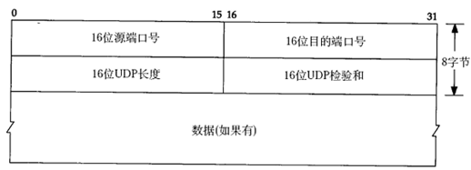

### UDP数据报格式

​                                

UDP数据段

下面分析一帧基于UDP的TFTP协议帧。

以太网首部

0000: 00 05 5d 67 d0 b1 00 05 5d 61 58 a8 08 00

IP首部

0000: 45 00

0010: 00 53 93 25 00 00 80 11 25 ec c0 a8 00 37 c0 a8

0020: 00 01

UDP首部

0020： 05 d4 00 45 00 3f ac 40

TFTP协议

0020: 00 01 'c'':''\''q'

0030: 'w''e''r''q''.''q''w''e'00 'n''e''t''a''s''c''i'

0040: 'i'00 'b''l''k''s''i''z''e'00 '5''1''2'00 't''i'

0050: 'm''e''o''u''t'00 '1''0'00 't''s''i''z''e'00 '0'

0060: 00以太网首部：源MAC地址是00:05:5d:61:58:a8，目的MAC地址是00:05:5d:67:d0:b1，上层协议类型0x0800表示IP。

IP首部：每一个字节0x45包含4位版本号和4位首部长度，版本号为4，即IPv4，首部长度为5，说明IP首部不带有选项字段。服务类型为0，没有使用服务。16位总长度字段（包括IP首部和IP层payload的长度）为0x0053，即83字节，加上以太网首部14字节可知整个帧长度是97字节。IP报标识是0x9325，标志字段和片偏移字段设置为0x0000，就是DF=0允许分片，MF=0此数据报没有更多分片，没有分片偏移。TTL是0x80，也就是128。上层协议0x11表示UDP协议。IP首部校验和为0x25ec，源主机IP是c0 a8 00 37（192.168.0.55），目的主机IP是c0 a8 00 01（192.168.0.1）。

UDP首部：源端口号0x05d4（1492）是客户端的端口号，目的端口号0x0045（69）是TFTP服务的well-known端口号。UDP报长度为0x003f，即63字节，包括UDP首部和UDP层pay-load的长度。UDP首部和UDP层payload的校验和为0xac40。

TFTP是基于文本的协议，各字段之间用字节0分隔，开头的00 01表示请求读取一个文件，接下来的各字段是：

c:\qwerq.qwe

netascii

blksize 512

timeout 10

tsize 0

一般的网络通信都是像TFTP协议这样，通信的双方分别是客户端和服务器，客户端主动发起请求（上面的例子就是客户端发起的请求帧），而服务器被动地等待、接收和应答请求。客户端的IP地址和端口号唯一标识了该主机上的TFTP客户端进程，服务器的IP地址和端口号唯一标识了该主机上的TFTP服务进程，由于客户端是主动发起请求的一方，它必须知道服务器的IP地址和TFTP服务进程的端口号，所以，一些常见的网络协议有默认的服务器端口，例如HTTP服务默认TCP协议的80端口，FTP服务默认TCP协议的21端口，TFTP服务默认UDP协议的69端口（如上例所示）。在使用客户端程序时，必须指定服务器的主机名或IP地址，如果不明确指定端口号则采用默认端口，请读者查阅ftp、tftp等程序的man page了解如何指定端口号。/etc/services中列出了所有well-known的服务端口和对应的传输层协议，这是由IANA（Internet Assigned Numbers Authority）规定的，其中有些服务既可以用TCP也可以用UDP，为了清晰，IANA规定这样的服务采用相同的TCP或UDP默认端口号，而另外一些TCP和UDP的相同端口号却对应不同的服务。

很多服务有well-known的端口号，然而客户端程序的端口号却不必是well-known的，往往是每次运行客户端程序时由系统自动分配一个空闲的端口号，用完就释放掉，称为ephemeral的端口号，想想这是为什么？

前面提过，UDP协议不面向连接，也不保证传输的可靠性，例如：

发送端的UDP协议层只管把应用层传来的数据封装成段交给IP协议层就算完成任务了，如果因为网络故障该段无法发到对方，UDP协议层也不会给应用层返回任何错误信息。

接收端的UDP协议层只管把收到的数据根据端口号交给相应的应用程序就算完成任务了，如果发送端发来多个数据包并且在网络上经过不同的路由，到达接收端时顺序已经错乱了，UDP协议层也不保证按发送时的顺序交给应用层。

通常接收端的UDP协议层将收到的数据放在一个固定大小的缓冲区中等待应用程序来提取和处理，如果应用程序提取和处理的速度很慢，而发送端发送的速度很快，就会丢失数据包，UDP协议层并不报告这种错误。

因此，使用UDP协议的应用程序必须考虑到这些可能的问题并实现适当的解决方案，例如等待应答、超时重发、为数据包编号、流量控制等。一般使用UDP协议的应用程序实现都比较简单，只是发送一些对可靠性要求不高的消息，而不发送大量的数据。例如，基于UDP的TFTP协议一般只用于传送小文件（所以才叫trivial的ftp），而基于TCP的FTP协议适用于 各种文件的传输。TCP协议又是如何用面向连接的服务来代替应用程序解决传输的可靠性问题呢。

#### 校验和