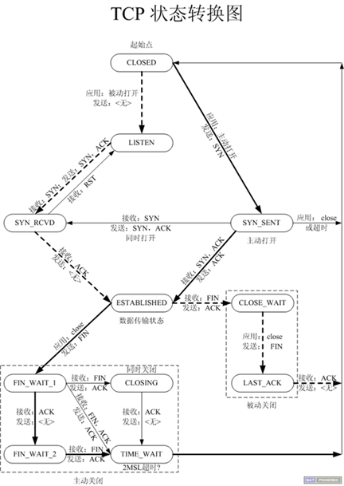

## TCP协议

### TCP状态转换

这个图N多人都知道，它排除和定位网络或系统故障时大有帮助，但是怎样牢牢地将这张图刻在脑中呢？那么你就一定要对这张图的每一个状态，及转换的过程有深刻的认识，不能只停留在一知半解之中。下面对这张图的11种状态详细解析一下，以便加强记忆！不过在这之前，先回顾一下TCP建立连接的三次握手过程，以及 关闭连接的四次握手过程。

​                                

TCP状态转换图

**CLOSED****：**表示初始状态。

**LISTEN****：**该状态表示服务器端的某个SOCKET处于监听状态，可以接受连接。

**SYN_SENT****：**这个状态与SYN_RCVD遥相呼应，当客户端SOCKET执行CONNECT连接时，它首先发送SYN报文，随即进入到了SYN_SENT状态，并等待服务端的发送三次握手中的第2个报文。SYN_SENT状态表示客户端已发送SYN报文。

**SYN_RCVD:** 该状态表示接收到SYN报文，在正常情况下，这个状态是服务器端的SOCKET在建立TCP连接时的三次握手会话过程中的一个中间状态，很短暂。此种状态时，当收到客户端的ACK报文后，会进入到ESTABLISHED状态。

**ESTABLISHED****：**表示连接已经建立。

**FIN_WAIT_1:**  FIN_WAIT_1和FIN_WAIT_2状态的真正含义都是表示等待对方的FIN报文。区别是：

FIN_WAIT_1状态是当socket在ESTABLISHED状态时，想主动关闭连接，向对方发送了FIN报文，此时该socket进入到FIN_WAIT_1状态。

FIN_WAIT_2状态是当对方回应ACK后，该socket进入到FIN_WAIT_2状态，正常情况下，对方应马上回应ACK报文，所以FIN_WAIT_1状态一般较难见到，而FIN_WAIT_2状态可用netstat看到。

**FIN_WAIT_2****：主动关闭链接的一方，发出FIN****收到ACK****以后进入该状态****。称之为半连接或半关闭状态。**该状态下的socket只能接收数据，不能发。

**TIME_WAIT:** 表示收到了对方的FIN报文，并发送出了ACK报文，等2MSL后即可回到CLOSED可用状态。如果FIN_WAIT_1状态下，收到对方同时带 FIN标志和ACK标志的报文时，可以直接进入到TIME_WAIT状态，而无须经过FIN_WAIT_2状态。

**CLOSING:** 这种状态较特殊，属于一种较罕见的状态。正常情况下，当你发送FIN报文后，按理来说是应该先收到（或同时收到）对方的 ACK报文，再收到对方的FIN报文。但是CLOSING状态表示你发送FIN报文后，并没有收到对方的ACK报文，反而却也收到了对方的FIN报文。什么情况下会出现此种情况呢？如果双方几乎在同时close一个SOCKET的话，那么就出现了双方同时发送FIN报文的情况，也即会出现CLOSING状态，表示双方都正在关闭SOCKET连接。

**CLOSE_WAIT:** 此种状态表示在等待关闭。当对方关闭一个SOCKET后发送FIN报文给自己，系统会回应一个ACK报文给对方，此时则进入到CLOSE_WAIT状态。接下来呢，察看是否还有数据发送给对方，如果没有可以 close这个SOCKET，发送FIN报文给对方，即关闭连接。所以在CLOSE_WAIT状态下，需要关闭连接。

**LAST_ACK:** 该状态是被动关闭一方在发送FIN报文后，最后等待对方的ACK报文。当收到ACK报文后，即可以进入到CLOSED可用状态。

### 半关闭

当TCP链接中A发送FIN请求关闭，B端回应ACK后（A端进入FIN_WAIT_2状态），B没有立即发送FIN给A时，A方处在半链接状态，此时A可以接收B发送的数据，但是A已不能再向B发送数据。

从程序的角度，可以使用API来控制实现半连接状态。

```c
#include <sys/socket.h>

int shutdown(int sockfd, int how);

sockfd: 需要关闭的socket的描述符

how:  允许为shutdown操作选择以下几种方式:

  SHUT_RD(0)：  关闭sockfd上的读功能，此选项将不允许sockfd进行读操作。

  			该套接字**不再接受数据**，任何当前在套接字接受缓冲区的数据将被无声的丢弃掉。

  SHUT_WR(1):   关闭sockfd的写功能，此选项将不允许sockfd进行写操作。进程不能在对此套接字发出写操作。

  SHUT_RDWR(2):  关闭sockfd的读写功能。相当于调用shutdown两次：首先是以SHUT_RD,然后以SHUT_WR。
```

使用close中止一个连接，但它只是减少描述符的引用计数，并不直接关闭连接，只有当描述符的引用计数为0时才关闭连接。

**shutdown****不考虑描述符的引用计数，直接关闭描述符**。也可选择中止一个方向的连接，只中止读或只中止写。

注意:

\1.     如果有多个进程共享一个套接字，close每被调用一次，计数减1，直到计数为0时，也就是所用进程都调用了close，套接字将被释放。 

\2.     在多进程中如果一个进程调用了shutdown(sfd, SHUT_RDWR)后，其它的进程将无法进行通信。但，如果一个进程close(sfd)将不会影响到其它进程。

### 2MSL

2MSL (Maximum Segment Lifetime) TIME_WAIT状态的存在有两个理由：

（1）**让****4****次握手关闭流程更加可靠**；4次握手的最后一个ACK是是由主动关闭方发送出去的，若这个ACK丢失，被动关闭方会再次发一个FIN过来。若主动关闭方能够保持一个2MSL的TIME_WAIT状态，则有更大的机会让丢失的ACK被再次发送出去。

（2）防止lost duplicate对后续新建正常链接的传输造成破坏。lost uplicate在实际的网络中非常常见，经常是由于路由器产生故障，路径无法收敛，导致一个packet在路由器A，B，C之间做类似死循环的跳转。IP头部有个TTL，限制了一个包在网络中的最大跳数，因此这个包有两种命运，要么最后TTL变为0，在网络中消失；要么TTL在变为0之前路由器路径收敛，它凭借剩余的TTL跳数终于到达目的地。但非常可惜的是TCP通过超时重传机制在早些时候发送了一个跟它一模一样的包，并先于它达到了目的地，因此它的命运也就注定被TCP协议栈抛弃。

另外一个概念叫做incarnation connection，指跟上次的socket pair一摸一样的新连接，叫做incarnation of previous connection。lost uplicate加上incarnation connection，则会对我们的传输造成致命的错误。

TCP是流式的，所有包到达的顺序是不一致的，依靠序列号由TCP协议栈做顺序的拼接；假设一个incarnation connection这时收到的seq=1000, 来了一个lost duplicate为seq=1000，len=1000, 则TCP认为这个lost duplicate合法，并存放入了receive buffer，导致传输出现错误。通过一个2MSL TIME_WAIT状态，确保所有的lost duplicate都会消失掉，避免对新连接造成错误。

该状态为什么设计在**主动关闭这一方**：

（1）发最后ACK的是主动关闭一方。

（2）只要有一方保持TIME_WAIT状态，就能起到避免incarnation connection在2MSL内的重新建立，不需要两方都有。

如何正确对待2MSL TIME_WAIT?

RFC要求socket pair在处于TIME_WAIT时，不能再起一个incarnation connection。但绝大部分TCP实现，强加了更为严格的限制。在2MSL等待期间，socket中使用的本地端口在默认情况下不能再被使用。

若A 10.234.5.5 : 1234和B 10.55.55.60 : 6666建立了连接，A主动关闭，那么在A端只要port为1234，无论对方的port和ip是什么，都不允许再起服务。这甚至比RFC限制更为严格，RFC仅仅是要求socket pair不一致，而实现当中只要这个port处于TIME_WAIT，就不允许起连接。这个限制对主动打开方来说是无所谓的，因为一般用的是临时端口；但对于被动打开方，一般是server，就悲剧了，因为server一般是熟知端口。比如http，一般端口是80，不可能允许这个服务在2MSL内不能起来。

解决方案是给服务器的socket设置SO_REUSEADDR选项，这样的话就算熟知端口处于TIME_WAIT状态，在这个端口上依旧可以将服务启动。当然，虽然有了SO_REUSEADDR选项，但sockt pair这个限制依旧存在。比如上面的例子，A通过SO_REUSEADDR选项依旧在1234端口上起了监听，但这时我们若是从B通过6666端口去连它，TCP协议会告诉我们连接失败，原因为Address already in use.

RFC 793中规定MSL为2分钟，实际应用中常用的是30秒，1分钟和2分钟等。

RFC (Request For Comments)，是一系列以编号排定的文件。收集了有关因特网相关资讯，以及UNIX和因特网社群的[软件](http://baike.baidu.com/view/37.htm)文件。

#### 程序设计中的问题 

做一个测试，首先启动server，然后启动client，用Ctrl-C终止server，马上再运行server，运行结果：

itcast$ ./server

bind error: Address already in use 

这是因为，虽然server的应用程序终止了，但TCP协议层的连接并没有完全断开，因此不能再次监听同样的server端口。我们用netstat命令查看一下：

itcast$ netstat -apn |grep 6666

tcp    1   0 192.168.1.11:38103   192.168.1.11:6666    CLOSE_WAIT 3525/client   

tcp    0   0 192.168.1.11:6666    192.168.1.11:38103   FIN_WAIT2  -      

server终止时，socket描述符会自动关闭并发FIN段给client，client收到FIN后处于CLOSE_WAIT状态，但是client并没有终止，也没有关闭socket描述符，因此不会发FIN给server，因此server的TCP连接处于FIN_WAIT2状态。

现在用Ctrl-C把client也终止掉，再观察现象：

itcast$ netstat -apn |grep 6666

tcp    0   0 192.168.1.11:6666    192.168.1.11:38104   TIME_WAIT  -

itcast$ ./server

bind error: Address already in use

client终止时自动关闭socket描述符，server的TCP连接收到client发的FIN段后处于TIME_WAIT状态。TCP协议规定，**主动关闭连接的一方要处于****TIME_WAIT****状态**，等待两个MSL（maximum segment lifetime）的时间后才能回到CLOSED状态，因为我们先Ctrl-C终止了server，所以server是主动关闭连接的一方，在TIME_WAIT期间仍然不能再次监听同样的server端口。

MSL在RFC 1122中规定为两分钟，但是各操作系统的实现不同，在Linux上一般经过半分钟后就可以再次启动server了。至于为什么要规定TIME_WAIT的时间，可参考UNP 2.7节。

#### 端口复用

在server的TCP连接没有完全断开之前不允许重新监听是不合理的。因为，TCP连接没有完全断开指的是connfd（127.0.0.1:6666）没有完全断开，而我们重新监听的是lis-tenfd（0.0.0.0:6666），虽然是占用同一个端口，但IP地址不同，connfd对应的是与某个客户端通讯的一个具体的IP地址，而listenfd对应的是wildcard address。解决这个问题的方法是使用setsockopt()设置socket描述符的选项SO_REUSEADDR为1，表示允许创建端口号相同但IP地址不同的多个socket描述符。

在server代码的socket()和bind()调用之间插入如下代码：

  

```
int opt = 1;

  setsockopt(listenfd, SOL_SOCKET, SO_REUSEADDR, &opt, sizeof(opt));
```

有关setsockopt可以设置的其它选项请参考UNP第7章。

### TCP异常断开

#### 心跳检测机制

在TCP网络通信中，经常会出现客户端和服务器之间的非正常断开，需要实时检测查询链接状态。常用的解决方法就是在程序中加入心跳机制。

Heart-Beat线程

这个是最常用的简单方法。在接收和发送数据时个人设计一个守护进程(线程)，定时发送Heart-Beat包，客户端/服务器收到该小包后，立刻返回相应的包即可检测对方是否实时在线。

该方法的好处是通用，但缺点就是会改变现有的通讯协议！大家一般都是使用业务层心跳来处理，主要是灵活可控。

UNIX网络编程不推荐使用SO_KEEPALIVE来做心跳检测，还是在业务层以心跳包做检测比较好，也方便控制。

#### 设置TCP属性

SO_KEEPALIVE 保持连接检测对方主机是否崩溃，避免（服务器）永远阻塞于TCP连接的输入。设置该选项后，如果2小时内在此套接口的任一方向都没有数据交换，TCP就自动给对方发一个保持存活探测分节(keepalive probe)。这是一个对方必须响应的TCP分节.它会导致以下三种情况：对方接收一切正常：以期望的ACK响应。2小时后，TCP将发出另一个探测分节。对方已崩溃且已重新启动：以RST响应。套接口的待处理错误被置为ECONNRESET，套接 口本身则被关闭。对方无任何响应：源自berkeley的TCP发送另外8个探测分节，相隔75秒一个，试图得到一个响应。在发出第一个探测分节11分钟 15秒后若仍无响应就放弃。套接口的待处理错误被置为ETIMEOUT，套接口本身则被关闭。如ICMP错误是“host unreachable(主机不可达)”，说明对方主机并没有崩溃，但是不可达，这种情况下待处理错误被置为EHOSTUNREACH。

根据上面的介绍我们可以知道对端以一种非优雅的方式断开连接的时候，我们可以设置SO_KEEPALIVE属性使得我们在2小时以后发现对方的TCP连接是否依然存在。

```
  keepAlive = 1;

  setsockopt(listenfd, SOL_SOCKET, SO_KEEPALIVE, (void*)&keepAlive, sizeof(keepAlive));
```

如果我们不能接受如此之长的等待时间，从TCP-Keepalive-HOWTO上可以知道一共有两种方式可以设置，一种是修改内核关于网络方面的 配置参数，另外一种就是SOL_TCP字段的TCP_KEEPIDLE， TCP_KEEPINTVL， TCP_KEEPCNT三个选项。

\1.    The tcp_keepidle parameter specifies the interval of inactivity that causes TCP to generate a KEEPALIVE transmission for an application that requests them. tcp_keepidle defaults to 14400 (two hours). 

/*开始首次KeepAlive探测前的TCP空闭时间 */

\2.    The tcp_keepintvl parameter specifies the interval between the nine retriesthat are attempted if a KEEPALIVE transmission is not acknowledged. tcp_keep ntvldefaults to 150 (75 seconds). 

/* 两次KeepAlive探测间的时间间隔 */

\3.    The tcp_keepcnt option specifies the maximum number of keepalive probes tobe sent. The value of TCP_KEEPCNT is an integer value between 1 and n, where n s the value of the systemwide tcp_keepcnt parameter. 

/* 判定断开前的KeepAlive探测次数*/

```
int keepIdle = 1000;

int keepInterval = 10;

int keepCount = 10;

 

Setsockopt(listenfd, SOL_TCP, TCP_KEEPIDLE, (void *)&keepIdle, sizeof(keepIdle));

Setsockopt(listenfd, SOL_TCP,TCP_KEEPINTVL, (void *)&keepInterval, sizeof(keepInterval));

Setsockopt(listenfd,SOL_TCP, TCP_KEEPCNT, (void *)&keepCount, sizeof(keepCount));
```

SO_KEEPALIVE设置空闲2小时才发送一个“保持存活探测分节”，不能保证实时检测。对于判断网络断开时间太长，对于需要及时响应的程序不太适应。

当然也可以修改时间间隔参数，但是会影响到所有打开此选项的套接口！关联了完成端口的socket可能会忽略掉该套接字选项。

