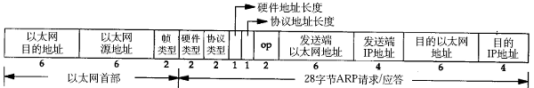

### MAC

### ARP数据报格式

在网络通讯时，源主机的应用程序知道目的主机的IP地址和端口号，却不知道目的主机的硬件地址，而数据包首先是被网卡接收到再去处理上层协议的，如果接收到的数据包的硬件地址与本机不符，则直接丢弃。因此在通讯前必须获得目的主机的硬件地址。ARP协议就起到这个作用。源主机发出ARP请求，询问“IP地址是192.168.0.1的主机的硬件地址是多少”，并将这个请求广播到本地网段（以太网帧首部的硬件地址填FF:FF:FF:FF:FF:FF表示广播），目的主机接收到广播的ARP请求，发现其中的IP地址与本机相符，则发送一个ARP应答数据包给源主机，将自己的硬件地址填写在应答包中。

每台主机都维护一个ARP缓存表，可以用arp -a命令查看。缓存表中的表项有过期时间（一般为20分钟），如果20分钟内没有再次使用某个表项，则该表项失效，下次还要发ARP请求来获得目的主机的硬件地址。想一想，为什么表项要有过期时间而不是一直有效？

ARP数据报的格式如下所示：

​                                

ARP数据报格式

源MAC地址、目的MAC地址在以太网首部和ARP请求中各出现一次，对于链路层为以太网的情况是多余的，但如果链路层是其它类型的网络则有可能是必要的。硬件类型指链路层网络类型，1为以太网，协议类型指要转换的地址类型，0x0800为IP地址，后面两个地址长度对于以太网地址和IP地址分别为6和4（字节），op字段为1表示ARP请求，op字段为2表示ARP应答。

看一个具体的例子。

请求帧如下（为了清晰在每行的前面加了字节计数，每行16个字节）：

以太网首部（14字节）

0000: ff ff ff ff ff ff 00 05 5d 61 58 a8 08 06

ARP帧（28字节）

0000: 00 01

0010: 08 00 06 04 00 01 00 05 5d 61 58 a8 c0 a8 00 37

0020: 00 00 00 00 00 00 c0 a8 00 02

填充位（18字节）

0020: 00 77 31 d2 50 10

0030: fd 78 41 d3 00 00 00 00 00 00 00 00

以太网首部：目的主机采用广播地址，源主机的MAC地址是00:05:5d:61:58:a8，上层协议类型0x0806表示ARP。

ARP帧：硬件类型0x0001表示以太网，协议类型0x0800表示IP协议，硬件地址（MAC地址）长度为6，协议地址（IP地址）长度为4，op为0x0001表示请求目的主机的MAC地址，源主机MAC地址为00:05:5d:61:58:a8，源主机IP地址为c0 a8 00 37（192.168.0.55），目的主机MAC地址全0待填写，目的主机IP地址为c0 a8 00 02（192.168.0.2）。

由于以太网规定最小数据长度为46字节，ARP帧长度只有28字节，因此有18字节填充位，填充位的内容没有定义，与具体实现相关。

应答帧如下：

以太网首部

0000: 00 05 5d 61 58 a8 00 05 5d a1 b8 40 08 06

ARP帧

0000: 00 01

0010: 08 00 06 04 00 02 00 05 5d a1 b8 40 c0 a8 00 02

0020: 00 05 5d 61 58 a8 c0 a8 00 37

填充位

0020: 00 77 31 d2 50 10

0030: fd 78 41 d3 00 00 00 00 00 00 00 00

以太网首部：目的主机的MAC地址是00:05:5d:61:58:a8，源主机的MAC地址是00:05:5d:a1:b8:40，上层协议类型0x0806表示ARP。

ARP帧：硬件类型0x0001表示以太网，协议类型0x0800表示IP协议，硬件地址（MAC地址）长度为6，协议地址（IP地址）长度为4，op为0x0002表示应答，源主机MAC地址为00:05:5d:a1:b8:40，源主机IP地址为c0 a8 00 02（192.168.0.2），目的主机MAC地址为00:05:5d:61:58:a8，目的主机IP地址为c0 a8 00 37（192.168.0.55）。

思考题：如果源主机和目的主机不在同一网段，ARP请求的广播帧无法穿过路由器，源主机如何与目的主机通信？

### RARP

