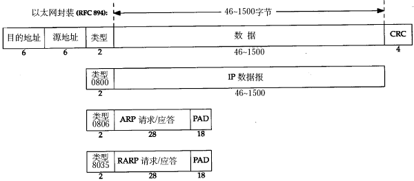

### 以太网帧格式

以太网的帧格式如下所示：

​                                

以太网帧格式

其中的源地址和目的地址是指网卡的硬件地址（也叫MAC地址），长度是48位，是在网卡出厂时固化的。可在shell中使用ifconfig命令查看，“HWaddr 00:15:F2:14:9E:3F”部分就是硬件地址。协议字段有三种值，分别对应IP、ARP、RARP。帧尾是CRC校验码。

以太网帧中的数据长度规定最小46字节，最大1500字节，ARP和RARP数据包的长度不够46字节，要在后面补填充位。**最大值****1500****称为以太网的最大传输单元（MTU****）**，不同的网络类型有不同的MTU，如果一个数据包从以太网路由到拨号链路上，数据包长度大于拨号链路的MTU，则需要对数据包进行分片（fragmentation）。ifconfig命令输出中也有“MTU:1500”。注意，MTU这个概念指数据帧中有效载荷的最大长度，不包括帧头长度。

### 局域网(LAN)

local area network，一种覆盖一座或几座大楼、一个校园或者一个厂区等地理区域的小范围的计算机网。

\1.     覆盖的地理范围较小，只在一个相对独立的局部范围内联，如一座或集中的建筑群内。

\2.     使用专门铺设的传输介质进行联网，数据传输速率高（10Mb/s～10Gb/s）

\3.     通信延迟时间短，可靠性较高

\4.     局域网可以支持多种传输介质

### 广域网(WAN)

wide area network，一种用来实现不同地区的局域网或城域网的互连，可提供不同地区、城市和国家之间的计算机通信的远程计算机网。

覆盖的范围比局域网（LAN）和城域网（MAN）都广。广域网的通信子网主要使用分组交换技术。

广域网的通信子网可以利用公用分组交换网、卫星通信网和无线分组交换网，它将分布在不同地区的局域网或计算机系统互连起来，达到资源共享的目的。如互联网是世界范围内最大的广域网。

\1.     适应大容量与突发性通信的要求；

\2.     适应综合业务服务的要求；

\3.     开放的设备接口与规范化的协议；

\4.     完善的通信服务与网络管理。

### MTU

MTU:通信术语 最大传输单元（Maximum Transmission Unit，MTU）

是指一种通信协议的某一层上面所能通过的最大数据包大小（以字节为单位）。最大传输单元这个参数通常与通信接口有关（网络接口卡、串口等）。

以下是一些协议的MTU：

FDDI协议：4352字节

**以太网（Ethernet****）协议：1500****字节**

PPPoE（ADSL）协议：1492字节

X.25协议（Dial Up/Modem）：576字节

Point-to-Point：4470字节