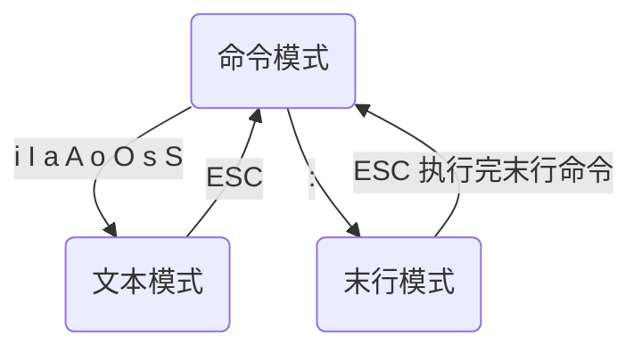

## vim的使用

### 一、vim的三个模式

- vim有命令模式、文本模式、末行模式



- 命令模式切换成文本模式

  |          |    前     |   后    | 备注 |
  | :------: | :-------: | :-----: | :--: |
  |   光标   |     i     |    a    | 字符 |
  |    行    |  I（首）  | A（尾） |      |
  |    段    |     O     |    o    |      |
  | 删除当前 | s（字符） | S（行） | 插入 |

  

- vim配置文件

  ```shell
  /etc/vim/vimrc   //配置文件
  ~/.vimrc         //家目录下的隐藏文件，优先级高
  ```


### 二、vim基本命令

#### 1.位置命令

| 命令 |                 解析                 |
| :--: | :----------------------------------: |
|  h   |                  ←                   |
|  j   |                  ↓                   |
|  k   |                  ↑                   |
|  l   |                  →                   |
| 77 G |              跳转到77行              |
| ：77 |              跳转到77行              |
|  gg  |             跳转到文件首             |
|  G   |             跳转到文件尾             |
|  %   |           跳转到配对 符号            |
| gg=G |              自动格式化              |
|  $   |     定位到光标所在行最后一个字符     |
|  0   | 定位到光标所在行第一个字符前一个位置 |

#### 2.删除（剪切）

- **vim没有删除命令，只有剪切命令**

| 命令 |                解析                |
| :--: | :--------------------------------: |
|  x   | 删除当前光标所在字符，工作模式不变 |
|  dw  |        删除光标以后的一个词        |
|  dd  |           删除光标当前行           |
| n dd |   删除以下n行（包括光标所在行）    |
|  D   |          从光标删除至行尾          |
|  d$  |          从光标删除至行尾          |
|  d0  |         从光标前删除至行首         |

#### 3.复制粘贴

| 命令 |            解析            |
| :--: | :------------------------: |
|  v   | 进入以字符为单位的视图模式 |
|  V   |  进入以行为单位的视图模式  |
|  yy  |         复制当前行         |
| n yy | 复制以后n行（包括当前行）  |
|  p   |        粘贴到光标后        |
|  P   |        粘贴到光标前        |

#### 4.查找

| 命令  |                 解析                 |
| :---: | :----------------------------------: |
| /copy | 查找copy，n 下一个copy，N 上一个copy |
|   *   |           查找下一个相同词           |
|   #   |           查找上一个相同词           |


- **设置**

```
:set ignorecase　　忽略大小写的查找
:set noignorecase　　不忽略大小写的查找
```


- **精准查找：**

  ```
  如果文本中有这三个单词
  
  hellohelloworldhellopython
  
  那我使用 /hello ，这三个词都会匹配到。
  
  有没有办法实现精准查找呢？你可以使用
  
  /hello\>
  精准查找：匹配行首、行末
  
  # hello位于行首
  /^hello
  
  # world位于行末
  /world$
  ```

  


#### 5.替换

|           命令           |                             解析                             |
| :----------------------: | :----------------------------------------------------------: |
|            r             |                    替换当前字符，模式不变                    |
|    :s /printf/printn     |              将当前行的第一个printf替换成printn              |
|    :%s /printf/printn    |             将全篇每一行第一个printf替换成printn             |
|   :%s /printf/printn/g   |       将全篇每一行的所有printf替换成printn，/g代表全部       |
| 29,35 s /printf/printn/g | 将29,35行的所有printf替换成printn，最多只能选定两行（测试情况） |

```
~  反转游标字母大小写

r<字母>           将当前字符替换为所写字母
R<字母><字母>...  连续替换字母

cc    替换整行（就是删除当前行，并在下一行插入）
cw    替换一个单词（就是删除一个单词，就进入插入模式），前提是游标处于单词第一个字母（可用b定位）
C     (大写C)替换至行尾（和D有所区别，D是删除（剪切）至行尾，C是删除至行位并进入插入模式）

:s/old/new/    用old替换new，替换当前行的第一个匹配
:s/old/new/g   用old替换new，替换当前行的所有匹配

:%s/old/new/   用old替换new，替换所有行的第一个匹配
:%s/old/new/g  用old替换new，替换整个文件的所有匹配

:10,20 s/^/ /g 在第10行至第20行每行前面加四个空格，用于缩进。

ddp    交换光标所在行和其下紧邻的一行。
```


#### 6.命令操作相关命令

|  命令   |        解析        |
| :-----: | :----------------: |
| :ctrl+P |   呼出上一次命令   |
| :ctrl+n |   呼出下一条命令   |
|    u    |   撤销上一条命令   |
|         |                    |
| ctrl+r  | 撤销上一条撤销命令 |

#### 7.分屏操作

|   命令    |           操作           |
| :-------: | :----------------------: |
|    :sp    |          分横屏          |
|   :vsp    |          分竖屏          |
|  ctrl+ww  |         切换窗口         |
|     q     |       退出当前窗口       |
|   qall    |       退出所有窗口       |
| :vsp file | 以竖屏方式打开file或新建 |

#### 8.编程常用

|  命令   |         解析         |
| :-----: | :------------------: |
|    K    |    跳转到帮助文档    |
|   3 K   |     跳转到库文档     |
|   [d    |    查看当前宏定义    |
| :!shell | 在vim中使用shell命令 |


#### 9.配置命令

- 显示当前设定

```powershell
:set或者:se显示所有修改过的配置
:set all 显示所有的设定值
:set option? 显示option的设定值
:set nooption 取消当期设定值
:ver   显示vim的所有信息（包括版本和参数等）

# 需要注意：全屏模式下
:args   查看当前打开的文件列表，当前正在编辑的文件会用[]括起来
```

- 更改设定

```powershell
:set nu   显示行号

set autoindent(ai)   设置自动缩进
set autowrite(aw)    设置自动存档，默认未打开
set backup(bk) 设置自动备份，默认未打开

set background=dark或light，设置背景风格

set cindent(cin) 设置C语言风格缩进

:set ts=4   设置tab键转换为4个空格

:set ff=unix   # 修改文件dos文件为unix

:set shiftwidth?   查看缩进值
:set shiftwidth=4  设置缩进值为4

:set ignorecase　　忽略大小写的查找
:set noignorecase　　不忽略大小写的查找

:set paste  # insert模式下，粘贴格式不会乱掉

:set ruler?　　查看是否设置了ruler，在.vimrc中，使用set命令设制的选项都可以通过这个命令查看

:scriptnames　　查看vim脚本文件的位置，比如.vimrc文件，语法文件及plugin等。

:set list 显示非打印字符，如tab，空格，行尾等。如果tab无法显示，请确定用set lcs=tab:>-命令设置了.vimrc文件，并确保你的文件中的确有tab，如果开启了expendtab，那么tab将被扩展为空格。


:syntax        列出已经定义的语法项
:syntax clear  清除已定义的语法规则

:syntax case match    大小写敏感，int和Int将视为不同的语法元素
:syntax case ignore   大小写无关，int和Int将视为相同的语法元素，并使用同样的配色方案
```

