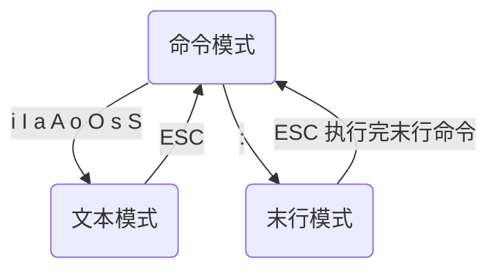

## vim的使用

### 一、vim的三个模式

- vim有命令模式、文本模式、末行模式



- 命令模式切换成文本模式

  |          |    前     |   后    | 备注 |
  | :------: | :-------: | :-----: | :--: |
  |   光标   |     i     |    a    | 字符 |
  |    行    |  I（首）  | A（尾） |      |
  |    段    |     O     |    o    |      |
  | 删除当前 | s（字符） | S（行） | 插入 |

  

- vim配置文件

  ```shell
  /etc/vim/vimrc   //配置文件
  ~/.vimrc         //家目录下的隐藏文件，优先级高
  ```


### 二、vim基本命令

#### 1.位置命令

| 命令 |                 解析                 |
| :--: | :----------------------------------: |
|  h   |                  ←                   |
|  j   |                  ↓                   |
|  k   |                  ↑                   |
|  l   |                  →                   |
| 77 G |              跳转到77行              |
| ：77 |              跳转到77行              |
|  gg  |             跳转到文件首             |
|  G   |             跳转到文件尾             |
|  %   |           跳转到配对 符号            |
| gg=G |              自动格式化              |
|  $   |     定位到光标所在行最后一个字符     |
|  0   | 定位到光标所在行第一个字符前一个位置 |

#### 2.删除（剪切）

- **vim没有删除命令，只有剪切命令**

| 命令 |                解析                |
| :--: | :--------------------------------: |
|  x   | 删除当前光标所在字符，工作模式不变 |
|  dw  |        删除光标以后的一个词        |
|  dd  |           删除光标当前行           |
| n dd |   删除以下n行（包括光标所在行）    |
|  D   |          从光标删除至行尾          |
|  d$  |          从光标删除至行尾          |
|  d0  |         从光标前删除至行首         |

#### 3.复制粘贴

| 命令 |            解析            |
| :--: | :------------------------: |
|  v   | 进入以字符为单位的视图模式 |
|  V   |  进入以行为单位的视图模式  |
|  yy  |         复制当前行         |
| n yy | 复制以后n行（包括当前行）  |
|  p   |        粘贴到光标后        |
|  P   |        粘贴到光标前        |

#### 4.查找

| 命令  |                 解析                 |
| :---: | :----------------------------------: |
| /copy | 查找copy，n 下一个copy，N 上一个copy |
|   *   |           查找下一个相同词           |
|   #   |           查找上一个相同词           |

#### 5.替换

|           命令           |                             解析                             |
| :----------------------: | :----------------------------------------------------------: |
|            r             |                    替换当前字符，模式不变                    |
|    :s /printf/printn     |              将当前行的第一个printf替换成printn              |
|    :%s /printf/printn    |             将全篇每一行第一个printf替换成printn             |
|   :%s /printf/printn/g   |       将全篇每一行的所有printf替换成printn，/g代表全部       |
| 29,35 s /printf/printn/g | 将29,35行的所有printf替换成printn，最多只能选定两行（测试情况） |

#### 6.命令操作相关命令

|  命令   |        解析        |
| :-----: | :----------------: |
| :ctrl+P |   呼出上一次命令   |
| :ctrl+n |   呼出下一条命令   |
|    u    |   撤销上一条命令   |
| ctrl+r  | 撤销上一条撤销命令 |

#### 7.分屏操作

|   命令    |           操作           |
| :-------: | :----------------------: |
|    :sp    |          分横屏          |
|   :vsp    |          分竖屏          |
|  ctrl+ww  |         切换窗口         |
|     q     |       退出当前窗口       |
|   qall    |       退出所有窗口       |
| :vsp file | 以竖屏方式打开file或新建 |

#### 8.编程常用

|  命令   |         解析         |
| :-----: | :------------------: |
|    K    |    跳转到帮助文档    |
|   3 K   |     跳转到库文档     |
|   [d    |    查看当前宏定义    |
| :!shell | 在vim中使用shell命令 |

