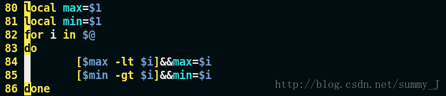

## vim的使用

### 一、vim的三个模式

- vim有命令模式、文本模式、末行模式


- 命令模式切换成文本模式

  |          |    前     |   后    | 备注 |
  | :------: | :-------: | :-----: | :--: |
  |   光标   |     i     |    a    | 字符 |
  |    行    |  I（首）  | A（尾） |      |
  |    段    |     O     |    o    |      |
  | 删除当前 | s（字符） | S（行） | 插入 |

  

- vim配置文件

  ```shell
  /etc/vim/vimrc   //配置文件
  ~/.vimrc         //家目录下的隐藏文件，优先级高
  ```


### 二、vim基本命令

#### 1.位置命令

| 命令 |                 解析                 |
| :--: | :----------------------------------: |
|  h   |                  ←                   |
|  j   |                  ↓                   |
|  k   |                  ↑                   |
|  l   |                  →                   |
| 77 G |              跳转到77行              |
| ：77 |              跳转到77行              |
|  gg  |             跳转到文件首             |
|  G   |             跳转到文件尾             |
|  %   |           跳转到配对 符号            |
| gg=G |              自动格式化              |
|  $   |     定位到光标所在行最后一个字符     |
|  0   | 定位到光标所在行第一个字符前一个位置 |

#### 2.删除（剪切）

- **vim没有删除命令，只有剪切命令**

| 命令 |                解析                |
| :--: | :--------------------------------: |
|  x   | 删除当前光标所在字符，工作模式不变 |
|  dw  |        删除光标以后的一个词        |
|  dd  |           删除光标当前行           |
| n dd |   删除以下n行（包括光标所在行）    |
|  D   |          从光标删除至行尾          |
|  d$  |          从光标删除至行尾          |
|  d0  |         从光标前删除至行首         |

#### 3.复制粘贴

| 命令 |            解析            |
| :--: | :------------------------: |
|  v   | 进入以字符为单位的视图模式 |
|  V   |  进入以行为单位的视图模式  |
|  yy  |         复制当前行         |
| n yy | 复制以后n行（包括当前行）  |
|  p   |        粘贴到光标后        |
|  P   |        粘贴到光标前        |

#### 4.查找

| 命令  |                 解析                 |
| :---: | :----------------------------------: |
| /copy | 查找copy，n 下一个copy，N 上一个copy |
|   *   |           查找下一个相同词           |
|   #   |           查找上一个相同词           |


- **设置**

```
:set ignorecase　　忽略大小写的查找
:set noignorecase　　不忽略大小写的查找
```


- **精准查找：**

  ```
  如果文本中有这三个单词
  
  hellohelloworldhellopython
  
  那我使用 /hello ，这三个词都会匹配到。
  
  有没有办法实现精准查找呢？你可以使用
  
  /hello\>
  精准查找：匹配行首、行末
  
  # hello位于行首
  /^hello
  
  # world位于行末
  /world$
  ```

  


#### 5.替换

|           命令           |                             解析                             |
| :----------------------: | :----------------------------------------------------------: |
|            r             |                    替换当前字符，模式不变                    |
|    :s /printf/printn     |              将当前行的第一个printf替换成printn              |
|    :%s /printf/printn    |             将全篇每一行第一个printf替换成printn             |
|   :%s /printf/printn/g   |       将全篇每一行的所有printf替换成printn，/g代表全部       |
| 29,35 s /printf/printn/g | 将29,35行的所有printf替换成printn，最多只能选定两行（测试情况） |

```
~  反转游标字母大小写

r<字母>           将当前字符替换为所写字母
R<字母><字母>...  连续替换字母

cc    替换整行（就是删除当前行，并在下一行插入）
cw    替换一个单词（就是删除一个单词，就进入插入模式），前提是游标处于单词第一个字母（可用b定位）
C     (大写C)替换至行尾（和D有所区别，D是删除（剪切）至行尾，C是删除至行位并进入插入模式）

:s/old/new/    用old替换new，替换当前行的第一个匹配
:s/old/new/g   用old替换new，替换当前行的所有匹配

:%s/old/new/   用old替换new，替换所有行的第一个匹配
:%s/old/new/g  用old替换new，替换整个文件的所有匹配

:10,20 s/^/ /g 在第10行至第20行每行前面加四个空格，用于缩进。

ddp    交换光标所在行和其下紧邻的一行。
```


#### 6.命令操作相关命令

|  命令   |        解析        |
| :-----: | :----------------: |
| :ctrl+P |   呼出上一次命令   |
| :ctrl+n |   呼出下一条命令   |
|    u    |   撤销上一条命令   |
| ctrl+r  | 撤销上一条撤销命令 |

#### 7.分屏操作

|   命令    |           操作           |
| :-------: | :----------------------: |
|    :sp    |          分横屏          |
|   :vsp    |          分竖屏          |
|  ctrl+ww  |         切换窗口         |
|     q     |       退出当前窗口       |
|   qall    |       退出所有窗口       |
| :vsp file | 以竖屏方式打开file或新建 |

#### 8.编程常用

|  命令   |         解析         |
| :-----: | :------------------: |
|    K    |    跳转到帮助文档    |
|   3 K   |     跳转到库文档     |
|   [d    |    查看当前宏定义    |
| :!shell | 在vim中使用shell命令 |


#### 9.多行注释

**Step 1：**在命令行模式下，将光标固定在第一列，按Ctrl+V快捷键进入VB可视化模式：


**Step 2：**上下移动光标，选择你想要注释的行：



**Step 3：** 选择好之后，按**大写的**I键进入insert模式，输入注释符“//”或“#”：


> 注意这里一定要按大写的I键，小写的是不行的。楼主刚开始按了小写的i，结果一直不行（笑cry）

**Step 4：**最后按ESC键(两次)，选择的多行已经注释掉啦，吼开森~


**Step 5：**取消多行注释时同样重复Step1-Step2，但此时光标选中注释符，并选好行数之后。只需按d键（小写），注释就被删除啦：


> 注意，这里要按小写的d，按了大写就会全部删掉你选中的行。


#### 10.配置命令

- 本机设置

```shell
autocmd BufWritePost $MYVIMRC source $MYVIMRC "让vimrc配置变更立即生效'

" 设定默认解码 

set fenc=utf-8 
set fencs=utf-8,usc-bom,euc-jp,gb18030,gbk,gb2312,cp936
set backspace=indent,eol,start

set t_Co=256 " 支持256色，使得vim配色支持终端

set nu "设置行号

set cindent "设置c风格缩进"

set autoindent "设置自动缩进

"set smartindent "开启新行时使用智能自动缩进

set autoindent "继承前一行的缩进方式，适用于多行注释

set cursorline "设置当前行突出显示"

set tabstop=4 "设置Tab长度为4空格

set shiftwidth=4 "设置自动缩进长度为4空格

set laststatus=2 "总是显示状态栏
" 我的状态行显示的内容（包括文件类型和解码）  
"set statusline=%F%m%r%h%w\ [FORMAT=%{&ff}]\ [TYPE=%Y]\ [POS=%l,%v][%p%%]\ %{strftime(\"%d/%m/%y\ -\ %H:%M\")}  
"set statusline=[%F]%y%r%m%*%=[Line:%l/%L,Column:%c][%p%%]  

set ruler "显示光标当前位置

set incsearch " 输入搜索内容时就显示搜索结果

set hlsearch " 搜索时高亮显示被找到的文本
set incsearch "搜索逐字符高亮  
 

set noeb " 去掉输入错误的提示声音  
  
"禁止生成临时文件  
set nobackup  
set noswapfile  

"括号匹配"
"inoremap ' ''<ESC>i
"inoremap " ""<ESC>i
"inoremap ( ()<ESC>i
"inoremap [ []<ESC>i
inoremap { {<CR>}<ESC>O

"set showmatch " 插入括号时，短暂地跳转到匹配的对应括号

"set matchtime=2 " 短暂跳转到匹配括号的时间

```


- 显示当前设定

```powershell
:set或者:se显示所有修改过的配置
:set all 显示所有的设定值
:set option? 显示option的设定值
:set nooption 取消当期设定值
:ver   显示vim的所有信息（包括版本和参数等）

# 需要注意：全屏模式下
:args   查看当前打开的文件列表，当前正在编辑的文件会用[]括起来
```

- 更改设定

```powershell
:set nu   显示行号

set autoindent(ai)   设置自动缩进
set autowrite(aw)    设置自动存档，默认未打开
set backup(bk) 设置自动备份，默认未打开

set background=dark或light，设置背景风格

set cindent(cin) 设置C语言风格缩进

:set ts=4   设置tab键转换为4个空格

:set ff=unix   # 修改文件dos文件为unix

:set shiftwidth?   查看缩进值
:set shiftwidth=4  设置缩进值为4

:set ignorecase　　忽略大小写的查找
:set noignorecase　　不忽略大小写的查找

:set paste  # insert模式下，粘贴格式不会乱掉

:set ruler?　　查看是否设置了ruler，在.vimrc中，使用set命令设制的选项都可以通过这个命令查看

:scriptnames　　查看vim脚本文件的位置，比如.vimrc文件，语法文件及plugin等。

:set list 显示非打印字符，如tab，空格，行尾等。如果tab无法显示，请确定用set lcs=tab:>-命令设置了.vimrc文件，并确保你的文件中的确有tab，如果开启了expendtab，那么tab将被扩展为空格。


:syntax        列出已经定义的语法项
:syntax clear  清除已定义的语法规则

:syntax case match    大小写敏感，int和Int将视为不同的语法元素
:syntax case ignore   大小写无关，int和Int将视为相同的语法元素，并使用同样的配色方案
```


```shell
" 表明不与Vi兼容，因为如果与Vi兼容，很多强大的功能无法使用
set nocompatible              " be iMproved, required
filetype off                  " required

" set the runtime path to include Vundle and initialize
" running time path 的缩写，即我们到哪里去找插件
set rtp+=~/.vim/bundle/Vundle.vim
call vundle#begin()
" alternatively, pass a path where Vundle should install plugins
"call vundle#begin('~/some/path/here')

" let Vundle manage Vundle, required
Plugin 'VundleVim/Vundle.vim'

" [Vim Markdown插件]
" vim高亮显示Markdown语法
Plugin 'morhetz/gruvbox'
Plugin 'godlygeek/tabular'
Plugin 'plasticboy/vim-markdown'

" 不同形式的插件支持方式，各种形式的Plugin一定要在begin/end之间

" Github上的插件，直接写账户/项目名就可以
Plugin 'tpope/vim-fugitive'

" vim-scriptes网站上插件
" plugin from http://vim-scripts.org/vim/scripts.html
Plugin 'L9'

" 也是git仓库，但是不是Github上的插件，比如公司内的git仓库
Plugin 'git://git.wincent.com/command-t.git'

” 本地的插件形式
" git repos on your local machine (i.e. when working on your own plugin)
" Plugin 'file:///home/gmarik/path/to/plugin'

" The sparkup vim script is in a subdirectory of this repo called vim.
" Pass the path to set the runtimepath properly.
Plugin 'rstacruz/sparkup', {'rtp': 'vim/'}

" 同一个不同版本
" Install L9 and avoid a Naming conflict if you've already installed a
" different version somewhere else.
" Plugin 'ascenator/L9', {'name': 'newL9'}

" All of your Plugins must be added before the following line
call vundle#end()            " required
" 开启文件类型检测
filetype plugin indent on    " required

" To ignore plugin indent changes, instead use:
"filetype plugin on
"
" Brief help
" :PluginList       - lists configured plugins
" :PluginInstall    - installs plugins; append `!` to update or just :PluginUpdate
" :PluginSearch foo - searches for foo; append `!` to refresh local cache
" :PluginClean      - confirms removal of unused plugins; append `!` to auto-approve removal
"
" see :h vundle for more details or wiki for FAQ
" Put your non-Plugin stuff after this line
```

```shell
"YouCompeleteME配置

set runtimepath+=~/.vim/bundle/YouCompleteMe "寻找全局配置文件

let g:ycm_global_ycm_extra_conf='~/.vim/bundle/YouCompleteMe/cpp/ycm/.ycm_extra_conf.py'

"YouCompleteMe安装成功之后，在.vimrc中增加如下的配置项:

let e_in_strings=1   "无效配置？"

let g:syntastic_ignore_files=[".*\.py$"] "忽略所有的.py文件
let g:ycm_collect_identifiers_from_tags_files=1 "开启 YCM 标签补全引擎,使用ctags生成的tags文件
let g:ycm_show_diagnostics_ui=0  "禁用语法检查
let g:ycm_seed_identifiers_with_syntax = 1 " 语法关键字补全
set completeopt-=preview " 补全内容不以分割子窗口形式出现，只显示补全列表
set completeopt=longest,menu "让补全行为与一般的IDE一致
let g:ycm_collect_identifiers_from_comments_and_strings=1 " 注释与字符串中的内容也用于补全
let g:ycm_complete_in_comments=1 " 补全功能在注释中同样有效
let g:ycm_complete_in_strings=1 " 补全功能在字符串中同样有效
let g:ycm_collect_identifiers_from_comments_and_strings=1 "注释和字符串中的文字也会被收入补全
let g:ycm_cache_omnifunc=0 " 禁止缓存匹配项，每次都重新生成匹配项
let g:ycm_confirm_extra_conf=0 "允许 vim 加载 .ycm_extra_conf.py 文件，每次打开vim时不再提示
let g:ycm_server_log_level = 'info'
let g:ycm_min_num_identifier_candidate_chars = 2
let g:ycm_min_num_of_chars_for_completion=2 " 从第2个键入字符就开始罗列匹配项


"映射按键, 没有这个会拦截掉tab, 导致其他插件的tab不能用.

let g:ycm_key_list_select_completion = ['<c-n>', '<Down>'] 
let g:ycm_key_list_previous_completion = ['<c-p>', '<Up>']
let g:ycm_key_invoke_completion = '<c-z>'

"map <F2> :YcmCompleter GoToDefinition<CR>
"map <F3> :YcmCompleter GoToDeclaration<CR>
"map <F4> :YcmCompleter GoToDefinitionElseDeclaration<CR>

let g:ycm_key_list_select_completion = ['', '']  " 映射按键,
inoremap <expr> <CR> pumvisible() ? "\<C-y>" : "\<CR>"  "回车即选中当前项
nnoremap <c-j> :YcmCompleter GoToDefinitionElseDeclaration<CR>|  " 跳转到定义处
let g:ycm_goto_buffer_command = 'horizontal-split' " 跳转打开上下分屏
inoremap  pumvisible() ? "\" : "\" |  " 回车即选中当前项


" 菜单颜色\布局
"highlight Pmenu ctermfg=2 ctermbg=3 guifg=#005f87 guibg=#EEE8D5
" 选中项颜色\布局
"highlight PmenuSel ctermfg=2 ctermbg=3 guifg=#AFD700 guibg=#106900

" YCM 集成 OmniCppComplete 补全引擎，设置其快捷键
" inoremap <leader>; <C-x><C-o>


```


## c/c++基本配置

#### 为添加c/c++头文件

目前在include中，无法补全stdio.h等头文件，我们需要将/usr/include添加进去。路径添加到 ～/.vim/bundle/YouCompleteMe/cpp/ycm/.ycm_extra_conf.py 文件中的flags 数组中，每增加一个路径，前面要写 ‘-isystem’,

先用 echo | clang -v -E -x c - 查看系统C库文件所在的目录。
先用 echo | clang -v -E -x c++ - 查看系统C++库文件所在的目录。

```powershell
echo | clang -v -E -x c -
echo | clang -v -E -x c++ -
```


```powershell
cd ~/.vim/bundle/YouCompleteMe/cpp/ycm/
vim .ycm_extra_conf.py
```

例如我的：


```javascript
'-isystem',
' /usr/bin/../lib/gcc/x86_64-linux-gnu/8/../../../../include/c++/8',
'-isystem',
'/usr/bin/../lib/gcc/x86_64-linux-gnu/8/../../../../include/x86_64-linux-gnu/c++/8',
'-isystem',
'/usr/bin/../lib/gcc/x86_64-linux-gnu/8/../../../../include/c++/8/backward',
'-isystem',
'/usr/include/clang/8.0.0/include',
'-isystem',
'/usr/local/include',
'-isystem',
'/usr/include/x86_64-linux-gnu',
'-isystem',
'/usr/include',
'-Wall',
```

剩下的自行摸索


**ycm_extra_conf.pylu配置：**

```stylus
.ycm_extra_conf.pylu路径：
~/.vim/bundle/YouCompleteMe/third_party/ycmd/.ycm_extra_conf.py

也有的人是在：
~/.vim/bundle/YouCompleteMe/third_party/ycmd/cpp/ycm/.ycm_extra_conf.py
/***********************************************************************************************/
都可以，vim打开，在
'-x',
'c++',
'-isystem',
'../BoostParts',
下面添加

'-isystem',
'/usr/include',
'-isystem',
'/usr/lib',
'-isystem',
'/usr/local/include',
'-isystem',
'/usr/include/c++/5',
 ‘-isystem‘,
 ‘usr/include/c++/5.4.0‘
 ‘-isystem‘,
 ‘usr/include/x86_64-linux-gnu/c++‘,
 
 /*********************************写好保存，拖到用户目录，方便下次修改************/
```

## 三、vim相关插件

[](https://www.csdn.net/)

- [首页](https://www.csdn.net/)
- [博客](https://blog.csdn.net/)
- [程序员学院](https://edu.csdn.net/)
- [下载](https://download.csdn.net/)
- [论坛](https://bbs.csdn.net/)
- [问答](https://ask.csdn.net/)
- [代码](https://codechina.csdn.net/?utm_source=csdn_toolbar)
- [直播](https://live.csdn.net/?utm_source=csdn_toolbar)
- [能力认证](https://ac.csdn.net/)
- [高校](https://studentclub.csdn.net/)

 

[](https://blog.csdn.net/weixin_44867328)

[会员中心](https://mall.csdn.net/vip)

[收藏](https://i.csdn.net/#/user-center/collection-list?type=1)

[动态](https://blog.csdn.net/nav/watchers)

[消息](https://i.csdn.net/#/msg/index)

[创作中心](https://mp.csdn.net/)

# [VIM] VIM 实用插件整理


[微尘_Frank](https://blog.csdn.net/bc516125634) 2019-04-27 23:37:56  26151  已收藏 144

分类专栏： [vim](https://blog.csdn.net/bc516125634/category_8722687.html) 文章标签： [vim](https://www.csdn.net/tags/MtTaEg0sMDM5OTAtYmxvZwO0O0OO0O0O.html) [插件](https://www.csdn.net/tags/MtTaEg0sNDc2NzAtYmxvZwO0O0OO0O0O.html)

版权

​    工欲善其事必先利其器，windows 环境下有诸多好用的 IDE，但在 linux 环境下，可供选择的工具并不多，但是 VIM 作为一款可扩展文本编辑工具，配合丰富的功能插件，同样能满足我们的工作需要，甚至由于其强大的可扩展性，我们能够实现更丰富、更强大的编辑支持。下面是我整理的一些比较常用的插件。

环境：Ubuntu 18.04.2

VIM：vim 8.1.1037（vim 升级可参考https://blog.csdn.net/bc516125634/article/details/88144664）


**1、插件管理 （[Vundle](https://github.com/VundleVim/Vundle.vim)）**

   1.1 插件安装

```bash
 git clone https://github.com/VundleVim/Vundle.vim.git ~/.vim/bundle/Vundle.vim
```

  1.2、.vimrc 插件配置

```bash
set nocompatible              " 去除VI一致性,必须filetype off                  " 必须 " 设置包括 vundle 和初始化相关的 runtimepathset rtp+=~/.vim/bundle/Vundle.vimcall vundle#begin()" 另一种选择, 指定一个 vundle 安装插件的路径"call vundle#begin('~/some/path/here')" 让 vundle 管理插件版本,必须Plugin 'VundleVim/Vundle.vim' ”{”   所有的插件安装配置都必须在此范围内配置“} " 所有插件需要在下面这行之前配置call vundle#end()            " 必须filetype plugin indent on    " 必须 加载vim自带和插件相应的语法和文件类型相关脚本" 忽视插件改变缩进,可以使用以下替代:"filetype plugin on
```

  1.3、插件安装方式
  安装插件的命令必须放在 vundle#begin 和 vundle#end 之间.
  1.3.1、从 GitHub 进行安装
    格式: Plugin '用户名/插件仓库名'
    示例: Plugin 'tpope/vim-fugitive'
  1.3.2、从 http://vim-scripts.org/vim/scripts.html 进行安装
    格式: Plugin '插件名称'      实际上是 Plugin 'vim-scripts/插件仓库名' 只是此处的用户名可以省略
    示例: Plugin 'L9'
  1.3.3、从不在 GitHub 上的另一个 git 软件库进行安装
    格式: Plugin 'git://git.another_repo.com/plugin'
    示例: Plugin 'git://git.wincent.com/command-t.git'
  1.3.4、从本地文件进行安装
    格式: Plugin 'file:///+本地插件仓库绝对路径'
    示例: Plugin 'file:///home/gmarik/path/to/plugin'
  1.3.5、插件在仓库的子目录中
    格式: Plugin '用户名/插件仓库名',{'rtp': '子目录'}   -- rtp: runtimepath
    示例: Plugin 'rstacruz/sparkup', {'rtp': 'vim/'}    范例插件在 sparkup/vim 目录下
  1.3.6、插件命名冲突，更名插件
    格式: Plugin 'user/plugin', {'name': 'newPlugin'}
    示例: Plugin 'ascenator/L9', {'name': 'newL9'}     已经安装 L9，再次安装另一个 L9

  1.4、常用命令

| :PluginList                  | 列出所有已配置的插件                                         |
| ---------------------------- | ------------------------------------------------------------ |
| :PluginInstall               | 安装 .vimrc.bundles 中列出来的所有插件                       |
| :PluginInstall!:PluginUpdate | 更新 .vimrc.bundles 中列出来的所有插件                       |
| :PluginInstall <plugin-name> | 只安装某一个特定的插件，只需要传递其名称                     |
| :PluginClean                 | 清除未使用插件,需要确认; 追加 `!` 自动批准移除未使用插件     |
| :PluginSearch <text-list>    | 搜索过程中，可以在交互式分屏上安装、清理、研究或重新装入同一列表。想自动装入插件，需将插件添加到 .vimrc.bundles 文件 |
| :PluginSearch foo            | 搜索 foo ; 追加 `!` 清除本地缓存，搜索完成后，可以按下'i'进行安装 |

**2、主题（[solarized](https://github.com/altercation/vim-colors-solarized)）**

 


  2.1、插件安装

```bash
方式一：cd ~/.vim/bundlegit clone git://github.com/altercation/vim-colors-solarized.git 方式二（Vundle 插件管理）：Plugin 'altercation/vim-colors-solarized'
```

  2.2、.vimrc 插件配置

```bash
let g:solarized_termtrans  = 1        " 使用 termnal 背景let g:solarized_visibility = "high"   " 使用 :set list 显示特殊字符时的高亮级别 " GUI 模式浅色背景，终端模式深色背景if has('gui_running')    set background=lightelse    set background=darkendif  " 主题设置为 solarizedcolorscheme solarized
```

**3、目录树（[NERDTree](https://github.com/scrooloose/nerdtree)）**


  3.1、插件安装

```bash
方式一：git clone https://github.com/scrooloose/nerdtree.git ~/.vim/bundle/nerdtree 方式二（Vundle 插件管理）：Plugin 'scrooloose/nerdtree'
```

  3.2、.vimrc 插件配置

```bash
let NERDTreeHighlightCursorline = 1       " 高亮当前行let NERDTreeShowLineNumbers     = 1       " 显示行号" 忽略列表中的文件let NERDTreeIgnore = [ '\.pyc$', '\.pyo$', '\.obj$', '\.o$', '\.egg$', '^\.git$', '^\.repo$', '^\.svn$', '^\.hg$' ]" 启动 vim 时打开 NERDTree"autocmd vimenter * NERDTree" 当打开 VIM，没有指定文件时和打开一个目录时，打开 NERDTree"autocmd StdinReadPre * let s:std_in = 1"autocmd VimEnter * if argc() == 0 && !exists("s:std_in") | NERDTree | endif"autocmd VimEnter * if argc() == 1 && isdirectory(argv()[0]) && !exists("s:std_in") | exe 'NERDTree' argv()[0] | wincmd p | ene | exe 'cd '.argv()[0] | endif" 关闭 NERDTree，当没有文件打开的时候autocmd bufenter * if (winnr("$") == 1 && exists("b:NERDTreeType") && b:NERDTreeType == "primary") | q | end " <leader>nt 打开 nerdtree 窗口，在左侧栏显示map <leader>nt :NERDTreeToggle<CR>" <leader>tc 关闭当前的 tabmap <leader>tc :tabc<CR>" <leader>to 关闭所有其他的 tabmap <leader>to :tabo<CR>" <leader>ts 查看所有打开的 tabmap <leader>ts :tabs<CR>" <leader>tp 前一个 tabmap <leader>tp :tabp<CR>" <leader>tn 后一个 tabmap <leader>tn :tabn<CR>
```

  3.3、常用快捷键

| Ctrl - w - w | 光标在 nerdtree 和 vim 编辑窗口 之间切换                   |
| ------------ | ---------------------------------------------------------- |
| <leader>nt   | 打开 nerdtree                                              |
| q            | 关闭 nerdtree                                              |
| o            | 打开选中的文件； 折叠/展开选中的目录                       |
| i            | 打开选中的文件，与已打开文件纵向排布窗口，并跳转至该窗口   |
| gi           | 打开选中的文件，与已打开文件纵向排布窗口，但不跳转至该窗口 |
| s            | 打开选中的文件，与已打开文件横向排布窗口，并跳转至该窗口   |
| gs           | 打开选中的文件，与已打开文件横向排布窗口，但不跳转至该窗口 |
| t            | 在新 Tab 中打开选中文件/书签，并跳到新 Tab                 |
| T            | 在新 Tab 中打开选中文件/书签，但不跳到新 Tab               |
| x            | 折叠选中结点的父目录                                       |
| X            | 递归折叠选中结点下的所有目录                               |
| k / j        | 光标在 Neadtree 上下移动                                   |
| <leader>tc   | :tabc  关闭当前的 tab                                      |
| <leader>to   | :tabo  关闭所有其他 tab                                    |
| <leader>ts   | :tabs  查看所有打开的 tab                                  |
| <leader>tp   | :tabp  前一个 tab                                          |
| <leader>tn   | :tabn  后一个 tab                                          |
| ?            | 显示菜单                                                   |

**4、标签导航 （[tagbar](https://github.com/majutsushi/tagbar)）**


  4.1、插件安装

```bash
方式一（Vundle 插件管理）：Plugin 'majutsushi/tagbar' 插件依赖 ctags，安装命令: $ sudo apt install ctags
```

  4.2、.vimrc 插件配置

```bash
let g:tagbar_ctags_bin = 'ctags' " tagbar 依赖 ctags 插件let g:tagbar_width     = 30      " 设置 tagbar 的宽度为 30 列，默认 40 列let g:tagbar_autofocus = 1       " 打开 tagbar 时光标在 tagbar 页面内，默认在 vim 打开的文件内let g:tagbar_left      = 1       " 让 tagbar 在页面左侧显示，默认右边"let g:tagbar_sort      = 0       " 标签不排序，默认排序 " <leader>tb 打开 tagbar 窗口，在左侧栏显示map <leader>tb :TagbarToggle<CR>
```

  4 .3、常用快捷键

| Ctrl - w - w | 光标在 Tagbar 和 vim 编辑窗口 之间切换                       |
| ------------ | ------------------------------------------------------------ |
| <leader>tb   | 打开 tagbar                                                  |
| q            | 关闭 tagbar                                                  |
| j, k         | 上下移动光标                                                 |
| o（+/-）     | 折叠 / 展开标签集合                                          |
| p            | 跳转到选中的标签，但光标仍停留在 Tagbar                      |
| P            | 打开预览窗口显示标签内容，光标仍停留在 Tagbar，回车 光标跳转至 vim 编辑窗口标签所在位置，关闭预览窗口 |
| *            | 展开所有标签                                                 |
| =            | 折叠所有标签                                                 |
| x            | 展开 / 缩小标                                                |

**5、标签列表（[taglist.vim](https://github.com/vim-scripts/taglist.vim)）**


 5.1、插件安装

```bash
方式一（Vundle 插件管理）：Plugin 'vim-scripts/taglist.vim' " 依赖 ctags，安装命令：$ sudo apt install ctags
```

  5.2、.vimrc 插件配置

```bash
let Tlist_Show_One_File           = 1    " 只显示当前文件的tagslet Tlist_GainFocus_On_ToggleOpen = 1    " 打开 Tlist 窗口时，光标跳到 Tlist 窗口let Tlist_Exit_OnlyWindow         = 1    " 如果 Tlist 窗口是最后一个窗口则退出 Vimlet Tlist_Use_Left_Window         = 1    " 在左侧窗口中显示let Tlist_File_Fold_Auto_Close    = 1    " 自动折叠let Tlist_Auto_Update             = 1    " 自动更新 " <leader>tl 打开 Tlist 窗口，在左侧栏显示map <leader>tl :TlistToggle<CR>
```

  5.3、常用快捷键

| <leader>tl | 显示 taglist 标签窗口                               |
| ---------- | --------------------------------------------------- |
| q          | 关闭 taglist 标签窗口                               |
| <CR>       | vim 编辑窗口跳转到光标选中的标签定义处              |
| o          | 新建 vim 编辑窗口，并跳转到光标选中标签定义处       |
| p          | vim 编辑窗口跳转至标签定义处，光标留在 taglist 窗口 |
| u          | 更新标签列表窗口中的标签信息                        |
| s          | 切换标签排序类型(按名称序或出现顺序)                |
| x          | 扩展 / 收缩 taglist 标签窗口                        |
| + / -      | 展开 / 折叠 节点                                    |
| * / =      | 展开 / 折叠 所有节点                                |
| F1         | 显示帮助                                            |

**6、状态栏优化（[vim-airline](https://github.com/vim-airline/vim-airline)）**

  6.1、插件安装

```bash
方式一（Vundle 插件管理）：Plugin 'vim-airline/vim-airline'
```

  6.2、.vimrc 插件配置

```bash
let g:airline_powerline_fonts                   = 1 " 使用 powerline 打过补丁的字体let g:airline#extensions#tabline#enabled        = 1 " 开启 tablinelet g:airline#extensions#tabline#buffer_nr_show = 1 " 显示 buffer 编号let g:airline#extensions#ale#enabled            = 1 " enable ale integration " 状态栏显示图标设置if !exists('g:airline_symbols')    let g:airline_symbols = {}endiflet g:airline_left_sep          = '⮀'let g:airline_left_alt_sep      = '⮁'let g:airline_right_sep         = '⮂'let g:airline_right_alt_sep     = '⮃'let g:airline_symbols.crypt     = '?'let g:airline_symbols.linenr    = '⭡'let g:airline_symbols.branch    = '⭠'" 切换 buffernnoremap [b :bp<CR>nnoremap ]b :bn<CR> " 关闭当前 buffernoremap <C-x> :w<CR>:bd<CR>" <leader>1~9 切到 buffer1~9map <leader>1 :b 1<CR>map <leader>2 :b 2<CR>map <leader>3 :b 3<CR>map <leader>4 :b 4<CR>map <leader>5 :b 5<CR>map <leader>6 :b 6<CR>map <leader>7 :b 7<CR>map <leader>8 :b 8<CR>map <leader>9 :b 9<CR>
```

  6.3、常用快捷键

| ]b / [b     | 切换buffer              |
| ----------- | ----------------------- |
| <Leader>1~9 | 切换至对应 num 的buffer |
| Ctrl + X    | 关闭当前 buffer         |

**7、自动补全（[YouCompleteMe](https://github.com/Valloric/YouCompleteMe)）**

  7.1、插件安装

```bash
step 1、安装依赖$ sudo apt install build-essential cmake python3-dev step 2、Vundle 安装插件Plugin 'Valloric/YouCompleteMe' step 3、安装语言支持$ cd ~/.vim/bundle/YouCompleteMe$ python3 install.py --clang-completer   -- C$ python3 install.py --java-completer    -- java,需要安装 JDK8
```

  7.2、.vimrc 插件配置

```bash
let g:ycm_key_list_select_com let g:ycm_global_ycm_extra_conf = '~/.vim/bundle/YouCompleteMe/third_party/ycmd/.ycm_extra_conf.py'    let g:ycm_min_num_of_chars_for_completion               = 2 " 输入第 2 个字符开始补全                  let g:ycm_seed_identifiers_with_syntax                  = 1 " 语法关键字补全    let g:ycm_complete_in_comments                          = 1 " 在注释中也可以补全    let g:ycm_complete_in_strings                           = 1 " 在字符串输入中也能补全    let g:ycm_collect_identifiers_from_tag_files            = 1 " 使用 ctags 生成的 tags 文件    let g:ycm_collect_identifiers_from_comments_and_strings = 1 " 注释和字符串中的文字也会被收入补全    let g:ycm_cache_omnifunc                                = 0 " 每次重新生成匹配项，禁止缓存匹配项    let g:ycm_use_ultisnips_completer                       = 0 " 不查询 ultisnips 提供的代码模板补全，如果需要，设置成 1 即可let g:ycm_show_diagnostics_ui                           = 0 " 禁用语法检查let g:ycm_key_list_select_completion   = ['<Down>']   " 选择下一条补全，Default: ['<TAB>', '<Down>']let g:ycm_key_list_previous_completion = ['<Up>']     " 选择上一条补全，Default: ['<S-TAB>', '<Up>']let g:ycm_key_list_stop_completion     = ['<Enter>']  " 中止此次补全，Default: ['<C-y>']   
```

  7.3、常用快捷键

| <Down>  | 选择下一条补全          |
| ------- | ----------------------- |
| <Up>    | 选择上一条补全          |
| <Enter> | 中止此次补全 / 选中补全 |

**8、自定义代码片段补全（[ultisnips](https://github.com/SirVer/ultisnips)）**

  8.1、插件安装

```bash
方式一：$ cd ~/.vim/bundle$ git clone git://github.com/SirVer/ultisnips.git$ git clone git://github.com/honza/vim-snippets.git 方式二（Vundle 插件管理）：Plugin 'SirVer/ultisnips'" 网友贡献的补全片段Plugin 'honza/vim-snippets'
```

  8.2、.vimrc 插件配置

```bash
let g:UltiSnipsExpandTrigger       = "<c-tab>"     " 代码片段补全触发let g:UltiSnipsListSnippets        = "<c-\>"       " 列出补全可选列表let g:UltiSnipsJumpForwardTrigger  = "<c-j>"       " 下一条补全let g:UltiSnipsJumpBackwardTrigger = "<c-k>"       " 上一条补全let g:UltiSnipsEditSplit           = "horizontal"  " how the edit window is opened 
```

  8.3、常用快捷键

| Ctrl + <Tab> | 触发代码片段补全 |
| ------------ | ---------------- |
| Ctrl + \     | 触发补全列表     |
| Ctrl + j     | 下一条补全       |
| Ctrl + k     | 上一条补全       |

**9、代码对齐（[tabular](https://github.com/godlygeek/tabular)）**

  9.1、插件安装

```bash
方式一：$ cd ~/.vim/bundle$ git clone git://github.com/godlygeek/tabular.git 方式二（Vundle 插件管理）：Plugin 'godlygeek/tabular'
```

  9.2、常用命令

| :Tabularize /,                 | 逗号（,）对齐，逗号分割的各部分左对齐，逗号两边添加至少 1 个空格 |
| ------------------------------ | ------------------------------------------------------------ |
| :Tabularize /,/r1              | 逗号（,）对齐，逗号分割的各部分右对齐，逗号两边添加至少 1 个空格 |
| :Tabularize /,/l1              | 逗号（,）对齐，逗号分割的各部分左对齐，逗号两边添加至少 1 个空格 |
| :Tabularize /,/c1              | 逗号（,）对齐，逗号分割的各部分中心对齐，逗号两边添加至少 1 个空格 |
| :Tabularize /,/r1c1l0          | 逗号（,）对齐，第一个逗号前的文本右对齐，添加 1 个空格；逗号居中对齐，添加 1 个空格；逗号后的文本左对齐，不添加空格 |
| :Tabularize /^[^,]*\zs,/r0c0l0 | 第一个逗号（,）对齐，第一个逗号前的文本右对齐，第一个逗号后的所有文本左对齐 |

**10、快速添加/删除注释（[nerdcommenter](https://github.com/scrooloose/nerdcommenter)）**

  10.1、插件安装

```bash
方式一：$ cd ~/.vim/bundle$ git clone https://github.com/scrooloose/nerdcommenter.git 方式二（Vundle 插件管理）：Plugin 'scrooloose/nerdcommenter'
```

  10.2、.vimrc 插件配置

```bash
Plugin 'scrooloose/nerdcommenter'let g:NERDSpaceDelims            = 1                                    " 在注释符号后加一个空格let g:NERDCompactSexyComs        = 1                                    " 紧凑排布多行注释let g:NERDDefaultAlign           = 'left'                               " 逐行注释左对齐let g:NERDAltDelims_java         = 1                                    " JAVA 语言使用默认的注释符号let g:NERDCustomDelimiters       = {'c': {'left': '/*', 'right': '*/'}} " C 语言注释符号let g:NERDCommentEmptyLines      = 1                                    " 允许空行注释let g:NERDTrimTrailingWhitespace = 1                                    " 取消注释时删除行尾空格let g:NERDToggleCheckAllLines    = 1                                    " 检查选中的行操作是否成功
```

  10.3、常用快捷键

| `[count]cc`             | 注释当前行起始的 `[count]行 或者 注释 `visual mode 选中的文本 |
| ----------------------- | ------------------------------------------------------------ |
| `[count]cn`             | 注释方式同 `cc，但是强制嵌套`                                |
| `[count]c`              | 切换所选行的注释状态。 如果注释了最上面的选定行，则取消注释所有选定行，反之亦然。 |
| `[count]cm`             | 使用一组多行注释符注释选定行                                 |
| `[count]ci`             | 单独切换所选行的各行注释状态                                 |
| `[count]cs`             | 使用块格式布局注释掉选定的行。                               |
| `c$`                    | 注释从光标到行尾的当前行。                                   |
| `cA`                    | 在行尾添加注释，并切换至插入模式，光标停留在注释符中间       |
| `[count]cl` `[count]cb` | 注释方式同 `cc，注释符左对齐（cl）或者两边对齐（cb）`        |
| `[count]cu`             | 取消选定行的注释                                             |

**11、代码动态检查（[ale](https://github.com/w0rp/ale)）**

  11.1、插件安装

```bash
方式一：$ cd ~/.vim/bundle$ git clone https://github.com/w0rp/ale.git 方式二（Vundle 插件管理）：Plugin 'w0rp/ale'
```

  11.2、.vimrc 插件配置

```bash
let g:ale_lint_on_text_changed       = 'normal'                     " 代码更改后启动检查 let g:ale_lint_on_insert_leave       = 1                            " 退出插入模式即检查let g:ale_sign_column_always         = 1                            " 总是显示动态检查结果let g:ale_sign_error                 = '>>'                         " error 告警符号let g:ale_sign_warning               = '--'                         " warning 告警符号let g:ale_echo_msg_error_str         = 'E'                          " 错误显示字符let g:ale_echo_msg_warning_str       = 'W'                          " 警告显示字符let g:ale_echo_msg_format            = '[%linter%] %s [%severity%]' " 告警显示格式 " C 语言配置检查参数let g:ale_c_gcc_options              = '-Wall -Werror -O2 -std=c11'let g:ale_c_clang_options            = '-Wall -Werror -O2 -std=c11'let g:ale_c_cppcheck_options         = ''" C++ 配置检查参数let g:ale_cpp_gcc_options            = '-Wall -Werror -O2 -std=c++14'let g:ale_cpp_clang_options          = '-Wall -Werror -O2 -std=c++14'let g:ale_cpp_cppcheck_options       = '' "使用clang对c和c++进行语法检查，对python使用pylint进行语法检查let g:ale_linters = {\   'c++': ['clang', 'gcc'],\   'c': ['clang', 'gcc'],\   'python': ['pylint'],\}" <F9> 触发/关闭代码动态检查map <F9> :ALEToggle<CR>"普通模式下，ak 前往上一个错误或警告，aj 前往下一个错误或警告                                                                                                                                                    nmap ak <Plug>(ale_previous_wrap)nmap aj <Plug>(ale_next_wrap)" ad 查看错误或警告的详细信息nmap ad :ALEDetail<CR>
```

  11.3、常用快捷键

| <F9> | 触发/关闭代码动态检查    |
| ---- | ------------------------ |
| ak   | 前往上一个错误或警告     |
| aj   | 前往下一个错误或警告     |
| ad   | 查看错误或警告的详细信息 |

**12、模糊搜索（[fzf.vim](https://github.com/junegunn/fzf.vim)）**

  12.1、插件安装

```bash
方式一（Vundle 插件管理）：Plugin 'junegunn/fzf', { 'dir': '~/.vim/bundle/fzf', 'do': './install --all' }                                           Plugin 'junegunn/fzf.vim'
```

  12.2、.vimrc 插件配置

```bash
" 调用 Rg 进行搜索，包含隐藏文件" 此命令依赖 ripgrep，ripgrep 安装请参照 https://github.com/BurntSushi/ripgrepcommand! -bang -nargs=* Rg  \ call fzf#vim#grep(  \   'rg --column --line-number --no-heading --color=always --smart-case '.shellescape(<q-args>), 1,  \   <bang>0 ? fzf#vim#with_preview('up:60%')  \           : fzf#vim#with_preview('right:50%:hidden', '?'),  \   <bang>0) " 在当前目录搜索文件nnoremap <Leader>f :Files<CR>" 切换 Buffernnoremap <Leader>b :Buffers<CR>" 在当前所有加载的 Buffer 中搜索包含目标词的所有行nnoremap <Leader>l :Lines<CR>" 在当前 Buffer 中搜索包含目标词的所有行nnoremap <Leader>bl :BLines<CR>" 在 Vim 打开的历史文件中搜索，相当于是在 MRU 中搜索nnoremap <Leader>h :History<CR>
```

  12.3、常用快捷键

| <Leader>f  | 在当前目录搜索文件                               |
| ---------- | ------------------------------------------------ |
| <Leader>b  | 切换 Buffer                                      |
| <Leader>l  | 在当前所有加载的 Buffer 中搜索包含目标词的所有行 |
| <Leader>bl | 在当前 Buffer 中搜索包含目标词的所有行           |
| <Leader>h  | 在 Vim 打开的历史文件中搜索                      |

  13.4、常用命令

| `Files [PATH]`   | 普通文件查找 (similar to `:FZF`)    |
| ---------------- | ----------------------------------- |
| `GFiles [OPTS]`  | git文件查找 (`git ls-files`)        |
| `GFiles?`        | git文件查找 (`git status`)          |
| `Buffers`        | buffer文件切换                      |
| `Lines [QUERY]`  | 加载的所有buffer里查找              |
| `BLines [QUERY]` | 在当前buffer里查找包含某关键词的行  |
| `Tags [QUERY]`   | 以Tag查找 (`ctags -R`)              |
| `BTags [QUERY]`  | Tags in the current buffer          |
| `History`        | `oldfiles` and open buffers         |
| `Commits`        | Git commits (requires fugitive.vim) |
| `BCommits`       | Git commits for the current buffer  |
| `Commands`       | Commands                            |
| `Helptags`       | Help tags                           |

**13、快速定位（[vim-easymotion](https://github.com/easymotion/vim-easymotion)）**

  13.1、插件安装

```bash
方式一（Vundle 插件管理）：Plugin 'easymotion/vim-easymotion'
```

   13.2、.vimrc 插件配置

```bash
let g:EasyMotion_do_mapping = 0  " Disable default mappings                                                              let g:EasyMotion_smartcase  = 1  " Turn on case-insensitive feature " Find {char}{char} forward and backward at the same time                                                                nmap <Leader>s <Plug>(easymotion-sn)                                                                                     xmap <Leader>s <Plug>(easymotion-sn)                                                                                     omap <Leader>s <Plug>(easymotion-sn)                                                                                     " Beginning of word forward and backward                                                                                 nmap <Leader>w <Plug>(easymotion-overwin-w)                                                                              xmap <Leader>w <Plug>(easymotion-bd-w)                                                                                   omap <Leader>w <Plug>(easymotion-bd-w)                                                                                   " Line downward and upward                                                                                               nmap <Leader>ej <Plug>(easymotion-overwin-line)                                                                                                                                                              xmap <Leader>ej <Plug>(easymotion-bd-jk)                                                                                 omap <Leader>ej <Plug>(easymotion-bd-jk)                                                                                 " jump to anywhere in line                                                                                               nmap <Leader>ea <Plug>(easymotion-lineanywhere) 
```

  13.3、常用快捷键

| <Leader>s  | 搜索字符，字符个数不限，<CR> 结束 |
| ---------- | --------------------------------- |
| <Leader>w  | 定位到每个单词的开始              |
| <Leader>ej | 行快速跳转                        |
| <Leader>ea | 行内快速定位                      |

**13、个人WIKI（[vimwiki](https://github.com/vimwiki/vimwiki)）**

  13.1、插件安装

```bash
方式一：$ cd ~/.vim/bundle$ git clone https://github.com/vimwiki/vimwiki.git 方式二（Vundle 插件管理）：Plugin 'vimwiki/vimwiki'
```

  13.2、.vimrc 插件配置

  13.3、常用快捷键

| <leader>ww    | 打开默认的 wiki 目录文件                       |
| ------------- | ---------------------------------------------- |
| <leader>wt    | 在新标签（Tab）中打开 wiki 目录文件            |
| <leader>ws    | 在多个 wiki 中选择并打开该 wiki 的目录文件     |
| <leader>wd    | 删除当前 wiki 文件                             |
| <leader>wr    | 重命名当前 wiki 文件                           |
| <Enter>       | 创建或打开 wiki 链接                           |
| <Shift-Enter> | 先上下分屏再打开 wiki 链接（若非链接则先创建） |
| <Ctrl-Enter>  | 先左右分屏再打开 wiki 链接（若非链接则先创建） |
| <Backspace>   | 返回之前浏览的 wiki 文件                       |
| <Tab>         | 跳到本文件中下一个 wiki 链接                   |
| <Shift-Tab>   | 跳到本文件中上一个 wiki 链接                   |

  13.4、常用命令

| :Vimwiki2HTML          | 将当前 wiki 文件转换成 HTML 网页 |
| ---------------------- | -------------------------------- |
| :VimwikiAll2HTML       | 把所有 wiki 文件转换成 HTML 网页 |
| :help vimwiki-commands | 显示全部命令                     |


- 点赞22
- [评论3](https://blog.csdn.net/bc516125634/article/details/88858097#commentBox)
- [分享](javascript:;)
- [已收藏144](javascript:;)
- 打赏
- 举报
- [关注](javascript:;)
- 一键三连

[Linux *Vim**插件*管理器Vundle安装和使用](https://blog.csdn.net/u011417820/article/details/79648429)

[小天使faith的专栏](https://blog.csdn.net/u011417820)

 1万+

[　Vundle是*vim*的一个*插件*管理器， 同时它本身也是*vim*的一个*插件*。*插件*管理器用于方便、快速的安装、删除、*Vim*更新*插件*。*vim* Vundle*插件*官方地址：https://github.com/Vundle*Vim*/Vundle.*vim* 一、下载Vundle*插件*： 　　Vundle需要使用git命令来克隆安装，如果无git命令，可以使用yum -y install git安装git命令...](https://blog.csdn.net/u011417820/article/details/79648429)

[7款优秀*Vim**插件*帮你打造完美IDE](https://blog.csdn.net/xixiaoyaoww/article/details/106536594)

[夕小瑶的卖萌屋](https://blog.csdn.net/xixiaoyaoww)

 1325

[一只小狐狸带你解锁 炼丹术&NLP秘籍集成开发环境（IDE，Integrated Development Environment ）是用于提供程序开发环境的应用程序，不管是Ja...](https://blog.csdn.net/xixiaoyaoww/article/details/106536594)


[](https://blog.csdn.net/weixin_44867328)


- [](https://blog.csdn.net/Z949061740)

  [young光素族](https://blog.csdn.net/Z949061740)**:**请教下，<leader>nt是什么按键？18 天前回复

  

- [](https://blog.csdn.net/qq_55541498)

  [间谍过家家](https://blog.csdn.net/qq_55541498)**:**大佬，我怎么总是下载失败啊？28 天前回复

  

- [](https://blog.csdn.net/shenren250)

  [墨汁儿](https://blog.csdn.net/shenren250)**:**太棒了，望持续更新1 年前回复

  

相关推荐

[*vim*配置及*插件*安装管理(超级详细)_namecyf的专栏_*vim*配置](https://blog.csdn.net/namecyf/article/details/7787479)

4-7

[2. *vim*编程常用命令 3. 语法高亮 4. 在程序中跳来跳去: Ctags 的使用 5. 教你高效地浏览源码 -- *插件*: TagList 6. 文件浏览器和窗口管理器 -- *插件*: WinManager 7. Cscope 的使用 ...](https://blog.csdn.net/namecyf/article/details/7787479)

[*vim*配置及*插件*安装管理(超级详细)_浩海拾贝_*vim**插件*安装...](https://blog.csdn.net/goodluckwhh/article/details/86675491)

4-15

[2. *vim*编程常用命令 3. 语法高亮 4. 在程序中跳来跳去: Ctags 的使用 5. 教你高效地浏览源码 -- *插件*: TagList 6. 文件浏览器和窗口管理器 -- *插件*: WinManager 7. Cscope 的使用 ...](https://blog.csdn.net/goodluckwhh/article/details/86675491)

[【linux】*Vim*十大必备*插件*](https://blog.csdn.net/qq_43248127/article/details/104056217)

[qq_43248127的博客](https://blog.csdn.net/qq_43248127)

 859

[*Vim*十大必备*插件* Taglist taglist是一个用于显示定位程序中各种符号的*插件*，例如宏定义、变量名、结构名、函数名这些东西 我们将其称之为符号(symbols)，而在taglist中将其称之为tag。显然，要想将程序文件中的tag显示出来，需要事先了解全部tag的信 息，并将其保存在一个文件中，然后去解析对应的tag文件。taglist做的仅仅是将tag文件中的内容解析完后显示在*Vim*上...](https://blog.csdn.net/qq_43248127/article/details/104056217)

[全世界最好的编辑器*VIM*之Windows配置（g*vim*）](https://blog.csdn.net/zxy9602/article/details/79439257)

[zxy9602的博客](https://blog.csdn.net/zxy9602)

 14万+

[全世界最好的编辑器*VIM*之Windows配置（g*vim*），vundle*插件*管理，NERDTree*插件*，ctrlp*插件*，*vim*-nerdtree-tabs*插件*等 。*vim*本来就是很强大，很方便的编辑器，再加上这些杀手级的*插件*，那就真的无敌了官方网站：http://www.*vim*.org平时习惯在linux上面使用*vim*，但是在windows下面，总感觉没有找到比*vim*好用的编辑器，所以，决定在win...](https://blog.csdn.net/zxy9602/article/details/79439257)

[*VIM*: C程序员*插件*C.*vim*_Lobster Cave](https://blog.csdn.net/guolb57/article/details/7013076/)

4-7

[安装C.*vim**插件*三步走: 第一步: 下载*插件**vim*.org[最好单击该链接下载,wget有可能不好使哦\] $ cd /usr/src $ wget http://www.*vim*.org/scripts/download_script.php?src_id=9679](https://blog.csdn.net/guolb57/article/details/7013076/)

[*vim*配置及*插件*安装管理(超级详细)_~~ LINUX ~~_*vim**插件*...](https://blog.csdn.net/armlinuxww/article/details/94785101)

3-31

[2. *vim*编程常用命令 3. 语法高亮 4. 在程序中跳来跳去: Ctags 的使用 5. 教你高效地浏览源码 -- *插件*: TagList 6. 文件浏览器和窗口管理器 -- *插件*: WinManager 7. Cscope 的使用 ...](https://blog.csdn.net/armlinuxww/article/details/94785101)

[*Vim* *实用**插件*推荐（2017）](https://blog.csdn.net/guyue35/article/details/54412428)

[我是guyue，guyue就是我O(∩_∩)O](https://blog.csdn.net/guyue35)

 3万+

[*Vim* *实用**插件*推荐（2017） - *Vim* - 知乎专栏  https://zhuanlan.zhihu.com/p/24742679 *Vim* *实用**插件*推荐（2017） 亦俊 · 7 天前 2017年一波实力*插件*推荐，废话不多说直接上干货 1.*插件*管理器 －－－－－－－－－－－－－－－－－－－－－－－－－－－－－－－－－－－－－－－－－ Vundl](https://blog.csdn.net/guyue35/article/details/54412428)

[*Vim* *实用**插件*推荐](https://blog.csdn.net/weixin_34341229/article/details/92034909)

[weixin_34341229的博客](https://blog.csdn.net/weixin_34341229)

 2878

[2019独角兽企业重金招聘Python工程师标准>>> ...](https://blog.csdn.net/weixin_34341229/article/details/92034909)

[10款好用到爆的*Vim**插件*,你知道几个?_IT技术分享社区](https://blog.csdn.net/xishining/article/details/103556003)

4-13

[我使用*Vim*编辑器已经差不多20年了,不过,我是在前两年才开始使用*Vim**插件*,我会定时清理*插件*,我认为这样做更有助于自己了解哪些*插件*才是最好的。 此外,针对不同的语言和文件配置我会使用不同的*插件*,例如,我只在Ansible配置文件中安装了...](https://blog.csdn.net/xishining/article/details/103556003)

[跟我一起学习*VIM* - The Life Changing Editor](https://blog.csdn.net/FightForProgrammer/article/details/43228721)

[FightForProgrammer的专栏](https://blog.csdn.net/FightForProgrammer)

 1705

[跟我一起学习*VIM* - The Life Changing Editor 转载出处：http://ju.outofmemory.cn/entry/79671 前两天同事让我在小组内部分享一下*VIM*，于是我花了一点时间写了个简短的教程。虽然准备有限，但分享过程中大家大多带着一种惊叹的表情，原来编辑器可以这样强大，这算是对我多年来使用*VIM*的最大鼓舞吧。所以分享结束之后，将这篇](https://blog.csdn.net/FightForProgrammer/article/details/43228721)

[史上最牛逼最好看的*vim**插件*配置](https://blog.csdn.net/qq_43287396/article/details/87916835)

[qq_43287396的博客](https://blog.csdn.net/qq_43287396)

 5661

[与题目无关的部分 除了上面这个外再补充一点点 可视区块 普通模式下按v进入，通过方向键选择。 选择好后按y复制，按p粘贴 命令行 按:/?任意一个进入，在左下角 :w [filename\]将编辑的数据保存称另外一个文件 :r [filename]在编辑的数据中读入另外一个文件 :n编辑下一个 :N编辑上一个 files列出目前这个*vim*打开的文件 关键词补齐功能 就像bash环境下按[tab]来...](https://blog.csdn.net/qq_43287396/article/details/87916835)

[*VIM*: C程序员*插件*C.*vim*](https://blog.csdn.net/guolb57/article/details/7013076)

[Lobster Cave](https://blog.csdn.net/guolb57)

 2万+

[作为一个程序员，在编码时你常常有如下的重复操作：  1. 给文件或者函数说明  2. 给函数添加注释，或者添加一个注释快  3. 添加一段已有代码 (:r !cat filename)  4. 检查代码语法  5. 读函数的帮助文档  6. 注释掉一块代码，将"//"转换为/* */   C.*vim*即C-Support *vim*，能够帮助C程序员[当然还有使用C++](https://blog.csdn.net/guolb57/article/details/7013076)

[7 款优秀 *Vim* *插件*帮你打造完美 IDE！](https://blog.csdn.net/sinat_33224091/article/details/106754596)

[GitHubDaily](https://blog.csdn.net/sinat_33224091)

 1965

[公众号关注“GitHubDaily”设为 “星标”，每天带你逛 GitHub！集成开发环境（IDE，Integrated Development Environment ）是用于提供程...](https://blog.csdn.net/sinat_33224091/article/details/106754596)

[查看*vim*的版本及*插件*接口](https://blog.csdn.net/citongke1/article/details/8497199)

[citongke1的专栏](https://blog.csdn.net/citongke1)

 1万+

[:version](https://blog.csdn.net/citongke1/article/details/8497199)

[*VIM*与*插件*安装](https://blog.csdn.net/jccg89104/article/details/78918092)

[dq樣的博客](https://blog.csdn.net/jccg89104)

 3970

[*VIM*是一款功能强大的代码编辑器，最近看别人高手用的很6，看着挺爽的，之前都是用系统的edit来编辑代码，于是自己查阅了网上相关的资料，研究了一下，特此记录一下安装设置过程，所谓“工欲善其事必先利其器”，一款好的代码编辑器能你编写代码事半功倍！ 1、先安装*vim*，注意*vim*必须7.4以上版本，因为下面的*插件*要求7.4以后的版本 在终端输入以下命令，则会自动安装： sudo a](https://blog.csdn.net/jccg89104/article/details/78918092)

[*vim**插件*管理器：Vundle的介绍及安装（很全）](https://blog.csdn.net/zhangpower1993/article/details/52184581)

[zhangpower1993的博客](https://blog.csdn.net/zhangpower1993)

 10万+

[背景*Vim*缺乏默认的*插件*管理器，所有*插件*的文件都散布在~/.*vim*下的几个文件夹中，*插件*的安装与更新与删除都需要自己手动来，既麻烦费事，又可能出现错误。Vundle简介Vundle 是 *Vim* bundle 的简称,是一个 *Vim* *插件*管理器. Vundle 允许你做… 在.*vim*rc中跟踪和管理*插件* 安装特定格式的*插件*(a.k.a. scripts/bundle) 更新特定格式*插件* 通过*插件*名称](https://blog.csdn.net/zhangpower1993/article/details/52184581)

[Linux上必备的*Vim**插件*](https://blog.csdn.net/weixin_43014927/article/details/99619530)

[天道酬勤](https://blog.csdn.net/weixin_43014927)

 132

[目录 使用方法 1、下载*插件*管理器 2、设置配置文件，打开~/.*vim*rc并添加如下内容（如果没有这个文件，则新建） 3、安装*插件* [ 备选方案 \] 安装完成后可能会出现的问题 [ Q1 ] [ Q2 ] ...](https://blog.csdn.net/weixin_43014927/article/details/99619530)

[*vim* *插件*_开工大吉，推荐几个*Vim*神级*插件*](https://blog.csdn.net/weixin_39825259/article/details/111128721)

[weixin_39825259的博客](https://blog.csdn.net/weixin_39825259)

 73

[2019年的第一个工作日已经结束，想必大家还有些没有缓过来。借此今天给大家聊点儿轻松的话题，分享几个我常用的*Vim**插件*。我在之前的文章提到过，关于*Vim*的入门实践，大家感兴趣可以去看看。Linux系列开坑记(二)-神的编辑器*Vim*Vundle首先推荐的当然是Vundle这个*插件*管理，在这之前*Vim**插件*安装非常不方便，虽然后面陆续有了Pathogen进行管理，但比起Vundle不够好用。V...](https://blog.csdn.net/weixin_39825259/article/details/111128721)

[*vim* *插件*_*VIM* *插件*推荐](https://blog.csdn.net/weixin_39611008/article/details/111128734)

[weixin_39611008的博客](https://blog.csdn.net/weixin_39611008)

 29

[写在前面本文致力于推荐常见的生产力*插件*。在开始自己配置*插件*之前，你应该至少完成了一遍 *vim*tutor （终端里输入 "*vim*tutor zh"），熟悉 *vim* 的基本操作，并且了解 *vim* script 的基本语法（ *vim* 里输入 :help usr_41.txt ）。帮助文档和 github wiki 是一个*插件*最好的教程。如果你觉得看英文文档有些吃力，建议去找一个划词翻译*插件*。你可以克隆...](https://blog.csdn.net/weixin_39611008/article/details/111128734)

[将*Vim*改造为强大的IDE—*Vim*集成Ctags/Taglist/Cscope/Winmanager/NERDTree/OmniCppComplete（有图有真相）...](https://blog.csdn.net/weixin_30635053/article/details/97829461)

[weixin_30635053的博客](https://blog.csdn.net/weixin_30635053)

 354

[1、安装*Vim*和*Vim*基本*插件* 首先安装好*Vim*和*Vim*的基本*插件*。这些使用apt-get安装即可： lingd@ubuntu:~/arm$sudo apt-get install *vim* *vim*-scripts *vim*-doc 其中*vim*-scripts是*vim*的一些基本*插件*，包括语法高亮的支持、缩进等等。 *vim*中文帮助文档tar包下载地址: http://sourceforge...](https://blog.csdn.net/weixin_30635053/article/details/97829461)

[高效*vim**插件*](https://blog.csdn.net/xiaolei05/article/details/19770997)

[wince--linux的专栏](https://blog.csdn.net/xiaolei05)

 975

[高效*vim**插件*    如果不熟悉*vim*的，请在使用*vim**插件*之前，请先阅读 *Vim*学习指南， 建议通过前3个层次。以及有一个有趣的*vim*练习游戏http://*vim*-adventures.com/。 *插件*管理利器   *vim*的*插件*原始安装容易混乱，而且管理起来，不方便。那么就渴望一个*插件*管理工具：pathogen 简单安装： mkdir -p ~/.*vim*/au](https://blog.csdn.net/xiaolei05/article/details/19770997)

[手把手教你把*Vim*改装成一个IDE编程环境(图文)](https://blog.csdn.net/wooin/article/details/1858917)

[吴垠的专栏](https://blog.csdn.net/wooin)

 68万+

[手把手教你把*Vim*改装成一个IDE编程环境(图文) By: 吴垠 Date: 2007-09-07 Version: 0.5](https://blog.csdn.net/wooin/article/details/1858917)

©️2020 CSDN 皮肤主题: 精致技术 设计师:CSDN官方博客 [返回首页](https://blog.csdn.net/)

- [关于我们](https://www.csdn.net/company/index.html#about)
- [招贤纳士](https://www.csdn.net/company/index.html#recruit)
- [广告服务](https://www.csdn.net/company/index.html#advertisement)
- [开发助手](https://plugin.csdn.net/)
- 400-660-0108
- [kefu@csdn.net](mailto:webmaster@csdn.net)
- [在线客服](https://csdn.s2.udesk.cn/im_client/?web_plugin_id=29181)
- 工作时间 8:30-22:00

- [公安备案号11010502030143](http://www.beian.gov.cn/portal/registerSystemInfo?recordcode=11010502030143)
- [京ICP备19004658号](http://beian.miit.gov.cn/publish/query/indexFirst.action)
- [京网文〔2020〕1039-165号](https://csdnimg.cn/release/live_fe/culture_license.png)
- [经营性网站备案信息](https://csdnimg.cn/cdn/content-toolbar/csdn-ICP.png)
- [北京互联网违法和不良信息举报中心](http://www.bjjubao.org/)
- [网络110报警服务](http://www.cyberpolice.cn/)
- [中国互联网举报中心](http://www.12377.cn/)
- [家长监护](https://download.csdn.net/index.php/tutelage/)
- [Chrome商店下载](https://chrome.google.com/webstore/detail/csdn开发者助手/kfkdboecolemdjodhmhmcibjocfopejo?hl=zh-CN)
- ©1999-2021北京创新乐知网络技术有限公司
- [版权与免责声明](https://www.csdn.net/company/index.html#statement)
- [版权申诉](https://blog.csdn.net/blogdevteam/article/details/90369522)
- [出版物许可证](https://img-home.csdnimg.cn/images/20210414021151.jpg)
- [营业执照](https://img-home.csdnimg.cn/images/20210414021142.jpg)

[](https://blog.csdn.net/bc516125634)

[微尘_Frank](https://blog.csdn.net/bc516125634)

码龄9年[ 暂无认证](https://i.csdn.net/#/uc/profile?utm_source=14998968)


- 4万+

  访问

- [](https://blog.csdn.net/blogdevteam/article/details/103478461)

  等级

- 420

  积分

- 10

  粉丝

- 29

  获赞

- 5

  评论

- 185

  收藏


[私信](https://im.csdn.net/chat/bc516125634)

关注


### 热门文章

- [[VIM\] VIM 实用插件整理  26146](https://blog.csdn.net/bc516125634/article/details/88858097)
- [[VIM\] VIM 更新与配置  4459](https://blog.csdn.net/bc516125634/article/details/88144664)
- [Repo 介绍  4182](https://blog.csdn.net/bc516125634/article/details/93232113)
- [Ubuntu 安装 Stardict（星际译王）  2900](https://blog.csdn.net/bc516125634/article/details/87429384)
- [[VIM\] 配置选项说明  1668](https://blog.csdn.net/bc516125634/article/details/90345375)

### 最新评论

- [VIM] VIM 实用插件整理

  [young光素族: ](https://blog.csdn.net/Z949061740)请教下，<leader>nt是什么按键？

- [VIM] VIM 实用插件整理

  [间谍过家家: ](https://blog.csdn.net/qq_55541498)大佬，我怎么总是下载失败啊？

- [VIM] VIM 更新与配置

  [电子聪: ](https://blog.csdn.net/qq_36700653)卧槽！！！，apt-get upgrade !!!!你这句话害人不浅呢！！！各位工作中的电脑千万不要搞啊，会导致内核升级的。

- Repo 介绍

  [Lance.ꪝ: ](https://blog.csdn.net/lancewu2020)frank你好，我有一个安卓平板电脑定制项目，国外客户希望通过REPO一起管理开发软件、固件，请问能协助搭建REPO平台吗？愿意付费，谢谢！

- [VIM] VIM 实用插件整理

  [墨汁儿: ](https://blog.csdn.net/shenren250)太棒了，望持续更新

### 最新文章

- [Repo 介绍](https://blog.csdn.net/bc516125634/article/details/93232113)
- [git 常用命令](https://blog.csdn.net/bc516125634/article/details/92406543)
- [[VIM\] 配置选项说明](https://blog.csdn.net/bc516125634/article/details/90345375)

[2019年13篇](https://blog.csdn.net/bc516125634/article/month/2019/06)


### 分类专栏

- [linux系统应用4篇](https://blog.csdn.net/bc516125634/category_8673347.html)
- [嵌入式开发 - 环境配置](https://blog.csdn.net/bc516125634/category_8695913.html)
- [vim4篇](https://blog.csdn.net/bc516125634/category_8722687.html)
- [git](https://blog.csdn.net/bc516125634/category_9040407.html)
- [代码管理2篇](https://blog.csdn.net/bc516125634/category_9052022.html)


举报