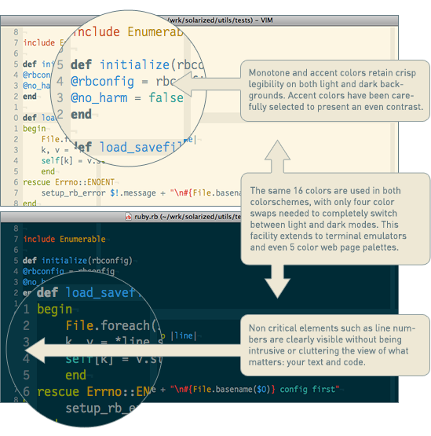
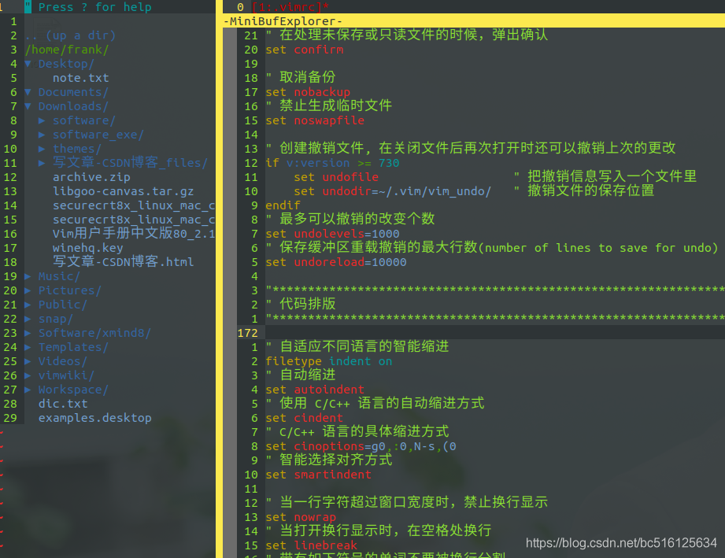
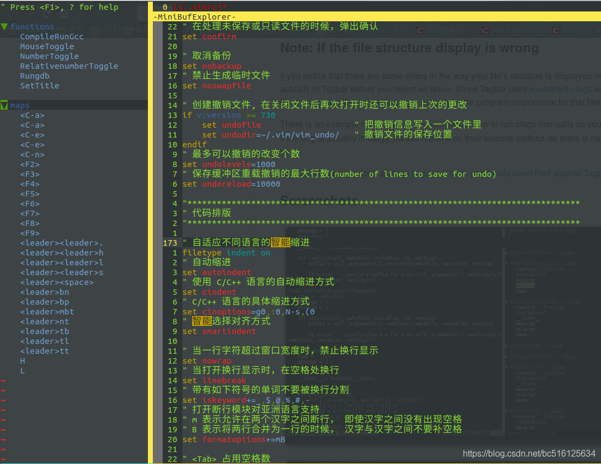
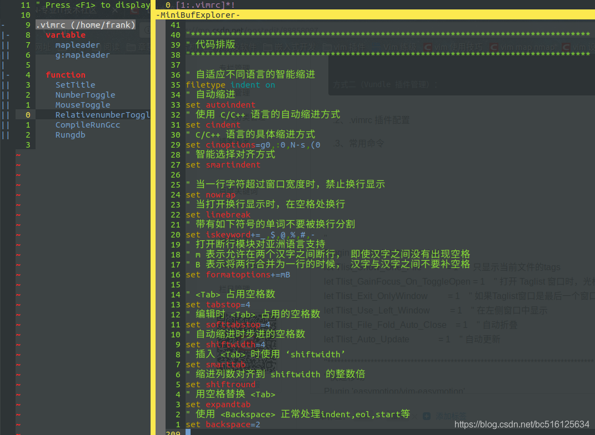

#### **1、插件管理 （[Vundle](https://github.com/VundleVim/Vundle.vim)）**

   1.1 插件安装

```bash
 git clone https://github.com/VundleVim/Vundle.vim.git ~/.vim/bundle/Vundle.vim
```

  1.2、.vimrc 插件配置

```bash
set nocompatible              " 去除VI一致性,必须filetype off                  " 必须 " 设置包括 vundle 和初始化相关的 runtimepathset rtp+=~/.vim/bundle/Vundle.vimcall vundle#begin()" 另一种选择, 指定一个 vundle 安装插件的路径"call vundle#begin('~/some/path/here')" 让 vundle 管理插件版本,必须Plugin 'VundleVim/Vundle.vim' ”{”   所有的插件安装配置都必须在此范围内配置“} " 所有插件需要在下面这行之前配置call vundle#end()            " 必须filetype plugin indent on    " 必须 加载vim自带和插件相应的语法和文件类型相关脚本" 忽视插件改变缩进,可以使用以下替代:"filetype plugin on
```

  1.3、插件安装方式
  安装插件的命令必须放在 vundle#begin 和 vundle#end 之间.
  1.3.1、从 GitHub 进行安装
    格式: Plugin '用户名/插件仓库名'
    示例: Plugin 'tpope/vim-fugitive'
  1.3.2、从 http://vim-scripts.org/vim/scripts.html 进行安装
    格式: Plugin '插件名称'      实际上是 Plugin 'vim-scripts/插件仓库名' 只是此处的用户名可以省略
    示例: Plugin 'L9'
  1.3.3、从不在 GitHub 上的另一个 git 软件库进行安装
    格式: Plugin 'git://git.another_repo.com/plugin'
    示例: Plugin 'git://git.wincent.com/command-t.git'
  1.3.4、从本地文件进行安装
    格式: Plugin 'file:///+本地插件仓库绝对路径'
    示例: Plugin 'file:///home/gmarik/path/to/plugin'
  1.3.5、插件在仓库的子目录中
    格式: Plugin '用户名/插件仓库名',{'rtp': '子目录'}   -- rtp: runtimepath
    示例: Plugin 'rstacruz/sparkup', {'rtp': 'vim/'}    范例插件在 sparkup/vim 目录下
  1.3.6、插件命名冲突，更名插件
    格式: Plugin 'user/plugin', {'name': 'newPlugin'}
    示例: Plugin 'ascenator/L9', {'name': 'newL9'}     已经安装 L9，再次安装另一个 L9

  1.4、常用命令

| :PluginList                  | 列出所有已配置的插件                                         |
| ---------------------------- | ------------------------------------------------------------ |
| :PluginInstall               | 安装 .vimrc.bundles 中列出来的所有插件                       |
| :PluginInstall!:PluginUpdate | 更新 .vimrc.bundles 中列出来的所有插件                       |
| :PluginInstall <plugin-name> | 只安装某一个特定的插件，只需要传递其名称                     |
| :PluginClean                 | 清除未使用插件,需要确认; 追加 `!` 自动批准移除未使用插件     |
| :PluginSearch <text-list>    | 搜索过程中，可以在交互式分屏上安装、清理、研究或重新装入同一列表。想自动装入插件，需将插件添加到 .vimrc.bundles 文件 |
| :PluginSearch foo            | 搜索 foo ; 追加 `!` 清除本地缓存，搜索完成后，可以按下'i'进行安装 |

#### **2、主题（[solarized](https://github.com/altercation/vim-colors-solarized)）**

 



  2.1、插件安装

```bash
方式一：cd ~/.vim/bundlegit clone git://github.com/altercation/vim-colors-solarized.git 方式二（Vundle 插件管理）：Plugin 'altercation/vim-colors-solarized'
```

  2.2、.vimrc 插件配置

```bash
let g:solarized_termtrans  = 1        " 使用 termnal 背景let g:solarized_visibility = "high"   " 使用 :set list 显示特殊字符时的高亮级别 " GUI 模式浅色背景，终端模式深色背景if has('gui_running')    set background=lightelse    set background=darkendif  " 主题设置为 solarizedcolorscheme solarized
```

#### **3、目录树（[NERDTree](https://github.com/scrooloose/nerdtree)）**



####   3.1、插件安装

```bash
方式一：git clone https://github.com/scrooloose/nerdtree.git ~/.vim/bundle/nerdtree 方式二（Vundle 插件管理）：Plugin 'scrooloose/nerdtree'
```

  3.2、.vimrc 插件配置

```bash
let NERDTreeHighlightCursorline = 1       " 高亮当前行let NERDTreeShowLineNumbers     = 1       " 显示行号" 忽略列表中的文件let NERDTreeIgnore = [ '\.pyc$', '\.pyo$', '\.obj$', '\.o$', '\.egg$', '^\.git$', '^\.repo$', '^\.svn$', '^\.hg$' ]" 启动 vim 时打开 NERDTree"autocmd vimenter * NERDTree" 当打开 VIM，没有指定文件时和打开一个目录时，打开 NERDTree"autocmd StdinReadPre * let s:std_in = 1"autocmd VimEnter * if argc() == 0 && !exists("s:std_in") | NERDTree | endif"autocmd VimEnter * if argc() == 1 && isdirectory(argv()[0]) && !exists("s:std_in") | exe 'NERDTree' argv()[0] | wincmd p | ene | exe 'cd '.argv()[0] | endif" 关闭 NERDTree，当没有文件打开的时候autocmd bufenter * if (winnr("$") == 1 && exists("b:NERDTreeType") && b:NERDTreeType == "primary") | q | end " <leader>nt 打开 nerdtree 窗口，在左侧栏显示map <leader>nt :NERDTreeToggle<CR>" <leader>tc 关闭当前的 tabmap <leader>tc :tabc<CR>" <leader>to 关闭所有其他的 tabmap <leader>to :tabo<CR>" <leader>ts 查看所有打开的 tabmap <leader>ts :tabs<CR>" <leader>tp 前一个 tabmap <leader>tp :tabp<CR>" <leader>tn 后一个 tabmap <leader>tn :tabn<CR>
```

  3.3、常用快捷键

| Ctrl - w - w | 光标在 nerdtree 和 vim 编辑窗口 之间切换                   |
| ------------ | ---------------------------------------------------------- |
| <leader>nt   | 打开 nerdtree                                              |
| q            | 关闭 nerdtree                                              |
| o            | 打开选中的文件； 折叠/展开选中的目录                       |
| i            | 打开选中的文件，与已打开文件纵向排布窗口，并跳转至该窗口   |
| gi           | 打开选中的文件，与已打开文件纵向排布窗口，但不跳转至该窗口 |
| s            | 打开选中的文件，与已打开文件横向排布窗口，并跳转至该窗口   |
| gs           | 打开选中的文件，与已打开文件横向排布窗口，但不跳转至该窗口 |
| t            | 在新 Tab 中打开选中文件/书签，并跳到新 Tab                 |
| T            | 在新 Tab 中打开选中文件/书签，但不跳到新 Tab               |
| x            | 折叠选中结点的父目录                                       |
| X            | 递归折叠选中结点下的所有目录                               |
| k / j        | 光标在 Neadtree 上下移动                                   |
| <leader>tc   | :tabc  关闭当前的 tab                                      |
| <leader>to   | :tabo  关闭所有其他 tab                                    |
| <leader>ts   | :tabs  查看所有打开的 tab                                  |
| <leader>tp   | :tabp  前一个 tab                                          |
| <leader>tn   | :tabn  后一个 tab                                          |
| ?            | 显示菜单                                                   |

#### **4、标签导航 （[tagbar](https://github.com/majutsushi/tagbar)）**



  4.1、插件安装

```bash
方式一（Vundle 插件管理）：Plugin 'majutsushi/tagbar' 插件依赖 ctags，安装命令: $ sudo apt install ctags
```

  4.2、.vimrc 插件配置

```bash
let g:tagbar_ctags_bin = 'ctags' " tagbar 依赖 ctags 插件let g:tagbar_width     = 30      " 设置 tagbar 的宽度为 30 列，默认 40 列let g:tagbar_autofocus = 1       " 打开 tagbar 时光标在 tagbar 页面内，默认在 vim 打开的文件内let g:tagbar_left      = 1       " 让 tagbar 在页面左侧显示，默认右边"let g:tagbar_sort      = 0       " 标签不排序，默认排序 " <leader>tb 打开 tagbar 窗口，在左侧栏显示map <leader>tb :TagbarToggle<CR>
```

  4 .3、常用快捷键

| Ctrl - w - w | 光标在 Tagbar 和 vim 编辑窗口 之间切换                       |
| ------------ | ------------------------------------------------------------ |
| <leader>tb   | 打开 tagbar                                                  |
| q            | 关闭 tagbar                                                  |
| j, k         | 上下移动光标                                                 |
| o（+/-）     | 折叠 / 展开标签集合                                          |
| p            | 跳转到选中的标签，但光标仍停留在 Tagbar                      |
| P            | 打开预览窗口显示标签内容，光标仍停留在 Tagbar，回车 光标跳转至 vim 编辑窗口标签所在位置，关闭预览窗口 |
| *            | 展开所有标签                                                 |
| =            | 折叠所有标签                                                 |
| x            | 展开 / 缩小标                                                |

#### **5、标签列表（[taglist.vim](https://github.com/vim-scripts/taglist.vim)）**



 5.1、插件安装

```bash
方式一（Vundle 插件管理）：Plugin 'vim-scripts/taglist.vim' " 依赖 ctags，安装命令：$ sudo apt install ctags
```

  5.2、.vimrc 插件配置

```bash
let Tlist_Show_One_File           = 1    " 只显示当前文件的tagslet Tlist_GainFocus_On_ToggleOpen = 1    " 打开 Tlist 窗口时，光标跳到 Tlist 窗口let Tlist_Exit_OnlyWindow         = 1    " 如果 Tlist 窗口是最后一个窗口则退出 Vimlet Tlist_Use_Left_Window         = 1    " 在左侧窗口中显示let Tlist_File_Fold_Auto_Close    = 1    " 自动折叠let Tlist_Auto_Update             = 1    " 自动更新 " <leader>tl 打开 Tlist 窗口，在左侧栏显示map <leader>tl :TlistToggle<CR>
```

  5.3、常用快捷键

| <leader>tl | 显示 taglist 标签窗口                               |
| ---------- | --------------------------------------------------- |
| q          | 关闭 taglist 标签窗口                               |
| <CR>       | vim 编辑窗口跳转到光标选中的标签定义处              |
| o          | 新建 vim 编辑窗口，并跳转到光标选中标签定义处       |
| p          | vim 编辑窗口跳转至标签定义处，光标留在 taglist 窗口 |
| u          | 更新标签列表窗口中的标签信息                        |
| s          | 切换标签排序类型(按名称序或出现顺序)                |
| x          | 扩展 / 收缩 taglist 标签窗口                        |
| + / -      | 展开 / 折叠 节点                                    |
| * / =      | 展开 / 折叠 所有节点                                |
| F1         | 显示帮助                                            |

#### **6、状态栏优化（[vim-airline](https://github.com/vim-airline/vim-airline)）**

  6.1、插件安装

```bash
方式一（Vundle 插件管理）：Plugin 'vim-airline/vim-airline'
```

  6.2、.vimrc 插件配置

```bash
let g:airline_powerline_fonts                   = 1 " 使用 powerline 打过补丁的字体let g:airline#extensions#tabline#enabled        = 1 " 开启 tablinelet g:airline#extensions#tabline#buffer_nr_show = 1 " 显示 buffer 编号let g:airline#extensions#ale#enabled            = 1 " enable ale integration " 状态栏显示图标设置if !exists('g:airline_symbols')    let g:airline_symbols = {}endiflet g:airline_left_sep          = '⮀'let g:airline_left_alt_sep      = '⮁'let g:airline_right_sep         = '⮂'let g:airline_right_alt_sep     = '⮃'let g:airline_symbols.crypt     = '?'let g:airline_symbols.linenr    = '⭡'let g:airline_symbols.branch    = '⭠'" 切换 buffernnoremap [b :bp<CR>nnoremap ]b :bn<CR> " 关闭当前 buffernoremap <C-x> :w<CR>:bd<CR>" <leader>1~9 切到 buffer1~9map <leader>1 :b 1<CR>map <leader>2 :b 2<CR>map <leader>3 :b 3<CR>map <leader>4 :b 4<CR>map <leader>5 :b 5<CR>map <leader>6 :b 6<CR>map <leader>7 :b 7<CR>map <leader>8 :b 8<CR>map <leader>9 :b 9<CR>
```

  6.3、常用快捷键

| ]b / [b     | 切换buffer              |
| ----------- | ----------------------- |
| <Leader>1~9 | 切换至对应 num 的buffer |
| Ctrl + X    | 关闭当前 buffer         |

#### **7、自动补全（[YouCompleteMe](https://github.com/Valloric/YouCompleteMe)）**

  7.1、插件安装

```bash
step 1、安装依赖$ sudo apt install build-essential cmake python3-dev step 2、Vundle 安装插件Plugin 'Valloric/YouCompleteMe' step 3、安装语言支持$ cd ~/.vim/bundle/YouCompleteMe$ python3 install.py --clang-completer   -- C$ python3 install.py --java-completer    -- java,需要安装 JDK8
```

  7.2、.vimrc 插件配置

```bash
let g:ycm_key_list_select_com let g:ycm_global_ycm_extra_conf = '~/.vim/bundle/YouCompleteMe/third_party/ycmd/.ycm_extra_conf.py'    let g:ycm_min_num_of_chars_for_completion               = 2 " 输入第 2 个字符开始补全                  let g:ycm_seed_identifiers_with_syntax                  = 1 " 语法关键字补全    let g:ycm_complete_in_comments                          = 1 " 在注释中也可以补全    let g:ycm_complete_in_strings                           = 1 " 在字符串输入中也能补全    let g:ycm_collect_identifiers_from_tag_files            = 1 " 使用 ctags 生成的 tags 文件    let g:ycm_collect_identifiers_from_comments_and_strings = 1 " 注释和字符串中的文字也会被收入补全    let g:ycm_cache_omnifunc                                = 0 " 每次重新生成匹配项，禁止缓存匹配项    let g:ycm_use_ultisnips_completer                       = 0 " 不查询 ultisnips 提供的代码模板补全，如果需要，设置成 1 即可let g:ycm_show_diagnostics_ui                           = 0 " 禁用语法检查let g:ycm_key_list_select_completion   = ['<Down>']   " 选择下一条补全，Default: ['<TAB>', '<Down>']let g:ycm_key_list_previous_completion = ['<Up>']     " 选择上一条补全，Default: ['<S-TAB>', '<Up>']let g:ycm_key_list_stop_completion     = ['<Enter>']  " 中止此次补全，Default: ['<C-y>']   
```

  7.3、常用快捷键

| <Down>  | 选择下一条补全          |
| ------- | ----------------------- |
| <Up>    | 选择上一条补全          |
| <Enter> | 中止此次补全 / 选中补全 |

#### **8、自定义代码片段补全（[ultisnips](https://github.com/SirVer/ultisnips)）**

  8.1、插件安装

```bash
方式一：$ cd ~/.vim/bundle$ git clone git://github.com/SirVer/ultisnips.git$ git clone git://github.com/honza/vim-snippets.git 方式二（Vundle 插件管理）：Plugin 'SirVer/ultisnips'" 网友贡献的补全片段Plugin 'honza/vim-snippets'
```

  8.2、.vimrc 插件配置

```bash
let g:UltiSnipsExpandTrigger       = "<c-tab>"     " 代码片段补全触发let g:UltiSnipsListSnippets        = "<c-\>"       " 列出补全可选列表let g:UltiSnipsJumpForwardTrigger  = "<c-j>"       " 下一条补全let g:UltiSnipsJumpBackwardTrigger = "<c-k>"       " 上一条补全let g:UltiSnipsEditSplit           = "horizontal"  " how the edit window is opened 
```

  8.3、常用快捷键

| Ctrl + <Tab> | 触发代码片段补全 |
| ------------ | ---------------- |
| Ctrl + \     | 触发补全列表     |
| Ctrl + j     | 下一条补全       |
| Ctrl + k     | 上一条补全       |

#### **9、代码对齐（[tabular](https://github.com/godlygeek/tabular)）**

  9.1、插件安装

```bash
方式一：$ cd ~/.vim/bundle$ git clone git://github.com/godlygeek/tabular.git 方式二（Vundle 插件管理）：Plugin 'godlygeek/tabular'
```

  9.2、常用命令

| :Tabularize /,                 | 逗号（,）对齐，逗号分割的各部分左对齐，逗号两边添加至少 1 个空格 |
| ------------------------------ | ------------------------------------------------------------ |
| :Tabularize /,/r1              | 逗号（,）对齐，逗号分割的各部分右对齐，逗号两边添加至少 1 个空格 |
| :Tabularize /,/l1              | 逗号（,）对齐，逗号分割的各部分左对齐，逗号两边添加至少 1 个空格 |
| :Tabularize /,/c1              | 逗号（,）对齐，逗号分割的各部分中心对齐，逗号两边添加至少 1 个空格 |
| :Tabularize /,/r1c1l0          | 逗号（,）对齐，第一个逗号前的文本右对齐，添加 1 个空格；逗号居中对齐，添加 1 个空格；逗号后的文本左对齐，不添加空格 |
| :Tabularize /^[^,]*\zs,/r0c0l0 | 第一个逗号（,）对齐，第一个逗号前的文本右对齐，第一个逗号后的所有文本左对齐 |

#### **10、快速添加/删除注释（[nerdcommenter](https://github.com/scrooloose/nerdcommenter)）**

  10.1、插件安装

```bash
方式一：$ cd ~/.vim/bundle$ git clone https://github.com/scrooloose/nerdcommenter.git 方式二（Vundle 插件管理）：Plugin 'scrooloose/nerdcommenter'
```

  10.2、.vimrc 插件配置

```bash
Plugin 'scrooloose/nerdcommenter'let g:NERDSpaceDelims            = 1                                    " 在注释符号后加一个空格let g:NERDCompactSexyComs        = 1                                    " 紧凑排布多行注释let g:NERDDefaultAlign           = 'left'                               " 逐行注释左对齐let g:NERDAltDelims_java         = 1                                    " JAVA 语言使用默认的注释符号let g:NERDCustomDelimiters       = {'c': {'left': '/*', 'right': '*/'}} " C 语言注释符号let g:NERDCommentEmptyLines      = 1                                    " 允许空行注释let g:NERDTrimTrailingWhitespace = 1                                    " 取消注释时删除行尾空格let g:NERDToggleCheckAllLines    = 1                                    " 检查选中的行操作是否成功
```

  10.3、常用快捷键

| `[count]cc`             | 注释当前行起始的 `[count]行 或者 注释 `visual mode 选中的文本 |
| ----------------------- | ------------------------------------------------------------ |
| `[count]cn`             | 注释方式同 `cc，但是强制嵌套`                                |
| `[count]c`              | 切换所选行的注释状态。 如果注释了最上面的选定行，则取消注释所有选定行，反之亦然。 |
| `[count]cm`             | 使用一组多行注释符注释选定行                                 |
| `[count]ci`             | 单独切换所选行的各行注释状态                                 |
| `[count]cs`             | 使用块格式布局注释掉选定的行。                               |
| `c$`                    | 注释从光标到行尾的当前行。                                   |
| `cA`                    | 在行尾添加注释，并切换至插入模式，光标停留在注释符中间       |
| `[count]cl` `[count]cb` | 注释方式同 `cc，注释符左对齐（cl）或者两边对齐（cb）`        |
| `[count]cu`             | 取消选定行的注释                                             |

#### **11、代码动态检查（[ale](https://github.com/w0rp/ale)）**

  11.1、插件安装

```bash
方式一：$ cd ~/.vim/bundle$ git clone https://github.com/w0rp/ale.git 方式二（Vundle 插件管理）：Plugin 'w0rp/ale'
```

  11.2、.vimrc 插件配置

```bash
let g:ale_lint_on_text_changed       = 'normal'                     " 代码更改后启动检查 let g:ale_lint_on_insert_leave       = 1                            " 退出插入模式即检查let g:ale_sign_column_always         = 1                            " 总是显示动态检查结果let g:ale_sign_error                 = '>>'                         " error 告警符号let g:ale_sign_warning               = '--'                         " warning 告警符号let g:ale_echo_msg_error_str         = 'E'                          " 错误显示字符let g:ale_echo_msg_warning_str       = 'W'                          " 警告显示字符let g:ale_echo_msg_format            = '[%linter%] %s [%severity%]' " 告警显示格式 " C 语言配置检查参数let g:ale_c_gcc_options              = '-Wall -Werror -O2 -std=c11'let g:ale_c_clang_options            = '-Wall -Werror -O2 -std=c11'let g:ale_c_cppcheck_options         = ''" C++ 配置检查参数let g:ale_cpp_gcc_options            = '-Wall -Werror -O2 -std=c++14'let g:ale_cpp_clang_options          = '-Wall -Werror -O2 -std=c++14'let g:ale_cpp_cppcheck_options       = '' "使用clang对c和c++进行语法检查，对python使用pylint进行语法检查let g:ale_linters = {\   'c++': ['clang', 'gcc'],\   'c': ['clang', 'gcc'],\   'python': ['pylint'],\}" <F9> 触发/关闭代码动态检查map <F9> :ALEToggle<CR>"普通模式下，ak 前往上一个错误或警告，aj 前往下一个错误或警告                                                                                                                                                    nmap ak <Plug>(ale_previous_wrap)nmap aj <Plug>(ale_next_wrap)" ad 查看错误或警告的详细信息nmap ad :ALEDetail<CR>
```

  11.3、常用快捷键

| <F9> | 触发/关闭代码动态检查    |
| ---- | ------------------------ |
| ak   | 前往上一个错误或警告     |
| aj   | 前往下一个错误或警告     |
| ad   | 查看错误或警告的详细信息 |

#### **12、模糊搜索（[fzf.vim](https://github.com/junegunn/fzf.vim)）**

  12.1、插件安装

```bash
方式一（Vundle 插件管理）：Plugin 'junegunn/fzf', { 'dir': '~/.vim/bundle/fzf', 'do': './install --all' }                                           Plugin 'junegunn/fzf.vim'
```

  12.2、.vimrc 插件配置

```bash
" 调用 Rg 进行搜索，包含隐藏文件" 此命令依赖 ripgrep，ripgrep 安装请参照 https://github.com/BurntSushi/ripgrepcommand! -bang -nargs=* Rg  \ call fzf#vim#grep(  \   'rg --column --line-number --no-heading --color=always --smart-case '.shellescape(<q-args>), 1,  \   <bang>0 ? fzf#vim#with_preview('up:60%')  \           : fzf#vim#with_preview('right:50%:hidden', '?'),  \   <bang>0) " 在当前目录搜索文件nnoremap <Leader>f :Files<CR>" 切换 Buffernnoremap <Leader>b :Buffers<CR>" 在当前所有加载的 Buffer 中搜索包含目标词的所有行nnoremap <Leader>l :Lines<CR>" 在当前 Buffer 中搜索包含目标词的所有行nnoremap <Leader>bl :BLines<CR>" 在 Vim 打开的历史文件中搜索，相当于是在 MRU 中搜索nnoremap <Leader>h :History<CR>
```

  12.3、常用快捷键

| <Leader>f  | 在当前目录搜索文件                               |
| ---------- | ------------------------------------------------ |
| <Leader>b  | 切换 Buffer                                      |
| <Leader>l  | 在当前所有加载的 Buffer 中搜索包含目标词的所有行 |
| <Leader>bl | 在当前 Buffer 中搜索包含目标词的所有行           |
| <Leader>h  | 在 Vim 打开的历史文件中搜索                      |

  13.4、常用命令

| `Files [PATH]`   | 普通文件查找 (similar to `:FZF`)    |
| ---------------- | ----------------------------------- |
| `GFiles [OPTS]`  | git文件查找 (`git ls-files`)        |
| `GFiles?`        | git文件查找 (`git status`)          |
| `Buffers`        | buffer文件切换                      |
| `Lines [QUERY]`  | 加载的所有buffer里查找              |
| `BLines [QUERY]` | 在当前buffer里查找包含某关键词的行  |
| `Tags [QUERY]`   | 以Tag查找 (`ctags -R`)              |
| `BTags [QUERY]`  | Tags in the current buffer          |
| `History`        | `oldfiles` and open buffers         |
| `Commits`        | Git commits (requires fugitive.vim) |
| `BCommits`       | Git commits for the current buffer  |
| `Commands`       | Commands                            |
| `Helptags`       | Help tags                           |

#### **13、快速定位（[vim-easymotion](https://github.com/easymotion/vim-easymotion)）**

  13.1、插件安装

```bash
方式一（Vundle 插件管理）：Plugin 'easymotion/vim-easymotion'
```

   13.2、.vimrc 插件配置

```bash
let g:EasyMotion_do_mapping = 0  " Disable default mappings                                                              let g:EasyMotion_smartcase  = 1  " Turn on case-insensitive feature " Find {char}{char} forward and backward at the same time                                                                nmap <Leader>s <Plug>(easymotion-sn)                                                                                     xmap <Leader>s <Plug>(easymotion-sn)                                                                                     omap <Leader>s <Plug>(easymotion-sn)                                                                                     " Beginning of word forward and backward                                                                                 nmap <Leader>w <Plug>(easymotion-overwin-w)                                                                              xmap <Leader>w <Plug>(easymotion-bd-w)                                                                                   omap <Leader>w <Plug>(easymotion-bd-w)                                                                                   " Line downward and upward                                                                                               nmap <Leader>ej <Plug>(easymotion-overwin-line)                                                                                                                                                              xmap <Leader>ej <Plug>(easymotion-bd-jk)                                                                                 omap <Leader>ej <Plug>(easymotion-bd-jk)                                                                                 " jump to anywhere in line                                                                                               nmap <Leader>ea <Plug>(easymotion-lineanywhere) 
```

  13.3、常用快捷键

| <Leader>s  | 搜索字符，字符个数不限，<CR> 结束 |
| ---------- | --------------------------------- |
| <Leader>w  | 定位到每个单词的开始              |
| <Leader>ej | 行快速跳转                        |
| <Leader>ea | 行内快速定位                      |

#### **13、个人WIKI（[vimwiki](https://github.com/vimwiki/vimwiki)）**

  13.1、插件安装

```bash
方式一：$ cd ~/.vim/bundle$ git clone https://github.com/vimwiki/vimwiki.git 方式二（Vundle 插件管理）：Plugin 'vimwiki/vimwiki'
```

  13.2、.vimrc 插件配置

  13.3、常用快捷键

| <leader>ww    | 打开默认的 wiki 目录文件                       |
| ------------- | ---------------------------------------------- |
| <leader>wt    | 在新标签（Tab）中打开 wiki 目录文件            |
| <leader>ws    | 在多个 wiki 中选择并打开该 wiki 的目录文件     |
| <leader>wd    | 删除当前 wiki 文件                             |
| <leader>wr    | 重命名当前 wiki 文件                           |
| <Enter>       | 创建或打开 wiki 链接                           |
| <Shift-Enter> | 先上下分屏再打开 wiki 链接（若非链接则先创建） |
| <Ctrl-Enter>  | 先左右分屏再打开 wiki 链接（若非链接则先创建） |
| <Backspace>   | 返回之前浏览的 wiki 文件                       |
| <Tab>         | 跳到本文件中下一个 wiki 链接                   |
| <Shift-Tab>   | 跳到本文件中上一个 wiki 链接                   |

  13.4、常用命令

| :Vimwiki2HTML          | 将当前 wiki 文件转换成 HTML 网页 |
| ---------------------- | -------------------------------- |
| :VimwikiAll2HTML       | 把所有 wiki 文件转换成 HTML 网页 |
| :help vimwiki-commands | 显示全部命令                     |