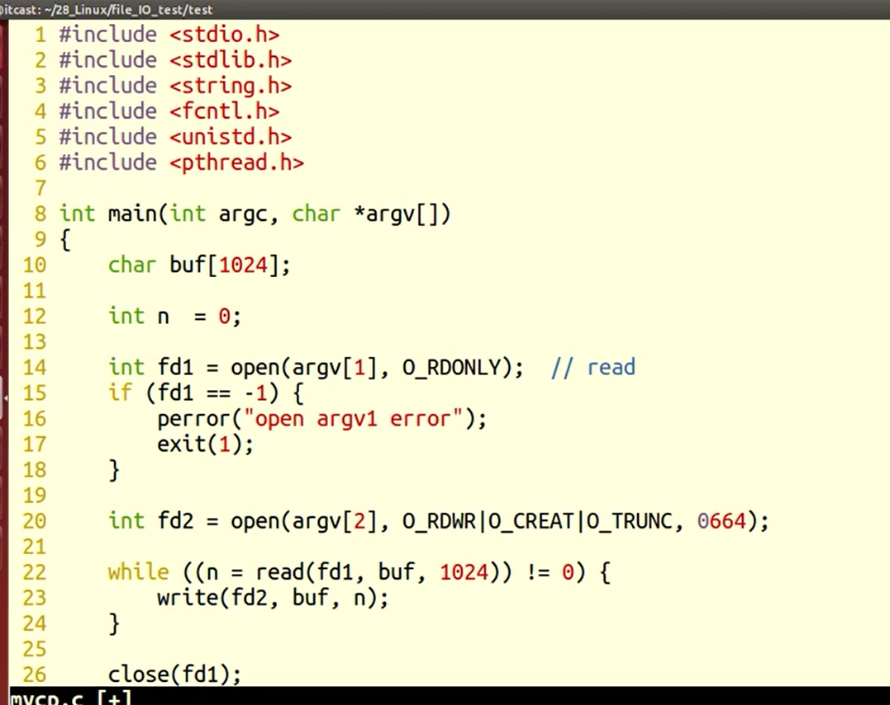
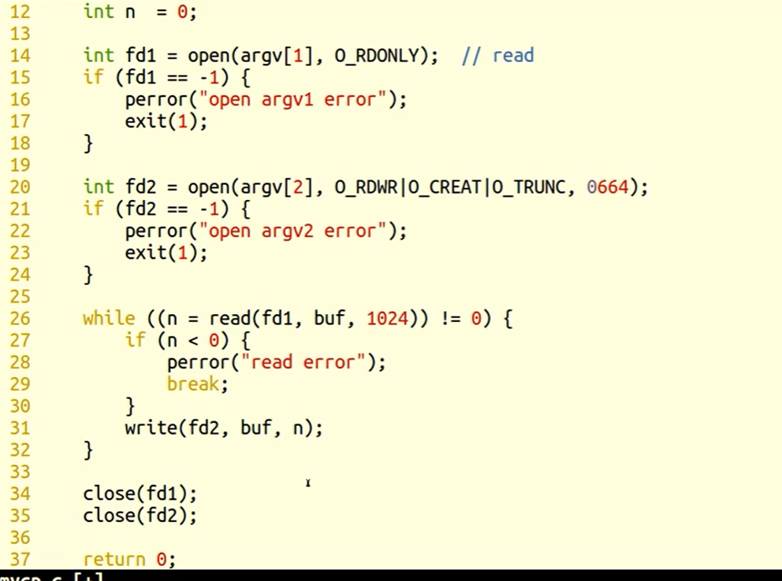
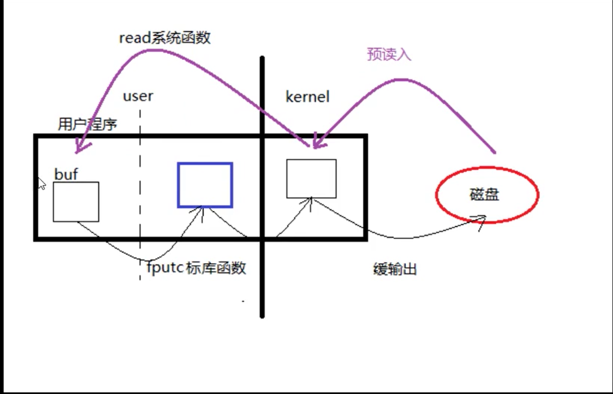
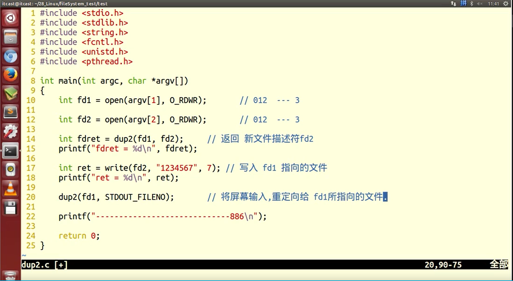

## 文件IO函数

### 1.open/close函数(p50 p53)

---

- open 用来打开文件

  ```c
  #include<unistd.h>		//open函数头文件
  #include<fcntl.h>		//使用flags需要加的头文件
  
  int open(const char*pathname,int flags,.../* mode_t mode */)
  /*  
  	返回值：成功，返回最小未使用文件描述符
             失败，返回-1
  	pathname: 文件路径名
      flags :	文件状态，用位图存储	
      		O_WRONLY   O_RDONLY  O_RDWR  
              O_APPEND 追加 O_CREAT 创建文件 
              O_EXCL 是否存在 O_TRUNC 截断 O_NONBLOCK 非阻塞
      mode:创建新文件时使用，如‘rw-r--r--’对应的0664
      	 文件权限 = mode&~umask
     
      
      常见错误：
      		1.打开文件不存在；‘printf("%d\n", errno);’可查看错误号
      						‘printf("%s\n", strerror(errno));’可查看错误内容
      		2.以写方式打开只读文件；
      		3.打开了目录文件。
             
             
             */
  ```

- close 用来关闭文件

  ```c
  int close(fd);		
  	返回值：成功，返回0
            失败，返回-1
  ```

- 每次打开文件都要记得关闭


### 2.read/write函数(p57)

---

- read 用来读取open打开的文件

  ```c
  #include<unistd.h>
  
  ssize_t read(int fd,void* buf,size_t nbytes);
  /*
  	返回值：成功，返回读取到的字节数
  		  若到文件尾，返回0
  		  失败，返回-1
  	fd：文件描述符
  	buf： 缓冲区
  	nbytes：每一次读取的字节数，常设置为1024
  
  
  */
  ```

- write 用来向open打开的文件写入内容

  ```c
  #include<unistd.h>
  
  ssize_t write(int fd,void* buf,size_t nbytes);
  /*
  	返回值：成功，返回读取到的字节数
  		  若到文件尾，返回0
  		  失败，返回-1,且errorno=EAGAIN或EWOULDBLOCK,表示正在以非阻塞方式读取设备、网络文件
  	fd：文件描述符
  	buf： 缓冲区
  	nbytes：每一次写的字节数，常设置为1024
  
  
  */
  ```

- strace 跟踪软件执行时的系统调用（shell命令）

  ```shell
  strace ./mycp
  ```


- 用read/write函数实现cp功能





- cp功能代码实现

```c++
#include<unistd.h>
#include<fcntl.h>

int main(int argc,char*argv[]){
    char buf[1024];		//设置缓存
    int n = 0;			//用来接收open函数返回值
    
    int fd1 = open(argv[1],O_RDONLY);		//打开文件1
    if(fd1==-1){
        perror("open argv1 error\n");
        exit(1);
    }
    //打开文件2
    int fd2 = open(argv[2],O_RDWR | O_CREAT | O_RUNC,0664);
    if(fd2==-1){
		perror("open argv2 error\n");
        exit(1);
    }
    //从文件1中读取，若无错，则写入文件2
    while((n=read(fd1,buf,1024))!=-1){
        if(n==-1){
            perror("read error\n");
            break;
        }
        write(fd2,buf,n);
    }
    
    close(fd1);
    close(fd2);
    
    return 0;
    
}
```


- **预读入缓输出**





### 3.fcntl函数（p65）

---

- fcntl 用来改变已打开文件的属性

  ```c
  #include<fcntl.h>
  
  int fcntl(int fd,int cmd,.../* int args */);
  
  fd：指向打开文件
      
  args：如果为 0 ，代表不使用这个参数
  
  cmd：控制命令，通过指定不同的宏来修改fd所指向文件的性质。
  
      (1)cmd=F_DUPFD / F_DUPFD_CLOEXEC   复制描述符，可用来用来模拟dup和dup2
  
         		F_DUPFD	返回当前最小的未使用的文件描述符，且>=args        
  
       (2)cmd=F_GETFD / F_SETFD  读取、设置文件描述标识
      
     	 		F_GETFD 返回对应文件的fd
      		F_SETFD 按args设置新的fd 
      				F_CLOEXEC 执行exec函数时关闭文件
  
      （3）cdm=F_GETFL / F_SETFL  	获取、设置文件状态标志 
      
      		F_GETFL	返回对应文件的状态值
      		F_SETFL	设置对应文件的状态值为args    
  
      (4)cmd=F_GETOWN / F_SETOWN	获取/设置异步I/O所有权
      
  
      (5)cmd=F_GETLK / F_SETLK / F_SETLKW		获取/设置记录锁
  
  ```

- 可以模仿dup和dup2

  ```c++
  #include<fcntl.h>
  #include<unistd>
  
  int main(){
      int fd1 = open(test.txt,O_RDWR | O_CREAT | O_TRUNC ,0644);
      write(fd1,"test1\n",6);
      
      int fd2;
      fd2 =fcntl(fd1,F_DUPFD,0);
      write(fd2,"test2\n",6);
      
      int fd3;
      fd3 = fcntl(fd2,F_DUPFD,fd3);
      write(fd3,"test3\n",6);
      
      return 0;
  }
  ```

  

### 4.lseek函数(p53)

---

- lseek 显式地为一个已经打开的文件设置偏移量

- 偏移量：默认为0，读写操作都从当前文件偏移量开始

  ```c
  #include<unistd.h>
  
  int lseek(int fd,off_t offset,int whence);
  
  返回值：
          成功，返回新的文件偏移量（从文件起始位置计算）
          失败，返回-1
  
  fd：
          文件标识符
  
  offset:
          偏移量
  
  whence:
          偏移起始位置，有三种位置
              SEEK_SET 起始位置
              SEEK_CUR 当前
              SEEK_END 结尾
  
  
  
  ```
  
- 应用场景：

  1. 文件读和写使用同一偏移位置

  2. 使用lseek获取文件大小

     ```c
     int file_size = lseek(fd,0,SEEK_END);
     ```

  3. 拓展文件大小

     ```c
     int file_size = lseek(fd,111,SEEK_END);
     write(fd,"\0",1);
     ```

- truncate 拓展文件大小

  ```c
  int truncate(const char* path,off_t length);
  ```

- 文件查看的进制

  ```c
  od -tcx filename		//以十六进制查看文件
  od -tcd filename		//以十进制查看文件
  ```

  

### 5.重定向dup/dup2函数(p63)

---

- duplicate 复制

  ```c++
  #include<unistd.h>
  
  int dup(int oldfd);
  int dup2(int oldfd,int newfd);
  
  返回值：
      成功，返回新文件描述符
      失败，返回-1，设置errono
      
  dup2：
      dupto
      
  dup(fd);	
  	等效于
  fcntl(fd,F_DUPFD,0);
  
  dup2(fd1,fd2);
  	等效于
  close(fd2);
  fcntl(fd,F_DUPFD,fd2);
  
  
  ```

- dup与dup2的使用



- dup与dup2的使用示例：

  ```c++
  #include<unistd.h>
  #include<fcntl.h>
  #include<stdio.h>
  
  int main(int argc,char*argv[]){
      int fd1 = open(argv[1],O_RDWR);
      int fd2 = open(argv[2],O_RDWR | O_CREAT ,0664);
      
      printf("fd1:%d\nfd2:%d",fd1,fd2);
      //test dup
      int fret = dup(fd1);
      if(fret==-1){
          perror("dup error\n");
      }else{
        printf("new fd:%d\n",fret);
      }
      
      int wret = write(fret,"first\n",6);
      if(wret==-1){
          perror("write error\n");
      }
      
      //test dup2
      int fret2 = dup2(fd1,fd2);
      printf("fret2:%d\n",fret2);
      
      write(fd2,"second",6);
      
      dup2(fd1,STOUT_FILENO);
      printf("----------byebye\n");
      
      
      close(fd1);
      close(fd2);
      
      return 0;
  }
  
  ```
  
  


- **fcntl 模拟dup和dup2**

  - 虽然fcntl()可以模拟文件描述符复制，但实际应用中还是使用dup、dup2 

  

  ```c
   1 #include <stdio.h>
   2 #include <sys/types.h>
   3 #include <sys/stat.h>
   4 #include <fcntl.h>
   5 #include <unistd.h>
   6 #include <errno.h>
   7 
   8 int main(void)
   9 {
  10     int fd = 0;
  11 
  12     fd = open("./file.txt", O_RDWR);
  13     if(-1 == fd)
  14     {
  15         printf("open fail: %d\n", errno);
  16         return 0;
  17     }
  18 
  19     /* 模拟dup */
  20     //close(1);
  21     //dup(fd);
  22     
  23     //close(1);
  24     //fcntl(fd, F_DUPFD, 0);
  25 
  26     /* 模拟dup2 */
  27     //dup2(fd, 1);
  28     close(1);
  29     fcntl(fd, F_DUPFD, 1);
  30     
  31     printf("hello world!!\n");    
  32     
  33     return 0;
  34 } 
  ```

  


