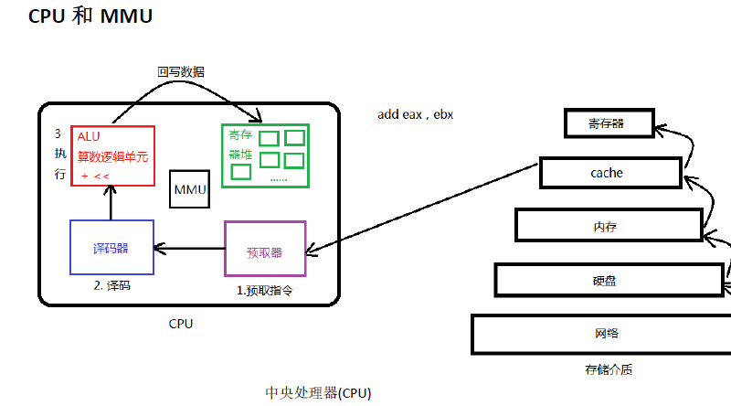
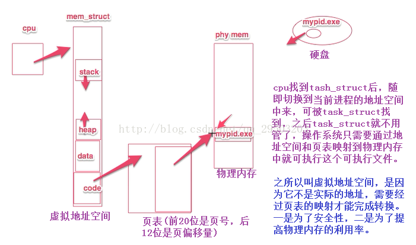
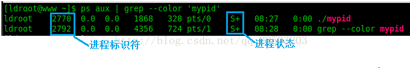
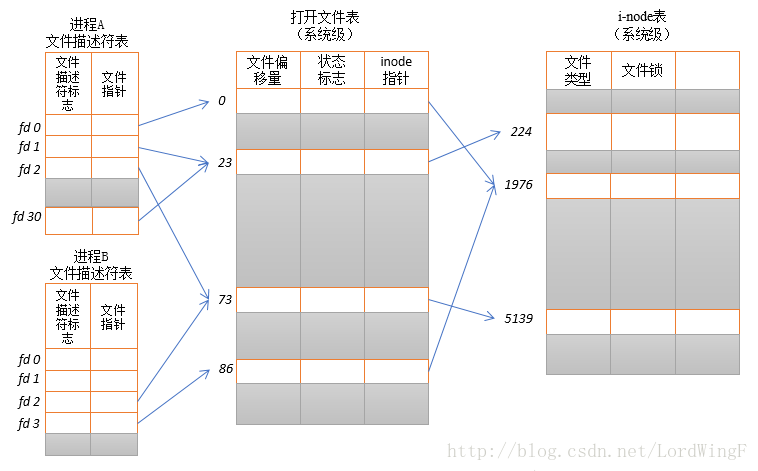
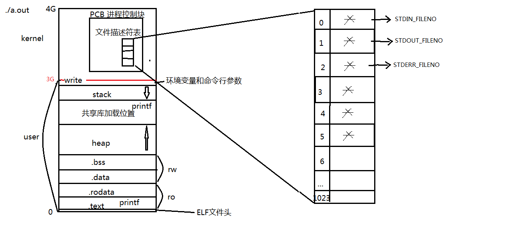
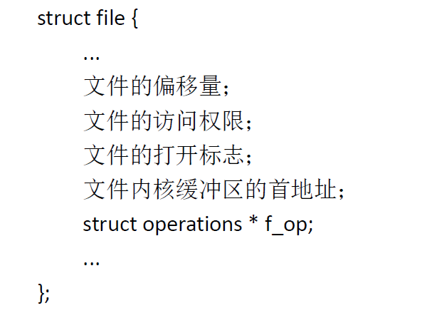

### 一、什么是进程？

#### **1.1 进程可以这样描述：**

* **进程是程序的一个执行实例；**
* **进程是正在执行的程序；**
* **进程是能分配处理器并由处理器执行的实体。**

- **按内核观点来谈进程：它担当分配系统资源（CPU时间，内存）的实体。**


#### 1.2进程的两个基本元素

- **一是程序代码（可能被执行相同程序的其他进程共享），**

- **二是和代码相关联的数据集。**

​		这里的“和代码相关联的数据集指的是**数据段和进程控制块**”。**进程是一种动态描述，但是并不代表所有的进程都在运行。**(进程在内存中因策略或调度需求，会处于各种状态)。

#### **1.3这里再明确以下几点：**

1）操作系统执行程序的过程：

***\**\*

（2）**进程是动态运行的实例，但是并不是所有的进程都在运行**，这前后两句话并不矛盾，因为程序被加载到内存中后，它的执行由进程的状态以及调度算法等来决定。

#### **2.进程的描述**

- **PCB本质是一个task_struct结构体，操作系统用来维护进程相关信息**

​		


​		上面我们已经提到过PCB，那么PCB到底是用来干什么的呢？

​		学了操作系统后，我们都知道操作系统要想管理一个对象，它不是直接进行管理的，而是通过得到被管理者的一些有效信息加以管理的，因此在这里我们也可以这样理解，操作系统管理进程，实则是将进程的有效信息提取出来然后通过管理这些信息来管理进程，而所有的进程信息被存放在一个叫做**进程控制块的数据结构中(可以理解为进程属性的集合)**，这也就是即将要介绍的进程控制块(PCB).

​		每个进程在内核中都有一个进程控制块(PCB)来维护进程相关的信息,Linux内核的进程控制块是task_struct结构体.

​		task_struct是Linux内核的一种数据结构，它会被装载到RAM中并且包含着进程的信息。每个进程都把它的信息放在 task_struct 这个数据结构体，==task_struct 包含了这些内容：==

- **==标示符 ：== 描述本进程的唯一标识符，用来区别其他进程。** 

- ==**状态 ：**==任务状态，退出代码，退出信号等。 

- ==**优先级 ：**==相对于其他进程的优先级。 

- ==**程序计数器：**==程序中即将被执行的下一条指令的地址。 

- ==**内存指针：**==包括程序代码和进程相关数据的指针，还有和其他进程共享的内存块的指针。

- ==**上下文数据：**==进程执行时处理器的寄存器中的数据。 

-  ==**I／O状态信息**==：包括显示的I/O请求,分配给进程的I／O设备和被进程使用的文件列表。 

- ==**记账信息：**==可能包括处理器时间总和，使用的时钟数总和，时间限制，记账号等。 


==有关进程信息还有以下三点需要了解：==

- 保存进程信息的数据结构叫做 task_struct，可以在 ==include/linux/sched.h== 中找到它；

- **所有运行在系统中的进程都以 task_struct 链表的形式存在内核中**； 

- 进程的信息可以通过 **/proc 系统文件夹**查看。要获取PID为400的进程信息，你需要查看 /proc/400 这个文件夹。大多数进程信息同样可以使用top和ps这些用户级工具来获取,例如：




### 二、task_struct(PCB本质)

```c++
struct task_struct {
volatile long state;  //说明了该进程是否可以执行,还是可中断等信息
unsigned long flags;  //Flage 是进程号,在调用fork()时给出
int sigpending;    //进程上是否有待处理的信号
mm_segment_t addr_limit; //进程地址空间,区分内核进程与普通进程在内存存放的位置不同
                        //0-0xBFFFFFFF for user-thead
                        //0-0xFFFFFFFF for kernel-thread
//调度标志,表示该进程是否需要重新调度,若非0,则当从内核态返回到用户态,会发生调度
volatile long need_resched;
int lock_depth;  //锁深度
long nice;       //进程的基本时间片
//进程的调度策略,有三种,实时进程:SCHED_FIFO,SCHED_RR, 分时进程:SCHED_OTHER
unsigned long policy;
struct mm_struct *mm; //进程内存管理信息
int processor;
//若进程不在任何CPU上运行, cpus_runnable 的值是0，否则是1 这个值在运行队列被锁时更新
unsigned long cpus_runnable, cpus_allowed;
struct list_head run_list; //指向运行队列的指针
unsigned long sleep_time;  //进程的睡眠时间
//用于将系统中所有的进程连成一个双向循环链表, 其根是init_task
struct task_struct *next_task, *prev_task;
struct mm_struct *active_mm;
struct list_head local_pages;       //指向本地页面      
unsigned int allocation_order, nr_local_pages;
struct linux_binfmt *binfmt;  //进程所运行的可执行文件的格式
int exit_code, exit_signal;
int pdeath_signal;     //父进程终止时向子进程发送的信号
unsigned long personality;
//Linux可以运行由其他UNIX操作系统生成的符合iBCS2标准的程序
int did_exec:1; 
pid_t pid;    //进程标识符,用来代表一个进程
pid_t pgrp;   //进程组标识,表示进程所属的进程组
pid_t tty_old_pgrp;  //进程控制终端所在的组标识
pid_t session;  //进程的会话标识
pid_t tgid;
int leader;     //表示进程是否为会话主管
struct task_struct *p_opptr,*p_pptr,*p_cptr,*p_ysptr,*p_osptr;
struct list_head thread_group;   //线程链表
struct task_struct *pidhash_next; //用于将进程链入HASH表
struct task_struct **pidhash_pprev;
wait_queue_head_t wait_chldexit;  //供wait4()使用
struct completion *vfork_done;  //供vfork() 使用
unsigned long rt_priority; //实时优先级，用它计算实时进程调度时的weight值

//it_real_value，it_real_incr用于REAL定时器，单位为jiffies, 系统根据it_real_value
//设置定时器的第一个终止时间. 在定时器到期时，向进程发送SIGALRM信号，同时根据
//it_real_incr重置终止时间，it_prof_value，it_prof_incr用于Profile定时器，单位为jiffies。
//当进程运行时，不管在何种状态下，每个tick都使it_prof_value值减一，当减到0时，向进程发送
//信号SIGPROF，并根据it_prof_incr重置时间.
//it_virt_value，it_virt_value用于Virtual定时器，单位为jiffies。当进程运行时，不管在何种
//状态下，每个tick都使it_virt_value值减一当减到0时，向进程发送信号SIGVTALRM，根据
//it_virt_incr重置初值。
unsigned long it_real_value, it_prof_value, it_virt_value;
unsigned long it_real_incr, it_prof_incr, it_virt_value;
struct timer_list real_timer;   //指向实时定时器的指针
struct tms times;      //记录进程消耗的时间
unsigned long start_time;  //进程创建的时间
//记录进程在每个CPU上所消耗的用户态时间和核心态时间
long per_cpu_utime[NR_CPUS], per_cpu_stime[NR_CPUS]; 
//内存缺页和交换信息:
//min_flt, maj_flt累计进程的次缺页数（Copy on　Write页和匿名页）和主缺页数（从映射文件或交换
//设备读入的页面数）； nswap记录进程累计换出的页面数，即写到交换设备上的页面数。
//cmin_flt, cmaj_flt, cnswap记录本进程为祖先的所有子孙进程的累计次缺页数，主缺页数和换出页面数。
//在父进程回收终止的子进程时，父进程会将子进程的这些信息累计到自己结构的这些域中
unsigned long min_flt, maj_flt, nswap, cmin_flt, cmaj_flt, cnswap;
int swappable:1; //表示进程的虚拟地址空间是否允许换出
//进程认证信息
//uid,gid为运行该进程的用户的用户标识符和组标识符，通常是进程创建者的uid，gid
//euid，egid为有效uid,gid
//fsuid，fsgid为文件系统uid,gid，这两个ID号通常与有效uid,gid相等，在检查对于文件
//系统的访问权限时使用他们。
//suid，sgid为备份uid,gid
uid_t uid,euid,suid,fsuid;
gid_t gid,egid,sgid,fsgid;
int ngroups; //记录进程在多少个用户组中
gid_t groups[NGROUPS]; //记录进程所在的组
//进程的权能，分别是有效位集合，继承位集合，允许位集合
kernel_cap_t cap_effective, cap_inheritable, cap_permitted;
int keep_capabilities:1;
struct user_struct *user;
struct rlimit rlim[RLIM_NLIMITS];  //与进程相关的资源限制信息
unsigned short used_math;   //是否使用FPU
char comm[16];   //进程正在运行的可执行文件名
 //文件系统信息
int link_count, total_link_count;
//NULL if no tty 进程所在的控制终端，如果不需要控制终端，则该指针为空
struct tty_struct *tty;
unsigned int locks;
//进程间通信信息
struct sem_undo *semundo;  //进程在信号灯上的所有undo操作
struct sem_queue *semsleeping; //当进程因为信号灯操作而挂起时，他在该队列中记录等待的操作
//进程的CPU状态，切换时，要保存到停止进程的task_struct中
struct thread_struct thread;
  //文件系统信息
struct fs_struct *fs;
  //打开文件信息
struct files_struct *files;
  //信号处理函数
spinlock_t sigmask_lock;
struct signal_struct *sig; //信号处理函数
sigset_t blocked;  //进程当前要阻塞的信号，每个信号对应一位
struct sigpending pending;  //进程上是否有待处理的信号
unsigned long sas_ss_sp;
size_t sas_ss_size;
int (*notifier)(void *priv);
void *notifier_data;
sigset_t *notifier_mask;
u32 parent_exec_id;
u32 self_exec_id;

spinlock_t alloc_lock;
void *journal_info;
};
```


#### **（1）进程的状态**

**volatile long state；**  

**state的可能取值为：**


```cpp
#define TASK_RUNNING        0//进程要么正在执行，要么准备执行
#define TASK_INTERRUPTIBLE  1 //可中断的睡眠，可以通过一个信号唤醒
#define TASK_UNINTERRUPTIBLE    2 //不可中断睡眠，不可以通过信号进行唤醒
#define __TASK_STOPPED      4 //进程停止执行
#define __TASK_TRACED       8 //进程被追踪
/* in tsk->exit_state */ 
#define EXIT_ZOMBIE     16 //僵尸状态的进程，表示进程被终止，但是父进程还没有获取它的终止信息，比如进程有没有执行完等信息。                    
#define EXIT_DEAD       32 //进程的最终状态，进程死亡
/* in tsk->state again */ 
#define TASK_DEAD       64 //死亡
#define TASK_WAKEKILL       128 //唤醒并杀死的进程
#define TASK_WAKING     256 //唤醒进程
```


------

#### **（2）进程的唯一标识(pid)**


```cpp
pid_t pid;//进程的唯一标识
pid_t tgid;// 线程组的领头线程的pid成员的值
```


在Linux系统中，一个线程组中的所有线程使用和该线程组的领头线程（该组中的第一个轻量级进程）相同的PID，并被存放在tgid成员中。只有线程组的领头线程的pid成员才会被设置为与tgid相同的值。注意，getpid()系统调用返回的是当前进程的tgid值而不是pid值。\**（线程是程序运行的最小单位，进程是程序运行的基本单位。）

#### **（3）进程的标记:**


```cpp
unsigned int flags; //flags成员的可能取值如下

//进程的标志信息
#define PF_ALIGNWARN    0x00000001    /* Print alignment warning msgs */
                    /* Not implemented yet, only for 486*/
#define PF_STARTING    0x00000002    /* being created */
#define PF_EXITING    0x00000004    /* getting shut down */
#define PF_EXITPIDONE    0x00000008    /* pi exit done on shut down */
#define PF_VCPU        0x00000010    /* I'm a virtual CPU */
#define PF_FORKNOEXEC    0x00000040    /* forked but didn't exec */
#define PF_MCE_PROCESS  0x00000080      /* process policy on mce errors */
#define PF_SUPERPRIV    0x00000100    /* used super-user privileges */
#define PF_DUMPCORE    0x00000200    /* dumped core */
#define PF_SIGNALED    0x00000400    /* killed by a signal */
#define PF_MEMALLOC    0x00000800    /* Allocating memory */
#define PF_FLUSHER    0x00001000    /* responsible for disk writeback */
#define PF_USED_MATH    0x00002000    /* if unset the fpu must be initialized before use */
#define PF_FREEZING    0x00004000    /* freeze in progress. do not account to load */
#define PF_NOFREEZE    0x00008000    /* this thread should not be frozen */
#define PF_FROZEN    0x00010000    /* frozen for system suspend */
#define PF_FSTRANS    0x00020000    /* inside a filesystem transaction */
#define PF_KSWAPD    0x00040000    /* I am kswapd */
#define PF_OOM_ORIGIN    0x00080000    /* Allocating much memory to others */
#define PF_LESS_THROTTLE 0x00100000    /* Throttle me less: I clean memory */
#define PF_KTHREAD    0x00200000    /* I am a kernel thread */
#define PF_RANDOMIZE    0x00400000    /* randomize virtual address space */
#define PF_SWAPWRITE    0x00800000    /* Allowed to write to swap */
#define PF_SPREAD_PAGE    0x01000000    /* Spread page cache over cpuset */
#define PF_SPREAD_SLAB    0x02000000    /* Spread some slab caches over cpuset */
#define PF_THREAD_BOUND    0x04000000    /* Thread bound to specific cpu */
#define PF_MCE_EARLY    0x08000000      /* Early kill for mce process policy */
#define PF_MEMPOLICY    0x10000000    /* Non-default NUMA mempolicy */
#define PF_MUTEX_TESTER    0x20000000    /* Thread belongs to the rt mutex tester */
#define PF_FREEZER_SKIP    0x40000000    /* Freezer should not count it as freezeable */
#define PF_FREEZER_NOSIG 0x80000000    /* Freezer won't send signals to it */
```


#### **（4）进程之间的亲属关系：**


```cpp
struct task_struct *real_parent; /* real parent process */
struct task_struct *parent; /* recipient of SIGCHLD, wait4() reports */
struct list_head children;    /* list of my children */
struct list_head sibling;    /* linkage in my parent's children list */
struct task_struct *group_leader;    /* threadgroup leader */
```

​		在Linux系统中，所有进程之间都有着直接或间接地联系，每个进程都有其父进程，也可能有零个或多个子进程。拥有同一父进程的所有进程具有兄弟关系。

- **real_parent**	指向其父进程，如果创建它的父进程不再存在，则指向PID为1的init进程。 
- **parent**			指向其父进程，当它终止时，必须向它的父进程发送信号。它的值通常与 real_parent相同。 
- **children**		表示链表的头部，链表中的所有元素都是它的子进程（进程的子进程链表）。 
- **sibling**			用于把当前进程插入到兄弟链表中（进程的兄弟链表）。 
- **group_leader**	指向其所在进程组的领头进程。

------

#### **（5）进程调度信息：**


```cpp
int prio, static_prio, normal_prio;
 unsigned int rt_priority;
 const struct sched_class *sched_class;
 struct sched_entity se;
 struct sched_rt_entity rt;
 unsigned int policy;
```


 **实时优先级范围是0到MAX_RT_PRIO-1（即99），而普通进程的静态优先级范围是从MAX_RT_PRIO到MAX_PRIO-1（即100到139）。值越大静态优先级越低。**

**static_prio用于保存静态优先级，可以通过nice系统调用来进行修改。 
rt_priority用于保存实时优先级。 
normal_prio的值取决于静态优先级和调度策略(\**进程的调度策略有：先来先服务，短作业优先、时间片轮转、高响应比优先等等的调度\**[算法](http://lib.csdn.net/base/datastructure)) 
prio用于保存动态优先级。 
policy表示进程的调度策略，目前主要有以下五种：**


```cpp
#define SCHED_NORMAL        0//按照优先级进行调度（有些地方也说是CFS调度器）
#define SCHED_FIFO        1//先进先出的调度算法
#define SCHED_RR        2//时间片轮转的调度算法
#define SCHED_BATCH        3//用于非交互的处理机消耗型的进程
#define SCHED_IDLE        5//系统负载很低时的调度算法
#define SCHED_RESET_ON_FORK     0x40000000
```


**SCHED_NORMAL用于普通进程，通过CFS调度器实现;**

**SCHED_BATCH用于非交互的处理器消耗型进程;**

**SCHED_IDLE是在系统负载很低时使用;**

**SCHED_FIFO（先入先出调度[算法](http://lib.csdn.net/base/datastructure)）和SCHED_RR（轮流调度算法）都是实时调度策略.**


#### **(6)ptrace系统调用** 


```cpp
unsigned int ptrace;  struct list_head ptraced;  struct list_head ptrace_entry;  unsigned long ptrace_message;  siginfo_t *last_siginfo;      /* For ptrace use.  */  ifdef CONFIG_HAVE_HW_BREAKPOINT  atomic_t ptrace_bp_refcnt;  endif  
```


 **成员ptrace被设置为0时表示不需要被跟踪，它的可能取值如下：**


```cpp
/* linux-2.6.38.8/include/linux/ptrace.h */ 
#define PT_PTRACED  0x00000001  
#define PT_DTRACE   0x00000002  /* delayed trace (used on m68k, i386) */  
#define PT_TRACESYSGOOD 0x00000004  
#define PT_PTRACE_CAP   0x00000008  /* ptracer can follow suid-exec */  
#define PT_TRACE_FORK   0x00000010  
#define PT_TRACE_VFORK  0x00000020  
#define PT_TRACE_CLONE  0x00000040  
#define PT_TRACE_EXEC   0x00000080  
#define PT_TRACE_VFORK_DONE 0x00000100  
#define PT_TRACE_EXIT   0x00000200  
```


#### **（7） 时间数据成员**


**关于时间，一个进程从创建到终止叫做该进程的生存期，进程在其生存期内使用CPU时间，内核都需要进行记录，进程耗费的时间分为两部分，一部分是用户模式下耗费的时间，一部分是在系统模式下耗费的时间.**


```cpp
cputime_t utime, stime, utimescaled, stimescaled;
    cputime_t gtime;
    cputime_t prev_utime, prev_stime;//记录当前的运行时间（用户态和内核态）
    unsigned long nvcsw, nivcsw; //自愿/非自愿上下文切换计数
    struct timespec start_time;  //进程的开始执行时间    
    struct timespec real_start_time;  //进程真正的开始执行时间
    unsigned long min_flt, maj_flt;
    struct task_cputime cputime_expires;//cpu执行的有效时间
    struct list_head cpu_timers[3];//用来统计进程或进程组被处理器追踪的时间
    struct list_head run_list;
    unsigned long timeout;//当前已使用的时间（与开始时间的差值）
    unsigned int time_slice;//进程的时间片的大小
    int nr_cpus_allowed;
```


#### **（8）信号处理信息**


```cpp
struct signal_struct *signal;//指向进程信号描述符
    struct sighand_struct *sighand;//指向进程信号处理程序描述符
    sigset_t blocked, real_blocked;//阻塞信号的掩码
    sigset_t saved_sigmask;    /* restored if set_restore_sigmask() was used */
    struct sigpending pending;//进程上还需要处理的信号
    unsigned long sas_ss_sp;//信号处理程序备用堆栈的地址
    size_t sas_ss_size;//信号处理程序的堆栈的地址
```


------

#### **（9）文件系统信息**


```cpp
/* filesystem information */
    struct fs_struct *fs;//文件系统的信息的指针
/* open file information */
    struct files_struct *files;//打开文件的信息指针
```


### 三.关于文件系统信息的fs_struct结构

- 文件必须由进程打开，每个进程都有它自己当前的工作目录和它自己的根目录。

- **task_struct的fs字段指向进程的fs_struct结构**，
- **files字段指向进程的files_struct结构**。 

​		**在2.4以前的版本中在include/linux/sched.h 中定义为：**

```c
struct fs_struct {

    atomic_t count;

    int umask;

    struct dentry * root, * pwd;

};
```

在2.4中，单独定义在include/linux/fs_struct.h中:

```c
struct fs_struct {

    atomic_t count;

    rwlock_t lock;

    int umask;

    struct dentry * root, * pwd, * altroot;

    struct vfsmount * rootmnt, * pwdmnt, * altrootmnt;

};

count：
    共享这个表的进程个数
lock：
    用于表中字段的读/写自旋锁
umask：
    当打开文件设置文件权限时所使用的位掩码
root：
    根目录的目录项
pwd：
    当前工作目录的目录项
altroot：
    模拟根目录的目录项（在80x86结构上始终为NULL）
rootmnt：
    根目录所安装的文件系统对象
pwdmnt：
    当前工作目录所安装的文件系统对象
altrootmnt：
    模拟根目录所安装的文件系统对象（在80x86结构上始终为NULL）
```

​		count域表示共享同一fs_struct 表的进程数目。umask域由umask（ ）系统调用使用，用于为新创建的文件设置初始文件许可权。

​		**fs_struct 结构是对一个目录项的描述，root、pwd及 altroot三个指针都指向这个结构**。

​		1. root所指向的dentry结构代表着本进程所在的根目录，也就是在用户登录进入系统时所看到的根目录；

​		2. pwd指向进程当前所在的目录；

​		3.altroot则是为用户设置的替换根目录。

​		实际运行时，这三个目录不一定都在同一个文件系统中。例如，进程的根目录通常是安装于“／”节点上的Ext2文件系统，而当前工作目录可能是安装于／msdos的一个DOS文件系统。**因此，fs_ 结构中的rootmnt、 pwdmnt及 altrootmnt就是对那三个目录的安装点的描述，安装点的数据结构为vfsmount。**


### 四、关于文件系统信息的file_struct结构






#### 文件描述符文件描述符表与PCB关系

- **进程最大打开文件个数为1024个**

- **新打开的文件使用最小未使用的文件描述符**

- **PCB中的file struct* file 指针指向文件描述符表，表中通过下标 1 、2 、3...指向文件结构体**

- 每个进程用一个files_struct结构来记录文件描述符的使用情况，这个files_struct结构称为用户打开文件表，它是进程的私有数据。==files_struct结构在include/linux/sched.h中定义如下：==

  ```c++
  struct files_struct {
          atomic_t count; 		/* 共享该表的进程数 */
          rwlock_t file_lock; 	/* 保护以下的所有域,以免在tsk->alloc_lock中的嵌套*/
          int max_fds; 			/*当前文件对象的最大数*/
          int max_fdset; 			/*当前文件描述符的最大数*/
          int next_fd; 			/*已分配的文件描述符加1*/
          struct file ** fd;		 /* 指向文件对象指针数组的指针 */
          fd_set *close_on_exec; 	/*指向执行exec( )时需要关闭的文件描述符*/
          fd_set *open_fds; 		/*指向打开文件描述符的指针*/
          fd_set close_on_exec_init;/* 执行exec( )时需要关闭的文件描述符的初值集合*/
          fd_set open_fds_init; 	/*文件描述符的初值集合*/
          struct file * fd_array[32];/* 文件对象指针的初始化数组*/
  };
  ```

  ​	**fd域指向文件对象的指针数组。**该数组的长度存放在max_fds域中。通常，fd域指向files_struct结构的fd_array域，该域包括32个文件对象指针。如果进程打开的文件数目多于32，内核就分配一个新的、更大的文件指针数组，并将其地址存放在fd域中；内核同时也更新max_fds域的值。

  ​		对于在fd数组中有入口地址的每个文件来说，==数组的索引就是文件描述符（*file descriptor*）==。通常，数组的第一个元素（索引为0）是进程的标准输入文件，数组的第二个元素（索引为1）是进程的标准输出文件，数组的第三个元素（索引为2）是进程的标准错误文件（参见图8.3）。请注意，借助于dup( )、dup2( )和 fcntl( ) 系统调用，两个文件描述符就可以指向同一个打开的文件，也就是说，数组的两个元素可能指向同一个文件对象。当用户使用shell结构（如2>&1）将标准错误文件重定向到标准输出文件上时，用户总能看到这一点。

  ​		open_fds域包含open_fds_init域的地址，open_fds_init域表示当前已打开文件的文件描述符的位图。max_fdset域存放位图中的位数。由于数据结构fd_set有1024位，通常不需要扩大位图的大小。不过，如果确实必须的话，内核仍能动态增加位图的大小，这非常类似文件对象的数组的情形。

  ​		当开始使用一个文件对象时调用内核提供的fget( )函数。这个函数接收文件描述符fd作为参数，返回在current->files->fd[fd]中的地址，即对应文件对象的地址，如果没有任何文件与fd对应，则返回NULL。在第一种情况下，fget( )使文件对象引用计数器f_count的值增1。

  ​		当内核完成对文件对象的使用时，调用内核提供的fput( ) 函数。该函数将文件对象的地址作为参数，并递减文件对象引用计数器f_count的值，另外，如果这个域变为NULL，该函数就调用文件操作的“释放”方法（如果已定义），释放相应的目录项对象，并递减对应索引节点对象的i_writeaccess域的值（如果该文件是写打开），最后，将该文件对象从“正在使用”链表移到“未使用”链表。


### **五、struct file （系统级别）**

> ​	在Linux中，进程是通过**文件描述符（file descriptors，简称fd）**而不是文件名来访问文件的，文件描述符实际上是一个整数。Linux中规定每个进程能最多能同时使用NR_OPEN个文件描述符，这个值在fs.h中定义，为1024*1024（2.0版中仅定义为256）。
>
> ​		**每个文件都有一个32位的数字来表示下一个读写的字节位置**，这个数字叫做**文件位置**。每次打开一个文件，除非明确要求，否则文件位置都被置为0，即文件的开始处，此后的读或写操作都将从文件的开始处执行，但你可以通过执行系统调用**LSEEK**（随机存储）对这个文件位置进行修改。Linux中专门用了一个**数据结构file**来**保存打开文件的文件位置**，这个结构称为**打开的文件描述**（openfile description）。这个数据结构的设置是煞费苦心的，因为它与进程的联系非常紧密，可以说这是VFS中一个比较难于理解的数据结构。
>
> ​		首先，为什么不把文件位置干脆存放在索引节点中，而要多此一举，设一个新的数据结构呢？我们知道，Linux中的文件是能够共享的，假如把文件位置存放在索引节点中，则如果有两个或更多个进程同时打开同一个文件时，它们将去访问同一个索引节点，于是**一个进程的LSEEK操作将影响到另一个进程的读操作，这显然是不允许也是不可想象的。**
>
> ​		另一个想法是既然进程是通过文件描述符访问文件的，为什么不用一个与文件描述符数组相平行的数组来保存每个打开文件的文件位置？这个想法也是不能实现的，原因就在于在生成一个新进程时，**子进程要共享父进程的所有信息，包括文件描述符数组。**
>
> ​		我们知道，一个文件不仅可以被不同的进程分别打开，而且也可以被同一个进程先后多次打开。**一个进程如果先后多次打开同一个文件，则每一次打开都要分配一个新的文件描述符，并且指向一个新的file结构**，尽管它们都指向同一个索引节点，但是，如果一个子进程不和父进程共享同一个file结构，而是也如上面一样，分配一个新的file结构，会出现什么情况了？让我们来看一个例子：
>
> ​		假设有一个输出重定位到某文件A的shell script（shell脚本），我们知道，shell是作为一个进程运行的，当它生成第一个子进程时，将以0作为A的文件位置开始输出，假设输出了2K的数据，则现在文件位置为2K。然后，shell继续读取脚本，生成另一个子进程，它要共享shell的file结构，也就是共享文件位置，所以第二个进程的文件位置是2K，将接着第一个进程输出内容的后面输出。==**如果shell不和子进程共享文件位置，则第二个进程就有可能重写第一个进程的输出了，这显然不是希望得到的结果**==。
>
> ​		至此，已经可以看出设置file结构的原因所在了。
>

- ==**struct file中主要保存了文件位置，此外，还把指向该文件索引节点的指针也放在其中。**==

​		内核对所有打开的文件有一个系统级别的文件描述符表，由==**struct file**==结构形成一个双链表，**称为系统打开文件表**，有时也称为**打开文件描述符表**，并将表格中各条目称为**打开文件句柄**。一个打开文件句柄存储了这个打开文件的全部相关信息。其最大长度是NR_FILE，在fs.h中定义为8192。

- **每个文件对象总是包含在下列的一个双向循环链表之中：**

· 		==“未使用”文件对象的链表==。该链表既可以用做文件对象的内存高速缓存，又可以当作超级用户的备用存储器，也就是说，即使系统的动态内存用完，也允许超级用户打开文件。由于这些对象是未使用的，它们的f_count域是NULL，该链表首元素的地址存放在变量free_list中，内核必须确认该链表总是至少包含NR_RESERVED_FILES个对象，通常该值设为10。

· 		==“正在使用”文件对象的链表==：该链表中的每个元素至少由一个进程使用，因此，各个元素的f_count域不会为NULL，该链表中第一个元素的地址存放在变量anon_list中。

​		如果VFS需要分配一个新的文件对象，就调用函数get_empty_filp( )。该函数检测==“未使用”文件对象链表==的元素个数是否多于NR_RESERVED_FILES，如果是，可以为新打开的文件使用其中的一个元素；如果没有，则退回到正常的内存分配。

- ==**struct file**==大致包含以下信息：

1. **当前文件偏移量**

2. **打开文件时所使用的状态标识(open中的flags参数)**

3. **文件访问模式(只读，只写，读写模式)**

4. **与信号驱动相关的设置。**

5. **对该文件的i-node引用。**

6. **文件类型和访问权限。**

7. **一个指针、指向该文件所持有的锁列表。**

8. **文件的各种属性，包括文件大小及不同类型操作相关的时间戳。**



- **struct file** 在include\linux\fs.h中定义如下：

```c
struct file

{

    struct list_head f_list; 		/*所有打开的文件形成一个链表*/

    struct dentry *f_dentry; 		/*指向相关目录项的指针*/

    struct vfsmount *f_vfsmnt; 		/*指向VFS安装点的指针*/

    struct file_operations *f_op; 	/*指向文件操作表的指针*/

    mode_t f_mode; 					/*文件的打开模式*/

    loff_t f_pos; 					/*文件的当前位置*/

    unsigned short f_flags; 		/*打开文件时所指定的标志*/

    unsigned short f_count;			 /*使用该结构的进程数*/

    unsigned long f_reada, f_ramax, f_raend, f_ralen, f_rawin;

    /*预读标志、要预读的最多页面数、上次预读后的文件指针、预读的字节数以及

    预读的页面数*/

    int f_owner; 					/* 通过信号进行异步I/O数据的传送*/

    unsigned int f_uid, f_gid; 		/*用户的UID和GID*/

    int f_error; 					/*网络写操作的错误码*/

    unsigned long f_version; 		/*版本号*/

    void *private_data; 			/* tty驱动程序所需 */

};
```


### 六、i-node表（系统级别）

保存了文件系统的相关信息。

```c++
struct inode──字符设备驱动相关的重要结构介绍
内核中用inode结构表示具体的文件，而用file结构表示打开的文件描述符。Linux2.6.27内核中，inode结构体具体定义如下：
struct inode {
        struct hlist_node    i_hash;
        struct list_head    i_list;
        struct list_head    i_sb_list;
        struct list_head    i_dentry;
        unsigned long        i_ino;
        atomic_t        i_count;
        unsigned int        i_nlink;
        uid_t            i_uid;
        gid_t            i_gid;
         dev_t            i_rdev;   //该成员表示设备文件的inode结构，它包含了真正的设备编号。
        u64            i_version;
        loff_t            i_size;
        #ifdef __NEED_I_SIZE_ORDERED
        seqcount_t        i_size_seqcount;
}
```


