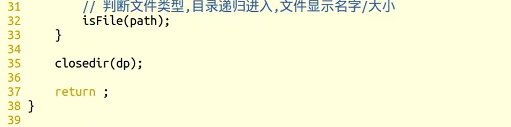

## 文件与目录函数

### stat/lstat函数(p74)

---

#### 函数原型

```c++
//作用：返回文件有关的结构体信息
//作用猜测：stat函数作用是将目标文件inode节点中部分元数据填充进struct stat中，等同一个用户与内核的中间件，防止用户破坏文件

#include<sys/stat.h>

int stat(const char*path,struct stat*buf);		//stat可以穿透符号连接	硬链接
int lstat(const char* path, struct stat* buf);	//lstat不会穿透符号连接

返回值：
    成功，0
    失败，返回-1，并设置errono
path：
    文件路径名
buf：
    是一个传出参数
    Inode结构体指针，存放文件属性，常见操作有：
    	buf.st_size	获取文件大小
    	buf.st_mode	获取文件类型
    	buf.st_mode	获取文件权限
    
```

```c++
struct stat {
               dev_t     st_dev;     /* ID of device containing file */
               ino_t     st_ino;     /* inode number */
               mode_t    st_mode;    /* protection */
               nlink_t   st_nlink;   /* number of hard links */
               uid_t     st_uid;     /* user ID of owner */
               gid_t     st_gid;     /* group ID of owner */
               dev_t     st_rdev;    /* device ID (if special file) */
               off_t     st_size;    /* total size, in bytes */
               blksize_t st_blksize; /* blocksize for filesystem I/O */
               blkcnt_t  st_blocks;  /* number of 512B blocks allocated */
               time_t    st_atime;   /* time of last access */
               time_t    st_mtime;   /* time of last modification */
               time_t    st_ctime;   /* time of last status change */
           };

```


#### **文件类型信息包含在stat结构的st_mode成员中**


### link/unlink/symlink/readlink函数

- 用于创建连接

  ```c++
  #include<unistd.h>
  
  //创建一个新目录项
  int link(const char*oldpath,const char*newpath);
  
  返回值：
      成功，0
      失败，-1
  
  //删除目录项
  int unlink(const char*pathname);	
  
  注意点：
      文件硬链接数为0时不会马上释放，等到所有打开该文件的进程终止时，系统才会挑时间释放
      
  隐式回收：
      所有进程结束时，释放申请的内存空间
  
  //创建符号连接
  int symlink(const char*oldpath,const char*newpath);		
  
  readlink f.soft		//读取符号链接本身
  
  ```

  


### oepndir/closedir/readdir函数

#### 函数原型：

```c++
#include<dirent>

//打开目录
DIR* open(const char*name);

返回值：
    成功，返回指向该目录的结构体指针
    失败，返回NULL
    
//关闭目录
int closedir(DIR* drip);

返回值：
    成功，0
    失败，-1，设置errono

//读目录
struct dirent*readdir(DIR*dirp);

返回值：
    成功，返回目录项结构体指针
    失败，NULL，设置errono值

```


#### **目录项结构体**


#### 文件、目录权限


### getcwd/chdir函数

#### 函数原型：

```c++
//获取当前工作目录
char* gercwd(char*buf,size_t size);

返回值：
    成功，buf保存当前工作目录的位置
    失败，返回NULL

    
//改变
   当前工作目录
int chdir(const char* path);

返回值：
    成功，0
    失败，-1 errono
```


## 函数应用

### 用目录函数实现ls命令


### 目录递归功能的实现

#### **方法一：**





#### **方法二：**


