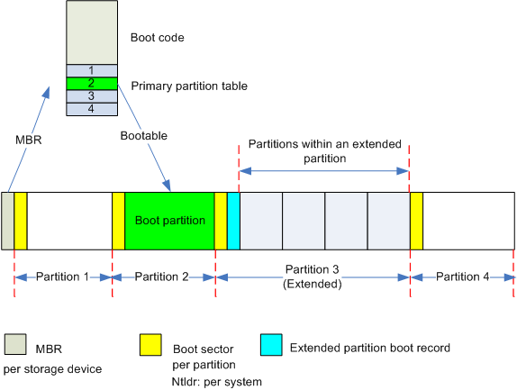
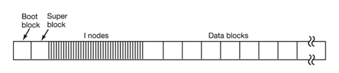
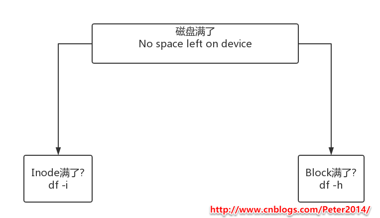
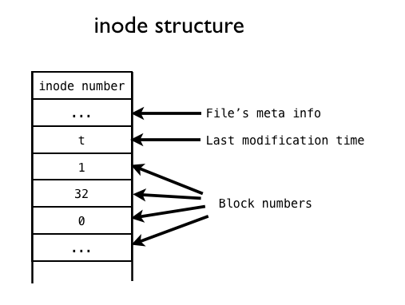
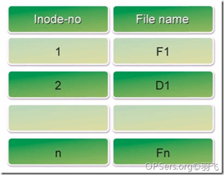
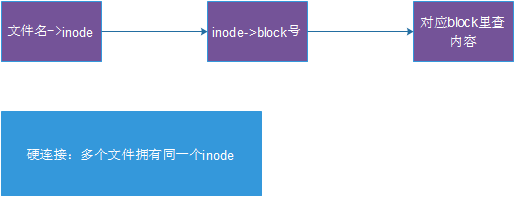
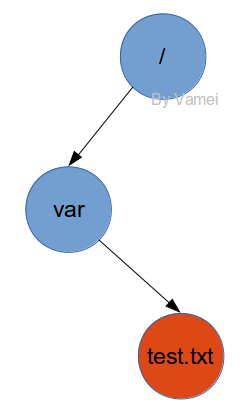
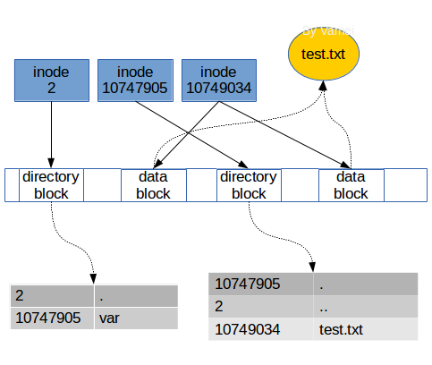
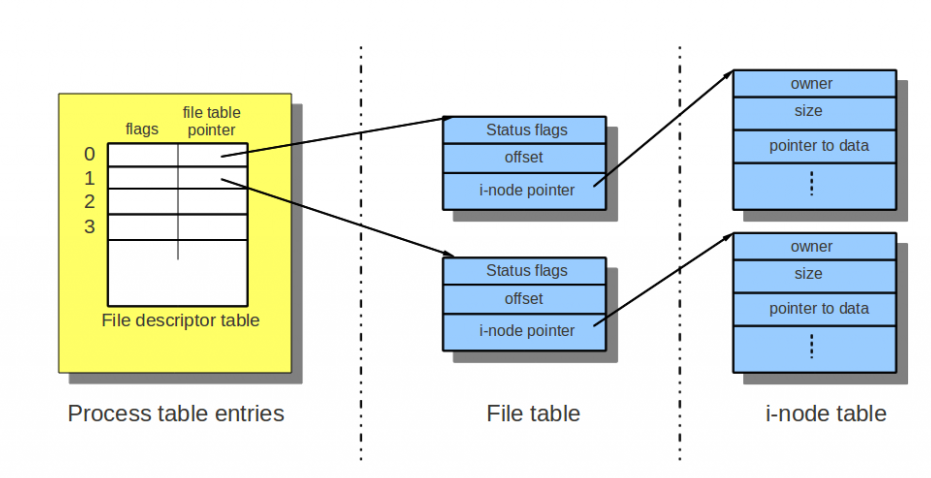

## Linux文件系统的实现


作者：Vamei 出处：http://www.cnblogs.com/vamei 欢迎转载，也请保留这段声明。谢谢！

 

[Linux文件管理](http://www.cnblogs.com/vamei/archive/2012/09/09/2676792.html)从用户的层面介绍了Linux管理文件的方式。Linux有一个树状结构来组织文件。树的顶端为根目录(/)，节点为目录，而末端的叶子为包含数据的文件。当我们给出一个文件的完整路径时，我们从根目录出发，经过沿途各个目录，最终到达文件。

我们可以对文件进行许多操作，比如打开和读写。在[Linux文件管理相关命令](http://www.cnblogs.com/vamei/archive/2012/09/13/2682519.html)中，我们看到许多对文件进行操作的命令。它们大都基于对文件的打开和读写操作。比如cat可以打开文件，读取数据，最后在终端显示：

```
$cat test.txt
```

 

对于Linux下的程序员来说，了解文件系统的底层组织方式，是深入进行系统编程所必备的。即使是普通的Linux用户，也可以根据相关的内容，设计出更好的系统维护方案。

 

### 存储设备分区


文件系统的最终目的是把大量数据有组织的放入持久性(persistant)的存储设备中，比如硬盘和磁盘。这些存储设备与内存不同。它们的存储能力具有持久性，不会因为断电而消失；存储量大，但读取速度慢。

 

观察常见存储设备。最开始的区域是MBR，用于Linux开机启动(参考[Linux开机启动](http://www.cnblogs.com/vamei/archive/2012/09/05/2672039.html))。剩余的空间可能分成数个分区(partition)。每个分区有一个相关的分区表(Partition table)，记录分区的相关信息。这个分区表是储存在分区之外的。分区表说明了对应分区的起始位置和分区的大小。



 

我们在Windows系统常常看到C分区、D分区等。Linux系统下也可以有多个分区，但都被挂载在同一个文件系统树上。

数据被存入到某个分区中。一个典型的Linux分区(partition)包含有下面各个部分:



 

分区的第一个部分是启动区(Boot block)，它主要是为计算机开机服务的。[Linux开机启动](http://www.cnblogs.com/vamei/archive/2012/09/05/2672039.html)后，会首先载入MBR，随后MBR从某个硬盘的启动区加载程序。该程序负责进一步的操作系统的加载和启动。为了方便管理，即使某个分区中没有安装操作系统，Linux也会在该分区预留启动区。

启动区之后的是超级区(Super block)。它存储有文件系统的相关信息，包括文件系统的类型，inode的数目，数据块的数目。

随后是多个inodes，它们是实现文件存储的关键。在Linux系统中，一个文件可以分成几个数据块存储，就好像是分散在各地的龙珠一样。为了顺利的收集齐龙珠，我们需要一个“雷达”的指引：该文件对应的inode。每个文件对应一个inode。这个inode中包含多个指针，指向属于该文件各个数据块。当操作系统需要读取文件时，只需要对应inode的"地图"，收集起分散的数据块，就可以收获我们的文件了。

 

 

最后一部分，就是真正储存数据的数据块们(data blocks)了。

 

### 磁盘的容量由inode和block共同决定



磁盘空间是否满了，是由两项参数决定的：

第一个是inode是否满了，第二是block是否满了，任何一个满了都不能存数据。

### inode简介

上面我们看到了存储设备的宏观结构。我们要深入到分区的结构，特别是文件在分区中的存储方式。

文件是文件系统对数据的分割单元。文件系统用目录来组织文件，赋予文件以上下分级的结构。在硬盘上实现这一分级结构的关键，是使用inode来虚拟普通文件和目录文件对象。

 

在[Linux文件管理](http://www.cnblogs.com/vamei/archive/2012/09/09/2676792.html)中，我们知道，一个文件除了自身的数据之外，还有一个附属信息，即文件的元数据(metadata)。这个元数据用于记录文件的许多信息，比如文件大小，拥有人，所属的组，修改日期等等。元数据并不包含在文件的数据中，而是由操作系统维护的。事实上，这个所谓的元数据就包含在inode中。我们可以用$ls -l filename来查看这些元数据。正如我们上面看到的，inode所占据的区域与数据块的区域不同。每个inode有一个唯一的整数编号(inode number)表示。

 

在保存元数据，inode是“文件”从抽象到具体的关键。正如上一节中提到的，inode储存由一些指针，这些指针指向存储设备中的一些数据块，文件的内容就储存在这些数据块中。当Linux想要打开一个文件时，只需要找到文件对应的inode，然后沿着指针，将所有的数据块收集起来，就可以在内存中组成一个文件的数据了。



 数据块在1, 32, 0, ...

inode并不是组织文件的唯一方式。最简单的组织文件的方法，是把文件依次顺序的放入存储设备，DVD就采取了类似的方式。但如果有删除操作，删除造成的空余空间夹杂在正常文件之间，很难利用和管理。

复杂的方式可以使用链表，每个数据块都有一个指针，指向属于同一文件的下一个数据块。这样的好处是可以利用零散的空余空间，坏处是对文件的操作必须按照线性方式进行。如果想随机存取，那么必须遍历链表，直到目标位置。由于这一遍历不是在内存进行，所以速度很慢。

FAT系统是将上面链表的指针取出，放入到内存的一个数组中。这样，FAT可以根据内存的索引，迅速的找到一个文件。这样做的主要问题是，索引数组的大小与数据块的总数相同。因此，存储设备很大的话，这个索引数组会比较大。

inode既可以充分利用空间，在内存占据空间不与存储设备相关，解决了上面的问题。但inode也有自己的问题。每个inode能够存储的数据块指针总数是固定的。如果一个文件需要的数据块超过这一总数，inode需要额外的空间来存储多出来的指针。

 

### inode示例

在Linux中，我们通过解析路径，根据沿途的目录文件来找到某个文件。目录中的条目除了所包含的文件名，还有对应的inode编号。当我们输入$cat /var/test.txt时，Linux将在根目录文件中找到var这个目录文件的inode编号，然后根据inode合成var的数据。随后，根据var中的记录，找到text.txt的inode编号，沿着inode中的指针，收集数据块，合成text.txt的数据。整个过程中，我们参考了三个inode：根目录文件，var目录文件，text.txt文件的inodes。


了解一下文件系统如何存取文件的：

1、根据文件名，通过Directory里的对应关系，找到文件对应的Inode number

2、再根据Inode number读取到文件的Inode table

3、再根据Inode table中的Pointer读取到相应的Blocks

这里有一个重要的内容，就是Directory，他不是我们通常说的目录，而是一个列表，记录了一个文件/目录名称对应的Inode number。如下图：

- **目录文件存储的是一张表**






在Linux下，可以使用$stat filename，来查询某个文件对应的inode编号。

 

在存储设备中实际上存储为：



 

当我们读取一个文件时，实际上是在目录中找到了这个文件的inode编号，然后根据inode的指针，把数据块组合起来，放入内存供进一步的处理。当我们写入一个文件时，是分配一个空白inode给该文件，将其inode编号记入该文件所属的目录，然后选取空白的数据块，让inode的指针指像这些数据块，并放入内存中的数据。

 

### 文件共享

在Linux的进程中，当我们打开一个文件时，返回的是一个文件描述符。这个文件描述符是一个数组的下标，对应数组元素为一个指针。有趣的是，这个指针并没有直接指向文件的inode，而是指向了一个文件表格，再通过该表格，指向加载到内存中的目标文件的inode。如下图，一个进程打开了两个文件。



可以看到，每个文件表格中记录了文件打开的状态(status flags)，比如只读，写入等，还记录了每个文件的当前读写位置(offset)。当有两个进程打开同一个文件时，可以有两个文件表格，每个文件表格对应的打开状态和当前位置不同，从而支持一些文件共享的操作，比如同时读取。

要注意的是进程fork之后的情况，子进程将只复制文件描述符的数组，而和父进程共享内核维护的文件表格和inode。此时要特别小心程序的编写。

 

### 总结

这里概括性的总结了Linux的文件系统。Linux以inode的方式，让数据形成文件。

了解Linux的文件系统，是深入了解操作系Linux原理的重要一步。


#### 有关inode的总结

1. 磁盘格式化创建文件系统时会生成一定数量的inode和block；
2. inode称为索引节点，作用是存放**文件的属性信息和指向block的指针**；
3. inode是磁盘上的一块存储空间，CentOS6默认**inode大小为256字节**；
4. inode编号是唯一的，不同的文件有唯一的inode号；
5. inode号相同的文件互为硬链接；
6. **创建一个文件至少要占用一个inode和一个block**；
7. 查看inode总量和使用量 df -i；
8. 查看文件的inode信息 ls -li 或 stat /etc/hosts；
9. 生成指定的大小的inode mkfs.ext4 -b 2048 -I 256 /dev/sdb。

#### 有关block的总结

1. 磁盘存取文件是按block为单位存取的；
2. 一个文件可能占用多个block，但是每读取一个block就会消耗一次磁盘I/O；
3. 如果要提升磁盘IO性能，那么block应该大一点，从而能读取更多内容；
4. block太大，存放小文件就会造成空间浪费；block太小，又会消耗磁盘IO；
5. 要根据业务需求确定block大小，一般默认设置为4K；
6. block大小也是格式化时确定的，命令是 mkfs.ext4 -b 2048 -I 256 /dev/sdb。

#### 总的来说

1. 磁盘格式化文件系统后，会分为inode和block两部分；
2. inode存放文件属性和指向block的指针；
3. 文件名和inode对应关系存放在上级目录里的block；
4. inode默认256B，block默认4K；
5. 通过df -i 查看inode数量及使用量；
6. 查看 inode和block大小 dumpe2fs /dev/sda1 | egrep "Inode size|Block size"；
7. 一个文件至少占用一个inode和block，硬链接占用同一个inode；
8. 一个block只能被一个文件使用，block太小，性能差，block太大，浪费空间；
9. 通常，一块空间能放多少文件取决于inode和block的数量和大小，如果文件很小，那么block或inode就容易耗尽；如果文件很大，则应该用block的总数除以一个文件占用的block的数量得出存放文件的数目。