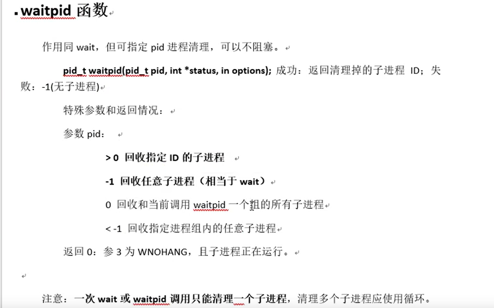

## 进程相关函数

### 1.fork 函数

```c++
#include<unistd.h>

pid_t fork(void);

返回值：
    出错，返回-1
    成功
    	父进程返回子进程id
    	子进程返回0
```

#### fork函数的使用


#### fork创建多个子进程


### 2.getpid/getppid

```c++


pid_t getpid(void);		//获取当前进程的id
pid_t getpid(void);		//获取当前进程父进程的id

返回值：
    成功，返回相应id
    
```

#### getpid/getppid函数的使用


### 3.gdb调试父子进程

```c++
set follow-fork-mode child		//跟踪子进程
set follow_fork_mode parent		//跟踪父进程
```


### 4.exec函数族

```c++


int execl(const char*path,const char*arg,...);

int execlp(const char*file,const char*arg,...);

int execle(const char*path,const char*arg,...,char*const envp[]);

int execv(const char*path,char*const argv[]);

int execvp(const char*file,char*const argv[]);


//execve为系统调用，其余为库函数
int execve(const char*path,char*const argv[],char*const envp[]);


```

#### exec函数族的一般规律


#### execlp函数的使用


- execvp()用法

  


### 5.wait/waitpid函数

#### 作用：

1. 阻塞，等待子进程退出

2. 回收子进程残留资源

3. 获取子进程结束状态

#### wait 函数

```c++
#include < sys / types.h >
#include < sys / wait.h >

pid_t wait ( int   *  status);

	进程一旦调用了 wait，就 立即阻塞自己，由wait自动分析是否当前进程的某个子进程已经退出，如果让它找到了这样一个已经变成僵尸的子进程，wait 就会收集这个子进程的信息， 并把它彻底销毁后返回；如果没有找到这样一个子进程，wait就会一直阻塞在这里，直到有一个出现为止。 
	wait(等待子进程中断或结束)

	wait()会暂时停止目前进程的执行，直到有信号来到或子进程结束。如果在调用wait()时子进程已经结束，则wait()会立即返回子进程结束状态值。子进程的结束状态值会由参数status 返回，而子进程的进程识别码也会一快返回。如果不在意结束状态值，则参数status 可以设成NULL。子进程的结束状态值请参考waitpid()。
返回值
	如果执行成功则返回子进程识别码(PID)，如果有错误发生则返回 - 1 。失败原因存于errno 中。


```


#### waitpid 函数

```c++
#include < sys / types.h >
#include < sys / wait.h >

pid_t waitpid(pid_t pid, int   *  status, int  options);

返回值
	如果执行成功则返回子进程识别码(PID)，如果有错误发生则返回 - 1 。失败原因存于errno 中。

参数pid 为欲等待的子进程识别码，其他数值意义如下：
	pid <- 1  等待进程组识别码为pid 绝对值的任何子进程。
	pid =- 1  等待任何子进程，相当于wait()。
	pid = 0  等待进程组识别码与目前进程相同的任何子进程。
	pid > 0  等待任何子进程识别码为pid 的子进程。

status:    
	waitpid()会暂时停止目前进程的执行，直到有信号来到或子进程结束。如果在调用waitpid()时子进程已经结束，则waitpid()会立即返回子进程结束状态值。子进程的结束状态值会由参数status 返回，而子进程的进程识别码也会一快返回。如果不在意结束状态值，则参数status 可以设成NULL。
	目前在Linux中只支持WNOHANG和WUNTRACED两个选项:
		WNOHANG 如果没有任何已经结束的子进程则马上返回，不予以等待。
		WUNTRACED 如果子进程进入暂停执行情况则马上返回，但结束状态不予以理会。
            
       如果使用了WNOHANG参数调用waitpid，即使没有子进程退出，它也会立即返回，不会像wait那样永远		等下去。

		而WUNTRACED参数，用于跟踪调试，极少用到，就不说了。
            
            
子进程的结束状态返回后存于status，下面有几个宏可判别结束情况：
	WIFEXITED(status)如果子进程正常结束则为非0值。
	WEXITSTATUS(status)取得子进程exit()返回的结束代码，一般会先用WIFEXITED 来判断是否正常结	束才能使用此宏。
	WIFSIGNALED(status)如果子进程是因为信号而结束则此宏值为真
	WTERMSIG(status) 取得子进程因信号而中止的信号代码，一般会先用WIFSIGNALED 来判断后才使用此		宏。
	WIFSTOPPED(status) 如果子进程处于暂停执行情况则此宏值为真。一般只有使用WUNTRACED 时才会有		此情况。
	WSTOPSIG(status) 取得引发子进程暂停的信号代码，一般会先用WIFSTOPPED 来判断后才使用此宏。

if  (WIFEXITED(status)) 
{
    printf( " exited, status=%d/n " , WEXITSTATUS(status));
} 
else   if  (WIFSIGNALED(status)) {
    printf( " killed by signal %d/n " , WTERMSIG(status));
} 
else   if  (WIFSTOPPED(status)) {
    printf( " stopped by signal %d/n " , WSTOPSIG(status));
} 
else   if  (WIFCONTINUED(status)) {
    printf( " continued/n " );
}


options:
	如果我们不想使用它们，也可以把options设为0，如：
	ret = waitpid( - 1 ,NULL, 0 );


查看linux源代码 unistd.h 我们会发现，其实 wait 就是经过包装的 waitpid:
static  inline pid_t wait( int   *  wait_stat)
{
     return  waitpid( - 1 ,wait_stat, 0 );
}

可以用kill函数杀死子进程
kill(childPid,SIGKILL);


```




#### wait 函数的使用


