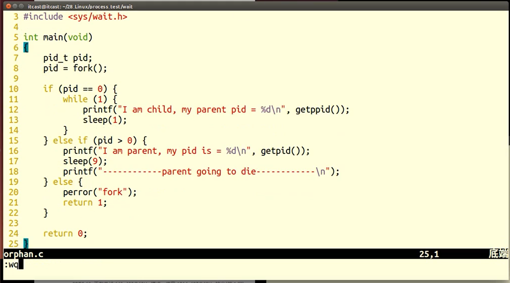

## 进程相关函数

### 1.fork 函数

```c++
//创建子进程

#include<unistd.h>

pid_t fork(void);

返回值：
    出错，返回-1
    成功
    	父进程返回子进程id
    	子进程返回0
```


### 2.getpid/getppid

```c++


pid_t getpid(void);		//获取当前进程的id
pid_t getppid(void);		//获取当前进程父进程的id

返回值：
    成功，返回相应id
    
```


### 3.gdb调试父子进程

```c++
set follow-fork-mode child		//跟踪子进程
set follow_fork_mode parent		//跟踪父进程
```


### 4.exec函数族

```c++


int execl(const char*path,const char*arg,...);

int execlp(const char*file,const char*arg,...);

int execle(const char*path,const char*arg,...,char*const envp[]);

int execv(const char*path,char*const argv[]);

int execvp(const char*file,char*const argv[]);

//execve为系统调用，其余为库函数
int execve(const char*path,char*const argv[],char*const envp[]);


//示例：
char *const ps_argv[] = {"ps", "-o", "pid, ppid, session, tpgid, comm, NULL"};
char *const ps_envp[] = {"PATH=/bin:/usr/bin", "TERM=console", NULL};

execl("/bin/ps", "ps", "-o", "pid,ppid,pgrp,session,tpgid,comm", NULL);
execv("/bin/ps", ps_argv);

execle("/bin/ps", "ps", "-o", "pid,ppid,pgrp,session,tpgid,comm", NULL, ps_envp);
execve("/bin/ps", ps_argv, ps_envp);

execlp("ps", "ps", "-o", "pid,ppid,pgrp,session,tpgid,comm", NULL);
execvp("ps", ps_argv);

```

#### exec函数族的一般规律


### 5.wait/waitpid函数

#### wait 函数

```c++
// 父进程有可能先于子进程结束，导致子进程结束时无父进程回收，wait阻塞父进程，等待子进程退出
// 进程结束时，OS的隐式回收机制：1.关闭所有文件描述符；2.释放用户空间。但PCB依然存在，需要wait回收子进程残留资源
// 可使用wait函数传出参数status保存进程退出状态，借用宏函数进一步判断进程终止的具体原因

#include < sys / types.h >
#include < sys / wait.h >

pid_t wait( int* status);

返回值：
    成功，PID
    失败，-1 errono
    
status借助宏函数判断进程终止具体原因：如不在意结束状态值，可设置为NULL
    
WIFEXITED(status)非0-->进程正常结束
WEXITSTATUS(status)如上宏非0-->取得进程退出状态（子进程exit()返回的结束代码）
    
WIFSIGNALED(status)非0-->进程因信号而异常终止
WTERMSIG(status) 如上宏非0-->获取使进程异常终止的信号

WIFSTOPPED(status) 非0-->进程处于暂停状态，一般只有使用WUNTRACED 时才会有此情况。
WSTOPSIG(status) 如上宏非0-->获取使进程暂停的信号的编号
    
WIFCONTINUED(status)非0-->进程暂停后已经继续运行
   

查看linux源代码 unistd.h 我们会发现，其实 wait 就是经过包装的 waitpid:
static inline pid_t wait( int* wait_stat){
     return waitpid( - 1 ,wait_stat, 0 );
}    

    
	进程一旦调用了 wait，就 立即阻塞自己，由wait自动分析是否当前进程的某个子进程已经退出，如果让它找到了这样一个已经变成僵尸的子进程，wait 就会收集这个子进程的信息， 并把它彻底销毁后返回；如果没有找到这样一个子进程，wait就会一直阻塞在这里，直到有一个出现为止。 
	wait(等待子进程中断或结束)

	wait()会暂时停止目前进程的执行，直到有信号来到或子进程结束。如果在调用wait()时子进程已经结束，则wait()会立即返回子进程结束状态值。子进程的结束状态值会由参数status 返回，而子进程的进程识别码也会一快返回。如果不在意结束状态值，则参数status 可以设成NULL。子进程的结束状态值请参考waitpid()。
返回值
	
```


#### waitpid 函数

```c++
#include < sys / types.h >
#include < sys / wait.h >

pid_t waitpid(pid_t pid, int* status, int options);

返回值
	成功,PID
    0,options 为WNOHANG
    失败，-1 errno。

参数:

pid 
    pid <- 1  等待进程组识别码为pid 绝对值的任何子进程。
    pid =- 1  等待任何子进程，相当于wait()。
    pid = 0  等待进程组识别码与目前进程相同的任何子进程。
    pid > 0  等待任何子进程识别码为pid 的子进程。

status:    
	waitpid()会暂时停止目前进程的执行，直到有信号来到或子进程结束。如果在调用waitpid()时子进程已经结束，则waitpid()会立即返回子进程结束状态值。子进程的结束状态值会由参数status 返回，而子进程的进程识别码也会一快返回。如果不在意结束状态值，则参数status 可以设成NULL。
	
                      
status借助宏函数判断进程终止具体原因：如不在意结束状态值，可设置为NULL
    
WIFEXITED(status)非0-->进程正常结束
WEXITSTATUS(status)如上宏非0-->取得进程退出状态（子进程exit()返回的结束代码）
    
WIFSIGNALED(status)非0-->进程因信号而异常终止
WTERMSIG(status) 如上宏非0-->获取使进程异常终止的信号

WIFSTOPPED(status) 非0-->进程处于暂停状态，一般只有使用WUNTRACED 时才会有此情况。
WSTOPSIG(status) 如上宏非0-->获取使进程暂停的信号的编号
    
WIFCONTINUED(status)非0-->进程暂停后已经继续运行

if  (WIFEXITED(status)) {
    printf( " exited, status=%d/n " , WEXITSTATUS(status));
} else   if  (WIFSIGNALED(status)) {
    printf( " killed by signal %d/n " , WTERMSIG(status));
} else   if  (WIFSTOPPED(status)) {
    printf( " stopped by signal %d/n " , WSTOPSIG(status));
} else   if  (WIFCONTINUED(status)) {
    printf( " continued/n " );
}


options:目前在Linux中只支持WNOHANG和WUNTRACED两个选项	
	如果我们不想使用它们，也可以把options设为0，ret = waitpid( - 1 ,NULL, 0 );	
	WNOHANG 如果没有任何已经结束的子进程则马上返回，不予以等待，即使没有子进程退出，它也会立即返回
	WUNTRACED 如果子进程进入暂停执行情况则马上返回，但结束状态不予以理会,用于跟踪调试，极少用到
            
可以用kill函数杀死子进程
kill(childPid,SIGKILL);
```


## 函数的应用

### fork函数的使用


### fork创建多个子进程


### getpid/getppid函数的使用


### execlp函数的使用


### execvp()用法


### wait 函数的使用

#### 子进程终止原因的识别


#### waitpid与wait区别


#### 非阻塞回收多个子进程


#### 孤儿进程与僵尸进程

- 孤儿进程：父进程先于子进程结束，父进程变成init进程（用于领养孤儿进程的专用进程）



- 僵尸进程：进程终止，父进程未回收，子进程残留资源（PCB）存放于内核中，不能用kill命令清除

  - 回收方法：终止父进程可回收子进程

  

