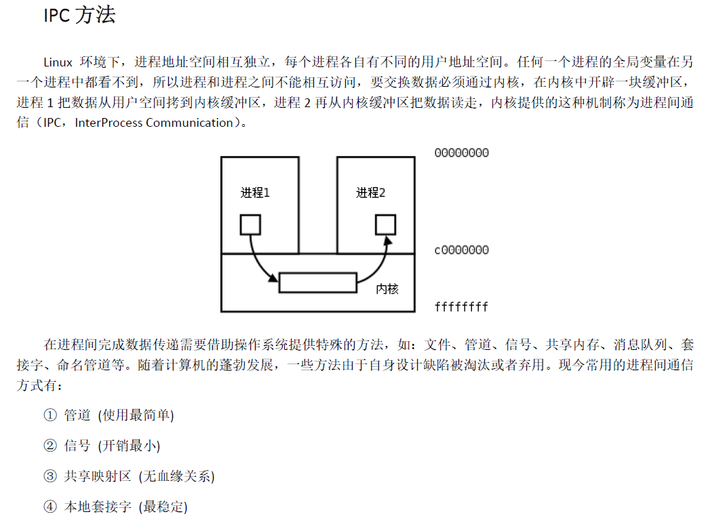
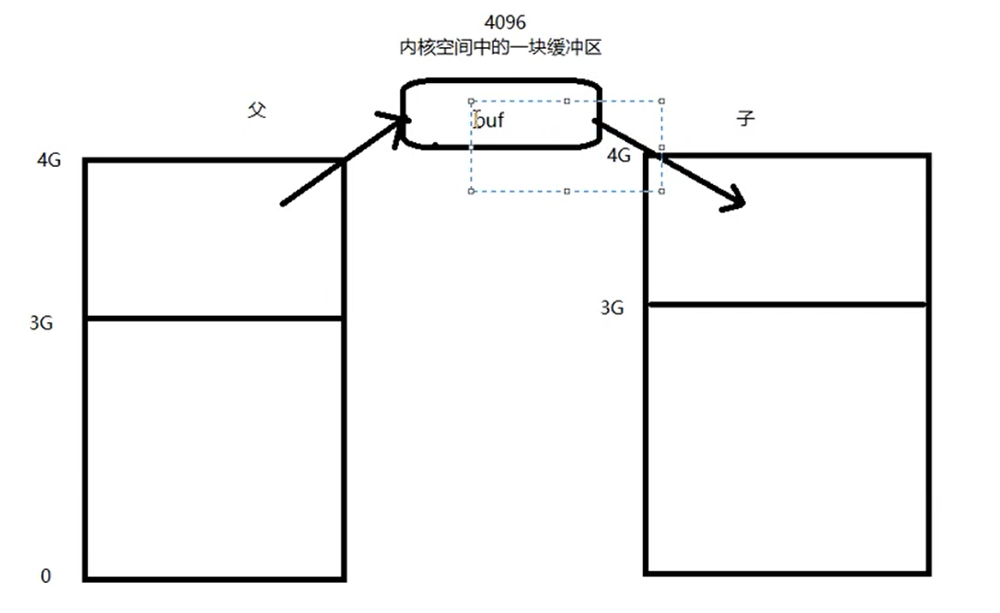
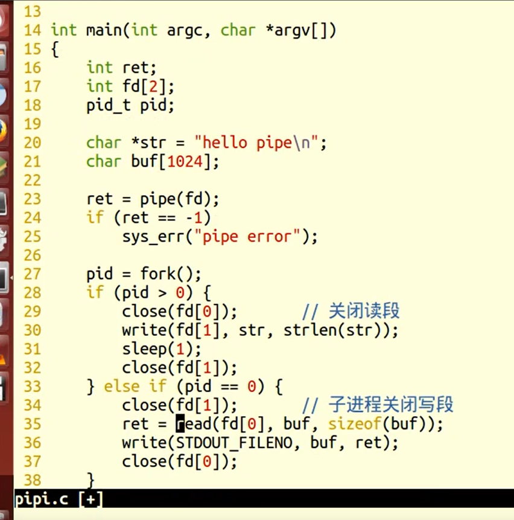
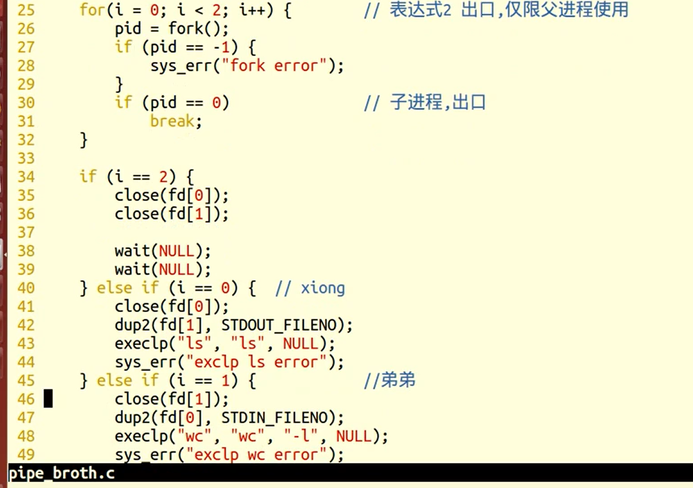
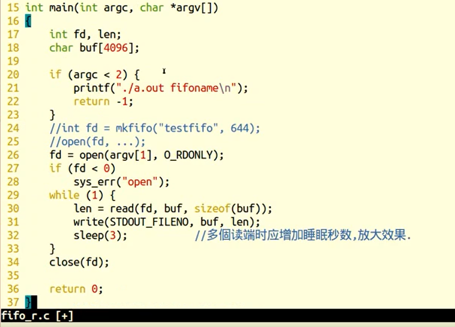

### 管道基础概念

#### 管道的概念


#### 管道通信方式


#### 管道读写行为


#### 管道缓冲区大小


#### 管道的优劣


#### 管道的本质示意图




### 管道函数

#### pipe	管道函数(p430)

```c++
//本质是内核空间中的一块缓冲区（4k大小）
//环形队列缓冲区
//仅使用于有血缘关系的进程间通信

#include<unistd.h>

int pipe(int fd[2]);

返回值：
    成功，0
    失败，-1
```


#### FIFO	命名管道函数(p445)

```c++
//无血缘进程通过FIFO可交换数据

#include<sys/stat.h>

int mkfifo(const char* path,mode_t mode);

返回值：
    成功，返回0
    失败，返回-1
    
	FFo是Linx基础文件类型中的一种。但,FIFO文件在磁盘上没有数据块,仅仅用来标识内核中一条通道。各进程可以打开这个文件进行read/ write,实际上是在读写内核通道,这样就实现了进程间通信
    
创建方式：
	1.命令:mkfo管道名
	2.库函数: int mkfifo(const char* pathname, mode t mode);成功:0;失败
	一旦使用 mkfifo创建了一个FIFO,就可以使用open打开它,常见的文件/O函数都可用于fifo。如: close、read、write、 unlink等
```


### 管道函数的应用


#### pipe函数的使用




#### 兄弟进程通信




#### mkfifo函数的应用




