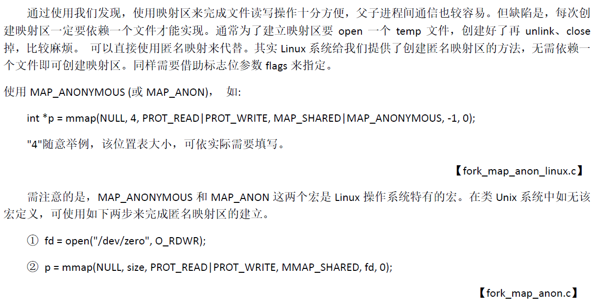

### 存储映射IO


### 共享内存映射区函数

#### **mmap函数** 用于创建共享内存映射区

```c++
#include<sys/mman.h>
void* mmap(void* addr,size_t len,int prot,int flag,int fd,off_t off);

返回值:
	成功，返回映射去的起始地址
    失败，返回 MAP_FAILED
参数：
	addr:指定映射区首地址。 NULL，让系统自动分配
	len:映射区共享内存的大小（<=文件的实际大小）
    prot:设置映射区的读写权限
        	PROT_READ  PROT_WRITE  PROT_READ | PROT_WRITE
    flag:设置共享内存的共享属性
        	MAP_SHARED  MAP_PRIVATE
    fd:用于创建共享内存映射区的文件的描述符。权限需要是读才可以创建映射区
    off:设置偏移位置，需要是4k的整数倍
        默认0，表示映射文件全部
        
```


#### **munmap** 释放映射区

```c++
#include<sys/mman.h>
int munmap(void* addr,size_t len);
```


#### 匿名映射




#### 使用注意事项


### 共享内存映射区函数应用

#### mmap/munmap 的使用实例


#### 父子进程通信

##### mmap父子进程间通信


##### 父子进程匿名通信


#### 无血缘关系通信

##### 写


##### 读

