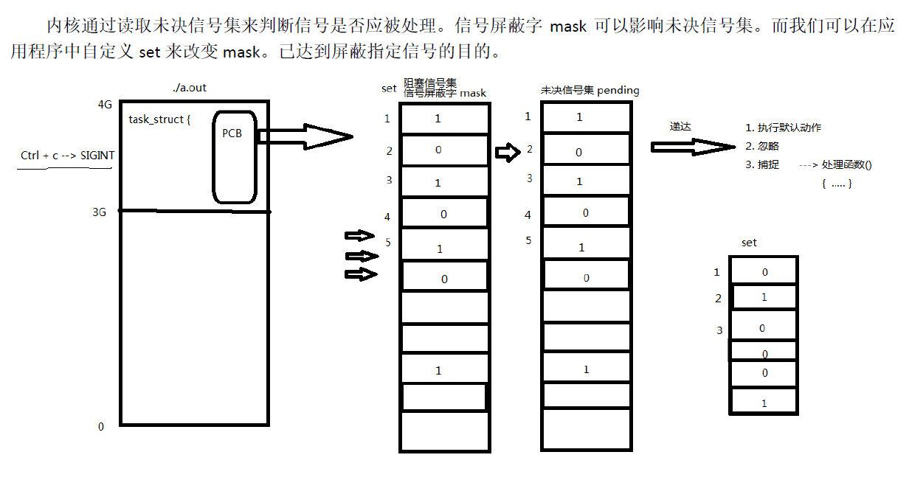

## 信号函数

### 信号集函数

-  信号集的类型为**sigset_t**，每一种信号用1bit来表示；

-  每个进程的PCB进程控制块中的未决信号集，作信号屏蔽字初始状态下，两个信号集的值都为0；

-  当有信号传递到该进程的时候，未决信号集的对应位设置为1，其他位不变，这个时候信号只是传递到进程，并未被处理，叫作**未决状态**。**常规信号在递达之前产生多次只计一次**，而**实时信号在递达之前产生多次可以依次放在一个队列里**。==用户只能获取未决信号集值，无法改变其值==。

-  未决信号想要递达程序的信号处理函数(默认、忽略、自定义)，还==要经过信号屏蔽字的过滤，一旦该信号对应bit为1，则该信号将阻塞，不能传递到信号的处理函数==。用户可以设置获取信号屏蔽字的值。


```c++

sigset_t set;	//typedef unsigned long sigset_t ;

int sigemptyset(sigset_t * set);将	//将信号集set清0
int sigfillset(sigset_t*set);		//将信号集set全置1
int sigaddset(sigset_t*set , int signum);	//将某个信号加入信号集set
int sigdelset(sigset_t*set , int signum);	//将某个信号清除信号集

返回值：
    成功，0
    失败，-1
    
    
int sigismember(const sigset_t*set , int signum);	//判断某个信号是否在set中

返回值：
    在集合中，1
    不在，0
    出错，-1
```





### sigpending	读取未决信号集

- 作用：读取当前进程的未决信号集

```c++
int sigpending(sigset_t*set);

返回值：
    成功，0
    失败，-1
```


### sigprocmask	信号设置

- 1.屏蔽信号；

  2.解除屏蔽

- 若调用sigprocmask解除当前信号的阻塞，则在返回前，至少将其中一个信号递达

```c++

int sigprocmask(int how , const sigset_t*set , sigset_t*oldset);

返回值：
    成功，0
    失败，-1
    
参数：
    how：假设当前信号屏蔽集为mask
        1.SIG_BLOCK:set表示需要屏蔽的信号，mask=mask|set
		2.SIG_UNBLOCK:set表示需要解除屏蔽的信号，mask=mask&~set
		3.SIG_SETMASK:set表示用于替代就屏蔽集的新屏蔽集，mask=set
    set:传入参数，位图，set中哪一位为1，则表示当前进程屏蔽哪一个信号
	oldset：传出参数，保存旧的信号集
	
```


### 发送信号函数

#### kill	发送信号函数

- 作用：给进程传递信号

```c++
#include<signal.h>

int kill(pid_t pid , int sig);

	pid>0,发送信号给指定进程
	pid=0,发信号给统一进程组的所有进程
    pid<-1,发信号给 |pid| 进程组
    pid=-1，发信号给有权利发送的系统中的所有进程
        
返回值：
        成功，0
        失败，-1
```


#### raise	发送信号函数

- 作用：允许进程向自身发送信号


```c++
#include<signal.h>

int raise(int signo);

返回值:
	成功，0
    失败，-1
     
        
raise(signo);
等价于
kill(getpid(),signo);
    
```


### abort	进程终止函数

- 作用：向调用进程发送 SIGABRT,使进程异常终止

```c++
#include<stdlib.h>

void abort(void);
```


### 信号捕捉函数

#### sigaction	信号捕捉函数

- 作用：注册一个信号捕捉函数

```c++

int sigaction(int signum , const struct sigaction*act , struc sigaction*oldact);

返回值：
    成功，0
    失败，-1
    
参数：
    act：传入参数，新的处理方式
    oldact：传出参数，旧的处理方式


struct sigaction {
   void     (*sa_handler)(int);		//回调函数，SIG_IGN表忽略，SIG_DFI表执行默认动作
   void     (*sa_sigaction)(int, siginfo_t *, void *);
   sigset_t   sa_mask;				//当前进程的屏蔽集，仅在处理函数调用期间有效
   int        sa_flags;				//默认为0，表示回调函数执行期间屏蔽当前信号
   void     (*sa_restorer)(void);	//废弃
};

```


#### signal	信号捕捉函数

- 作用：注册一个信号捕捉函数（不常用）

```c++
typedef void(*sighandler_t)(int);

sighandler signal(int signum , sighandler_t handler);

返回值：
    成功，0
    失败，-1
       
```


## 信号函数的使用

### 信号屏蔽函数sigprocmask的使用


### 信号捕捉函数的使用

##### sigaction函数的使用


##### signal的使用


