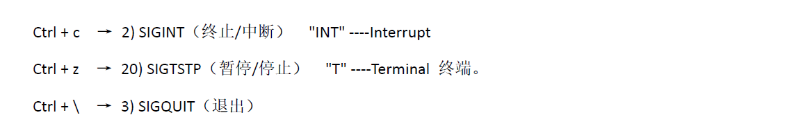
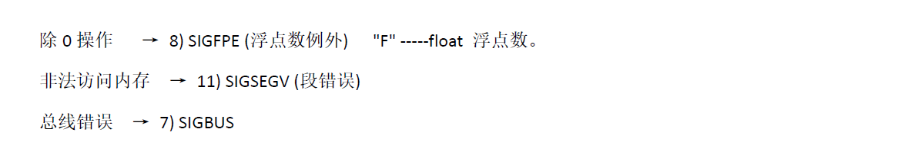
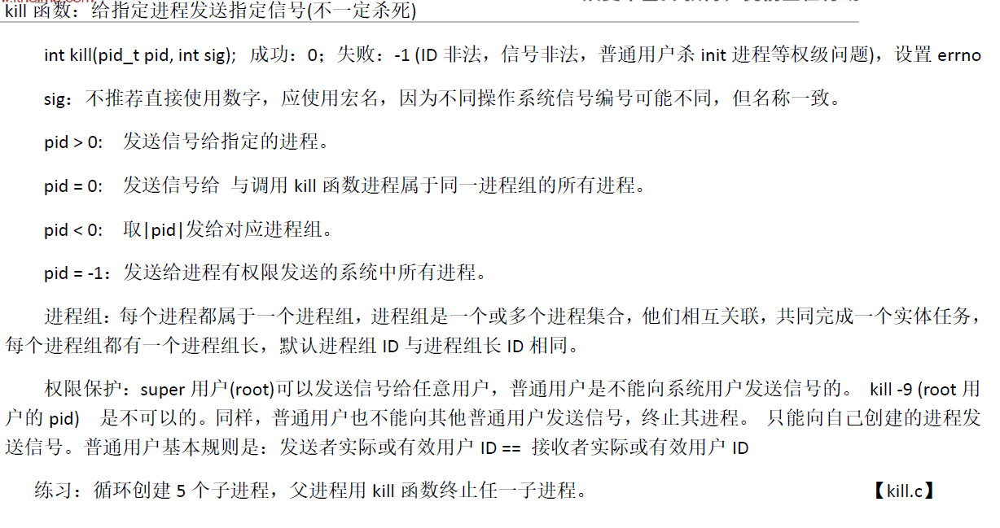
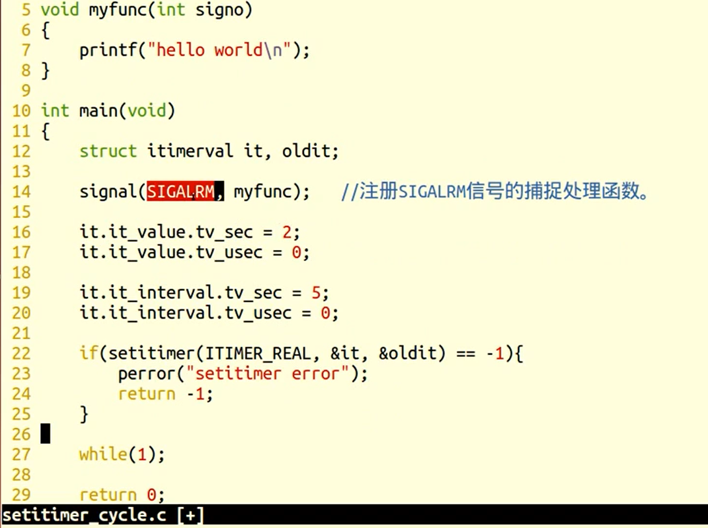

### 终端按键产生信号



### 硬件异常产生信号



### kill函数/命令产生信号




### 软件条件产生信号

#### alarm	定时函数

- 作用：设置定时器。指定seconds后，内核给==当前进程==发送14）==SIGALRM信号==，进程收到该信号后，默认动作终止
- **==每个进程都有且只有唯一一个定时器==**
- 定时与进程状态无关，就绪、运行、阻塞、终止、僵尸...alarm都在计时

```c++
#include<unistd.h>

unsigned int alarm(unsigned int seconds);

返回值：
    0，或剩余的秒述，无失败情况
参数：
    seconds，定时秒数
    
```


#### setitimer	精细定时函数

- 设置定时器，精度us，可实现周期定时
- **实际执行时间 = 系统时间 + 用户时间 + 等待时间**

```c++
#include<unistd.h>

int setitimer(int which,const struct itimerval*new_value,struct itimerval*old_value);

返回值：
    成功，0
    失败，-1
参数：
    which，计时方法
    	ITIMER_REAL（自然定时时间）
    	ITIMER_VIRTUAL（用户空间）
    	ITIMER_PROF（用户空间+内核空间）
    new_value,设定时间
    old_value,剩余时间
   
```

##### struct itimerval   和 struct  timeval

```c++
struct itimerval {
   struct timeval it_interval; /* next value */
   struct timeval it_value;    /* current value */
};

 struct timeval {
   time_t      tv_sec;         /* seconds */
   suseconds_t tv_usec;        /* microseconds */
};

```


##### setitimer的使用

