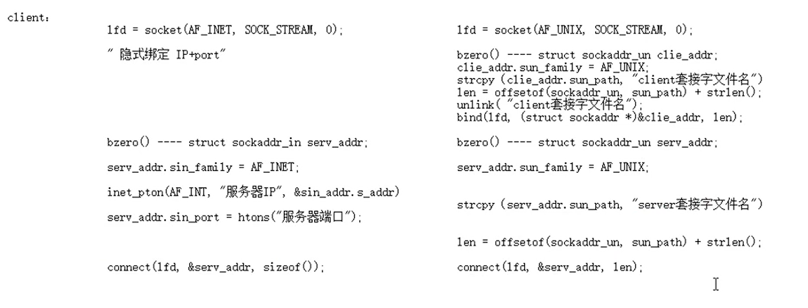
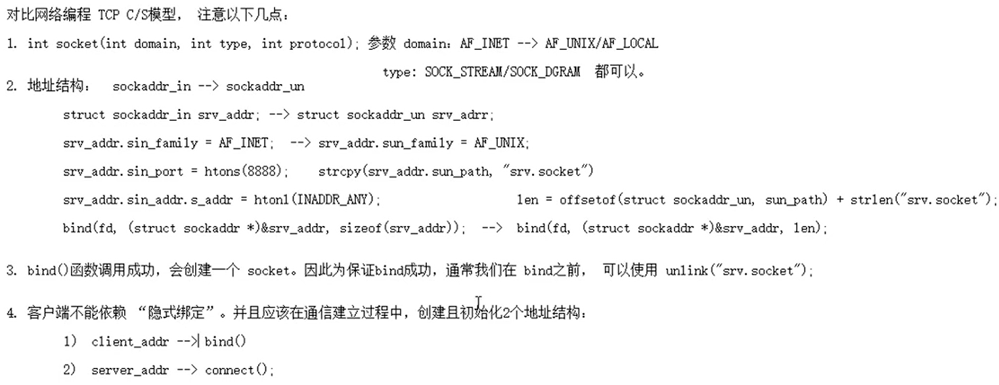
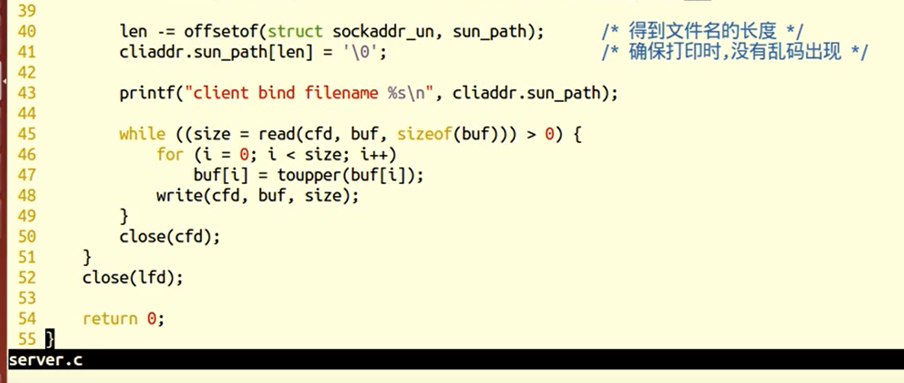
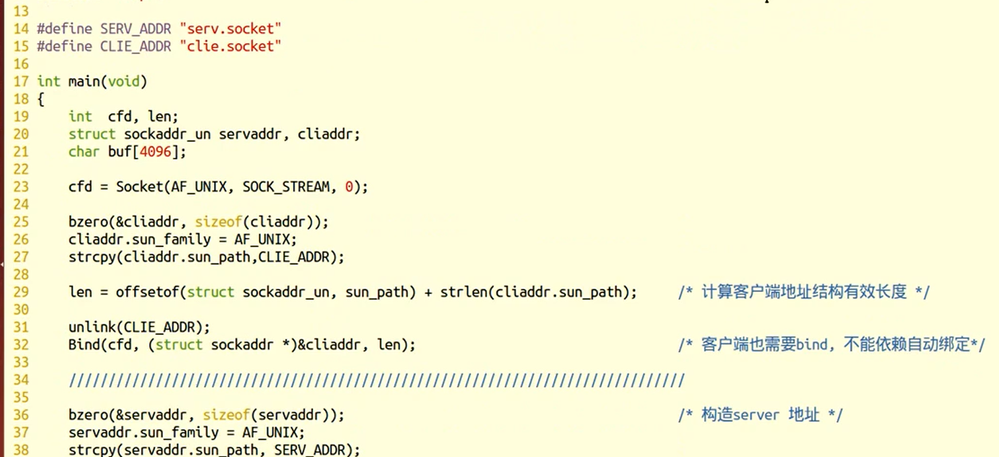

## socket IPC（本地套接字domain）




- socket API原本是为网络通讯设计的，但后来在socket的框架上发展出一种IPC机制，就是UNIX Domain Socket。虽然网络socket也可用于同一台主机的进程间通讯（通过loopback地址127.0.0.1），但是UNIX Domain Socket用于IPC更有效率：**不需要经过网络协议栈，不需要打包拆包、计算校验和、维护序号和应答等**，**只是将应用层数据从一个进程拷贝到另一个进程**。这是因为，IPC机制本质上是可靠的通讯，而网络协议是为不可靠的通讯设计的。UNIX Domain Socket也提供面向流和面向数据包两种API接口，类似于TCP和UDP，但是面向消息的UNIX Domain Socket也是可靠的，消息既不会丢失也不会顺序错乱。

- **UNIX Domain Socket是全双工的，API接口语义丰富，相比其它IPC机制有明显的优越性**，目前已成为使用最广泛的IPC机制，比如X Window服务器和GUI程序之间就是通过UNIXDomain Socket通讯的。
- 使用UNIX Domain Socket的过程和网络socket十分相似，也要先调用socket()创建一个socket文件描述符，address family指定为AF_UNIX，type可以选择SOCK_DGRAM或SOCK_STREAM，protocol参数仍然指定为0即可。

- **UNIX Domain Socket与网络socket编程最明显的不同在于地址格式不同**，用结构体sockaddr_un表示，**网络编程的socket地址是IP地址加端口号**，**而UNIX Domain Socket的地址是一个socket类型的文件在文件系统中的路径**，这个socket文件由bind()调用创建，如果调用bind()时该文件已存在，则bind()错误返回。


对比网络套接字地址结构和本地套接字地址结构：

```c++
struct sockaddr_in {

__kernel_sa_family_t **sin_family**;           /* Address family */   地址结构类型

__be16 **sin_port**;                         /* Port number */      端口号

struct in_addr **sin_addr**;                   /* Internet address */   IP地址

};

struct sockaddr_un {

__kernel_sa_family_t **sun_family**;          /* AF_UNIX */          地址结构类型

char **sun_path**[UNIX_PATH_MAX];          /* pathname */         socket文件名(含路径)

};
```

以下程序将UNIX Domain socket绑定到一个地址。

```c++
 size = offsetof(struct sockaddr_un, sun_path) + strlen(un.sun_path);

  #define offsetof(type, member) ((int)&((type *)0)->MEMBER)
```

#### localSocketServer





#### localSocketClient




### server

```c++
#include <stdlib.h>

\#include <stdio.h>

\#include <stddef.h>

\#include <sys/socket.h>

\#include <sys/un.h>

\#include <sys/types.h>

\#include <sys/stat.h>

\#include <unistd.h>

\#include <errno.h>

 

\#define QLEN 10

/*

\* Create a server endpoint of a connection.

\* Returns fd if all OK, <0 on error.

*/

int serv_listen(const char *name)

{

  int fd, len, err, rval;

  struct sockaddr_un un;

 

  /* create a UNIX domain stream socket */

  if ((fd = socket(AF_UNIX, SOCK_STREAM, 0)) < 0)

​    return(-1);

  /* in case it already exists */

  unlink(name);      

 

  /* fill in socket address structure */

  memset(&un, 0, sizeof(un));

  un.sun_family = AF_UNIX;

  strcpy(un.sun_path, name);

  len = offsetof(struct sockaddr_un, sun_path) + strlen(name);

 

  /* bind the name to the descriptor */

  if (bind(fd, (struct sockaddr *)&un, len) < 0) {

​    rval = -2;

​    goto errout;

  }

  if (listen(fd, QLEN) < 0) { /* tell kernel we're a server */

​    rval = -3;

​    goto errout;

  }

  return(fd);

 

errout:

  err = errno;

  close(fd);

  errno = err;

  return(rval);

}

int serv_accept(int listenfd, uid_t *uidptr)

{

  int clifd, len, err, rval;

  time_t staletime;

  struct sockaddr_un un;

  struct stat statbuf;

 

  len = sizeof(un);

  if ((clifd = accept(listenfd, (struct sockaddr *)&un, &len)) < 0)

​    return(-1); /* often errno=EINTR, if signal caught */

 

  /* obtain the client's uid from its calling address */

  len -= offsetof(struct sockaddr_un, sun_path); /* len of pathname */

  un.sun_path[len] = 0; /* null terminate */

 

  if (stat(un.sun_path, &statbuf) < 0) {

​    rval = -2;

​    goto errout;

  }

  if (S_ISSOCK(statbuf.st_mode) == 0) {

​    rval = -3; /* not a socket */

​    goto errout;

  }

  if (uidptr != NULL)

​    *uidptr = statbuf.st_uid; /* return uid of caller */

  /* we're done with pathname now */

  unlink(un.sun_path); 

  return(clifd);

 

errout:

  err = errno;

  close(clifd);

  errno = err;

  return(rval);

}

int main(void)

{

  int lfd, cfd, n, i;

  uid_t cuid;

  char buf[1024];

  lfd = serv_listen("foo.socket");

 

  if (lfd < 0) {

​    switch (lfd) {

​      case -3:perror("listen"); break;

​      case -2:perror("bind"); break;

​      case -1:perror("socket"); break;

​    }

​    exit(-1);

  }

  cfd = serv_accept(lfd, &cuid);

  if (cfd < 0) {

​    switch (cfd) {

​      case -3:perror("not a socket"); break;

​      case -2:perror("a bad filename"); break;

​      case -1:perror("accept"); break;

​    }

​    exit(-1);

  }

  while (1) {

r_again:

​    n = read(cfd, buf, 1024);

​    if (n == -1) {

​    if (errno == EINTR)

​    goto r_again;

  }

  else if (n == 0) {

​    printf("the other side has been closed.\n");

​    break;

  }

  for (i = 0; i < n; i++)

​    buf[i] = toupper(buf[i]);

​    write(cfd, buf, n);

  }

  close(cfd);

  close(lfd);

  return 0;

}
```


### client

 

```c++
#include <stdio.h>

\#include <stdlib.h>

\#include <stddef.h>

\#include <sys/stat.h>

\#include <fcntl.h>

\#include <unistd.h>

\#include <sys/socket.h>

\#include <sys/un.h>

\#include <errno.h>

 

\#define CLI_PATH "/var/tmp/" /* +5 for pid = 14 chars */

/*

\* Create a client endpoint and connect to a server.

\* Returns fd if all OK, <0 on error.

*/

int cli_conn(const char *name)

{

  int fd, len, err, rval;

  struct sockaddr_un un;

 

  /* create a UNIX domain stream socket */

  if ((fd = socket(AF_UNIX, SOCK_STREAM, 0)) < 0)

​    return(-1);

 

  /* fill socket address structure with our address */

  memset(&un, 0, sizeof(un));

  un.sun_family = AF_UNIX;

  sprintf(un.sun_path, "%s%05d", CLI_PATH, getpid());

  len = offsetof(struct sockaddr_un, sun_path) + strlen(un.sun_path);

 

  /* in case it already exists */

  unlink(un.sun_path); 

  if (bind(fd, (struct sockaddr *)&un, len) < 0) {

​    rval = -2;

​    goto errout;

  }

 

  /* fill socket address structure with server's address */

  memset(&un, 0, sizeof(un));

  un.sun_family = AF_UNIX;

  strcpy(un.sun_path, name);

  len = offsetof(struct sockaddr_un, sun_path) + strlen(name);

  if (connect(fd, (struct sockaddr *)&un, len) < 0) {

​    rval = -4;

​    goto errout;

  }

return(fd);

  errout:

  err = errno;

  close(fd);

  errno = err;

  return(rval);

}

int main(void)

{

  int fd, n;

  char buf[1024];

 

  fd = cli_conn("foo.socket");

  if (fd < 0) {

​    switch (fd) {

​      case -4:perror("connect"); break;

​      case -3:perror("listen"); break;

​      case -2:perror("bind"); break;

​      case -1:perror("socket"); break;

​    }

​    exit(-1);

  }

  while (fgets(buf, sizeof(buf), stdin) != NULL) {

​    write(fd, buf, strlen(buf));

​    n = read(fd, buf, sizeof(buf));

​    write(STDOUT_FILENO, buf, n);

  }

  close(fd);

  return 0;

}
```

