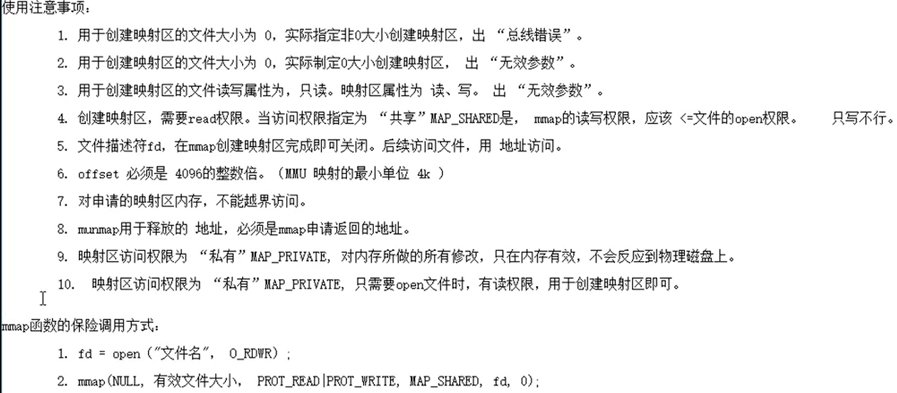

### 1.pipe函数(p430)

- 本质是内核空间中的一块缓冲区（4k大小）
- 环形队列缓冲区

```c++
#include<unistd.h>

int pipe(int fd[2]);

返回值：
    成功，0
    失败，-1
```


### 2.fifo函数(p445)

```c++
#include<sys/stat.h>

int mkfifo(const char* path,mode_t mode);

返回值：
    成功，返回0
    失败，返回-1
```


### 3.mmap (p423) / munmap (p425)

- **mmap函数**：用于创建共享内存映射区

```c++
#include<sys/mman.h>
void* mmap(void* addr,size_t len,int prot,int flag,off_t off);

返回值:
	成功，返回映射去的起始地址
    失败，返回 MAP_FAILED
参数：
	addr:指定映射区首地址。 NULL，让系统自动分配
	len:映射区共享内存的大小（<=文件的实际大小）
    prot:设置映射区的读写权限
        	PROT_READ  PROT_WRITE  PROT_READ | PROT_WRITE
    flag:设置共享内存的共享属性
        	MAP_SHARED  MAP_PRIVATE
    fd:用于创建共享内存映射区的文件的描述符。权限需要是读才可以创建映射区
    off:设置偏移位置，需要是4k的整数倍
        默认0，表示映射文件全部
        
```

- **munmap：**释放映射区

```c++
#include<sys/mman.h>
int munmap(void* addr,size_t len);
```





- mmap/munmap 的使用实例


