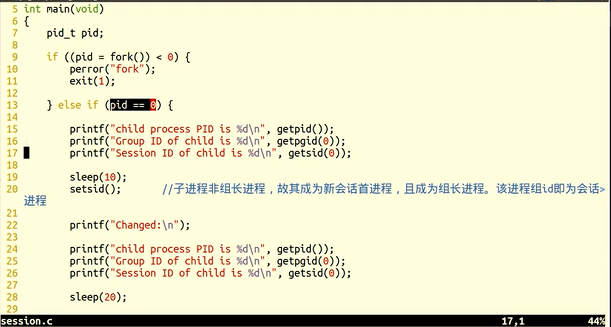
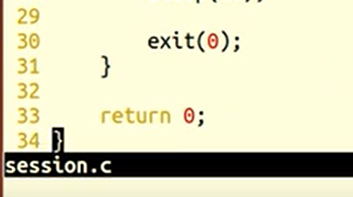
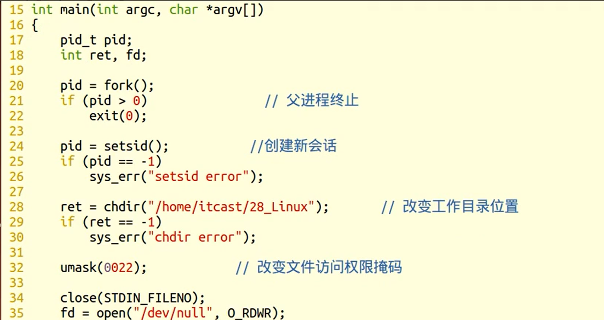
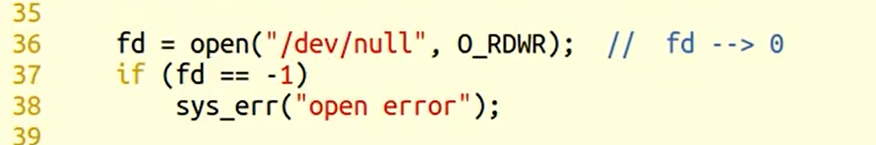

### getsid	获取进程所属会话ID

- 作用：获得进程所属的会话id
- 会话是进程组的集合
- 组长进程不能成为新会话首进程，新会话首进程必定会成为组长进程
- `ps -ajx`命令查看系统中的进程
  - -a	表示不仅列当前用户的进程，也列出其他所有用户的进程
  - -x	表示将有控制终端、没有控制终端的进程全部列出
  - -j	 表示列出与作业控制相关的信息

```c++
#include<unistd.h>

pid_t getsid(pid_t pid);

返回值：
	成功，返回调用进程的会话ID
	失败，-1
    
参数：
    pid：需要查看的进程
    	为0表示查看当前进程session ID
```


### setsid	创建会话

- 创建一个会话，并以自己的ID设置进程组ID，同时也是新会话ID
- 调用了setsid函数的进程，既是新的会长，也是新的组长

```
pid_t setsid(void);

返回值：
	成功，返回调用进程的会话ID
	失败，-1
```


### 创建会话练习







