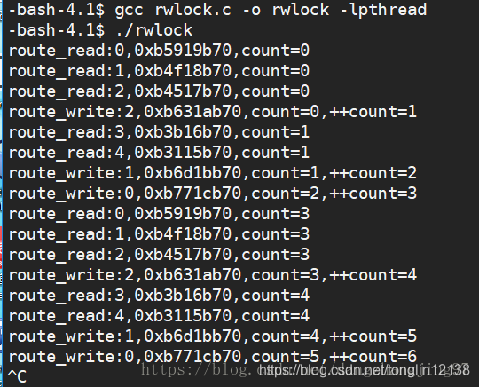

## 一、读写锁是什么？

读写锁其实还是一种锁，是给一段临界区代码加锁，但是此加锁是在进行写操作的时候才会互斥，而在进行读的时候是可以共享的进行访问临界区的。
读写锁和互斥量（互斥锁）很类似，是另一种线程同步机制，但不属于POSIX标准，可以用来同步同一进程中的各个线程。当然如果一个读写锁存放在多个进程共享的某个内存区中，那么还可以用来进行进程间的同步，

**读写锁的使用规则：**

1. 只要没有写模式下的加锁，任意线程都可以进行读模式下的加锁；
2. 只有读写锁处于不加锁状态时，才能进行写模式下的加锁；
3. 读写锁也称为共享-独占（shared-exclusive）锁，当读写锁以读模式加锁时，它是以共享模式锁住，当以写模式加锁时，它是以独占模式锁住。读写锁非常适合读数据的频率远大于写数据的频率从的应用中。这样可以在任何时刻运行多个读线程并发的执行，给程序带来了更高的并发度。

ps：读写锁本质上是一种自旋锁

## 二、为什么需要读写锁？

有时候，在多线程中，有一些公共数据修改的机会比较少，而读的机会却是非常多的，此公共数据的操作基本都是读，如果每次操作都给此段代码加锁，太浪费时间了而且也很浪费资源，降低程序的效率，因为读操作不会修改数据，只是做一些查询，所以在读的时候不用给此段代码加锁，可以共享的访问，只有涉及到写的时候，互斥的访问就好了

## 三、读写锁的行为

读写之间是互斥的—–>读的时候写阻塞，写的时候读阻塞，而且读和写在竞争锁的时候，写会优先得到锁


## 四、自旋锁&挂起等待锁（互斥锁）？

**1.自旋锁**

自旋锁是在发生获取不到锁的时候，会直接等待，不会被CPU直接调度走，而是会一直等到获取到锁，因为此锁是一直的在等待，所以不会有调度的开销，故此锁的效率比挂起等待锁的效率高，但是此锁会因不停的查看锁的释放情况，故会浪费更多的CPU资源

**2.挂起等待锁**

挂起等待锁是当某线程在执行临界区的代码时，那其他线程只能挂起等待，此时这些线程会被CPU调度走，等到锁释放（即就是临界区的代码被之前的那个线程已经执行完毕），而且被CPU调度的线程只有被调度回来才可以执行临界区的代码
挂起等待锁是在发生获取不到锁的时候，他会被CPU调度走，去做别的事，但是会时不时的去查看锁有没有被释放
ps:线程想执行临界区的代码的条件：
（1）锁释放；
（2）被CPU调度回来

**3.自旋锁的优缺点**

优点：效率高，避免了线程之间调度的开销
缺点：浪费CPU资源

**4.挂起等待锁的优缺点**

优点:不会浪费CPU的资源,比较灵活
缺点：效率不高，很可能会使临界区的代码不被任何线程执行，因为可能会是线程被
CPU调度走了但是却没有被调度回来

和互斥量不同的是：互斥量会把试图进入已保护的临界区的线程都阻塞；然而读写锁会视当前进入临界区的线程和请求进入临界区的线程的属性来判断是否允许线程进入。

相对互斥量只有加锁和不加锁两种状态，读写锁有三种状态：读模式下的加锁，写模式下的加锁，不加锁。

## 五、读写锁是怎么实现？

1.一种交易场所（存放数据的地方）：可以是变量、链表、数组或其他数据结构
2.两种角色：读操作和写操作
3.三种关系：
（1）读和读之间没有关系
（2） 写和写之间是互斥关系
（3）读和写之间是同步互斥关系

ps：同步---->读和写在同时竞争锁的时候，写会优先的得到锁
互斥---->读的时候写阻塞，写的时候读阻塞

**相关函数**
（1）pthread_rwlock_init()—->初始化函数

功能：初始化读写锁
头文件：#include<pthread.h>

```c
int pthread_rwlock_init(pthread_rwlock_t *restrict rwlock,const pthred_rwlockattr_t *restrict attr);

```

参数说明：
rwlock：是要进行初始化的
attr：是rwlock的属性
ps：此参数一般不关注，可设为NULL

（2）pthread_rwlock_destroy—->销毁函数

功能：销毁初始化的锁
头文件：#include<pthread.h>

```c
int pthread_rwlock_destroy(pthread_rwlock_t *rwlock);

```

参数说明：
rwlock:是需要进行销毁的锁

（3）加锁和解锁

在进行读操作的时候加的锁：

```c
pthread_rwlock_rdlock(pthread_rwlock_t* rwlock);

```

在进行写操作的时候加的锁：

```c
pthread_rwlock_wrlock(pthread_rwlock_t* rwlock);

```

对读/写统一进行解锁：

```c
pthread_rwlock_unlock(pthread_rwlock_t* rwlock);

```

## 六、代码实现读写锁

```c
#include<stdio.h>
#include<unistd.h>
#include<malloc.h>
#include<stdlib.h>
#include<pthread.h>
pthread_rwlock_t rwlock;//声明读写锁
int count;
//写者线程的入口函数
void*route_write(void*arg)
{
    int i=*(int*)arg;//i是写者线程的编号
    free(arg);
    while(1){
        int t=count;
        //加锁
        pthread_rwlock_wrlock(&rwlock);
        printf("route_write:%d,%#x,count=%d,++count=%d\n",i,\
                pthread_self(),t,++count);
        //解锁
        pthread_rwlock_unlock(&rwlock);
        sleep(1);
    }
}
//读者线程的入口函数
void*route_read(void*arg)
{
    int i=*(int*)arg;//i是读者线程的编号
    free(arg);
    while(1){
        //加锁
        pthread_rwlock_rdlock(&rwlock);
        printf("route_read:%d,%#x,count=%d\n",i,pthread_self(),count);
        //解锁
        pthread_rwlock_unlock(&rwlock);
        sleep(1);
    }
}

int main()
{
    int i=0;
    //初始化读写锁
    pthread_rwlock_init(&rwlock,NULL);
    pthread_t tid[8];
    //创建3个写者线程
    for(i=0;i<3;i++){
        int*p=(int*)malloc(sizeof(int));
        *p=i;
        pthread_create(&tid[i],NULL,route_write,(void*)p);
    }
    //创建3个读者线程
    for(i=0;i<5;i++){
        int*p=(int*)malloc(sizeof(int));
        *p=i;
        pthread_create(&tid[i+3],NULL,route_read,(void*)p);
    }
    //主线程等待新创建的线程
    for(i=0;i<8;i++)
        pthread_join(tid[i],NULL);
    //销毁读写锁
    pthread_rwlock_destroy(&rwlock);
    return 0;
}
123456789101112131415161718192021222324252627282930313233343536373839404142434445464748495051525354555657585960616263
```

