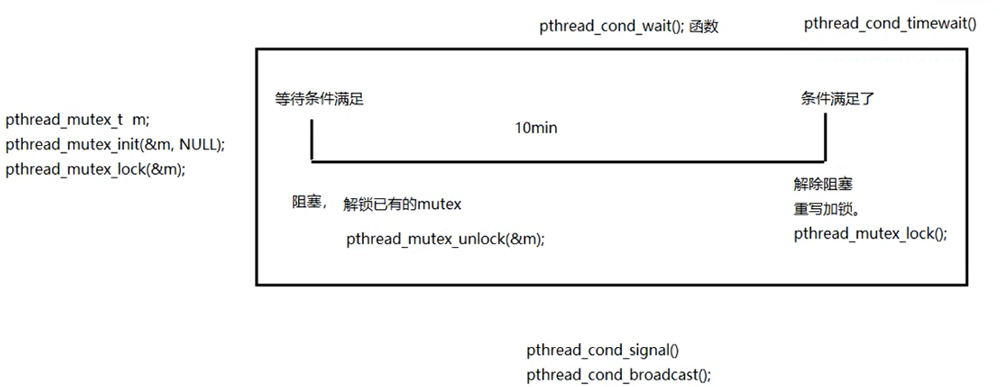
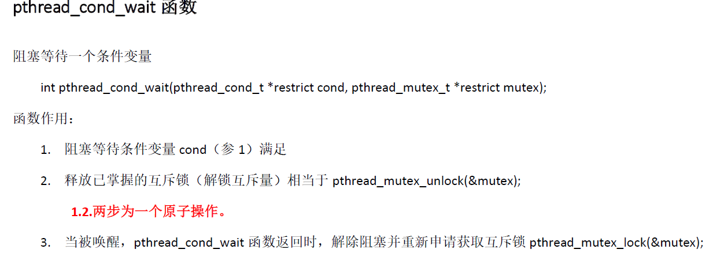
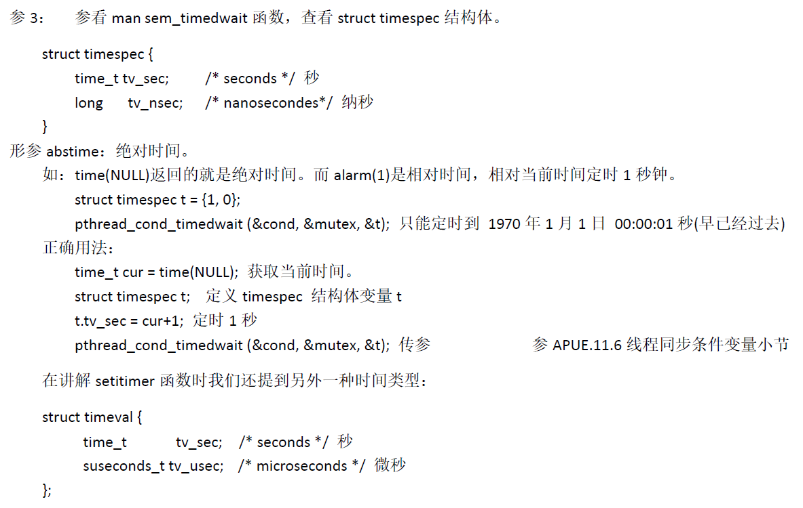

### 条件变量函数

#### 条件变量初始化、销毁

```c++
#include<pthread.h>

//静态初始化
pthread_cond_t cond = PTHREAD_COND_INITIALIZER;

//动态初始化
int pthread_cond_init(pthread_cond_t*restrict cond,const pthread_condattr_t*restrict attr);

//条件变量销毁
int pthread_cond_destroy(pthread_cond_t*cond);

返回值：
    成功，0
    失败，错误号
参数：
    cond：条件变量
    attr：属性
```

#### 等待条件变量函数

```c++
#include<pthread.h>

//阻塞等待条件变量
int pthread_cond_wait(pthread_cond_t*restrict cond,pthread_mutex_t*restrict mutex);

//限时等待一个条件变量
int pthread_cond_timewait(pthread_cond_t*restrict cond,pthread_mutex_t*restrict mutex,
                          const struct timespec*restrict abstime);

返回值：
    成功，0
    失败，错误号

参数：
    cond：条件变量
    mutex：互斥量
    abstime：绝对时间（自1970年1月1日0点0分0秒）
```





#### 唤醒线程

```c++
#include<pthread.h>

//唤醒至少一个阻塞在条件变量上的线程
int phread_cond_signal(pthread_cond_t*cond);

//唤醒全部阻塞在条件变量上的线程
int pthread_cond_broadcast(pthread_cond_t*cond);

返回值：
    成功，0
    失败，错误号
```

