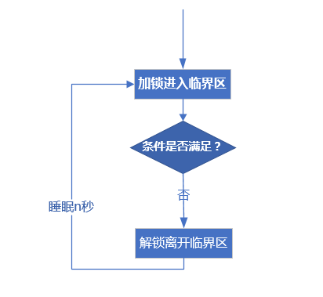

# Linux条件变量pthread_condition细节（为何先加锁，pthread_cond_wait为何先解锁，返回时又加锁）


# 本文目的


  首先说明，本文重点不在怎么用条件变量。这里我先列出 **apue** 中对于pthread_cond_wait函数的这么一段话：

> “ 调用者把**锁住的互斥量传给函数**，函数然后自动把调用线程放到等待条件的线程列表上，**对互斥量解锁。**这就关闭了条件检查和线程进入休眠状态等待条件改变这两个操作之间的时间通道，这样线程就不会错过条件的任何变化。**pthread_cond_wait返回时，互斥量再次被锁住。**”
>

  这段话的信息量很大，其中关于互斥量的操作可以理解为以下三个点：

1. ==**调用pthread_cond_wait前需要先对互斥量mutex上锁，才能把&mutex传入pthread_cond_wait函数**==
2. ==**在pthread_cond_wait函数内部，会首先对传入的mutex解锁**==
3. ==**当等待的条件到来后，pthread_cond_wait函数内部在返回前会去锁住传入的mutex**==

  我当时看到这里，各种疑问，传入前为何要锁，传入后为何要释放，返回时又为何再次锁？

本文就这三个问题进行详细解释。不过在此之前，我们需要了解为什么要有条件变量。即条件变量的作用。

------

# 为何需要条件变量

如果没有条件变量，那么我们等待一个条件满足则会是下面这样的模型：

  

​		首先加锁进入临界区去查看条件是否满足，不满足则解锁离开临界区，睡眠一段时间再继续循环判断。在这种情况下如果刚离开临界区，条件变为满足，那么线程必须还要等一段时间重新进入临界区才能知道条件满足（如果在这段时间内，条件依旧一直保持满足的话），如果这一小段时间条件又变为不满足，那么这个线程还要继续循环判断。不断地加锁解锁（会影响使用同一把锁的其他线程），还不能第一时间收到条件满足。**这种模型既费时又开销大。**

  **所以条件变量的产生，正是为了不循环加锁解锁，并且第一时间收到条件满足的通知。**

------

# 三个问题


  要回答那三个问题，那么首先需要明白 等待与唤醒的配合。

  下图是我参考其他人的图（原图有误）更正后所画的。其实这个图就能解释那三个问题：==**pthread_cond_wait传入前为何要锁，传入后为何先解锁，以及返回前为何再锁**==。不过我还是详细解释一下。

  图中有一个关键点，就是判断条件是否满足，是在调用pthread_cond_wait之前，上锁之后，就是说pthread_cond_wait不具备判断条件的能力，需要我们在外部写判断语句。

1. **条件不满足时，才会进入pthread_cond_wait**
2. **进入pthread_cond_wait先解锁就马上阻塞**
3. **pthread_cond_signal唤醒的是阻塞在pthread_cond_wait的进程**

可以结合下面的代码会更清楚。

以下pthread_cond_wait和pthread_cond_signal的通常用法的伪代码(条件为：value是不是大于0)：

```cpp
lock(&mutex);
while(value<=0){//需要value>0所以 value<=0就条件不满足
    pthread_cond_wait(&cond,&mutex);
}
unlock(&mutex);

lock(&mutex);
if(value==0){
    value++;
}

if(value>0){
    pthread_cond_signal(&cond);
}
unlock(&mutex);

```

把这个基本流程弄清楚后，就可以解释那三个问题了。

------

## 传入前锁mutex


  为了方便大家观看，每个问题的解释我都会再次把上图贴出。

​		**传入前锁mutex是为了保证线程从条件判断到进入pthread_cond_wait前，条件不被改变。**

  如果没有传入前的锁。就会有这样的情况：线程A判断条件不满足之后，调用pthread_cond_wait之前，A因为休眠，或者因为多线程下，多个线程执行顺序和快慢的因素，令线程B更改了条件，使得条件满足。但此时线程A还没有调用pthread_cond_wait。等到线程A又启动调用pthread_cond_wait后虽然条件满足，但却收不到pthread_cond_signal的唤醒，就一直阻塞下去。

------

## 传入后解锁mutex


**传入后解锁是为了条件能够被改变**

  传入后的解锁，是因为调用pthread_cond_signal的那部分，需要先加锁更改条件后才调用pthread_cond_signal。（更改条件与等待条件满足，都是针对条件这一个资源的竞争，所以调用pthread_cond_wait和调用pthread_cond_signal的两个线程需要同一把锁）

  如果pthread_cond_wait内不对mutex解锁，那么在调用pthread_cond_wait后，其他线程就不能更改条件，条件就会一直不满足。

## 返回前再次锁mutex


1. **返回前再次锁mutex是为了保证线程从pthread_cond_wait返回后 到 再次条件判断前不被改变。**
2. **保证 在pthread_cond_signal之后与解锁mutex之间可能需要的其他语句能够执行**

  对于1，这里的理由与传入pthread_cond_wait前锁mutex的理由差不多。如果不锁，那么线程A调用pthread_cond_wait后，条件满足，线程A被唤醒，从pthread_cond_wait返回。线程B在此时更改了条件，使得条件不满足。线程A并不知道条件又被更改，还是以为条件满足，就可能出错。

  对于2，只要在pthread_cond_signal之后与解锁mutex之间有其他语句需要执行，那么由于mutex在这时已经被这个线程锁，还没有解锁，所以调用pthread_cond_wait的那个线程在pthread_cond_wait返回前的锁mutex的行为就会阻塞，直到pthread_cond_signal后的语句执行完解锁，pthread_cond_wait才会返回。

说到这里就顺便说一下，由于pthread_cond_wait返回再次锁的行为，pthread_cond_signal不一定放在 lock（）和unlock（）中间。

### pthread_cond_signal的两种写法

```cpp
lock(&mutex);
//一些操作
pthread_cond_signal(&cond);
//一些操作
unlock(&mutex);
12345
```

  缺点：在某些线程的实现中，会造成等待线程从内核中唤醒（由于cond_signal)回到用户空间，然后pthread_cond_wait返回前需要加锁，但是发现锁没有被释放，又回到内核空间所以一来一回会有性能的问题。
  但是在LinuxThreads或者NPTL里面，就不会有这个问题，因为在Linux 线程中，有两个队列，分别是cond_wait队列和mutex_lock队列， cond_signal只是让线程从cond_wait队列移到mutex_lock队列，而不用返回到用户空间，不会有性能的损耗。所以Linux中这样用没问题。

 

```cpp
lock(&mutex);
//一些操作
unlock(&mutex);
pthread_cond_signal(&cond);
1234
```

优点：不会出现之前说的那个潜在的性能损耗，因为在signal之前就已经释放锁了

缺点：如果unlock之后signal之前，发生进程交换，另一个进程（不是等待条件的进程）拿到这把梦寐以求的锁后加锁操作，那么等最终切换到等待条件的线程时锁被别人拿去还没归还，只能继续等待。