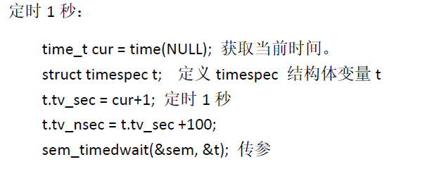

### 信号量函数

#### 信号量的创建与销毁

```c++
#include<semaphore.h>

//初始化一个信号量
int sem_init(sem_t*sem,int pshared,unsigned int value);

//销毁一个信号量
int sem_destroy(sem_t*sem);

返回值：
    成功，0
    失败，-1
参数：
    sem：信号量
    pshared：取0用于线程间，取非0（一般为1）用于进程间
    value：指定信号量的初值，决定了占用信号量的线程个数
```

#### 信号量加锁

```c++
#include<semaphore>

//对信号量加锁，阻塞
int sem_wait(sem_t*sem);

//尝试对信号量加锁，非阻塞
int sem_trywait(sem_t*sem);

//限时对信号量加锁
int sem_timewait(sem_t*sem,const struct timespec*abstimeout);

返回值：
    成功，0
    失败，-1
    
参数：
    sem：信号量
    abstimeout：绝对时间
```



#### 信号量解锁

```c++
#include<semaphore.h>

//给信号量解锁
int sem_post(sem_t*sem);

```

