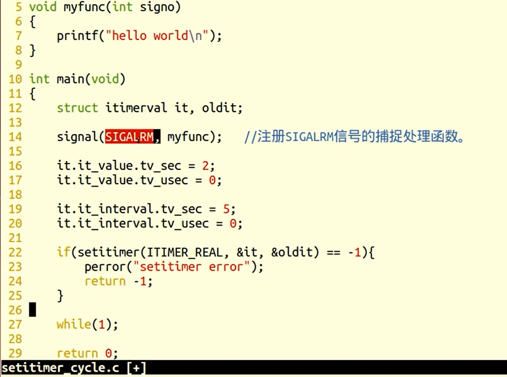
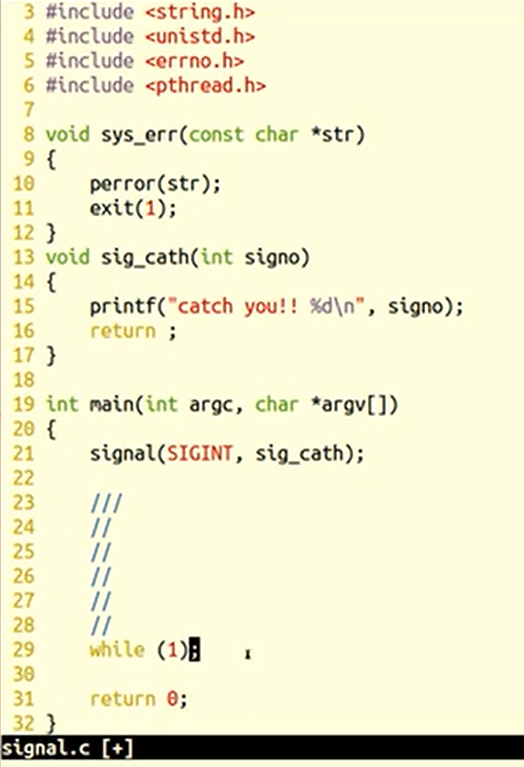
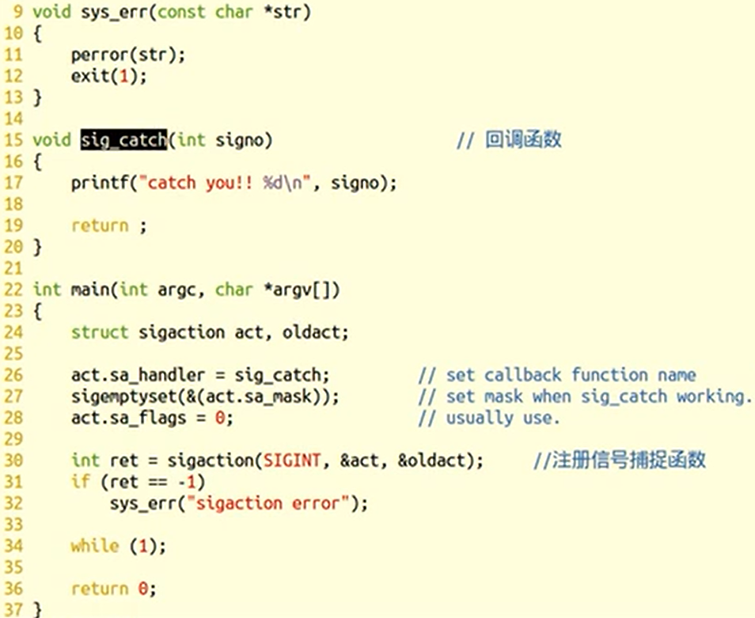

### kill	发送信号函数

- 作用：给进程传递信号

```c++
#include<signal.h>

int kill(pid_t pid , int sig);

	pid>0,发送信号给指定进程
	pid=0,发信号给统一进程组的所有进程
    pid<-1,发信号给 |pid| 进程组
    pid=-1，发信号给有权利发送的系统中的所有进程
        
返回值：
        成功，0
        失败，-1
```


### raise	发送信号函数

作用：允许进程向自身发送信号

```c++
#include<signal.h>

int raise(int signo);

返回值:
	成功，0
    失败，-1
     
        
raise(signo);
等价于
kill(getpid(),signo);
    
```


### abort	进程终止函数

- 作用：向调用进程发送 SIGABRT,使进程异常终止

```c++
#include<stdlib.h>

void abort(void);
```


### alarm	定时函数

```c++
#include<unistd.h>

unsigned int alarm(unsigned int seconds);

返回值：
    0，或剩余的描述，无失败情况
参数：
    seconds，定时秒数
    
```


### setitimer	精细定时函数

```c++
#include<unistd.h>

int setitimer(int which,const struct itimerval*new_value,struct itimerval*old_value);

返回值：
    成功，0
    失败，-1
参数：
    which，计时方法
    	ITIMER_REAL（实际运行时间）
    	ITIMER_VIRTUAL（用户空间）
    	ITIMER_PROF（用户空间+内核空间）
    new_value,设定时间
    old_value,剩余时间
   
```

- struct itimerval   和 struct  timeval

```c++
struct itimerval {
   struct timeval it_interval; /* next value */
   struct timeval it_value;    /* current value */
};

 struct timeval {
   time_t      tv_sec;         /* seconds */
   suseconds_t tv_usec;        /* microseconds */
};

```


- setitimer的使用




### 信号集函数

```c++


sigset_t set;	//typedef unsigned long sigset_t ;

int sigemptyset(sigset_t * set);将	//将信号集set清0
int sigfillset(sigset_t*set);		//将信号集set全置1
int sigaddset(sigset_t*set , int signum);	//将某个信号加入信号集set
int sigdelset(sigset_t*set , int signum);	//将某个信号清除信号集

返回值：
    成功，0
    失败，-1
    
    
int sigismember(const sigset_t*set , int signum);	//判断某个信号是否在set中

返回值：
    在集合中，1
    不在，0
    出错，-1
```


### sigprocmask	子进程屏蔽机函数

- 作用：1.屏蔽信号；

  ​			2.解除屏蔽

- 若调用sigprocmask解除当前信号的阻塞，则在返回前，至少将其中一个信号递达

```c++


int sigprocmask(int how , const sigset_t*set , sigset_t*oldset);

返回值：
    成功，0
    失败，-1
    
参数：
    set:传入参数，位图，set中哪一位为1，则表示当前进程屏蔽哪一个信号
	oldset：传出参数，保存旧的信号集
	how：假设当前信号屏蔽集为mask
        1.SIG_BLOCK:set表示需要屏蔽的信号，mask=mask|set
		2.SIG_UNBLOCK:set表示需要解除屏蔽的信号，mask=mask&~set
		3.SIG_SETMASK:set表示用于替代就屏蔽集的新屏蔽集，mask=set
```


### sigpending	未决信号集函数

- 作用：读取当前进程的未决信号集

```c++
int sigpending(sigset_t*set);

返回值：
    成功，0
    失败，-1
```


- 信号屏蔽函数的使用


### signal	信号捕捉函数

- 作用：注册一个信号捕捉函数（不常用）

```c++
typedef void(*sighandler_t)(int);

sighandler signal(int signum , sighandler_t handler);

返回值：
    成功，0
    失败，-1
       
```


- signal的使用




### sigaction	信号捕捉函数

- 作用：注册一个信号捕捉函数

```c++


int sigaction(int signum , const struct sigaction*act , struc sigaction*oldact);

返回值：
    成功，0
    失败，-1
    
参数：
    act：传入参数，新的处理方式
    oldact：传出参数，旧的处理方式


struct sigaction {
   void     (*sa_handler)(int);		//回调函数
   void     (*sa_sigaction)(int, siginfo_t *, void *);
   sigset_t   sa_mask;				//当前进程的屏蔽集
   int        sa_flags;				//默认为0，表示回调函数执行期间屏蔽当前信号
   void     (*sa_restorer)(void);
};

```


#### sigaction函数的使用




#### 用信号回收子进程


#### 


