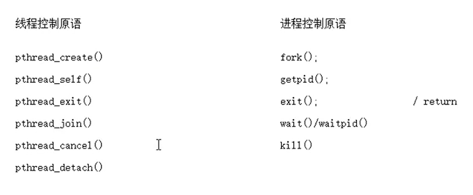
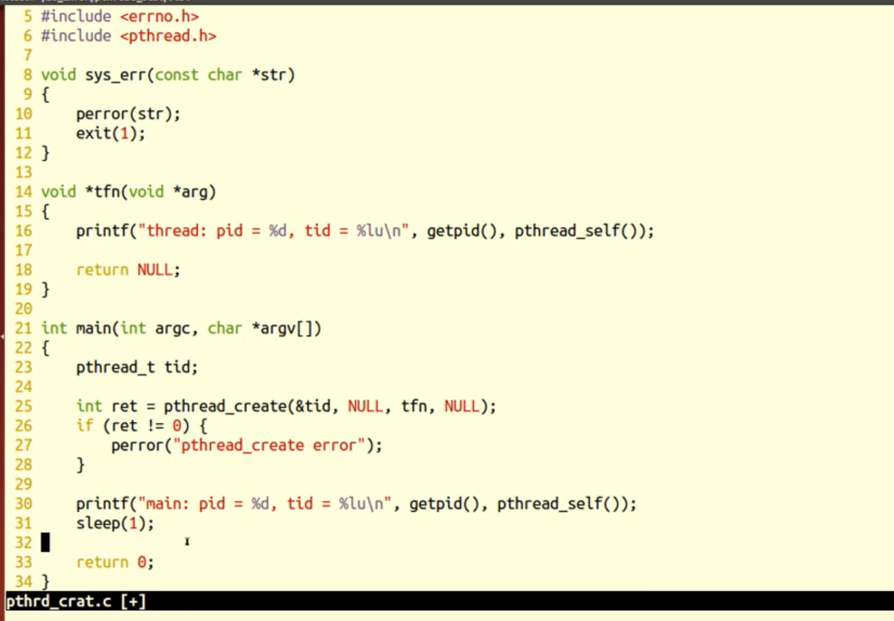
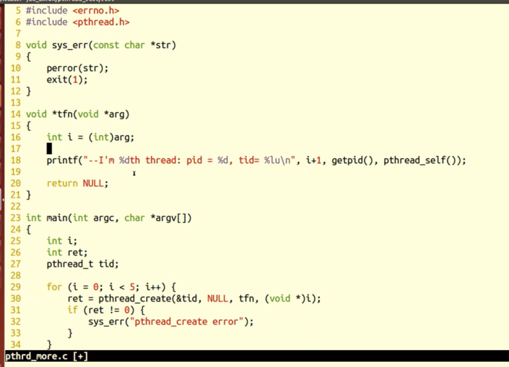
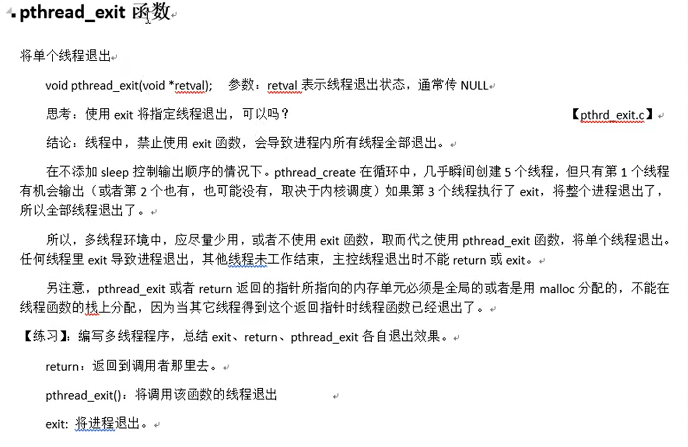
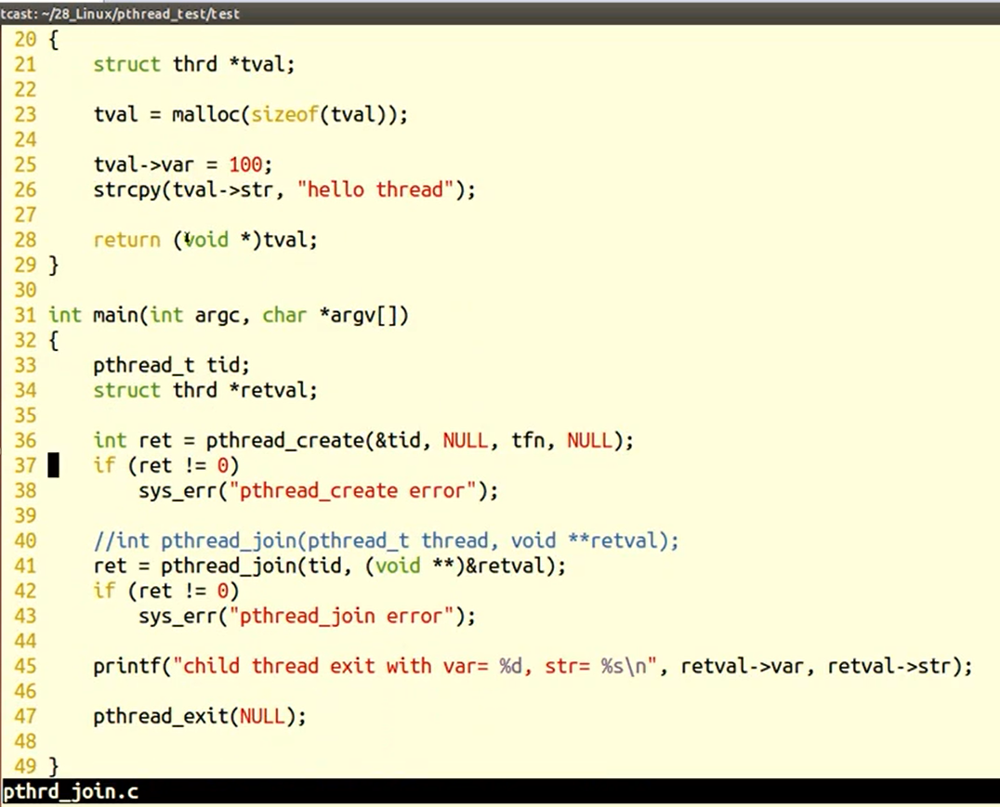
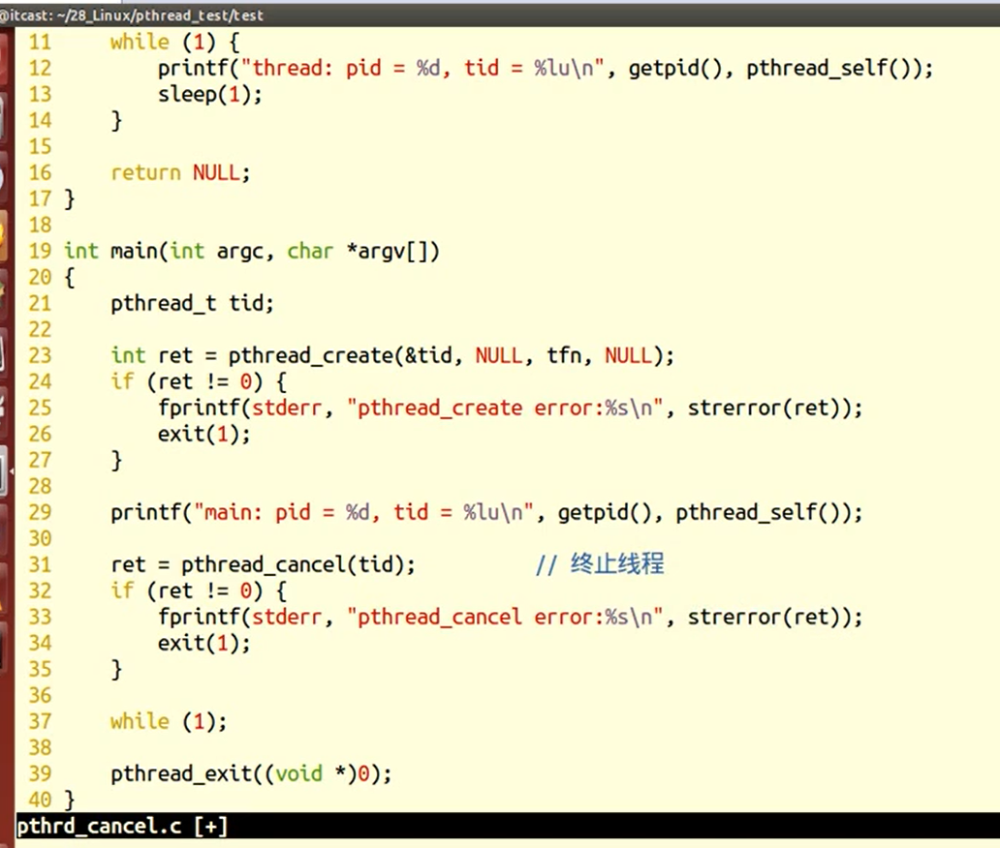
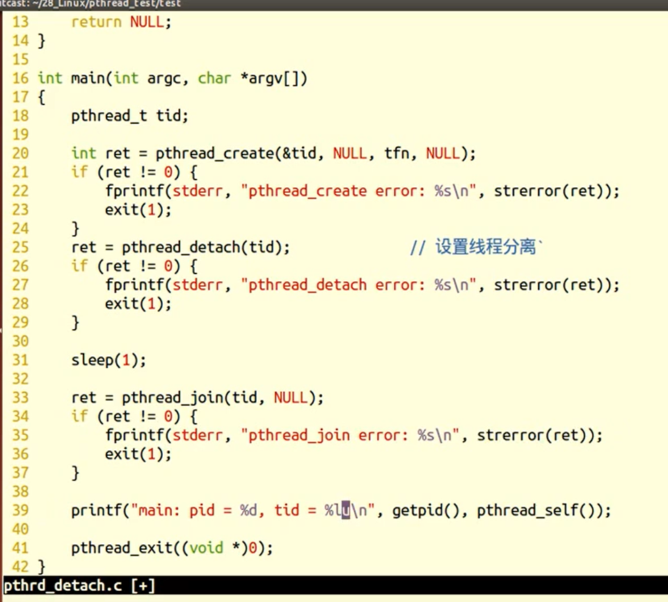
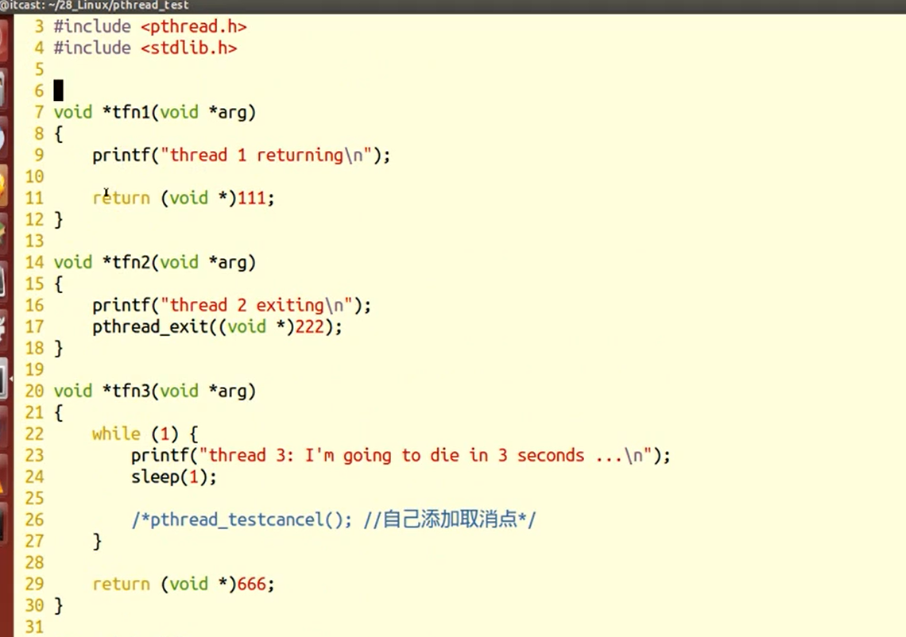
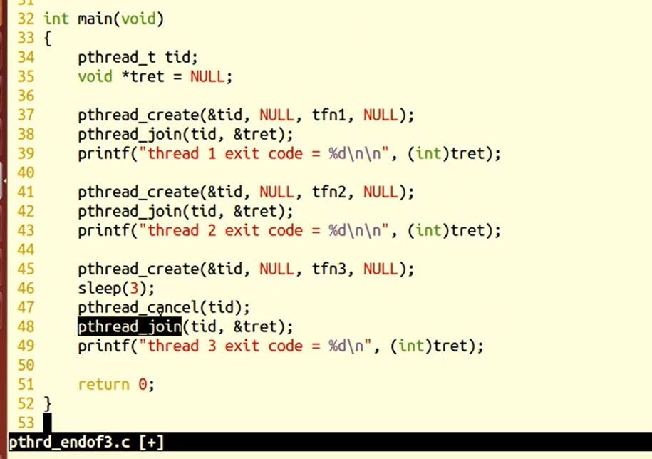

### 线程控制原语与进程控制原语对比



### 线程使用注意事项


### pthread_self	获取进程ID

- 获取线程ID（与LWP号不同）

```c++


pthread_t pthread_self(void);

返回值：（pthread_t 是一个无符号整形）
    成功，0
    失败，无
    
    
```





### pthread_creat	创建线程

- 编译和链接时需要增加 -pthread
- 主从线程共享全局变量

```c++


int pthread_create(pthread_t*thread , const pthread_attr_t*arr,
                   void*(*start routine)(void*),void*arg);

返回值：
    成功，0
    失败，错误号
    
参数：
    thread:传出参数，保存系统为我们分配的线程ID
    arr:常传NULL，表示默认属性
    参数3：指向线程的主函数，函数运行结束，线程结束（资源未回收）
    arg：线程主函数执行期间使用的参数

```


- 循环创建多个子线程




### pthread_exit	退出线程

- 退出当前线程

```c++


void pthread_exit(void*retval);

retval:表示线程退出状态，常传NULL
    
exit:退出进程
return：返回调用函数
```




### pthread_join	回收线程

- 阻塞等待线程结束，并获取线程退出状态

```c++


int pthread_join(pthread_t thread,void**retval);

返回值：
    成功，0
    失败，错误号
    
参数：
    thread：线程ID
    retval：存储线程结束状态
```


- 线程回收




### pthread_cancel	取消线程

- 线程的取消并非实时，需要等待线程到达取消点（进入内核，可调用pthread_testcancel() 设置取消点）

```c++


int pthread_cancel(pthread_t thread);

返回值：
    成功，0
    失败，错误号
```


- pthread_cancel 使用




### pthread_detach	分离线程

- 实现线程的分离

```c++


int pthread_detach(pthread_t thread);

返回值：
    成功，0
    失败，错误号
```

- 线程分离




### 三种进程结束方式比较






