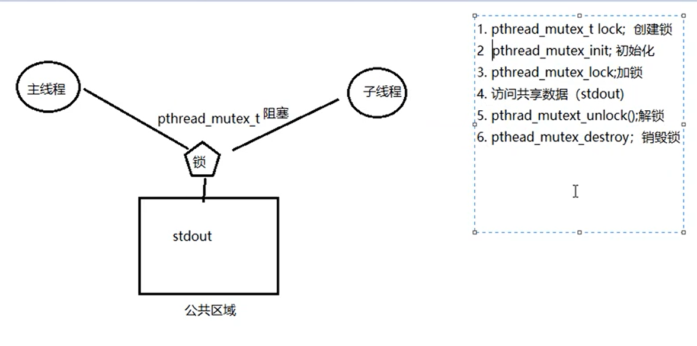

### 互斥锁函数

#### 互斥锁的初始化与销毁

```c++
#include<pthread.h>

//静态初始化
pthread_mutex_t mutex = PTHREAD_MUTEX_INITIALIZER;


//动态初始化
int pthread_mutex_init(pthread_mutex_t*restrict mutex,
                      const pthread_mutexattr_t*restrict attr);

//销毁互斥锁
int pthread_mutex_destroy(pthrad_mutex_t*mutex);

返回值：
    成功，0
    失败，错误号
    
参数：
    pthread_mutex_t:本质是一个结构体，互斥量变量，可做整型对待
	mutex:互斥量，传出参数
	attr:互斥量属性，常传NULL，选择默认线程间共享

```

#### 加锁、尝试加锁、解锁函数

```c++
#include<pthread.h>

//加锁，阻塞
int pthread_mutex_lock(pthread_mutex_t*mutex);

//尝试加锁，不阻塞
int pthread_mutex_trylock(pthread_mutex_t*mutex);

//解锁，将阻塞在该锁上的所有线程唤醒，默认先阻塞、先唤醒
int pthread_mutex_unlock(pthread_mutex_t*mutex);

返回值：
    成功，0
    失败，错误号
```


### 互斥锁模型




### 互斥量例程


