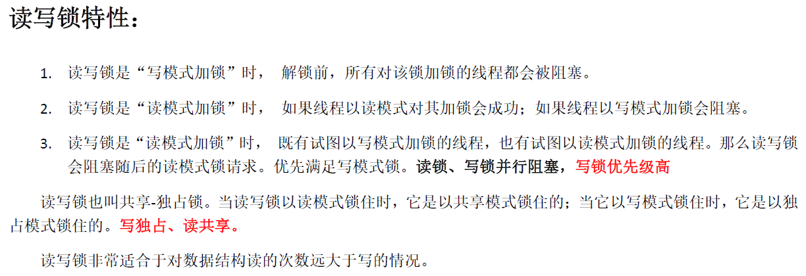

### 读写锁函数

#### 读写锁初始化、销毁

```c++
#include<pthread.h>

//初始化一把读写锁
int pthread_rwlock_init(pthread_rwlock_t*restrict rwlock,
                       const pthread_rwlockattr_t*restrict attr);

//销毁一把读写锁
int pthread_rwlock_destroy(pthread_rwlock_t*restrict rwlock);

返回值：
    成功，0
    失败，错误号
    
参数：
    rwlock:读写锁
	attr:属性，常传NULL
```

#### 以读方式加锁

```c++
#include<pthread.h>

//以阻塞方式加读锁
int pthread_rwlock_rdlock(pthread_rwlock_t*rwlock);

//以非阻塞方式加读锁
int pthread_rwlock_tryrdlock(pthread_rwlock_t*rwlock);

返回值：
    成功，0
    失败，错误号
```

#### 以写方式加锁

```c++
#include<pthread.h>

//以阻塞方式加写锁
int pthread_rwlock_wrlock(pthread_rwlock_t*rwlock);

//以非阻塞方式加写锁
int pthread_rwlock_trywrlock(pthread_rwlock_t*rwlock);

返回值：
    成功，0
    失败，错误号
```

#### 解锁

```c++
#include<pthread.h>

int pthread_rwlock_unlock(pthread_rwlock_t*rwlock);

返回值：
    成功，0
    失败，错误号
```


### 读写锁模型





### 读写锁使用例程

